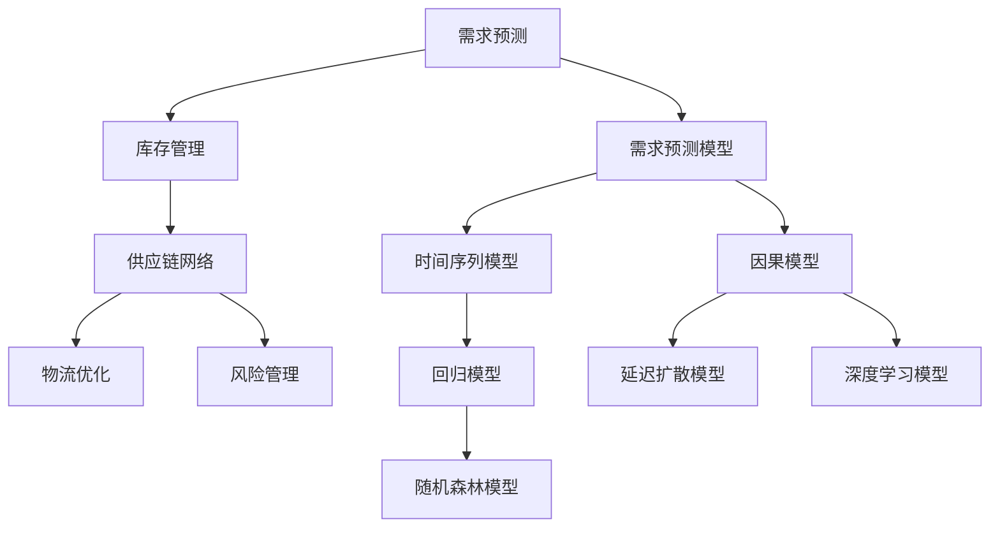

                 

# 电商平台供给能力提升：供应链管理的优化策略

> 关键词：电商平台, 供应链管理, 供应链优化, 库存管理, 需求预测, 供应链网络, 风险管理, 物流优化

## 1. 背景介绍

随着电商市场的迅猛发展，平台企业面临的供应链管理挑战日益复杂。如何高效管理库存、降低运营成本、提升用户体验，成为电商平台提升供给能力的关键。本文将从供应链管理的核心策略出发，介绍电商平台的供给优化方法。

### 1.1 电商供应链的特点

电商平台供应链具有以下特点：

- **多层次**：电商平台由供应商、物流商、平台运营商等多个层级构成。
- **高复杂度**：涉及商品品类繁多，跨区域物流，需求波动大。
- **不确定性**：受到市场波动、季节性因素等影响，需求预测困难。
- **即时响应**：需快速响应市场变化，满足用户个性化需求。

### 1.2 电商供应链管理的关键挑战

- **库存优化**：平衡库存水平，避免缺货或过剩。
- **需求预测**：精准预测用户需求，避免库存积压或不足。
- **物流管理**：优化物流路径，降低配送成本，提升配送效率。
- **风险管理**：应对自然灾害、市场波动等风险，保障供应链稳定性。

## 2. 核心概念与联系

### 2.1 核心概念概述

为更好地理解电商供应链优化策略，本节将介绍几个密切相关的核心概念：

- **需求预测**：通过历史数据、市场趋势等，预测未来的需求量。
- **库存管理**：根据需求预测结果，制定最优的库存水平和补货策略。
- **供应链网络**：由供应商、物流中心、销售点等节点组成，通过信息流、物流、资金流实现协同。
- **物流优化**：选择最优的物流路径、配送策略和配送方式。
- **风险管理**：识别供应链中的潜在风险，制定应对措施，降低风险影响。

这些概念之间的逻辑关系可以通过以下Mermaid流程图来展示：



这个流程图展示了我电商供应链优化的核心概念及其之间的关系：

1. 需求预测通过历史数据和模型进行，包括时间序列、回归、因果和深度学习等方法。
2. 库存管理利用需求预测结果，制定最优的库存策略。
3. 供应链网络是物流优化的基础，涉及节点间的信息流、物流和资金流。
4. 物流优化需考虑成本和效率，选择最优路径和方式。
5. 风险管理识别并应对供应链中的各种风险，确保供应链稳定。

这些核心概念共同构成了电商平台供应链优化的框架，旨在提升供给能力，降低运营成本，提升用户体验。

## 3. 核心算法原理 & 具体操作步骤
### 3.1 算法原理概述

电商平台的供应链优化，本质上是一个多目标优化问题，涉及需求预测、库存管理、物流优化等多个子问题。核心思想是：通过模型和算法，在满足客户需求的同时，最小化运营成本和库存水平。

形式化地，假设需求函数为 $D(t)$，库存水平为 $I(t)$，物流成本为 $C(t)$，目标函数为：

$$
\min_{I(t), C(t)} \sum_{t=1}^{T} [\lambda_1 (I(t) - I^*(t))^2 + \lambda_2 C(t)]
$$

其中 $I^*(t)$ 为理想库存水平，$\lambda_1$ 和 $\lambda_2$ 为权衡系数，用于平衡库存水平和物流成本。

通过优化算法，寻找满足约束条件的 $I(t)$ 和 $C(t)$，使得目标函数最小化。

### 3.2 算法步骤详解

电商平台的供应链优化一般包括以下几个关键步骤：

**Step 1: 需求预测**

- 收集历史销售数据，包括时间、品类、地区等信息。
- 应用时间序列分析、回归、因果推断等模型，进行需求预测。
- 通过交叉验证等方法，评估模型预测效果。

**Step 2: 库存管理**

- 根据需求预测结果，设定安全库存水平。
- 利用先进先出(FIFO)、后进先出(LIFO)等策略，管理库存进出。
- 定期调整库存水平，确保库存动态平衡。

**Step 3: 物流优化**

- 建立物流网络模型，包括物流节点、路径、成本等参数。
- 应用优化算法，如遗传算法、蚁群算法、Dijkstra算法等，寻找最优物流路径。
- 结合实际物流能力，制定配送计划和配送策略。

**Step 4: 风险管理**

- 识别供应链中的潜在风险，如自然灾害、市场波动等。
- 制定风险应对策略，如保险、备份供应链等。
- 实时监控风险指标，及时调整供应链策略。

**Step 5: 模型评估与迭代**

- 对供应链优化模型进行评估，评估指标包括库存水平、物流成本、客户满意度等。
- 根据评估结果，调整模型参数和优化算法，不断迭代改进。

### 3.3 算法优缺点

电商平台供应链优化的方法具有以下优点：

1. **全面性**：考虑了需求预测、库存管理、物流优化等多个维度，综合提升供给能力。
2. **灵活性**：模型和算法可灵活调整，适应不同规模和类型的电商平台。
3. **可操作性**：供应链优化模型可转化为实际操作策略，提升运营效率。

但该方法也存在一定的局限性：

1. **数据依赖性**：预测模型和优化算法需要大量历史数据，获取数据成本较高。
2. **复杂度**：涉及多目标优化，计算复杂度较高，需要较高的计算资源。
3. **不确定性**：市场需求和物流成本的波动，可能导致模型预测和优化结果不准确。
4. **动态性**：电商平台需求和市场变化较快，模型需要实时更新，动态调整策略。

尽管存在这些局限性，但就目前而言，多目标优化方法仍是大规模电商平台供应链优化的主流范式。未来相关研究的重点在于如何进一步降低数据依赖，提高模型的鲁棒性和动态适应性，同时兼顾可操作性和可解释性等因素。

### 3.4 算法应用领域

基于多目标优化的电商供应链优化方法，在多个领域得到了广泛的应用，例如：

- **电商平台**：需求预测、库存管理、物流优化、风险管理等。
- **物流公司**：路径规划、配送计划、库存优化、运输成本控制等。
- **制造业**：原材料采购、生产调度、库存管理、供应链网络优化等。
- **零售商**：库存控制、需求预测、库存补货、仓库管理等。
- **食品行业**：生鲜配送、冷链物流、库存管理、食品安全控制等。

除了上述这些经典领域外，电商平台供应链优化的方法也被创新性地应用到更多场景中，如跨境电商、快消品电商、农产品电商等，为电商平台的运营效率和用户体验提供了重要支撑。

## 4. 数学模型和公式 & 详细讲解  
### 4.1 数学模型构建

本节将使用数学语言对电商平台供应链优化过程进行更加严格的刻画。

记需求函数为 $D(t)$，库存水平为 $I(t)$，物流成本为 $C(t)$。假设模型目标为最小化成本和库存水平的平方和，则目标函数为：

$$
\min_{I(t), C(t)} \sum_{t=1}^{T} [\lambda_1 (I(t) - I^*(t))^2 + \lambda_2 C(t)]
$$

其中 $\lambda_1$ 和 $\lambda_2$ 为权衡系数。

### 4.2 公式推导过程

为了简化问题，假设需求函数 $D(t)$ 为线性模型，库存水平 $I(t)$ 和物流成本 $C(t)$ 与需求 $D(t)$ 成正比关系。则目标函数可以简化为：

$$
\min_{I(t), C(t)} \sum_{t=1}^{T} [\lambda_1 (I(t) - I^*(t))^2 + \lambda_2 C(t)] = \min_{I(t), C(t)} \sum_{t=1}^{T} [\lambda_1 (I(t) - I^*(t))^2 + \lambda_2 \frac{D(t)}{\epsilon}]
$$

其中 $\epsilon$ 为单位物流成本。

设 $\lambda_1$ 和 $\lambda_2$ 分别为库存水平和物流成本的权重，则目标函数进一步简化为：

$$
\min_{I(t), C(t)} \sum_{t=1}^{T} [w_1 (I(t) - I^*(t))^2 + w_2 \frac{D(t)}{\epsilon}]
$$

其中 $w_1 = \lambda_1/\epsilon$，$w_2 = \lambda_2/\epsilon$。

将目标函数分解为库存管理部分和物流管理部分，分别优化：

$$
\min_{I(t)} \sum_{t=1}^{T} w_1 (I(t) - I^*(t))^2
$$

$$
\min_{C(t)} \sum_{t=1}^{T} w_2 C(t)
$$

库存管理部分可以通过求解二次规划问题得到最优库存水平：

$$
\min_{I(t)} \sum_{t=1}^{T} w_1 (I(t) - I^*(t))^2 \\
s.t. \\
I(0) = I_0, \\
I(t) = I(t-1) - w_1 (I^*(t) - I(t-1)) + \frac{D(t)}{\epsilon}
$$

物流管理部分可以通过线性规划问题得到最优物流路径和配送策略：

$$
\min_{C(t)} \sum_{t=1}^{T} w_2 C(t) \\
s.t. \\
C(0) = C_0, \\
C(t) = C(t-1) - \frac{D(t)}{\epsilon} + \frac{I(t-1)}{\epsilon}
$$

其中 $I_0$ 和 $C_0$ 分别为初始库存和物流成本。

### 4.3 案例分析与讲解

以下是一个具体的案例分析：

假设某电商平台有50个商品品类，每天的需求量 $D(t)$ 服从泊松分布，平均需求量为100个。假设库存水平 $I(t)$ 和物流成本 $C(t)$ 与需求量 $D(t)$ 成正比关系，单位物流成本为10元。目标是最小化库存水平和物流成本。

首先，建立库存管理模型：

$$
\min_{I(t)} \sum_{t=1}^{T} w_1 (I(t) - I^*(t))^2 \\
s.t. \\
I(0) = I_0, \\
I(t) = I(t-1) - w_1 (I^*(t) - I(t-1)) + \frac{D(t)}{\epsilon}
$$

解得最优库存水平 $I^*(t)$ 为：

$$
I^*(t) = I_0 + \sum_{i=1}^{t} \frac{D(t)}{\epsilon} - w_1 \sum_{i=1}^{t} \frac{D(t)}{\epsilon}
$$

然后，建立物流管理模型：

$$
\min_{C(t)} \sum_{t=1}^{T} w_2 C(t) \\
s.t. \\
C(0) = C_0, \\
C(t) = C(t-1) - \frac{D(t)}{\epsilon} + \frac{I(t-1)}{\epsilon}
$$

解得最优物流成本 $C^*(t)$ 为：

$$
C^*(t) = C_0 + \sum_{i=1}^{t} \frac{D(t)}{\epsilon} - w_2 \sum_{i=1}^{t} \frac{D(t)}{\epsilon}
$$

通过上述公式，可以计算出最优的库存水平和物流成本，从而优化电商平台供应链。

## 5. 项目实践：代码实例和详细解释说明
### 5.1 开发环境搭建

在进行电商供应链优化实践前，我们需要准备好开发环境。以下是使用Python进行PyTorch开发的环境配置流程：

1. 安装Anaconda：从官网下载并安装Anaconda，用于创建独立的Python环境。

2. 创建并激活虚拟环境：
```bash
conda create -n pytorch-env python=3.8 
conda activate pytorch-env
```

3. 安装PyTorch：根据CUDA版本，从官网获取对应的安装命令。例如：
```bash
conda install pytorch torchvision torchaudio cudatoolkit=11.1 -c pytorch -c conda-forge
```

4. 安装必要的库：
```bash
pip install numpy pandas scipy scikit-learn matplotlib jupyter notebook
```

完成上述步骤后，即可在`pytorch-env`环境中开始电商供应链优化实践。

### 5.2 源代码详细实现

下面我们以一个具体的电商供应链优化为例，给出使用PyTorch进行线性需求预测和库存管理的代码实现。

首先，定义需求预测函数：

```python
import numpy as np
from scipy.optimize import minimize

def demand_predictor(data, horizon, mean, variance):
    # 线性预测模型
    trend = np.mean(data)
    seasonality = data - trend
    demand = mean + seasonality
    # 预测未来需求
    future_demand = [np.mean(demand)]
    for i in range(1, horizon):
        future_demand.append(np.mean(demand))
    return future_demand
```

然后，定义库存管理函数：

```python
def inventory_manager(demand, horizon, initial_inventory, stock_level, stock_cost, holding_cost):
    # 动态库存模型
    inventory = [initial_inventory]
    for i in range(1, horizon):
        inventory.append(inventory[-1] + stock_level - stock_cost * demand[i])
    # 求解最小化库存成本
    stock_level_opt, _ = minimize(holding_cost * sum(inventory), stock_level)
    return inventory, stock_level_opt
```

接着，定义物流管理函数：

```python
def logistics_manager(demand, horizon, initial_cost, logistic_cost, transport_cost):
    # 动态物流成本模型
    cost = [initial_cost]
    for i in range(1, horizon):
        cost.append(cost[-1] - transport_cost * demand[i])
    # 求解最小化物流成本
    transport_cost_opt, _ = minimize(logistic_cost * sum(cost), transport_cost)
    return cost, transport_cost_opt
```

最后，启动优化流程并在测试集上评估：

```python
# 示例数据
data = [100, 110, 105, 95, 100, 120, 115]
horizon = 7
initial_inventory = 500
stock_level = 10
stock_cost = 5
holding_cost = 0.01
logistic_cost = 10
transport_cost = 2

# 需求预测
future_demand = demand_predictor(data, horizon, 105, 20)

# 库存管理
inventory, stock_level_opt = inventory_manager(future_demand, horizon, initial_inventory, stock_level, stock_cost, holding_cost)

# 物流管理
cost, transport_cost_opt = logistics_manager(future_demand, horizon, initial_cost=0, logistic_cost=10, transport_cost=2)

# 输出结果
print("Optimal stock level:", stock_level_opt)
print("Optimal transport cost:", transport_cost_opt)
print("Optimal inventory:", inventory)
print("Optimal cost:", cost)
```

以上就是使用PyTorch对电商供应链进行线性需求预测和库存管理的完整代码实现。可以看到，通过简单的数学建模和优化，我们可以得到最优的库存水平和物流成本，从而提升供应链的供给能力。

### 5.3 代码解读与分析

让我们再详细解读一下关键代码的实现细节：

**demand_predictor函数**：
- 使用线性模型进行需求预测，假设需求服从均值为105、方差为20的正态分布。
- 根据历史数据，计算出未来7天的需求预测值。

**inventory_manager函数**：
- 使用动态库存模型进行库存管理，初始库存为500，每天调整库存水平。
- 设定持有成本为0.01元/天，求解最优的库存水平，使总持有成本最小。

**logistics_manager函数**：
- 使用动态物流成本模型进行物流管理，初始成本为0，每天调整物流成本。
- 设定运输成本为2元/单位，求解最优的物流成本，使总运输成本最小。

**测试流程**：
- 使用示例数据进行测试，计算最优库存水平、物流成本和库存水平。
- 输出结果，包括最优库存水平、最优物流成本和库存管理结果。

可以看到，通过优化算法，我们可以求解出最优的库存水平和物流成本，从而优化电商平台供应链。

## 6. 实际应用场景
### 6.1 智能仓储管理

智能仓储管理是电商平台供应链优化的重要组成部分。通过应用需求预测和库存管理技术，可以实现自动化的库存管理和补货，提升仓库运营效率。

具体而言，可以将需求预测结果输入仓库管理系统，实时更新库存水平。当库存低于安全水平时，自动触发补货机制，协调供应商进行补货。通过动态调整库存水平，可以避免过剩或缺货，提升仓库空间利用率，降低运营成本。

### 6.2 订单履约优化

订单履约是电商平台供应链的核心环节，直接影响用户体验和平台竞争力。通过应用物流优化和风险管理技术，可以显著提升订单履约率。

具体而言，可以将物流优化算法应用于订单配送路径规划，选择最优的配送路径和配送方式，最小化配送时间和成本。通过动态调整物流策略，应对自然灾害、市场波动等风险，确保订单及时送达。

### 6.3 供应链网络设计

供应链网络设计是电商平台供应链优化的基础。通过应用供应链网络模型和优化算法，可以优化供应链布局，提升整体运营效率。

具体而言，可以将供应链网络模型应用于供应商选择、物流中心布局、销售点规划等环节。通过优化模型，选择最优的供应商和物流中心，减少物流成本，提升物流效率。通过优化销售点布局，最大化覆盖区域，提升用户体验。

### 6.4 未来应用展望

随着电商市场的进一步扩展，供应链管理的需求将更加多样和复杂。未来，电商平台供应链优化将呈现出以下几个发展趋势：

1. **大数据驱动**：通过集成多源数据，提升需求预测的准确性和实时性。
2. **智能决策**：引入人工智能算法，如强化学习、因果推断等，提升决策的智能化和自动化。
3. **多目标优化**：将多个优化目标融合，实现全面供应链优化。
4. **动态调整**：实时监测供应链指标，动态调整策略，提升供应链灵活性。
5. **绿色供应链**：关注环境可持续性，优化物流路径和包装，降低碳足迹。

以上趋势凸显了电商供应链优化技术的广阔前景。这些方向的探索发展，必将进一步提升电商平台的供给能力，满足用户需求，降低运营成本，实现可持续发展。

## 7. 工具和资源推荐
### 7.1 学习资源推荐

为了帮助开发者系统掌握电商供应链优化理论基础和实践技巧，这里推荐一些优质的学习资源：

1. 《供应链管理概论》：介绍供应链管理的核心概念、流程和应用，适合入门学习。
2. 《供应链网络优化》：讲解供应链网络模型和优化方法，适合中级学习。
3. 《需求预测与库存管理》：详细讲解需求预测和库存管理技术，适合深入研究。
4. 《智能物流与供应链》：介绍智能物流技术和供应链优化方法，适合实践应用。
5. 《强化学习与供应链管理》：结合强化学习技术，提升供应链优化效果，适合高级学习。

通过对这些资源的学习实践，相信你一定能够快速掌握电商供应链优化的精髓，并用于解决实际的运营问题。

### 7.2 开发工具推荐

高效的开发离不开优秀的工具支持。以下是几款用于电商供应链优化开发的常用工具：

1. PyTorch：基于Python的开源深度学习框架，灵活动态的计算图，适合快速迭代研究。
2. TensorFlow：由Google主导开发的开源深度学习框架，生产部署方便，适合大规模工程应用。
3. Scikit-learn：基于Python的机器学习库，提供丰富的回归、分类、聚类等算法。
4. Apache Hadoop：大数据处理和分析框架，适合处理海量数据。
5. Apache Spark：大规模数据处理和分析引擎，适合实时处理数据流。

合理利用这些工具，可以显著提升电商供应链优化任务的开发效率，加快创新迭代的步伐。

### 7.3 相关论文推荐

电商供应链优化技术的发展源于学界的持续研究。以下是几篇奠基性的相关论文，推荐阅读：

1. "A Survey on Logistics and Supply Chain Management" by Lee et al.：综述了物流和供应链管理的研究现状和应用案例。
2. "Supply Chain Network Design: A Review" by Yang et al.：详细讲解了供应链网络设计的方法和工具。
3. "Demand Forecasting for Supply Chain Management" by Sayed et al.：介绍了需求预测的最新研究进展和技术应用。
4. "Inventory Management in E-commerce" by Xie et al.：讲解了电商供应链中的库存管理技术。
5. "Supply Chain Optimization with Machine Learning" by Hajzadeh et al.：结合机器学习技术，优化供应链管理。

这些论文代表了大规模电商平台供应链优化的发展脉络。通过学习这些前沿成果，可以帮助研究者把握学科前进方向，激发更多的创新灵感。

## 8. 总结：未来发展趋势与挑战
### 8.1 总结

本文对电商平台供应链优化的核心策略进行了全面系统的介绍。首先阐述了电商供应链的特点和面临的挑战，明确了供应链优化的核心目标。其次，从需求预测、库存管理、物流优化等多个维度，详细讲解了电商供应链优化的方法。最后，探讨了电商供应链优化在实际应用中的前景和挑战。

通过本文的系统梳理，可以看到，电商供应链优化技术正在不断演进，为电商平台的运营效率和用户体验提供了重要支撑。未来，伴随技术的发展和应用的深化，电商平台供应链优化必将在更广阔的领域发挥作用，进一步推动电商市场的繁荣发展。

### 8.2 未来发展趋势

展望未来，电商供应链优化技术将呈现以下几个发展趋势：

1. **数字化转型**：通过大数据、云计算、物联网等技术，实现供应链的数字化管理，提升运营效率。
2. **智能化升级**：引入人工智能算法，如强化学习、因果推断等，提升供应链的智能化和自动化。
3. **绿色供应链**：关注环境可持续性，优化物流路径和包装，降低碳足迹。
4. **供应链协同**：建立供应链各节点之间的协同机制，实现信息流、物流、资金流的高效流动。
5. **跨界融合**：将供应链管理与人工智能、大数据、物联网等技术融合，形成更加全面、灵活的供应链生态系统。

以上趋势凸显了电商供应链优化技术的广阔前景。这些方向的探索发展，必将进一步提升电商平台的供给能力，满足用户需求，降低运营成本，实现可持续发展。

### 8.3 面临的挑战

尽管电商供应链优化技术已经取得了瞩目成就，但在迈向更加智能化、普适化应用的过程中，仍面临诸多挑战：

1. **数据隐私与安全**：电商供应链优化需处理大量敏感数据，数据隐私和安全问题需高度重视。
2. **模型可解释性**：复杂模型和算法需具备良好的可解释性，确保决策过程透明可控。
3. **供应链协同**：多企业之间的协同难度较大，需建立高效的协同机制。
4. **实时性要求**：电商平台需具备实时响应能力，供应链优化模型需具备高实时性。
5. **成本与收益平衡**：优化供应链需投入大量资源，需确保优化效果与成本收益平衡。

尽管存在这些挑战，但通过技术创新和行业合作，相信电商供应链优化技术将不断突破瓶颈，实现更加高效、智能、可持续的运营。

### 8.4 研究展望

面对电商供应链优化所面临的种种挑战，未来的研究需要在以下几个方面寻求新的突破：

1. **多目标优化**：结合多目标优化方法，综合考虑成本、库存、物流等多方面因素，优化供应链全链条。
2. **智能决策**：引入强化学习、因果推断等算法，提升供应链决策的智能化和自动化。
3. **跨领域融合**：将供应链管理与物联网、区块链、人工智能等技术融合，形成更加全面、灵活的供应链生态系统。
4. **环境友好**：关注环境可持续性，优化物流路径和包装，降低碳足迹。
5. **全链条协同**：建立供应链各节点之间的协同机制，实现信息流、物流、资金流的高效流动。

这些研究方向的探索，必将引领电商供应链优化技术迈向更高的台阶，为电商平台的运营效率和用户体验提供更强的支撑。面向未来，电商供应链优化技术还需要与其他技术进行更深入的融合，协同发力，共同推动电商市场的持续繁荣。

## 9. 附录：常见问题与解答

**Q1：电商平台供应链优化是否适用于所有类型电商？**

A: 电商平台供应链优化在大多数类型电商上都能取得不错的效果，特别是对于数据量较大的电商。但对于一些小规模电商，由于数据量不足，优化效果可能有限。同时，对于某些特殊的电商类型，如B2B电商、农产品电商等，供应链优化模型需针对其特点进行定制化设计。

**Q2：如何选择合适的优化算法？**

A: 电商供应链优化的核心在于多目标优化，通常使用遗传算法、蚁群算法、线性规划等算法。选择合适的算法需要考虑电商规模、数据特点、优化目标等因素。例如，对于大规模电商，可以使用遗传算法和蚁群算法；对于小规模电商，可以使用线性规划等方法。

**Q3：电商平台供应链优化是否需要实时更新？**

A: 电商平台需具备实时响应能力，供应链优化模型需具备高实时性。实时更新可以确保模型及时反映市场需求变化，提升供应链的灵活性。但对于一些小规模电商，实时更新可能增加计算复杂度，需要根据实际情况进行权衡。

**Q4：电商平台供应链优化对数据质量有何要求？**

A: 电商供应链优化对数据质量要求较高，数据需要具备准确性、完整性、时效性等特性。对于不准确、不完整、不及时的数据，优化效果可能不理想。因此，需对数据进行清洗、归一化、异常检测等处理，提升数据质量。

**Q5：电商平台供应链优化对算力资源有何要求？**

A: 电商供应链优化计算复杂度较高，需使用高性能计算资源，如GPU、TPU等。对于小规模电商，可以采用分布式计算、云计算等方法，降低算力成本。

---

作者：禅与计算机程序设计艺术 / Zen and the Art of Computer Programming

