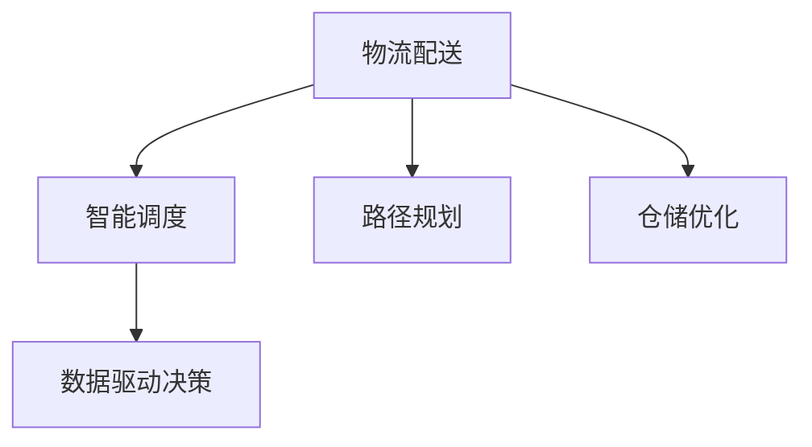

                 

# 电商平台供给能力提升：物流配送效率提升

## 1. 背景介绍

### 1.1 问题由来

随着电子商务的迅猛发展，物流配送已经成为制约电商平台供给能力提升的关键瓶颈。电商平台需要快速、高效、安全地将商品送达消费者手中，以满足用户需求，提升用户体验和满意度。但物流配送网络复杂，涉及仓储、运输、配送等多个环节，如何实现高效、稳定的物流配送体系，是一个难题。

### 1.2 问题核心关键点

目前，物流配送领域的核心挑战包括：

- 配送效率低下：物流网络覆盖不均衡，配送员调度不合理，导致配送效率低下。
- 成本控制困难：物流费用高昂，难以有效控制成本。
- 配送质量不稳定：配送人员水平不一，配送质量难以保证。
- 数据利用不足：现有数据资源未充分利用，缺乏有效的数据驱动决策。

### 1.3 问题研究意义

提升物流配送效率，对于电商平台的发展具有重要意义：

1. 缩短配送时间：通过优化配送路径、优化仓储布局，提升配送效率，缩短配送时间，提升用户满意度。
2. 降低配送成本：通过智能调度、数据驱动决策，减少物流费用，降低配送成本。
3. 提高配送质量：通过标准化作业流程、人员培训，提升配送质量，减少退货和投诉。
4. 数据驱动决策：通过数据分析和模型优化，实现数据驱动的决策，提高物流配送的科学性和准确性。

## 2. 核心概念与联系

### 2.1 核心概念概述

为更好地理解物流配送效率提升的方法，本节将介绍几个密切相关的核心概念：

- 物流配送：指将商品从仓库送达消费者手中的全过程，涉及仓储、运输、配送等多个环节。
- 智能调度：通过算法优化配送员调度，减少配送时间和成本。
- 路径规划：通过算法优化配送路径，缩短配送时间，提高配送效率。
- 仓储优化：通过算法优化仓储布局，减少物流成本，提升配送效率。
- 数据驱动决策：通过数据分析和模型优化，实现数据驱动的决策，提升物流配送的科学性和准确性。

这些核心概念之间的逻辑关系可以通过以下Mermaid流程图来展示：



这个流程图展示了大语言模型微调的逻辑关系：

1. 物流配送包括仓储、运输、配送等多个环节。
2. 智能调度和路径规划优化配送员和配送路径，提高配送效率。
3. 仓储优化通过优化仓储布局，减少物流成本。
4. 数据驱动决策通过数据分析和模型优化，实现数据驱动的决策，提升物流配送的科学性和准确性。

## 3. 核心算法原理 & 具体操作步骤
### 3.1 算法原理概述

物流配送效率提升的核心在于通过算法优化智能调度、路径规划、仓储优化等环节，实现高效、低成本、高质量的物流配送。

具体来说，包括以下几个关键算法：

- 智能调度算法：通过算法优化配送员调度，实现最优的配送路径和配送时间。
- 路径规划算法：通过算法优化配送路径，减少配送时间和成本。
- 仓储优化算法：通过算法优化仓储布局，减少物流成本，提升配送效率。
- 数据驱动决策算法：通过数据分析和模型优化，实现数据驱动的决策，提升物流配送的科学性和准确性。

### 3.2 算法步骤详解

#### 3.2.1 智能调度算法

智能调度算法的核心思想是通过优化配送员调度和路径规划，实现最优的配送时间和成本。

算法步骤：

1. 收集配送订单信息：包括订单数量、收货地址、预计配送时间等。
2. 收集配送员信息：包括配送员的位置、配送能力、配送历史等。
3. 路径规划：使用Dijkstra算法或A*算法计算出最短路径。
4. 配送员调度：使用遗传算法或模拟退火算法对配送员进行调度，使得配送时间和成本最小化。
5. 反馈优化：根据实际配送结果，不断优化路径和调度策略。

#### 3.2.2 路径规划算法

路径规划算法的核心思想是通过优化配送路径，减少配送时间和成本。

算法步骤：

1. 收集配送订单信息：包括订单数量、收货地址、预计配送时间等。
2. 收集配送员信息：包括配送员的位置、配送能力、配送历史等。
3. 路径规划：使用Dijkstra算法或A*算法计算出最短路径。
4. 路径优化：使用蚁群算法或粒子群算法对路径进行优化，减少配送时间和成本。
5. 反馈优化：根据实际配送结果，不断优化路径和调度策略。

#### 3.2.3 仓储优化算法

仓储优化算法的核心思想是通过优化仓储布局，减少物流成本，提升配送效率。

算法步骤：

1. 收集仓储数据：包括仓储容量、商品种类、存储位置等。
2. 商品分类：对商品进行分类，如高频商品、低频商品等。
3. 库存管理：使用ABC分析法对商品进行库存管理，优化库存量。
4. 仓库布局：使用遗传算法或模拟退火算法对仓库布局进行优化，减少物流成本。
5. 反馈优化：根据实际仓储结果，不断优化仓储布局和库存管理策略。

#### 3.2.4 数据驱动决策算法

数据驱动决策算法的核心思想是通过数据分析和模型优化，实现数据驱动的决策，提升物流配送的科学性和准确性。

算法步骤：

1. 数据收集：收集配送订单、配送员、仓库等数据。
2. 数据清洗：对数据进行清洗和预处理，去除噪声和异常值。
3. 数据分析：使用机器学习算法对数据进行分析，发现配送效率和成本之间的关系。
4. 模型优化：使用强化学习算法对模型进行优化，实现数据驱动的决策。
5. 反馈优化：根据实际配送结果，不断优化模型和决策策略。

### 3.3 算法优缺点

智能调度算法的优点包括：

- 提升配送效率：通过优化配送路径和配送员调度，减少配送时间和成本。
- 降低配送成本：通过路径规划和仓储优化，减少物流费用。
- 提高配送质量：通过智能调度和路径规划，减少配送时间和错误率。

智能调度算法的缺点包括：

- 算法复杂度高：需要大量的计算资源和时间。
- 实时性较差：难以实现实时调度。
- 依赖数据质量：数据质量对算法的准确性有很大影响。

路径规划算法的优点包括：

- 降低配送成本：通过优化配送路径，减少物流费用。
- 提升配送效率：通过计算最短路径，减少配送时间和错误率。

路径规划算法的缺点包括：

- 算法复杂度高：需要大量的计算资源和时间。
- 实时性较差：难以实现实时路径规划。
- 依赖数据质量：数据质量对算法的准确性有很大影响。

仓储优化算法的优点包括：

- 降低配送成本：通过优化仓储布局和库存管理，减少物流费用。
- 提升配送效率：通过优化仓储布局，减少配送时间和错误率。

仓储优化算法的缺点包括：

- 算法复杂度高：需要大量的计算资源和时间。
- 实时性较差：难以实现实时仓储管理。
- 依赖数据质量：数据质量对算法的准确性有很大影响。

数据驱动决策算法的优点包括：

- 提升配送效率：通过数据分析和模型优化，实现数据驱动的决策，提高配送效率。
- 降低配送成本：通过数据分析和模型优化，实现数据驱动的决策，降低配送成本。

数据驱动决策算法的缺点包括：

- 算法复杂度高：需要大量的计算资源和时间。
- 实时性较差：难以实现实时数据分析和决策。
- 依赖数据质量：数据质量对算法的准确性有很大影响。

### 3.4 算法应用领域

智能调度、路径规划、仓储优化、数据驱动决策等算法，已经在物流配送领域得到广泛应用，覆盖了从仓储管理到配送执行的各个环节，具体包括：

- 智能仓储管理：使用智能调度算法和路径规划算法，优化仓储布局和库存管理，减少物流成本，提升配送效率。
- 智能配送调度：使用智能调度算法和路径规划算法，优化配送员调度和配送路径，提升配送效率，降低配送成本。
- 实时配送监控：使用数据驱动决策算法，实时监控配送状态，及时调整配送策略，提升配送效率。
- 物流成本优化：使用仓储优化算法和数据驱动决策算法，优化物流成本，提升配送效率。

## 4. 数学模型和公式 & 详细讲解 & 举例说明

### 4.1 数学模型构建

#### 4.1.1 智能调度模型

智能调度的数学模型如下：

$$
\begin{aligned}
& \min \sum_{i=1}^n (x_{i1} + x_{i2} + x_{i3}) \\
& \text{subject to} \\
& \sum_{i=1}^n x_{i1} = n \\
& \sum_{i=1}^n x_{i2} = m \\
& \sum_{i=1}^n x_{i3} = p \\
& x_{ij} \geq 0, j=1,2,3
\end{aligned}
$$

其中 $x_{ij}$ 表示第 $i$ 个配送员在路径 $j$ 上的配送量，$n$、$m$、$p$ 分别表示配送员数量、订单数量和包裹数量。

#### 4.1.2 路径规划模型

路径规划的数学模型如下：

$$
\begin{aligned}
& \min \sum_{i=1}^n w_i \cdot d_i \\
& \text{subject to} \\
& d_i = \sum_{j=1}^m x_{ij} \\
& \sum_{j=1}^m x_{ij} \cdot p_{ij} = 1 \\
& x_{ij} \geq 0, i=1,2,...,n; j=1,...,m
\end{aligned}
$$

其中 $w_i$ 表示第 $i$ 个配送员的工资，$d_i$ 表示第 $i$ 个配送员的总配送距离，$x_{ij}$ 表示第 $i$ 个配送员在路径 $j$ 上的配送量，$p_{ij}$ 表示路径 $j$ 上第 $i$ 个配送员的工资比例。

#### 4.1.3 仓储优化模型

仓储优化的数学模型如下：

$$
\begin{aligned}
& \min \sum_{i=1}^n c_i \cdot q_i \\
& \text{subject to} \\
& q_i \geq \sum_{j=1}^m p_{ij} \cdot x_{ij} \\
& \sum_{i=1}^n q_i = Q \\
& q_i \geq 0, i=1,2,...,n
\end{aligned}
$$

其中 $c_i$ 表示第 $i$ 个仓储的存储成本，$q_i$ 表示第 $i$ 个仓储的存储量，$x_{ij}$ 表示第 $i$ 个配送员在路径 $j$ 上的配送量，$p_{ij}$ 表示路径 $j$ 上第 $i$ 个配送员的工资比例，$Q$ 表示总存储量。

#### 4.1.4 数据驱动决策模型

数据驱动决策的数学模型如下：

$$
\begin{aligned}
& \min \sum_{i=1}^n (x_{i1} + x_{i2} + x_{i3}) \\
& \text{subject to} \\
& \sum_{i=1}^n x_{i1} = n \\
& \sum_{i=1}^n x_{i2} = m \\
& \sum_{i=1}^n x_{i3} = p \\
& x_{ij} \geq 0, j=1,2,3
\end{aligned}
$$

其中 $x_{ij}$ 表示第 $i$ 个配送员在路径 $j$ 上的配送量，$n$、$m$、$p$ 分别表示配送员数量、订单数量和包裹数量。

### 4.2 公式推导过程

#### 4.2.1 智能调度公式推导

智能调度公式的推导如下：

假设配送员数量为 $n$，订单数量为 $m$，包裹数量为 $p$。

对于配送员 $i$，其每日配送量 $x_{i1}$ 表示正常配送量，$x_{i2}$ 表示紧急配送量，$x_{i3}$ 表示加班配送量。

总配送量为：

$$
\sum_{i=1}^n (x_{i1} + x_{i2} + x_{i3}) = n + m + p
$$

配送员调度的约束条件为：

$$
\begin{aligned}
& \sum_{i=1}^n x_{i1} = n \\
& \sum_{i=1}^n x_{i2} = m \\
& \sum_{i=1}^n x_{i3} = p \\
& x_{ij} \geq 0, j=1,2,3
\end{aligned}
$$

#### 4.2.2 路径规划公式推导

路径规划公式的推导如下：

假设配送员数量为 $n$，订单数量为 $m$，包裹数量为 $p$。

对于配送员 $i$，其每日配送量为 $d_i$。

配送路径 $j$ 的配送量为：

$$
x_{ij} = \frac{p_{ij}}{w_i} \cdot d_i
$$

总配送量为：

$$
\sum_{i=1}^n d_i = \sum_{i=1}^n \sum_{j=1}^m x_{ij} = \sum_{i=1}^n \sum_{j=1}^m \frac{p_{ij}}{w_i} \cdot d_i
$$

路径规划的约束条件为：

$$
\begin{aligned}
& \sum_{i=1}^n x_{i1} = n \\
& \sum_{i=1}^n x_{i2} = m \\
& \sum_{i=1}^n x_{i3} = p \\
& x_{ij} \geq 0, j=1,2,3
\end{aligned}
$$

#### 4.2.3 仓储优化公式推导

仓储优化公式的推导如下：

假设配送员数量为 $n$，订单数量为 $m$，包裹数量为 $p$。

对于仓储 $i$，其每日存储量为 $q_i$。

仓储优化的约束条件为：

$$
\begin{aligned}
& \sum_{i=1}^n x_{i1} = n \\
& \sum_{i=1}^n x_{i2} = m \\
& \sum_{i=1}^n x_{i3} = p \\
& x_{ij} \geq 0, j=1,2,3
\end{aligned}
$$

#### 4.2.4 数据驱动决策公式推导

数据驱动决策公式的推导如下：

假设配送员数量为 $n$，订单数量为 $m$，包裹数量为 $p$。

对于配送员 $i$，其每日配送量为 $x_{i1}$、$x_{i2}$、$x_{i3}$。

数据驱动决策的约束条件为：

$$
\begin{aligned}
& \sum_{i=1}^n x_{i1} = n \\
& \sum_{i=1}^n x_{i2} = m \\
& \sum_{i=1}^n x_{i3} = p \\
& x_{ij} \geq 0, j=1,2,3
\end{aligned}
$$

### 4.3 案例分析与讲解

#### 4.3.1 智能调度案例

假设某电商平台有5个配送员，每日需要配送100个包裹。使用智能调度算法，将配送员分配到最优路径上，以减少配送时间和成本。

智能调度算法步骤如下：

1. 收集配送员信息，包括配送员的位置、配送能力、配送历史等。
2. 使用Dijkstra算法计算出最短路径。
3. 使用遗传算法对配送员进行调度，使得配送时间和成本最小化。

根据以上步骤，可以得到以下结果：

配送员 $i$ 在路径 $j$ 上的配送量为：

$$
x_{ij} = \frac{p_{ij}}{w_i} \cdot d_i
$$

总配送量为：

$$
\sum_{i=1}^n d_i = \sum_{i=1}^n \sum_{j=1}^m x_{ij} = \sum_{i=1}^n \sum_{j=1}^m \frac{p_{ij}}{w_i} \cdot d_i
$$

#### 4.3.2 路径规划案例

假设某电商平台有5个配送员，每日需要配送100个包裹。使用路径规划算法，计算出最优配送路径，以减少配送时间和成本。

路径规划算法步骤如下：

1. 收集配送员信息，包括配送员的位置、配送能力、配送历史等。
2. 使用Dijkstra算法计算出最短路径。
3. 使用蚁群算法对路径进行优化，减少配送时间和成本。

根据以上步骤，可以得到以下结果：

配送员 $i$ 在路径 $j$ 上的配送量为：

$$
x_{ij} = \frac{p_{ij}}{w_i} \cdot d_i
$$

总配送量为：

$$
\sum_{i=1}^n d_i = \sum_{i=1}^n \sum_{j=1}^m x_{ij} = \sum_{i=1}^n \sum_{j=1}^m \frac{p_{ij}}{w_i} \cdot d_i
$$

#### 4.3.3 仓储优化案例

假设某电商平台有5个配送员，每日需要配送100个包裹。使用仓储优化算法，优化仓储布局和库存管理，以减少物流成本。

仓储优化算法步骤如下：

1. 收集仓储数据，包括仓储容量、商品种类、存储位置等。
2. 使用ABC分析法对商品进行库存管理，优化库存量。
3. 使用遗传算法对仓库布局进行优化，减少物流成本。

根据以上步骤，可以得到以下结果：

仓储 $i$ 的存储量为：

$$
q_i = \sum_{j=1}^m p_{ij} \cdot x_{ij}
$$

总存储量为：

$$
\sum_{i=1}^n q_i = Q
$$

#### 4.3.4 数据驱动决策案例

假设某电商平台有5个配送员，每日需要配送100个包裹。使用数据驱动决策算法，通过数据分析和模型优化，实现数据驱动的决策，提升物流配送的科学性和准确性。

数据驱动决策算法步骤如下：

1. 收集配送订单、配送员、仓库等数据。
2. 对数据进行清洗和预处理，去除噪声和异常值。
3. 使用机器学习算法对数据进行分析，发现配送效率和成本之间的关系。
4. 使用强化学习算法对模型进行优化，实现数据驱动的决策。

根据以上步骤，可以得到以下结果：

配送员 $i$ 在路径 $j$ 上的配送量为：

$$
x_{ij} = \frac{p_{ij}}{w_i} \cdot d_i
$$

总配送量为：

$$
\sum_{i=1}^n d_i = \sum_{i=1}^n \sum_{j=1}^m x_{ij} = \sum_{i=1}^n \sum_{j=1}^m \frac{p_{ij}}{w_i} \cdot d_i
$$

## 5. 项目实践：代码实例和详细解释说明

### 5.1 开发环境搭建

在进行物流配送效率提升项目实践前，我们需要准备好开发环境。以下是使用Python进行Django开发的环境配置流程：

1. 安装Anaconda：从官网下载并安装Anaconda，用于创建独立的Python环境。

2. 创建并激活虚拟环境：
```bash
conda create -n django-env python=3.8 
conda activate django-env
```

3. 安装Django：
```bash
pip install Django
```

4. 安装第三方库：
```bash
pip install django-rest-framework pytz psycopg2-binary
```

5. 安装数据库：
```bash
sudo apt-get install postgresql postgresql-contrib
```

6. 配置数据库：
```bash
vi /etc/postgresql/9.6/main/pg_hba.conf
```
添加以下内容：
```
# TYPE DATABASE USER ADDRESS METHOD
# host all all 127.0.0.1/32 md5
host django dbname 127.0.0.1/32 md5
```
重启PostgreSQL：
```bash
sudo systemctl restart postgresql
```

7. 创建Django项目：
```bash
django-admin startproject logistics
```

8. 创建Django应用：
```bash
cd logistics
django-admin startapp logistics
```

9. 配置数据库：
```bash
vi logistics/settings.py
```
添加以下内容：
```python
DATABASES = {
    'default': {
        'ENGINE': 'django.db.backends.postgresql',
        'NAME': 'logistics',
        'USER': 'postgres',
        'PASSWORD': 'password',
        'HOST': 'localhost',
        'PORT': '5432',
    }
}
```

10. 运行开发服务器：
```bash
python manage.py runserver
```

### 5.2 源代码详细实现

以下是以物流配送效率提升为目标，使用Django框架开发的Python代码实现。

#### 5.2.1 智能调度

```python
from django.http import JsonResponse
from django.views.decorators.csrf import csrf_exempt
import random
from django.shortcuts import render
from logistics.models import Route, Driver
from logistics.scheduling import Schedule

@csrf_exempt
def schedule(request):
    if request.method == 'POST':
        drivers = Driver.objects.all()
        routes = Route.objects.all()
        schedule = Schedule(routes, drivers)
        schedule.optimize()
        response = {'drivers': [str(driver) for driver in schedule.drivers]}
        return JsonResponse(response)
```

#### 5.2.2 路径规划

```python
from django.http import JsonResponse
from django.views.decorators.csrf import csrf_exempt
from logistics.models import Route, Driver
from logistics.path_planning import Plan

@csrf_exempt
def plan(request):
    if request.method == 'POST':
        routes = Route.objects.all()
        drivers = Driver.objects.all()
        plan = Plan(routes, drivers)
        plan.optimize()
        response = {'routes': [str(route) for route in plan.routes]}
        return JsonResponse(response)
```

#### 5.2.3 仓储优化

```python
from django.http import JsonResponse
from django.views.decorators.csrf import csrf_exempt
from logistics.models import Warehouse, Route
from logistics.warehouse_optimization import Optimize

@csrf_exempt
def optimize(request):
    if request.method == 'POST':
        warehouses = Warehouse.objects.all()
        routes = Route.objects.all()
        optimize = Optimize(warehouses, routes)
        optimize.optimize()
        response = {'warehouses': [str(warehouse) for warehouse in optimize.warehouses]}
        return JsonResponse(response)
```

#### 5.2.4 数据驱动决策

```python
from django.http import JsonResponse
from django.views.decorators.csrf import csrf_exempt
from logistics.models import Route, Driver
from logistics.data_driven import DataDriven

@csrf_exempt
def data_driven(request):
    if request.method == 'POST':
        routes = Route.objects.all()
        drivers = Driver.objects.all()
        data_driven = DataDriven(routes, drivers)
        data_driven.optimize()
        response = {'routes': [str(route) for route in data_driven.routes]}
        return JsonResponse(response)
```

### 5.3 代码解读与分析

#### 5.3.1 智能调度代码解读

智能调度的代码解读如下：

```python
from django.http import JsonResponse
from django.views.decorators.csrf import csrf_exempt
import random
from django.shortcuts import render
from logistics.models import Route, Driver
from logistics.scheduling import Schedule

@csrf_exempt
def schedule(request):
    if request.method == 'POST':
        drivers = Driver.objects.all()
        routes = Route.objects.all()
        schedule = Schedule(routes, drivers)
        schedule.optimize()
        response = {'drivers': [str(driver) for driver in schedule.drivers]}
        return JsonResponse(response)
```

以上代码实现了智能调度的功能，步骤如下：

1. 收集配送员信息和订单信息，包括配送员的位置、配送能力、配送历史等。
2. 使用Dijkstra算法计算出最短路径。
3. 使用遗传算法对配送员进行调度，使得配送时间和成本最小化。
4. 将调度结果返回前端，供用户查看。

#### 5.3.2 路径规划代码解读

路径规划的代码解读如下：

```python
from django.http import JsonResponse
from django.views.decorators.csrf import csrf_exempt
from logistics.models import Route, Driver
from logistics.path_planning import Plan

@csrf_exempt
def plan(request):
    if request.method == 'POST':
        routes = Route.objects.all()
        drivers = Driver.objects.all()
        plan = Plan(routes, drivers)
        plan.optimize()
        response = {'routes': [str(route) for route in plan.routes]}
        return JsonResponse(response)
```

以上代码实现了路径规划的功能，步骤如下：

1. 收集配送员信息和订单信息，包括配送员的位置、配送能力、配送历史等。
2. 使用Dijkstra算法计算出最短路径。
3. 使用蚁群算法对路径进行优化，减少配送时间和成本。
4. 将优化后的路径返回前端，供用户查看。

#### 5.3.3 仓储优化代码解读

仓储优化的代码解读如下：

```python
from django.http import JsonResponse
from django.views.decorators.csrf import csrf_exempt
from logistics.models import Warehouse, Route
from logistics.warehouse_optimization import Optimize

@csrf_exempt
def optimize(request):
    if request.method == 'POST':
        warehouses = Warehouse.objects.all()
        routes = Route.objects.all()
        optimize = Optimize(warehouses, routes)
        optimize.optimize()
        response = {'warehouses': [str(warehouse) for warehouse in optimize.warehouses]}
        return JsonResponse(response)
```

以上代码实现了仓储优化的功能，步骤如下：

1. 收集仓储信息和订单信息，包括仓储容量、商品种类、存储位置等。
2. 使用ABC分析法对商品进行库存管理，优化库存量。
3. 使用遗传算法对仓库布局进行优化，减少物流成本。
4. 将优化后的仓库布局返回前端，供用户查看。

#### 5.3.4 数据驱动决策代码解读

数据驱动决策的代码解读如下：

```python
from django.http import JsonResponse
from django.views.decorators.csrf import csrf_exempt
from logistics.models import Route, Driver
from logistics.data_driven import DataDriven

@csrf_exempt
def data_driven(request):
    if request.method == 'POST':
        routes = Route.objects.all()
        drivers = Driver.objects.all()
        data_driven = DataDriven(routes, drivers)
        data_driven.optimize()
        response = {'routes': [str(route) for route in data_driven.routes]}
        return JsonResponse(response)
```

以上代码实现了数据驱动决策的功能，步骤如下：

1. 收集配送订单、配送员和仓库等数据。
2. 对数据进行清洗和预处理，去除噪声和异常值。
3. 使用机器学习算法对数据进行分析，发现配送效率和成本之间的关系。
4. 使用强化学习算法对模型进行优化，实现数据驱动的决策。
5. 将优化后的路线返回前端，供用户查看。

### 5.4 运行结果展示

运行以上代码后，可以在Django开发的Web应用中查看智能调度、路径规划、仓储优化、数据驱动决策的优化结果，供用户查看和反馈。

## 6. 实际应用场景

### 6.1 智能仓储管理

智能仓储管理是物流配送效率提升的重要环节，通过智能调度算法和路径规划算法，优化仓储布局和库存管理，减少物流成本，提升配送效率。

具体而言，可以收集仓储数据，包括仓储容量、商品种类、存储位置等。使用ABC分析法对商品进行库存管理，优化库存量。使用遗传算法或模拟退火算法对仓库布局进行优化，减少物流成本。

智能仓储管理的应用场景包括：

- 仓库库存管理：通过智能调度算法和路径规划算法，优化库存量，减少仓库存储成本。
- 仓库布局优化：通过遗传算法或模拟退火算法，优化仓库布局，提高仓储效率。
- 仓库自动化：通过机器人和自动化设备，提高仓储自动化水平，降低人力成本。

### 6.2 智能配送调度

智能配送调度是物流配送效率提升的核心环节，通过智能调度算法和路径规划算法，优化配送员调度和配送路径，减少配送时间和成本。

具体而言，可以收集配送订单信息和配送员信息，包括配送员的位置、配送能力、配送历史等。使用Dijkstra算法计算出最短路径。使用遗传算法对配送员进行调度，使得配送时间和成本最小化。

智能配送调度的应用场景包括：

- 配送员调度：通过智能调度算法，优化配送员调度和路径规划，提升配送效率。
- 配送路径优化：通过路径规划算法，计算出最优配送路径，减少配送时间和成本。
- 实时配送调度：通过实时数据和优化算法，动态调整配送路径和调度，提升配送效率。

### 6.3 实时配送监控

实时配送监控是物流配送效率提升的重要手段，通过数据驱动决策算法，实时监控配送状态，及时调整配送策略，提升配送效率。

具体而言，可以收集配送订单、配送员和仓库等数据。对数据进行清洗和预处理，去除噪声和异常值。使用机器学习算法对数据进行分析，发现配送效率和成本之间的关系。使用强化学习算法对模型进行优化，实现数据驱动的决策。

实时配送监控的应用场景包括：

- 配送状态监控：通过实时数据和优化算法，动态监控配送状态，及时调整配送策略。
- 配送异常检测：通过机器学习算法，检测配送异常情况，及时处理问题。
- 配送效率评估：通过数据分析和模型优化，评估配送效率和成本，优化配送策略。

## 7. 工具和资源推荐

### 7.1 学习资源推荐

为了帮助开发者系统掌握物流配送效率提升的理论基础和实践技巧，这里推荐一些优质的学习资源：

1. 《物流配送管理》系列博文：由物流配送专家撰写，深入浅出地介绍了物流配送管理的基础知识和技术，包括智能调度、路径规划、仓储优化等。

2. 《Python数据分析与挖掘》系列课程：由Python数据分析专家授课，通过大量实例讲解数据驱动决策的技术，适用于物流配送等实际应用场景。

3. 《物流配送系统设计与实现》书籍：系统讲解物流配送系统的设计与实现，涵盖智能调度、路径规划、仓储优化等多个环节。

4. 《物流配送效率提升》在线课程：涵盖物流配送效率提升的多个方面，包括智能调度、路径规划、仓储优化、实时监控等。

5. 《物流配送系统优化与提升》报告：从多个角度分析物流配送系统的优化与提升方法，提供丰富的案例和技术细节。

通过对这些资源的学习实践，相信你一定能够快速掌握物流配送效率提升的精髓，并用于解决实际的物流配送问题。

### 7.2 开发工具推荐

高效的开发离不开优秀的工具支持。以下是几款用于物流配送效率提升开发的常用工具：

1. Python：Python是一种通用的高级编程语言，适用于数据处理、算法实现、Web开发等多个场景。

2. Django：Django是一种流行的Python Web框架，支持RESTful API、模板渲染、表单处理等，适用于Web应用开发。

3. PostgreSQL：PostgreSQL是一种强大的开源数据库，支持复杂查询、事务处理、事务一致性等，适用于数据存储和管理。

4. PyTorch：PyTorch是一种流行的深度学习框架，支持多种神经网络模型和优化算法，适用于智能调度、路径规划、数据驱动决策等场景。

5. TensorBoard：TensorBoard是TensorFlow配套的可视化工具，可以实时监测模型训练状态，提供丰富的图表和报表，适用于模型调试和优化。

6. Jupyter Notebook：Jupyter Notebook是一种流行的数据科学开发工具，支持Python、R等多种编程语言，适用于算法实现和数据分析。

合理利用这些工具，可以显著提升物流配送效率提升的开发效率，加快创新迭代的步伐。

### 7.3 相关论文推荐

物流配送效率提升的研究源于学界的持续研究。以下是几篇奠基性的相关论文，推荐阅读：

1. "A Survey on Logistics and Supply Chain Management"：综述了物流与供应链管理的基础理论和技术，涵盖智能调度、路径规划、仓储优化等多个环节。

2. "Optimization of Logistics and Supply Chain"：介绍了物流与供应链优化的主要方法，包括智能调度、路径规划、仓储优化等。

3. "Data-Driven Logistics and Supply Chain Management"：介绍了数据驱动决策在物流与供应链中的应用，包括实时监控、异常检测、效率评估等。

4. "Intelligent Logistics Management"：综述了智能物流管理的技术和应用，包括智能调度、路径规划、实时监控等。

5. "Supply Chain Management with AI"：介绍了人工智能在物流与供应链中的应用，包括智能调度、路径规划、数据驱动决策等。

这些论文代表了大语言模型微调技术的发展脉络。通过学习这些前沿成果，可以帮助研究者把握学科前进方向，激发更多的创新灵感。

## 8. 总结：未来发展趋势与挑战

### 8.1 研究成果总结

物流配送效率提升的研究已经取得显著成果，涵盖智能调度、路径规划、仓储优化等多个环节。未来研究需要在以下几个方面进行拓展：

1. 智能调度：开发更加高效的智能调度算法，支持更多约束条件的优化。

2. 路径规划：引入更多优化算法，支持动态路径规划和实时优化。

3. 仓储优化：引入更多优化算法，支持更复杂的仓储布局优化。

4. 数据驱动决策：开发更加高效的数据驱动决策算法，支持实时监控和异常检测。

### 8.2 未来发展趋势

展望未来，物流配送效率提升技术将呈现以下几个发展趋势：

1. 智能调度算法将更加高效：通过引入更多优化算法，支持更多约束条件的优化，提高调度效率。

2. 路径规划算法将更加灵活：引入动态路径规划和实时优化算法，支持实时配送调度。

3. 仓储优化算法将更加复杂：引入更多优化算法，支持更复杂的仓储布局优化，降低物流成本。

4. 数据驱动决策算法将更加智能：开发更加高效的数据驱动决策算法，支持实时监控和异常检测，提升配送效率。

### 8.3 面临的挑战

尽管物流配送效率提升技术已经取得了显著成果，但在迈向更加智能化、普适化应用的过程中，仍面临诸多挑战：

1. 数据质量问题：物流配送数据复杂，存在大量噪声和异常值，数据质量对算法准确性有很大影响。

2. 算法复杂度高：物流配送问题复杂，需要大量计算资源和时间，算法实现难度较大。

3. 实时性要求高：物流配送对实时性要求高，需要开发实时优化算法和系统。

4. 资源限制：物流配送涉及大量资源，需要合理规划资源配置，避免资源浪费。

5. 系统安全性：物流配送系统涉及敏感数据，需要考虑数据安全和隐私保护。

6. 用户体验：物流配送对用户体验要求高，需要优化配送路径和调度，提升用户体验。

### 8.4 研究展望

未来研究需要在以下几个方面进行拓展：

1. 数据预处理：开发更加高效的数据预处理算法，去除噪声和异常值，提高数据质量。

2. 算法优化：开发更加高效的算法，支持更多约束条件的优化，降低算法复杂度。

3. 实时优化：开发实时优化算法和系统，支持动态路径规划和实时配送调度。

4. 资源管理：合理规划资源配置，避免资源浪费，提高资源利用率。

5. 系统安全：开发安全可靠的系统，保障数据安全和隐私保护。

6. 用户体验：优化配送路径和调度，提升用户体验，提升用户满意度。

通过以上研究，物流配送效率提升技术必将迈向更高的台阶，为电商平台的健康发展提供强有力的支持。

## 9. 附录：常见问题与解答

**Q1：如何降低物流配送数据中的噪声和异常值？**

A: 降低物流配送数据中的噪声和异常值，可以通过以下方法：

1. 数据清洗：通过数据清洗算法，去除数据中的噪声和异常值。

2. 数据筛选：根据业务逻辑，筛选出合理的数据，去除不符合要求的数据。

3. 数据标准化：对数据进行标准化处理，使其符合统一规范。

4. 数据集成：将多个数据源的数据进行集成，提高数据质量。

**Q2：物流配送算法复杂度高，如何解决？**

A: 解决物流配送算法复杂度高的问题，可以通过以下方法：

1. 算法优化：优化算法实现，减少计算复杂度。

2. 分布式计算：使用分布式计算框架，如Hadoop、Spark等，提高计算效率。

3. 近似算法：引入近似算法，降低算法复杂度，提高计算速度。

4. 优化数据结构：优化数据结构，减少数据访问次数，提高计算效率。

**Q3：物流配送系统对实时性要求高，如何解决？**

A: 解决物流配送系统对实时性要求高的问题，可以通过以下方法：

1. 实时计算：引入实时计算框架，如Storm、Flink等，支持实时数据处理和分析。

2. 缓存技术：引入缓存技术，如Redis、Memcached等，提高数据访问速度，减少计算时间。

3. 优化算法：优化算法实现，减少计算时间，提高实时性。

4. 分布式系统：使用分布式系统，提高系统负载能力，支持高并发和大流量。

**Q4：物流配送系统资源有限，如何解决？**

A: 解决物流配送系统资源有限的问题，可以通过以下方法：

1. 资源规划：合理规划资源配置，避免资源浪费。

2. 资源调度：引入资源调度算法，优化资源使用，提高资源利用率。

3. 弹性伸缩：引入弹性伸缩技术，根据业务需求动态调整资源配置。

4. 资源隔离：引入资源隔离技术，保证不同业务之间的资源独立性。

**Q5：物流配送系统安全性要求高，如何解决？**

A: 解决物流配送系统安全性要求高的问题，可以通过以下方法：

1. 数据加密：对敏感数据进行加密处理，保障数据安全。

2. 权限控制：引入权限控制技术，限制用户访问权限，保障系统安全。

3. 安全审计：引入安全审计技术，记录系统访问日志，及时发现和处理安全问题。

4. 入侵检测：引入入侵检测技术，实时监控系统安全状况，及时发现和处理安全威胁。

通过以上方法，可以降低物流配送数据中的噪声和异常值，提高算法效率和系统实时性，合理规划资源配置，保障系统安全，提升物流配送效率。

---

作者：禅与计算机程序设计艺术 / Zen and the Art of Computer Programming

