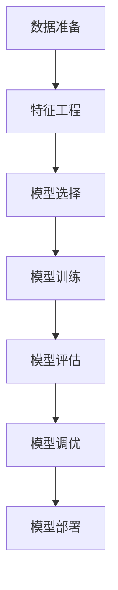

                 

# 监督学习 原理与代码实例讲解

> 关键词：监督学习, 特征工程, 模型选择, 损失函数, 正则化, 集成学习, 代码实例, 模型评估

## 1. 背景介绍

### 1.1 问题由来

监督学习是一种有标签数据驱动的学习范式，通过给模型提供大量的带有标签的训练数据，让模型学习如何从输入到输出的映射关系。这种学习方式在现实世界中应用广泛，例如分类、回归、序列预测等任务。

监督学习的基本思路是利用已有数据训练模型，再用模型对新数据进行预测。其核心在于如何将输入数据转化为模型能够处理的特征，并选择适合的模型对特征进行拟合。

### 1.2 问题核心关键点

监督学习的核心关键点包括：

1. 数据准备：选择适当的训练和验证数据集，保证数据质量，进行数据预处理。
2. 特征工程：将原始数据转化为模型能够理解的特征表示，提高模型预测准确性。
3. 模型选择：选择合适的机器学习模型，进行训练和优化。
4. 模型评估：评估模型在验证集上的性能，进行超参数调优。
5. 模型部署：将模型应用到实际场景中，进行持续监控和更新。

这些关键点在监督学习中相互依赖，任何一个环节出现问题，都可能导致模型性能下降或无法收敛。

## 2. 核心概念与联系

### 2.1 核心概念概述

为更好地理解监督学习的基本原理，本节将介绍几个关键概念：

- 监督学习(Supervised Learning)：使用已标记数据集，训练模型预测新数据标签的学习方法。
- 特征工程(Feature Engineering)：将原始数据转化为模型可处理的特征表示，包括特征提取、转换、选择等步骤。
- 模型选择(Model Selection)：根据问题特点选择合适的机器学习模型，如线性回归、决策树、神经网络等。
- 损失函数(Loss Function)：衡量模型预测值与真实标签之间差异的函数，常用有平方误差、交叉熵等。
- 正则化(Regularization)：通过在损失函数中添加正则项，限制模型复杂度，防止过拟合。
- 集成学习(Ensemble Learning)：通过组合多个模型的预测结果，提高模型性能，如随机森林、Bagging、Boosting等。
- 模型评估(Evaluation)：通过交叉验证等方法，评估模型在未知数据上的泛化能力，选择最优模型。
- 模型部署(Deployment)：将训练好的模型应用到实际场景中，进行持续监控和优化。

这些核心概念之间的逻辑关系可以通过以下Mermaid流程图来展示：



这个流程图展示了一个典型的监督学习流程，从数据准备开始，经过特征工程、模型选择、训练、评估、调优，最终部署到实际应用中。

## 3. 核心算法原理 & 具体操作步骤

### 3.1 算法原理概述

监督学习的核心原理是通过最小化损失函数，使模型预测值尽可能接近真实标签。假设输入数据为 $x$，标签为 $y$，模型预测为 $f(x)$，则损失函数为 $L(f(x), y)$。目标是最小化损失函数，即：

$$
\min_{f} \mathbb{E}_{(x, y)}[L(f(x), y)]
$$

其中，$\mathbb{E}_{(x, y)}$ 表示期望值，$f(x)$ 表示模型预测。

### 3.2 算法步骤详解

基于上述原理，监督学习一般包括以下几个关键步骤：

**Step 1: 数据准备**

1. 收集标注数据集，并进行清洗和预处理，包括去除噪声、缺失值处理、归一化等。
2. 将数据集划分为训练集、验证集和测试集，保证数据分布一致。
3. 将数据转化为模型能够处理的格式，如矩阵、向量等。

**Step 2: 特征工程**

1. 对原始数据进行特征提取，选择有代表性的特征。
2. 对特征进行转换，如对数值型数据进行归一化、对文本型数据进行分词、向量化等。
3. 对特征进行选择，去除冗余和不相关特征，提高特征表达能力。

**Step 3: 模型选择**

1. 根据问题类型和数据特点，选择合适的机器学习模型，如线性回归、决策树、神经网络等。
2. 对于复杂问题，可以采用集成学习的方式，组合多个模型进行预测。

**Step 4: 模型训练**

1. 定义损失函数和优化器，如均方误差、交叉熵、Adam等。
2. 在训练集上使用优化器最小化损失函数，更新模型参数。
3. 在验证集上评估模型性能，进行超参数调优。

**Step 5: 模型评估**

1. 在测试集上评估模型性能，选择最优模型。
2. 使用交叉验证等方法，评估模型泛化能力，选择最优模型。

**Step 6: 模型部署**

1. 将模型应用到实际场景中，进行持续监控和优化。
2. 定期更新模型，保持模型性能和数据一致性。

以上是监督学习的通用流程，具体的实现细节需要根据具体问题和数据特点进行优化。

### 3.3 算法优缺点

监督学习的优点在于：

1. 易于实现：有标注数据集可以直接用于训练，模型选择和训练过程相对简单。
2. 预测准确：基于标注数据集训练的模型，能够提供较高准确性的预测结果。
3. 泛化能力强：通过在验证集上的评估和调优，能够较好地泛化到未知数据上。

监督学习的缺点在于：

1. 依赖标注数据：需要大量标注数据集，标注成本高，数据获取难度大。
2. 过拟合风险：模型复杂度较高，容易过拟合训练集，泛化能力下降。
3. 模型选择困难：不同问题类型需要不同的模型，模型选择较复杂。

尽管存在这些缺点，监督学习仍是机器学习中最广泛应用的范式之一。未来相关研究的重点在于如何降低标注成本，提高模型的泛化能力和鲁棒性。

### 3.4 算法应用领域

监督学习在诸多领域都有广泛应用，以下是几个典型的应用场景：

- 金融风险管理：通过监督学习模型预测信用风险、市场风险等，辅助决策。
- 医疗诊断：利用监督学习模型对病人数据进行分类，辅助医生诊断。
- 智能推荐：通过监督学习模型对用户行为进行预测，推荐个性化产品。
- 自然语言处理：利用监督学习模型进行文本分类、命名实体识别、情感分析等。
- 图像识别：通过监督学习模型对图像进行分类、目标检测、图像生成等。

监督学习在各个领域都有广泛的应用，帮助解决实际问题，提升决策水平。

## 4. 数学模型和公式 & 详细讲解  
### 4.1 数学模型构建

假设输入数据为 $x$，标签为 $y$，模型预测为 $f(x)$，损失函数为 $L(f(x), y)$。监督学习的目标是最小化期望损失：

$$
\min_{f} \mathbb{E}_{(x, y)}[L(f(x), y)]
$$

在实际应用中，通常使用经验损失来代替期望损失：

$$
\min_{f} \frac{1}{N}\sum_{i=1}^N L(f(x_i), y_i)
$$

其中 $N$ 为样本数。

### 4.2 公式推导过程

以线性回归模型为例，推导最小二乘法的公式。假设模型为 $y = \theta^Tx + b$，损失函数为 $L(y, y') = \frac{1}{2}(y - y')^2$。则目标是最小化：

$$
\min_{\theta} \frac{1}{2N}\sum_{i=1}^N (y_i - \theta^Tx_i - b)^2
$$

对 $\theta$ 求偏导，得：

$$
\frac{\partial L}{\partial \theta} = \frac{1}{N}\sum_{i=1}^N (y_i - \theta^Tx_i - b)x_i
$$

令 $\frac{\partial L}{\partial \theta} = 0$，解得：

$$
\theta = (\sum_{i=1}^N x_i x_i^T)^{-1} \sum_{i=1}^N x_i y_i
$$

这就是最小二乘法的公式，通过解线性方程组可以得到最优的 $\theta$。

### 4.3 案例分析与讲解

以二分类任务为例，推导逻辑回归模型的公式。假设模型为 $y = f(x) = \sigma(\theta^Tx + b)$，其中 $\sigma$ 为逻辑函数。损失函数为 $L(y, y') = -y\log f(x) - (1-y)\log(1-f(x))$。目标是最小化：

$$
\min_{\theta} \frac{1}{N}\sum_{i=1}^N L(y_i, f(x_i))
$$

对 $\theta$ 求偏导，得：

$$
\frac{\partial L}{\partial \theta} = \frac{1}{N}\sum_{i=1}^N (y_i - f(x_i))x_i
$$

令 $\frac{\partial L}{\partial \theta} = 0$，解得：

$$
\theta = (\sum_{i=1}^N x_i x_i^T)^{-1} \sum_{i=1}^N x_i y_i
$$

这就是逻辑回归模型的公式，通过解线性方程组可以得到最优的 $\theta$。

## 5. 项目实践：代码实例和详细解释说明

### 5.1 开发环境搭建

在进行监督学习项目开发前，需要先搭建好开发环境。以下是使用Python进行Scikit-learn开发的环境配置流程：

1. 安装Anaconda：从官网下载并安装Anaconda，用于创建独立的Python环境。

2. 创建并激活虚拟环境：
```bash
conda create -n sklearn-env python=3.8 
conda activate sklearn-env
```

3. 安装Scikit-learn：
```bash
pip install scikit-learn
```

4. 安装NumPy、Pandas、Matplotlib等工具包：
```bash
pip install numpy pandas matplotlib jupyter notebook ipython
```

完成上述步骤后，即可在`sklearn-env`环境中开始项目开发。

### 5.2 源代码详细实现

以下是一个简单的线性回归模型的代码实现，使用Scikit-learn库：

```python
from sklearn.linear_model import LinearRegression
from sklearn.datasets import make_regression
from sklearn.model_selection import train_test_split
from sklearn.metrics import mean_squared_error
import matplotlib.pyplot as plt

# 生成随机数据
X, y = make_regression(n_samples=100, n_features=2, n_informative=2, n_targets=1, noise=0.1)

# 划分训练集和测试集
X_train, X_test, y_train, y_test = train_test_split(X, y, test_size=0.2, random_state=42)

# 训练模型
model = LinearRegression()
model.fit(X_train, y_train)

# 预测
y_pred = model.predict(X_test)

# 评估模型
mse = mean_squared_error(y_test, y_pred)
print(f"Mean Squared Error: {mse:.2f}")

# 可视化结果
plt.scatter(X_test, y_test)
plt.plot(X_test, y_pred, color='red')
plt.show()
```

这段代码实现了线性回归模型的训练和评估过程。首先生成一个二维随机数据集，将其划分为训练集和测试集。然后训练一个线性回归模型，并用测试集进行评估，计算均方误差（MSE）。最后通过可视化手段，展示模型预测结果和真实值。

### 5.3 代码解读与分析

下面是关键代码的解读和分析：

- `make_regression`函数生成了一个二维随机数据集，其中包含100个样本，2个特征，2个目标，每个目标的噪声水平为0.1。
- `train_test_split`函数将数据集划分为训练集和测试集，比例为80%训练集和20%测试集。
- `LinearRegression`类是Scikit-learn提供的线性回归模型，通过`fit`方法训练模型。
- `predict`方法对测试集进行预测，返回预测值。
- `mean_squared_error`函数计算预测值和真实值之间的均方误差，用于评估模型性能。
- `plt.scatter`和`plt.plot`函数用于绘制数据点和预测线，展示模型效果。

通过上述代码，我们可以看出，Scikit-learn库提供了一个简单易用的界面，使得线性回归模型的实现变得非常简便。开发者可以专注于算法实现和模型优化，而不必过多关注底层细节。

当然，工业级的系统实现还需考虑更多因素，如模型的保存和部署、超参数的自动搜索、更灵活的特征工程等。但核心的监督学习范式基本与此类似。

## 6. 实际应用场景

### 6.1 金融风险管理

金融风险管理中，监督学习被广泛应用于信用风险评估、市场风险预测等方面。通过收集历史交易数据，构建监督学习模型，可以对客户的信用风险进行评估，预测市场的涨跌趋势，辅助决策。

在技术实现上，可以收集客户的个人信息、交易记录、信用评分等数据，构建监督学习模型进行训练。模型可以预测客户的违约概率，市场风险等，从而辅助银行进行贷款审批、风险控制等决策。

### 6.2 医疗诊断

医疗诊断中，监督学习被广泛应用于病历分类、疾病预测等方面。通过收集病人的历史病历数据，构建监督学习模型，可以对病人的病情进行分类，预测病人的康复情况。

在技术实现上，可以收集病人的历史病历、实验室检查结果、影像数据等，构建监督学习模型进行训练。模型可以预测病人的病情类型，康复情况等，辅助医生进行诊断和治疗。

### 6.3 智能推荐

智能推荐中，监督学习被广泛应用于用户行为预测、产品推荐等方面。通过收集用户的浏览、购买、评分等数据，构建监督学习模型，可以预测用户的兴趣偏好，推荐个性化产品。

在技术实现上，可以收集用户的浏览历史、购买记录、评分信息等，构建监督学习模型进行训练。模型可以预测用户的兴趣偏好，生成个性化的推荐列表，提升用户满意度。

### 6.4 未来应用展望

随着监督学习技术的发展，其应用范围将进一步拓展，带来更多的行业变革：

- 智慧城市治理：通过监督学习模型对城市事件进行预测和监控，提升城市管理的智能化水平。
- 智能客服系统：利用监督学习模型对客户咨询进行分类和回复，提升客户满意度。
- 自然语言处理：通过监督学习模型对文本进行分类、情感分析、命名实体识别等，提升文本处理能力。
- 图像识别：通过监督学习模型对图像进行分类、目标检测、图像生成等，提升图像处理能力。

未来，监督学习将在更多领域得到应用，为各行各业带来智能化、高效化的解决方案。

## 7. 工具和资源推荐

### 7.1 学习资源推荐

为了帮助开发者系统掌握监督学习的理论基础和实践技巧，这里推荐一些优质的学习资源：

1. 《机器学习实战》系列书籍：通过大量实例，介绍了机器学习的基本概念和算法实现。
2. 《Python机器学习》书籍：介绍了Python在机器学习中的应用，包括监督学习、非监督学习、集成学习等。
3. 机器学习在线课程：Coursera、edX、Udacity等平台提供了丰富的机器学习课程，涵盖监督学习、深度学习、自然语言处理等方向。
4. Kaggle竞赛：Kaggle是一个数据科学竞赛平台，提供大量监督学习竞赛和数据集，帮助开发者提升技能。
5. Scikit-learn官方文档：Scikit-learn是Python中最流行的机器学习库，提供了丰富的监督学习算法和工具。

通过对这些资源的学习实践，相信你一定能够快速掌握监督学习的精髓，并用于解决实际的机器学习问题。

### 7.2 开发工具推荐

高效的开发离不开优秀的工具支持。以下是几款用于监督学习开发的常用工具：

1. Python：Python是机器学习的主流语言，提供了丰富的机器学习库和工具。
2. Scikit-learn：Scikit-learn是Python中最流行的机器学习库，提供了丰富的监督学习算法和工具。
3. TensorFlow：由Google主导开发的深度学习框架，适合大规模工程应用。
4. Keras：Keras是一个高层次的深度学习库，提供了简单易用的API，适合快速原型开发。
5. Jupyter Notebook：Jupyter Notebook是一个交互式编程环境，适合数据探索和机器学习模型验证。
6. Weights & Biases：模型训练的实验跟踪工具，可以记录和可视化模型训练过程中的各项指标，方便对比和调优。

合理利用这些工具，可以显著提升监督学习任务的开发效率，加快创新迭代的步伐。

### 7.3 相关论文推荐

监督学习是机器学习领域的一个重要分支，相关研究非常丰富。以下是几篇奠基性的相关论文，推荐阅读：

1. Logistic Regression：提出了逻辑回归模型，广泛应用于二分类问题。
2. Support Vector Machine：提出了支持向量机模型，广泛应用于分类和回归问题。
3. Random Forest：提出了随机森林模型，适用于处理高维数据。
4. Gradient Boosting：提出了梯度提升模型，适用于处理非线性问题。
5. Deep Learning：提出了深度学习模型，适用于处理复杂问题。

这些论文代表了大数据和机器学习的发展脉络，通过学习这些前沿成果，可以帮助研究者把握学科前进方向，激发更多的创新灵感。

## 8. 总结：未来发展趋势与挑战

### 8.1 总结

本文对监督学习的基本原理和实践技巧进行了全面系统的介绍。首先阐述了监督学习的基本概念和核心原理，明确了监督学习在现实世界中的应用前景。其次，从原理到实践，详细讲解了监督学习的数学模型和操作步骤，给出了监督学习任务开发的完整代码实例。同时，本文还广泛探讨了监督学习方法在金融风险管理、医疗诊断、智能推荐等多个行业领域的应用前景，展示了监督学习范式的巨大潜力。此外，本文精选了监督学习的各类学习资源，力求为读者提供全方位的技术指引。

通过本文的系统梳理，可以看到，监督学习技术在机器学习中扮演着重要角色，已经在诸多领域得到广泛应用，带来了显著的经济和社会效益。未来，伴随算法和技术的不断进步，监督学习将进一步拓展其应用范围，带来更多的行业变革和创新。

### 8.2 未来发展趋势

展望未来，监督学习技术将呈现以下几个发展趋势：

1. 自动化特征工程：通过自动化特征提取和选择技术，降低特征工程的工作量，提高模型性能。
2. 迁移学习：通过迁移学习技术，在有限数据集上进行有效训练，提升模型泛化能力。
3. 模型压缩：通过模型压缩技术，减小模型参数量，提高模型运行效率。
4. 可解释性增强：通过可解释性技术，提高模型的透明度和可解释性，增强用户信任。
5. 弱监督学习：通过弱监督学习技术，在少量标注数据上进行有效训练，降低标注成本。
6. 多模态学习：通过多模态学习技术，融合不同模态数据，提升模型性能。

以上趋势凸显了监督学习技术的广阔前景，这些方向的探索发展，必将进一步提升监督学习系统的性能和应用范围，为各行各业带来智能化、高效化的解决方案。

### 8.3 面临的挑战

尽管监督学习技术已经取得了瞩目成就，但在迈向更加智能化、普适化应用的过程中，它仍面临着诸多挑战：

1. 标注数据依赖：监督学习需要大量的标注数据进行训练，标注成本高，数据获取难度大。如何降低标注成本，提高模型泛化能力，是未来需要解决的重要问题。
2. 模型复杂性：监督学习模型的复杂度较高，容易出现过拟合现象，泛化能力下降。如何提高模型泛化能力，增强模型的鲁棒性，是未来需要解决的重要问题。
3. 数据异构性：不同领域的数据具有不同的特征和分布，如何适应不同领域的数据，是未来需要解决的重要问题。
4. 模型可解释性：监督学习模型的复杂性较高，难以解释其内部工作机制和决策逻辑。如何提高模型的可解释性，增强用户信任，是未来需要解决的重要问题。
5. 数据隐私保护：监督学习模型通常需要大量敏感数据进行训练，如何保护用户隐私，防止数据泄露，是未来需要解决的重要问题。

这些挑战需要我们在算法、数据、模型、隐私保护等方面进行深入研究和优化，才能进一步提升监督学习系统的性能和应用范围。

### 8.4 研究展望

面对监督学习面临的种种挑战，未来的研究需要在以下几个方面寻求新的突破：

1. 探索无监督和半监督学习：摆脱对大规模标注数据的依赖，利用自监督学习、主动学习等无监督和半监督范式，最大限度利用非结构化数据，实现更加灵活高效的监督学习。
2. 研究模型压缩和高效学习：开发更加高效的学习范式，如参数压缩、模型剪枝等，减小模型参数量，提高模型运行效率。
3. 引入更多先验知识：将符号化的先验知识，如知识图谱、逻辑规则等，与神经网络模型进行巧妙融合，引导监督学习过程学习更准确、合理的语言模型。
4. 融合因果分析和博弈论工具：将因果分析方法引入监督学习模型，识别出模型决策的关键特征，增强输出解释的因果性和逻辑性。借助博弈论工具刻画人机交互过程，主动探索并规避模型的脆弱点，提高系统稳定性。
5. 纳入伦理道德约束：在模型训练目标中引入伦理导向的评估指标，过滤和惩罚有偏见、有害的输出倾向。同时加强人工干预和审核，建立模型行为的监管机制，确保输出符合人类价值观和伦理道德。

这些研究方向的探索，必将引领监督学习技术迈向更高的台阶，为构建安全、可靠、可解释、可控的智能系统铺平道路。面向未来，监督学习技术还需要与其他人工智能技术进行更深入的融合，如知识表示、因果推理、强化学习等，多路径协同发力，共同推动自然语言理解和智能交互系统的进步。只有勇于创新、敢于突破，才能不断拓展监督学习技术的边界，让智能技术更好地造福人类社会。

## 9. 附录：常见问题与解答

**Q1：监督学习是否适用于所有数据集？**

A: 监督学习适用于标注数据集，即带有标签的数据集。然而，并不是所有数据集都适合进行监督学习。对于无标签数据集，可以考虑使用无监督学习或半监督学习。

**Q2：如何选择合适的监督学习算法？**

A: 选择合适的监督学习算法需要考虑数据集的特点和问题类型。一般而言，对于线性和半线性问题，可以选择线性回归、逻辑回归等算法。对于非线性问题，可以选择决策树、随机森林、神经网络等算法。对于高维数据，可以选择支持向量机、梯度提升等算法。

**Q3：监督学习模型的训练时间和计算资源如何控制？**

A: 监督学习模型的训练时间和计算资源控制需要考虑模型复杂度、数据规模等因素。通常可以使用网格搜索、随机搜索等方法进行超参数调优，选择合适的模型参数。同时，可以使用分布式训练、GPU加速等方法提高训练效率。

**Q4：监督学习模型的泛化能力如何评估？**

A: 监督学习模型的泛化能力可以通过交叉验证、留出验证等方法进行评估。常用的评估指标包括均方误差、准确率、召回率、F1-score等。在实际应用中，还需要注意模型的过拟合和欠拟合问题，通过正则化、早停等方法进行控制。

**Q5：监督学习模型的应用场景有哪些？**

A: 监督学习模型在多个领域都有广泛应用，包括金融风险管理、医疗诊断、智能推荐、自然语言处理、图像识别等。通过监督学习模型，可以对数据进行分类、预测、生成等操作，提升决策水平和用户体验。

总之，监督学习技术已经成为机器学习领域的重要范式，将在更多领域得到应用，为各行各业带来智能化、高效化的解决方案。未来，伴随算法和技术的不断进步，监督学习将进一步拓展其应用范围，带来更多的行业变革和创新。

