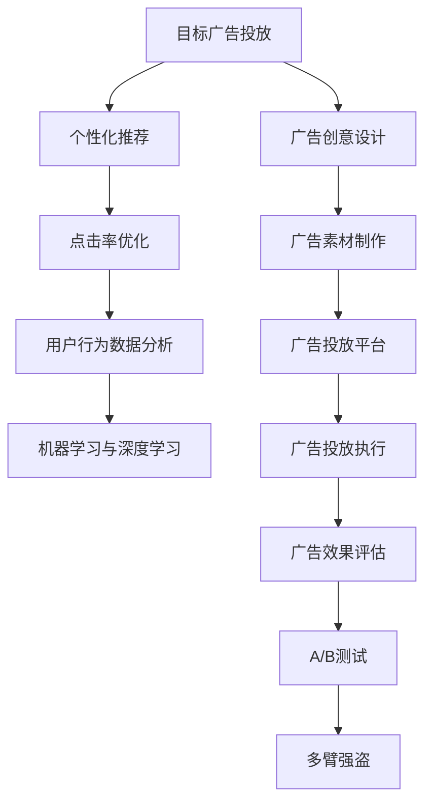

                 

# 目标广告投放在电商市场营销中的应用

> 关键词：目标广告投放, 电商市场营销, 点击率优化, A/B测试, 推荐系统

## 1. 背景介绍

在数字化时代，电商平台已成为商家触达消费者、提升品牌知名度、增加销售额的重要渠道。通过有效的广告投放策略，商家可以在庞大用户群体中找到潜在客户，精准推送商品信息，提升销售转化率。然而，随着市场竞争的加剧，广告投放的难度也在不断增加。如何在有限的预算内，最大限度地提升广告效果，成为了商家关注的焦点。

近年来，目标广告投放技术（Targeted Advertising Placement）的兴起，为电商平台提供了新的解决思路。通过精准定位潜在客户，并根据用户行为数据进行个性化广告投放，目标广告投放能够在成本控制和广告效果之间找到最佳平衡，成为电商平台广告投放的利器。本文将系统地介绍目标广告投放的核心概念、技术原理及应用实践，以期为电商平台优化广告投放策略提供参考。

## 2. 核心概念与联系

### 2.1 核心概念概述

为更好地理解目标广告投放的技术原理和应用场景，本节将介绍几个关键的概念：

- **目标广告投放**：指根据用户行为数据和属性特征，精准定位潜在客户，并针对性地推送广告的过程。目标广告投放能够提升广告点击率和转化率，优化广告投放效果。

- **个性化推荐**：基于用户的历史行为数据和属性特征，推荐系统能够预测用户对某商品的兴趣程度，并推荐符合用户兴趣的商品或广告。个性化推荐有助于提升用户体验，提高转化率。

- **点击率优化（CRO）**：指通过A/B测试、多臂强盗等方法，不断优化广告投放参数（如展示位置、展示形式、投放时间等），以最大化广告点击率。点击率优化是目标广告投放的核心目标之一。

- **用户行为数据分析**：指对用户的浏览、购买、评价等行为数据进行收集和分析，以便更好地理解用户需求和偏好，从而进行精准广告投放。

- **机器学习与深度学习**：机器学习通过训练模型，从大量历史数据中提取规律，预测用户行为和需求。深度学习则进一步通过神经网络模型，对用户行为数据进行复杂建模，提升广告投放的准确性和个性化程度。

这些核心概念之间的逻辑关系可以通过以下Mermaid流程图来展示：



这个流程图展示了大语言模型的核心概念及其之间的关系：

1. 目标广告投放需要个性化推荐、点击率优化、用户行为数据分析等技术支持。
2. 个性化推荐和用户行为数据分析依赖于机器学习与深度学习的模型训练。
3. 广告创意设计和素材制作是广告投放的前期准备。
4. 广告投放执行、效果评估和优化反馈循环是整个广告投放过程的核心。

这些概念共同构成了目标广告投放的技术框架，使得商家能够通过精准投放，实现广告效果最大化。

## 3. 核心算法原理 & 具体操作步骤
### 3.1 算法原理概述

目标广告投放的核心目标是通过个性化推荐，精准定位潜在客户，最大化广告点击率和转化率。其核心算法原理主要包括以下几个步骤：

1. **用户行为数据收集与处理**：通过用户的浏览、购买、评价等行为数据，构建用户画像，提取用户特征。

2. **模型训练与推荐**：利用机器学习或深度学习模型，训练出个性化推荐模型，预测用户对某商品的兴趣程度，并推荐符合用户兴趣的商品或广告。

3. **广告投放与点击率优化**：根据推荐结果，针对性地推送广告，并利用点击率优化算法，不断调整广告投放参数，以提升广告点击率和转化率。

4. **效果评估与迭代优化**：通过广告效果评估和A/B测试，不断优化广告投放策略，提高广告投放效果。

### 3.2 算法步骤详解

以下是目标广告投放的核心算法步骤详解：

**Step 1: 用户行为数据收集与处理**
- 通过电商平台的用户行为数据，收集用户的浏览记录、点击记录、购买记录、评价记录等行为数据。
- 将用户行为数据进行预处理，包括数据清洗、归一化、缺失值处理等。
- 通过特征工程方法，提取用户特征，如年龄、性别、地理位置、浏览时长、购买频率等。

**Step 2: 模型训练与推荐**
- 选择合适的机器学习或深度学习模型，如协同过滤、基于内容的推荐、深度神经网络等。
- 利用历史行为数据和用户特征，对模型进行训练，得到个性化推荐模型。
- 模型训练完毕后，根据用户最新行为数据，实时预测用户对某商品的兴趣程度，并推荐符合用户兴趣的商品或广告。

**Step 3: 广告投放与点击率优化**
- 根据推荐结果，在合适的广告位置和形式下，展示广告。
- 利用点击率优化算法，如A/B测试、多臂强盗等，不断调整广告投放参数，以最大化广告点击率和转化率。

**Step 4: 效果评估与迭代优化**
- 通过广告效果评估指标，如点击率、转化率、ROI等，评估广告投放效果。
- 利用A/B测试和多臂强盗算法，不断优化广告投放策略，提高广告投放效果。
- 定期更新模型参数和广告素材，保持广告投放的持续优化。

### 3.3 算法优缺点

目标广告投放技术具有以下优点：
1. 精准投放：通过精准定位潜在客户，提升广告点击率和转化率。
2. 数据驱动：基于用户行为数据和特征，实现个性化推荐，提升用户体验。
3. 效果显著：利用机器学习与深度学习模型，预测用户兴趣，实现精准投放。
4. 自动化优化：利用点击率优化算法，自动调整投放参数，提高投放效果。

同时，该方法也存在一定的局限性：
1. 数据依赖：对历史行为数据的依赖较大，缺乏新数据的覆盖。
2. 模型复杂：训练和优化深度学习模型，需要较大的计算资源和时间。
3. 过拟合风险：如果用户行为数据存在噪声，模型可能过拟合，影响推荐结果。
4. 隐私问题：用户行为数据可能包含敏感信息，存在隐私泄露的风险。
5. 规则调整难度大：广告投放规则的调整和优化，需要不断实验和测试，调整难度大。

尽管存在这些局限性，但就目前而言，目标广告投放技术仍是电商平台广告投放的重要手段。未来相关研究的重点在于如何进一步优化模型，降低对数据的依赖，提高广告投放的自动化和智能化水平，同时兼顾隐私保护和用户满意度。

### 3.4 算法应用领域

目标广告投放技术在电商市场营销中的应用已经非常广泛，主要涵盖以下几个方面：

- **商品推荐**：利用用户行为数据和推荐模型，推荐符合用户兴趣的商品，提升用户购买概率。
- **广告投放**：基于用户行为数据和推荐结果，精准投放广告，提升广告点击率和转化率。
- **优惠券和促销活动**：根据用户行为数据，精准推送优惠券和促销活动，提高用户购买意愿。
- **跨平台营销**：在多个平台进行广告投放和用户行为数据分析，提升营销效果。
- **社交媒体广告**：利用社交媒体用户的兴趣和行为数据，进行个性化广告投放。

除了上述这些典型应用外，目标广告投放技术还被创新性地应用到更多场景中，如智能客服、智能推荐系统等，为电商平台带来新的突破。

## 4. 数学模型和公式 & 详细讲解
### 4.1 数学模型构建

目标广告投放的核心数学模型包括用户行为数据建模、个性化推荐模型、点击率优化模型等。以下是对这些模型的详细构建：

- **用户行为数据建模**：用户行为数据建模的目标是从大量历史数据中提取规律，预测用户未来的行为。常见的方法包括协同过滤、基于内容的推荐、深度神经网络等。

- **个性化推荐模型**：个性化推荐模型通过训练得到用户-商品关联度矩阵，预测用户对某商品的兴趣程度。常见的方法包括矩阵分解、神经网络推荐系统等。

- **点击率优化模型**：点击率优化模型通过优化广告投放参数，最大化广告点击率和转化率。常见的方法包括线性回归、逻辑回归、多臂强盗算法等。

### 4.2 公式推导过程

以下我们将以线性回归模型为例，推导点击率优化模型的核心公式。

假设广告的点击率（CTR）为 $CTR$，广告特征向量为 $\mathbf{x}$，广告展示位置为 $p$，用户行为数据特征向量为 $\mathbf{u}$，用户特征向量为 $\mathbf{v}$，用户对广告的兴趣程度为 $I$，点击率优化目标为最大化广告点击率，即：

$$
\max \quad CTRObJ = CTR(\mathbf{x}, p, \mathbf{u}, \mathbf{v}) 
$$

其中，$CTRObJ$ 表示点击率优化目标函数，$CTR$ 表示点击率。

为了最大化广告点击率，需要最大化广告展示位置 $p$ 的权重。假设 $p$ 对应的广告点击率为 $CTR_p$，则有：

$$
CTR_p = \alpha \cdot CTRObJ_p + \beta \cdot CTRObJ_{p+1} + \gamma \cdot CTRObJ_{p+2}
$$

其中，$\alpha$、$\beta$、$\gamma$ 为展示位置权重。通过最大化 $CTR_p$，可以达到最大化广告点击率的效果。

### 4.3 案例分析与讲解

为了更好地理解目标广告投放的数学模型和公式，我们以电商平台的商品推荐系统为例，进行详细讲解。

假设电商平台上有10000个用户，每个用户对1000个商品感兴趣。我们可以构建一个 $10000 \times 1000$ 的用户-商品关联度矩阵 $P$，其中 $P_{i,j}$ 表示用户 $i$ 对商品 $j$ 的兴趣程度。

为了构建用户行为数据模型，我们可以利用协同过滤算法，对用户行为数据进行降维和建模，得到用户行为数据特征向量 $\mathbf{u}_i$ 和商品特征向量 $\mathbf{v}_j$。

在得到用户行为数据特征向量和商品特征向量后，我们可以利用深度神经网络进行训练，得到个性化推荐模型。在实际应用中，可以将新用户的最新行为数据代入个性化推荐模型，得到用户对各商品的兴趣程度 $I$。

在广告投放时，我们可以根据 $I$ 值，推荐符合用户兴趣的商品。同时，为了最大化广告点击率，可以利用点击率优化模型，对广告展示位置和权重进行调整。

## 5. 项目实践：代码实例和详细解释说明
### 5.1 开发环境搭建

在进行目标广告投放的项目实践前，我们需要准备好开发环境。以下是使用Python进行TensorFlow开发的环境配置流程：

1. 安装Anaconda：从官网下载并安装Anaconda，用于创建独立的Python环境。

2. 创建并激活虚拟环境：
```bash
conda create -n tf-env python=3.8 
conda activate tf-env
```

3. 安装TensorFlow：从官网获取对应的安装命令。例如：
```bash
conda install tensorflow -c pytorch -c conda-forge
```

4. 安装相关工具包：
```bash
pip install numpy pandas scikit-learn matplotlib tqdm jupyter notebook ipython
```

完成上述步骤后，即可在`tf-env`环境中开始目标广告投放的实践。

### 5.2 源代码详细实现

下面我们以商品推荐系统为例，给出使用TensorFlow对目标广告投放进行建模的PyTorch代码实现。

首先，定义推荐模型的输入输出：

```python
import tensorflow as tf
from tensorflow.keras.layers import Input, Embedding, Dense, Flatten, Concatenate

# 定义输入
user_input = Input(shape=(1,))
item_input = Input(shape=(1,))
item_features_input = Input(shape=(10,))

# 定义嵌入层
user_embedding = Embedding(input_dim=1000, output_dim=128, mask_zero=True)(user_input)
item_embedding = Embedding(input_dim=1000, output_dim=128, mask_zero=True)(item_input)
item_features = Dense(128, activation='relu')(item_features_input)

# 定义预测模型
predictions = Concatenate()([user_embedding, item_embedding, item_features])
predictions = Dense(1, activation='sigmoid')(predictions)
```

然后，定义推荐模型的训练和优化过程：

```python
from tensorflow.keras.optimizers import Adam

# 定义损失函数
loss = tf.keras.losses.BinaryCrossentropy()

# 定义优化器
optimizer = Adam(learning_rate=0.001)

# 定义模型
model = tf.keras.Model(inputs=[user_input, item_input, item_features_input], outputs=predictions)
model.compile(optimizer=optimizer, loss=loss, metrics=['accuracy'])

# 训练模型
model.fit([user_data, item_data, item_features_data], train_labels, epochs=10, batch_size=32)
```

最后，定义推荐系统的预测过程：

```python
# 预测新用户对商品是否感兴趣
user_id = 123
item_id = 456
item_features = [1.0, 2.0, 3.0, 4.0, 5.0, 6.0, 7.0, 8.0, 9.0, 10.0]
predictions = model.predict([[user_id], [item_id], [item_features]])
```

以上就是使用TensorFlow对商品推荐系统进行目标广告投放的完整代码实现。可以看到，TensorFlow提供了强大的深度学习框架，方便我们快速实现复杂的推荐模型和优化算法。

### 5.3 代码解读与分析

让我们再详细解读一下关键代码的实现细节：

**Input层**：
- 定义用户和商品的输入向量，形状分别为 $(1,)$。

**Embedding层**：
- 定义用户和商品的嵌入层，将输入向量转换为低维稠密向量，形状分别为 $(128,)$。

**Dense层**：
- 定义商品特征的Dense层，将输入特征向量转换为低维稠密向量，形状为 $(128,)$。

**Concatenate层**：
- 定义Concatenate层，将用户嵌入、商品嵌入和商品特征向量进行拼接，形状为 $(256,)$。

**Dense层**：
- 定义预测层的Dense层，将拼接后的向量输出为预测值，形状为 $(1,)$。

**损失函数**：
- 定义二元交叉熵损失函数，用于计算预测值与真实标签的差异。

**优化器**：
- 定义Adam优化器，学习率为 $0.001$。

**模型编译**：
- 将模型编译为可训练的TensorFlow模型，并指定损失函数、优化器和评估指标。

**模型训练**：
- 使用训练数据集进行模型训练，迭代 $10$ 轮，每轮 $32$ 个样本。

**模型预测**：
- 使用训练好的模型进行预测，将新用户的ID和商品ID以及商品特征向量代入模型，得到预测结果。

通过以上代码实现，我们可以看到，TensorFlow提供了丰富的深度学习组件和优化算法，方便我们快速构建推荐模型并进行训练和优化。

## 6. 实际应用场景
### 6.1 智能客服系统

目标广告投放技术在智能客服系统中的应用主要体现在精准定位和个性化推荐上。传统客服系统依赖于人工客服进行客户咨询，响应速度慢、成本高、效率低。利用目标广告投放技术，可以对客户进行精准定位，并根据历史行为数据进行个性化推荐，提升客服系统响应速度和效率。

在技术实现上，可以收集用户的历史客服咨询记录，将问题和最佳答复构建成监督数据，在此基础上对推荐模型进行微调。微调后的推荐模型能够自动理解客户意图，匹配最合适的答复模板，并进行优先推荐。对于客户提出的新问题，还可以接入检索系统实时搜索相关内容，动态组织生成回复。如此构建的智能客服系统，能大幅提升客户咨询体验和问题解决效率。

### 6.2 金融产品推荐

金融产品推荐是目标广告投放在金融领域的重要应用。金融机构需要及时了解市场动态，推荐符合用户需求的产品，提升客户满意度。利用目标广告投放技术，可以对用户行为数据进行深入分析，预测用户对各类金融产品的兴趣程度，并推荐符合用户需求的产品。

在技术实现上，可以收集用户的历史金融产品浏览、购买、评价等行为数据，提取用户特征，如年龄、收入、投资偏好等。利用机器学习模型，对用户行为数据进行建模，得到个性化推荐模型。在实际应用中，可以根据用户最新行为数据，实时预测用户对各类金融产品的兴趣程度，并推荐符合用户需求的产品。

### 6.3 在线教育推荐

在线教育推荐是目标广告投放在教育领域的重要应用。在线教育平台需要及时了解用户需求，推荐符合用户兴趣的课程和资源，提升用户学习体验。利用目标广告投放技术，可以对用户行为数据进行深入分析，预测用户对各类课程和资源的兴趣程度，并推荐符合用户需求的内容。

在技术实现上，可以收集用户的历史在线学习行为数据，提取用户特征，如年龄、学习偏好、课程浏览时长等。利用深度学习模型，对用户行为数据进行建模，得到个性化推荐模型。在实际应用中，可以根据用户最新行为数据，实时预测用户对各类课程和资源的兴趣程度，并推荐符合用户需求的内容。

### 6.4 未来应用展望

随着目标广告投放技术的发展，未来将有更多创新应用场景不断涌现。

在智慧医疗领域，可以利用目标广告投放技术，对用户的医疗健康数据进行深入分析，推荐符合用户需求的健康产品和服务。

在智能家居领域，可以利用目标广告投放技术，对用户的家居设备使用行为进行深入分析，推荐符合用户需求的家庭用品和服务。

在智能交通领域，可以利用目标广告投放技术，对用户的出行数据进行深入分析，推荐符合用户需求的出行服务和产品。

总之，目标广告投放技术将在更多领域得到应用，为各行各业带来新的变革和机遇。

## 7. 工具和资源推荐
### 7.1 学习资源推荐

为了帮助开发者系统掌握目标广告投放的理论基础和实践技巧，这里推荐一些优质的学习资源：

1. 《推荐系统实战》系列博文：由大模型技术专家撰写，深入浅出地介绍了推荐系统的工作原理、经典模型和优化方法，是学习目标广告投放技术的重要资源。

2. CS294《机器学习》课程：斯坦福大学开设的机器学习明星课程，涵盖各类机器学习算法，是学习目标广告投放技术的理论基础。

3. 《Deep Learning for Recommender Systems》书籍：详细介绍了深度学习在推荐系统中的应用，提供了丰富的实际案例和代码实现，是学习目标广告投放技术的实战指南。

4. TensorFlow官方文档：TensorFlow的官方文档，提供了丰富的深度学习组件和优化算法，是进行目标广告投放技术开发的必备资料。

5. Weights & Biases：模型训练的实验跟踪工具，可以记录和可视化模型训练过程中的各项指标，方便对比和调优。与主流深度学习框架无缝集成。

通过对这些资源的学习实践，相信你一定能够快速掌握目标广告投放技术的精髓，并用于解决实际的推荐问题。

### 7.2 开发工具推荐

高效的开发离不开优秀的工具支持。以下是几款用于目标广告投放开发的常用工具：

1. TensorFlow：由Google主导开发的深度学习框架，生产部署方便，适合大规模工程应用。TensorFlow提供了丰富的深度学习组件和优化算法，方便进行目标广告投放的建模和优化。

2. PyTorch：基于Python的开源深度学习框架，灵活动态的计算图，适合快速迭代研究。PyTorch的Torchvision库提供了丰富的数据预处理组件，方便进行目标广告投放的数据处理。

3. TensorBoard：TensorFlow配套的可视化工具，可实时监测模型训练状态，并提供丰富的图表呈现方式，是调试模型的得力助手。

4. Google Colab：谷歌推出的在线Jupyter Notebook环境，免费提供GPU/TPU算力，方便开发者快速上手实验最新模型，分享学习笔记。

合理利用这些工具，可以显著提升目标广告投放任务的开发效率，加快创新迭代的步伐。

### 7.3 相关论文推荐

目标广告投放技术的发展源于学界的持续研究。以下是几篇奠基性的相关论文，推荐阅读：

1. "Collaborative Filtering for Implicit Feedback Datasets"：介绍协同过滤算法在推荐系统中的应用，是目标广告投放技术的重要基础。

2. "Farewell to recommender systems!"：总结了推荐系统的发展历程和未来方向，为理解目标广告投放技术提供了理论支持。

3. "Adaptive Bayesian Boosting for Recommendation"：介绍多臂强盗算法在推荐系统中的应用，为优化目标广告投放策略提供了借鉴。

4. "Neural collaborative filtering"：介绍深度神经网络在推荐系统中的应用，为优化目标广告投放模型提供了参考。

这些论文代表了大模型微调技术的发展脉络。通过学习这些前沿成果，可以帮助研究者把握学科前进方向，激发更多的创新灵感。

## 8. 总结：未来发展趋势与挑战
### 8.1 研究成果总结

本文对目标广告投放技术进行了系统介绍，从原理到实践，详细讲解了推荐系统的数学模型和核心算法。通过系统梳理，可以看到目标广告投放技术在电商市场营销中的广泛应用和巨大潜力。

通过本文的学习，相信读者对目标广告投放技术的原理和应用有了更全面的理解，能够在实际应用中更好地优化广告投放策略，提升广告效果。

### 8.2 未来发展趋势

展望未来，目标广告投放技术将呈现以下几个发展趋势：

1. 模型复杂度提升：随着深度学习技术的发展，目标广告投放模型将逐渐从线性模型过渡到深度神经网络，甚至更复杂的结构。

2. 多模态融合：目标广告投放将逐步从纯文本数据扩展到多模态数据，如图像、语音等，以进一步提升广告投放的准确性和效果。

3. 实时化优化：目标广告投放将更加注重实时化优化，通过实时数据反馈，不断调整广告投放策略，提升广告投放效果。

4. 自动化优化：目标广告投放将引入更多自动化优化算法，如强化学习、多臂强盗等，减少人工干预，提升广告投放效率。

5. 个性化推荐：目标广告投放将进一步提升个性化推荐能力，通过更深入的用户行为数据分析，实现更加精准的广告投放。

以上趋势凸显了目标广告投放技术的广阔前景。这些方向的探索发展，必将进一步提升广告投放的精准度和效果，为电商市场营销带来新的变革和机遇。

### 8.3 面临的挑战

尽管目标广告投放技术已经取得了瞩目成就，但在迈向更加智能化、普适化应用的过程中，它仍面临着诸多挑战：

1. 数据隐私问题：用户行为数据可能包含敏感信息，存在隐私泄露的风险。如何在保障隐私的前提下，利用用户数据进行精准投放，是未来的重要课题。

2. 过拟合风险：如果用户行为数据存在噪声，模型可能过拟合，影响推荐结果。如何在保障模型泛化性的前提下，提高广告投放效果，是未来的重要课题。

3. 资源消耗：深度学习模型和复杂优化算法的计算资源消耗较大，如何优化模型结构和算法，降低资源消耗，是未来的重要课题。

4. 广告效果评估：广告效果评估指标需要不断优化，如何量化广告投放效果，并结合实际业务场景进行评估，是未来的重要课题。

5. 规则调整难度：广告投放规则的调整和优化，需要不断实验和测试，调整难度大。如何在保障广告效果的前提下，提高广告投放规则的灵活性和适用性，是未来的重要课题。

6. 跨平台协同：跨平台广告投放需要考虑不同平台的广告展示形式和用户行为数据格式，如何实现跨平台协同，是未来的重要课题。

正视目标广告投放面临的这些挑战，积极应对并寻求突破，将是大语言模型微调走向成熟的必由之路。相信随着学界和产业界的共同努力，这些挑战终将一一被克服，目标广告投放必将在构建人机协同的智能时代中扮演越来越重要的角色。

### 8.4 研究展望

面向未来，目标广告投放技术还需要与其他人工智能技术进行更深入的融合，如知识表示、因果推理、强化学习等，多路径协同发力，共同推动自然语言理解和智能交互系统的进步。只有勇于创新、敢于突破，才能不断拓展语言模型的边界，让智能技术更好地造福人类社会。

## 9. 附录：常见问题与解答

**Q1：目标广告投放是否适用于所有电商市场营销场景？**

A: 目标广告投放技术在大多数电商市场营销场景上都能取得不错的效果，特别是对于数据量较大的电商平台。但对于一些特殊领域，如某些小众电商平台，数据量较小，可能难以获得理想的效果。

**Q2：目标广告投放与传统广告投放方式有何不同？**

A: 目标广告投放与传统广告投放方式的主要区别在于精准定位和个性化推荐。传统广告投放通常采用广泛的渠道和固定的广告形式，难以实现精准投放。而目标广告投放通过用户行为数据和推荐模型，能够实现更加精准的广告投放，提升广告点击率和转化率。

**Q3：目标广告投放是否需要大量的标注数据？**

A: 目标广告投放技术不需要大量的标注数据，可以利用用户行为数据进行推荐。但为了提高广告投放效果，需要收集和分析大量的用户行为数据，构建详细的用户画像。

**Q4：目标广告投放的算法实现难度大吗？**

A: 目标广告投放的算法实现难度较大，需要一定的机器学习和深度学习基础。但对于有一定技术积累的团队，通过学习和实践，可以逐步掌握目标广告投放技术的核心算法和实现方法。

**Q5：目标广告投放如何应对市场变化？**

A: 目标广告投放需要不断收集和分析市场变化数据，更新用户画像和推荐模型，以适应市场变化。同时，可以利用多臂强盗等优化算法，实时调整广告投放策略，应对市场变化。

通过以上常见问题的解答，相信你对目标广告投放技术有了更全面的理解。希望本文能够为你提供有价值的参考，助力你更好地进行目标广告投放的实践和优化。

---

作者：禅与计算机程序设计艺术 / Zen and the Art of Computer Programming

