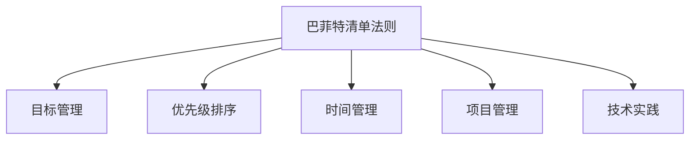

                 

# 目标聚焦：巴菲特清单法则的实践

> 关键词：巴菲特清单法则, 目标管理, 优先级排序, 时间管理, 项目管理, 技术实践

## 1. 背景介绍

### 1.1 问题由来
在快速变化、竞争激烈的商业环境中，如何有效管理和实现组织目标，始终是企业管理的核心挑战。许多管理大师和实践者提出了多种方法，以帮助企业和个人提升效率、优化决策。其中，沃伦·巴菲特（Warren Buffett）提出了清单法则，简单但深刻地揭示了目标管理和优先级排序的精髓。

### 1.2 问题核心关键点
巴菲特清单法则是通过清单的形式，明确列出需要完成的任务和目标，并通过优先级排序，集中精力完成最重要的事项。这一方法不仅适用于个人目标管理，也广泛应用于项目管理、技术实践等各个领域。

## 2. 核心概念与联系

### 2.1 核心概念概述

为更好地理解巴菲特清单法则，本节将介绍几个密切相关的核心概念：

- **巴菲特清单法则**：由沃伦·巴菲特提出，通过列出需要完成的任务和目标，并通过优先级排序，集中精力完成最重要的事项。

- **目标管理**：一种系统性的管理方法，通过明确设定目标、制定计划、监控执行进度，确保目标实现。

- **优先级排序**：根据任务的重要性和紧急性，对任务进行排序，优先处理最重要的事项。

- **时间管理**：通过合理安排时间，提高工作效率，确保重要任务得到充分处理。

- **项目管理**：在项目管理中，巴菲特清单法则帮助团队集中资源，优先解决关键问题，推动项目成功。

- **技术实践**：在软件工程和数据科学等技术领域，清单法则用于指导需求管理、代码审查、技术选型等实践活动。

这些核心概念之间的逻辑关系可以通过以下Mermaid流程图来展示：



这个流程图展示了大语言模型的核心概念及其之间的关系：

1. 巴菲特清单法则通过任务清单和优先级排序，辅助目标管理。
2. 目标管理明确了工作目标，是清单法则的出发点。
3. 优先级排序是清单法则的核心，决定了任务处理的顺序。
4. 时间管理是清单法则的执行保障，确保任务按时完成。
5. 项目管理将清单法则应用到团队协作，提升项目成功率。
6. 技术实践是清单法则在技术领域的应用，指导软件工程和数据科学实践。

## 3. 核心算法原理 & 具体操作步骤
### 3.1 算法原理概述

巴菲特清单法则是基于目标管理和优先级排序的方法论，其核心在于通过任务清单和优先级排序，帮助用户高效完成重要任务，实现目标。

### 3.2 算法步骤详解

巴菲特清单法则的具体操作包括以下几个关键步骤：

**Step 1: 列出所有需要完成的任务**
- 将需要完成的所有任务和目标逐一列出，确保不遗漏。

**Step 2: 标记任务的优先级**
- 根据任务的紧急性和重要性，为每个任务打分，并按照得分进行排序。一般将任务分为三类：
  - 紧急且重要的任务，立即处理。
  - 重要但不紧急的任务，优先安排。
  - 紧急但不重要的任务，尽量委托或延后。
  - 不紧急且不重要的任务，尽可能减少或删除。

**Step 3: 分解任务和目标**
- 对于每个重要任务，进一步分解为具体步骤和子任务，明确每个子任务的目标和完成时间。

**Step 4: 制定时间计划**
- 根据任务的优先级和重要程度，制定时间计划，确保最重要的任务优先完成。

**Step 5: 执行和监控**
- 每日或每周检查清单上的任务，按计划执行，定期回顾和调整任务优先级。

### 3.3 算法优缺点

巴菲特清单法则是简单高效的目标管理方法，具有以下优点：
1. 简单明了。清单法则是通过任务清单和优先级排序，帮助用户快速识别重要任务，避免迷失方向。
2. 提高效率。通过优先处理重要任务，减少时间浪费，提升工作效率。
3. 灵活性强。清单法则适用于各种类型的任务和目标，具有较强的适应性。
4. 易于实施。清单法则不需要复杂的工具或技术，易于实际操作。

同时，该方法也存在一定的局限性：
1. 主观性强。任务的优先级排序具有较强的主观性，可能导致不同人之间存在差异。
2. 缺乏系统性。清单法则在处理复杂任务时，可能无法提供完整的解决方案。
3. 灵活性受限。对于需要协调多人协作的任务，清单法则可能难以统一管理。

尽管存在这些局限性，但就目前而言，巴菲特清单法则仍然是目标管理和任务优先排序的经典方法。

### 3.4 算法应用领域

巴菲特清单法则的应用领域非常广泛，包括但不限于：

- 个人目标管理：如时间管理、健康管理、职业发展等。通过清单法则，个人可以系统性地规划和执行日常任务，提升生活品质。

- 项目管理：在项目管理中，清单法则帮助团队集中资源，优先解决关键问题，推动项目成功。

- 技术实践：在软件工程和数据科学等技术领域，清单法则用于指导需求管理、代码审查、技术选型等实践活动。

- 商业运营：在商业运营中，清单法则用于优化决策流程、提升运营效率，确保关键目标的实现。

- 教育培训：在教育培训中，清单法则帮助学生系统性规划学习任务，提升学习效果。

## 4. 数学模型和公式 & 详细讲解 & 举例说明
### 4.1 数学模型构建

巴菲特清单法则的数学模型主要涉及任务优先级的排序和目标的管理。假设任务数量为 $N$，每个任务的重要性和紧急性可以通过打分 $S_i \in [0,100]$ 来衡量，其中 $S_i$ 表示任务 $i$ 的得分。

任务优先级排序可以通过以下数学模型来实现：
$$
\text{优先级排序} = \text{argmin}_{\text{任务}} \left(\frac{S_i}{\text{总任务数}}\right)
$$

### 4.2 公式推导过程

在公式推导过程中，我们假设每个任务的重要性和紧急性是可度量的，并且任务优先级排序是通过任务得分与总任务数的比值来确定的。具体推导如下：

1. 任务总得分 $S_{\text{total}} = \sum_{i=1}^{N} S_i$。
2. 每个任务优先级 $P_i = \frac{S_i}{S_{\text{total}}}$。
3. 优先级排序 $\text{优先级排序} = \text{argmin}_{i} P_i$。

通过上述公式，可以系统性地计算出每个任务的优先级排序，帮助用户制定高效的时间计划。

### 4.3 案例分析与讲解

假设某软件开发团队有三个任务：

- 任务A：紧急且重要，需要立即完成。
- 任务B：重要但不紧急，可以在一周内完成。
- 任务C：紧急但不重要，可以委托他人完成。

通过巴菲特清单法则，我们为每个任务打分：
- 任务A：$S_A = 90$
- 任务B：$S_B = 80$
- 任务C：$S_C = 60$

计算每个任务的优先级得分：
- $P_A = \frac{90}{90+80+60} = 0.6$
- $P_B = \frac{80}{90+80+60} = 0.4$
- $P_C = \frac{60}{90+80+60} = 0.2$

根据优先级排序公式，优先级排序为：
$$
\text{优先级排序} = \text{argmin}(A, B, C) = \text{C}
$$

因此，团队应首先完成任务C，其次是任务B，最后是任务A。这样可以确保重要任务得到充分处理，同时减少时间浪费。

## 5. 项目实践：代码实例和详细解释说明
### 5.1 开发环境搭建

在进行巴菲特清单法则的实践前，我们需要准备好开发环境。以下是使用Python进行清单管理的环境配置流程：

1. 安装Python：从官网下载并安装Python，确保版本为3.7及以上。
2. 创建Python虚拟环境：
   ```bash
   python3 -m venv myenv
   source myenv/bin/activate
   ```
3. 安装必要的库：
   ```bash
   pip install python-csv
   pip install pandas
   ```

### 5.2 源代码详细实现

下面我们以一个简单的任务清单管理系统为例，给出使用Python实现巴菲特清单法则的代码实现。

首先，定义任务类：

```python
import csv

class Task:
    def __init__(self, id, name, score):
        self.id = id
        self.name = name
        self.score = score
        self.completed = False
```

然后，定义任务清单管理类：

```python
class TaskList:
    def __init__(self, filename):
        self.tasks = []
        self.filename = filename
        self.load_tasks()

    def load_tasks(self):
        with open(self.filename, mode='r') as f:
            reader = csv.reader(f)
            next(reader)  # 跳过表头
            for row in reader:
                id, name, score = row
                task = Task(int(id), name, int(score))
                self.tasks.append(task)

    def save_tasks(self):
        with open(self.filename, mode='w') as f:
            writer = csv.writer(f)
            writer.writerow(['ID', 'Name', 'Score'])
            for task in self.tasks:
                writer.writerow([task.id, task.name, task.score])

    def add_task(self, name, score):
        task = Task(len(self.tasks) + 1, name, score)
        self.tasks.append(task)
        self.save_tasks()

    def remove_task(self, id):
        self.tasks = [t for t in self.tasks if t.id != id]
        self.save_tasks()

    def update_score(self, id, score):
        task = self.find_task(id)
        if task:
            task.score = score
            self.save_tasks()

    def mark_completed(self, id):
        task = self.find_task(id)
        if task:
            task.completed = True
            self.save_tasks()

    def find_task(self, id):
        return [t for t in self.tasks if t.id == id][0]
```

最后，使用该类进行任务管理：

```python
task_list = TaskList('tasks.csv')
task_list.add_task('任务A', 90)
task_list.add_task('任务B', 80)
task_list.add_task('任务C', 60)

task_list.update_score(2, 85)  # 将任务B的得分更新为85
task_list.mark_completed(3)  # 将任务C标记为已完成

task_list.save_tasks()
```

### 5.3 代码解读与分析

让我们再详细解读一下关键代码的实现细节：

**Task类**：
- `__init__`方法：初始化任务ID、名称和得分。
- `completed`属性：标记任务是否已完成。

**TaskList类**：
- `__init__`方法：初始化任务列表和文件名。
- `load_tasks`方法：从CSV文件中加载任务。
- `save_tasks`方法：将任务保存到CSV文件中。
- `add_task`方法：向任务列表中添加新任务。
- `remove_task`方法：从任务列表中删除指定ID的任务。
- `update_score`方法：更新指定ID任务的得分。
- `mark_completed`方法：标记指定ID任务为已完成。
- `find_task`方法：查找指定ID的任务，返回结果。

**任务管理流程**：
- 创建任务清单管理实例。
- 添加三个任务，分别为“任务A”、“任务B”和“任务C”。
- 将任务B的得分更新为85分。
- 将任务C标记为已完成。
- 保存任务列表。

可以看出，通过上述代码，我们可以方便地实现任务清单的管理和巴菲特清单法则的实践。在实际应用中，还可以进一步扩展功能，如任务依赖关系管理、任务优先级自动排序等，以适应更复杂的任务管理需求。

## 6. 实际应用场景
### 6.1 项目管理

在项目管理中，巴菲特清单法则通过任务优先级排序，帮助团队集中资源，优先解决关键问题，推动项目成功。具体应用场景包括：

- **项目任务分解**：将大型项目任务分解为小任务，明确每个小任务的目标和完成时间。
- **优先级管理**：根据任务的紧急性和重要性，对任务进行排序，确保最重要的任务优先完成。
- **进度跟踪**：定期检查任务进度，调整任务优先级，确保项目按计划进行。

例如，某软件开发项目包含多个任务：需求分析、设计、编码、测试、部署等。通过巴菲特清单法则，团队可以明确每个任务的优先级，集中资源优先完成紧急且重要的任务，如需求分析和设计，从而确保项目按时交付。

### 6.2 个人时间管理

在个人时间管理中，巴菲特清单法则通过任务清单和优先级排序，帮助个人系统性地规划和执行日常任务，提升生活品质。具体应用场景包括：

- **日计划制定**：每天列出需要完成的任务，并根据重要性和紧急性排序，确保时间有效利用。
- **周回顾与调整**：每周回顾任务清单，调整任务优先级，确保长期目标的实现。
- **健康管理**：通过巴菲特清单法则，制定健康饮食、运动、休息等计划，提升健康水平。

例如，某公司职员可以通过巴菲特清单法则，系统性地规划每天的工作任务，确保优先完成重要且紧急的任务，如紧急会议、重要客户沟通等，同时保持工作和生活的平衡。

### 6.3 技术实践

在技术实践领域，巴菲特清单法则用于指导需求管理、代码审查、技术选型等活动。具体应用场景包括：

- **需求管理**：通过巴菲特清单法则，系统性地管理需求清单，优先处理高优先级需求。
- **代码审查**：在代码审查中，通过清单法则，确保高优先级的代码变更得到及时处理。
- **技术选型**：在技术选型中，通过清单法则，明确技术需求和优先级，确保选型决策合理。

例如，某软件开发团队在开发新产品时，通过巴菲特清单法则，系统性地管理需求清单，优先处理高优先级的需求，确保产品功能按时上线。

## 7. 工具和资源推荐
### 7.1 学习资源推荐

为了帮助开发者系统掌握巴菲特清单法则在目标管理和任务优先排序中的应用，这里推荐一些优质的学习资源：

1. **《巴菲特法则：时间管理智慧》**：一本介绍巴菲特清单法则的畅销书，详细讲解了如何通过任务清单和优先级排序，高效实现目标管理。
2. **Coursera《时间管理》课程**：由宾夕法尼亚大学开设的课程，讲解时间管理的原理和实践方法，包括任务清单和优先级排序。
3. **《项目管理实践指南》**：一本详细介绍项目管理方法论的书籍，包括任务优先级排序和进度管理。
4. **Github Project Management**：Github提供的项目管理工具，可以通过任务清单和优先级排序，系统性地管理项目任务。
5. **Microsoft Project**：微软推出的项目管理软件，支持任务清单和优先级排序，帮助团队高效管理项目。

通过这些资源的学习实践，相信你一定能够快速掌握巴菲特清单法则的精髓，并用于解决实际的任务管理问题。

### 7.2 开发工具推荐

高效的开发离不开优秀的工具支持。以下是几款用于巴菲特清单法则开发的常用工具：

1. **Trello**：一款基于任务清单的项目管理工具，支持任务优先级排序和进度跟踪，非常适合个人和小团队使用。
2. **Jira**：一款功能强大的项目管理工具，支持任务清单、优先级排序、进度跟踪、任务依赖等高级功能。
3. **Asana**：一款灵活的项目管理工具，支持任务清单、优先级排序、团队协作等功能，适合大团队使用。
4. **Notion**：一款多功能的笔记和任务管理工具，支持任务清单、优先级排序、进度跟踪等功能，适合个人使用。
5. **Microsoft To Do**：微软推出的任务管理工具，支持任务清单和优先级排序，适合个人使用。

合理利用这些工具，可以显著提升任务管理的效率，帮助你更好地实现目标和计划。

### 7.3 相关论文推荐

巴菲特清单法则虽然简单易懂，但其应用领域非常广泛，相关的学术论文也较多。以下是几篇奠基性的相关论文，推荐阅读：

1. **《巴菲特清单法则：提高生产力的有效工具》**：一篇关于巴菲特清单法则的论文，详细介绍了如何通过任务清单和优先级排序，提高工作效率。
2. **《任务管理中的优先级排序策略》**：一篇关于任务优先级排序的论文，研究了不同优先级排序策略对任务管理效果的影响。
3. **《项目管理中的清单法则》**：一篇关于清单法则在项目管理中的应用的论文，研究了任务清单和优先级排序对项目管理的影响。
4. **《技术实践中的清单法则》**：一篇关于清单法则在技术实践中的应用的论文，研究了需求管理、代码审查、技术选型等方面的应用。
5. **《巴菲特清单法则在人工智能中的应用》**：一篇关于巴菲特清单法则在人工智能应用中的应用的论文，研究了如何在AI任务中应用任务清单和优先级排序。

这些论文代表了大语言模型微调技术的发展脉络。通过学习这些前沿成果，可以帮助研究者把握学科前进方向，激发更多的创新灵感。

## 8. 总结：未来发展趋势与挑战
### 8.1 总结

本文对巴菲特清单法则的实践进行了全面系统的介绍。首先阐述了巴菲特清单法则是如何通过任务清单和优先级排序，帮助用户高效完成重要任务，实现目标。其次，从原理到实践，详细讲解了巴菲特清单法则的数学模型和操作步骤，给出了实际应用中的代码实例和详细解释说明。同时，本文还探讨了巴菲特清单法则在项目管理、个人时间管理、技术实践等各个领域的应用前景，展示了巴菲特清单法则的广泛应用。

通过本文的系统梳理，可以看到，巴菲特清单法则是简单高效的目标管理方法，在各个领域都有着广泛的应用。得益于其简单易懂、操作灵活的特点，巴菲特清单法则将成为目标管理和任务优先排序的经典方法，助力个人和企业提升效率、优化决策。

### 8.2 未来发展趋势

展望未来，巴菲特清单法将在以下几个方面呈现出新的发展趋势：

1. **自动化任务管理**：随着AI技术的发展，任务清单和优先级排序将逐渐自动化，通过智能算法优化任务安排和优先级排序。
2. **实时反馈和调整**：通过实时监测任务进度和效果，自动调整任务优先级，确保任务按时完成。
3. **多任务协同管理**：在大型项目和多任务环境下，通过清单法则协同管理多个任务，提升整体效率。
4. **跨平台应用**：清单法则将逐渐跨平台化，支持多个设备和应用环境的任务管理。
5. **集成其他管理工具**：与其他管理工具（如项目管理、人力资源管理）集成，提供更全面的管理支持。

这些趋势凸显了巴菲特清单法则在数字化时代的巨大潜力，将进一步提升目标管理和任务优先排序的效果，帮助用户更好地实现目标和计划。

### 8.3 面临的挑战

尽管巴菲特清单法则简单易用，但在实际应用中，仍然面临一些挑战：

1. **任务清单的全面性**：如何确保任务清单的全面性和准确性，避免遗漏重要任务。
2. **优先级的准确性**：如何准确评估任务的优先级，避免主观性强导致的优先级偏差。
3. **任务执行的灵活性**：在任务执行过程中，如何灵活调整任务优先级，适应变化。
4. **时间管理的持续性**：如何保持任务清单的持续更新和管理，确保任务始终保持最新状态。
5. **跨团队协作**：在跨团队协作任务中，如何统一任务清单和优先级，确保团队协作高效。

这些挑战需要通过系统化的管理方法和技术手段来解决，才能更好地实现巴菲特清单法则的实际应用效果。

### 8.4 研究展望

面对巴菲特清单法则面临的挑战，未来的研究需要在以下几个方面寻求新的突破：

1. **自动化任务清单生成**：研究如何通过AI技术自动生成任务清单，确保任务的全面性和准确性。
2. **智能优先级排序**：研究如何通过AI技术优化任务优先级排序，提高优先级评估的准确性。
3. **实时监控和调整**：研究如何通过AI技术实时监测任务进度，自动调整任务优先级，确保任务按时完成。
4. **跨平台任务协同**：研究如何通过API接口、数据同步等技术手段，实现跨平台任务管理。
5. **任务协同与反馈机制**：研究如何通过反馈机制，提升任务清单和优先级排序的合理性，确保任务执行效果。

这些研究方向将进一步提升巴菲特清单法则的自动化和智能化水平，确保其高效性和准确性，为个人和企业提供更全面的管理支持。总之，巴菲特清单法则作为一种经典的目标管理方法，将继续在各个领域发挥重要作用，助力用户实现更高的效率和更好的效果。

## 9. 附录：常见问题与解答

**Q1：如何使用巴菲特清单法则进行任务管理？**

A: 使用巴菲特清单法则进行任务管理，需要遵循以下步骤：

1. 列出所有需要完成的任务，确保不遗漏。
2. 根据任务的紧急性和重要性，为每个任务打分，并按照得分进行排序。
3. 分解任务为具体步骤和子任务，明确每个子任务的目标和完成时间。
4. 制定时间计划，确保最重要的任务优先完成。
5. 每日或每周检查清单上的任务，按计划执行，定期回顾和调整任务优先级。

通过上述步骤，可以系统性地管理任务，确保重要任务得到充分处理。

**Q2：巴菲特清单法则是否适用于所有任务？**

A: 巴菲特清单法则适用于大多数任务，但某些特定类型的任务可能需要更复杂的处理方法。例如，复杂多变的任务可能需要更多协同管理和灵活调整。

**Q3：如何在团队中应用巴菲特清单法则？**

A: 在团队中应用巴菲特清单法则，需要确保任务清单的统一和透明，定期沟通和调整任务优先级。可以通过项目管理工具，如Trello、Jira等，系统化管理任务清单。

**Q4：如何在个人时间管理中应用巴菲特清单法则？**

A: 在个人时间管理中，可以使用任务管理工具，如Notion、Microsoft To Do等，系统性地规划和执行日常任务。同时，需要保持任务清单的持续更新和管理，确保任务始终保持最新状态。

**Q5：巴菲特清单法则的优点和缺点是什么？**

A: 巴菲特清单法则的优点包括简单明了、提高效率、灵活性强等。其缺点主要包括任务清单的全面性、优先级的准确性、任务执行的灵活性等。

---

作者：禅与计算机程序设计艺术 / Zen and the Art of Computer Programming

