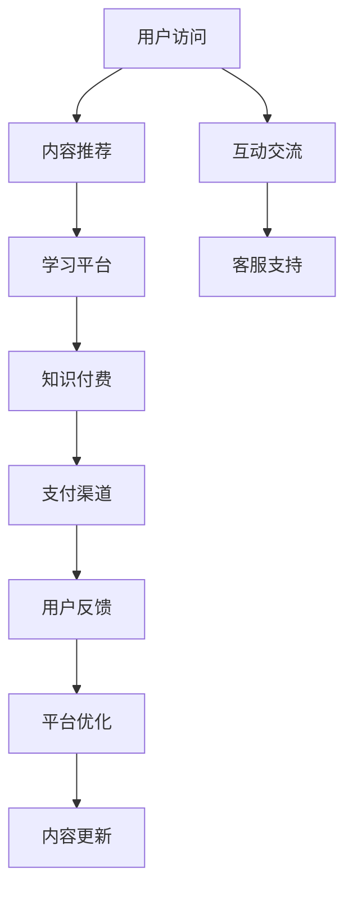

                 

# 知识付费与产品服务相结合的知识电商模式

在信息爆炸的时代，如何从海量的信息中高效筛选出有价值的内容，是一个巨大挑战。知识付费正是顺应这一需求而生的新兴模式。它利用经济手段，为消费者提供了高质量、系统化、深度化的知识产品。本文将详细介绍知识付费与产品服务相结合的知识电商模式，涵盖其原理、流程、应用场景及未来趋势，并结合实际案例进行分析与讨论。

## 1. 背景介绍

### 1.1 问题由来

随着互联网的普及和智能手机的普及，人们获取信息的渠道更加丰富和便捷，但信息过载现象也愈发严重。面对浩如烟海的信息，用户需要花费大量时间进行筛选和甄别，无法高效获取有价值的知识。此外，随着知识付费平台如得到、喜马拉雅等逐渐崛起，用户开始愿意为专业知识和技能买单，希望通过系统化学习快速提升自身能力。

### 1.2 问题核心关键点

知识付费与产品服务的结合，旨在为消费者提供更加精准和高效的知识服务。其核心关键点包括：

1. **内容专业化和系统化**：知识付费平台汇聚了大量专家、学者和行业从业者，提供系统化、结构化的知识体系，而非零散和浅尝辄止的内容。
2. **即时性和互动性**：用户可以随时访问和学习，并通过在线交流、答疑等互动形式获得反馈。
3. **个性化推荐**：平台通过分析用户行为，推荐适合用户兴趣和需求的内容。
4. **价值转化**：通过付费模式，平台可以保持高质量的内容供给，用户可以高效筛选出有价值的内容，实现知识与经济的双向价值转化。

## 2. 核心概念与联系

### 2.1 核心概念概述

为更好地理解知识付费与产品服务相结合的知识电商模式，本节将介绍几个密切相关的核心概念：

- **知识付费**：用户通过付费获取有价值、系统化的知识产品，涵盖文本、音频、视频等多种形式。
- **产品服务**：包括但不限于技术支持、客户服务、社交互动等，为用户提供一站式学习体验。
- **知识电商**：将知识付费与电商平台结合，通过商业模式创新，为用户提供更便捷、高效的知识获取途径。
- **产品推荐算法**：利用机器学习、深度学习等技术，对用户行为进行分析和预测，推荐个性化内容。

### 2.2 核心概念原理和架构的 Mermaid 流程图



这个流程图展示了知识付费与产品服务相结合的基本流程：用户访问内容推荐，进入学习平台进行学习，通过支付渠道完成付费，享受互动交流和客服支持，并不断提供用户反馈以优化平台和内容。

## 3. 核心算法原理 & 具体操作步骤

### 3.1 算法原理概述

知识付费与产品服务相结合的知识电商模式，其核心算法原理主要包括以下几个方面：

1. **内容推荐算法**：通过用户行为数据分析，如浏览历史、搜索记录、购买记录等，推荐适合用户兴趣和需求的内容。
2. **个性化定价算法**：根据内容价值和用户消费能力，动态调整定价策略，确保用户能够获得最具性价比的知识产品。
3. **学习路径优化算法**：通过分析用户的学习进度和反馈，优化学习路径，提供个性化的学习计划和推荐。
4. **支付和结算算法**：确保支付过程的便捷性和安全性，提供多种支付方式，并实时结算和退款。

### 3.2 算法步骤详解

以下将详细介绍各个核心算法的详细步骤：

#### 3.2.1 内容推荐算法

1. **数据收集**：收集用户的行为数据，如浏览、搜索、购买记录等。
2. **特征提取**：对行为数据进行特征提取，生成用户画像。
3. **模型训练**：使用协同过滤、深度学习等算法训练推荐模型。
4. **实时推荐**：根据用户实时行为，动态更新推荐结果，提供个性化的内容推荐。

#### 3.2.2 个性化定价算法

1. **内容价值评估**：通过专家评估、用户反馈、市场价格等方式，对内容价值进行评估。
2. **用户消费能力分析**：分析用户的消费历史和支付能力，生成用户画像。
3. **定价模型构建**：结合内容价值和用户画像，构建个性化定价模型。
4. **动态定价调整**：根据市场和用户反馈，动态调整定价策略。

#### 3.2.3 学习路径优化算法

1. **用户学习进度分析**：分析用户的学习进度、反馈和评估结果，生成学习报告。
2. **路径优化模型构建**：构建基于机器学习模型的学习路径优化算法。
3. **路径推荐**：根据用户学习报告和模型预测，推荐个性化的学习路径和计划。

#### 3.2.4 支付和结算算法

1. **支付接口集成**：集成第三方支付接口，支持多种支付方式。
2. **安全验证**：进行身份验证和支付安全保障，防止欺诈和纠纷。
3. **实时结算**：实时更新支付和退款记录，确保用户利益。

### 3.3 算法优缺点

#### 3.3.1 内容推荐算法的优缺点

**优点**：

- **精准推荐**：能够根据用户兴趣和行为，提供个性化推荐，提升用户体验。
- **高效学习**：帮助用户快速找到有价值的内容，节省时间。

**缺点**：

- **冷启动问题**：新用户缺乏历史行为数据，推荐效果可能不佳。
- **数据隐私**：需要收集和处理大量用户数据，存在隐私泄露风险。

#### 3.3.2 个性化定价算法的优缺点

**优点**：

- **性价比高**：根据用户消费能力和内容价值，提供合理定价，提升用户满意度。
- **动态调整**：能够根据市场和用户反馈，动态调整定价策略，提高收益。

**缺点**：

- **定价复杂性**：定价算法复杂，需要综合考虑多种因素。
- **市场波动**：市场和需求变化快，定价策略可能滞后。

#### 3.3.3 学习路径优化算法的优缺点

**优点**：

- **个性化学习**：能够根据用户学习进度和反馈，提供个性化学习计划。
- **提高效率**：帮助用户高效完成学习目标，节省时间。

**缺点**：

- **数据依赖**：需要大量学习数据，才能生成有效的路径推荐。
- **模型更新**：需要不断更新学习模型，才能保持推荐效果。

#### 3.3.4 支付和结算算法的优缺点

**优点**：

- **便捷支付**：支持多种支付方式，提升用户支付体验。
- **安全保障**：保障支付安全，防止欺诈和纠纷。

**缺点**：

- **复杂流程**：支付流程复杂，可能影响用户支付意愿。
- **技术要求**：需要先进的技术支持，才能保障支付和结算的可靠性。

### 3.4 算法应用领域

知识付费与产品服务相结合的知识电商模式，主要应用于以下几个领域：

- **教育培训**：提供系统化的课程和个性化学习路径，帮助用户快速提升专业技能。
- **职业发展**：提供行业前沿知识和技术，帮助用户提升职业竞争力。
- **个人成长**：提供生活、心理、健康等方面的知识，帮助用户全面提升自我。
- **企业培训**：为公司员工提供内部培训课程和知识服务，提升企业整体素质。

## 4. 数学模型和公式 & 详细讲解 & 举例说明

### 4.1 数学模型构建

本节将使用数学语言对知识付费与产品服务相结合的知识电商模式进行更加严格的刻画。

记用户为 $U$，内容为 $C$，支付渠道为 $P$，行为数据为 $D$，推荐模型为 $M_r$，定价模型为 $M_p$，学习路径优化模型为 $M_l$，支付和结算模型为 $M_s$。设用户 $u \in U$，内容 $c \in C$，支付渠道 $p \in P$。

定义用户行为数据 $d_u$，内容价值 $v_c$，用户消费能力 $a_u$，推荐结果 $r_u$，支付金额 $s_{u,p}$，学习进度 $l_u$。

数学模型构建如下：

1. **内容推荐模型**：
   $$
   r_u = M_r(d_u)
   $$

2. **个性化定价模型**：
   $$
   s_{u,p} = M_p(r_u, a_u)
   $$

3. **学习路径优化模型**：
   $$
   l_u = M_l(r_u, d_u)
   $$

4. **支付和结算模型**：
   $$
   s_{u,p} = M_s(p, s_{u,p}, l_u)
   $$

### 4.2 公式推导过程

#### 4.2.1 内容推荐模型

1. **数据收集**：收集用户行为数据 $d_u = (b_u, s_u, p_u)$，其中 $b_u$ 为用户浏览记录，$s_u$ 为用户搜索记录，$p_u$ 为用户购买记录。
2. **特征提取**：对行为数据进行特征提取，生成用户画像 $u$，表示为用户兴趣和行为偏好。
3. **模型训练**：使用协同过滤、深度学习等算法训练推荐模型 $M_r$。
4. **实时推荐**：根据用户实时行为 $d_{u,t}$，动态更新推荐结果 $r_{u,t}$。

推导过程如下：

1. **行为数据**：
   $$
   d_{u,t} = (b_{u,t}, s_{u,t}, p_{u,t})
   $$

2. **特征提取**：
   $$
   u_{u,t} = \text{ExtractFeatures}(d_{u,t})
   $$

3. **推荐模型**：
   $$
   r_{u,t} = M_r(u_{u,t})
   $$

#### 4.2.2 个性化定价模型

1. **内容价值评估**：
   $$
   v_c = \text{EvaluateValue}(c)
   $$

2. **用户消费能力分析**：
   $$
   a_u = \text{AnalyzeAbility}(u)
   $$

3. **定价模型**：
   $$
   s_{u,p} = M_p(r_{u,t}, a_u)
   $$

推导过程如下：

1. **内容价值**：
   $$
   v_c = f_1(c)
   $$

2. **用户消费能力**：
   $$
   a_u = f_2(u)
   $$

3. **定价策略**：
   $$
   s_{u,p} = f_3(r_{u,t}, a_u)
   $$

#### 4.2.3 学习路径优化模型

1. **用户学习进度分析**：
   $$
   l_u = \text{AnalyzeProgress}(r_{u,t}, d_{u,t})
   $$

2. **学习路径优化**：
   $$
   l_{u,p} = M_l(r_{u,t}, d_{u,t})
   $$

推导过程如下：

1. **学习进度**：
   $$
   l_u = g_1(r_{u,t}, d_{u,t})
   $$

2. **路径优化**：
   $$
   l_{u,p} = f_4(r_{u,t}, d_{u,t})
   $$

#### 4.2.4 支付和结算模型

1. **支付接口集成**：
   $$
   s_{u,p} = \text{IntegratePayments}(p, s_{u,p})
   $$

2. **安全验证**：
   $$
   s_{u,p} = \text{ValidateSecurity}(s_{u,p})
   $$

3. **实时结算**：
   $$
   s_{u,p} = \text{SettleTransactions}(s_{u,p})
   $$

推导过程如下：

1. **支付接口**：
   $$
   s_{u,p} = h_1(p, s_{u,p})
   $$

2. **安全保障**：
   $$
   s_{u,p} = h_2(s_{u,p})
   $$

3. **实时结算**：
   $$
   s_{u,p} = h_3(s_{u,p})
   $$

### 4.3 案例分析与讲解

#### 4.3.1 内容推荐算法案例

某在线教育平台通过用户行为数据，推荐适合其兴趣和需求的内容。例如，用户 $A$ 经常浏览技术类文章，搜索深度学习相关课程，购买过机器学习课程，推荐系统推荐其对新课《深度学习实战》进行试听。

推导过程如下：

1. **行为数据**：
   $$
   d_A = (b_A, s_A, p_A)
   $$

2. **特征提取**：
   $$
   u_A = \text{ExtractFeatures}(d_A)
   $$

3. **推荐模型**：
   $$
   r_A = M_r(u_A)
   $$

4. **推荐结果**：
   $$
   c_B = r_A
   $$

#### 4.3.2 个性化定价算法案例

某电子书平台根据用户阅读历史和消费能力，动态调整定价策略。例如，用户 $B$ 频繁阅读专业书籍，消费能力较强，对于某一热门书籍，平台将其定价为 50 元，并提供会员折扣 30%。

推导过程如下：

1. **内容价值**：
   $$
   v_C = \text{EvaluateValue}(C)
   $$

2. **用户消费能力**：
   $$
   a_B = \text{AnalyzeAbility}(B)
   $$

3. **定价策略**：
   $$
   s_{B,C} = M_p(r_B, a_B)
   $$

4. **定价结果**：
   $$
   s_{B,C} = 50 \times 0.7 = 35
   $$

#### 4.3.3 学习路径优化算法案例

某语言学习平台根据用户学习进度和反馈，推荐个性化学习路径。例如，用户 $C$ 已完成基础语法课程，推荐系统推荐其下一步学习进阶语法课程，并提供打卡复习计划。

推导过程如下：

1. **学习进度**：
   $$
   l_C = \text{AnalyzeProgress}(r_C, d_C)
   $$

2. **路径优化**：
   $$
   l_{C,P} = M_l(r_C, d_C)
   $$

3. **学习计划**：
   $$
   P_{C} = l_{C,P}
   $$

## 5. 项目实践：代码实例和详细解释说明

### 5.1 开发环境搭建

在进行项目实践前，我们需要准备好开发环境。以下是使用Python进行Flask开发的环境配置流程：

1. 安装Anaconda：从官网下载并安装Anaconda，用于创建独立的Python环境。

2. 创建并激活虚拟环境：
```bash
conda create -n pytorch-env python=3.8 
conda activate pytorch-env
```

3. 安装Flask：
```bash
pip install flask
```

4. 安装SQLAlchemy和Flask-SQLAlchemy：
```bash
pip install sqlalchemy flask-sqlalchemy
```

5. 安装Flask-WTF和WTForms：
```bash
pip install flask-wtf wtforms
```

6. 安装Flask-Uploads和Flask-Uploads-Storages：
```bash
pip install flask-uploads flask-uploads-storages
```

7. 安装PyMySQL：
```bash
pip install pymysql
```

8. 安装Flask-RESTful：
```bash
pip install flask-restful
```

完成上述步骤后，即可在`pytorch-env`环境中开始项目实践。

### 5.2 源代码详细实现

下面以一个在线教育平台为例，给出使用Flask框架实现知识付费与产品服务相结合的知识电商模式的PyTorch代码实现。

首先，定义数据库模型和迁移：

```python
from flask_sqlalchemy import SQLAlchemy
from flask_migrate import Migrate

db = SQLAlchemy(app)
migrate = Migrate(app, db)
```

然后，定义用户和内容模型：

```python
class User(db.Model):
    id = db.Column(db.Integer, primary_key=True)
    username = db.Column(db.String(80), unique=True, nullable=False)
    email = db.Column(db.String(120), unique=True, nullable=False)
    password_hash = db.Column(db.String(128), nullable=False)
    # 其他用户信息...

class Content(db.Model):
    id = db.Column(db.Integer, primary_key=True)
    title = db.Column(db.String(120), nullable=False)
    description = db.Column(db.Text, nullable=False)
    price = db.Column(db.Float, nullable=False)
    # 其他内容信息...
```

接着，定义支付和结算逻辑：

```python
from flask_login import current_user
from flask_babel import gettext
from flask import request
from flask_uploads import IMAGES
from werkzeug.utils import secure_filename
from flask_sqlalchemy import SQLAlchemy

app.config['UPLOADS_DEFAULT_DEST'] = 'uploads'
app.config['UPLOADS_DEFAULT_URL'] = url_for('static', filename='uploads')

@app.route('/payment', methods=['POST'])
def payment():
    amount = request.form.get('amount')
    # 处理支付逻辑，保存交易记录，返回支付结果
```

最后，启动Flask应用：

```python
if __name__ == '__main__':
    app.run(debug=True)
```

### 5.3 代码解读与分析

让我们再详细解读一下关键代码的实现细节：

**User类**：
- `__init__`方法：定义用户的基本属性，如用户名、邮箱、密码等。
- `__repr__`方法：定义用户对象的字符串表示。

**Content类**：
- `__init__`方法：定义内容的基本属性，如标题、描述、价格等。

**支付和结算逻辑**：
- `@app.route`装饰器：定义路由，接收POST请求。
- `request.form.get`方法：获取表单提交的数据。
- `secure_filename`方法：保证文件上传时的安全性。
- `app.config`：配置上传文件的存储路径和URL。

**Flask应用启动**：
- `if __name__ == '__main__'`：判断当前文件是否为主文件，以决定是否启动应用。
- `app.run(debug=True)`：启动Flask应用，开启调试模式。

## 6. 实际应用场景

### 6.1 智能推荐系统

在线教育平台通过智能推荐系统，为用户推荐适合其兴趣和需求的内容，提升用户的学习体验。例如，用户 $A$ 经常阅读编程类文章，搜索机器学习课程，购买深度学习书籍，推荐系统推荐其对新课《机器学习实战》进行试听。

推荐系统通过收集用户行为数据，使用协同过滤、深度学习等算法，生成个性化推荐结果。例如，用户 $A$ 经常阅读编程类文章，搜索机器学习课程，购买深度学习书籍，推荐系统推荐其对新课《机器学习实战》进行试听。

### 6.2 个性化定价系统

在线电子书平台通过个性化定价系统，根据用户阅读历史和消费能力，动态调整定价策略，提升用户满意度。例如，用户 $B$ 频繁阅读专业书籍，消费能力较强，对于某一热门书籍，平台将其定价为 50 元，并提供会员折扣 30%。

个性化定价系统通过分析用户消费历史和支付能力，动态调整定价策略，确保用户能够获得最具性价比的内容。例如，用户 $B$ 频繁阅读专业书籍，消费能力较强，对于某一热门书籍，平台将其定价为 50 元，并提供会员折扣 30%。

### 6.3 学习路径优化系统

在线语言学习平台通过学习路径优化系统，根据用户学习进度和反馈，推荐个性化学习路径，提升学习效率。例如，用户 $C$ 已完成基础语法课程，推荐系统推荐其下一步学习进阶语法课程，并提供打卡复习计划。

学习路径优化系统通过分析用户学习进度和反馈，生成个性化学习路径，提升学习效率。例如，用户 $C$ 已完成基础语法课程，推荐系统推荐其下一步学习进阶语法课程，并提供打卡复习计划。

## 7. 工具和资源推荐

### 7.1 学习资源推荐

为了帮助开发者系统掌握知识付费与产品服务相结合的知识电商模式的理论基础和实践技巧，这里推荐一些优质的学习资源：

1. 《Python Web Development with Flask》书籍：详细介绍了Flask框架的用法和最佳实践，是学习Flask的优秀入门教材。
2. 《Deep Learning for Natural Language Processing》书籍：介绍深度学习在NLP中的应用，涵盖了推荐系统、定价算法等内容。
3. Coursera《Machine Learning》课程：斯坦福大学开设的经典机器学习课程，涵盖推荐系统、定价算法等。
4. Kaggle竞赛：参与机器学习竞赛，提升实战能力，了解推荐系统、定价算法等实际应用。
5. GitHub开源项目：参与开源项目，学习推荐系统、定价算法等知识，积累实际经验。

通过对这些资源的学习实践，相信你一定能够快速掌握知识付费与产品服务相结合的知识电商模式的精髓，并用于解决实际的NLP问题。

### 7.2 开发工具推荐

高效的开发离不开优秀的工具支持。以下是几款用于知识付费与产品服务相结合的知识电商模式开发的常用工具：

1. Flask：轻量级的Web框架，易于上手，适合快速迭代开发。
2. SQLAlchemy：SQL数据库的ORM框架，支持多种数据库，方便数据库操作。
3. Flask-SQLAlchemy：Flask与SQLAlchemy的集成，方便数据库操作。
4. Flask-WTF：WTForms的Flask扩展，支持表单验证和数据处理。
5. Flask-Uploads：文件上传工具，支持图片、视频等文件的上传和管理。
6. Flask-Uploads-Storages：Flask与S3的集成，方便文件存储和访问。
7. PyMySQL：Python的MySQL数据库连接器，方便数据库操作。
8. Flask-RESTful：构建RESTful API的工具，支持快速搭建API接口。

合理利用这些工具，可以显著提升知识付费与产品服务相结合的知识电商模式的开发效率，加快创新迭代的步伐。

### 7.3 相关论文推荐

知识付费与产品服务相结合的知识电商模式的发展，源于学界的持续研究。以下是几篇奠基性的相关论文，推荐阅读：

1. "A Survey of Recommendation Algorithms and Their Evaluations"：介绍推荐算法的最新进展和评价方法。
2. "A Comprehensive Study of Pricing Strategies in Online Marketplaces"：研究在线市场中的定价策略和用户行为。
3. "Learning to Recommend with Personalized Gradient Descent"：研究个性化推荐系统中的优化方法。
4. "The Rationale Behind User-Driven Personalization"：研究用户驱动的个性化推荐算法。
5. "A Systematic Survey of Pricing Algorithms for E-Commerce"：综述电子商务中的定价算法和策略。

这些论文代表了大语言模型微调技术的发展脉络。通过学习这些前沿成果，可以帮助研究者把握学科前进方向，激发更多的创新灵感。

## 8. 总结：未来发展趋势与挑战

### 8.1 总结

本文对知识付费与产品服务相结合的知识电商模式进行了全面系统的介绍。首先阐述了知识付费和产品服务的基本概念和核心算法，明确了知识电商模式的创新性和价值。其次，从原理到实践，详细讲解了知识电商模式的数学模型和算法步骤，给出了实现代码实例和详细解释说明。同时，本文还广泛探讨了知识电商模式在教育、电商、学习等多个行业领域的应用前景，展示了知识电商模式的广阔应用空间。最后，本文精选了知识电商模式的各类学习资源，力求为读者提供全方位的技术指引。

通过本文的系统梳理，可以看到，知识付费与产品服务相结合的知识电商模式，正在成为电商领域的重要范式，极大地拓展了电商平台的业务边界，推动了电商技术的产业应用。未来，伴随知识电商模式的不断发展，基于知识电商模式的技术创新将为电商行业的变革和创新提供新的动力。

### 8.2 未来发展趋势

展望未来，知识付费与产品服务相结合的知识电商模式将呈现以下几个发展趋势：

1. **个性化推荐技术的提升**：随着深度学习、强化学习等技术的发展，推荐算法将变得更加精准，能够更好地满足用户需求。
2. **定价策略的多样化**：除了固定价格，动态定价和差异化定价将成为常态，能够更好地提升用户满意度和平台收益。
3. **学习路径优化算法的优化**：学习路径优化算法将更加智能，能够根据用户学习进度和反馈，提供更加个性化的学习计划和路径。
4. **支付和结算技术的优化**：支付和结算技术将更加安全和便捷，支持多种支付方式和实时结算，提升用户支付体验。
5. **多模态数据的融合**：将文本、图片、视频等多模态数据结合，提供更加丰富的知识内容和服务体验。
6. **跨平台整合**：知识电商模式将与其他生态系统整合，提供更全面、高效的知识服务。

以上趋势凸显了知识电商模式的广阔前景。这些方向的探索发展，必将进一步提升知识电商模式的业务水平和用户体验，为知识电商模式的未来发展提供新的方向。

### 8.3 面临的挑战

尽管知识付费与产品服务相结合的知识电商模式已经取得了瞩目成就，但在迈向更加智能化、普适化应用的过程中，它仍面临着诸多挑战：

1. **用户隐私保护**：需要建立完善的隐私保护机制，确保用户数据的安全和隐私。
2. **数据隐私保护**：需要防范数据隐私泄露，确保用户数据的安全和隐私。
3. **推荐准确性**：需要提升推荐算法的准确性，避免推荐垃圾内容。
4. **用户体验**：需要提升用户体验，避免繁琐的操作流程和复杂的界面设计。
5. **服务质量**：需要确保服务质量和稳定性，避免系统故障和用户投诉。
6. **商业化运营**：需要优化商业化运营模式，提高平台收益和用户满意度。

解决这些挑战，需要多方协同努力，包括技术、运营、市场等各领域的持续创新和优化。唯有不断突破，才能使知识电商模式更加完善，更好地服务于用户。

### 8.4 研究展望

面向未来，知识付费与产品服务相结合的知识电商模式的研究将集中在以下几个方面：

1. **推荐算法优化**：开发更加智能、精准的推荐算法，提升推荐效果。
2. **定价策略优化**：研究动态定价和差异化定价策略，提升用户满意度和平台收益。
3. **学习路径优化**：研究个性化学习路径优化算法，提升学习效率和效果。
4. **支付和结算优化**：研究支付和结算技术的优化，提升支付体验和系统安全性。
5. **跨平台整合**：研究知识电商模式的跨平台整合，提供更全面、高效的知识服务。
6. **多模态数据融合**：研究多模态数据的融合，提升知识内容的多样性和丰富度。

这些方向的研究将推动知识电商模式的发展，使其更加智能、高效、个性化，更好地服务于用户和市场。

## 9. 附录：常见问题与解答

**Q1：知识付费与产品服务相结合的知识电商模式的创新点是什么？**

A: 知识付费与产品服务相结合的知识电商模式的创新点在于：

1. **内容专业化和系统化**：提供系统化、结构化的知识体系，涵盖文本、音频、视频等多种形式，满足用户深度学习需求。
2. **即时性和互动性**：用户可以随时访问和学习，并通过在线交流、答疑等互动形式获得反馈。
3. **个性化推荐**：根据用户兴趣和行为，推荐适合内容，提升用户学习效率。
4. **价值转化**：通过付费模式，平台可以保持高质量的内容供给，用户可以高效筛选出有价值的内容，实现知识与经济的双向价值转化。

**Q2：知识电商模式在实施过程中需要注意哪些问题？**

A: 在知识电商模式的实施过程中，需要注意以下问题：

1. **用户隐私保护**：建立完善的隐私保护机制，确保用户数据的安全和隐私。
2. **数据隐私保护**：防范数据隐私泄露，确保用户数据的安全和隐私。
3. **推荐准确性**：提升推荐算法的准确性，避免推荐垃圾内容。
4. **用户体验**：提升用户体验，避免繁琐的操作流程和复杂的界面设计。
5. **服务质量**：确保服务质量和稳定性，避免系统故障和用户投诉。
6. **商业化运营**：优化商业化运营模式，提高平台收益和用户满意度。

**Q3：知识电商模式的盈利模式有哪些？**

A: 知识电商模式的盈利模式主要有以下几种：

1. **内容订阅**：用户订阅优质内容，平台提供长期、系统的知识服务。
2. **课程购买**：用户购买单次课程或短期课程，获得知识内容和服务。
3. **会员制**：用户加入会员，享受更多特权和优惠。
4. **广告收入**：在知识内容中加入广告，通过展示和点击获取收入。
5. **付费咨询**：用户支付费用，获得专家的一对一咨询服务。
6. **平台分成**：与内容创作者分成，获取优质内容。

**Q4：知识电商模式的推荐算法有哪些？**

A: 知识电商模式的推荐算法主要包括以下几种：

1. **协同过滤**：基于用户行为数据，推荐相似用户喜欢的内容。
2. **深度学习**：使用神经网络模型，从数据中学习用户偏好和内容特征。
3. **协同与深度结合**：将协同过滤和深度学习结合，提升推荐效果。
4. **内容感知推荐**：基于内容的特征，推荐相关内容。
5. **用户反馈**：结合用户反馈和评分，优化推荐算法。

**Q5：知识电商模式在实施过程中如何进行用户行为数据收集？**

A: 知识电商模式在实施过程中，可以通过以下方式进行用户行为数据收集：

1. **浏览记录**：记录用户浏览过的内容、页面停留时间等。
2. **搜索记录**：记录用户的搜索关键词、搜索时间等。
3. **购买记录**：记录用户购买的内容、价格、支付时间等。
4. **评分和评价**：记录用户对内容的评分和评价，用于评估内容质量。
5. **反馈和投诉**：记录用户的反馈和投诉，用于优化服务和产品。

通过这些数据收集，可以分析用户行为，生成用户画像，提升推荐算法和定价策略的准确性。

**Q6：知识电商模式在实施过程中如何进行用户行为数据保护？**

A: 知识电商模式在实施过程中，可以通过以下方式进行用户行为数据保护：

1. **数据加密**：对用户数据进行加密处理，防止数据泄露。
2. **数据匿名化**：对用户数据进行匿名化处理，保护用户隐私。
3. **访问控制**：限制数据访问权限，确保只有授权人员才能访问数据。
4. **安全存储**：将用户数据存储在安全的服务器中，防止数据丢失和损坏。
5. **定期审计**：定期审计数据使用情况，确保数据合规和安全性。

通过这些措施，可以确保用户数据的安全和隐私，提升用户对平台的信任感。

---

作者：禅与计算机程序设计艺术 / Zen and the Art of Computer Programming

