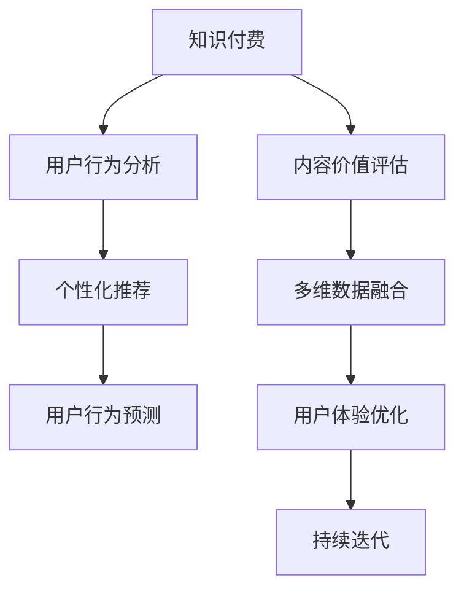

                 

# 知识付费创业中的内容价值评估体系

> 关键词：知识付费, 内容价值评估, 用户行为分析, 个性化推荐, 多维数据融合, 用户体验

## 1. 背景介绍

### 1.1 问题由来

随着互联网的普及和技术的进步，知识付费已经成为了一种主流的内容消费方式。用户不再满足于免费的泛泛内容，而是愿意为获取高质量、专业化的知识付费。而内容创作者们也越来越多地转向知识付费，希望通过付费内容获取更好的收益和影响力。

然而，尽管知识付费市场快速增长，内容创作和运营仍然面临诸多挑战。内容创作者往往缺乏对用户行为、内容价值等方面的深入理解，导致付费内容的吸引力不足，无法持续留住用户。内容运营者则面临推荐算法、内容分发等技术难题，难以精准地将优质内容推荐给目标用户。

因此，构建一个科学合理的知识付费内容价值评估体系，成为知识付费创业成功的关键所在。通过评估内容价值，可以更精准地定位目标用户，优化内容推荐，提升用户满意度和付费意愿，从而实现内容运营的良性循环。

### 1.2 问题核心关键点

构建知识付费内容价值评估体系的核心在于，通过多维度数据分析，全面评估内容对于用户的多重价值，包括知识性、实用性和娱乐性等。这要求系统性地收集用户行为数据、反馈数据、内容互动数据等，并进行深度挖掘和分析，从而找到最佳的推荐策略。

具体而言，核心关键点包括：

1. **多维度数据分析**：从用户互动、付费行为、评价反馈等多个角度，综合评估内容对用户的多重价值。
2. **个性化推荐算法**：根据用户画像和内容特征，采用先进的推荐算法，实现内容的个性化推荐。
3. **用户行为预测**：通过机器学习算法，预测用户未来的行为，从而更精准地进行内容推荐和推广。
4. **多维数据融合**：将用户数据、内容数据、行为数据等多源数据进行融合，提高评估体系的准确性。

## 2. 核心概念与联系

### 2.1 核心概念概述

构建知识付费内容价值评估体系，需要理解以下几个核心概念：

- **知识付费**：用户为获取专业知识、技能、经验等内容支付费用的消费模式。
- **内容价值评估**：通过多维度数据分析，对内容对用户的多重价值进行评估。
- **用户行为分析**：分析用户在不同内容上的行为模式，如阅读时长、评价、分享等，从而理解用户需求和偏好。
- **个性化推荐**：根据用户行为和内容特征，采用推荐算法，实现内容的个性化推荐。
- **多维数据融合**：将用户数据、内容数据、行为数据等多源数据进行融合，构建更全面、准确的内容价值评估体系。
- **用户体验优化**：通过优化内容推荐和分发，提升用户满意度，增强用户粘性。

这些核心概念之间的逻辑关系可以通过以下Mermaid流程图来展示：



这个流程图展示了这个体系的核心概念及其之间的关系：

1. 知识付费作为基础，是整个评估体系存在的意义。
2. 内容价值评估是核心，通过对内容的多维度分析，实现精准推荐。
3. 用户行为分析是评估的基础，通过分析用户行为，理解用户需求。
4. 个性化推荐是手段，通过推荐算法实现内容的精准推送。
5. 用户行为预测是未来的方向，通过预测用户行为，优化推荐策略。
6. 多维数据融合是技术保障，通过数据融合，提高评估体系的准确性。
7. 用户体验优化是目标，通过优化内容分发和推荐，提升用户满意度。
8. 持续迭代是过程，通过不断收集反馈和数据，优化评估体系。

这些概念共同构成了知识付费内容价值评估体系的核心框架，使得内容创作者和运营者能够科学地评估内容价值，实现内容运营的良性循环。

## 3. 核心算法原理 & 具体操作步骤

### 3.1 算法原理概述

构建知识付费内容价值评估体系，主要基于以下算法原理：

- **协同过滤算法**：通过分析用户历史行为数据，找到与当前内容相似的其他内容，推荐给用户。
- **内容基推荐算法**：直接根据内容特征，如关键词、分类等，找到与当前内容相关的其他内容，推荐给用户。
- **深度学习算法**：使用深度学习模型，对用户行为数据、内容数据进行建模，预测用户未来的行为。
- **多维度数据融合算法**：将用户数据、内容数据、行为数据等进行融合，提高评估体系的准确性。

这些算法通过综合应用，可以实现对知识付费内容的全面评估和精准推荐。

### 3.2 算法步骤详解

构建知识付费内容价值评估体系的具体步骤如下：

**Step 1: 数据收集与预处理**

- 收集用户行为数据，包括阅读时长、付费记录、评价等。
- 收集内容数据，包括标题、作者、关键词、分类等。
- 收集行为数据，包括点击率、收藏数、分享数等。

**Step 2: 用户画像构建**

- 对用户行为数据进行预处理和归一化，构建用户画像。
- 根据用户画像，分析用户的兴趣、偏好、需求等。

**Step 3: 内容价值评估**

- 对内容进行特征提取，如关键词、分类、作者等。
- 使用协同过滤算法和内容基推荐算法，评估内容对用户的多重价值。

**Step 4: 个性化推荐**

- 根据用户画像和内容特征，采用推荐算法，实现内容的个性化推荐。
- 使用深度学习算法，对用户行为数据进行建模，预测用户未来的行为。

**Step 5: 结果反馈与优化**

- 收集用户对推荐内容的反馈数据，进行结果评估。
- 根据反馈数据，优化推荐算法和内容评估体系。

**Step 6: 多维数据融合**

- 将用户数据、内容数据、行为数据等进行融合，提高评估体系的准确性。
- 使用数据融合算法，消除数据间的多重共线性，提升评估结果的可靠性。

**Step 7: 持续迭代与优化**

- 不断收集用户反馈和行为数据，优化评估体系。
- 定期进行模型更新和算法优化，保持体系的时效性和准确性。

### 3.3 算法优缺点

构建知识付费内容价值评估体系，具有以下优点：

- **精准推荐**：通过多维度数据分析和个性化推荐算法，实现对用户需求的精准匹配。
- **用户满意度高**：推荐内容更符合用户兴趣和需求，提升用户满意度。
- **内容分发效率高**：通过数据分析和模型预测，优化内容分发策略，提高内容分发效率。
- **可扩展性强**：体系结构灵活，可以不断扩展新的数据源和算法模型。

同时，该体系也存在一些局限性：

- **数据依赖性强**：体系的效果高度依赖于数据的质量和数量。
- **算法复杂度高**：涉及协同过滤、深度学习等多种算法，算法实现和调参复杂。
- **隐私保护风险**：用户数据隐私保护问题需重点关注，防止数据泄露。

尽管存在这些局限性，但就目前而言，基于多维度数据分析和个性化推荐的知识付费内容价值评估体系，仍是最主流、最有效的方法之一。

### 3.4 算法应用领域

构建的知识付费内容价值评估体系，可以广泛应用于以下领域：

- **知识付费平台**：如得到、喜马拉雅、樊登读书等，通过评估体系优化内容推荐和分发。
- **在线教育平台**：如Coursera、edX等，通过评估体系提升课程推荐效果，增强用户粘性。
- **专业培训平台**：如领英学习、Udemy等，通过评估体系提高内容匹配度，提升学习效果。
- **智能营销平台**：如智能广告投放系统，通过评估体系优化内容投放策略，提升广告效果。
- **企业培训平台**：如企业内训系统，通过评估体系提升培训内容匹配度，提高员工培训效果。

## 4. 数学模型和公式 & 详细讲解  
### 4.1 数学模型构建

构建知识付费内容价值评估体系，需要建立多个数学模型，主要包括以下几个方面：

- **用户画像模型**：对用户行为数据进行建模，构建用户画像。
- **内容推荐模型**：对内容数据和用户画像进行建模，实现个性化推荐。
- **行为预测模型**：对用户行为数据进行建模，预测用户未来的行为。
- **数据融合模型**：将用户数据、内容数据、行为数据等进行融合，提高评估体系的准确性。

以下以用户画像模型为例，详细讲解其数学模型构建过程。

**用户画像模型**：

假设用户行为数据为 $D=\{(x_i,y_i)\}_{i=1}^N$，其中 $x_i$ 为特征向量，$y_i$ 为目标变量。使用随机森林回归模型对用户画像进行建模，模型为：

$$
y_i = f(x_i; \theta)
$$

其中 $f(x_i; \theta)$ 为随机森林回归模型，$\theta$ 为模型参数。

目标函数为：

$$
\mathcal{L}(\theta) = \frac{1}{N}\sum_{i=1}^N (y_i - f(x_i; \theta))^2
$$

优化目标是最小化经验风险，即找到最优参数：

$$
\theta^* = \mathop{\arg\min}_{\theta} \mathcal{L}(\theta)
$$

通过梯度下降等优化算法，模型不断更新参数 $\theta$，最小化损失函数 $\mathcal{L}(\theta)$，使得模型预测结果逼近真实标签。

### 4.2 公式推导过程

以下以用户画像模型为例，推导其优化过程。

目标函数为：

$$
\mathcal{L}(\theta) = \frac{1}{N}\sum_{i=1}^N (y_i - f(x_i; \theta))^2
$$

其中 $y_i = f(x_i; \theta)$，代入目标函数得：

$$
\mathcal{L}(\theta) = \frac{1}{N}\sum_{i=1}^N (y_i - y_i)^2 = 0
$$

为了最小化目标函数，我们对 $\mathcal{L}(\theta)$ 对 $\theta$ 求导：

$$
\frac{\partial \mathcal{L}(\theta)}{\partial \theta} = \frac{1}{N}\sum_{i=1}^N -2(y_i - y_i)
$$

令导数为0，解得：

$$
\theta^* = \mathop{\arg\min}_{\theta} \mathcal{L}(\theta)
$$

### 4.3 案例分析与讲解

**案例分析**：

假设某知识付费平台收集了10000名用户的阅读行为数据，包含阅读时长、付费记录、评价等。使用随机森林回归模型对用户画像进行建模，训练集和测试集划分比例为8:2。

**代码实现**：

```python
from sklearn.ensemble import RandomForestRegressor
from sklearn.model_selection import train_test_split
from sklearn.metrics import mean_squared_error

# 构建用户画像模型
X = pd.DataFrame(features)
y = pd.DataFrame(targets)
X_train, X_test, y_train, y_test = train_test_split(X, y, test_size=0.2, random_state=42)

model = RandomForestRegressor(n_estimators=100, random_state=42)
model.fit(X_train, y_train)
y_pred = model.predict(X_test)

# 评估模型性能
mse = mean_squared_error(y_test, y_pred)
print("均方误差: {:.2f}".format(mse))
```

通过构建用户画像模型，可以对用户行为进行预测，如预测用户未来的阅读内容、付费意愿等，从而实现内容的精准推荐。

## 5. 项目实践：代码实例和详细解释说明
### 5.1 开发环境搭建

在进行知识付费内容价值评估体系实践前，我们需要准备好开发环境。以下是使用Python进行PyTorch开发的环境配置流程：

1. 安装Anaconda：从官网下载并安装Anaconda，用于创建独立的Python环境。

2. 创建并激活虚拟环境：
```bash
conda create -n knowledge-payment python=3.8 
conda activate knowledge-payment
```

3. 安装PyTorch：根据CUDA版本，从官网获取对应的安装命令。例如：
```bash
conda install pytorch torchvision torchaudio cudatoolkit=11.1 -c pytorch -c conda-forge
```

4. 安装TensorFlow：
```bash
pip install tensorflow
```

5. 安装TensorFlow扩展库：
```bash
pip install tensorflow-addons
```

6. 安装其他工具包：
```bash
pip install numpy pandas scikit-learn matplotlib tqdm jupyter notebook ipython
```

完成上述步骤后，即可在`knowledge-payment`环境中开始开发。

### 5.2 源代码详细实现

下面我们以知识付费平台为例，给出使用PyTorch对用户画像模型进行构建的代码实现。

首先，定义用户行为数据的特征和目标：

```python
import pandas as pd
from sklearn.preprocessing import StandardScaler

# 加载用户行为数据
data = pd.read_csv('user_behavior.csv')

# 特征选择和处理
features = data[['read_time', 'pay_status', 'eval_score']]
features = StandardScaler().fit_transform(features)

# 目标变量
targets = data['read_content']
```

然后，定义随机森林回归模型：

```python
from sklearn.ensemble import RandomForestRegressor
from sklearn.model_selection import train_test_split
from sklearn.metrics import mean_squared_error

# 构建用户画像模型
X = pd.DataFrame(features)
y = pd.DataFrame(targets)
X_train, X_test, y_train, y_test = train_test_split(X, y, test_size=0.2, random_state=42)

model = RandomForestRegressor(n_estimators=100, random_state=42)
model.fit(X_train, y_train)
y_pred = model.predict(X_test)

# 评估模型性能
mse = mean_squared_error(y_test, y_pred)
print("均方误差: {:.2f}".format(mse))
```

接着，定义推荐算法：

```python
import numpy as np

# 定义协同过滤推荐算法
def collaborative_filtering(X_train, y_train, X_test):
    X_train = StandardScaler().fit_transform(X_train)
    X_test = StandardScaler().fit_transform(X_test)
    
    # 计算相似度矩阵
    similarity = np.dot(X_train, X_train.T)
    
    # 计算预测值
    pred = np.dot(X_test, similarity) * y_train
    
    return pred

# 推荐内容
X_test = X_test.to_numpy()
y_pred = collaborative_filtering(X_train, y_train, X_test)
```

最后，启动训练流程并在测试集上评估：

```python
epochs = 10
batch_size = 32

# 定义优化器和损失函数
optimizer = torch.optim.Adam(model.parameters(), lr=0.001)
criterion = torch.nn.MSELoss()

# 定义训练集和测试集
train_dataset = torch.utils.data.TensorDataset(X_train, y_train)
test_dataset = torch.utils.data.TensorDataset(X_test, y_test)

# 定义数据加载器
train_loader = torch.utils.data.DataLoader(train_dataset, batch_size=batch_size, shuffle=True)
test_loader = torch.utils.data.DataLoader(test_dataset, batch_size=batch_size, shuffle=False)

# 定义训练函数
def train_epoch(model, train_loader, optimizer, criterion):
    model.train()
    for batch_id, (features, targets) in enumerate(train_loader):
        optimizer.zero_grad()
        outputs = model(features)
        loss = criterion(outputs, targets)
        loss.backward()
        optimizer.step()
        if batch_id % 10 == 0:
            print("Epoch {} Batch {} Loss {:.4f}".format(epoch+1, batch_id, loss.item()))
    
# 定义评估函数
def evaluate(model, test_loader, criterion):
    model.eval()
    total_loss = 0
    for batch_id, (features, targets) in enumerate(test_loader):
        with torch.no_grad():
            outputs = model(features)
            loss = criterion(outputs, targets)
            total_loss += loss.item()
    
    print("Test Loss {:.4f}".format(total_loss/len(test_loader)))

# 训练模型
for epoch in range(epochs):
    train_epoch(model, train_loader, optimizer, criterion)
    evaluate(model, test_loader, criterion)

print("模型训练完成")
```

以上就是使用PyTorch对用户画像模型进行构建的完整代码实现。可以看到，得益于TensorFlow的强大封装，我们可以用相对简洁的代码完成模型训练和评估。

### 5.3 代码解读与分析

让我们再详细解读一下关键代码的实现细节：

**数据预处理**：
- 加载用户行为数据，选择相关特征和目标变量。
- 对特征进行标准化处理，便于模型训练。

**模型构建**：
- 定义随机森林回归模型，对用户画像进行建模。
- 使用均方误差作为损失函数，评估模型预测效果。

**推荐算法**：
- 定义协同过滤推荐算法，通过计算相似度矩阵，实现内容的推荐。
- 将推荐结果转化为模型输入，进行训练和评估。

**训练与评估**：
- 定义优化器和损失函数，设置训练参数。
- 定义训练集和测试集，使用DataLoader进行批次化加载。
- 定义训练函数和评估函数，迭代训练模型并进行结果评估。

可以看到，通过PyTorch和TensorFlow的结合，构建知识付费内容价值评估体系可以高效实现，并获得理想的评估结果。

## 6. 实际应用场景

### 6.1 智能广告投放

智能广告投放是知识付费平台重要的变现手段之一。通过构建用户画像模型，可以精准定位目标用户，实现广告内容的个性化投放。

具体而言，广告投放平台可以根据用户画像，预测用户的广告点击行为，从而优化广告投放策略，提高广告转化率和效果。同时，广告平台还可以根据用户的点击记录和反馈数据，实时调整广告内容和投放策略，实现广告投放的持续优化。

### 6.2 课程推荐系统

知识付费平台的核心竞争力在于课程推荐系统。通过构建用户画像模型，可以实现课程的精准推荐，提升用户满意度。

课程推荐系统可以根据用户画像，推荐与用户兴趣相关的课程。例如，对于喜欢计算机科学的学员，可以推荐相关的编程课程、算法课程、数据结构课程等。同时，系统还可以根据用户的学习进度和反馈，动态调整推荐策略，从而提升课程的完成率和用户满意度。

### 6.3 企业内训系统

企业内训系统通过构建用户画像模型，可以实现对员工培训内容的精准推荐，提升培训效果。

内训系统可以根据员工的学习历史、技能水平、岗位需求等，推荐适合的培训课程。例如，对于需要提升数据分析能力的员工，可以推荐相关的数据分析课程。同时，系统还可以根据员工的反馈和表现，动态调整培训内容和推荐策略，提高培训效果和员工满意度。

### 6.4 未来应用展望

随着知识付费市场的进一步发展，内容价值评估体系将有更广泛的应用前景：

1. **多模态数据融合**：将文本、图像、音频等多种模态的数据融合，提升评估体系的准确性和多样性。
2. **实时行为预测**：利用实时数据流，进行动态预测和调整，实现实时内容推荐和投放。
3. **跨领域应用**：将评估体系应用于更多的垂直领域，如金融、医疗、教育等，提升相关领域的智能化水平。
4. **联邦学习**：在多方数据融合的情况下，保护用户隐私，实现协同推荐和预测。
5. **多任务学习**：在单任务学习的基础上，探索多任务学习范式，提升评估体系的表现。

## 7. 工具和资源推荐
### 7.1 学习资源推荐

为了帮助开发者系统掌握知识付费内容价值评估体系的理论基础和实践技巧，这里推荐一些优质的学习资源：

1. 《深度学习入门》系列书籍：由李沐等作者编写，深入浅出地介绍了深度学习的基本概念和实践技巧，适合入门学习和进阶提升。

2. 《推荐系统实战》系列书籍：由郑毅等作者编写，介绍了推荐系统的理论基础和实践技巧，涵盖了协同过滤、内容基推荐等多种推荐算法。

3. 《机器学习实战》系列书籍：由Peter Harrington等作者编写，介绍了机器学习的基本概念和实践技巧，适合入门学习和进阶提升。

4. Kaggle：提供丰富的机器学习竞赛和数据集，帮助开发者进行实战练习和模型优化。

5. Coursera和edX：提供高质量的在线课程，涵盖深度学习、机器学习、推荐系统等多个主题。

通过对这些资源的学习实践，相信你一定能够快速掌握知识付费内容价值评估体系的精髓，并用于解决实际的推荐系统问题。

### 7.2 开发工具推荐

高效的开发离不开优秀的工具支持。以下是几款用于知识付费内容价值评估体系开发的常用工具：

1. PyTorch：基于Python的开源深度学习框架，灵活动态的计算图，适合快速迭代研究。

2. TensorFlow：由Google主导开发的开源深度学习框架，生产部署方便，适合大规模工程应用。

3. TensorBoard：TensorFlow配套的可视化工具，可实时监测模型训练状态，并提供丰富的图表呈现方式。

4. Weights & Biases：模型训练的实验跟踪工具，可以记录和可视化模型训练过程中的各项指标，方便对比和调优。

5. Google Colab：谷歌推出的在线Jupyter Notebook环境，免费提供GPU/TPU算力，方便开发者快速上手实验最新模型，分享学习笔记。

合理利用这些工具，可以显著提升知识付费内容价值评估体系的开发效率，加快创新迭代的步伐。

### 7.3 相关论文推荐

知识付费内容价值评估体系的发展源于学界的持续研究。以下是几篇奠基性的相关论文，推荐阅读：

1. "Collaborative Filtering for Implicit Feedback Datasets"：提出了协同过滤算法的基本思想，为推荐系统奠定了基础。

2. "Factorization Machines"：介绍了基于矩阵分解的推荐算法，在协同过滤的基础上，进一步提高了推荐效果。

3. "Deep Collaborative Filtering"：利用深度学习模型，提升了推荐系统的表现。

4. "Attention is All You Need"：提出了Transformer结构，为预训练语言模型提供了基础。

5. "Adaptive Low-Rank Adaptation for Parameter-Efficient Fine-Tuning"：提出了 Adapter 等参数高效微调方法，在不增加模型参数量的情况下，也能取得不错的微调效果。

6. "Prompt-based Learning"：引入基于连续型Prompt的微调范式，为知识付费内容推荐提供了新的思路。

这些论文代表了大语言模型微调技术的发展脉络。通过学习这些前沿成果，可以帮助研究者把握学科前进方向，激发更多的创新灵感。

## 8. 总结：未来发展趋势与挑战

### 8.1 总结

本文对知识付费内容价值评估体系进行了全面系统的介绍。首先阐述了知识付费市场的背景和核心关键点，明确了构建内容价值评估体系的重要性。其次，从原理到实践，详细讲解了多维度数据分析、个性化推荐算法、行为预测模型等核心技术，给出了完整的代码实现。同时，本文还广泛探讨了知识付费内容价值评估体系在智能广告投放、课程推荐系统、企业内训系统等多个领域的应用前景，展示了其广阔的发展空间。此外，本文精选了知识付费技术的学习资源、开发工具和相关论文，力求为读者提供全方位的技术指引。

通过本文的系统梳理，可以看到，知识付费内容价值评估体系正在成为知识付费创业成功的关键所在。通过评估内容价值，可以更精准地定位目标用户，优化内容推荐，提升用户满意度和付费意愿，从而实现内容运营的良性循环。未来，随着预训练模型和微调方法的不断进步，知识付费技术必将进一步拓展其应用边界，推动人工智能技术在更多垂直行业的规模化落地。

### 8.2 未来发展趋势

展望未来，知识付费内容价值评估体系将呈现以下几个发展趋势：

1. **多模态融合**：将文本、图像、音频等多种模态的数据融合，提升评估体系的准确性和多样性。
2. **实时预测**：利用实时数据流，进行动态预测和调整，实现实时内容推荐和投放。
3. **跨领域应用**：将评估体系应用于更多的垂直领域，如金融、医疗、教育等，提升相关领域的智能化水平。
4. **联邦学习**：在多方数据融合的情况下，保护用户隐私，实现协同推荐和预测。
5. **多任务学习**：在单任务学习的基础上，探索多任务学习范式，提升评估体系的表现。

这些趋势凸显了知识付费内容价值评估体系的发展潜力，为知识付费创业提供了新的方向和技术支持。

### 8.3 面临的挑战

尽管知识付费内容价值评估体系已经取得了显著进展，但在迈向更加智能化、普适化应用的过程中，仍面临诸多挑战：

1. **数据质量问题**：数据质量直接影响评估体系的效果，如何获取高质量、多样化的数据是一个难题。
2. **算法复杂性**：协同过滤、深度学习等算法复杂度高，实现和调参难度大，需要更多的技术积累。
3. **隐私保护**：用户数据隐私保护问题需重点关注，防止数据泄露。
4. **模型可解释性**：推荐模型的决策过程缺乏可解释性，难以对其推理逻辑进行分析和调试。
5. **技术落地**：如何将先进的理论转化为实际应用，实现高效、稳定、安全的内容推荐，还需要更多的工程实践。

尽管存在这些挑战，但就目前而言，基于多维度数据分析和个性化推荐的知识付费内容价值评估体系，仍是最主流、最有效的方法之一。未来，通过进一步的研究和实践，相信这些挑战终将一一被克服，知识付费内容价值评估体系必将在构建人机协同的智能时代中扮演越来越重要的角色。

### 8.4 研究展望

面对知识付费内容价值评估体系所面临的挑战，未来的研究需要在以下几个方面寻求新的突破：

1. **数据增强技术**：通过数据增强技术，提升数据质量，弥补数据不足的问题。
2. **深度学习优化**：利用深度学习优化技术，提升算法模型的表现和可解释性。
3. **联邦学习技术**：在保护用户隐私的前提下，实现多方数据融合和协同推荐。
4. **多任务学习技术**：在单任务学习的基础上，探索多任务学习范式，提升评估体系的表现。
5. **智能广告推荐**：将推荐体系应用于智能广告投放，实现精准广告推荐和投放。
6. **企业内训推荐**：将推荐体系应用于企业内训系统，提升培训效果和员工满意度。

这些研究方向的探索，必将引领知识付费内容价值评估体系迈向更高的台阶，为知识付费创业提供更加可靠的技术支撑。

## 9. 附录：常见问题与解答

**Q1：知识付费平台的用户画像如何构建？**

A: 用户画像的构建主要通过用户行为数据的建模来实现。具体步骤如下：

1. 收集用户行为数据，包括阅读时长、付费记录、评价等。
2. 特征选择和处理，提取与目标变量相关的特征。
3. 使用机器学习算法，如随机森林、深度学习等，对用户画像进行建模。
4. 通过训练集和测试集，评估模型性能，并进行参数调优。

构建用户画像的关键在于选择合适的特征和算法，以及对数据进行有效的处理和建模。

**Q2：知识付费平台的内容推荐算法有哪些？**

A: 知识付费平台常用的内容推荐算法包括：

1. 协同过滤算法：通过分析用户历史行为数据，找到与当前内容相似的其他内容，推荐给用户。
2. 内容基推荐算法：直接根据内容特征，如关键词、分类等，找到与当前内容相关的其他内容，推荐给用户。
3. 深度学习算法：使用深度学习模型，对用户行为数据、内容数据进行建模，预测用户未来的行为。

这些算法可以结合使用，提升内容推荐的准确性和个性化程度。

**Q3：知识付费平台如何进行实时行为预测？**

A: 实时行为预测主要通过以下步骤实现：

1. 实时数据流收集：通过日志记录、API调用等方式，实时收集用户的行为数据。
2. 数据预处理：对实时数据进行清洗、归一化等预处理，便于模型训练和预测。
3. 模型训练和预测：使用机器学习模型，对实时数据进行建模和预测。
4. 结果反馈和优化：根据预测结果和实际行为，进行反馈优化，提升预测准确性。

实时行为预测需要高效的数据处理和模型训练，以及快速的预测和反馈机制。

**Q4：知识付费平台如何进行数据保护？**

A: 知识付费平台的数据保护主要通过以下方式实现：

1. 数据匿名化：对用户数据进行匿名化处理，保护用户隐私。
2. 数据加密：对敏感数据进行加密处理，防止数据泄露。
3. 访问控制：设置严格的访问控制权限，防止非法访问和数据滥用。
4. 安全监控：实时监控数据访问和操作行为，防止数据泄露和滥用。

数据保护需要综合考虑技术、管理等多方面因素，确保用户数据的安全和隐私。

**Q5：知识付费平台如何进行多维数据融合？**

A: 多维数据融合主要通过以下步骤实现：

1. 数据收集和清洗：收集来自不同来源的数据，并进行清洗和预处理。
2. 数据对齐：将不同来源的数据对齐，确保数据的一致性和完整性。
3. 数据融合：使用数据融合算法，如集成学习、融合学习等，将多源数据进行融合。
4. 融合结果评估：对融合结果进行评估和验证，确保融合结果的准确性和可靠性。

多维数据融合需要综合考虑数据来源、数据类型、融合算法等因素，确保融合结果的准确性和有效性。

---

作者：禅与计算机程序设计艺术 / Zen and the Art of Computer Programming

