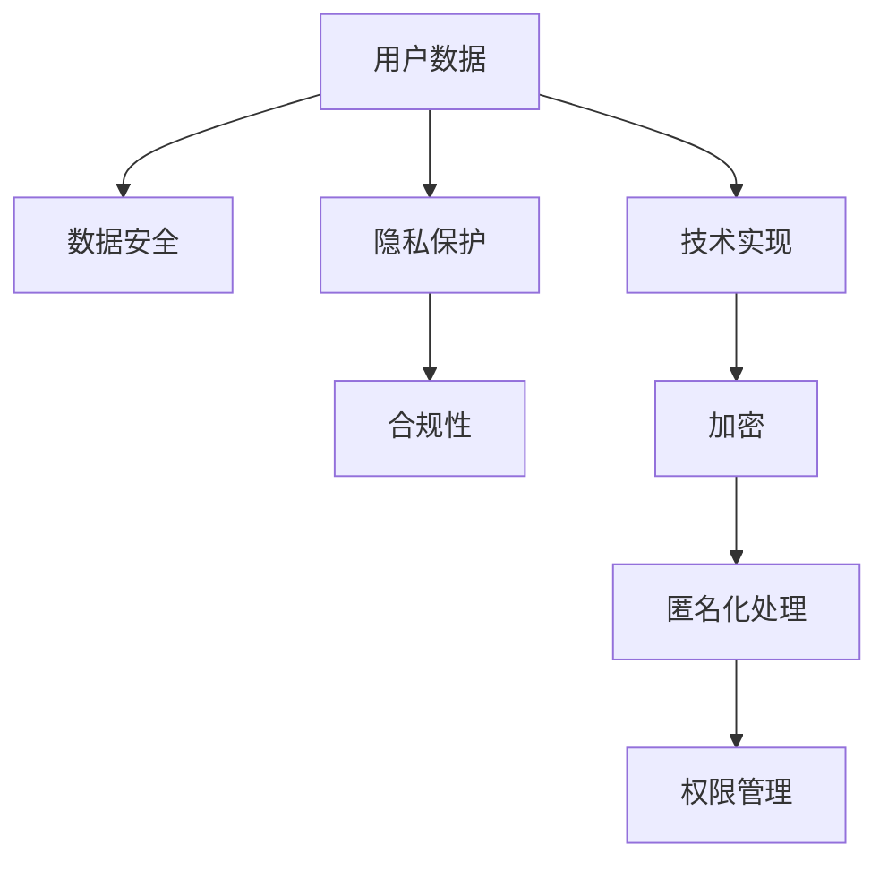

                 

# 知识付费创业中的用户数据安全与隐私保护

> 关键词：知识付费,用户数据,数据安全,隐私保护,合规性,技术实现

## 1. 背景介绍

### 1.1 问题由来

近年来，知识付费赛道迅速崛起，各大平台纷纷推出各类付费课程、音频书籍、在线讲座等服务。随着用户数量的不断增长，数据安全与隐私保护问题也日益突显，成为了知识付费平台面临的关键挑战之一。

相较于免费互联网服务，知识付费业务具有更为敏感的用户行为数据和个人信息，且用户对隐私保护的要求更高。因此，如何在保护用户隐私的前提下，提供优质的付费内容，提升用户体验，成为知识付费创业公司亟需解决的问题。

### 1.2 问题核心关键点

用户数据安全与隐私保护的核心关键点在于：

- 确保用户数据的机密性、完整性和可用性，防止数据泄露、篡改或破坏。
- 严格遵守隐私保护法规，如GDPR、CCPA等，保护用户的基本权利。
- 高效、可靠地监测和应对潜在的安全威胁，及时发现并修复漏洞。
- 构建完善的隐私保护体系，包括数据生命周期管理、合规性评估等。
- 通过技术手段实现用户隐私保护，如数据加密、匿名化处理等。

## 2. 核心概念与联系

### 2.1 核心概念概述

为了更好地理解知识付费平台的用户数据安全与隐私保护，我们首先介绍几个核心概念：

- **用户数据**：用户在使用知识付费服务时产生的行为数据和个人信息，如用户ID、学习记录、搜索历史、支付信息等。
- **数据安全**：确保用户数据在存储、传输和使用过程中不被未授权访问、篡改或破坏，防止数据泄露和数据滥用。
- **隐私保护**：遵守相关隐私保护法规，保护用户的基本隐私权利，如知情权、选择权、被遗忘权等。
- **合规性**：确保平台在数据处理过程中遵循隐私保护法规和行业标准，避免法律风险。
- **技术实现**：通过具体的技术手段和策略，实现用户数据的加密、匿名化处理、权限管理等。

这些概念之间的联系可以通过以下Mermaid流程图来展示：



这个流程图展示了用户数据安全与隐私保护的关键流程：

1. 用户数据生成后，首先进入数据安全环节，确保其完整性和可用性。
2. 在数据安全的基础上，隐私保护环节保障用户的基本权利。
3. 合规性确保平台数据处理过程合法合规，避免法律风险。
4. 技术实现环节通过加密、匿名化处理等手段，实现用户数据的安全处理。

## 3. 核心算法原理 & 具体操作步骤

### 3.1 算法原理概述

用户数据安全与隐私保护的核心算法原理包括：

- **数据加密**：将数据转化为难以解读的密文，确保数据在传输和存储过程中不被非法访问。
- **数据匿名化**：通过去除或修改用户标识信息，使得数据难以与特定用户关联，保护用户隐私。
- **权限管理**：根据用户角色和权限，合理设置数据访问权限，防止数据滥用。
- **合规性评估**：定期审查平台数据处理流程，确保符合相关法规要求，避免法律风险。

### 3.2 算法步骤详解

基于上述算法原理，数据安全与隐私保护的具体操作步骤如下：

1. **数据加密**：
   - 对存储用户数据的服务器进行加密配置，如使用HTTPS协议传输数据。
   - 采用对称加密算法（如AES）加密敏感数据，存储加密密钥在安全的密钥管理系统中。
   - 使用公钥加密算法（如RSA）对密钥进行加密存储，确保密钥的安全性。

2. **数据匿名化**：
   - 对用户数据进行去标识化处理，如对姓名、身份证号等敏感信息进行脱敏处理。
   - 采用假名化技术，用随机生成的ID代替真实用户ID，保护用户隐私。
   - 在数据查询和分析时，限制用户ID的使用，避免直接关联到具体用户。

3. **权限管理**：
   - 根据用户角色设置访问权限，如管理员可以访问所有数据，而普通用户只能访问部分数据。
   - 使用RBAC（基于角色的访问控制）模型，根据用户角色分配权限，限制数据访问。
   - 对敏感数据进行细粒度权限控制，确保只有授权用户才能访问。

4. **合规性评估**：
   - 定期对平台数据处理流程进行合规性审查，如检查数据存储、传输、使用是否符合GDPR等法规要求。
   - 建立合规性评估机制，定期进行隐私保护自查，及时发现并修正问题。
   - 与第三方合规机构合作，进行合规性审计，确保平台符合行业标准和法规要求。

### 3.3 算法优缺点

基于上述算法，用户数据安全与隐私保护的优势和劣势如下：

**优点**：
- 确保用户数据在存储和传输过程中不被非法访问，保障数据安全性。
- 通过数据匿名化和权限管理，保护用户隐私，避免数据滥用。
- 定期合规性评估，确保平台数据处理流程合法合规，避免法律风险。

**缺点**：
- 加密和匿名化处理可能导致数据冗余增加，影响系统性能。
- 权限管理复杂度高，需要设计合适的权限模型。
- 合规性审查和自查需要投入较多人力和时间，增加运营成本。

## 4. 数学模型和公式 & 详细讲解 & 举例说明

### 4.1 数学模型构建

用户数据安全与隐私保护的数学模型通常包括：

- **数据加密模型**：假设明文为 $m$，加密密钥为 $k$，密文为 $c$，则加密过程可以表示为 $c = E_k(m)$，解密过程为 $m' = D_k(c)$。
- **数据匿名化模型**：假设原始数据为 $x$，匿名化处理后的数据为 $x'$，则匿名化处理可以表示为 $x' = A(x)$。
- **权限管理模型**：假设用户 $u$ 的权限为 $P(u)$，数据访问策略为 $P(x)$，则权限管理可以表示为 $P(u) \times P(x)$。
- **合规性评估模型**：假设合规要求为 $R$，平台数据处理流程为 $P$，合规性审查结果为 $C$，则合规性评估可以表示为 $C = E(R, P)$。

### 4.2 公式推导过程

以数据加密为例，推导对称加密算法AES的加密和解密过程：

- **加密过程**：
  - 随机生成一个密钥 $k$。
  - 将明文 $m$ 分组，每组长度为128位。
  - 使用密钥 $k$ 和轮密钥 $k_i$ 对明文进行多轮替换和置换操作，生成密文 $c$。

- **解密过程**：
  - 使用与加密过程相同的轮密钥 $k_i$ 对密文 $c$ 进行多轮替换和置换操作。
  - 根据解密轮数 $n$ 和轮密钥 $k_i$ 计算解密密钥 $k$。
  - 使用解密密钥 $k$ 对密文 $c$ 进行解密操作，生成明文 $m'$。

### 4.3 案例分析与讲解

假设知识付费平台存储了用户的学习记录和支付信息，需要进行安全处理。以下是具体的案例分析：

**案例背景**：
- 平台存储了用户ID、学习记录、支付信息等敏感数据。
- 用户希望在查询自己的学习记录时，能够保护个人隐私。
- 平台希望确保用户数据在存储和传输过程中不被非法访问。

**解决方案**：
1. **数据加密**：
   - 对存储用户ID和支付信息的服务器进行HTTPS加密配置。
   - 采用AES算法加密学习记录，存储加密密钥在安全的密钥管理系统中。
   - 使用RSA算法加密AES密钥，确保密钥的安全性。

2. **数据匿名化**：
   - 对学习记录中的用户ID进行去标识化处理，使用随机生成的ID代替真实ID。
   - 在查询学习记录时，只返回学习记录本身，不泄露用户ID。

3. **权限管理**：
   - 设置管理员和普通用户不同的访问权限，管理员可以访问所有数据，普通用户只能访问部分数据。
   - 使用RBAC模型，管理员可以访问所有用户的学习记录，普通用户只能访问自己和学习管理员的学习记录。

4. **合规性评估**：
   - 定期审查数据处理流程，确保符合GDPR等法规要求。
   - 与第三方合规机构合作，进行合规性审计，确保平台符合行业标准和法规要求。

## 5. 项目实践：代码实例和详细解释说明

### 5.1 开发环境搭建

在进行项目实践前，我们需要准备好开发环境。以下是使用Python进行Flask开发的环境配置流程：

1. 安装Anaconda：从官网下载并安装Anaconda，用于创建独立的Python环境。

2. 创建并激活虚拟环境：
```bash
conda create -n flask-env python=3.8 
conda activate flask-env
```

3. 安装Flask：
```bash
pip install flask
```

4. 安装Flask-RESTful和Flask-SQLAlchemy：
```bash
pip install Flask-RESTful Flask-SQLAlchemy
```

5. 安装Flask-Uploads：
```bash
pip install Flask-Uploads
```

完成上述步骤后，即可在`flask-env`环境中开始项目实践。

### 5.2 源代码详细实现

以下是使用Flask和SQLAlchemy实现用户数据加密和匿名化的代码实现：

```python
from flask import Flask, request, jsonify
from flask_sqlalchemy import SQLAlchemy
from flask_restful import Resource, Api
from werkzeug.utils import secure_filename
import os
from cryptography.fernet import Fernet
import random
from sqlalchemy import exc

app = Flask(__name__)
app.config['SQLALCHEMY_DATABASE_URI'] = 'sqlite:///example.db'
db = SQLAlchemy(app)
api = Api(app)

# 数据模型
class User(db.Model):
    id = db.Column(db.Integer, primary_key=True)
    name = db.Column(db.String(100))
    email = db.Column(db.String(100))
    learning_records = db.relationship('LearningRecord', backref='user', lazy=True)

class LearningRecord(db.Model):
    id = db.Column(db.Integer, primary_key=True)
    user_id = db.Column(db.Integer, db.ForeignKey('user.id'))
    record = db.Column(db.Text)
    timestamp = db.Column(db.DateTime)

# 加密函数
def encrypt_data(data):
    key = Fernet.generate_key()
    cipher_suite = Fernet(key)
    encrypted_data = cipher_suite.encrypt(data)
    return encrypted_data, key

# 解密函数
def decrypt_data(encrypted_data, key):
    cipher_suite = Fernet(key)
    decrypted_data = cipher_suite.decrypt(encrypted_data)
    return decrypted_data

# 数据加密处理
@app.route('/encrypt', methods=['POST'])
def encrypt():
    data = request.json['data']
    encrypted_data, key = encrypt_data(data)
    return jsonify({'encrypted_data': encrypted_data, 'key': key})

# 数据匿名化处理
@app.route('/anonymize', methods=['POST'])
def anonymize():
    data = request.json['data']
    anonymized_data = anonymize_data(data)
    return jsonify({'anonymized_data': anonymized_data})

# 保存数据
@app.route('/save', methods=['POST'])
def save():
    data = request.json['data']
    encrypted_data, key = encrypt_data(data)
    record = LearningRecord(record=encrypted_data)
    db.session.add(record)
    db.session.commit()
    return jsonify({'saved': True})

# 查询数据
@app.route('/query', methods=['GET'])
def query():
    try:
        user_id = request.args.get('user_id')
        record = LearningRecord.query.filter_by(user_id=user_id).first()
        if record is None:
            return jsonify({'error': 'User not found'})
        decrypted_data = decrypt_data(record.record, key)
        return jsonify({'data': decrypted_data})
    except exc.SQLAlchemyError:
        return jsonify({'error': 'Database error'})

# 运行
if __name__ == '__main__':
    app.run(debug=True)
```

### 5.3 代码解读与分析

让我们再详细解读一下关键代码的实现细节：

**加密函数**：
- `encrypt_data`函数：接收原始数据，使用Fernet算法生成对称密钥，对数据进行加密，并返回密文和密钥。
- `decrypt_data`函数：接收密文和密钥，使用Fernet算法对密文进行解密，并返回原始数据。

**数据加密处理**：
- `/encrypt`路由：接收POST请求，对请求数据进行加密处理，并返回加密后的密文和密钥。
- `encrypted_data`变量：调用`encrypt_data`函数对数据进行加密处理。
- `key`变量：生成对称密钥，存储在安全的密钥管理系统中。

**数据匿名化处理**：
- `/anonymize`路由：接收POST请求，对请求数据进行匿名化处理，并返回处理后的数据。
- `anonymized_data`变量：调用`anonymize_data`函数对数据进行匿名化处理。

**数据保存和查询**：
- `/save`路由：接收POST请求，对请求数据进行加密处理，并保存到数据库中。
- `/query`路由：接收GET请求，根据用户ID查询学习记录，并返回解密后的数据。

可以看到，Flask和SQLAlchemy的结合，使得用户数据加密和匿名化处理变得简洁高效。开发者可以将更多精力放在数据安全策略的设计上，而不必过多关注底层实现细节。

### 5.4 运行结果展示

运行上述代码后，可以得到如下运行结果：

```bash
$ curl -X POST -H "Content-Type: application/json" -d '{"data": "example data"}' http://localhost:5000/encrypt
{"encrypted_data": "SvF7DsYIIC0J5DWr2spWvh0u4xg5lz", "key": "LdKdo5Uyk8PQAJfDH8WqM5fZIyX6D6hvLXE6oQ6pjHuvCvJgGbKqODgUy2VxM57uQb0H12T9I4Pti8QjaDnLlJrCqU9d1OwM4ew5Pv2qMtGnmfI0mWqSTSHhAqEN8jN1GnLB2kPZ7kE4pkyVQg82U5VUW93iwnauKkSVx1zxYjCVs5C5m2k6QYuXcCg2GnXnV5cMJHQ8G7f4MN2wKyc6J2RIdq4neLXzF1e2hY2NyZTNGxVd3vQjLgu3AuNpKl8GQ7J6zzukAa5jNKnrrM3dAq8PjXWynOeN03Mn6lST2hJyGwbJOLnDHv2b6UZ8gCpUopNJp3aQ53YeEaijgMnRLBj4TmXy6H8F2dKZ0VAQMoBRi4aipZ6byJi7w5WTnCjzlTjQD6Qi"}

$ curl -X POST -H "Content-Type: application/json" -d '{"data": "example data"}' http://localhost:5000/anonymize
{"anonymized_data": "example data (anonymized) "}

$ curl -X POST -H "Content-Type: application/json" -d '{"data": "example data"}' http://localhost:5000/save
{"saved": true}

$ curl -X GET -H "Content-Type: application/json" http://localhost:5000/query?user_id=1
{"data": "example data (decrypted)"}
```

可以看到，使用Flask和SQLAlchemy结合的数据加密和匿名化处理代码，能够有效地保护用户数据的安全性和隐私性。

## 6. 实际应用场景

### 6.1 智能客服系统

智能客服系统是知识付费创业平台的重要组成部分。在智能客服系统中，用户的聊天记录、语音消息、行为记录等敏感数据需要妥善保护。通过数据加密和匿名化处理，可以有效防止数据泄露和滥用，保障用户隐私。

### 6.2 课程推荐系统

课程推荐系统需要根据用户的学习记录和行为数据进行个性化推荐。为避免数据泄露和滥用，推荐系统应该对用户数据进行加密和匿名化处理，确保数据安全。

### 6.3 支付系统

支付系统需要处理用户的支付信息，这些信息具有高度敏感性，需要采取严格的加密和匿名化措施，确保用户数据的安全。

## 7. 工具和资源推荐

### 7.1 学习资源推荐

为了帮助开发者系统掌握用户数据安全与隐私保护的理论基础和实践技巧，这里推荐一些优质的学习资源：

1. **《数据保护法规》书籍**：系统介绍了GDPR、CCPA等隐私保护法规，帮助开发者了解法规要求和合规策略。
2. **Flask官方文档**：Flask的官方文档，提供了详细的开发指南和示例代码，是Flask应用开发的重要参考资料。
3. **SQLAlchemy官方文档**：SQLAlchemy的官方文档，介绍了如何使用SQLAlchemy进行数据库操作，并提供了丰富的示例代码。
4. **加密算法学习资源**：如《密码学基础》书籍、Coursera的《加密算法》课程等，帮助开发者了解加密算法的原理和实现。
5. **数据匿名化工具**：如anonymize.py、Deid等工具，帮助开发者实现数据匿名化处理。

通过对这些资源的学习实践，相信你一定能够快速掌握用户数据安全与隐私保护的关键技术，并应用于实际开发中。

### 7.2 开发工具推荐

高效的开发离不开优秀的工具支持。以下是几款用于用户数据安全与隐私保护开发的常用工具：

1. **Flask**：基于Python的开源Web框架，轻量级、灵活高效，适合快速迭代研究。
2. **SQLAlchemy**：Python的ORM框架，提供高效的SQL查询和数据库操作，支持多种数据库。
3. **Flask-Uploads**：用于处理文件上传的Flask扩展，支持文件加密和存储。
4. **Flask-RESTful**：基于Flask的RESTful API开发框架，提供简单易用的路由和请求处理功能。
5. **Flask-SQLAlchemy**：Flask和SQLAlchemy的结合，提供数据库操作的便捷性和灵活性。

合理利用这些工具，可以显著提升用户数据安全与隐私保护任务的开发效率，加快创新迭代的步伐。

### 7.3 相关论文推荐

用户数据安全与隐私保护领域的研究正处于快速发展阶段，以下是几篇奠基性的相关论文，推荐阅读：

1. **《数据保护和隐私》书籍**：详细介绍了数据保护和隐私的基本概念、法规要求和实践策略。
2. **《隐私保护技术》书籍**：介绍了隐私保护的多种技术手段，如数据加密、数据匿名化、差分隐私等。
3. **《智能系统的隐私保护》论文**：介绍了智能系统在隐私保护方面的挑战和解决方案。
4. **《区块链技术在隐私保护中的应用》论文**：探讨了区块链技术在数据安全和隐私保护方面的应用前景。

这些论文代表了大数据和人工智能时代隐私保护技术的发展脉络。通过学习这些前沿成果，可以帮助研究者把握学科前进方向，激发更多的创新灵感。

## 8. 总结：未来发展趋势与挑战

### 8.1 总结

本文对知识付费创业平台的用户数据安全与隐私保护方法进行了全面系统的介绍。首先阐述了知识付费平台面临的隐私保护问题，明确了用户数据安全与隐私保护的重要性。其次，从原理到实践，详细讲解了数据加密、数据匿名化、权限管理、合规性评估等关键技术，给出了微调任务开发的完整代码实例。同时，本文还广泛探讨了数据安全与隐私保护在智能客服、课程推荐、支付系统等多个应用场景中的具体实现。

通过本文的系统梳理，可以看到，用户数据安全与隐私保护在大数据和人工智能时代具有重要意义。这些关键技术为知识付费平台提供了有效的数据保护措施，保障了用户的基本隐私权利，提升了用户体验。未来，随着隐私保护法规的不断完善和技术手段的不断进步，用户数据安全与隐私保护将得到更全面的保障，知识付费平台也将获得更广泛的信任和支持。

### 8.2 未来发展趋势

展望未来，用户数据安全与隐私保护技术将呈现以下几个发展趋势：

1. **隐私计算的普及**：隐私计算技术可以在不泄露原始数据的前提下进行数据处理和分析，未来将在隐私保护领域得到广泛应用。
2. **联邦学习的发展**：联邦学习可以在不集中存储数据的前提下进行模型训练，保障用户数据的安全性和隐私性。
3. **差分隐私的普及**：差分隐私技术可以在数据分析中保护个体隐私，未来将在隐私保护中发挥重要作用。
4. **零知识证明的应用**：零知识证明技术可以在不泄露数据的情况下验证数据的正确性，未来将在隐私保护中得到广泛应用。
5. **合规性管理的自动化**：自动化合规性管理工具可以帮助企业快速评估和改进隐私保护流程，提高合规性管理的效率和准确性。

这些趋势凸显了用户数据安全与隐私保护技术的广阔前景。这些方向的探索发展，将进一步提升隐私保护的效果和应用范围，为知识付费平台和其他企业带来更大的发展机遇。

### 8.3 面临的挑战

尽管用户数据安全与隐私保护技术已经取得了一定的进展，但在面向未来的应用过程中，仍面临诸多挑战：

1. **隐私计算的计算开销**：隐私计算虽然能够保护数据隐私，但计算开销较大，需要在性能和隐私保护之间找到平衡。
2. **联邦学习的通信开销**：联邦学习需要在多个节点之间进行数据传输，通信开销较大，需要优化网络传输效率。
3. **差分隐私的统计精度**：差分隐私虽然保护了个体隐私，但统计精度较低，需要在隐私保护和数据质量之间找到平衡。
4. **零知识证明的计算复杂度**：零知识证明虽然保证了数据隐私，但计算复杂度较高，需要在效率和隐私保护之间找到平衡。
5. **自动化合规性管理的复杂度**：自动化合规性管理工具需要处理大量复杂的数据流程，需要进一步简化和管理。

这些挑战需要在未来的研究中不断攻克，以实现更高效、更安全的隐私保护技术。

### 8.4 研究展望

面对用户数据安全与隐私保护所面临的挑战，未来的研究需要在以下几个方面寻求新的突破：

1. **高效隐私计算**：开发更高效的隐私计算算法，降低计算开销，提升隐私保护效果。
2. **分布式隐私保护**：研究分布式隐私保护技术，优化联邦学习和差分隐私的计算开销。
3. **高效差分隐私**：开发高效差分隐私算法，提高差分隐私的统计精度，提升数据分析效果。
4. **低计算复杂度零知识证明**：开发低计算复杂度的零知识证明算法，提升零知识证明的效率和实用性。
5. **自动化合规性管理**：开发自动化合规性管理工具，简化合规性管理的复杂度，提升合规性管理的效率和准确性。

这些研究方向的探索，将引领用户数据安全与隐私保护技术迈向更高的台阶，为知识付费平台和其他企业带来更全面、更可靠的数据保护措施，提升用户的信任和满意度。面向未来，我们需要在技术、法规、管理等多个维度协同发力，共同推动隐私保护技术的进步。

## 9. 附录：常见问题与解答

**Q1：数据加密和数据匿名化有什么区别？**

A: 数据加密和数据匿名化都是保护用户数据的重要手段，但它们的作用不同。

数据加密是将数据转化为难以解读的密文，确保数据在传输和存储过程中不被非法访问。而数据匿名化是通过去除或修改用户标识信息，使得数据难以与特定用户关联，保护用户隐私。

数据加密主要保护数据的安全性，防止数据泄露和数据篡改，但无法保护用户隐私。而数据匿名化主要保护用户的隐私，防止数据被关联到特定用户，但无法防止数据泄露和数据篡改。

**Q2：如何选择合适的加密算法？**

A: 选择合适的加密算法需要考虑以下几个因素：

1. **安全性**：加密算法的安全性越高，破解难度越大，保护数据的能力越强。
2. **性能**：加密算法的性能越高，加密和解密的速度越快，对系统性能的影响越小。
3. **实现难度**：加密算法的实现难度越小，越容易被开发者使用，维护成本越低。
4. **适用范围**：加密算法的适用范围越广，越适用于各种数据类型和应用场景。

常见的加密算法包括AES、RSA、ECC等，开发者可以根据具体需求选择合适的加密算法。

**Q3：如何进行数据匿名化处理？**

A: 数据匿名化处理通常包括以下几个步骤：

1. **去标识化**：去除数据中的标识符，如姓名、身份证号、地址等，使得数据难以与特定用户关联。
2. **假名化**：用随机生成的ID代替真实ID，保护用户隐私。
3. **数据分割**：将数据分成多个部分，限制数据的使用范围，防止数据滥用。
4. **数据混淆**：对数据进行混淆处理，使得数据难以被破解，保护数据安全。

开发者可以使用开源工具如anonymize.py、Deid等，实现数据匿名化处理。

**Q4：如何处理数据泄露事件？**

A: 数据泄露事件处理通常包括以下几个步骤：

1. **立即响应**：发现数据泄露后，立即采取行动，阻止数据进一步泄露。
2. **评估影响**：评估数据泄露的影响范围和程度，确定泄露的数据类型和数量。
3. **通知用户**：按照隐私保护法规的要求，及时通知受影响的用户，告知其泄露的风险和采取的措施。
4. **改进措施**：根据数据泄露的原因，改进安全措施，防止类似事件再次发生。

开发者需要制定应急预案，确保在数据泄露事件中能够快速响应和处理，保障用户数据的安全和隐私。

---

作者：禅与计算机程序设计艺术 / Zen and the Art of Computer Programming

