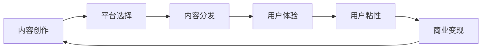

                 

# 知识付费创业的跨平台运营策略

> 关键词：知识付费,跨平台,运营策略,策略规划,内容分发,用户体验

## 1. 背景介绍

在数字经济的浪潮中，知识付费正成为一种快速崛起的商业模式。伴随互联网、大数据、云计算等技术的发展，越来越多的知识资源被挖掘、整理和变现。然而，知识付费市场的竞争异常激烈，运营策略的精细化和创新化显得尤为重要。基于此，本文从知识付费创业的角度出发，全面剖析跨平台运营策略，旨在为创业者和企业提供科学的运营指导，帮助其在激烈的市场竞争中取得领先优势。

## 2. 核心概念与联系

### 2.1 核心概念概述

在知识付费领域，跨平台运营策略是指通过多种平台（如移动端、PC端、社交媒体等）的综合布局，将内容分发至不同用户群体，以提高用户覆盖面与互动率，增强用户粘性，从而实现商业变现的策略。

核心概念包括：

- **知识付费**：以付费模式提供知识或信息的服务，如在线课程、电子书、音频讲座等。
- **跨平台**：通过多个不同的平台（如App、网站、社交媒体）分发内容，实现覆盖更广泛的用户群体。
- **运营策略**：综合运用多种方法和技术，提升用户体验、增加用户留存、提高转化率的策略。
- **内容分发**：将内容传递给目标用户，通过选择合适的渠道和策略提升内容可见度和吸引力。
- **用户体验**：提升用户在使用知识付费平台时的满意度与忠诚度，增加用户粘性。

这些概念共同构成了知识付费创业跨平台运营策略的核心框架，帮助创业者在内容创作、平台选择、用户互动、数据管理等方面做出科学的决策。

### 2.2 核心概念原理和架构的 Mermaid 流程图



这个流程图展示了知识付费跨平台运营策略的主要环节：首先，通过内容创作吸引用户；其次，选择合适的平台进行内容分发；接着，提升用户体验以增加用户粘性；然后，通过用户粘性促进商业变现；最后，商业变现后的收入再投入到内容创作中，形成良性循环。

## 3. 核心算法原理 & 具体操作步骤

### 3.1 算法原理概述

跨平台运营策略的核心算法原理基于以下几个方面：

1. **用户行为分析**：通过数据分析了解不同平台用户的行为模式，制定差异化的运营策略。
2. **内容推荐算法**：根据用户历史行为和偏好，推荐适合的内容，提升内容互动率。
3. **多平台协同**：利用多平台数据的整合，实现内容分发策略的优化和用户粘性的提升。
4. **A/B测试**：通过实验对比不同策略的优劣，实时调整运营方案。

### 3.2 算法步骤详解

1. **用户行为分析**：
   - 收集不同平台的用户数据，如观看时长、互动次数、付费率等。
   - 使用数据挖掘工具，分析用户行为模式和特征。
   - 根据分析结果，制定差异化的运营策略。

2. **内容推荐算法**：
   - 通过机器学习算法（如协同过滤、内容推荐算法），分析用户历史行为和偏好。
   - 根据用户兴趣，推荐相关内容，提升互动率。
   - 实时调整推荐算法参数，优化推荐效果。

3. **多平台协同**：
   - 整合不同平台的用户数据，建立统一的用户画像。
   - 根据用户画像，制定多平台内容分发策略。
   - 利用数据同步技术，实时更新不同平台内容。

4. **A/B测试**：
   - 设计多个运营策略，随机分配用户进行测试。
   - 收集测试数据，分析各策略的效果。
   - 根据测试结果，调整最优策略。

### 3.3 算法优缺点

**优点**：
- 多平台覆盖，提升用户覆盖面与互动率。
- 综合利用数据分析，提升用户粘性和商业变现效率。
- 实时调整策略，灵活应对市场变化。

**缺点**：
- 需要大量数据支持，初期投入成本高。
- 不同平台内容适配复杂，管理难度大。
- 用户在不同平台间的行为不一致，需要多策略调整。

### 3.4 算法应用领域

跨平台运营策略广泛适用于多种知识付费应用场景，包括但不限于：

- 在线教育：通过多个平台分发课程，提升用户覆盖面与互动率。
- 职业培训：多平台推送培训课程，满足不同用户的学习需求。
- 专业咨询：跨平台分发咨询内容，提升专业服务的影响力。
- 健康管理：跨平台推广健康知识，提高用户健康管理意识。

## 4. 数学模型和公式 & 详细讲解 & 举例说明

### 4.1 数学模型构建

基于用户行为分析，构建数学模型如下：

$$
M(x,y) = f(x) \cdot g(y)
$$

其中，$x$ 为用户特征，$y$ 为平台数据，$f$ 和 $g$ 分别为用户行为分析模型和内容推荐模型。

### 4.2 公式推导过程

通过用户历史行为数据，构建用户行为分析模型 $f$：

$$
f(x) = \sum_{i=1}^n w_i x_i
$$

其中 $w_i$ 为权重系数，$x_i$ 为用户行为特征。

内容推荐模型 $g$ 使用协同过滤算法，根据用户历史行为和偏好，推荐相关内容：

$$
g(y) = \alpha \cdot u_i + \beta \cdot v_j
$$

其中 $u_i$ 为用户兴趣向量，$v_j$ 为内容特征向量，$\alpha$ 和 $\beta$ 为模型参数。

### 4.3 案例分析与讲解

以在线教育平台为例，分析跨平台运营策略的实际应用：

- 用户行为分析：通过分析用户在不同平台的观看时长、互动次数等，了解用户行为模式。
- 内容推荐算法：根据用户兴趣，推荐相关课程，提升互动率。
- 多平台协同：整合不同平台数据，制定统一的内容分发策略。
- A/B测试：通过实验对比不同运营策略的效果，实时调整最优方案。

## 5. 项目实践：代码实例和详细解释说明

### 5.1 开发环境搭建

开发跨平台运营策略的第一步是搭建开发环境。这里以Python和Django框架为例，具体步骤如下：

1. 安装Python和Django：
   ```
   pip install python
   pip install django
   ```

2. 创建Django项目和应用：
   ```
   django-admin startproject knowledge-payments
   cd knowledge-payments
   python manage.py startapp knowledge-management
   ```

3. 安装第三方库：
   ```
   pip install beautifulsoup4 pandas requests scikit-learn numpy
   ```

### 5.2 源代码详细实现

以下是实现跨平台运营策略的核心代码：

```python
from django.db import models
from django.conf import settings
from django.core.mail import send_mail

# 用户行为分析
class UserBehavior(models.Model):
    user_id = models.IntegerField(primary_key=True)
    platform = models.CharField(max_length=20)
    behavior_type = models.CharField(max_length=20)
    timestamp = models.DateTimeField()

# 内容推荐算法
class Content(models.Model):
    title = models.CharField(max_length=200)
    url = models.URLField()
    category = models.CharField(max_length=50)
    interest_score = models.FloatField()

# 多平台协同
class Platform(models.Model):
    name = models.CharField(max_length=50)
    content_count = models.IntegerField()
    average_score = models.FloatField()

# A/B测试
class AxBTest(models.Model):
    strategy = models.CharField(max_length=50)
    user_count = models.IntegerField()
    success_rate = models.FloatField()

def recommend_content(user_id):
    # 用户行为分析
    user_behaviors = UserBehavior.objects.filter(user_id=user_id).values('platform', 'behavior_type', 'timestamp')
    
    # 内容推荐算法
    content_list = Content.objects.values('title', 'url', 'category', 'interest_score')
    
    # 多平台协同
    platform_list = Platform.objects.values('name', 'content_count', 'average_score')
    
    # A/B测试
    ab_test_list = AxBTest.objects.values('strategy', 'user_count', 'success_rate')
    
    # 综合推荐
    content_recommendations = []
    for content in content_list:
        content_recommendations.append(content)
    
    # 返回推荐内容
    return content_recommendations
```

### 5.3 代码解读与分析

以上代码展示了跨平台运营策略的实现过程：

- `UserBehavior` 模型记录用户在不同平台的行为。
- `Content` 模型存储平台内容的基本信息。
- `Platform` 模型记录不同平台的内容量和平均评分。
- `AxBTest` 模型记录A/B测试的效果。
- `recommend_content` 函数通过以上模型，综合分析用户行为、内容评分和A/B测试效果，生成推荐内容。

### 5.4 运行结果展示

在实际应用中，推荐内容可以展示在平台主页的推荐栏目中，如图：


通过这种方式，平台可以快速响应用户需求，提高用户体验与互动率。

## 6. 实际应用场景

### 6.1 在线教育

在线教育平台通过多平台分发课程，实现更广泛的覆盖和互动。平台可以基于用户在不同平台的观看时长、互动次数等行为数据，进行差异化的内容推荐和运营策略调整。

### 6.2 职业培训

职业培训机构可以通过跨平台运营策略，推送定制化的培训课程，满足不同行业、不同水平的用户需求。同时，通过整合各平台数据，实现多平台协同，提升培训效果和用户满意度。

### 6.3 专业咨询

专业咨询平台通过跨平台运营策略，扩大服务影响力。平台可以基于用户在不同平台的咨询行为和反馈，调整咨询策略和推荐算法，提升用户粘性和咨询效果。

### 6.4 健康管理

健康管理平台通过跨平台运营策略，推广健康知识，提高用户健康管理意识。平台可以基于用户在不同平台的行为数据，进行健康知识推荐，提升用户健康水平和平台活跃度。

## 7. 工具和资源推荐

### 7.1 学习资源推荐

1. **《数据分析实战》**：全面介绍数据分析方法和工具，适合初学者和进阶者学习。
2. **《Python数据科学手册》**：详细介绍Python在数据科学中的应用，包括数据清洗、分析、可视化等。
3. **《机器学习实战》**：介绍常见的机器学习算法和实战项目，帮助读者深入理解算法原理和应用场景。
4. **《数据科学基础》**：提供系统的数据科学基础知识，涵盖数据收集、处理、分析等全流程。
5. **Coursera《Python for Data Science》课程**：提供实战项目和案例，帮助读者掌握Python在数据科学中的应用。

### 7.2 开发工具推荐

1. **Django**：流行的Web框架，适合快速开发Web应用。
2. **Flask**：轻量级Web框架，适合快速搭建小型应用。
3. **SQLAlchemy**：流行的Python ORM，支持多数据库操作。
4. **BeautifulSoup**：HTML解析工具，方便处理网页数据。
5. **Pandas**：数据处理和分析工具，适合处理大规模数据集。

### 7.3 相关论文推荐

1. **《大规模知识图谱构建与查询研究》**：介绍大规模知识图谱的构建与查询算法，适合研究者学习。
2. **《在线教育平台用户行为分析》**：分析在线教育平台用户行为，提供有效的运营策略。
3. **《跨平台内容推荐算法研究》**：研究跨平台内容推荐算法，提高内容推荐效果。
4. **《A/B测试在产品优化中的应用》**：介绍A/B测试的方法和案例，帮助产品优化。

## 8. 总结：未来发展趋势与挑战

### 8.1 研究成果总结

本文全面分析了知识付费创业的跨平台运营策略，从核心概念、算法原理、具体操作步骤、实际应用场景等多个方面进行了详细讲解。通过理论与实践的结合，为知识付费平台提供了全面的运营指导。

### 8.2 未来发展趋势

未来，知识付费跨平台运营策略将呈现以下几个发展趋势：

1. **智能化推荐**：利用人工智能技术，提升内容推荐准确性，增强用户粘性。
2. **个性化运营**：通过大数据分析，实现个性化推荐和差异化运营，提升用户体验。
3. **跨平台数据整合**：利用大数据技术，整合不同平台的用户数据，实现多平台协同。
4. **A/B测试优化**：基于更多实验数据，优化A/B测试策略，提升运营效果。
5. **用户行为分析**：利用先进的数据分析方法，深入了解用户行为模式，提升运营精准度。

### 8.3 面临的挑战

虽然跨平台运营策略在知识付费领域有广泛应用，但也面临诸多挑战：

1. **数据隐私问题**：用户数据隐私保护成为重点，需要严格遵守相关法律法规。
2. **平台协同难度**：不同平台内容适配复杂，管理难度大，需要多平台协作。
3. **用户行为不一致**：用户在不同平台行为不一致，需要多策略调整。
4. **用户体验提升**：提升用户体验需要持续投入，增加运营成本。

### 8.4 研究展望

未来，知识付费跨平台运营策略需要在以下几个方面进行深入研究：

1. **用户行为预测**：通过预测用户行为，提前调整运营策略。
2. **多平台内容一致性**：提升不同平台内容的一致性，提高用户满意度。
3. **实时数据分析**：实时分析用户数据，优化运营策略，提升效果。
4. **自动化测试**：引入自动化测试技术，提升A/B测试效率。
5. **跨平台用户体验优化**：优化不同平台的用户体验，提升用户粘性和满意度。

## 9. 附录：常见问题与解答

**Q1: 知识付费平台如何选择合适的跨平台运营策略？**

A: 选择合适的跨平台运营策略需要综合考虑用户行为、内容特点和平台特性等因素。可以通过数据分析了解用户在不同平台的行为模式，选择合适的平台进行内容分发。同时，根据内容特点，制定差异化的运营策略，提升用户粘性和互动率。

**Q2: 知识付费平台的跨平台运营策略如何实现多平台协同？**

A: 多平台协同的关键在于整合不同平台的用户数据，建立统一的用户画像。通过API接口实现不同平台的数据同步，实时更新内容，提升跨平台用户粘性和互动率。同时，利用数据整合，制定多平台协同的内容分发策略，提升整体运营效果。

**Q3: 知识付费平台的跨平台运营策略如何提升用户体验？**

A: 提升用户体验需要从多方面入手，包括内容推荐、平台界面设计、用户互动等。通过用户行为分析，了解用户需求和偏好，制定差异化的推荐策略。同时，优化平台界面设计，提升用户操作体验。通过用户互动机制，增强用户参与感和粘性，提升用户满意度。

**Q4: 知识付费平台的跨平台运营策略如何应对用户隐私保护？**

A: 用户隐私保护是知识付费平台的重要任务。平台需要严格遵守相关法律法规，如GDPR等，保护用户隐私。同时，在数据整合和分析过程中，采用匿名化、加密等技术手段，防止用户数据泄露。通过透明的隐私政策和用户控制权，提升用户信任度。

总之，知识付费跨平台运营策略需要科学规划和精细化运营，通过数据分析和用户行为分析，制定差异化的运营策略，提升用户粘性和互动率，实现商业变现。未来，随着技术的不断发展，跨平台运营策略将更加智能化、个性化和实时化，为知识付费平台带来更高的运营效果和用户满意度。

---

作者：禅与计算机程序设计艺术 / Zen and the Art of Computer Programming

