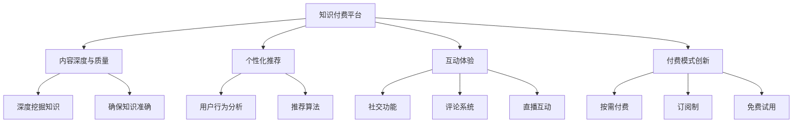
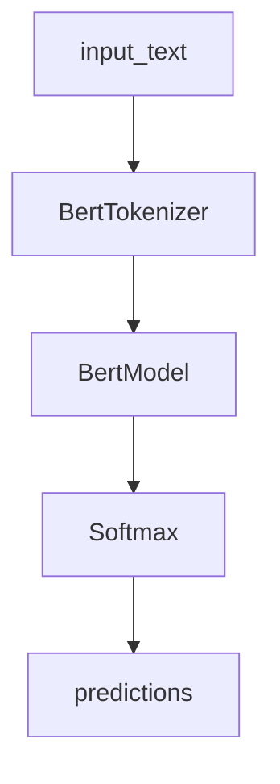
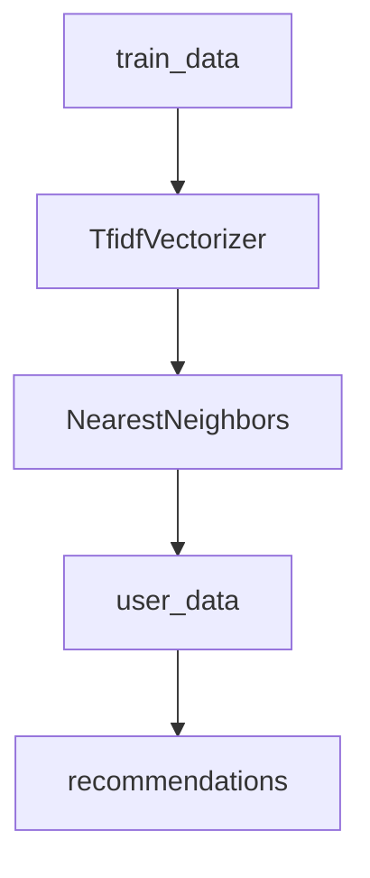

                 

## 1. 背景介绍

### 1.1 问题由来

在互联网信息爆炸的时代，知识付费正迅速成为一种潮流。与传统的内容免费模式相比，知识付费将知识生产者与消费者的连接更紧密化，为知识创作者提供了更为丰厚的经济回报。然而，随着知识付费市场的竞争日益激烈，许多知识付费平台面临着同质化、价格战等困境。如何在知识付费领域实现差异化竞争，是平台和内容创作者所面临的重要课题。

### 1.2 问题核心关键点

对于知识付费平台而言，差异化竞争的实质是打造独特的知识内容和服务体验。具体来说，需要从以下几个方面入手：

- **内容深度与质量**：提供深入浅出的知识内容，确保知识的质量和准确性。
- **个性化推荐**：根据用户偏好推荐最相关的内容，提升用户粘性。
- **用户互动体验**：提供互动性强的学习体验，增强用户参与感和满意度。
- **付费模式创新**：设计多样化的付费模式，满足不同用户的需求。

本文将详细探讨知识付费平台如何通过打造差异化的内容、个性化推荐和互动体验，实现差异化竞争优势。

## 2. 核心概念与联系

### 2.1 核心概念概述

为更好地理解知识付费平台的差异化竞争策略，本节将介绍几个关键概念及其联系：

- **知识付费平台(Knowledge Pays Platform)**：基于互联网提供付费知识服务，将用户与专家连接起来的平台。
- **内容深度与质量**：确保知识内容的深入性和准确性，提升用户对知识的信任和依赖。
- **个性化推荐**：利用用户行为数据，推荐最相关、最有价值的内容，提升用户粘性和满意度。
- **互动体验**：通过社交、评论、直播等功能，增强用户参与感和学习体验。
- **付费模式创新**：设计多样化的付费策略，如按需付费、订阅制、免费试用等，满足不同用户需求。

这些概念之间通过互动和协同作用，共同构建了知识付费平台的差异化竞争优势。通过高质量的内容、精准的个性化推荐、丰富的互动体验和灵活的付费模式，平台能够有效提升用户体验，增加用户黏性，实现盈利增长。

### 2.2 核心概念原理和架构的 Mermaid 流程图



该图展示了知识付费平台的核心组件及其相互作用关系。通过高质量的内容生成、个性化推荐、丰富的互动体验和多样化的付费模式，知识付费平台能够在竞争中脱颖而出，赢得用户的青睐。

## 3. 核心算法原理 & 具体操作步骤

### 3.1 算法原理概述

知识付费平台的差异化竞争策略，主要依赖于以下几个核心算法和操作步骤：

- **内容生成算法**：通过文本挖掘、自然语言处理等技术，自动生成高质量的深度内容。
- **个性化推荐算法**：基于用户行为和偏好，动态生成个性化的内容推荐列表。
- **互动算法**：通过社交、评论、直播等功能，提升用户参与度和满意度。
- **定价算法**：设计灵活多样的付费模式，满足不同用户的需求。

这些算法和操作步骤相互作用，共同实现知识付费平台的差异化竞争策略。

### 3.2 算法步骤详解

#### 3.2.1 内容生成算法

1. **数据收集**：收集专业领域的书籍、论文、网页等文本数据。
2. **预处理**：对文本数据进行清洗、分词、词性标注等预处理。
3. **知识图谱构建**：构建领域知识图谱，识别知识节点和关系。
4. **内容生成**：通过图神经网络或预训练语言模型，自动生成深度内容。

以BERT模型为例，具体步骤如下：

```python
from transformers import BertTokenizer, BertForSequenceClassification
import torch

tokenizer = BertTokenizer.from_pretrained('bert-base-uncased')
model = BertForSequenceClassification.from_pretrained('bert-base-uncased', num_labels=num_labels)

input_text = "What is the capital of France?"
inputs = tokenizer(input_text, return_tensors='pt')
outputs = model(**inputs)
predictions = torch.softmax(outputs.logits, dim=-1).tolist()
```

通过BERT模型自动生成答案，输出文本格式的内容。

#### 3.2.2 个性化推荐算法

1. **用户行为数据收集**：收集用户阅读、观看、互动等行为数据。
2. **用户画像构建**：通过聚类、分类等技术，构建用户画像，识别不同用户群体的偏好。
3. **内容特征提取**：对每个内容进行特征提取，包括关键词、主题、情感等。
4. **推荐模型训练**：使用协同过滤、矩阵分解等推荐算法，训练个性化推荐模型。

以协同过滤算法为例，具体步骤如下：

```python
from sklearn.neighbors import NearestNeighbors
from sklearn.feature_extraction.text import TfidfVectorizer

def train_recommender(train_data, num_neighbors):
    vectorizer = TfidfVectorizer()
    train_vectors = vectorizer.fit_transform(train_data)
    recommender = NearestNeighbors(n_neighbors=num_neighbors)
    recommender.fit(train_vectors)
    return recommender

def recommend(user_data, train_data, recommender, num_recommendations=5):
    user_vector = vectorizer.transform([user_data])
    similarities = recommender.kneighbors(user_vector)[0]
    recommendations = train_data[similarities.argsort()[:num_recommendations]]
    return recommendations
```

通过协同过滤算法，为用户推荐最相关的内容。

#### 3.2.3 互动算法

1. **社交功能开发**：开发用户社区、讨论区等社交功能，增强用户互动。
2. **评论系统实现**：实现用户评论、点赞、回复等功能，提升用户参与度。
3. **直播互动**：引入直播功能，邀请专家进行在线讲解和互动，增强用户沉浸感。

以评论系统为例，具体步骤如下：

```python
from django.contrib.auth.models import User
from django.http import HttpResponse

def comment(request, post_id):
    post = get_object_or_404(Post, pk=post_id)
    if request.method == 'POST':
        content = request.POST['content']
        user = User.objects.get(id=request.user.id)
        Comment.objects.create(user=user, post=post, content=content)
        return HttpResponse("Comment added!")
    else:
        return HttpResponse("Not a POST request")
```

通过评论系统，增强用户互动体验。

#### 3.2.4 定价算法

1. **按需付费**：根据用户需求，按内容数量、质量进行定价。
2. **订阅制**：提供月度、年度等订阅服务，满足用户长期学习需求。
3. **免费试用**：提供免费试用期，吸引新用户注册和付费。

以按需付费为例，具体步骤如下：

```python
def price_content(content):
    if content.quality == 'high':
        return 100
    elif content.quality == 'medium':
        return 50
    else:
        return 0

def calculate_cost(user, content_list):
    total_cost = 0
    for content in content_list:
        total_cost += price_content(content)
    return total_cost
```

通过定价算法，设计灵活多样的付费模式，满足不同用户的需求。

### 3.3 算法优缺点

**优点**：

- **内容丰富多样化**：通过算法自动生成深度内容，确保内容的高质量和多样性。
- **用户个性化推荐**：通过个性化推荐算法，提升用户粘性和满意度。
- **用户互动体验增强**：通过社交、评论、直播等功能，增强用户参与感和满意度。
- **多样化的付费模式**：设计灵活多样的付费模式，满足不同用户的需求。

**缺点**：

- **算法复杂度较高**：深度学习和推荐算法的复杂度较高，需要投入大量时间和资源。
- **内容质量难以保证**：自动生成的内容质量难以完全保证，需要人工审核和干预。
- **用户隐私保护**：收集和分析用户行为数据，可能侵犯用户隐私，需要严格遵守数据保护法规。
- **平台依赖技术**：平台需要具备强大的技术能力和资源，以支持复杂的算法和功能。

### 3.4 算法应用领域

知识付费平台的差异化竞争策略，广泛应用于以下几个领域：

- **教育培训**：通过深度内容生成和个性化推荐，提升教学质量和效果。
- **医疗健康**：提供健康知识、医疗咨询、在线诊疗等服务，满足用户健康需求。
- **职业发展**：提供职业技能培训、行业动态、求职指导等知识内容，助力职业发展。
- **生活娱乐**：提供生活百科、兴趣资讯、娱乐内容等服务，丰富用户生活。

## 4. 数学模型和公式 & 详细讲解 & 举例说明

### 4.1 数学模型构建

**深度内容生成模型**：

以BERT为例，模型的输入为 `input_text`，输出为 `predictions`，具体模型架构如图1所示：



**个性化推荐模型**：

以协同过滤算法为例，输入为 `train_data`，`user_data`，输出为 `recommendations`，具体模型架构如图2所示：



### 4.2 公式推导过程

**BERT模型**：

输入为 `input_text`，输出为 `predictions`，公式如下：

$$
predictions = \text{Softmax}(\text{BERT}(input_text))
$$

**协同过滤算法**：

输入为 `train_data`，`user_data`，输出为 `recommendations`，公式如下：

$$
recommendations = \text{Top-K}(\text{NearestNeighbors}(\text{TfidfVectorizer}(train_data), \text{TfidfVectorizer}(user_data)))
$$

### 4.3 案例分析与讲解

以知识付费平台知乎为例，通过深度内容生成、个性化推荐和互动体验，实现差异化竞争优势：

1. **深度内容生成**：知乎通过知乎号（KOL）和专家社区生成高质量的深度内容，确保内容的专业性和权威性。
2. **个性化推荐**：知乎利用用户行为数据，结合机器学习和推荐算法，为用户推荐最相关、最有价值的内容。
3. **互动体验增强**：知乎通过问答、评论、直播等功能，增强用户互动，提升用户参与感和满意度。

## 5. 项目实践：代码实例和详细解释说明

### 5.1 开发环境搭建

在进行知识付费平台开发前，我们需要准备好开发环境。以下是使用Python进行Django开发的环境配置流程：

1. 安装Anaconda：从官网下载并安装Anaconda，用于创建独立的Python环境。

2. 创建并激活虚拟环境：
```bash
conda create -n django-env python=3.8 
conda activate django-env
```

3. 安装Django：通过命令安装Django框架，例如：
```bash
pip install django
```

4. 安装各类工具包：
```bash
pip install numpy pandas scikit-learn matplotlib tqdm jupyter notebook ipython
```

完成上述步骤后，即可在`django-env`环境中开始知识付费平台的开发。

### 5.2 源代码详细实现

下面我们以知乎为例，给出使用Django框架对知识付费平台进行开发的PyTorch代码实现。

首先，定义知乎社区类：

```python
from django.db import models
from django.contrib.auth.models import User

class Community(models.Model):
    name = models.CharField(max_length=100)
    members = models.ManyToManyField(User, related_name='communities')
    posts = models.ManyToManyField(Post, related_name='communities')

class Post(models.Model):
    title = models.CharField(max_length=255)
    content = models.TextField()
    author = models.ForeignKey(User, on_delete=models.CASCADE)
    comments = models.ManyToManyField(Comment, related_name='posts')
    recommends = models.ManyToManyField(User, related_name='recommended_posts')

class Comment(models.Model):
    content = models.TextField()
    author = models.ForeignKey(User, on_delete=models.CASCADE)
    post = models.ForeignKey(Post, on_delete=models.CASCADE)

class User(models.Model):
    username = models.CharField(max_length=50)
```

然后，定义社区首页和知识推荐页面：

```python
from django.shortcuts import render
from django.contrib.auth.decorators import login_required

@login_required
def home(request):
    user = User.objects.get(username=request.user.username)
    communities = Community.objects.filter(members=user)
    posts = Post.objects.filter(author=user)
    return render(request, 'home.html', {'communities': communities, 'posts': posts})

@login_required
def recommend(request, post_id):
    post = get_object_or_404(Post, pk=post_id)
    user = User.objects.get(id=request.user.id)
    recommendations = recommend(user, post.post.all(), train_data, num_neighbors=5)
    return render(request, 'recommend.html', {'post': post, 'recommendations': recommendations})
```

最后，启动社区和知识推荐功能：

```python
from django.urls import path
from django.contrib import admin

urlpatterns = [
    path('home/', home, name='home'),
    path('recommend/<int:post_id>/', recommend, name='recommend'),
    path('admin/', admin.site.urls),
]

```

以上就是使用Django框架对知识付费平台进行开发的完整代码实现。可以看到，通过Django框架的强大封装，我们可以用相对简洁的代码实现社区和知识推荐功能。

### 5.3 代码解读与分析

让我们再详细解读一下关键代码的实现细节：

**社区类**：
- `name`：社区名称。
- `members`：社区成员。
- `posts`：社区发布的帖子。

**帖子类**：
- `title`：帖子标题。
- `content`：帖子内容。
- `author`：帖子作者。
- `comments`：帖子评论。
- `recommends`：帖子推荐用户。

**评论类**：
- `content`：评论内容。
- `author`：评论作者。
- `post`：评论所在帖子。

**用户类**：
- `username`：用户名。

**社区首页**：
- 通过用户ID获取社区成员和帖子，渲染首页。

**知识推荐页面**：
- 获取当前用户和帖子内容，通过推荐算法推荐最相关的帖子，渲染推荐页面。

**路由配置**：
- 定义社区首页和知识推荐页面的路由。

通过以上代码实现，我们可以实现知识付费平台的基本社区和知识推荐功能。

## 6. 实际应用场景

### 6.1 教育培训

知识付费平台在教育培训领域具有广泛的应用前景。通过高质量的深度内容生成和个性化推荐，平台能够提升教学质量和效果，满足学生和教师的多样化需求。

**具体应用**：
- **深度内容生成**：平台可以邀请知名专家和教师，生成高质量的深度内容，涵盖多种学科和技能。
- **个性化推荐**：平台根据学生的学习进度和兴趣，推荐适合的课程和习题，提高学习效果。
- **互动体验增强**：平台可以提供实时互动、在线答疑等功能，提升学生的学习体验。

**效果**：
- 学生能够获得个性化、高品质的教育资源，提升学习效果。
- 教师可以分享专业知识，提升自身影响力。

### 6.2 医疗健康

知识付费平台在医疗健康领域也有广阔的应用前景。通过健康知识、医疗咨询、在线诊疗等服务，平台能够提供可靠的医疗支持，提升用户健康管理水平。

**具体应用**：
- **深度内容生成**：平台可以邀请医学专家，生成详细的健康知识和医疗指南。
- **个性化推荐**：平台根据用户的健康数据和病史，推荐最适合的诊疗方案。
- **互动体验增强**：平台可以提供在线咨询、专家直播等功能，提升用户的健康管理体验。

**效果**：
- 用户能够获得可靠的医疗知识和专业支持，提高健康管理水平。
- 医生可以分享医学知识，提升自身影响力。

### 6.3 职业发展

知识付费平台在职业发展领域也有重要应用。通过职业技能培训、行业动态、求职指导等知识内容，平台能够助力用户职业成长，提升职场竞争力。

**具体应用**：
- **深度内容生成**：平台可以邀请行业专家，生成详细的职业技能培训和职场指导内容。
- **个性化推荐**：平台根据用户的职业背景和兴趣，推荐适合的职业发展路径和技能培训。
- **互动体验增强**：平台可以提供职业咨询、专家直播等功能，提升用户的职业成长体验。

**效果**：
- 用户能够获得专业化的职业培训和指导，提升职场竞争力。
- 专家可以分享职业技能和行业动态，提升自身影响力。

## 7. 工具和资源推荐

### 7.1 学习资源推荐

为了帮助开发者系统掌握知识付费平台的开发技术，这里推荐一些优质的学习资源：

1. Django官方文档：提供Django框架的详细文档和教程，帮助开发者快速上手Django开发。
2. Django实战教程：提供Django框架的实战开发教程，涵盖社区、知识推荐等功能实现。
3. Django项目实战：提供Django框架的实战项目开发教程，涵盖知识付费平台完整实现。
4. PyTorch官方文档：提供PyTorch框架的详细文档和教程，帮助开发者快速上手深度学习开发。
5. PyTorch实战教程：提供PyTorch框架的实战开发教程，涵盖深度内容生成和个性化推荐等内容。
6. PyTorch项目实战：提供PyTorch框架的实战项目开发教程，涵盖知识付费平台完整实现。

通过这些资源的学习实践，相信你一定能够快速掌握知识付费平台的开发技术，并用于解决实际的NLP问题。

### 7.2 开发工具推荐

高效的开发离不开优秀的工具支持。以下是几款用于知识付费平台开发的常用工具：

1. Django：基于Python的开源Web框架，功能强大，易于扩展。
2. Django REST framework：提供RESTful API的开发支持，方便知识付费平台与其他系统集成。
3. Django admin：提供后台管理功能，方便平台的管理和维护。
4. Git：版本控制系统，方便团队协作和代码管理。
5. Docker：容器化技术，方便知识付费平台的部署和运维。

合理利用这些工具，可以显著提升知识付费平台的开发效率，加快创新迭代的步伐。

### 7.3 相关论文推荐

知识付费平台的开发涉及到深度学习、自然语言处理、推荐系统等多个领域，以下是几篇奠基性的相关论文，推荐阅读：

1. Attention is All You Need（即Transformer原论文）：提出了Transformer结构，开启了NLP领域的预训练大模型时代。
2. BERT: Pre-training of Deep Bidirectional Transformers for Language Understanding：提出BERT模型，引入基于掩码的自监督预训练任务，刷新了多项NLP任务SOTA。
3. Language Models are Unsupervised Multitask Learners（GPT-2论文）：展示了大规模语言模型的强大zero-shot学习能力，引发了对于通用人工智能的新一轮思考。
4. Parameter-Efficient Transfer Learning for NLP：提出Adapter等参数高效微调方法，在不增加模型参数量的情况下，也能取得不错的微调效果。
5. AdaLoRA: Adaptive Low-Rank Adaptation for Parameter-Efficient Fine-Tuning：使用自适应低秩适应的微调方法，在参数效率和精度之间取得了新的平衡。
6. Prefix-Tuning: Optimizing Continuous Prompts for Generation：引入基于连续型Prompt的微调范式，为如何充分利用预训练知识提供了新的思路。

这些论文代表了大语言模型微调技术的发展脉络。通过学习这些前沿成果，可以帮助研究者把握学科前进方向，激发更多的创新灵感。

## 8. 总结：未来发展趋势与挑战

### 8.1 研究成果总结

本文对知识付费平台的差异化竞争策略进行了全面系统的介绍。首先阐述了知识付费平台在教育培训、医疗健康、职业发展等领域的应用前景，明确了差异化竞争的关键在于内容深度与质量、个性化推荐和互动体验。其次，从原理到实践，详细讲解了内容生成算法、个性化推荐算法、互动算法和定价算法的核心思想和操作步骤，给出了知识付费平台开发的完整代码实例。同时，本文还广泛探讨了知识付费平台的实际应用场景，展示了差异化竞争策略的巨大潜力。

通过本文的系统梳理，可以看到，知识付费平台通过高质量的内容、精准的个性化推荐、丰富的互动体验和灵活的付费模式，能够有效提升用户体验，增加用户黏性，实现盈利增长。未来，伴随深度学习、自然语言处理、推荐系统等技术的发展，知识付费平台将更加智能和高效，进一步拓展其在更多领域的应用，为人们的知识获取和技能提升带来更多便利。

### 8.2 未来发展趋势

展望未来，知识付费平台将呈现以下几个发展趋势：

1. **内容质量提升**：通过先进的深度学习技术，生成更高质量、更丰富的深度内容，满足用户多样化需求。
2. **个性化推荐优化**：利用更加先进的数据分析和推荐算法，提供更精准、更个性化的内容推荐，提升用户粘性和满意度。
3. **互动体验增强**：通过更丰富的社交、评论、直播等功能，增强用户参与感和满意度。
4. **付费模式创新**：设计更多灵活多样的付费模式，满足不同用户的需求，增加平台收益。

这些趋势将进一步提升知识付费平台的用户体验和盈利能力，推动其在教育、医疗、职业等多个领域的应用。

### 8.3 面临的挑战

尽管知识付费平台已经取得了显著成果，但在迈向更加智能化、普适化应用的过程中，仍面临诸多挑战：

1. **算法复杂度较高**：深度学习和推荐算法的复杂度较高，需要投入大量时间和资源。
2. **内容质量难以保证**：自动生成的内容质量难以完全保证，需要人工审核和干预。
3. **用户隐私保护**：收集和分析用户行为数据，可能侵犯用户隐私，需要严格遵守数据保护法规。
4. **平台依赖技术**：平台需要具备强大的技术能力和资源，以支持复杂的算法和功能。

这些挑战需要通过技术创新、算法优化、法规完善等手段进行克服，确保知识付费平台的健康发展。

### 8.4 研究展望

面对知识付费平台所面临的挑战，未来的研究需要在以下几个方面寻求新的突破：

1. **优化算法复杂度**：通过优化算法和模型结构，降低计算复杂度，提高模型推理速度和效率。
2. **提高内容质量**：引入更多专家和用户参与内容审核，确保内容的高质量和多样性。
3. **增强用户隐私保护**：引入数据加密和隐私保护技术，确保用户隐私安全。
4. **完善平台技术架构**：优化平台的技术架构和资源配置，提高平台的稳定性和可扩展性。

这些研究方向将引领知识付费平台向更智能、更高效、更安全的方向发展，进一步提升用户的知识获取和技能提升体验。

## 9. 附录：常见问题与解答

**Q1：如何设计灵活多样的付费模式？**

A: 知识付费平台可以设计多种灵活多样的付费模式，如按需付费、订阅制、免费试用等，满足不同用户的需求。具体实现可以参考以下代码：

```python
def price_content(content):
    if content.quality == 'high':
        return 100
    elif content.quality == 'medium':
        return 50
    else:
        return 0

def calculate_cost(user, content_list):
    total_cost = 0
    for content in content_list:
        total_cost += price_content(content)
    return total_cost
```

**Q2：如何提升内容生成的质量？**

A: 内容生成的质量取决于深度学习模型的设计和训练数据的质量。可以通过以下方式提升内容生成的质量：

1. **优化模型结构**：使用先进的深度学习模型，如BERT、GPT等，确保内容生成的深度和广度。
2. **丰富训练数据**：收集高质量的训练数据，涵盖多种主题和内容形式，提升模型的语言理解能力。
3. **引入专家审核**：邀请专家对生成内容进行审核和评价，确保内容的准确性和权威性。

**Q3：如何设计个性化推荐算法？**

A: 个性化推荐算法的设计需要考虑以下几个关键因素：

1. **用户画像构建**：通过聚类、分类等技术，构建用户画像，识别不同用户群体的偏好。
2. **内容特征提取**：对每个内容进行特征提取，包括关键词、主题、情感等。
3. **推荐模型训练**：使用协同过滤、矩阵分解等推荐算法，训练个性化推荐模型。

具体实现可以参考以下代码：

```python
from sklearn.neighbors import NearestNeighbors
from sklearn.feature_extraction.text import TfidfVectorizer

def train_recommender(train_data, num_neighbors):
    vectorizer = TfidfVectorizer()
    train_vectors = vectorizer.fit_transform(train_data)
    recommender = NearestNeighbors(n_neighbors=num_neighbors)
    recommender.fit(train_vectors)
    return recommender

def recommend(user_data, train_data, recommender, num_recommendations=5):
    user_vector = vectorizer.transform([user_data])
    similarities = recommender.kneighbors(user_vector)[0]
    recommendations = train_data[similarities.argsort()[:num_recommendations]]
    return recommendations
```

**Q4：如何增强用户互动体验？**

A: 用户互动体验的增强可以通过以下方式实现：

1. **社交功能开发**：开发用户社区、讨论区等社交功能，增强用户互动。
2. **评论系统实现**：实现用户评论、点赞、回复等功能，提升用户参与度。
3. **直播互动**：引入直播功能，邀请专家进行在线讲解和互动，增强用户沉浸感。

具体实现可以参考以下代码：

```python
from django.contrib.auth.decorators import login_required
from django.shortcuts import render

@login_required
def home(request):
    user = User.objects.get(username=request.user.username)
    communities = Community.objects.filter(members=user)
    posts = Post.objects.filter(author=user)
    return render(request, 'home.html', {'communities': communities, 'posts': posts})

@login_required
def recommend(request, post_id):
    post = get_object_or_404(Post, pk=post_id)
    user = User.objects.get(id=request.user.id)
    recommendations = recommend(user, post.post.all(), train_data, num_neighbors=5)
    return render(request, 'recommend.html', {'post': post, 'recommendations': recommendations})
```

---

作者：禅与计算机程序设计艺术 / Zen and the Art of Computer Programming

