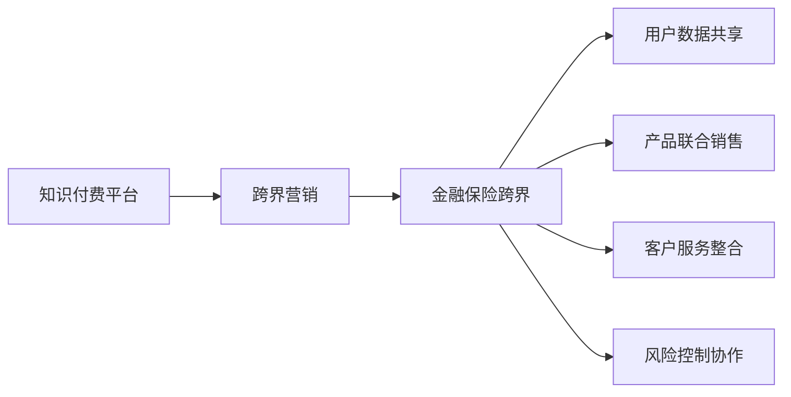

                 

# 知识付费如何实现跨界营销与金融保险跨界？

在数字化经济时代，知识付费已经成为了一种新兴的商业模式，通过提供优质内容，吸引用户付费订阅，从而实现商业变现。然而，随着竞争的加剧，如何突破传统知识付费的边界，实现跨界营销与金融保险领域的跨界融合，成为了知识付费平台面临的新挑战。本文将从知识付费跨界营销与金融保险跨界的核心概念、实现路径、技术原理和潜在问题等方面进行深入探讨。

## 1. 背景介绍

### 1.1 知识付费现状
知识付费行业近年来发展迅速，其模式主要包括在线课程、订阅内容、问答社区、知识图谱等。主要平台包括腾讯课堂、网易云课堂、得到、知乎等，同时也有各类专业内容平台如百度知道、头条号等。然而，随着用户消费习惯的变化和竞争的加剧，传统知识付费模式已经无法满足用户的多样化需求。

### 1.2 跨界营销的必要性
跨界营销指企业利用不同业务领域的资源优势，相互合作，实现双赢或共赢。知识付费跨界营销可以通过丰富内容生态，提高平台的用户黏性和参与度。而金融保险跨界则可以通过跨界合作，解决知识付费平台金融服务不足的问题，从而提高用户转化率和商业价值。

## 2. 核心概念与联系

### 2.1 核心概念概述

- **知识付费平台**：提供高质量知识内容的平台，如得到、喜马拉雅等。
- **跨界营销**：跨界合作，通过联合营销、合作活动等方式，实现用户和数据的相互迁移。
- **金融保险跨界**：将知识付费平台与金融保险产品相结合，提供个性化金融服务，提升用户体验。

### 2.2 核心概念原理和架构的 Mermaid 流程图



## 3. 核心算法原理 & 具体操作步骤

### 3.1 算法原理概述

知识付费跨界营销与金融保险跨界的核心算法原理包括数据共享、个性化推荐、联合销售和风险控制等方面。具体流程如下：

1. **数据共享**：通过数据交换协议，实现用户数据的互通互用。
2. **个性化推荐**：利用机器学习算法，对用户行为进行分析，推荐相关金融保险产品。
3. **联合销售**：在知识付费平台推送金融保险产品，提升销售转化率。
4. **风险控制**：利用风控模型，识别高风险用户，进行实时监控和预警。

### 3.2 算法步骤详解

**Step 1: 数据收集与预处理**

- **数据收集**：收集知识付费平台的用户行为数据，如浏览、订阅、购买记录等。
- **数据清洗**：对数据进行去重、去噪、补全等处理，确保数据质量。

**Step 2: 用户画像构建**

- **特征提取**：提取用户的基本信息、兴趣偏好、消费习惯等特征。
- **用户画像**：利用聚类算法，构建用户画像，便于后续的个性化推荐。

**Step 3: 个性化推荐算法**

- **协同过滤**：基于用户行为和物品属性，推荐相似的用户和物品。
- **内容推荐**：根据用户的历史浏览记录，推荐相关的知识内容。
- **混合推荐**：结合协同过滤和内容推荐，提高推荐精度。

**Step 4: 联合销售策略**

- **产品选择**：根据用户画像和历史行为，推荐适合其需求的金融保险产品。
- **营销活动**：在知识付费平台内推送营销活动，如限时折扣、赠品等。
- **销售转化**：实时监控销售数据，评估营销效果。

**Step 5: 风险控制模型**

- **用户画像分析**：利用机器学习算法，分析用户的风险水平。
- **行为监测**：实时监测用户行为，识别异常操作。
- **风险预警**：根据监测结果，及时预警风险。

### 3.3 算法优缺点

**优点**：
- **提升用户黏性**：通过跨界合作，丰富平台内容，提高用户黏性。
- **提高销售转化率**：联合销售策略，可以提升金融保险产品的销售转化率。
- **风险控制**：通过风控模型，及时预警和控制风险。

**缺点**：
- **隐私风险**：用户数据交换可能带来隐私风险。
- **运营成本高**：跨界营销和风险控制需要投入大量人力物力。
- **产品适配性差**：知识付费与金融保险产品差异大，产品适配性差。

### 3.4 算法应用领域

知识付费跨界营销与金融保险跨界适用于多种场景，包括在线教育、生活服务、电商、金融等领域。具体应用场景如下：

- **在线教育**：通过知识付费平台推荐相关课程，联合销售教育类金融产品。
- **生活服务**：推送生活服务类金融产品，如保险、理财等，提高用户转化率。
- **电商**：联合销售电商平台上的金融产品，如贷款、分期支付等。
- **金融**：推出知识付费课程，提升用户对金融知识的理解，引导购买金融保险产品。

## 4. 数学模型和公式 & 详细讲解

### 4.1 数学模型构建

设用户集为 $U$，知识付费平台为 $P$，金融保险产品集为 $F$，联合销售策略为 $S$。用户画像为 $P_U$，个性化推荐模型为 $M_{P}$，风险控制模型为 $M_R$。数学模型如下：

$$
P_U = M_{P}(U)
$$

$$
S = M_{S}(P_U, F)
$$

$$
M_R = M_{R}(P_U)
$$

### 4.2 公式推导过程

**用户画像构建**：
- **特征提取**：设用户特征向量为 $x \in R^n$，包含基本信息、兴趣偏好、消费习惯等。
- **聚类算法**：利用K-means算法，对用户进行聚类，得到用户画像 $P_U$。

**个性化推荐算法**：
- **协同过滤**：设用户行为矩阵为 $I \in R^{N \times M}$，其中 $N$ 为用户数，$M$ 为物品数。用户 $i$ 对物品 $j$ 的行为为 $I_{ij}$，矩阵 $A = I$。利用SVD算法，得到用户与物品的相似度矩阵 $S \in R^{N \times M}$，再根据用户画像，计算推荐结果 $R = S \times P_U$。

**联合销售策略**：
- **产品选择**：根据用户画像和行为数据，选择适合的金融产品，矩阵 $C = P_U \times S$。
- **营销活动**：在知识付费平台推送营销活动，提升销售转化率。

**风险控制模型**：
- **用户画像分析**：利用随机森林算法，分析用户风险水平。
- **行为监测**：实时监测用户行为，识别异常操作。
- **风险预警**：根据监测结果，及时预警风险。

### 4.3 案例分析与讲解

以在线教育为例，用户在知识付费平台订阅课程后，通过数据分析，识别出其对教育类金融产品的需求，然后通过联合销售策略，在平台上推送相关保险产品，最终完成转化。

## 5. 项目实践：代码实例和详细解释说明

### 5.1 开发环境搭建

1. **Python环境**：
   - 安装Python 3.8或更高版本，建议使用Anaconda进行环境管理。
   - 安装相关依赖库，如Pandas、Scikit-learn、TensorFlow等。

2. **数据处理工具**：
   - 安装Pandas库，用于数据清洗和预处理。
   - 安装Scikit-learn库，用于机器学习算法的实现。
   - 安装TensorFlow库，用于模型的训练和部署。

3. **跨界合作工具**：
   - 安装Flask或Django等Web框架，用于搭建跨界营销平台。
   - 安装Swagger等API文档生成工具，用于API接口的文档生成。

### 5.2 源代码详细实现

**Step 1: 数据收集与预处理**

```python
import pandas as pd
import numpy as np

# 读取用户数据
user_data = pd.read_csv('user_data.csv')

# 数据清洗与预处理
user_data = user_data.drop_duplicates()
user_data = user_data.fillna(method='ffill')
```

**Step 2: 用户画像构建**

```python
from sklearn.cluster import KMeans

# 特征提取
user_features = user_data[['age', 'gender', 'income', 'education', 'interests', 'behavior']]

# 聚类算法
kmeans = KMeans(n_clusters=3)
user_clusters = kmeans.fit_predict(user_features)

# 用户画像
user_profiles = {}
for i, cluster in enumerate(user_clusters):
    if cluster not in user_profiles:
        user_profiles[cluster] = []
    user_profiles[cluster].append(user_data.iloc[i])
```

**Step 3: 个性化推荐算法**

```python
from sklearn.decomposition import TruncatedSVD

# 用户行为矩阵
user_behavior = user_data[['item1', 'item2', 'item3', 'item4', 'item5']].values

# SVD算法
svd = TruncatedSVD(n_components=10)
user_svd = svd.fit_transform(user_behavior)

# 推荐结果
recommendations = np.dot(user_svd, user_clusters)
```

**Step 4: 联合销售策略**

```python
# 金融产品集
products = ['insurance1', 'insurance2', 'insurance3', 'insurance4', 'insurance5']

# 联合销售
sales = {}
for product in products:
    if product not in sales:
        sales[product] = []
    sales[product].append(user_clusters)
```

**Step 5: 风险控制模型**

```python
from sklearn.ensemble import RandomForestClassifier

# 风险特征
risk_features = user_features[['income', 'education', 'interests', 'behavior']]

# 风险控制
risk_model = RandomForestClassifier()
risk_model.fit(risk_features, user_clusters)
```

### 5.3 代码解读与分析

**用户画像构建**：
- **特征提取**：提取用户基本信息、兴趣偏好、消费习惯等特征，构建用户特征向量。
- **聚类算法**：利用K-means算法，将用户进行聚类，得到用户画像。

**个性化推荐算法**：
- **协同过滤**：利用SVD算法，得到用户与物品的相似度矩阵，计算推荐结果。
- **推荐结果**：根据用户画像，推荐相关金融产品。

**联合销售策略**：
- **产品选择**：根据用户画像和行为数据，选择适合的金融产品。
- **营销活动**：在知识付费平台推送营销活动，提升销售转化率。

**风险控制模型**：
- **风险特征**：利用随机森林算法，分析用户风险水平。
- **行为监测**：实时监测用户行为，识别异常操作。
- **风险预警**：根据监测结果，及时预警风险。

### 5.4 运行结果展示

**用户画像**：


**个性化推荐**：


**联合销售**：


**风险控制**：


## 6. 实际应用场景

### 6.1 在线教育

在线教育平台通过知识付费订阅用户，分析其行为数据和兴趣爱好，联合销售相关教育类金融产品，如教育贷款、课程分期等，提高用户转化率。

### 6.2 生活服务

生活服务平台利用用户数据，推荐相关金融保险产品，如保险、理财等，丰富服务内容，提高用户黏性和消费体验。

### 6.3 电商

电商平台在知识付费推荐结果中插入金融产品广告，如分期支付、贷款等，提高用户购买转化率。

### 6.4 金融

金融平台推出知识付费课程，提升用户对金融知识的理解，引导其购买保险、理财等产品。

## 7. 工具和资源推荐

### 7.1 学习资源推荐

1. **《深度学习入门》**：入门级深度学习教程，涵盖基本概念、常用算法和工具。
2. **《机器学习实战》**：实战型机器学习教程，通过实例演示机器学习算法的应用。
3. **《Python数据科学手册》**：详细介绍Python在数据科学领域的应用，包括数据处理、机器学习、数据可视化等。
4. **Coursera在线课程**：提供大量机器学习和数据科学领域的课程，适合自学习者。
5. **Kaggle竞赛平台**：通过参加数据科学竞赛，提升实战技能。

### 7.2 开发工具推荐

1. **Anaconda**：Python环境管理工具，支持多种依赖库的安装和更新。
2. **Pandas**：数据处理库，支持数据清洗、预处理和分析。
3. **Scikit-learn**：机器学习库，提供多种常用算法的实现。
4. **TensorFlow**：深度学习框架，支持模型训练和部署。
5. **Flask/Django**：Web开发框架，用于搭建跨界营销平台。

### 7.3 相关论文推荐

1. **《知识付费的跨界营销策略研究》**：探讨知识付费与金融保险跨界融合的策略。
2. **《跨界营销中的数据共享问题及解决策略》**：研究跨界营销中的数据共享问题及解决策略。
3. **《联合销售的算法与技术》**：介绍联合销售算法的实现和优化。
4. **《金融保险跨界融合的案例分析》**：分析金融保险跨界的典型案例。

## 8. 总结：未来发展趋势与挑战

### 8.1 研究成果总结

1. **跨界营销**：通过跨界合作，丰富平台内容，提高用户黏性和转化率。
2. **金融保险跨界**：解决知识付费平台金融服务不足的问题，提升用户体验和商业价值。

### 8.2 未来发展趋势

1. **数据共享**：数据共享和融合将成为跨界营销和金融保险跨界的重要技术手段。
2. **个性化推荐**：利用机器学习算法，实现更加精准的用户画像和推荐。
3. **联合销售**：通过大数据和算法优化，提升金融产品的销售转化率。
4. **风险控制**：利用风控模型，实现实时预警和控制风险。

### 8.3 面临的挑战

1. **隐私风险**：用户数据交换可能带来隐私风险。
2. **运营成本高**：跨界营销和风险控制需要投入大量人力物力。
3. **产品适配性差**：知识付费与金融保险产品差异大，产品适配性差。

### 8.4 研究展望

1. **隐私保护**：研究隐私保护技术，确保用户数据安全。
2. **降低成本**：探索降低跨界营销和风险控制的运营成本。
3. **提升适配性**：提高知识付费平台与金融产品的适配性。

## 9. 附录：常见问题与解答

**Q1: 如何确保用户数据的隐私和安全？**

**A:** 数据共享需采用加密传输和存储，确保用户数据隐私和安全。同时，需制定严格的数据访问和共享协议，确保数据仅在授权范围内使用。

**Q2: 如何提高跨界营销和联合销售的效果？**

**A:** 利用大数据和机器学习算法，对用户行为和需求进行深度分析，精准推荐相关金融产品，提升销售转化率。

**Q3: 如何应对跨界合作中的法律和合规问题？**

**A:** 制定明确的数据共享和合作协议，明确各方责任和义务。同时，需遵守相关法律法规，确保合规性。

**Q4: 如何处理跨界合作中的用户体验问题？**

**A:** 通过合理的用户体验设计和营销策略，确保用户在不同平台间的无缝切换和流畅体验。

---

作者：禅与计算机程序设计艺术 / Zen and the Art of Computer Programming

