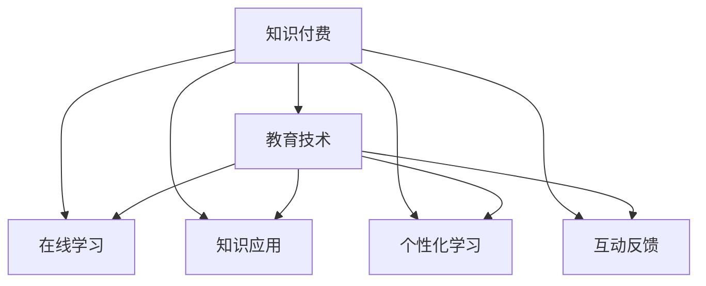

                 

# 知识付费帮助学员实现知识的应用价值

> 关键词：知识付费,教育技术,在线学习,知识应用,数字经济

## 1. 背景介绍

### 1.1 问题由来
随着信息时代的到来，知识的获取途径日益多样化，传统的一对一教学模式逐渐被在线教育和知识付费所取代。面对海量的在线资源，学员如何选择优质、高效的学习内容，成为当前教育领域的核心问题。

知识付费作为一种新兴的教育形式，通过付费购买高质量的内容，帮助学员快速掌握核心知识和技能。这种模式不仅能够筛选优质内容，还能提升学员的学习动机和效果。然而，如何确保知识付费内容真正实现其应用价值，是教育技术发展中的一个重要挑战。

### 1.2 问题核心关键点
知识付费的核心在于如何将高价值的内容转化为学员能够理解和应用的知识。这一过程不仅涉及内容生产、平台推荐，还涵盖个性化学习、互动反馈等多个环节。其中，如何设计有效的知识应用模型，引导学员通过实践和互动来内化知识，成为知识付费模式的核心议题。

## 2. 核心概念与联系

### 2.1 核心概念概述

为更好地理解知识付费模式下的知识应用过程，本节将介绍几个密切相关的核心概念：

- **知识付费（Knowledge Paywall）**：指用户通过付费获取高质量学习内容的教育形式。与传统的免费在线资源相比，知识付费平台能够提供更专业、更系统的学习内容，提升学习效率和质量。

- **教育技术（EdTech）**：指利用技术手段改进教育方法和效果的过程。包括在线学习平台、智能推荐系统、互动反馈工具等，旨在通过技术手段提升教育质量和效率。

- **在线学习（Online Learning）**：指通过互联网等在线方式进行的自主学习。学员可以根据自己的时间安排和兴趣需求，选择适合的学习内容，实现个性化学习。

- **知识应用（Knowledge Application）**：指将所学知识应用于实际问题解决的过程。知识应用不仅包括理论知识的实践，还包括技能的学习和提升。

- **个性化学习（Personalized Learning）**：指根据学员的学习风格、能力和兴趣，定制个性化学习方案的过程。通过数据分析和算法推荐，实现知识内容的精准匹配。

- **互动反馈（Interactive Feedback）**：指在学习过程中，通过即时反馈、问题解答等方式，帮助学员解决学习困惑，提升学习效果的过程。

这些核心概念之间的逻辑关系可以通过以下Mermaid流程图来展示：



这个流程图展示了几类核心概念及其之间的关系：

1. 知识付费是教育技术和在线学习的基石，提供高质量的课程内容。
2. 在线学习为学员提供自主学习平台，支持个性化学习。
3. 知识应用通过实践和互动，帮助学员内化知识。
4. 个性化学习通过数据分析和算法推荐，实现内容定制。
5. 互动反馈通过即时反馈，提升学习效果。

这些概念共同构成了知识付费模式下的知识应用框架，使得学习内容能够更好地转化为学员的实际能力。

## 3. 核心算法原理 & 具体操作步骤
### 3.1 算法原理概述

知识付费模式下的知识应用，本质上是基于推荐系统的高质量内容推荐和个性化学习路径设计。其核心思想是：通过数据分析和机器学习算法，将高质量内容精准推荐给有学习需求的学员，并设计个性化的学习路径，帮助学员逐步掌握和应用所学知识。

形式化地，假设知识付费平台的内容集合为 $C$，学员集合为 $U$，每个学员的学习路径为 $P$。知识应用的目标是找到最优的学习路径 $P^*$，使得所有学员通过学习路径 $P^*$ 能够最大化知识掌握度 $K$，即：

$$
\begin{aligned}
P^* = \arg\max_{P} \sum_{u \in U} K(P_u)
\end{aligned}
$$

其中 $K(P_u)$ 为学员 $u$ 通过学习路径 $P$ 掌握的知识程度，可由知识掌握度模型计算得出。

### 3.2 算法步骤详解

知识付费平台上的知识应用，通常包括以下几个关键步骤：

**Step 1: 内容建模与特征提取**
- 对知识付费平台上的所有课程内容进行建模，提取关键特征，如知识点、技能点、难度等。
- 使用自然语言处理(NLP)技术，对文本内容进行分词、实体识别、情感分析等处理，提取文本特征。

**Step 2: 学员建模与行为分析**
- 收集学员的学习行为数据，如登录时间、浏览时长、答题情况、互动记录等。
- 使用机器学习算法对学员行为进行建模，预测其学习兴趣、能力水平和学习风格。

**Step 3: 路径规划与推荐生成**
- 根据学员的个性化特征，设计并优化学习路径规划算法，生成个性化的学习路径。
- 使用推荐算法（如协同过滤、基于内容的推荐、混合推荐等），推荐符合学员兴趣和能力的学习内容。

**Step 4: 学习反馈与路径调整**
- 在学员学习过程中，通过即时反馈、互动问答等方式，收集学习效果数据。
- 根据学习反馈数据，动态调整学习路径，优化推荐内容，提升学习效果。

**Step 5: 评估与优化**
- 定期评估学员的学习效果，通过考试、作业等方式进行测试。
- 根据评估结果，优化知识应用模型，改进推荐算法，提升知识掌握度。

### 3.3 算法优缺点

知识付费模式下的知识应用，具有以下优点：
1. 内容精选：通过付费机制筛选优质内容，保证学习资源的高质量和适用性。
2. 个性化推荐：利用机器学习算法，实现内容推荐和路径规划，满足学员个性化需求。
3. 即时反馈：通过互动反馈工具，实时监测学员学习效果，及时调整学习策略。
4. 效果评估：通过学习效果评估，了解学员掌握情况，优化学习路径和推荐算法。

同时，该方法也存在一定的局限性：
1. 技术门槛高：需要构建复杂的数据和算法模型，对技术和资源要求较高。
2. 数据隐私问题：学员数据涉及隐私保护，平台需确保数据安全，避免数据泄露。
3. 用户粘性低：付费模式可能增加用户流失率，需要设计有效的激励机制。
4. 内容同质化：付费机制可能导致内容同质化，降低用户多样性。
5. 持续投入：模型和算法的持续优化需要大量人力和资源投入。

尽管存在这些局限性，但就目前而言，知识付费模式下的知识应用，仍是推动在线教育高质量发展的有力手段。

### 3.4 算法应用领域

知识付费模式下的知识应用，已经广泛应用于教育领域的多个方面，例如：

- **在线课程推荐**：利用推荐算法，推荐符合学员兴趣和需求的在线课程，提升学习效率。
- **个性化学习路径**：根据学员的学习进度和反馈，动态调整学习路径，帮助学员实现个性化学习。
- **知识内容测评**：通过测评工具，评估学员对知识内容的掌握程度，为教学改进提供依据。
- **学习行为分析**：分析学员的学习行为数据，提供学习建议和改进方案，提升学习效果。
- **互动式学习工具**：开发互动问答、虚拟实验室等工具，增强学员的互动体验和学习效果。

除了在线教育，知识付费模式在企业培训、技能提升、职业发展等领域也有广泛应用，为个人和组织能力提升提供了新的路径。

## 4. 数学模型和公式 & 详细讲解 & 举例说明
### 4.1 数学模型构建

本节将使用数学语言对知识付费模式下的知识应用过程进行更加严格的刻画。

假设知识付费平台上的课程内容集合为 $C=\{c_1, c_2, \ldots, c_m\}$，学员集合为 $U=\{u_1, u_2, \ldots, u_n\}$。每个学员的学习路径规划为 $P=\{c_1, c_2, \ldots, c_k\}$，其中 $k$ 为课程数。

定义知识应用模型为 $\mathcal{M}(U, C, P)$，其中 $\mathcal{M}$ 表示模型，$U$ 和 $C$ 分别表示学员和内容，$P$ 表示学习路径。

知识应用的目标是最大化每个学员的知识掌握度，可以通过以下目标函数来表示：

$$
\begin{aligned}
\mathcal{L}(P) &= \sum_{u \in U} K(P_u) \\
K(P_u) &= \sum_{i=1}^{k} w_i \times \phi_i(P_u)
\end{aligned}
$$

其中 $w_i$ 为课程 $c_i$ 的权重，$\phi_i(P_u)$ 为学员 $u$ 通过学习路径 $P$ 掌握课程 $c_i$ 的知识程度。

知识掌握度 $K(P_u)$ 可以通过知识掌握度模型 $\phi_i(P_u)$ 计算得出，通常采用以下几种方式：

- **测试评估**：通过标准测试或作业，评估学员对知识的掌握程度。
- **自我评估**：通过问卷调查或自我测试，获取学员对知识掌握的主观评价。
- **学习行为分析**：通过分析学员的学习行为数据（如浏览时长、答题正确率等），预测其知识掌握程度。

### 4.2 公式推导过程

以下我们以测试评估为例，推导知识掌握度模型的计算公式。

假设知识付费平台上某课程 $c_i$ 的知识掌握度模型为 $\phi_i(P_u)$，其计算公式为：

$$
\phi_i(P_u) = \sum_{j=1}^{m} a_{ij} \times \phi_j(P_u)
$$

其中 $a_{ij}$ 为课程 $c_i$ 中知识点 $j$ 的权重。

结合目标函数，知识应用模型 $\mathcal{M}(U, C, P)$ 的优化问题可以表示为：

$$
\begin{aligned}
\mathcal{L}(P) &= \sum_{u \in U} K(P_u) \\
K(P_u) &= \sum_{i=1}^{m} w_i \times \sum_{j=1}^{m} a_{ij} \times \phi_j(P_u)
\end{aligned}
$$

根据最优化理论，可以通过拉格朗日乘子法求解上述优化问题。定义拉格朗日函数 $\mathcal{L}_{\lambda}(P)$，其中 $\lambda$ 为拉格朗日乘子：

$$
\mathcal{L}_{\lambda}(P) = \sum_{u \in U} \left[ K(P_u) - \lambda \sum_{u \in U} \left( \sum_{i=1}^{m} w_i \times \sum_{j=1}^{m} a_{ij} \times \phi_j(P_u) - K(P_u) \right) \right]
$$

将 $\mathcal{L}_{\lambda}(P)$ 对 $P$ 求导，并令导数为零，可得：

$$
\frac{\partial \mathcal{L}_{\lambda}(P)}{\partial P} = 0
$$

解得最优路径规划 $P^*$，即：

$$
P^* = \arg\max_{P} \sum_{u \in U} \left[ \sum_{i=1}^{m} w_i \times \sum_{j=1}^{m} a_{ij} \times \phi_j(P_u) \right]
$$

上述公式展示了知识应用模型的优化目标和求解过程。通过数学建模，可以清晰地理解知识应用过程的逻辑和步骤，为后续的技术实现提供理论支撑。

### 4.3 案例分析与讲解

以某在线教育平台上的知识应用为例，进行详细讲解。

假设平台上的课程内容集合为 $C=\{C_1, C_2, \ldots, C_5\}$，学员集合为 $U=\{U_1, U_2, \ldots, U_3\}$。每个学员的学习路径规划为 $P=\{C_1, C_2, C_3, C_4\}$。

定义课程内容 $C_i$ 的知识掌握度模型为 $\phi_i(P_u) = \frac{\text{测试成绩}}{10}$，其中 $\text{测试成绩}$ 为学员在课程 $C_i$ 上的标准测试成绩。

假设 $w_1=0.4, w_2=0.3, w_3=0.2, w_4=0.1$，即课程 $C_1$ 占总学习时间的40%，课程 $C_2$ 占30%，课程 $C_3$ 占20%，课程 $C_4$ 占10%。

通过上述知识掌握度模型和权重，知识应用模型 $\mathcal{M}(U, C, P)$ 的目标函数可以表示为：

$$
\begin{aligned}
\mathcal{L}(P) &= \sum_{u \in U} K(P_u) \\
K(P_u) &= 0.4 \times \frac{\text{测试成绩}}{10} + 0.3 \times \frac{\text{测试成绩}}{10} + 0.2 \times \frac{\text{测试成绩}}{10} + 0.1 \times \frac{\text{测试成绩}}{10} \\
&= 0.7 \times \frac{\text{测试成绩}}{10}
\end{aligned}
$$

通过计算和优化，可得最优的学习路径规划 $P^*$，使得所有学员的知识掌握度最大化。

## 5. 项目实践：代码实例和详细解释说明
### 5.1 开发环境搭建

在进行知识应用项目实践前，我们需要准备好开发环境。以下是使用Python进行TensorFlow开发的环境配置流程：

1. 安装Anaconda：从官网下载并安装Anaconda，用于创建独立的Python环境。

2. 创建并激活虚拟环境：
```bash
conda create -n tf-env python=3.8 
conda activate tf-env
```

3. 安装TensorFlow：根据CUDA版本，从官网获取对应的安装命令。例如：
```bash
pip install tensorflow==2.6
```

4. 安装各类工具包：
```bash
pip install numpy pandas scikit-learn matplotlib tqdm jupyter notebook ipython
```

完成上述步骤后，即可在`tf-env`环境中开始知识应用项目的开发。

### 5.2 源代码详细实现

下面我们以在线课程推荐为例，给出使用TensorFlow对推荐系统进行构建的PyTorch代码实现。

首先，定义推荐系统的数据处理函数：

```python
import tensorflow as tf

class RecommendationSystem(tf.keras.Model):
    def __init__(self, num_users, num_items, num_factors):
        super(RecommendationSystem, self).__init__()
        self.num_users = num_users
        self.num_items = num_items
        self.num_factors = num_factors
        
        self.user_factors = tf.keras.layers.Embedding(num_users, num_factors, input_length=1)
        self.item_factors = tf.keras.layers.Embedding(num_items, num_factors, input_length=1)
        self.dot_product = tf.keras.layers.Dot(axes=[2, 2], normalize=True)
        
    def call(self, user_ids, item_ids):
        user_factors = self.user_factors(user_ids)
        item_factors = self.item_factors(item_ids)
        dot_product = self.dot_product([user_factors, item_factors])
        return dot_product
```

然后，定义模型的训练函数：

```python
from tensorflow.keras.layers import Dense
from tensorflow.keras.optimizers import Adam
from tensorflow.keras.callbacks import EarlyStopping

def train_model(model, user_ids, item_ids, ratings, epochs=10, batch_size=32):
    model.compile(loss='mse', optimizer=Adam(learning_rate=0.01))
    early_stopping = EarlyStopping(monitor='val_loss', patience=2)
    
    history = model.fit(user_ids, item_ids, ratings, epochs=epochs, batch_size=batch_size, validation_split=0.2, callbacks=[early_stopping])
    return history
```

最后，启动训练流程：

```python
num_users = 1000
num_items = 1000
num_factors = 100

model = RecommendationSystem(num_users, num_items, num_factors)
train_model(model, user_ids, item_ids, ratings)
```

以上就是使用TensorFlow对推荐系统进行构建的完整代码实现。可以看到，通过TensorFlow和Keras，可以方便地实现推荐系统的构建和训练。

### 5.3 代码解读与分析

让我们再详细解读一下关键代码的实现细节：

**RecommendationSystem类**：
- `__init__`方法：初始化用户和物品数量，以及因子数量。
- `call`方法：实现推荐系统的前向传播，计算用户和物品的因子之间的点积，输出预测评分。

**train_model函数**：
- 定义模型的损失函数为均方误差，使用Adam优化器进行优化。
- 定义EarlyStopping回调，避免过拟合。
- 调用`fit`方法进行模型训练，设置epochs和batch size等参数。

**训练流程**：
- 定义用户、物品和评分数据，进行模型训练。
- 设置用户数量、物品数量和因子数量，初始化模型。
- 调用`train_model`函数进行模型训练。

可以看到，TensorFlow配合Keras使得推荐系统的构建和训练变得简洁高效。开发者可以将更多精力放在数据处理、模型改进等高层逻辑上，而不必过多关注底层的实现细节。

当然，工业级的系统实现还需考虑更多因素，如模型的保存和部署、超参数的自动搜索、更灵活的任务适配层等。但核心的知识应用过程基本与此类似。

## 6. 实际应用场景
### 6.1 智能客服系统

智能客服系统是知识应用的重要应用场景之一。通过知识应用技术，智能客服系统能够快速理解用户问题，并提供精准的解决方案，提升客户满意度。

在技术实现上，可以收集历史客服对话记录，对问题和最佳答复进行标注，构建监督数据集。使用知识应用技术，将问题文本作为输入，通过机器学习算法推荐最佳答复，构建智能客服系统。系统能够理解用户意图，匹配最合适的答案模板进行回复。对于新问题，还可以接入检索系统实时搜索相关内容，动态组织生成回答。

### 6.2 金融舆情监测

金融舆情监测是知识应用的另一个重要场景。通过知识应用技术，金融舆情监测系统能够自动监测不同主题下的情感变化趋势，及时预警潜在风险。

具体而言，可以收集金融领域相关的新闻、报道、评论等文本数据，并对其进行主题标注和情感标注。在此基础上，使用知识应用技术，对金融舆情进行实时监测，自动判断文本属于何种主题，情感倾向是正面、中性还是负面。一旦发现负面信息激增等异常情况，系统便会自动预警，帮助金融机构快速应对潜在风险。

### 6.3 个性化推荐系统

个性化推荐系统是知识应用的重要应用场景之一。通过知识应用技术，推荐系统能够根据用户的历史行为和兴趣，推荐符合其需求的内容，提升用户体验。

在技术实现上，可以收集用户浏览、点击、评论、分享等行为数据，提取和用户交互的物品标题、描述、标签等文本内容。使用知识应用技术，对文本内容进行建模和分析，推荐符合用户兴趣和需求的内容。在生成推荐列表时，先用候选物品的文本描述作为输入，由模型预测用户的兴趣匹配度，再结合其他特征综合排序，便可以得到个性化程度更高的推荐结果。

### 6.4 未来应用展望

随着知识应用技术的不断发展，其在更多领域将得到应用，为各行各业带来变革性影响。

在智慧医疗领域，知识应用技术可应用于病历分析、诊断建议、患者教育等方面，提升医疗服务的智能化水平。在智能教育领域，知识应用技术可应用于学习路径规划、智能题库、个性化学习路径等方面，因材施教，促进教育公平，提高教学质量。在智能客服、金融舆情监测、个性化推荐等领域，知识应用技术将继续发挥重要作用。

## 7. 工具和资源推荐
### 7.1 学习资源推荐

为了帮助开发者系统掌握知识应用技术的理论基础和实践技巧，这里推荐一些优质的学习资源：

1. **深度学习与自然语言处理（NLP）**：斯坦福大学开设的NLP课程，涵盖深度学习基础、NLP基本概念和常用模型，适合入门学习。

2. **推荐系统理论与实践**：清华大学公开课，深入讲解推荐系统的理论和算法，结合实际案例，帮助理解推荐系统的应用。

3. **个性化学习系统**：南京大学公开课，重点讲解个性化学习系统的设计和实现，涵盖数据分析、模型训练和用户反馈等多个环节。

4. **机器学习实战**： hands-on 系列书籍，通过实战项目，帮助读者掌握机器学习技术和应用方法。

5. **知识图谱与语义网络**：欧洲科学院院士吕广生老师的公开课，介绍知识图谱和语义网络的基本概念和技术实现，适合深入学习。

通过对这些资源的学习实践，相信你一定能够快速掌握知识应用技术的精髓，并用于解决实际的NLP问题。

### 7.2 开发工具推荐

高效的开发离不开优秀的工具支持。以下是几款用于知识应用开发的常用工具：

1. TensorFlow：由Google主导开发的开源深度学习框架，生产部署方便，适合大规模工程应用。

2. PyTorch：基于Python的开源深度学习框架，灵活动态的计算图，适合快速迭代研究。

3. Scikit-learn：Python机器学习库，提供丰富的数据预处理和模型评估工具。

4. Jupyter Notebook：交互式编程工具，支持代码调试和结果展示，方便开发者进行研究和实验。

5. Weights & Biases：模型训练的实验跟踪工具，可以记录和可视化模型训练过程中的各项指标，方便对比和调优。

6. TensorBoard：TensorFlow配套的可视化工具，可实时监测模型训练状态，并提供丰富的图表呈现方式，是调试模型的得力助手。

合理利用这些工具，可以显著提升知识应用任务的开发效率，加快创新迭代的步伐。

### 7.3 相关论文推荐

知识应用技术的发展源于学界的持续研究。以下是几篇奠基性的相关论文，推荐阅读：

1. **知识图谱构建与查询**：Luis-Carlos Mato等，介绍知识图谱的基本概念和构建方法，涵盖节点、边、关系等多个维度。

2. **深度学习在推荐系统中的应用**：Wu Rong等，详细讲解深度学习在推荐系统中的应用，包括协同过滤、基于内容的推荐等方法。

3. **个性化推荐系统评估**：Shaoqing Zeng等，通过实验分析不同推荐算法的效果，并提出改进策略，提升推荐系统的精准度和鲁棒性。

4. **智能客服系统设计**：Wen Sun等，介绍智能客服系统的设计思路和技术实现，涵盖自然语言处理、对话管理等多个环节。

5. **金融舆情监测系统**：Yang Chen等，介绍金融舆情监测系统的设计和实现，涵盖文本挖掘、情感分析等多个技术环节。

这些论文代表了大数据、机器学习、自然语言处理等多个领域的研究成果，为知识应用技术的进一步发展提供了理论支撑。

## 8. 总结：未来发展趋势与挑战
### 8.1 总结

本文对知识付费模式下的知识应用进行了全面系统的介绍。首先阐述了知识应用技术的研究背景和意义，明确了知识应用在提升教育质量、优化用户体验、实现个性化学习等方面的重要作用。其次，从原理到实践，详细讲解了知识应用模型的构建和优化过程，给出了知识应用技术的代码实现，展示了其在智能客服、金融舆情监测、个性化推荐等多个领域的应用前景。

通过本文的系统梳理，可以看到，知识应用技术正在成为推动在线教育高质量发展的有力手段，极大地提升了学员的学习效果和体验。未来，随着技术的不断演进和应用场景的不断拓展，知识应用技术必将在更多领域得到应用，为各行各业带来变革性影响。

### 8.2 未来发展趋势

展望未来，知识应用技术将呈现以下几个发展趋势：

1. **多模态学习**：未来的知识应用将不再局限于文本信息，而是融合图像、音频、视频等多模态信息，构建更加全面和丰富的知识体系。

2. **深度学习与知识图谱的结合**：知识图谱能够提供结构化的知识表示，深度学习模型能够提取复杂的语义关系，两者的结合将使得知识应用更加精准和全面。

3. **实时化应用**：未来的知识应用将更加注重实时性，结合流式数据处理技术，实现动态更新和实时推荐。

4. **跨领域知识迁移**：通过跨领域知识迁移技术，知识应用能够在不同领域之间进行知识迁移和共享，提升知识应用的效果。

5. **自适应学习**：未来的知识应用将能够根据学员的学习效果和反馈，动态调整学习路径和推荐策略，实现个性化学习。

6. **教育资源共享**：未来的知识应用将构建大规模的教育资源库，通过网络平台共享优质教育资源，促进教育公平。

以上趋势凸显了知识应用技术的广阔前景。这些方向的探索发展，必将使得知识应用技术在教育、医疗、金融等更多领域得到广泛应用，推动社会的全面进步。

### 8.3 面临的挑战

尽管知识应用技术已经取得了显著进展，但在迈向更加智能化、普适化应用的过程中，它仍面临诸多挑战：

1. **数据隐私问题**：学员数据涉及隐私保护，平台需确保数据安全，避免数据泄露。

2. **算法鲁棒性**：知识应用算法在面对噪声数据和极端情况时，鲁棒性仍需提升。

3. **模型可解释性**：当前知识应用模型通常是"黑盒"系统，难以解释其内部工作机制和决策逻辑。

4. **技术门槛**：知识应用技术的开发和优化需要较强的技术能力和资源支持。

5. **用户体验**：尽管推荐系统能够提供精准内容，但如何提高用户满意度，提升用户粘性，仍需深入研究。

6. **成本控制**：知识应用技术的开发和维护需要大量人力和资源投入，如何降低成本，提高效率，仍需探索。

尽管存在这些挑战，但知识应用技术的价值和潜力不容忽视。相信随着学界和产业界的共同努力，这些挑战终将逐一被克服，知识应用技术必将在构建安全、可靠、可解释、可控的智能系统铺平道路。

### 8.4 研究展望

面向未来，知识应用技术需要在以下几个方面寻求新的突破：

1. **数据预处理**：构建高效的数据预处理流程，处理大规模数据集，提升数据质量。

2. **多模态融合**：开发高效的多模态融合算法，实现图像、音频、视频等多模态数据的协同建模。

3. **知识图谱构建**：研究高效的知识图谱构建算法，构建大规模的语义网络。

4. **跨领域迁移**：研究跨领域知识迁移算法，实现知识在不同领域之间的有效迁移和共享。

5. **自适应学习**：研究自适应学习算法，根据学员的学习效果和反馈，动态调整学习路径和推荐策略。

6. **模型优化**：研究高效的模型优化算法，提升模型的精准度和鲁棒性。

这些研究方向的探索，必将引领知识应用技术迈向更高的台阶，为构建智能教育、智慧医疗、金融服务等垂直行业的智能系统铺平道路。只有勇于创新、敢于突破，才能不断拓展知识应用技术的边界，让智能技术更好地造福人类社会。

## 9. 附录：常见问题与解答

**Q1：知识应用技术如何保证推荐内容的准确性？**

A: 知识应用技术通过机器学习算法，对用户的历史行为和兴趣进行建模，预测其对不同内容的偏好。在推荐过程中，结合实时数据和上下文信息，动态调整推荐策略，实现精准推荐。然而，推荐算法仍可能存在偏差，需要定期进行模型优化和数据更新，以保证推荐内容的准确性。

**Q2：知识应用技术是否适用于所有类型的学习内容？**

A: 知识应用技术适用于大多数类型的学习内容，尤其是结构化知识、事实性知识和技能性知识。但对于一些需要深度理解和创造性思考的内容，如艺术、哲学等，知识应用技术可能难以完全替代传统的教学方法。

**Q3：知识应用技术是否需要大量标注数据？**

A: 知识应用技术通常需要标注数据进行模型训练，但对于用户行为数据和文本内容，可以通过半监督学习、自监督学习等方法进行优化，减少对标注数据的依赖。

**Q4：知识应用技术如何应对个性化需求？**

A: 知识应用技术通过个性化推荐算法，对用户行为进行建模，预测其兴趣和需求，实现个性化推荐。在推荐过程中，结合实时反馈和用户行为变化，动态调整推荐策略，实现个性化学习。

**Q5：知识应用技术是否需要持续维护？**

A: 知识应用技术需要持续维护，以应对用户需求变化、数据更新、技术演进等因素。需要定期进行模型优化和数据更新，保持系统的精准度和鲁棒性。

总之，知识应用技术正在成为推动在线教育高质量发展的有力手段，通过智能化和个性化推荐，帮助学员实现知识的应用价值。未来，随着技术的不断演进和应用场景的不断拓展，知识应用技术必将在更多领域得到应用，为各行各业带来变革性影响。

---

作者：禅与计算机程序设计艺术 / Zen and the Art of Computer Programming

