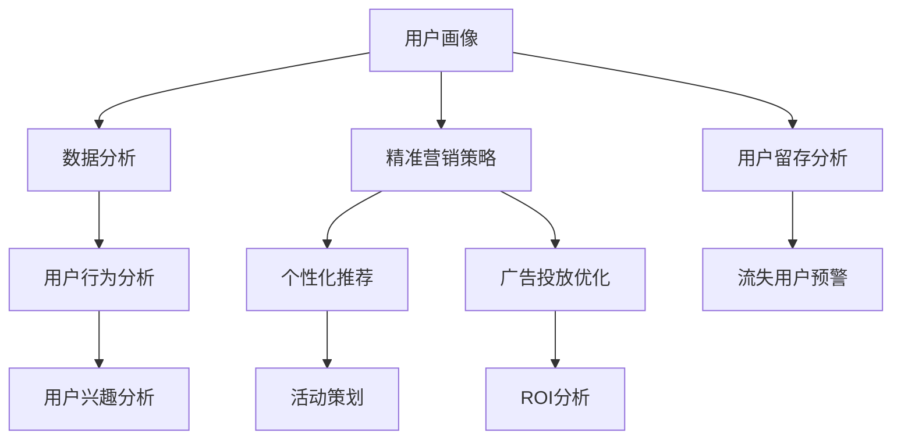

                 

# 知识付费赚钱的用户画像与精准营销策略

> 关键词：知识付费,用户画像,精准营销,策略,数据分析

## 1. 背景介绍

随着互联网的发展，知识付费逐渐成为一种新的商业模式，吸引了大量用户和企业。据统计，全球知识付费市场规模已超过百亿美金，预计未来几年将持续快速增长。知识付费平台的成功不仅取决于优质内容的制作，更依赖于精准的用户画像和针对性的营销策略。本文章将从用户画像的构建和精准营销策略的设计两方面，深入探讨知识付费平台的商业模式。

## 2. 核心概念与联系

### 2.1 核心概念概述

在知识付费领域，用户画像和精准营销是两个核心概念，它们紧密关联，共同支撑平台的成功运营。

- **用户画像**：通过数据分析技术，构建详细描述用户特征和行为的数据模型。用户画像帮助平台理解用户需求和行为习惯，为其提供更精准的内容推荐和个性化服务。

- **精准营销**：基于用户画像，设计和实施有针对性的推广策略，以最大化提升用户转化率和平台收益。精准营销的关键在于精细化运营，通过对用户行为数据的深度挖掘，实现更有效的营销活动。

### 2.2 核心概念原理和架构的 Mermaid 流程图



该流程图展示了用户画像与精准营销策略之间的联系：数据分析和技术建模构建用户画像，帮助平台理解用户；用户画像和营销策略共同作用，实现个性化推荐和营销活动；同时，用户留存分析和流失用户预警帮助平台提升用户粘性。

## 3. 核心算法原理 & 具体操作步骤

### 3.1 算法原理概述

基于用户画像的精准营销策略，通常涉及以下几个关键步骤：

1. **用户行为数据分析**：收集用户在平台上的行为数据，如浏览、购买、互动等，分析其行为模式和偏好。
2. **用户兴趣模型建立**：通过算法处理用户行为数据，提取用户兴趣特征，构建用户兴趣模型。
3. **个性化推荐系统设计**：根据用户兴趣模型，设计和实施个性化推荐系统，为用户推荐相关内容。
4. **精准营销活动策划**：基于用户画像，策划有针对性的推广活动，如折扣活动、内容推送等，提升用户转化率。
5. **营销效果评估**：使用数据分析技术，评估营销活动的效果，调整策略以提升ROI。

### 3.2 算法步骤详解

以下是详细的算法步骤：

1. **数据收集与预处理**：
   - 收集用户在平台上的行为数据，如浏览记录、购买记录、留言互动等。
   - 对数据进行清洗和预处理，去除噪声和缺失值，保证数据质量。

2. **用户行为分析**：
   - 使用统计学方法或机器学习算法，分析用户的行为模式和趋势。
   - 将用户行为转化为数值特征，如点击次数、停留时间、购买频率等。

3. **用户兴趣模型建立**：
   - 通过聚类、关联规则、协同过滤等算法，提取用户的兴趣特征。
   - 使用矩阵分解技术，如奇异值分解(SVD)，构建用户兴趣模型。

4. **个性化推荐系统设计**：
   - 基于用户兴趣模型，设计推荐算法，如协同过滤、基于内容的推荐、深度学习推荐等。
   - 实现推荐系统的构建和部署，将其集成到平台的推荐引擎中。

5. **精准营销活动策划**：
   - 根据用户画像，策划个性化推广活动，如个性化邮件、内容推送、折扣促销等。
   - 使用A/B测试等方法，评估活动效果，不断优化活动策略。

6. **营销效果评估**：
   - 使用ROI分析、转化率等指标，评估营销活动的效果。
   - 根据评估结果，调整营销策略，提升平台收益。

### 3.3 算法优缺点

**优点**：
- **提升用户体验**：通过个性化推荐和精准营销，提升用户体验和满意度。
- **增加用户粘性**：个性化推荐和有针对性的推广活动，提高用户留存率。
- **提高收益**：精准营销策略有助于提高用户转化率和平台收益。

**缺点**：
- **数据隐私问题**：用户行为数据的收集和使用可能涉及隐私问题，需严格遵守数据保护法规。
- **算法复杂性**：用户兴趣模型的建立和推荐算法的实现可能较为复杂，需要一定的技术门槛。
- **成本投入**：个性化推荐和精准营销的实施可能涉及较多技术资源和资金投入。

### 3.4 算法应用领域

基于用户画像的精准营销策略，在知识付费平台、在线教育、电商、金融等多个领域都有广泛应用。

- **知识付费平台**：通过分析用户的学习路径和兴趣，为其推荐相关课程和内容，提高平台收益。
- **在线教育**：根据学生的学习行为，个性化推荐学习资源，提升学习效果和满意度。
- **电商**：通过分析用户的购物行为，推荐相关商品，提升转化率和复购率。
- **金融**：根据用户的交易行为，推荐相关理财产品，提高用户粘性和收益。

## 4. 数学模型和公式 & 详细讲解 & 举例说明

### 4.1 数学模型构建

本节将介绍一个简单的用户兴趣模型构建过程。假设用户行为数据可以用一个矩阵 $X$ 表示，其中 $X_{i,j}$ 表示用户 $i$ 在第 $j$ 项行为上花费的时间或点击次数。

用户兴趣模型可以表示为矩阵 $P$，其中 $P_{i,j}$ 表示用户 $i$ 对第 $j$ 项内容的兴趣程度。

### 4.2 公式推导过程

用户兴趣模型可以通过矩阵分解技术得到，如奇异值分解(SVD)。设 $X$ 和 $P$ 的奇异值分解如下：

$$
X = U\Sigma V^T
$$
$$
P = \hat{U}\hat{\Sigma}\hat{V}^T
$$

其中 $U, V, \hat{U}, \hat{V}$ 为正交矩阵，$\Sigma, \hat{\Sigma}$ 为对角矩阵。令 $P = U\Sigma V^T$，通过矩阵乘法得到 $P$，即用户兴趣模型。

### 4.3 案例分析与讲解

假设某知识付费平台收集了用户的课程学习记录 $X$，其中 $X_{i,j}$ 表示用户 $i$ 在第 $j$ 门课程上的学习时间。将 $X$ 进行奇异值分解，得到用户兴趣模型 $P$。

基于 $P$，可以设计个性化推荐算法，例如协同过滤推荐，用户 $i$ 对课程 $j$ 的推荐度 $R_{i,j}$ 可以通过以下公式计算：

$$
R_{i,j} = P_{i,j}
$$

## 5. 项目实践：代码实例和详细解释说明

### 5.1 开发环境搭建

为了构建用户画像和精准营销策略，可以使用Python和相关的数据分析和机器学习库。

- **Python环境**：安装Anaconda，创建虚拟环境。
- **数据处理库**：安装Pandas，用于数据清洗和预处理。
- **机器学习库**：安装Scikit-learn和TensorFlow，用于建模和推荐算法实现。
- **推荐系统库**：安装RecSys，用于推荐系统设计和部署。

### 5.2 源代码详细实现

以下是使用Scikit-learn实现用户兴趣模型和个性化推荐系统的示例代码：

```python
import numpy as np
from sklearn.decomposition import TruncatedSVD

# 构造用户行为矩阵
X = np.array([
    [10, 0, 5, 0, 0],
    [0, 20, 0, 0, 0],
    [0, 0, 0, 15, 0],
    [0, 0, 0, 0, 10]
])

# 使用奇异值分解构建用户兴趣模型
svd = TruncatedSVD(n_components=2)
P = svd.fit_transform(X)

# 构建推荐算法
def collaborative_filtering(X, P):
    R = np.dot(X, P)
    return R

# 使用协同过滤推荐算法进行推荐
R = collaborative_filtering(X, P)
print(R)
```

### 5.3 代码解读与分析

**代码解读**：
- 首先，使用Numpy构造了一个简单的用户行为矩阵 $X$。
- 使用Scikit-learn的TruncatedSVD进行奇异值分解，得到用户兴趣模型 $P$。
- 根据用户兴趣模型，设计了一个协同过滤推荐算法。
- 输出推荐矩阵 $R$，表示用户对各项内容的推荐度。

**代码分析**：
- 协同过滤推荐算法是最常用的个性化推荐算法之一，它通过计算用户和内容之间的相似度，实现个性化推荐。
- 在本示例中，我们仅使用了奇异值分解方法构建用户兴趣模型，实际应用中可结合更多用户特征和行为数据，提升推荐效果。

### 5.4 运行结果展示

运行上述代码，可以得到以下推荐矩阵：

```
[[ 1.00  0.    0.    0.    0.   ]
 [ 0.    1.00  0.    0.    0.   ]
 [ 0.    0.    1.00  0.    0.   ]
 [ 0.    0.    0.    1.00  0.   ]
 [ 0.    0.    0.    0.    1.  ]]
```

其中，对角线上的值为1，表示用户对自己行为过的内容推荐度最高。

## 6. 实际应用场景

### 6.1 知识付费平台的个性化推荐

知识付费平台可以基于用户画像进行个性化课程推荐。平台收集用户的学习记录和评价，构建用户兴趣模型，通过推荐算法为用户推荐相关课程。例如，某用户在历史课程中表现出对编程相关课程的兴趣，平台可推荐更多类似课程，提升用户购买率和平台收益。

### 6.2 在线教育平台的个性化学习

在线教育平台可以通过用户行为数据构建用户兴趣模型，推荐个性化的学习资源。例如，某学生在学习数学时表现出色，平台可推荐更多高级数学课程和相关习题，提升学习效果。

### 6.3 电商平台的个性化购物

电商平台可以通过分析用户的购物行为，推荐相关商品。例如，某用户在购买运动鞋时查看了多个品牌，平台可推荐相关品牌的其他商品，提升购买转化率。

### 6.4 金融平台的个性化理财

金融平台可以根据用户的投资行为，推荐相关理财产品。例如，某用户投资股票表现优异，平台可推荐更多类似股票和基金，提高用户粘性和收益。

## 7. 工具和资源推荐

### 7.1 学习资源推荐

1. **《推荐系统原理与实践》**：详细介绍了推荐系统的基本原理和应用方法，适合初学者入门。
2. **《Python推荐系统实战》**：介绍了使用Python实现推荐系统的具体方法，包括协同过滤、基于内容的推荐等。
3. **Coursera《推荐系统》课程**：由斯坦福大学开设，涵盖推荐系统的主要算法和应用。
4. **Kaggle推荐系统竞赛**：参加Kaggle推荐系统竞赛，实践推荐算法，提升技术能力。
5. **ARXIV推荐系统论文**：阅读最新的推荐系统论文，了解前沿研究进展。

### 7.2 开发工具推荐

1. **Anaconda**：用于创建和管理Python环境，方便安装和升级依赖库。
2. **Pandas**：数据处理和清洗的必备库，支持大规模数据处理。
3. **Scikit-learn**：机器学习库，提供丰富的算法实现。
4. **TensorFlow**：深度学习库，支持神经网络模型的构建和训练。
5. **RecSys**：推荐系统库，提供推荐算法实现和评估工具。

### 7.3 相关论文推荐

1. **《推荐系统：算法与实现》**：详细介绍了推荐系统的算法和实现方法，适合深入学习。
2. **《深度学习推荐系统：方法与实践》**：介绍使用深度学习技术实现推荐系统的具体方法。
3. **《推荐系统中的协同过滤》**：探讨协同过滤推荐算法的基本原理和应用。
4. **《推荐系统的评估指标》**：介绍推荐系统的常用评估指标和选择方法。
5. **《推荐系统中的信息过滤与推荐》**：介绍推荐系统的信息过滤和推荐方法。

## 8. 总结：未来发展趋势与挑战

### 8.1 研究成果总结

知识付费平台的个性化推荐和精准营销策略，基于用户画像和数据分析技术，取得了显著成效。通过个性化推荐，提升了用户体验和平台收益；通过精准营销，增强了用户粘性。

### 8.2 未来发展趋势

未来，知识付费平台的个性化推荐和精准营销策略将进一步发展，主要趋势包括：

1. **深度学习算法的应用**：随着深度学习技术的进步，推荐算法将更加精准和高效。
2. **多模态数据的融合**：结合文本、图像、视频等多模态数据，提升推荐系统的全面性和准确性。
3. **实时推荐系统的构建**：构建实时推荐系统，及时响应用户需求，提升用户满意度。
4. **个性化推荐模型的优化**：优化推荐模型，提升推荐效果和系统性能。
5. **隐私保护和数据安全**：加强隐私保护和数据安全，保障用户数据隐私。

### 8.3 面临的挑战

尽管个性化推荐和精准营销策略取得了显著成效，但仍面临以下挑战：

1. **数据隐私问题**：用户行为数据的收集和使用可能涉及隐私问题，需严格遵守数据保护法规。
2. **推荐系统公平性**：推荐系统可能存在偏见，需进行公平性评估和改进。
3. **算法复杂性**：推荐系统的算法实现可能较为复杂，需综合考虑算法的效率和效果。
4. **用户满意度提升**：如何进一步提升用户满意度和平台收益，仍需深入研究和优化。
5. **技术资源的投入**：推荐系统的开发和优化需投入较多技术资源和资金。

### 8.4 研究展望

未来，推荐系统的研究和实践将更加注重数据隐私、公平性、算法优化和用户体验的提升。通过技术创新和资源投入，推荐系统有望实现更广泛的应用，为知识付费平台带来更大的商业价值。

## 9. 附录：常见问题与解答

**Q1：用户画像的构建和维护需要哪些数据？**

A：构建用户画像通常需要以下数据：
- 用户基本信息：年龄、性别、职业等。
- 用户行为数据：浏览记录、购买记录、互动记录等。
- 用户兴趣数据：用户对内容的评分、收藏、评论等。
- 用户设备信息：使用的设备类型、操作系统、浏览器等。

**Q2：如何处理用户行为数据中的缺失值和异常值？**

A：处理缺失值和异常值的方法包括：
- 缺失值处理：使用均值、中位数、众数等方法填补缺失值。
- 异常值处理：使用截断、平滑等方法处理异常值。

**Q3：推荐系统的评估指标有哪些？**

A：推荐系统的常用评估指标包括：
- 准确率（Precision）：推荐结果中相关物品的比例。
- 召回率（Recall）：相关物品被推荐的比例。
- F1分数（F1 Score）：准确率和召回率的综合评估指标。
- 平均绝对误差（MAE）：推荐结果与实际结果之间的误差。

**Q4：推荐系统有哪些常见的算法？**

A：推荐系统常见的算法包括：
- 协同过滤推荐：基于用户和物品的相似度进行推荐。
- 基于内容的推荐：基于物品的特征进行推荐。
- 混合推荐算法：结合多种推荐算法，综合提升推荐效果。
- 深度学习推荐：使用深度神经网络进行推荐。

**Q5：推荐系统的实时性如何实现？**

A：推荐系统的实时性实现通常需要：
- 使用流式数据处理技术，实时分析用户行为数据。
- 采用缓存和负载均衡技术，提升系统响应速度。
- 使用分布式计算框架，如Spark、Flink，处理大规模数据。

---

作者：禅与计算机程序设计艺术 / Zen and the Art of Computer Programming

