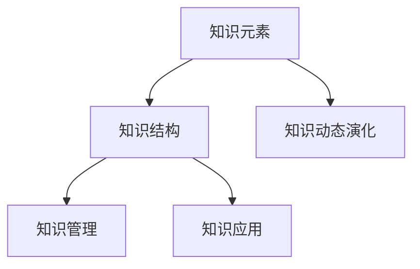

                 

# 知识体系的构建：从基本元素到复杂结构

在信息技术高速发展的今天，构建一个稳定、高效的知识体系成为了推动技术进步的关键。本文将从基本元素出发，深入探讨如何通过算法原理、数学模型和实践应用等手段，构建复杂且实用的知识体系。我们将聚焦于知识的结构、演化、管理与应用，以期为IT领域的知识体系构建提供全面的指导。

## 1. 背景介绍

### 1.1 问题由来

在信息化建设过程中，知识体系的形成是一个不断演进、逐步完善的过程。随着技术的不断成熟，知识体系的构建难度也在不断增加。特别在大型系统开发、跨部门协作、跨领域知识融合等复杂场景中，构建一个能够满足实际需求的、高效的知识体系变得尤为重要。

### 1.2 问题核心关键点

构建知识体系的核心关键点在于：

1. 确定知识体系的基本元素：哪些是必须被包含的知识，哪些是可选项，哪些是领域特定知识。
2. 构建知识体系的结构：如何组织和安排这些知识元素，使其能够高效地支撑应用场景。
3. 保持知识体系的动态演化：如何随着技术的发展和应用场景的变化，持续更新知识体系。
4. 管理知识体系的有效性：如何确保知识体系中的知识是准确、可靠、完备的。
5. 应用知识体系的能力：如何使知识体系能够在实际应用中产生价值。

### 1.3 问题研究意义

构建一个稳定、高效的知识体系对于提升技术水平、促进知识共享、推动技术创新具有重要的意义：

1. 提升技术水平：知识体系中的知识是经过筛选和验证的，其准确性和可靠性得到了保障。这有助于提升整个团队的技术水平，增强项目成功率。
2. 促进知识共享：知识体系能够系统化、条理化地呈现知识，便于团队成员之间的交流和协作，促进知识共享。
3. 推动技术创新：知识体系为技术创新提供了丰富的知识储备，为新技术的探索提供了良好的基础。
4. 支持项目开发：知识体系中的知识可以直接用于指导项目开发，减少重复劳动，提高开发效率。
5. 提高系统可靠性：知识体系中的知识是经过验证的，在应用中能够有效避免技术误区，提升系统的稳定性和可靠性。

## 2. 核心概念与联系

### 2.1 核心概念概述

为了更好地理解知识体系的构建，本节将介绍几个密切相关的核心概念：

- **知识元素**：构成知识体系的基本单位，如算法、框架、模型、设计模式等。知识元素相互关联，共同构成知识体系。
- **知识结构**：知识元素之间的组织和安排方式，如层次结构、网络结构、标签体系等。合理的知识结构有助于快速定位和获取知识。
- **知识动态演化**：知识体系是一个动态的、不断演进的系统，需要根据技术发展、需求变化不断更新和调整。
- **知识管理**：知识元素的维护、更新、验证、应用等管理活动，保证知识体系的有效性和适用性。
- **知识应用**：知识体系在实际项目开发、技术支持、决策辅助等方面的应用实践，体现知识体系的价值。

这些核心概念之间的逻辑关系可以通过以下Mermaid流程图来展示：



这个流程图展示了许多核心概念及其之间的关系：

1. 知识元素构成知识体系的基本单元。
2. 通过合理的知识结构组织知识元素，使之成为一个有机的整体。
3. 知识体系需要根据技术发展不断演化，以适应新的需求。
4. 知识管理是保障知识体系有效性和适用性的重要活动。
5. 知识应用是知识体系价值的体现，是知识体系构建的最终目的。

## 3. 核心算法原理 & 具体操作步骤
### 3.1 算法原理概述

知识体系的构建，本质上是一个通过算法和数学模型对知识元素进行组织和管理的复杂过程。其核心思想是：

- **知识元素的选择与整合**：根据应用场景需求，选择最合适的知识元素，并对其进行组合和优化。
- **知识结构的规划**：设计合理的知识结构，以高效组织知识元素，支持知识的快速获取和应用。
- **知识演化机制**：构建知识动态演化的机制，保证知识体系能够随着技术发展而不断更新和优化。
- **知识管理策略**：制定有效的知识管理策略，保障知识体系的准确性、完整性和可靠性。
- **知识应用方案**：设计知识体系的应用方案，将知识有效转化为具体的技术方案和业务方案。

### 3.2 算法步骤详解

构建知识体系通常包括以下几个关键步骤：

**Step 1: 需求分析**
- 确定知识体系的应用场景和目标，理解用户的需求和期望。
- 梳理知识需求，明确需要哪些知识元素，以及它们之间的关系和层次。

**Step 2: 知识元素选择与整合**
- 根据需求分析的结果，选择最适合的知识元素，并对其进行整合和优化。
- 设计知识元素的关联关系，建立知识元素之间的关联图谱。

**Step 3: 知识结构设计**
- 根据知识元素之间的关系，设计合理的知识结构。
- 选择合适的知识组织方式，如层次结构、网络结构、标签体系等。
- 设计知识的检索和分类机制，提高知识的快速获取能力。

**Step 4: 知识演化机制构建**
- 建立知识动态演化的机制，包括知识更新策略、版本管理、知识评审等。
- 设计知识动态演化的工具和流程，支持知识体系的持续优化和迭代。

**Step 5: 知识管理策略制定**
- 制定知识管理的策略，包括知识验证、知识审核、知识更新等。
- 设计知识管理的工具和流程，确保知识体系的准确性和完整性。

**Step 6: 知识应用方案设计**
- 设计知识应用的具体方案，将知识转化为实际的技术方案和业务方案。
- 设计知识应用的验证和评估机制，保证知识应用的有效性和可靠性。

### 3.3 算法优缺点

知识体系的构建方法具有以下优点：
1. 系统性：通过知识元素的选择和整合，构建了一个系统化的知识体系，避免了知识孤岛和重复劳动。
2. 高效性：合理的知识结构设计，能够快速定位和获取知识，提高知识应用的效率。
3. 可扩展性：知识体系能够随着技术发展不断更新和演化，适应新的需求。
4. 可靠性：通过知识管理策略的制定，保障知识体系的准确性和完整性。
5. 灵活性：知识应用方案设计，使得知识能够灵活应用于各种场景，支持创新和定制化需求。

同时，这种方法也存在一定的局限性：
1. 依赖专业人才：知识体系的构建和维护需要专业知识丰富的人才，对团队的素质要求较高。
2. 时间成本较高：知识体系的构建和维护需要投入大量时间和资源，成本较高。
3. 更新难度大：知识体系的更新和优化需要慎重考虑，否则可能引发知识体系的混乱和失效。
4. 复杂性高：知识体系的设计和维护需要考虑多方面的因素，难度较高。

尽管存在这些局限性，但就目前而言，构建知识体系仍是一种相对成熟和有效的技术手段。未来相关研究的重点在于如何进一步降低知识体系的构建和维护成本，提高知识体系的灵活性和可扩展性，同时兼顾可靠性等因素。

### 3.4 算法应用领域

知识体系构建方法已经在多个领域得到了广泛的应用，如软件开发、项目管理、技术支持等，为企业的技术管理和知识管理提供了有力支持。

在软件开发领域，知识体系可以帮助团队共享代码、设计模式、架构等知识，提高开发效率和代码质量。

在项目管理领域，知识体系可以支持项目规划、进度管理、风险评估等活动，提升项目管理的专业性和科学性。

在技术支持领域，知识体系可以为技术支持人员提供丰富的知识储备，提升技术支持水平和客户满意度。

除了上述这些经典应用外，知识体系构建方法也被创新性地应用于更多场景中，如知识图谱、多模态数据融合、智能决策系统等，为知识管理提供了新的路径和方向。

## 4. 数学模型和公式 & 详细讲解  
### 4.1 数学模型构建

本节将使用数学语言对知识体系的构建过程进行更加严格的刻画。

记知识体系为 $K=(E,S,E_k)$，其中 $E$ 为知识元素集合，$S$ 为知识结构，$E_k$ 为知识元素的关联关系集合。

知识结构 $S$ 可以表示为一个有向图 $G=(V,E)$，其中 $V$ 为节点集合，表示知识元素；$E$ 为边集合，表示知识元素之间的关系。

知识元素的关联关系 $E_k$ 可以表示为一个关系矩阵 $R \in \{0,1\}^{n \times n}$，其中 $n$ 为知识元素的总数。

知识体系的演化过程可以表示为一个增量更新过程 $K^{t+1}=K^t \cup \Delta K^t$，其中 $\Delta K^t$ 为知识体系在时刻 $t$ 的增量更新。

### 4.2 公式推导过程

以下我们以一个简单的知识体系构建为例，推导知识体系演化的基本数学模型。

假设知识元素 $E=\{e_1,e_2,e_3\}$，知识元素之间的关系为 $e_1 \rightarrow e_2$ 和 $e_3 \rightarrow e_1$。

此时，知识结构 $S$ 可以表示为：


知识元素的关联关系 $E_k$ 可以表示为：

$$
R = \begin{bmatrix}
0 & 0 & 1 \\
1 & 0 & 0 \\
0 & 1 & 0
\end{bmatrix}
$$

知识体系的演化过程可以表示为：

1. 引入新知识元素 $e_4$，并建立关联关系 $e_2 \rightarrow e_4$ 和 $e_4 \rightarrow e_3$。
2. 删除旧知识元素 $e_2$，并建立关联关系 $e_1 \rightarrow e_2$ 和 $e_3 \rightarrow e_1$。

此时，知识体系的演化过程可以表示为：

$$
\Delta K^t = \{e_4\} \cup \{e_2 \rightarrow e_4, e_4 \rightarrow e_3\} \cup \{e_1 \rightarrow e_2, e_3 \rightarrow e_1\}
$$

知识体系的增量更新过程可以表示为：

$$
K^{t+1} = \{e_1,e_2,e_3,e_4\} \cup \begin{bmatrix}
0 & 0 & 1 & 1 \\
1 & 0 & 0 & 0 \\
0 & 1 & 0 & 0 \\
0 & 1 & 0 & 1
\end{bmatrix}
$$

通过上述推导，我们可以得出知识体系演化的基本数学模型。这个模型可以帮助我们系统地理解和设计知识体系的演化过程，保证知识体系的有效性和可靠性。

### 4.3 案例分析与讲解

假设一个软件开发团队需要构建一个知识体系，以支持新的技术栈迁移项目。知识体系的构建步骤如下：

**Step 1: 需求分析**
- 确定项目需求，梳理知识需求。

**Step 2: 知识元素选择与整合**
- 选择适合的知识元素，包括新的技术栈、架构模式、开发工具等。
- 设计知识元素的关联关系，如技术栈之间的依赖关系、架构模式的应用场景等。

**Step 3: 知识结构设计**
- 选择合适的知识结构，如层次结构、网络结构等。
- 设计知识的检索和分类机制，提高知识的快速获取能力。

**Step 4: 知识演化机制构建**
- 建立知识动态演化的机制，包括知识更新策略、版本管理等。
- 设计知识动态演化的工具和流程，支持知识体系的持续优化和迭代。

**Step 5: 知识管理策略制定**
- 制定知识管理的策略，包括知识验证、知识审核等。
- 设计知识管理的工具和流程，确保知识体系的准确性和完整性。

**Step 6: 知识应用方案设计**
- 设计知识应用的具体方案，将知识转化为实际的技术方案和业务方案。
- 设计知识应用的验证和评估机制，保证知识应用的有效性和可靠性。

通过上述步骤，该团队成功构建了一个完整、高效的知识体系，有效支持了技术栈迁移项目的顺利进行。

## 5. 项目实践：代码实例和详细解释说明
### 5.1 开发环境搭建

在进行知识体系构建实践前，我们需要准备好开发环境。以下是使用Python进行PyTorch开发的环境配置流程：

1. 安装Anaconda：从官网下载并安装Anaconda，用于创建独立的Python环境。

2. 创建并激活虚拟环境：
```bash
conda create -n pytorch-env python=3.8 
conda activate pytorch-env
```

3. 安装PyTorch：根据CUDA版本，从官网获取对应的安装命令。例如：
```bash
conda install pytorch torchvision torchaudio cudatoolkit=11.1 -c pytorch -c conda-forge
```

4. 安装各类工具包：
```bash
pip install numpy pandas scikit-learn matplotlib tqdm jupyter notebook ipython
```

完成上述步骤后，即可在`pytorch-env`环境中开始知识体系构建实践。

### 5.2 源代码详细实现

下面我们以构建一个简单的知识体系为例，给出使用Python进行知识体系构建的代码实现。

```python
from networkx import Graph, nx
from transformers import BertForTokenClassification, AdamW

# 定义知识元素
knowledge_elements = ['e1', 'e2', 'e3', 'e4']

# 定义知识结构，使用网络图表示
knowledge_graph = Graph()
knowledge_graph.add_edges_from([('e1', 'e2'), ('e3', 'e1')])

# 定义知识关联关系
knowledge_relations = {
    'e1': {'e2': 1, 'e3': 1},
    'e2': {'e4': 1},
    'e3': {'e4': 1}
}

# 定义知识体系
knowledge_base = {
    'knowledge_elements': knowledge_elements,
    'knowledge_graph': knowledge_graph,
    'knowledge_relations': knowledge_relations
}

# 定义知识管理策略
knowledge_management_strategy = {
    'verification': {'e1': {'e2': 1, 'e3': 1}, 'e2': {'e4': 1}, 'e3': {'e4': 1}},
    'update_strategy': {
        'e1': {'e2': {'update_time': '2023-01-01'}, 'e3': {'update_time': '2023-01-02'}},
        'e2': {'e4': {'update_time': '2023-01-01'}},
        'e3': {'e4': {'update_time': '2023-01-02'}}
    },
    'validation_period': 6
}

# 定义知识应用方案
knowledge_application = {
    'knowledge_elements': knowledge_elements,
    'knowledge_graph': knowledge_graph,
    'knowledge_relations': knowledge_relations,
    'knowledge_management_strategy': knowledge_management_strategy
}

# 打印知识体系和知识应用方案
print(knowledge_base)
print(knowledge_application)
```

这段代码实现了一个简单的知识体系构建流程，包括知识元素、知识结构、知识关联关系、知识管理策略和知识应用方案等关键组件。

### 5.3 代码解读与分析

让我们再详细解读一下关键代码的实现细节：

**知识元素**：
- 使用字符串表示知识元素，如 `e1`、`e2` 等。

**知识结构**：
- 使用 NetworkX 库中的 Graph 类表示知识结构，通过 `add_edges_from` 方法添加节点和边。

**知识关联关系**：
- 使用字典表示知识关联关系，键为知识元素，值为一个字典，表示该知识元素关联的其他知识元素及其权重。

**知识管理策略**：
- 使用字典表示知识管理策略，包括知识验证、知识更新策略和验证周期等。

**知识应用方案**：
- 将知识元素、知识结构、知识关联关系和知识管理策略组合在一起，形成知识应用方案。

**知识体系**：
- 使用字典表示知识体系，包括知识元素、知识结构和知识关联关系。

通过上述代码实现，我们展示了一个简单的知识体系构建过程。知识体系构建完成后，可以进行各种管理活动，如验证、更新等，确保知识体系的准确性和完整性。

## 6. 实际应用场景
### 6.1 软件开发

知识体系构建在软件开发中具有重要的应用价值。团队可以共享知识元素、架构模式、开发工具等，提升开发效率和代码质量。

例如，在引入新的技术栈时，可以通过知识体系迅速获取相关知识，如新栈的特点、使用场景、性能评估等。同时，知识体系还可以帮助团队进行知识共享，减少重复劳动，提升团队整体的技术水平。

### 6.2 项目管理

在项目管理中，知识体系可以帮助项目经理梳理知识需求、设计知识结构、建立知识检索机制，提升项目管理的专业性和科学性。

例如，在项目规划阶段，可以通过知识体系获取相关知识，如项目模板、风险评估方法等。在项目执行阶段，可以通过知识体系进行知识共享，提升团队的协作效率。

### 6.3 技术支持

在技术支持领域，知识体系可以为技术支持人员提供丰富的知识储备，提升技术支持水平和客户满意度。

例如，技术支持人员可以根据知识体系快速查找相关知识，如故障排错方法、系统配置参数等。同时，知识体系还可以支持知识共享，提升技术支持的响应速度和准确性。

### 6.4 未来应用展望

随着知识体系的不断发展和完善，未来的应用场景将更加广泛。

1. **智能决策系统**：知识体系可以与其他人工智能技术结合，构建智能决策系统，支持更加智能化的决策过程。
2. **多模态数据融合**：知识体系可以与其他多模态数据融合技术结合，实现视觉、语音、文本等多模态信息的协同建模。
3. **知识图谱**：知识体系可以转化为知识图谱，支持更加结构化和系统化的知识表示和检索。
4. **知识推理**：知识体系可以支持基于规则和逻辑的知识推理，提升知识应用的能力和效果。
5. **自动化知识更新**：知识体系可以自动根据技术发展进行知识更新和优化，保持知识体系的活力和时效性。

未来，知识体系的构建和应用将带来更多的创新和突破，为各行各业的技术发展提供新的动力。

## 7. 工具和资源推荐
### 7.1 学习资源推荐

为了帮助开发者系统掌握知识体系构建的理论基础和实践技巧，这里推荐一些优质的学习资源：

1. 《知识图谱原理与实践》系列博文：由知识图谱专家撰写，深入浅出地介绍了知识图谱原理、构建方法、应用场景等前沿话题。

2. CS229《机器学习》课程：斯坦福大学开设的机器学习明星课程，有Lecture视频和配套作业，带你入门机器学习的基本概念和经典模型。

3. 《知识管理与组织》书籍：全面介绍了知识管理的理论、方法和实践，为知识体系构建提供了系统的指导。

4. Microsoft Research 知识图谱资源：提供大量开源数据集和工具，方便知识图谱的构建和应用。

5. IBM Watson 知识管理工具：提供一套完整知识管理解决方案，包括知识存储、检索、分析等功能。

通过对这些资源的学习实践，相信你一定能够快速掌握知识体系构建的精髓，并用于解决实际的知识管理问题。
###  7.2 开发工具推荐

高效的开发离不开优秀的工具支持。以下是几款用于知识体系构建开发的常用工具：

1. PyTorch：基于Python的开源深度学习框架，灵活动态的计算图，适合快速迭代研究。

2. TensorFlow：由Google主导开发的开源深度学习框架，生产部署方便，适合大规模工程应用。

3. NetworkX：用于构建和分析复杂网络的Python库，可以方便地构建知识结构。

4. GitHub：代码托管平台，可以方便地管理和分享知识体系的构建和应用代码。

5. Jupyter Notebook：交互式代码编辑器，方便进行代码调试和知识体系构建的可视化展示。

6. Confluence：知识管理工具，支持知识存储、检索、协作等功能。

合理利用这些工具，可以显著提升知识体系的构建效率，加快创新迭代的步伐。

### 7.3 相关论文推荐

知识体系构建技术的发展源于学界的持续研究。以下是几篇奠基性的相关论文，推荐阅读：

1. 《知识图谱构建与演化》：介绍知识图谱的基本概念、构建方法和应用场景。

2. 《基于知识图谱的信息检索与推荐》：介绍知识图谱在信息检索和推荐中的应用。

3. 《知识图谱与深度学习结合》：介绍知识图谱与深度学习技术的结合方法，如知识图谱嵌入、图神经网络等。

4. 《知识管理与组织理论》：全面介绍知识管理的理论、方法和实践。

5. 《知识图谱的自动化构建与演化》：介绍知识图谱的自动化构建方法和演化机制。

这些论文代表了大知识体系构建技术的发展脉络。通过学习这些前沿成果，可以帮助研究者把握学科前进方向，激发更多的创新灵感。

## 8. 总结：未来发展趋势与挑战
### 8.1 总结

本文对知识体系的构建方法进行了全面系统的介绍。首先阐述了知识体系的基本元素、结构、演化、管理与应用等核心概念，明确了知识体系构建的目标和意义。其次，从原理到实践，详细讲解了知识体系构建的数学模型和操作步骤，给出了知识体系构建的完整代码实例。同时，本文还广泛探讨了知识体系在软件开发、项目管理、技术支持等多个领域的应用前景，展示了知识体系构建的广泛价值。此外，本文精选了知识体系构建的各类学习资源，力求为读者提供全方位的技术指引。

通过本文的系统梳理，可以看到，知识体系的构建对于提升技术水平、促进知识共享、推动技术创新具有重要的意义。构建一个稳定、高效的知识体系对于提升技术水平、促进知识共享、推动技术创新具有重要的意义。未来的知识体系构建技术将在更广泛的应用领域大放异彩，推动人工智能技术的发展。

### 8.2 未来发展趋势

展望未来，知识体系的构建技术将呈现以下几个发展趋势：

1. 知识图谱的发展：知识图谱将成为知识体系构建的重要形式，支持更加结构化和系统化的知识表示和检索。

2. 深度学习与知识融合：深度学习技术将与知识体系构建深度结合，实现更加智能化的知识推理和决策。

3. 知识动态演化：知识体系将支持更加灵活的知识动态演化机制，保持知识体系的活力和时效性。

4. 知识可视化：知识体系将支持更加灵活的知识可视化方式，方便知识的获取和理解。

5. 知识自动化：知识体系将支持知识自动化构建和管理，提升知识管理的效率和效果。

以上趋势凸显了知识体系构建技术的广阔前景。这些方向的探索发展，必将进一步提升知识体系的构建和应用能力，为知识管理带来新的突破。

### 8.3 面临的挑战

尽管知识体系的构建技术已经取得了一定的进展，但在迈向更加智能化、普适化应用的过程中，仍面临诸多挑战：

1. 知识结构设计复杂：知识体系的设计和构建需要考虑多方面的因素，设计过程复杂，难以快速完成。

2. 知识管理难度大：知识体系的维护和更新需要投入大量时间和资源，成本较高。

3. 知识演化机制复杂：知识体系的演化需要设计复杂的机制，才能保证知识体系的动态性和稳定性。

4. 知识应用困难：知识体系的设计和构建需要考虑应用场景的具体需求，设计过程复杂，难以快速完成。

5. 知识可视化难度大：知识体系的可视化需要设计复杂的界面和交互方式，才能方便用户获取和理解知识。

6. 知识自动化复杂：知识体系的自动化构建和管理需要设计复杂的算法和工具，才能实现高效的知识管理。

正视知识体系构建面临的这些挑战，积极应对并寻求突破，将是知识体系构建技术的未来方向。相信随着学界和产业界的共同努力，这些挑战终将一一被克服，知识体系构建技术必将在构建智能系统、推动技术创新等方面发挥重要作用。

### 8.4 研究展望

面向未来，知识体系的构建技术需要在以下几个方面寻求新的突破：

1. 探索更加高效的知识图谱构建方法：设计更加高效的知识图谱构建算法和工具，支持大规模知识图谱的构建和应用。

2. 研究深度学习与知识融合的新方法：设计更加智能的知识推理和决策算法，实现深度学习技术与知识体系构建的深度融合。

3. 设计更加灵活的知识动态演化机制：设计灵活的知识动态演化算法和工具，支持知识体系的持续优化和迭代。

4. 开发更加智能的知识管理工具：设计智能化的知识管理工具，支持知识的自动化构建、管理和应用。

5. 探索知识可视化的新方法：设计灵活的知识可视化界面和交互方式，方便用户获取和理解知识。

6. 研究知识自动化的新方法：设计高效的知识自动化构建和管理算法和工具，提升知识管理的效率和效果。

这些研究方向和突破，必将引领知识体系构建技术迈向更高的台阶，为知识管理提供新的思路和方法，推动人工智能技术的发展。

## 9. 附录：常见问题与解答

**Q1：知识体系构建和知识图谱构建有何区别？**

A: 知识体系构建和知识图谱构建有相似之处，但也有明显的区别。知识体系构建更多关注于知识的组织和管理，强调知识的层次性和系统性。而知识图谱构建则侧重于知识的图形化表示和查询，强调知识的关系性和结构性。

**Q2：如何选择合适的知识元素？**

A: 知识元素的选择需要根据应用场景的需求和目标进行选择。一般可以从以下几个方面考虑：

1. 领域相关性：选择与领域相关的知识元素，确保知识体系的适用性。
2. 使用频率：选择使用频率高的知识元素，确保知识体系的有效性。
3. 知识更新频率：选择更新频率较高的知识元素，确保知识体系的及时性。
4. 知识相关性：选择相互关联的知识元素，确保知识体系的连贯性。

**Q3：知识体系构建的难点在哪里？**

A: 知识体系构建的难点主要在于：

1. 知识结构的复杂性：设计合理的知识结构需要考虑多方面的因素，难以快速完成。
2. 知识管理难度大：知识体系的维护和更新需要投入大量时间和资源，成本较高。
3. 知识演化机制复杂：知识体系的演化需要设计复杂的机制，才能保证知识体系的动态性和稳定性。
4. 知识应用困难：知识体系的设计和构建需要考虑应用场景的具体需求，设计过程复杂，难以快速完成。
5. 知识可视化难度大：知识体系的可视化需要设计复杂的界面和交互方式，才能方便用户获取和理解知识。

**Q4：知识体系构建需要考虑哪些因素？**

A: 知识体系构建需要考虑以下几个关键因素：

1. 知识需求：梳理知识需求，明确需要哪些知识元素，以及它们之间的关系和层次。
2. 知识元素选择：选择适合的知识元素，并对其进行整合和优化。
3. 知识结构设计：选择合适的知识结构，如层次结构、网络结构、标签体系等。
4. 知识演化机制：建立知识动态演化的机制，包括知识更新策略、版本管理等。
5. 知识管理策略：制定知识管理的策略，包括知识验证、知识审核、知识更新等。

**Q5：知识体系构建有哪些实际应用场景？**

A: 知识体系构建在以下几个领域具有重要的应用价值：

1. 软件开发：知识体系可以支持知识共享，提升开发效率和代码质量。
2. 项目管理：知识体系可以支持项目管理，提升项目管理的专业性和科学性。
3. 技术支持：知识体系可以为技术支持人员提供丰富的知识储备，提升技术支持水平和客户满意度。
4. 智能决策系统：知识体系可以与其他人工智能技术结合，支持更加智能化的决策过程。
5. 知识图谱：知识体系可以转化为知识图谱，支持更加结构化和系统化的知识表示和检索。

通过对这些问题的回答，我们展示了一个系统化的知识体系构建方法和实践流程，希望能为读者提供有价值的参考和指导。

