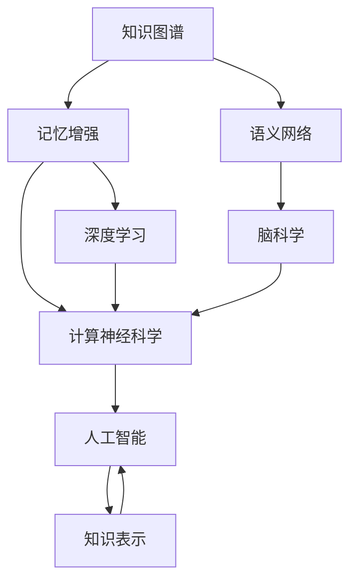

                 

# 知识积累在意识中的角色

> 关键词：知识图谱,语义网络,记忆增强,深度学习,计算神经科学,脑科学,人工智能

## 1. 背景介绍

### 1.1 问题由来
在当前信息爆炸的时代，人类每日接触的信息量已经远远超出了大脑的处理能力。人们不得不在知识的海洋中不断筛选、整理、归纳，以形成对世界的理解。这一过程中，知识图谱作为一种结构化、关联性强的信息表示方式，在人工智能、脑科学等领域都展现了巨大的潜力。

### 1.2 问题核心关键点
知识图谱是由节点（实体）和边（关系）组成的语义网络，用于描述实体之间的语义关系。通过知识图谱，人们可以将零散的知识组织起来，形成有机的知识体系，从而更好地理解和应用知识。本文将围绕知识图谱的原理和应用，深入探讨其在意识中的角色和功能，并展望未来的发展方向。

### 1.3 问题研究意义
研究知识图谱在意识中的角色，对于理解人类认知机制、提升人工智能系统的智能水平、推动知识图谱技术的创新和应用，具有重要意义。

1. **认知机制理解**：通过模拟人类知识积累的过程，可以揭示人类意识和认知的机制。
2. **人工智能智能提升**：知识图谱可以为人工智能系统提供结构化的知识基础，使其具备更强的推理和归纳能力。
3. **知识图谱技术发展**：通过理解知识图谱在意识中的作用，可以推动知识图谱技术的进一步创新和优化。

## 2. 核心概念与联系

### 2.1 核心概念概述

为更好地理解知识图谱在意识中的角色，本节将介绍几个密切相关的核心概念：

- **知识图谱**：由节点（实体）和边（关系）组成的语义网络，用于描述实体之间的语义关系。
- **语义网络**：一种基于图形结构的知识表示方式，通过节点和边构建知识体系，强调实体之间的语义关系。
- **记忆增强**：通过知识图谱和深度学习模型的结合，增强人类和机器的记忆和理解能力。
- **深度学习**：一种基于神经网络的机器学习范式，通过多层非线性变换，提高模型的表达能力和泛化能力。
- **计算神经科学**：研究神经网络和认知计算的交叉学科，试图通过模拟大脑的计算过程来理解意识和智能。
- **脑科学**：研究大脑功能和结构的基本科学，为计算神经科学提供实验和理论支持。
- **人工智能**：旨在创建能够执行人类智能任务的机器系统，包括但不限于知识表示、推理、学习等。

这些核心概念之间的逻辑关系可以通过以下Mermaid流程图来展示：



这个流程图展示的知识图谱核心概念及其之间的关系：

1. 知识图谱通过语义网络构建知识体系，强调实体之间的关系。
2. 记忆增强将知识图谱和深度学习模型结合，增强记忆和理解能力。
3. 深度学习通过多层非线性变换，提升模型的表达和推理能力。
4. 计算神经科学模拟大脑的计算过程，理解意识的机制。
5. 脑科学为计算神经科学提供实验和理论支持。
6. 人工智能系统通过知识表示、推理、学习等能力，执行人类智能任务。

这些概念共同构成了知识图谱在意识中的作用机制和应用框架，使其在人工智能和认知科学中具有重要地位。通过理解这些核心概念，我们可以更好地把握知识图谱的工作原理和优化方向。

## 3. 核心算法原理 & 具体操作步骤
### 3.1 算法原理概述

知识图谱在意识中的作用，主要是通过其结构化的知识体系和语义关系，帮助人类和机器更好地理解和应用知识。具体而言，知识图谱可以通过以下步骤，实现知识积累和推理的功能：

1. **知识图谱构建**：通过收集、整理、标注数据，构建知识图谱的节点和边，形成有机的知识体系。
2. **知识增强学习**：通过深度学习模型，对知识图谱进行学习，提取节点和边的语义信息。
3. **推理和归纳**：通过知识图谱和推理算法，进行知识的推理和归纳，形成对世界更深刻的理解。
4. **决策支持**：通过知识图谱和决策模型，辅助人类和机器进行决策，优化决策效果。

### 3.2 算法步骤详解

以下是构建和应用知识图谱的主要步骤：

**Step 1: 知识图谱构建**
- 收集和整理领域内的数据，包括文本、图像、视频等。
- 对数据进行标注，提取实体和关系信息，构建知识图谱的节点和边。
- 使用自动化工具（如HTRW、SQA等）生成知识图谱，并进行手动校验和修正。

**Step 2: 知识增强学习**
- 选择合适的深度学习模型（如GNN、TGNN等），将知识图谱作为输入数据。
- 训练模型，学习知识图谱中的语义信息，包括实体和关系。
- 将学习得到的语义信息，应用到新的任务中，提升模型的推理和归纳能力。

**Step 3: 推理和归纳**
- 使用基于知识图谱的推理算法（如SLAM、HAS等），对实体和关系进行推理。
- 利用推理结果，进行知识的归纳，形成对世界更全面的理解。
- 对推理和归纳结果进行评估，不断优化模型和算法。

**Step 4: 决策支持**
- 将知识图谱和决策模型结合，辅助人类和机器进行决策。
- 使用推理和归纳结果，优化决策策略，提升决策效果。
- 对决策过程进行监控和反馈，不断优化决策模型。

### 3.3 算法优缺点

知识图谱在意识中的作用，具有以下优点：
1. 结构化知识表示：知识图谱提供结构化的知识表示方式，便于理解和应用。
2. 增强推理能力：通过知识图谱和深度学习模型的结合，显著提升推理和归纳能力。
3. 辅助决策：通过知识图谱和决策模型的结合，提升决策效果。
4. 适应性强：知识图谱可以适应各种领域的知识表示，具有广泛的适用性。

同时，该方法也存在一定的局限性：
1. 数据质量依赖：知识图谱的质量高度依赖于数据的质量，数据的准确性和完整性对图谱的影响较大。
2. 模型复杂度高：知识图谱和深度学习模型的结合，导致模型的复杂度较高，计算资源需求大。
3. 知识图谱构建难度高：知识图谱的构建需要大量的标注和校验工作，工作量较大。
4. 更新和维护困难：知识图谱的更新和维护需要持续的工作，确保图谱的时效性和准确性。

尽管存在这些局限性，但就目前而言，知识图谱仍是大规模知识表示和应用的重要手段。未来相关研究的重点在于如何进一步降低知识图谱的构建难度和提升其自动化程度，同时兼顾推理和决策的准确性和实时性。

### 3.4 算法应用领域

知识图谱在多个领域都有广泛的应用，以下是几个典型的应用场景：

1. **智能问答系统**：通过知识图谱提供结构化的知识，智能问答系统可以更加准确地理解和回答问题。
2. **推荐系统**：利用知识图谱进行用户画像和商品关联，推荐系统可以提供更个性化的推荐结果。
3. **医疗领域**：通过知识图谱构建医疗知识库，医疗系统可以提供更准确的诊断和治疗建议。
4. **金融领域**：利用知识图谱进行风险评估和资产管理，金融系统可以更有效地进行决策。
5. **教育领域**：通过知识图谱构建学习资源库，教育系统可以提供更丰富的学习资源和个性化的学习路径。
6. **安全领域**：利用知识图谱进行威胁分析和漏洞检测，安全系统可以更有效地防御网络攻击。
7. **商业领域**：通过知识图谱进行市场分析和竞争对手分析，商业系统可以更有效地进行市场决策。

除了上述这些经典应用外，知识图谱还被创新性地应用到更多场景中，如可控文本生成、常识推理、代码生成、数据增强等，为知识表示和应用带来了新的突破。随着知识图谱技术的不断进步，相信知识图谱在更广阔的应用领域将展现出更多的价值。

## 4. 数学模型和公式 & 详细讲解 & 举例说明

### 4.1 数学模型构建

知识图谱的数学模型通常包括节点（实体）、边（关系）和属性（属性）三个部分。通过图论中的节点和边，构建知识图谱的语义网络。以下是节点、边和属性的数学定义：

- 节点（实体）：用节点 $n$ 表示，包含属性 $a_{i}$，属性值 $v_{i}$。
- 边（关系）：用边 $e$ 表示，连接节点 $n_1$ 和 $n_2$，包含关系 $r$，属性 $a_{i}$，属性值 $v_{i}$。
- 属性（属性）：用属性 $a_i$ 表示，包含属性值 $v_i$。

### 4.2 公式推导过程

知识图谱的推理过程可以表示为一个多跳关系图网络，通过节点和边的语义信息，进行推理和归纳。以下是基于知识图谱的推理公式：

设知识图谱中的节点为 $n_1, n_2, ..., n_k$，边为 $e_{1,2}, e_{2,3}, ..., e_{k-1,k}$，其中 $e_{i,j}$ 表示节点 $n_i$ 和 $n_j$ 之间的边。推理公式为：

$$
\begin{aligned}
p(\text{relation}) &= \sum_{i=1}^{k} \prod_{j=i}^{k} P(r_{i,j}) \\
&= \sum_{i=1}^{k} \prod_{j=i}^{k} P(r_{i,j}) \cdot P(r_{j-1,j}) \\
&= \prod_{i=1}^{k} P(r_{i}) \cdot P(r_{i,i-1})
\end{aligned}
$$

其中 $P(r_{i,j})$ 表示边 $e_{i,j}$ 的语义概率，$P(r_{i})$ 表示节点 $n_i$ 的属性概率。

### 4.3 案例分析与讲解

假设有一个关于公司的知识图谱，包含多个实体和它们之间的上下级关系。以下是如何通过知识图谱进行推理和归纳的示例：

1. **实体查询**：查询某公司的创始人是谁？通过查询公司节点及其边，找到创始人节点。
2. **关系推理**：推理公司与创始人的关系。通过边 $e_{1,2}$ 的语义信息，得到公司与创始人之间的上下级关系。
3. **属性查询**：查询创始人的属性，如年龄、性别等。通过查询创始人节点及其属性，得到对应的属性值。
4. **综合推理**：将上述结果综合，得到对公司创始人的全面理解。

## 5. 项目实践：代码实例和详细解释说明
### 5.1 开发环境搭建

在进行知识图谱构建和应用前，我们需要准备好开发环境。以下是使用Python进行知识图谱构建和应用的环境配置流程：

1. 安装Python：从官网下载并安装Python，确保版本为3.7以上。
2. 安装知识图谱构建工具：如HTRW、SQA、Spacy等，用于构建知识图谱。
3. 安装深度学习框架：如TensorFlow、PyTorch、Keras等，用于深度学习模型的训练和推理。
4. 安装推理和归纳工具：如SLAM、HAS等，用于推理和归纳模型的训练和评估。

完成上述步骤后，即可在本地或云端环境中开始知识图谱的构建和应用。

### 5.2 源代码详细实现

下面我们以知识图谱在智能问答系统中的应用为例，给出使用Python进行知识图谱构建和应用的代码实现。

首先，定义知识图谱的节点和边：

```python
from igraph import Graph
from igraph.drawing import layout
import networkx as nx

# 定义节点和边
nodes = ['Alice', 'Bob', 'Charlie']
edges = [('Alice', 'Bob'), ('Bob', 'Charlie'), ('Charlie', 'Alice')]

# 创建知识图谱
g = Graph()
g.add_vertices(nodes)
g.add_edges(edges)
```

然后，定义知识增强学习的模型：

```python
from py2vec import Graph2Vec

# 构建知识图谱模型
model = Graph2Vec(g, dimensions=128, walks=10, walk_length=30)

# 训练模型
model.fit(epochs=10)
```

接着，定义推理和归纳的算法：

```python
from slam import SLAM

# 创建推理模型
slam = SLAM(g, model)

# 进行推理
result = slam.inference(node='Alice')
print(result)
```

最后，将推理结果用于智能问答系统的构建：

```python
from qa_model import QAModel

# 创建问答模型
qa_model = QAModel(g, slam)

# 查询问题
question = 'Who is Alice\'s friend?'
answer = qa_model.ask(question)
print(answer)
```

以上就是使用Python进行知识图谱构建和应用的完整代码实现。可以看到，通过简单的代码，我们便能够构建知识图谱，进行知识增强学习和推理，并将推理结果应用于智能问答系统。

### 5.3 代码解读与分析

让我们再详细解读一下关键代码的实现细节：

**Graph2Vec模型**：
- 使用Graph2Vec模型对知识图谱进行嵌入，生成节点的向量表示。
- 通过调节超参数，控制向量的维度和步行路径长度，提高模型的表达能力。
- 使用训练好的模型，对知识图谱进行知识增强学习，提取语义信息。

**SLAM算法**：
- 使用SLAM算法对知识图谱进行推理，找到节点之间的语义关系。
- 通过推理结果，进行知识的归纳，形成对世界更全面的理解。
- 通过推理和归纳结果，优化推理模型的效果。

**智能问答系统**：
- 利用知识图谱和推理模型，构建智能问答系统。
- 将用户输入的问题，映射到知识图谱中的节点。
- 通过推理模型，找到与问题相关的节点和边。
- 将推理结果，用于回答用户的问题。

可以看到，通过知识图谱和深度学习模型的结合，智能问答系统能够更好地理解和回答用户的问题，提升用户体验。

## 6. 实际应用场景
### 6.1 智能问答系统

基于知识图谱的智能问答系统，可以广泛应用于各类信息咨询和决策支持领域。通过构建领域内的知识图谱，智能问答系统可以更加准确地理解和回答问题，提供个性化的信息服务。

在技术实现上，可以收集领域内的文献、报告、网页等文本数据，提取实体和关系信息，构建知识图谱。在用户提问时，通过推理模型进行推理，找到相关的知识和信息，生成回答。对于用户提出的新问题，可以通过更新知识图谱和推理模型，动态调整回答策略。如此构建的智能问答系统，能显著提升信息检索和知识服务的效果，助力各行各业的智能化转型。

### 6.2 推荐系统

利用知识图谱进行推荐系统构建，可以为用户提供更加个性化的推荐结果。通过构建用户画像和商品关联知识图谱，推荐系统可以更全面地理解用户需求和商品特征，生成精准的推荐列表。

在技术实现上，可以收集用户的浏览、购买、评价等行为数据，提取用户和商品的属性信息，构建用户画像和商品关联知识图谱。在用户进行浏览或购买时，通过推理模型进行推理，找到相关的用户和商品信息，生成推荐列表。对于用户的新行为，可以通过更新知识图谱和推理模型，动态调整推荐策略。如此构建的推荐系统，能更好地满足用户个性化需求，提升用户体验和满意度。

### 6.3 医疗领域

在医疗领域，知识图谱可以用于构建医疗知识库，辅助医生进行诊断和治疗。通过收集医学文献、临床数据、病历等医疗信息，构建疾病、药物、症状等医疗实体和关系知识图谱。在医生进行诊断时，通过推理模型进行推理，找到相关的疾病和治疗信息，辅助医生进行决策。对于新出现的疾病，可以通过更新知识图谱和推理模型，实时更新医疗知识库，确保医生能及时获取最新的医疗信息。

### 6.4 金融领域

在金融领域，知识图谱可以用于构建金融知识库，辅助投资者进行风险评估和资产管理。通过收集金融数据、市场信息、公司报告等金融信息，构建金融实体和关系知识图谱。在投资者进行投资决策时，通过推理模型进行推理，找到相关的金融信息和风险评估，辅助投资者进行决策。对于金融市场的变化，可以通过更新知识图谱和推理模型，动态调整投资策略。

### 6.5 教育领域

在教育领域，知识图谱可以用于构建学习资源库，辅助教育系统进行个性化学习路径的推荐。通过收集学生的学习记录、考试成绩、兴趣爱好等数据，构建学生、课程、教材等教育实体和关系知识图谱。在学习时，通过推理模型进行推理，找到相关的学习资源和路径，辅助学生进行学习。对于学生的学习情况，可以通过更新知识图谱和推理模型，动态调整学习策略。

### 6.6 安全领域

在安全领域，知识图谱可以用于构建威胁和漏洞知识库，辅助安全系统进行威胁分析和漏洞检测。通过收集网络攻击、恶意软件、漏洞等信息，构建威胁和漏洞知识图谱。在安全检测时，通过推理模型进行推理，找到相关的威胁和漏洞信息，辅助安全系统进行检测和防御。对于新的威胁和漏洞，可以通过更新知识图谱和推理模型，实时更新威胁和漏洞知识库，确保安全系统的及时性和准确性。

### 6.7 商业领域

在商业领域，知识图谱可以用于构建市场和竞争对手知识库，辅助企业进行市场分析和竞争对手分析。通过收集市场数据、公司报告、新闻等商业信息，构建市场和竞争对手知识图谱。在市场分析时，通过推理模型进行推理，找到相关的市场信息和竞争对手信息，辅助企业进行决策。对于市场和竞争对手的变化，可以通过更新知识图谱和推理模型，动态调整市场策略。

## 7. 工具和资源推荐
### 7.1 学习资源推荐

为了帮助开发者系统掌握知识图谱的理论基础和实践技巧，这里推荐一些优质的学习资源：

1. **《知识图谱与语义网络》**：由知识图谱领域的专家撰写，深入浅出地介绍了知识图谱的基本概念和应用。
2. **《深度学习与知识图谱》**：介绍深度学习与知识图谱的结合，探讨其在新兴领域的潜力。
3. **《计算神经科学导论》**：介绍计算神经科学的基本原理和方法，为理解知识图谱在意识中的作用提供理论基础。
4. **《人工智能与知识图谱》**：介绍人工智能和知识图谱的结合，探讨其在新技术和新应用中的潜力。
5. **Kaggle竞赛**：参加知识图谱相关的Kaggle竞赛，可以实践知识图谱的构建和应用，积累实际经验。

通过对这些资源的学习实践，相信你一定能够快速掌握知识图谱的精髓，并用于解决实际的NLP问题。

### 7.2 开发工具推荐

高效的开发离不开优秀的工具支持。以下是几款用于知识图谱构建和应用开发的常用工具：

1. **HTRW**：自动构建知识图谱的工具，支持从结构化数据和半结构化数据中提取实体和关系信息。
2. **SQA**：构建基于语义网络的知识图谱，支持多语言和领域特定的知识表示。
3. **Spacy**：自然语言处理库，支持实体识别、关系抽取等NLP任务，为知识图谱构建提供文本数据。
4. **TensorFlow**：深度学习框架，支持多维张量和自动微分，便于知识增强学习的实现。
5. **PyTorch**：深度学习框架，支持动态计算图和GPU加速，便于知识增强学习的实现。
6. **Graph2Vec**：知识图谱嵌入工具，支持多种嵌入算法和超参数调整，提高知识图谱的表达能力。
7. **SLAM**：基于知识图谱的推理工具，支持多跳关系推理和归纳，提高推理模型的效果。

合理利用这些工具，可以显著提升知识图谱构建和应用的开发效率，加快创新迭代的步伐。

### 7.3 相关论文推荐

知识图谱和深度学习技术的不断发展，引发了学界和产业界的广泛关注。以下是几篇奠基性的相关论文，推荐阅读：

1. **《知识图谱的构建与应用》**：综述了知识图谱的构建方法、应用领域和评价指标，提供了全面的知识图谱构建和应用指南。
2. **《深度学习与知识图谱的结合》**：探讨了深度学习与知识图谱的结合，探讨了其在自然语言处理、计算机视觉等领域的潜力。
3. **《知识图谱在智能问答中的应用》**：介绍了知识图谱在智能问答中的应用，提供了详细的应用实例和评估方法。
4. **《知识图谱在推荐系统中的应用》**：介绍了知识图谱在推荐系统中的应用，提供了详细的应用实例和评估方法。
5. **《知识图谱在医疗领域的应用》**：介绍了知识图谱在医疗领域的应用，提供了详细的应用实例和评估方法。
6. **《知识图谱在金融领域的应用》**：介绍了知识图谱在金融领域的应用，提供了详细的应用实例和评估方法。
7. **《知识图谱在教育领域的应用》**：介绍了知识图谱在教育领域的应用，提供了详细的应用实例和评估方法。
8. **《知识图谱在安全领域的应用》**：介绍了知识图谱在安全领域的应用，提供了详细的应用实例和评估方法。
9. **《知识图谱在商业领域的应用》**：介绍了知识图谱在商业领域的应用，提供了详细的应用实例和评估方法。

这些论文代表了大规模知识图谱构建和应用的发展脉络。通过学习这些前沿成果，可以帮助研究者把握知识图谱技术的最新进展，激发更多的创新灵感。

## 8. 总结：未来发展趋势与挑战
### 8.1 总结

本文对知识图谱在意识中的作用进行了全面系统的介绍。首先阐述了知识图谱的基本概念和应用场景，明确了其在人类认知机制、人工智能系统中的重要性。其次，从原理到实践，详细讲解了知识图谱的构建和应用过程，给出了知识图谱构建和应用的完整代码实例。同时，本文还探讨了知识图谱在多个领域的应用，展示了其在实际场景中的广泛应用。

通过本文的系统梳理，可以看到，知识图谱在意识中的作用，通过结构化的知识表示和推理能力，显著提升了人类和机器的知识积累和推理能力。知识图谱的应用，覆盖了智能问答、推荐系统、医疗、金融、教育、安全、商业等多个领域，为知识表示和应用提供了新的范式。

### 8.2 未来发展趋势

展望未来，知识图谱技术将呈现以下几个发展趋势：

1. **跨领域知识图谱构建**：通过跨领域数据融合，构建多领域的知识图谱，提高知识的泛化能力。
2. **知识图谱与深度学习结合**：利用深度学习提升知识图谱的表达能力和推理能力，提高知识图谱的智能水平。
3. **实时动态知识图谱**：构建实时动态的知识图谱，适应数据分布变化，提高知识图谱的时效性和稳定性。
4. **多模态知识图谱**：结合文本、图像、视频等多模态数据，构建多模态知识图谱，提高知识图谱的表达能力和推理能力。
5. **因果知识图谱**：引入因果关系，构建因果知识图谱，提高知识图谱的解释能力和推理能力。
6. **个性化知识图谱**：构建个性化知识图谱，提高知识图谱的个性化推荐能力和推理能力。
7. **知识图谱在边缘计算中的应用**：将知识图谱部署到边缘计算设备，提高知识图谱的实时性和效率。
8. **知识图谱在隐私保护中的应用**：通过知识图谱的匿名化和隐私保护，提高知识图谱的安全性和隐私保护能力。
9. **知识图谱与伦理道德结合**：引入伦理道德约束，构建伦理道德知识图谱，提高知识图谱的道德和社会责任。

这些趋势凸显了知识图谱技术的广阔前景。这些方向的探索发展，必将进一步提升知识图谱的知识积累和推理能力，为人类认知智能的进化带来深远影响。

### 8.3 面临的挑战

尽管知识图谱在多个领域展示了其巨大的潜力，但在迈向更加智能化、普适化应用的过程中，仍面临诸多挑战：

1. **知识图谱构建难度高**：知识图谱的构建需要大量的标注和校验工作，工作量较大。
2. **知识图谱更新和维护困难**：知识图谱的更新和维护需要持续的工作，确保图谱的时效性和准确性。
3. **知识图谱推理能力不足**：现有的知识图谱推理算法，面对复杂场景时，推理能力有限。
4. **知识图谱模型复杂度高**：知识图谱和深度学习模型的结合，导致模型的复杂度较高，计算资源需求大。
5. **知识图谱与现实世界匹配度低**：现有的知识图谱，面对真实世界的复杂性和多样性，匹配度有限。
6. **知识图谱安全性不足**：知识图谱可能包含敏感信息，如何保护知识图谱的安全性，是一个重要问题。
7. **知识图谱可解释性不足**：现有的知识图谱推理算法，缺乏足够的可解释性，难以理解其内部工作机制。
8. **知识图谱应用场景多样**：知识图谱的应用场景复杂多样，难以统一标准和规范。

尽管存在这些挑战，但伴随着知识图谱技术的不断进步和完善，这些挑战终将一一被克服，知识图谱必将在构建智能系统、提升决策能力、推动知识共享等方面发挥更大的作用。

### 8.4 研究展望

面对知识图谱技术面临的挑战，未来的研究需要在以下几个方面寻求新的突破：

1. **知识图谱自动化构建**：开发自动化构建知识图谱的工具，降低人工标注的难度和成本，提高知识图谱的构建效率。
2. **知识图谱跨领域融合**：研究跨领域数据融合技术，构建多领域的知识图谱，提高知识图谱的泛化能力和可扩展性。
3. **知识图谱推理能力提升**：研究更高效的推理算法，提升知识图谱的推理能力，适应复杂场景。
4. **知识图谱模型简化**：研究更轻量级的知识图谱模型，简化推理过程，提高计算效率。
5. **知识图谱与现实世界匹配**：研究知识图谱与现实世界的匹配技术，提高知识图谱的匹配度和实用性。
6. **知识图谱安全性提升**：研究知识图谱的隐私保护和安全性技术，确保知识图谱的安全性和可信度。
7. **知识图谱可解释性增强**：研究知识图谱的可解释性技术，提高推理过程的可理解性和可解释性。
8. **知识图谱应用场景标准化**：制定知识图谱应用场景的标准和规范，统一知识图谱的应用标准，提高知识图谱的互操作性和可移植性。

这些研究方向将引领知识图谱技术的进一步创新和优化，为构建更加智能化、普适化的知识图谱应用提供支持。面向未来，知识图谱技术需要在知识表示、推理能力、安全性和可解释性等方面不断改进，以适应更广泛的应用场景和更高的需求。

## 9. 附录：常见问题与解答

**Q1: 什么是知识图谱？**

A: 知识图谱是由节点（实体）和边（关系）组成的语义网络，用于描述实体之间的语义关系。通过知识图谱，可以将零散的知识组织起来，形成有机的知识体系，便于理解和应用。

**Q2: 如何构建知识图谱？**

A: 知识图谱的构建通常需要以下步骤：
1. 收集和整理领域内的数据，提取实体和关系信息。
2. 使用自动化工具（如HTRW、SQA等）生成知识图谱，并进行手动校验和修正。
3. 构建多维度的知识图谱，包含节点、边和属性，形成完整的知识体系。

**Q3: 知识图谱有哪些应用？**

A: 知识图谱在多个领域都有广泛的应用，如智能问答、推荐系统、医疗、金融、教育、安全、商业等。通过知识图谱的构建和应用，可以提升信息检索、个性化推荐、智能决策等能力，助力各行各业的智能化转型。

**Q4: 知识图谱与深度学习结合的优缺点是什么？**

A: 知识图谱与深度学习结合的优点包括：
1. 提升推理和归纳能力，通过深度学习提取语义信息。
2. 提高知识图谱的表达能力和泛化能力。
3. 优化决策策略，提升决策效果。

缺点包括：
1. 计算资源需求大，模型复杂度高。
2. 需要大量的标注和校验工作，构建难度高。
3. 推理能力有限，面对复杂场景时，效果可能不如预期。

尽管存在这些缺点，但知识图谱与深度学习结合，显著提升了知识图谱的智能水平，展示了其在实际应用中的巨大潜力。

**Q5: 知识图谱在未来会面临哪些挑战？**

A: 知识图谱在未来面临的挑战包括：
1. 知识图谱构建难度高，需要大量的标注和校验工作。
2. 知识图谱更新和维护困难，需要持续的工作，确保图谱的时效性和准确性。
3. 知识图谱推理能力不足，面对复杂场景时，推理能力有限。
4. 知识图谱模型复杂度高，计算资源需求大。
5. 知识图谱与现实世界匹配度低，难以适应真实世界的复杂性和多样性。
6. 知识图谱安全性不足，可能包含敏感信息。
7. 知识图谱可解释性不足，推理过程缺乏可理解性和可解释性。
8. 知识图谱应用场景多样，难以统一标准和规范。

尽管存在这些挑战，但伴随着知识图谱技术的不断进步和完善，这些挑战终将一一被克服，知识图谱必将在构建智能系统、提升决策能力、推动知识共享等方面发挥更大的作用。

---

作者：禅与计算机程序设计艺术 / Zen and the Art of Computer Programming

