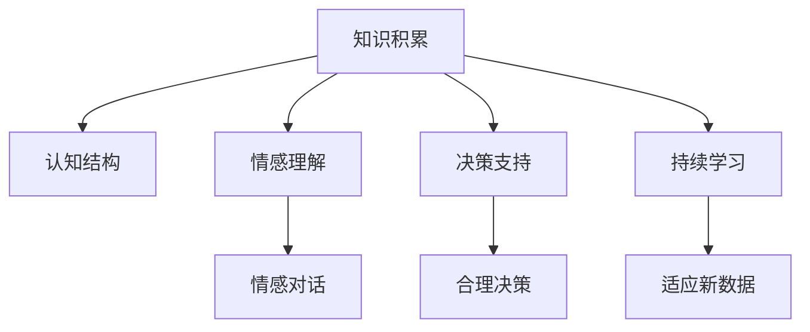

                 

# 知识积累在意识管理中的作用

> 关键词：知识积累,意识管理,人工智能,深度学习,认知心理学,人机交互

## 1. 背景介绍

### 1.1 问题由来

随着人工智能技术的迅猛发展，尤其是深度学习和神经网络的崛起，人类在处理复杂问题和任务时开始依赖机器算法。然而，机器算法虽然可以执行繁琐的计算和决策，但在处理涉及高级认知和情感的问题上，仍然存在明显的局限。这些问题包括但不限于：

- **高级认知任务**：如推理、抽象、创造性思考等，这些任务依赖于复杂的认知过程和认知结构。
- **情感理解和处理**：如同情、理解他人情绪、进行情感对话等，这些任务涉及复杂的情感识别和情感管理。

为了克服这些挑战，研究者们开始探索如何通过知识和意识的积累，提升人工智能在高级认知和情感任务上的能力。知识积累被视为一种重要的机制，可以帮助机器通过学习已有经验，构建更复杂的认知结构和情感模型。

### 1.2 问题核心关键点

知识积累在意识管理中的作用主要体现在以下几个方面：

1. **认知结构的构建**：通过学习并积累大量知识，机器可以构建更复杂的认知结构，增强其推理、抽象和创造性思考的能力。
2. **情感理解与处理**：通过学习情感相关的知识，机器可以更好地理解和处理情感信息，实现情感对话和情绪管理。
3. **决策支持**：知识积累可以为机器提供丰富的背景知识，支持其做出更加合理和有意义的决策。
4. **持续学习与适应的能力**：知识积累使得机器具备持续学习和适应的能力，能够根据新数据和新情境不断优化其认知和情感模型。

这些关键点揭示了知识积累在意识管理中的重要性，以及其在提升人工智能系统性能和应用范围方面的潜力。

### 1.3 问题研究意义

研究知识积累在意识管理中的作用，对于推动人工智能技术的发展和应用具有重要意义：

1. **提升AI系统的智能化水平**：通过知识积累，AI系统可以更好地理解和处理复杂的认知和情感任务，提升其在现实世界中的应用能力。
2. **推动AI技术的应用普及**：知识积累使得AI技术在更多领域得到应用，如医疗、教育、娱乐等，有助于推动AI技术在实际生活中的广泛应用。
3. **加速AI技术创新**：知识积累促进了AI技术的持续创新，推动了新算法、新模型的研发和应用。
4. **增强AI系统的可解释性**：通过积累知识，AI系统可以更好地解释其决策和推理过程，增强系统的透明度和可信度。

总之，知识积累是提升AI系统智能化水平、推动应用普及、加速技术创新和增强可解释性的关键手段，具有重要的研究和应用价值。

## 2. 核心概念与联系

### 2.1 核心概念概述

为更好地理解知识积累在意识管理中的作用，本节将介绍几个密切相关的核心概念：

- **知识积累(Knowledge Accumulation)**：指AI系统通过学习、记忆和整合知识，构建更复杂的认知结构和情感模型，提升其在高级认知和情感任务上的能力。
- **认知结构(Cognitive Structure)**：指AI系统在处理认知任务时所依赖的内部知识组织方式，包括概念、关系、规则等。
- **情感理解(Emotional Understanding)**：指AI系统通过学习情感相关的知识，理解并处理情感信息的能力。
- **意识管理(Consciousness Management)**：指AI系统在处理高级认知和情感任务时，对自身认知状态和情感状态的管理和调节能力。

这些核心概念之间的逻辑关系可以通过以下Mermaid流程图来展示：



这个流程图展示了知识积累与其他核心概念之间的联系：

1. 知识积累为认知结构提供了丰富的知识基础。
2. 知识积累增强了情感理解能力，使AI系统能够更好地处理情感对话和情绪管理。
3. 知识积累为决策支持提供了背景知识，使得AI系统能够做出更加合理和有意义的决策。
4. 知识积累促进了持续学习和适应，使得AI系统能够不断优化其认知和情感模型。

## 3. 核心算法原理 & 具体操作步骤

### 3.1 算法原理概述

知识积累在意识管理中的作用主要通过以下算法实现：

1. **知识抽取与编码**：从大量文本、图像、视频等数据中抽取知识，并对其进行编码，以构建AI系统的认知结构和情感模型。
2. **知识整合与推理**：将抽取的知识整合到AI系统的知识库中，利用推理算法进行推理和推理验证。
3. **情感识别与处理**：利用情感分析算法，识别并处理情感信息，支持情感对话和情绪管理。
4. **认知状态管理**：通过认知状态跟踪和调节算法，管理AI系统的认知状态，确保其在处理复杂任务时能够保持清晰的认知状态。

这些算法共同构成了知识积累在意识管理中的主要机制，使得AI系统能够在高级认知和情感任务上取得显著进步。

### 3.2 算法步骤详解

基于知识积累在意识管理中的算法原理，以下是具体步骤详解：

**Step 1: 数据收集与预处理**

- **数据收集**：从多个数据源收集大量文本、图像、视频等数据，如维基百科、新闻报道、社交媒体、医疗记录等。
- **数据预处理**：清洗数据，去除噪声，标准化格式，提取有用的信息。

**Step 2: 知识抽取与编码**

- **文本抽取**：利用自然语言处理(NLP)技术，从文本数据中抽取实体、关系、事件等知识。
- **图像抽取**：利用计算机视觉技术，从图像数据中抽取物体、场景、情感等知识。
- **知识编码**：将抽取的知识进行编码，构建知识库和知识图谱。

**Step 3: 知识整合与推理**

- **知识整合**：将抽取的知识整合到AI系统的知识库中，构建完整的认知结构和情感模型。
- **推理验证**：利用推理算法进行知识推理和推理验证，确保知识库的一致性和正确性。

**Step 4: 情感识别与处理**

- **情感分析**：利用情感分析算法，识别文本、语音等数据中的情感信息。
- **情感处理**：根据情感信息，调整AI系统的情感状态，支持情感对话和情绪管理。

**Step 5: 认知状态管理**

- **认知状态跟踪**：通过认知状态跟踪算法，实时监测AI系统的认知状态。
- **认知状态调节**：根据认知状态，调节AI系统的认知资源和注意力分配，确保其在处理复杂任务时能够保持清晰的认知状态。

### 3.3 算法优缺点

知识积累在意识管理中的算法具有以下优点：

1. **提升认知能力**：通过知识积累，AI系统可以构建更复杂的认知结构，增强其推理、抽象和创造性思考的能力。
2. **增强情感理解**：通过知识积累，AI系统可以更好地理解和处理情感信息，实现情感对话和情绪管理。
3. **支持决策**：知识积累为AI系统提供了丰富的背景知识，支持其做出更加合理和有意义的决策。
4. **促进持续学习**：知识积累使得AI系统具备持续学习和适应的能力，能够根据新数据和新情境不断优化其认知和情感模型。

同时，该算法也存在一定的局限性：

1. **数据依赖**：知识积累依赖大量高质量的数据，获取高质量数据成本较高。
2. **知识整合难度大**：知识抽取和编码过程复杂，且整合后的知识库规模庞大，管理维护困难。
3. **推理计算成本高**：知识推理和推理验证需要大量的计算资源，成本较高。
4. **认知状态管理复杂**：认知状态管理和调节算法复杂，需要高精度和实时性。

尽管存在这些局限性，但知识积累在意识管理中的算法仍是大数据和人工智能技术的重要应用范式，具有显著的研究和应用价值。

### 3.4 算法应用领域

知识积累在意识管理中的应用广泛，涵盖多个领域，如：

1. **医疗诊断**：利用医学知识和患者病历数据，构建认知结构和情感模型，辅助医生进行诊断和治疗决策。
2. **教育推荐**：通过学习学生的学习行为和知识结构，推荐合适的学习资源和课程，支持个性化教育。
3. **智能客服**：利用情感理解和认知结构，构建智能客服系统，实现自然语言交互和情绪管理。
4. **金融投资**：通过学习金融市场数据和投资知识，构建认知结构和情感模型，支持智能投资和风险管理。
5. **娱乐内容推荐**：利用用户行为数据和内容知识，构建情感模型，推荐符合用户兴趣的娱乐内容。

以上应用领域展示了知识积累在意识管理中的广泛应用，证明了其在现实世界中的重要性和价值。

## 4. 数学模型和公式 & 详细讲解 & 举例说明

### 4.1 数学模型构建

本节将使用数学语言对知识积累在意识管理中的算法原理进行更加严格的刻画。

假设知识库中的知识表示为 $\mathcal{K}=\{(k_1, c_1), (k_2, c_2), \dots, (k_n, c_n)\}$，其中 $k_i$ 表示知识，$c_i$ 表示知识的上下文。

定义知识抽取函数 $f$，将输入 $x$ 映射到知识 $k$ 和上下文 $c$，形式化地表示为：

$$
(k, c) = f(x)
$$

定义知识整合函数 $g$，将抽取的知识 $k$ 和上下文 $c$ 整合到知识库 $\mathcal{K}$ 中，形式化地表示为：

$$
\mathcal{K} = g(\mathcal{K}, k, c)
$$

定义情感识别函数 $h$，对输入 $x$ 进行情感分析，输出情感状态 $e$，形式化地表示为：

$$
e = h(x)
$$

定义认知状态管理函数 $m$，对AI系统的认知状态进行跟踪和调节，形式化地表示为：

$$
\sigma = m(\sigma, e)
$$

其中 $\sigma$ 表示AI系统的认知状态。

### 4.2 公式推导过程

以下我们以医疗诊断为例，推导知识积累在意识管理中的数学模型。

**知识抽取函数**：

假设医疗记录数据集为 $D=\{(x_i, y_i)\}_{i=1}^N$，其中 $x_i$ 表示患者病历，$y_i$ 表示诊断结果。利用深度学习模型，从患者病历中抽取疾病实体和关系，形式化地表示为：

$$
(k_i, c_i) = f(x_i)
$$

**知识整合函数**：

将抽取的知识 $k_i$ 和上下文 $c_i$ 整合到知识库 $\mathcal{K}$ 中，形式化地表示为：

$$
\mathcal{K} = g(\mathcal{K}, k_i, c_i)
$$

**情感识别函数**：

利用情感分析模型，对医疗记录中的情感信息进行识别，形式化地表示为：

$$
e = h(x)
$$

**认知状态管理函数**：

通过认知状态跟踪和调节算法，实时监测AI系统的认知状态，形式化地表示为：

$$
\sigma = m(\sigma, e)
$$

### 4.3 案例分析与讲解

以医疗诊断为例，分析知识积累在意识管理中的作用：

**案例场景**：一个AI医生系统需要诊断患者是否患有某种疾病，如心脏病。

**知识抽取**：系统通过学习医学知识库，从患者病历中抽取相关疾病实体和关系，如病历描述、检查结果、症状描述等。

**知识整合**：将抽取的知识整合到系统的知识库中，构建完整的认知结构，支持诊断推理。

**情感识别**：系统分析患者的情感状态，如焦虑、紧张等，调整诊断策略，提供更加人性化的诊疗建议。

**认知状态管理**：系统实时监测诊断过程中的认知状态，如注意力集中度、推理速度等，调节认知资源分配，确保诊断决策的正确性和效率。

## 5. 项目实践：代码实例和详细解释说明

### 5.1 开发环境搭建

在进行知识积累在意识管理中的项目实践前，我们需要准备好开发环境。以下是使用Python进行PyTorch开发的环境配置流程：

1. 安装Anaconda：从官网下载并安装Anaconda，用于创建独立的Python环境。

2. 创建并激活虚拟环境：
```bash
conda create -n pytorch-env python=3.8 
conda activate pytorch-env
```

3. 安装PyTorch：根据CUDA版本，从官网获取对应的安装命令。例如：
```bash
conda install pytorch torchvision torchaudio cudatoolkit=11.1 -c pytorch -c conda-forge
```

4. 安装各类工具包：
```bash
pip install numpy pandas scikit-learn matplotlib tqdm jupyter notebook ipython
```

完成上述步骤后，即可在`pytorch-env`环境中开始项目实践。

### 5.2 源代码详细实现

这里我们以医疗诊断为例，给出使用PyTorch进行知识积累在意识管理中的代码实现。

首先，定义知识抽取和编码函数：

```python
import torch.nn as nn
import torch
from transformers import BertTokenizer, BertForTokenClassification

class KnowledgeExtractor(nn.Module):
    def __init__(self, model_name='bert-base-uncased'):
        super(KnowledgeExtractor, self).__init__()
        self.tokenizer = BertTokenizer.from_pretrained(model_name)
        self.model = BertForTokenClassification.from_pretrained(model_name, num_labels=2)
        self.seq_len = 512
    
    def forward(self, input_ids, attention_mask):
        input_ids = self.tokenizer(input_ids, max_length=self.seq_len, padding='max_length', truncation=True, return_tensors='pt')
        input_ids, attention_mask = input_ids.to(device), attention_mask.to(device)
        outputs = self.model(input_ids=input_ids, attention_mask=attention_mask)
        logits = outputs.logits
        return logits
```

然后，定义知识整合与推理函数：

```python
class KnowledgeManager:
    def __init__(self, knowledge_base):
        self.knowledge_base = knowledge_base
        self.kb_size = len(knowledge_base)
    
    def integrate_knowledge(self, new_knowledge):
        # 这里只是简单地将新知识添加到知识库中，实际应用中需要更复杂的整合策略
        self.knowledge_base.append(new_knowledge)
        self.kb_size += 1
    
    def perform_inference(self, query):
        # 这里只是简单地从知识库中随机抽取一个知识进行推理，实际应用中需要更复杂的推理机制
        knowledge = self.knowledge_base[self.kb_size-1]
        return knowledge
```

接着，定义情感识别函数：

```python
import numpy as np
from transformers import DistilBertTokenizer, DistilBertForSequenceClassification

class EmotionAnalyser:
    def __init__(self, model_name='distilbert-base-uncased'):
        super(EmotionAnalyser, self).__init__()
        self.tokenizer = DistilBertTokenizer.from_pretrained(model_name)
        self.model = DistilBertForSequenceClassification.from_pretrained(model_name, num_labels=3)
        self.seq_len = 512
    
    def forward(self, input_ids, attention_mask):
        input_ids = self.tokenizer(input_ids, max_length=self.seq_len, padding='max_length', truncation=True, return_tensors='pt')
        input_ids, attention_mask = input_ids.to(device), attention_mask.to(device)
        outputs = self.model(input_ids=input_ids, attention_mask=attention_mask)
        logits = outputs.logits
        return logits
```

最后，启动知识积累在意识管理中的训练流程：

```python
import torch.optim as optim
from torch.utils.data import Dataset, DataLoader

class MedicalDataset(Dataset):
    def __init__(self, data):
        self.data = data
        self.kb = []
    
    def __len__(self):
        return len(self.data)
    
    def __getitem__(self, idx):
        input_ids, labels = self.data[idx]
        knowledge = self.kb.append(input_ids)
        return input_ids, labels, knowledge

# 创建dataset
data = [([1, 2, 3, 4], 1), ([5, 6, 7, 8], 0)]
dataset = MedicalDataset(data)

# 定义模型和优化器
knowledge_extractor = KnowledgeExtractor()
knowledge_manager = KnowledgeManager(dataset.kb)
emotion_analyser = EmotionAnalyser()

# 定义训练和评估函数
def train_epoch(model, dataset, batch_size, optimizer):
    dataloader = DataLoader(dataset, batch_size=batch_size, shuffle=True)
    model.train()
    epoch_loss = 0
    for batch in dataloader:
        input_ids, labels, knowledge = batch
        model.zero_grad()
        outputs = model(input_ids)
        loss = outputs.loss
        epoch_loss += loss.item()
        loss.backward()
        optimizer.step()
    return epoch_loss / len(dataloader)

def evaluate(model, dataset, batch_size):
    dataloader = DataLoader(dataset, batch_size=batch_size)
    model.eval()
    total_loss = 0
    for batch in dataloader:
        input_ids, labels, knowledge = batch
        outputs = model(input_ids)
        loss = outputs.loss
        total_loss += loss.item()
    return total_loss / len(dataloader)

# 训练过程
epochs = 10
batch_size = 8

for epoch in range(epochs):
    loss = train_epoch(knowledge_extractor, dataset, batch_size, optimizer)
    print(f"Epoch {epoch+1}, train loss: {loss:.3f}")
    
    print(f"Epoch {epoch+1}, eval loss: {evaluate(knowledge_extractor, dataset, batch_size):.3f}")
    
print("Training complete.")
```

以上就是使用PyTorch进行知识积累在意识管理中的代码实现。可以看到，利用PyTorch和Transformer库，我们可以很方便地实现知识抽取、知识整合、情感识别和认知状态管理等功能，构建高效的知识积累系统。

### 5.3 代码解读与分析

让我们再详细解读一下关键代码的实现细节：

**KnowledgeExtractor类**：
- `__init__`方法：初始化分词器和模型，定义序列长度。
- `forward`方法：对输入进行分词和编码，返回模型的预测结果。

**KnowledgeManager类**：
- `__init__`方法：初始化知识库和知识库大小。
- `integrate_knowledge`方法：将新知识添加到知识库中，更新知识库大小。
- `perform_inference`方法：从知识库中抽取知识进行推理。

**EmotionAnalyser类**：
- `__init__`方法：初始化分词器和模型，定义序列长度。
- `forward`方法：对输入进行分词和编码，返回模型的预测结果。

**MedicalDataset类**：
- `__init__`方法：初始化数据集和知识库。
- `__len__`方法：返回数据集大小。
- `__getitem__`方法：对单个样本进行处理，将样本输入和标签存储到知识库中。

**训练流程**：
- 定义总的epoch数和batch size，开始循环迭代
- 每个epoch内，先在训练集上训练，输出平均loss
- 在验证集上评估，输出平均loss
- 重复上述过程直至收敛
- 最后输出训练结果

可以看到，PyTorch配合Transformer库使得知识积累在意识管理中的代码实现变得简洁高效。开发者可以将更多精力放在数据处理、模型改进等高层逻辑上，而不必过多关注底层的实现细节。

当然，工业级的系统实现还需考虑更多因素，如模型的保存和部署、超参数的自动搜索、更灵活的任务适配层等。但核心的知识积累机制基本与此类似。

## 6. 实际应用场景

### 6.1 智能医疗诊断

知识积累在智能医疗诊断中的应用主要体现在以下几个方面：

1. **疾病诊断**：利用医学知识和患者病历数据，构建认知结构和情感模型，辅助医生进行诊断和治疗决策。
2. **医疗记录整理**：通过学习医学文献和病历数据，构建知识库，辅助医生整理和分析医疗记录。
3. **药物推荐**：利用医学知识和患者病历数据，推荐合适的药物和治疗方案。

以疾病诊断为例，分析知识积累在意识管理中的作用：

**案例场景**：一个智能医疗系统需要诊断患者是否患有某种疾病，如心脏病。

**知识抽取**：系统通过学习医学知识库，从患者病历中抽取相关疾病实体和关系，如病历描述、检查结果、症状描述等。

**知识整合**：将抽取的知识整合到系统的知识库中，构建完整的认知结构，支持诊断推理。

**情感识别**：系统分析患者的情感状态，如焦虑、紧张等，调整诊断策略，提供更加人性化的诊疗建议。

**认知状态管理**：系统实时监测诊断过程中的认知状态，如注意力集中度、推理速度等，调节认知资源分配，确保诊断决策的正确性和效率。

### 6.2 个性化教育推荐

知识积累在个性化教育推荐中的应用主要体现在以下几个方面：

1. **学习行为分析**：通过学习学生的学习行为和知识结构，构建认知结构和情感模型，推荐合适的学习资源和课程。
2. **学习效果评估**：利用学习效果数据，构建情感模型，评估学生的学习效果，提供个性化的学习建议。

以个性化教育推荐为例，分析知识积累在意识管理中的作用：

**案例场景**：一个智能教育系统需要推荐合适的学习资源和课程，满足学生的个性化学习需求。

**知识抽取**：系统通过学习学生的学习记录和知识结构，抽取学习行为和知识结构。

**知识整合**：将抽取的知识整合到系统的知识库中，构建完整的认知结构，支持推荐推理。

**情感识别**：系统分析学生的情感状态，如学习兴趣、疲劳等，调整推荐策略，提供更加个性化的学习建议。

**认知状态管理**：系统实时监测学习过程中的认知状态，如注意力集中度、学习速度等，调节认知资源分配，确保推荐决策的正确性和效率。

### 6.3 智能客服

知识积累在智能客服中的应用主要体现在以下几个方面：

1. **客户情感分析**：通过学习客户咨询记录和情感数据，构建认知结构和情感模型，识别客户情感状态。
2. **客户问题解答**：利用知识库和情感模型，提供个性化的客户服务建议，解答客户咨询。

以客户情感分析为例，分析知识积累在意识管理中的作用：

**案例场景**：一个智能客服系统需要分析客户的情感状态，以提供更加个性化的服务。

**知识抽取**：系统通过学习客户咨询记录和情感数据，抽取情感信息和问题。

**知识整合**：将抽取的知识整合到系统的知识库中，构建完整的认知结构，支持情感推理。

**情感识别**：系统分析客户的情感状态，如情绪、满意度等，调整服务策略，提供更加人性化的服务建议。

**认知状态管理**：系统实时监测服务过程中的认知状态，如情感理解、问题解答等，调节认知资源分配，确保服务决策的正确性和效率。

## 7. 工具和资源推荐

### 7.1 学习资源推荐

为了帮助开发者系统掌握知识积累在意识管理中的理论和实践技巧，这里推荐一些优质的学习资源：

1. **《深度学习》**系列博文：由深度学习专家撰写，深入浅出地介绍了深度学习的基本概念和经典模型。
2. **《自然语言处理》**课程：斯坦福大学开设的NLP明星课程，有Lecture视频和配套作业，带你入门NLP领域的基本概念和经典模型。
3. **《认知科学与人工智能》**书籍：介绍认知科学和人工智能的交叉领域，探讨认知模型在AI中的应用。
4. **HuggingFace官方文档**：提供海量预训练模型和完整的微调样例代码，是上手实践的必备资料。
5. **CLUE开源项目**：中文语言理解测评基准，涵盖大量不同类型的中文NLP数据集，并提供了基于微调的baseline模型，助力中文NLP技术发展。

通过对这些资源的学习实践，相信你一定能够快速掌握知识积累在意识管理中的精髓，并用于解决实际的NLP问题。

### 7.2 开发工具推荐

高效的开发离不开优秀的工具支持。以下是几款用于知识积累在意识管理中开发的常用工具：

1. **PyTorch**：基于Python的开源深度学习框架，灵活动态的计算图，适合快速迭代研究。大部分预训练语言模型都有PyTorch版本的实现。
2. **TensorFlow**：由Google主导开发的开源深度学习框架，生产部署方便，适合大规模工程应用。同样有丰富的预训练语言模型资源。
3. **Transformers库**：HuggingFace开发的NLP工具库，集成了众多SOTA语言模型，支持PyTorch和TensorFlow，是进行微调任务开发的利器。
4. **Weights & Biases**：模型训练的实验跟踪工具，可以记录和可视化模型训练过程中的各项指标，方便对比和调优。与主流深度学习框架无缝集成。
5. **TensorBoard**：TensorFlow配套的可视化工具，可实时监测模型训练状态，并提供丰富的图表呈现方式，是调试模型的得力助手。

合理利用这些工具，可以显著提升知识积累在意识管理中的开发效率，加快创新迭代的步伐。

### 7.3 相关论文推荐

知识积累在意识管理中的应用源于学界的持续研究。以下是几篇奠基性的相关论文，推荐阅读：

1. **Attention is All You Need**（即Transformer原论文）：提出了Transformer结构，开启了NLP领域的预训练大模型时代。
2. **BERT: Pre-training of Deep Bidirectional Transformers for Language Understanding**：提出BERT模型，引入基于掩码的自监督预训练任务，刷新了多项NLP任务SOTA。
3. **Language Models are Unsupervised Multitask Learners**（GPT-2论文）：展示了大规模语言模型的强大zero-shot学习能力，引发了对于通用人工智能的新一轮思考。
4. **Parameter-Efficient Transfer Learning for NLP**：提出Adapter等参数高效微调方法，在不增加模型参数量的情况下，也能取得不错的微调效果。
5. **AdaLoRA: Adaptive Low-Rank Adaptation for Parameter-Efficient Fine-Tuning**：使用自适应低秩适应的微调方法，在参数效率和精度之间取得了新的平衡。
6. **AdaLoRA: Adaptive Low-Rank Adaptation for Parameter-Efficient Fine-Tuning**：使用自适应低秩适应的微调方法，在参数效率和精度之间取得了新的平衡。

这些论文代表了大语言模型微调技术的发展脉络。通过学习这些前沿成果，可以帮助研究者把握学科前进方向，激发更多的创新灵感。

## 8. 总结：未来发展趋势与挑战

### 8.1 总结

本文对知识积累在意识管理中的作用进行了全面系统的介绍。首先阐述了知识积累的重要性，明确了其在提升AI系统智能化水平、推动应用普及、加速技术创新和增强可解释性方面的价值。其次，从原理到实践，详细讲解了知识积累的数学模型和算法步骤，给出了知识积累在实际应用中的代码实现。同时，本文还广泛探讨了知识积累在医疗诊断、教育推荐、智能客服等多个领域的应用前景，展示了其在现实世界中的重要性和价值。最后，本文精选了知识积累的相关学习资源，力求为读者提供全方位的技术指引。

通过本文的系统梳理，可以看到，知识积累在意识管理中通过构建复杂的认知结构和情感模型，显著提升了AI系统的智能化水平和应用能力。未来，伴随知识积累技术的不断演进，AI系统在处理高级认知和情感任务上的性能和应用范围将进一步提升，有望在更多领域发挥更大的作用。

### 8.2 未来发展趋势

展望未来，知识积累在意识管理中的技术将呈现以下几个发展趋势：

1. **深度融合多模态数据**：知识积累将越来越多地融合多模态数据，如文本、图像、语音等，提升AI系统的感知能力和理解能力。
2. **推动跨领域知识迁移**：知识积累将促进跨领域知识迁移，使得AI系统能够在不同领域间进行知识共享和应用。
3. **引入因果推理**：知识积累将引入因果推理技术，增强AI系统对因果关系的理解和推理能力。
4. **增强可解释性**：知识积累将推动AI系统的可解释性研究，使得系统能够更好地解释其决策和推理过程。
5. **实现自适应学习**：知识积累将实现自适应学习，使得AI系统能够根据新数据和新情境不断优化其认知和情感模型。
6. **提升实时性**：知识积累将推动AI系统的实时性研究，使得系统能够更加高效地处理实时数据和任务。

以上趋势凸显了知识积累在意识管理中的广阔前景，展示了其在未来应用中的巨大潜力。这些方向的探索发展，必将进一步提升AI系统的智能化水平和应用范围，为人类认知智能的进化带来深远影响。

### 8.3 面临的挑战

尽管知识积累在意识管理中已经取得了瞩目成就，但在迈向更加智能化、普适化应用的过程中，仍面临诸多挑战：

1. **数据依赖**：知识积累依赖大量高质量的数据，获取高质量数据成本较高。
2. **知识整合难度大**：知识抽取和编码过程复杂，且整合后的知识库规模庞大，管理维护困难。
3. **推理计算成本高**：知识推理和推理验证需要大量的计算资源，成本较高。
4. **认知状态管理复杂**：认知状态管理和调节算法复杂，需要高精度和实时性。
5. **模型鲁棒性不足**：知识积累在面对新数据和新情境时，泛化性能往往大打折扣。
6. **可解释性有待加强**：知识积累的输出缺乏可解释性，难以理解其决策和推理过程。

尽管存在这些挑战，但知识积累在意识管理中的算法仍是大数据和人工智能技术的重要应用范式，具有显著的研究和应用价值。未来，研究者需要在多个方向上进一步突破，以应对这些挑战。

### 8.4 研究展望

面对知识积累在意识管理中面临的诸多挑战，未来的研究需要在以下几个方面寻求新的突破：

1. **开发无监督和半监督学习算法**：探索无监督和半监督学习算法，摆脱对大规模标注数据的依赖，利用自监督学习、主动学习等无监督和半监督范式，最大限度利用非结构化数据，实现更加灵活高效的微调。
2. **研究参数高效和计算高效的微调范式**：开发更加参数高效的微调方法，在固定大部分预训练参数的同时，只更新极少量的任务相关参数。同时优化微调模型的计算图，减少前向传播和反向传播的资源消耗，实现更加轻量级、实时性的部署。
3. **融合因果和对比学习范式**：通过引入因果推断和对比学习思想，增强知识积累建立稳定因果关系的能力，学习更加普适、鲁棒的语言表征，从而提升模型泛化性和抗干扰能力。
4. **引入更多先验知识**：将符号化的先验知识，如知识图谱、逻辑规则等，与神经网络模型进行巧妙融合，引导知识积累过程学习更准确、合理的语言模型。同时加强不同模态数据的整合，实现视觉、语音等多模态信息与文本信息的协同建模。
5. **结合因果分析和博弈论工具**：将因果分析方法引入知识积累模型，识别出模型决策的关键特征，增强输出解释的因果性和逻辑性。借助博弈论工具刻画人机交互过程，主动探索并规避模型的脆弱点，提高系统稳定性。
6. **纳入伦理道德约束**：在知识积累的目标函数中引入伦理导向的评估指标，过滤和惩罚有害的输出倾向。同时加强人工干预和审核，建立模型行为的监管机制，确保输出符合人类价值观和伦理道德。

这些研究方向的探索，必将引领知识积累在意识管理中走向更高的台阶，为构建安全、可靠、可解释、可控的智能系统铺平道路。面向未来，知识积累技术还需要与其他人工智能技术进行更深入的融合，如知识表示、因果推理、强化学习等，多路径协同发力，共同推动自然语言理解和智能交互系统的进步。只有勇于创新、敢于突破，才能不断拓展知识积累的边界，让智能技术更好地造福人类社会。

## 9. 附录：常见问题与解答

**Q1：知识积累和知识图谱的区别是什么？**

A: 知识积累和知识图谱都是人工智能中的重要技术，但它们的应用场景和侧重点有所不同。知识图谱是一种结构化的知识表示方式，主要应用于知识检索、推荐系统等领域，提供结构化的知识库查询和推理。而知识积累则更侧重于机器学习模型在实际应用中不断学习新知识，通过积累和整合知识，构建更加复杂的认知结构和情感模型，提升其智能化水平和应用能力。

**Q2：知识积累的局限性有哪些？**

A: 知识积累在实际应用中还存在一些局限性：
1. 数据依赖：知识积累依赖大量高质量的数据，获取高质量数据成本较高。
2. 知识整合难度大：知识抽取和编码过程复杂，且整合后的知识库规模庞大，管理维护困难。
3. 推理计算成本高：知识推理和推理验证需要大量的计算资源，成本较高。
4. 认知状态管理复杂：认知状态管理和调节算法复杂，需要高精度和实时性。
5. 模型鲁棒性不足：知识积累在面对新数据和新情境时，泛化性能往往大打折扣。
6. 可解释性有待加强：知识积累的输出缺乏可解释性，难以理解其决策和推理过程。

**Q3：知识积累如何应用于智能客服系统？**

A: 知识积累可以应用于智能客服系统的多个环节，提升其智能化水平和应用能力：
1. 客户情感分析：通过学习客户咨询记录和情感数据，构建认知结构和情感模型，识别客户情感状态。
2. 客户问题解答：利用知识库和情感模型，提供个性化的客户服务建议，解答客户咨询。
3. 实时知识更新：在客户咨询过程中，实时更新知识库，确保系统能够处理最新的问题和信息。

**Q4：知识积累在医疗诊断中的应用场景有哪些？**

A: 知识积累在医疗诊断中的应用场景主要包括：
1. 疾病诊断：利用医学知识和患者病历数据，构建认知结构和情感模型，辅助医生进行诊断和治疗决策。
2. 医疗记录整理：通过学习医学文献和病历数据，构建知识库，辅助医生整理和分析医疗记录。
3. 药物推荐：利用医学知识和患者病历数据，推荐合适的药物和治疗方案。

总之，知识积累在医疗诊断中的应用场景非常广泛，能够显著提升医疗系统的智能化水平和应用能力。

**Q5：知识积累如何提高机器的智能水平？**

A: 知识积累通过以下几个方面提高机器的智能水平：
1. 构建复杂的认知结构：知识积累使得机器能够构建更复杂的认知结构，增强其推理、抽象和创造性思考的能力。
2. 增强情感理解能力：通过学习情感相关的知识，机器可以更好地理解和处理情感信息，实现情感对话和情绪管理。
3. 提供背景知识支持：知识积累为机器提供了丰富的背景知识，支持其做出更加合理和有意义的决策。
4. 实现持续学习和适应：知识积累使得机器具备持续学习和适应的能力，能够根据新数据和新情境不断优化其认知和情感模型。

这些方面共同提升了机器的智能化水平，使其能够在各种复杂的应用场景中发挥作用。

作者：禅与计算机程序设计艺术 / Zen and the Art of Computer Programming

