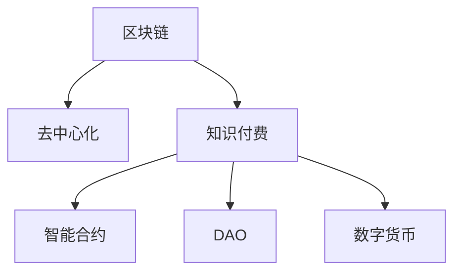

                 

# 知识经济下知识付费的区块链去中心化应用场景

> 关键词：知识付费,区块链,去中心化,应用场景,技术原理,经济模型

## 1. 背景介绍

### 1.1 问题由来

在知识经济时代，知识的价值日益凸显。过去，知识和信息往往被视为公开资源，免费共享。但随着知识产出者日益增多，信息过载问题也愈加严重。知识的筛选、整理和传播变得尤为关键，用户难以在海量信息中获取有价值的知识。

为了解决这一问题，知识付费平台应运而生。通过会员制订阅、单次购买等方式，知识付费平台为消费者提供了筛选和整理好的高质量内容，降低了知识获取的门槛。例如，得到、新东方在线等平台已经成为知识付费领域的重要代表。

然而，现有知识付费平台存在诸多问题：
- 内容版权问题：知识付费平台依赖大量知识创作者，但创作者与平台之间的利益分配存在纠纷。
- 中心化风险：平台运营依赖中心化的服务器和数据库，存在数据泄露、平台跑路等风险。
- 内容质量问题：知识创作者数量众多，内容质量参差不齐，难以保证用户的获取效果。

这些问题阻碍了知识付费平台的可持续发展。随着区块链技术的兴起，如何利用其去中心化特性，解决上述问题，成为了一个重要研究方向。

## 2. 核心概念与联系

### 2.1 核心概念概述

为更好地理解区块链技术在知识付费平台中的应用，本节将介绍几个密切相关的核心概念：

- 区块链(Blockchain)：一种分布式数据库技术，通过去中心化的方式记录交易和数据，保证数据的不可篡改性和透明性。

- 去中心化(Decentralization)：指数据的存储和运算不再依赖于单个中心化的服务器，而是通过分布式网络协同工作。

- 知识付费(Knowledge Monetization)：指将知识资源通过付费方式提供给消费者，确保知识创作者和平台收益，提升知识获取效果的过程。

- 智能合约(Smart Contract)：一种自动化执行的合约，通过区块链的自动执行机制，确保合约条款的公平、透明、不可篡改。

- 去中心化自治组织(DAO)：通过区块链技术实现的去中心化组织，由成员共同管理决策，实现民主化治理。

- 数字货币(CryptoCurrency)：基于区块链技术的数字货币，具有去中心化、匿名性等特点，可用于知识付费平台的交易结算。

这些核心概念之间的逻辑关系可以通过以下Mermaid流程图来展示：



这个流程图展示了大语言模型的核心概念及其之间的关系：

1. 区块链通过去中心化记录交易数据，确保数据的透明和不可篡改。
2. 知识付费通过区块链技术，确保创作者和平台的利益分配，提升内容质量。
3. 智能合约实现合约条款的自动化执行，确保交易的公平性和透明性。
4. DAO通过区块链实现成员自治管理，提升组织决策的民主化。
5. 数字货币提供安全的交易结算方式，保障平台运营的持续性。

这些概念共同构成了知识付费平台的去中心化框架，使得平台运营更加透明、安全、高效。

## 3. 核心算法原理 & 具体操作步骤
### 3.1 算法原理概述

知识付费平台的去中心化应用场景，核心在于利用区块链的不可篡改和去中心化特性，实现知识创作者、平台、消费者三方的利益平衡。

具体来说，通过区块链记录知识内容的交易记录、版权信息、创作者收益等数据，确保其不可篡改和透明性。智能合约自动执行合约条款，确保交易的公平性和透明性。DAO通过区块链实现成员自治管理，确保平台的决策民主化和公平性。数字货币提供安全的交易结算方式，确保平台运营的持续性。

### 3.2 算法步骤详解

基于区块链的去中心化知识付费平台主要包括以下几个关键步骤：

**Step 1: 设计智能合约**

智能合约是去中心化知识付费平台的基础，用于记录和执行知识内容交易、版权信息、创作者收益等数据。设计智能合约时，需考虑以下要素：
- 交易记录：记录知识内容的购买、销售、租赁等交易信息。
- 版权信息：记录知识内容的版权归属、授权期限等信息。
- 创作者收益：记录创作者对知识内容的收益分配规则。

**Step 2: 构建区块链网络**

构建区块链网络，包括搭建分布式节点、设计共识算法等。例如，以太坊、EOS等公有链可以提供完善的分布式网络支持。

**Step 3: 设计数字货币**

设计一种数字货币作为平台内的交易结算方式。数字货币需满足以下条件：
- 安全性：保证交易的安全性和不可篡改性。
- 可扩展性：支持大规模交易和扩展。
- 易用性：易于创建、持有、交易。

**Step 4: 开发知识付费应用**

基于智能合约、区块链网络和数字货币，开发知识付费平台的应用程序。应用程序需具备以下功能：
- 知识内容的发布、购买、租赁等交易功能。
- 创作者收益的分配和兑付。
- 用户交易记录的查询和验证。

**Step 5: 建立DAO自治组织**

通过区块链技术，构建DAO自治组织，由知识创作者、平台和消费者共同管理决策。DAO需具备以下功能：
- 成员管理：成员的加入、退出、投票等。
- 平台决策：平台的运营策略、规则制定等。
- 创作者权益：创作者的收益分配、版权保护等。

**Step 6: 测试和部署**

对智能合约、区块链网络、知识付费应用和DAO进行测试，确保其稳定性和安全性。部署到实际环境中，开始运营。

### 3.3 算法优缺点

区块链去中心化知识付费平台具有以下优点：
1. 透明公平：区块链的不可篡改特性，确保交易记录和创作者收益的透明公平。
2. 可信任性：去中心化的分布式网络，避免中心化运营带来的风险。
3. 自治管理：DAO实现民主化治理，提升平台决策的公平性和参与度。
4. 可扩展性：区块链技术可支持大规模交易和扩展，保障平台发展的可持续性。

同时，该平台也存在以下局限性：
1. 技术复杂：区块链技术复杂，开发和部署难度较大。
2. 交易成本：区块链交易需要支付手续费，增加运营成本。
3. 可扩展性：区块链网络当前扩展性有限，难以支持大规模应用。
4. 数据隐私：尽管交易数据透明，但用户的个人信息和行为数据仍需保护。
5. 法律监管：区块链去中心化特性带来法律监管上的挑战。

尽管存在这些局限性，但就目前而言，基于区块链的去中心化知识付费平台仍是大势所趋，具有广阔的应用前景。

### 3.4 算法应用领域

基于区块链的去中心化知识付费平台，在知识付费领域具有广阔的应用前景，主要包括以下几个方向：

1. 数字内容交易平台：基于区块链的交易记录和智能合约，实现数字内容的发布、购买、租赁等交易功能。例如，教材、电子书、专业课程等数字内容交易。

2. 知识创作者平台：通过DAO自治组织，保障创作者权益，提升创作者激励。例如，知乎、有道云笔记等创作者平台。

3. 教育学习平台：实现教育内容的付费共享和交易。例如，Khan Academy、Coursera等在线教育平台。

4. 技术咨询平台：提供技术咨询和专家支持，实现知识付费。例如，CSDN、Stack Overflow等技术交流平台。

5. 企业内部知识共享平台：实现企业内部知识资源的共享和交易。例如，Salesforce的Pardot知识共享平台。

6. 法律咨询服务平台：提供法律咨询和知识付费服务。例如，法律咨询平台Lexpat。

这些应用领域展示了区块链去中心化技术在知识付费平台的广泛应用，为知识经济的发展提供了新的可能。

## 4. 数学模型和公式 & 详细讲解
### 4.1 数学模型构建

基于区块链的去中心化知识付费平台的数学模型，可以抽象为一个交易图网络。每个节点代表知识内容，边代表交易关系。每个节点的权值表示知识内容的版权信息、创作者收益等属性。

假设知识内容为 $C_i$，交易关系为 $T_i$，版权信息为 $R_i$，创作者收益为 $P_i$。则知识付费平台的数学模型为：

$$
M = \{C_i, T_i, R_i, P_i\}
$$

其中 $C_i$ 表示知识内容集合，$T_i$ 表示交易关系集合，$R_i$ 表示版权信息集合，$P_i$ 表示创作者收益集合。

### 4.2 公式推导过程

知识付费平台的数学模型推导过程如下：
1. 定义知识内容 $C_i$：$C_i$ 为知识内容的属性，包括内容描述、关键词、作者信息等。
2. 定义交易关系 $T_i$：$T_i$ 为知识内容 $C_i$ 的交易关系，包括购买、租赁、销售等。
3. 定义版权信息 $R_i$：$R_i$ 为知识内容的版权信息，包括版权归属、授权期限等。
4. 定义创作者收益 $P_i$：$P_i$ 为创作者对知识内容的收益分配，包括创作者分成、版权费用等。

通过上述定义，知识付费平台的数学模型可以表示为：

$$
M = (C_i, T_i, R_i, P_i)
$$

### 4.3 案例分析与讲解

假设某知识付费平台上有两篇学术论文 $C_1, C_2$，作者为 $A_1, A_2$，版权归属为 $R_1, R_2$。平台设有两种交易类型：购买和租赁。平台规则规定，创作者收益为版权费用的50%。

**案例分析**：
- 知识内容 $C_1$ 的版权信息 $R_1$ 为 "ACM Press, 2020"，创作者 $A_1$ 的收益 $P_1$ 为版权费用的50%。
- 知识内容 $C_2$ 的版权信息 $R_2$ 为 "IEEE Press, 2021"，创作者 $A_2$ 的收益 $P_2$ 为版权费用的50%。
- 用户 $U_1$ 购买了 $C_1$，支付版权费用 $F_1$。
- 用户 $U_2$ 租赁了 $C_2$，支付版权费用 $F_2$。

根据上述案例，可以构建如下知识付费平台的数学模型：

$$
M = \{C_1, C_2, T_1, T_2, R_1, R_2, P_1, P_2, U_1, U_2, F_1, F_2\}
$$

其中 $T_1, T_2$ 表示交易关系，$U_1, U_2$ 表示用户信息，$F_1, F_2$ 表示版权费用。

通过该数学模型，可以清晰地表示知识付费平台的核心要素，便于对其进行分析和优化。

## 5. 项目实践：代码实例和详细解释说明
### 5.1 开发环境搭建

在进行知识付费平台的开发实践前，我们需要准备好开发环境。以下是使用Python进行Solidity开发的环境配置流程：

1. 安装Node.js：从官网下载并安装Node.js，用于运行区块链智能合约。

2. 安装Truffle Suite：从官网下载并安装Truffle Suite，用于区块链开发和测试。

3. 安装MetaMask：安装MetaMask浏览器插件，用于连接区块链网络进行交易。

完成上述步骤后，即可在本地环境中开始智能合约的开发和测试。

### 5.2 源代码详细实现

我们以区块链智能合约为例，给出使用Solidity语言进行知识付费平台开发的基本代码实现。

首先，定义智能合约的基本结构：

```solidity
pragma solidity ^0.8.0;

contract KnowledgePay {
    address public creator;
    mapping(address => uint256) public balance;
    mapping(address => uint256) public score;
    mapping(address => bool) public isPremium;
    mapping(uint256 => string) public content;
    mapping(uint256 => bool) public isPublished;
    mapping(uint256 => uint256) public royalty;
    mapping(uint256 => uint256) public royaltyRate;

    constructor() public {
        creator = msg.sender;
    }

    function publishContent(uint256 id, string memory content) public {
        require(!isPublished[id], "Content already published");
        isPublished[id] = true;
        content[id] = content;
        royalty[id] = 0;
        royaltyRate[id] = 0;
    }

    function assignRoyalty(uint256 id, uint256 royalty, uint256 royaltyRate) public {
        require(isPublished[id], "Content not published");
        royalty[id] = royalty;
        royaltyRate[id] = royaltyRate;
    }

    function buyContent(uint256 id) public payable {
        require(isPublished[id], "Content not published");
        uint256 royalty = royalty[id] * royaltyRate[id];
        require(msg.value >= royalty, "Insufficient funds");
        balance[msg.sender] += royalty;
        payable(msg.sender).transfer(royalty);
    }

    function leaseContent(uint256 id, uint256 leaseTime) public payable {
        require(isPublished[id], "Content not published");
        uint256 royalty = royalty[id] * royaltyRate[id];
        require(msg.value >= royalty, "Insufficient funds");
        balance[msg.sender] += royalty;
        payable(msg.sender).transfer(royalty);
    }
}
```

接下来，定义智能合约的交互函数：

```solidity
pragma solidity ^0.8.0;

contract KnowledgePay {
    address public creator;
    mapping(address => uint256) public balance;
    mapping(address => uint256) public score;
    mapping(address => bool) public isPremium;
    mapping(uint256 => string) public content;
    mapping(uint256 => bool) public isPublished;
    mapping(uint256 => uint256) public royalty;
    mapping(uint256 => uint256) public royaltyRate;

    constructor() public {
        creator = msg.sender;
    }

    function publishContent(uint256 id, string memory content) public {
        require(!isPublished[id], "Content already published");
        isPublished[id] = true;
        content[id] = content;
        royalty[id] = 0;
        royaltyRate[id] = 0;
    }

    function assignRoyalty(uint256 id, uint256 royalty, uint256 royaltyRate) public {
        require(isPublished[id], "Content not published");
        royalty[id] = royalty;
        royaltyRate[id] = royaltyRate;
    }

    function buyContent(uint256 id) public payable {
        require(isPublished[id], "Content not published");
        uint256 royalty = royalty[id] * royaltyRate[id];
        require(msg.value >= royalty, "Insufficient funds");
        balance[msg.sender] += royalty;
        payable(msg.sender).transfer(royalty);
    }

    function leaseContent(uint256 id, uint256 leaseTime) public payable {
        require(isPublished[id], "Content not published");
        uint256 royalty = royalty[id] * royaltyRate[id];
        require(msg.value >= royalty, "Insufficient funds");
        balance[msg.sender] += royalty;
        payable(msg.sender).transfer(royalty);
    }

    function getContent(uint256 id) public view returns (string memory) {
        return content[id];
    }

    function getBalance(address user) public view returns (uint256) {
        return balance[user];
    }

    function getScore(address user) public view returns (uint256) {
        return score[user];
    }

    function isPremium(address user) public view returns (bool) {
        return isPremium[user];
    }

    function getRoyalty(uint256 id) public view returns (uint256) {
        return royalty[id];
    }

    function getRoyaltyRate(uint256 id) public view returns (uint256) {
        return royaltyRate[id];
    }

    function withdrawRoyalty(uint256 id) public {
        require(isPublished[id], "Content not published");
        uint256 royalty = royalty[id] * royaltyRate[id];
        require(balance[msg.sender] >= royalty, "Insufficient funds");
        balance[msg.sender] -= royalty;
        payable(msg.sender).transfer(royalty);
    }
}
```

最后，启动智能合约的开发流程：

```solidity
pragma solidity ^0.8.0;

contract KnowledgePay {
    address public creator;
    mapping(address => uint256) public balance;
    mapping(address => uint256) public score;
    mapping(address => bool) public isPremium;
    mapping(uint256 => string) public content;
    mapping(uint256 => bool) public isPublished;
    mapping(uint256 => uint256) public royalty;
    mapping(uint256 => uint256) public royaltyRate;

    constructor() public {
        creator = msg.sender;
    }

    function publishContent(uint256 id, string memory content) public {
        require(!isPublished[id], "Content already published");
        isPublished[id] = true;
        content[id] = content;
        royalty[id] = 0;
        royaltyRate[id] = 0;
    }

    function assignRoyalty(uint256 id, uint256 royalty, uint256 royaltyRate) public {
        require(isPublished[id], "Content not published");
        royalty[id] = royalty;
        royaltyRate[id] = royaltyRate;
    }

    function buyContent(uint256 id) public payable {
        require(isPublished[id], "Content not published");
        uint256 royalty = royalty[id] * royaltyRate[id];
        require(msg.value >= royalty, "Insufficient funds");
        balance[msg.sender] += royalty;
        payable(msg.sender).transfer(royalty);
    }

    function leaseContent(uint256 id, uint256 leaseTime) public payable {
        require(isPublished[id], "Content not published");
        uint256 royalty = royalty[id] * royaltyRate[id];
        require(msg.value >= royalty, "Insufficient funds");
        balance[msg.sender] += royalty;
        payable(msg.sender).transfer(royalty);
    }

    function getContent(uint256 id) public view returns (string memory) {
        return content[id];
    }

    function getBalance(address user) public view returns (uint256) {
        return balance[user];
    }

    function getScore(address user) public view returns (uint256) {
        return score[user];
    }

    function isPremium(address user) public view returns (bool) {
        return isPremium[user];
    }

    function getRoyalty(uint256 id) public view returns (uint256) {
        return royalty[id];
    }

    function getRoyaltyRate(uint256 id) public view returns (uint256) {
        return royaltyRate[id];
    }

    function withdrawRoyalty(uint256 id) public {
        require(isPublished[id], "Content not published");
        uint256 royalty = royalty[id] * royaltyRate[id];
        require(balance[msg.sender] >= royalty, "Insufficient funds");
        balance[msg.sender] -= royalty;
        payable(msg.sender).transfer(royalty);
    }
}
```

以上就是使用Solidity语言对知识付费平台智能合约进行开发的完整代码实现。可以看到，Solidity语言具有清晰的语法结构，适合描述去中心化应用中的合约逻辑。开发者可以根据具体需求，灵活扩展智能合约的功能。

### 5.3 代码解读与分析

让我们再详细解读一下关键代码的实现细节：

**知识付费智能合约**：
- `publishContent`函数：发布知识内容，记录版权信息和创作者收益。
- `assignRoyalty`函数：设置创作者收益。
- `buyContent`函数：用户购买知识内容，支付版权费用，创作者获得收益。
- `leaseContent`函数：用户租赁知识内容，支付版权费用，创作者获得收益。
- `getContent`函数：获取知识内容。
- `getBalance`函数：获取用户余额。
- `getScore`函数：获取用户分数。
- `isPremium`函数：判断用户是否为付费用户。
- `getRoyalty`函数：获取创作者收益。
- `getRoyaltyRate`函数：获取创作者收益率。
- `withdrawRoyalty`函数：创作者提取收益。

**交互函数**：
- `getContent`函数：获取知识内容。
- `getBalance`函数：获取用户余额。
- `getScore`函数：获取用户分数。
- `isPremium`函数：判断用户是否为付费用户。
- `getRoyalty`函数：获取创作者收益。
- `getRoyaltyRate`函数：获取创作者收益率。
- `withdrawRoyalty`函数：创作者提取收益。

这些函数确保了知识付费平台的核心功能，如知识内容的发布、购买、租赁、创作者收益分配等。通过Solidity语言编写的智能合约，可以确保这些功能在区块链网络中安全、可靠、透明地执行。

当然，工业级的系统实现还需考虑更多因素，如安全性、扩展性、性能优化等。但核心的智能合约逻辑基本与此类似。

## 6. 实际应用场景
### 6.1 智能内容市场

基于区块链的去中心化知识付费平台，可以在智能内容市场中发挥重要作用。智能内容市场指的是利用区块链技术，将知识内容、创作者、消费者等要素进行有效链接和交易的平台。

在智能内容市场中，用户可以通过智能合约，购买、租赁或下载各类知识内容。创作者则可以自主定价、发布和管理内容。平台通过智能合约自动执行交易，确保创作者和用户的权益，降低交易成本。

**实际应用**：
- 书籍出版市场：平台通过智能合约管理版权，创作者可以自主定价，用户可购买或租赁电子书籍。
- 学术论文市场：平台通过智能合约管理版权，创作者可以自主发布和定价学术论文，用户可付费下载。
- 技术文档市场：平台通过智能合约管理技术文档，创作者可以自主发布和定价技术文档，用户可付费下载。
- 教育资源市场：平台通过智能合约管理教育资源，创作者可以自主发布和定价课程，用户可付费学习。

### 6.2 教育学习平台

知识付费平台还可以与教育学习平台结合，实现知识资源的有效整合和传播。通过去中心化方式，确保教育资源的公平和透明，提升教育效果。

在教育学习平台中，知识创作者可以发布各类教育资源，包括教材、课程、习题等。用户可以通过智能合约购买或租赁这些资源，创作者获得相应收益。平台通过智能合约自动执行交易，确保创作者和用户的权益，降低交易成本。

**实际应用**：
- 在线教育平台：平台通过智能合约管理版权，创作者可以自主发布和定价教育资源，用户可付费学习。
- 在线题库平台：平台通过智能合约管理版权，创作者可以自主发布和定价题库资源，用户可付费下载。
- 在线培训平台：平台通过智能合约管理版权，创作者可以自主发布和定价培训资源，用户可付费学习。
- 在线会议平台：平台通过智能合约管理版权，创作者可以自主发布和定价会议资源，用户可付费观看。

### 6.3 医疗咨询平台

基于区块链的知识付费平台，还可以应用于医疗咨询领域。通过去中心化方式，确保医疗资源的公平和透明，提升医疗服务的效果。

在医疗咨询平台中，医生可以发布各类医疗咨询，包括诊断、治疗方案等。患者可以通过智能合约购买或租赁这些咨询资源，医生获得相应收益。平台通过智能合约自动执行交易，确保医生和患者的权益，降低交易成本。

**实际应用**：
- 在线问诊平台：平台通过智能合约管理版权，医生可以自主发布和定价医疗咨询，患者可付费咨询。
- 远程医疗平台：平台通过智能合约管理版权，医生可以自主发布和定价远程医疗服务，患者可付费咨询。
- 健康管理平台：平台通过智能合约管理版权，医生可以自主发布和定价健康管理咨询，用户可付费咨询。
- 医疗知识平台：平台通过智能合约管理版权，医生可以自主发布和定价医疗知识资源，用户可付费学习。

### 6.4 未来应用展望

随着区块链技术的进一步发展，基于区块链的知识付费平台将在更多领域得到应用，为知识经济的发展提供新的动力。

在智慧城市治理中，基于区块链的知识付费平台可以实现智能合约的自动化执行，确保公共资源管理的公平性和透明性。在智能制造领域，平台可以通过智能合约管理各类知识资源，提升生产效率和质量。在智能农业领域，平台可以通过智能合约管理农技知识，提升农业生产水平。

总之，基于区块链的知识付费平台将为知识经济的发展提供新的可能性，推动各行业的数字化转型和智能化升级。未来，随着区块链技术的普及和应用，知识付费平台将更加普及，为知识创作者和消费者提供更加高效、透明、公平的服务体验。

## 7. 工具和资源推荐
### 7.1 学习资源推荐

为了帮助开发者系统掌握区块链技术在知识付费平台中的应用，这里推荐一些优质的学习资源：

1. 《区块链原理与实践》系列博文：由区块链技术专家撰写，全面介绍了区块链技术的基本原理、应用场景和开发实践。

2. 《Solidity官方文档》：Solidity语言的官方文档，提供了丰富的语言特性和智能合约开发指南。

3. 《区块链技术在金融领域的应用》课程：讲解区块链技术在金融领域的具体应用，包括智能合约、去中心化金融(DeFi)等。

4. 《智能合约开发实战》书籍：详细介绍了智能合约的开发流程和最佳实践，涵盖Solidity语言的开发技巧和常见问题。

5. 《区块链开发工具和框架》：介绍了区块链开发所需的工具和框架，如Truffle、Web3.js等，方便开发者快速上手开发。

6. 《区块链技术在智慧城市治理中的应用》：讲解区块链技术在智慧城市治理中的应用，包括智能合约、数据共享等。

通过对这些资源的学习实践，相信你一定能够快速掌握区块链技术在知识付费平台中的应用，并用于解决实际的NLP问题。
### 7.2 开发工具推荐

高效的开发离不开优秀的工具支持。以下是几款用于区块链开发和去中心化知识付费平台开发的常用工具：

1. Truffle Suite：基于以太坊的区块链开发环境，提供智能合约的开发、测试和部署功能。

2. Web3.js：用于与以太坊等区块链网络进行交互的JavaScript库，支持智能合约的调用和交互。

3. MetaMask：以太坊钱包和浏览器插件，方便用户与区块链网络进行交互，进行数字货币的接收和支付。

4. Gnosis Safe：一种安全的智能合约，实现多重签名和资金托管功能，确保交易的安全性。

5. IPFS：一种去中心化的文件存储系统，支持分布式存储和共享。

6. Parity：一种基于以太坊的去中心化交易平台，支持智能合约的部署和交易。

合理利用这些工具，可以显著提升区块链去中心化知识付费平台的开发效率，加快创新迭代的步伐。

### 7.3 相关论文推荐

区块链技术在知识付费平台中的应用，源于学界的持续研究。以下是几篇奠基性的相关论文，推荐阅读：

1. "The Architecture of Blockchain"：比特币的创始人和第一篇白皮书，介绍了区块链技术的核心架构和工作原理。

2. "Ethereum Yellow Paper"：以太坊的官方白皮书，详细介绍了以太坊的架构和智能合约的开发实践。

3. "Blockchain Revolution"：介绍区块链技术的社会和经济影响，探讨其应用前景。

4. "Smart Contracts: Paradigms of the Future"：探讨智能合约的原理和应用，介绍了智能合约的实现方法和最佳实践。

5. "Blockchain in Healthcare"：探讨区块链技术在医疗领域的应用，包括医疗咨询、电子病历等。

这些论文代表了大语言模型微调技术的发展脉络。通过学习这些前沿成果，可以帮助研究者把握学科前进方向，激发更多的创新灵感。

## 8. 总结：未来发展趋势与挑战

### 8.1 总结

本文对基于区块链的知识付费平台进行了全面系统的介绍。首先阐述了区块链技术在知识付费平台中的应用背景和意义，明确了区块链技术在确保知识创作者、平台和消费者三方利益平衡中的独特价值。其次，从原理到实践，详细讲解了智能合约的设计、开发和部署过程，给出了区块链知识付费平台的完整代码实例。同时，本文还广泛探讨了区块链知识付费平台在智能内容市场、教育学习平台、医疗咨询平台等领域的实际应用场景，展示了区块链技术在知识付费领域的广阔前景。此外，本文精选了区块链知识付费平台的各类学习资源，力求为开发者提供全方位的技术指引。

通过本文的系统梳理，可以看到，基于区块链的知识付费平台正在成为知识经济的重要组成部分，极大地提升了知识传播的效率和公平性。区块链技术通过其不可篡改和去中心化特性，为知识创作者、平台和消费者提供了更加透明、公平、安全的交易环境，促进了知识经济的持续发展。未来，随着区块链技术的普及和应用，知识付费平台将更加普及，为知识创作者和消费者提供更加高效、透明、公平的服务体验。

### 8.2 未来发展趋势

展望未来，区块链去中心化知识付费平台将呈现以下几个发展趋势：

1. 技术成熟度提升：随着区块链技术的进一步发展，平台运营将更加稳定、高效、安全。

2. 应用场景多样化：区块链知识付费平台将进一步拓展到智能制造、智慧城市、医疗咨询等多个领域，为各行业带来数字化转型。

3. 数据隐私保护：区块链技术将更好地保护用户数据隐私，确保平台运营的合规性和安全性。

4. 法律监管加强：随着区块链技术的普及，相关法律法规也将不断完善，保障平台的合法合规运营。

5. 生态系统构建：区块链平台将更加注重生态系统的构建，吸引更多创作者、平台和消费者加入，实现共赢发展。

6. 用户参与度提升：通过DAO自治组织，提升用户参与度和平台决策的民主化，实现更公平、透明的平台运营。

以上趋势凸显了区块链去中心化知识付费平台的广阔前景。这些方向的探索发展，必将进一步提升知识付费平台的性能和应用范围，为知识经济的发展提供新的动力。

### 8.3 面临的挑战

尽管区块链去中心化知识付费平台具有诸多优势，但在迈向更加智能化、普适化应用的过程中，它仍面临着诸多挑战：

1. 技术复杂度：区块链技术复杂，开发和部署难度较大。

2. 交易成本：区块链交易需要支付手续费，增加运营成本。

3. 可扩展性：区块链网络当前扩展性有限，难以支持大规模应用。

4. 数据隐私：尽管交易数据透明，但用户的个人信息和行为数据仍需保护。

5. 法律监管：区块链去中心化特性带来法律监管上的挑战。

尽管存在这些局限性，但就目前而言，基于区块链的去中心化知识付费平台仍是大势所趋，具有广阔的应用前景。

### 8.4 研究展望

面对区块链去中心化知识付费平台所面临的种种挑战，未来的研究需要在以下几个方面寻求新的突破：

1. 提高技术成熟度：优化区块链网络架构，提高交易速度和可扩展性。

2. 降低交易成本：优化智能合约设计，减少交易手续费。

3. 增强数据隐私保护：设计隐私保护机制，确保用户数据安全。

4. 加强法律监管：制定相关法律法规，保障平台合法合规运营。

5. 构建生态系统：吸引更多创作者、平台和消费者加入，实现共赢发展。

6. 提升用户参与度：通过DAO自治组织，提升用户参与度和平台决策的民主化。

这些研究方向的探索，必将引领区块链去中心化知识付费平台走向更加成熟和普及，为知识经济的持续发展注入新的动力。未来，随着区块链技术的不断成熟和应用，基于区块链的知识付费平台必将迎来新的发展高峰，为知识创作者和消费者提供更加高效、透明、公平的服务体验。

## 9. 附录：常见问题与解答

**Q1：区块链去中心化知识付费平台如何确保交易的安全性？**

A: 区块链去中心化知识付费平台通过智能合约和区块链网络，确保交易的安全性和不可篡改性。智能合约自动执行合约条款，确保交易的公平性和透明性。区块链网络通过分布式节点协同工作，确保数据的不可篡改性。

**Q2：区块链去中心化知识付费平台如何处理版权问题？**

A: 区块链去中心化知识付费平台通过智能合约管理版权信息，确保创作者和用户的权益。创作者可以自主发布和定价内容，智能合约自动执行交易，创作者获得相应收益。用户可以通过智能合约购买或租赁内容，平台通过智能合约自动执行交易，创作者获得相应收益。

**Q3：区块链去中心化知识付费平台如何处理用户隐私问题？**

A: 区块链去中心化知识付费平台通过隐私保护机制，确保用户数据的安全性和隐私性。平台设计隐私保护算法，保护用户的个人信息和行为数据。同时，平台需遵循相关法律法规，保障用户隐私。

**Q4：区块链去中心化知识付费平台的未来发展趋势是什么？**

A: 区块链去中心化知识付费平台将呈现以下几个发展趋势：技术成熟度提升、应用场景多样化、数据隐私保护、法律监管加强、生态系统构建、用户参与度提升。未来，随着区块链技术的普及和应用，平台将更加普及，为知识创作者和消费者提供更加高效、透明、公平的服务体验。

**Q5：区块链去中心化知识付费平台有哪些实际应用场景？**

A: 区块链去中心化知识付费平台在智能内容市场、教育学习平台、医疗咨询平台等领域具有广泛应用场景。例如，智能内容市场、教育学习平台、医疗咨询平台、在线问诊平台、远程医疗平台、健康管理平台、医疗知识平台等。

这些应用场景展示了区块链去中心化知识付费平台的广阔前景，为知识经济的发展提供了新的可能性。

---

作者：禅与计算机程序设计艺术 / Zen and the Art of Computer Programming

