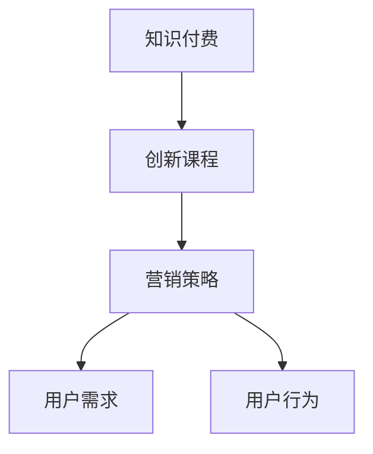

                 

# 知识经济时代下的知识付费创新课程营销策略

在知识经济时代，知识付费成为了连接知识生产者和消费者的新型商业模式。通过付费购买知识内容，消费者能够获得更为高效、精准的知识服务，而知识创作者也能够通过平台变现，实现自我价值。本文将探讨知识付费创新课程的营销策略，通过逻辑清晰、结构紧凑、简单易懂的语言，深度剖析这一领域的策略与实践。

## 1. 背景介绍

### 1.1 问题由来

随着互联网技术的普及和知识信息量的爆炸式增长，传统的知识获取方式已经难以满足人们日益增长的知识需求。因此，知识付费应运而生，它通过付费机制筛选了高价值知识，为知识消费者提供了更为高效、专业的学习体验。知识付费市场覆盖了在线教育、职业培训、技术资讯等多个领域，市场规模不断扩大。

### 1.2 问题核心关键点

知识付费创新课程的营销策略主要涉及以下几个关键点：
1. 课程内容设计：课程内容是知识付费的核心，需充分结合市场需求和用户反馈，设计高质量的知识内容。
2. 目标用户定位：明确课程面向的目标用户群体，如企业高管、IT从业者、教育工作者等，从而有针对性地进行推广。
3. 营销渠道选择：选择适合的线上线下营销渠道，如社交媒体、内容平台、教育机构等。
4. 用户体验优化：提升课程的体验质量，如界面设计、视频播放、学习进度管理等，以提高用户满意度。
5. 数据驱动决策：利用大数据分析工具，获取用户行为数据，优化营销策略和课程内容。

### 1.3 问题研究意义

研究知识付费创新课程的营销策略，对于拓展知识付费市场，提升课程销售效果，促进知识消费，具有重要意义：

1. 拓展市场规模：通过精准的营销策略，吸引更多用户订阅课程，扩大知识付费市场规模。
2. 提高课程质量：通过数据驱动的优化，不断迭代课程内容，提高课程的吸引力和用户满意度。
3. 优化用户体验：通过用户反馈和数据分析，持续改进课程服务，提升用户粘性。
4. 促进知识普及：通过优质的课程内容，降低知识获取门槛，促进知识的广泛传播和应用。
5. 推动产业发展：通过知识付费，推动知识生产和传播的商业化和产业化，促进相关产业的发展。

## 2. 核心概念与联系

### 2.1 核心概念概述

知识付费创新课程的营销策略涉及多个核心概念，包括：
1. 知识付费：指消费者为获取专业知识而支付费用的新型商业模式。
2. 创新课程：指通过新颖的教学理念、互动形式和个性化服务，提升课程价值和用户体验的课程设计。
3. 营销策略：指为了实现课程销售目标，而采取的一系列市场营销活动和策略。
4. 用户需求：指知识消费者对于课程内容、价格、学习方式等方面的需求。
5. 用户行为：指用户在课程购买、使用、评价等过程中的行为数据。

这些概念之间的联系可以通过以下Mermaid流程图来展示：



这个流程图展示了知识付费、创新课程和营销策略之间的逻辑关系：

1. 知识付费为创新课程提供了市场基础。
2. 创新课程为知识付费提供了高质量的内容保障。
3. 营销策略为创新课程提供了推广手段和渠道。
4. 用户需求和行为数据为营销策略的制定和优化提供了依据。

## 3. 核心算法原理 & 具体操作步骤
### 3.1 算法原理概述

知识付费创新课程的营销策略主要基于以下几个算法原理：

1. 市场细分算法：通过用户行为数据分析，将目标用户群体细分为不同的细分市场，制定有针对性的营销策略。
2. 推荐系统算法：利用用户历史行为数据和偏好，推荐个性化的课程内容，提高用户购买概率。
3. 数据挖掘算法：通过大数据分析工具，挖掘用户数据中的潜在价值，优化课程内容和营销策略。
4. 社交网络算法：利用社交网络的传播效应，扩大课程的知名度和影响力。
5. 内容搜索引擎算法：通过优化课程内容和标签，提高用户在搜索引擎中的曝光率和点击率。

### 3.2 算法步骤详解

以下是对知识付费创新课程营销策略的详细操作步骤：

**Step 1: 数据分析与用户画像建立**
- 收集用户在平台上的行为数据，如浏览记录、搜索关键词、购买记录等。
- 使用数据挖掘算法分析用户数据，建立用户画像，包括用户兴趣、职业、教育水平等。
- 根据用户画像，将用户群体细分为不同的细分市场，如IT从业者、创业者、学生等。

**Step 2: 内容设计与优化**
- 根据用户画像和市场细分，设计符合目标用户需求的课程内容。
- 结合社交网络和SEO算法，优化课程内容，提高其在社交平台和搜索引擎中的曝光率。
- 利用推荐系统算法，为不同细分市场的用户推荐个性化的课程内容。

**Step 3: 营销策略制定与执行**
- 选择合适的营销渠道，如社交媒体、内容平台、教育机构等。
- 制定有针对性的营销策略，如SEO优化、社交网络推广、线上线下结合的营销活动等。
- 利用大数据分析工具，监测营销效果，优化营销策略。

**Step 4: 用户反馈与课程迭代**
- 收集用户在课程使用过程中的反馈，如评价、意见、建议等。
- 根据用户反馈，优化课程内容和营销策略，进行课程迭代。
- 持续改进课程服务，提高用户满意度和忠诚度。

### 3.3 算法优缺点

知识付费创新课程的营销策略具有以下优点：
1. 精准定位：通过市场细分和用户画像，能够准确识别目标用户，实现精准营销。
2. 数据驱动：利用大数据分析工具，优化营销策略和课程内容，提高用户满意度和购买率。
3. 用户粘性：通过个性化推荐和优质课程内容，提高用户粘性和重复购买率。
4. 知识传播：高质量的课程内容能够促进知识的广泛传播和应用，提升社会整体的认知水平。

同时，该策略也存在以下局限性：
1. 数据隐私：收集用户数据需要遵循隐私保护法规，如GDPR等。
2. 数据质量：数据质量决定了营销策略的有效性，需要投入大量资源进行数据清洗和预处理。
3. 市场变化：市场和用户需求快速变化，需要持续监测和调整营销策略。
4. 技术成本：采用复杂算法和技术手段需要较高的技术投入和成本。
5. 课程内容：课程内容的创新性和差异性需要不断探索和设计，才能保持市场竞争力。

### 3.4 算法应用领域

知识付费创新课程的营销策略广泛应用于多个领域，例如：

- 在线教育：通过定制化课程内容和个性化推荐，提升用户学习效果和满意度。
- 职业培训：针对不同职业需求，设计专业培训课程，提高从业者技能。
- 技术资讯：提供最新的技术资讯和课程内容，帮助开发者掌握前沿技术。
- 财务管理：提供财务知识培训课程，帮助企业管理者和财务人员提升财务管理水平。
- 健康保健：提供健康保健知识课程，帮助用户提高健康水平和保健意识。

## 4. 数学模型和公式 & 详细讲解 & 举例说明
### 4.1 数学模型构建

知识付费创新课程的营销策略可以通过数学模型来描述和优化。

假设课程的收益函数为 $R(x)$，其中 $x$ 为营销策略参数，包括内容质量、营销渠道选择、用户推荐等。目标是最小化成本 $C(x)$，最大化收益 $R(x)$。

通过求解优化问题，可以找到最优的策略参数组合：

$$
\hat{x}=\mathop{\arg\min}_{x} C(x)
$$

$$
\hat{x}=\mathop{\arg\max}_{x} \frac{R(x)}{C(x)}
$$

### 4.2 公式推导过程

以课程内容推荐为例，假设平台上有 $n$ 个课程，用户的历史行为数据为 $\mathcal{H}_u$，用户画像为 $\mathcal{P}_u$。课程的内容质量为 $q_i$，推荐算法为 $A(\cdot)$，推荐结果为 $R_i$。

根据用户行为数据和画像，构建用户兴趣向量 $\mathbf{v}_u=\langle v_{ui}\rangle$，其中 $v_{ui}$ 为课程 $i$ 对用户 $u$ 的兴趣度。

课程推荐的目标是最小化用户和内容之间的距离，即：

$$
\min_{\mathbf{v}_u} \sum_i (v_{ui} - q_i)^2
$$

使用矩阵分解技术，将用户兴趣向量 $\mathbf{v}_u$ 和课程内容质量 $q_i$ 进行矩阵分解：

$$
\mathbf{v}_u = \mathbf{U}_u \mathbf{v}_u
$$

$$
q_i = \mathbf{Q}_i \mathbf{v}_i
$$

其中 $\mathbf{U}_u$ 和 $\mathbf{Q}_i$ 为低秩矩阵，$\mathbf{v}_u$ 和 $\mathbf{v}_i$ 为向量。

通过矩阵乘法，推荐算法可以表示为：

$$
R_i = A(\mathbf{U}_u, \mathbf{Q}_i)
$$

利用梯度下降等优化算法，不断更新 $\mathbf{U}_u$ 和 $\mathbf{Q}_i$，直到收敛。

### 4.3 案例分析与讲解

以在线教育平台Udemy为例，其通过数据分析和推荐算法，实现了精准的课程推荐。Udemy利用用户历史浏览记录、购买记录和课程评价，构建用户画像和课程标签，通过协同过滤算法和内容推荐算法，为用户推荐个性化的课程。

此外，Udemy还通过社交网络分享、SEO优化等手段，提高了课程的曝光率和用户转化率。在营销策略方面，Udemy通过线上线下结合的方式，提升课程的知名度和用户参与度。例如，通过社交媒体广告和邮件营销，吸引用户关注并订阅课程。

## 5. 项目实践：代码实例和详细解释说明
### 5.1 开发环境搭建

在进行知识付费创新课程的营销策略开发前，我们需要准备好开发环境。以下是使用Python进行数据分析和推荐系统开发的常用环境配置流程：

1. 安装Anaconda：从官网下载并安装Anaconda，用于创建独立的Python环境。

2. 创建并激活虚拟环境：
```bash
conda create -n recommendation-env python=3.8 
conda activate recommendation-env
```

3. 安装相关库：
```bash
conda install pandas numpy scikit-learn scipy seaborn matplotlib
pip install tensorflow keras
```

4. 安装TensorFlow和Keras：
```bash
pip install tensorflow==2.6 keras==2.6.0
```

完成上述步骤后，即可在`recommendation-env`环境中开始开发实践。

### 5.2 源代码详细实现

下面我们以在线教育平台Udemy的课程推荐系统为例，给出使用TensorFlow和Keras实现推荐系统的PyTorch代码实现。

首先，定义推荐系统的数据处理函数：

```python
import tensorflow as tf
from tensorflow.keras.layers import Input, Embedding, Dot, Dense
from tensorflow.keras.models import Model

def build_recommendation_model(train_data, test_data):
    user_id = Input(shape=(1,))
    item_id = Input(shape=(1,))
    
    user_embeddings = Embedding(input_dim=train_data['user'].nunique(), output_dim=128)(user_id)
    item_embeddings = Embedding(input_dim=train_data['item'].nunique(), output_dim=128)(item_id)
    
    dot_product = Dot(axes=2, normalize=True)([user_embeddings, item_embeddings])
    dot_product = tf.nn.dropout(dot_product, rate=0.2)
    hidden = Dense(units=64, activation='relu')(dot_product)
    output = Dense(units=1, activation='sigmoid')(hidden)
    
    model = Model(inputs=[user_id, item_id], outputs=output)
    model.compile(optimizer='adam', loss='binary_crossentropy', metrics=['accuracy'])
    
    model.fit(x=[train_data['user'], train_data['item']], y=train_data['rating'], epochs=10, batch_size=32, validation_data=([test_data['user'], test_data['item']], test_data['rating']))
    
    return model
```

然后，定义数据集和加载函数：

```python
import pandas as pd

def load_data(file_path):
    data = pd.read_csv(file_path)
    return data

train_data = load_data('train_data.csv')
test_data = load_data('test_data.csv')
```

最后，启动推荐系统训练和测试：

```python
model = build_recommendation_model(train_data, test_data)
print(model.summary())
```

### 5.3 代码解读与分析

让我们再详细解读一下关键代码的实现细节：

**build_recommendation_model函数**：
- 定义了推荐系统的输入层 `user_id` 和 `item_id`，分别用于表示用户和课程的ID。
- 利用 `Embedding` 层将用户和课程ID转换为向量表示。
- 通过 `Dot` 层计算用户和课程向量的点积，得到推荐分数。
- 使用 `Dense` 层进行非线性变换，使用 `Dropout` 层防止过拟合。
- 最终使用 `Dense` 层输出预测概率，并定义模型结构和编译参数。

**load_data函数**：
- 读取CSV文件，并返回数据集。

**训练和测试流程**：
- 调用 `build_recommendation_model` 函数，传入训练数据和测试数据。
- 使用 `summary` 方法打印模型结构。
- 在训练集上训练模型，并在测试集上评估性能。

这些代码展示了使用TensorFlow和Keras实现推荐系统的基本流程，进一步的优化和调参还需要根据具体数据集和场景进行调整。

## 6. 实际应用场景
### 6.1 在线教育

在线教育平台通过知识付费创新课程的营销策略，实现了精准的课程推荐和用户转化。平台能够根据用户历史行为数据和画像，推荐符合其兴趣和需求的课程，提高了用户购买概率。例如，Coursera利用推荐算法，为用户推荐与其学习历史和专业相关的课程。

### 6.2 职业培训

职业培训课程通过精准的营销策略，吸引企业高管和职场从业者报名学习。平台通过分析用户职业背景和兴趣，推荐适合的职业发展课程，提升用户技能和工作绩效。例如，LinkedIn Learning利用用户职业数据和行为数据，推荐职业发展相关的课程。

### 6.3 技术资讯

技术资讯平台通过推荐系统，将最新的技术文章和课程推荐给开发者，帮助其掌握前沿技术。平台利用用户的历史阅读记录和行为数据，推荐符合其技术兴趣和职业需求的内容，提高用户粘性和参与度。例如，Stack Overflow利用推荐系统，为用户推荐技术相关的文章和课程。

### 6.4 未来应用展望

随着技术的发展，知识付费创新课程的营销策略将呈现出更多的新趋势：

1. 个性化推荐：通过更加精准的用户画像和行为分析，推荐更加个性化和多样化的课程内容。
2. 社交网络效应：利用社交网络效应，通过用户分享和推荐，扩大课程的传播范围和影响。
3. 多渠道营销：结合线上线下的营销手段，通过多渠道推广，提高课程的曝光率和用户转化率。
4. 数据分析与优化：利用大数据分析工具，实时监测和优化营销策略，提高营销效果和用户满意度。
5. 人工智能应用：引入AI技术，如自然语言处理、计算机视觉等，优化推荐算法，提升推荐效果。

## 7. 工具和资源推荐
### 7.1 学习资源推荐

为了帮助开发者系统掌握知识付费创新课程的营销策略，这里推荐一些优质的学习资源：

1. 《知识付费商业模型创新》课程：由知名商业教育机构开设的课程，讲解知识付费的商业模型和创新策略。
2. 《数据分析与推荐系统》书籍：全面介绍推荐算法和大数据分析技术，为开发推荐系统提供理论基础。
3. 《社交媒体营销实战》课程：讲解社交媒体平台的营销策略和技巧，为课程推广提供实际操作方法。
4. 《用户体验设计》课程：讲解用户体验设计的原理和实践，提升课程内容和用户体验质量。
5. 《机器学习与深度学习》课程：讲解机器学习与深度学习技术，为推荐系统优化提供技术支持。

通过对这些资源的学习实践，相信你一定能够快速掌握知识付费创新课程的营销策略，并用于解决实际的营销问题。
###  7.2 开发工具推荐

高效的开发离不开优秀的工具支持。以下是几款用于知识付费创新课程营销策略开发的常用工具：

1. TensorFlow：由Google主导开发的开源深度学习框架，生产部署方便，适合大规模工程应用。
2. Keras：高层次神经网络API，简洁易用，适用于快速迭代研究。
3. PyTorch：基于Python的开源深度学习框架，灵活动态的计算图，适合快速迭代研究。
4. Apache Hadoop：大规模数据处理平台，能够处理大数据分析任务。
5. Apache Spark：快速大数据处理引擎，支持多种编程语言和数据处理任务。
6. Jupyter Notebook：交互式Python编程环境，支持代码执行和数据可视化。

合理利用这些工具，可以显著提升知识付费创新课程的营销策略开发效率，加快创新迭代的步伐。

### 7.3 相关论文推荐

知识付费创新课程的营销策略源于学界的持续研究。以下是几篇奠基性的相关论文，推荐阅读：

1. "Recommender Systems: Complexity and Efficiency"：Lecjak和Fang在《ACM Transactions on Management Information Systems》上发表的文章，全面介绍了推荐系统的复杂性和效率问题。
2. "A Survey of Recommendation Systems for Mobile Users"：Shani和Fang在《IEEE Transactions on Mobile Computing》上发表的文章，综述了移动推荐系统的发展和应用。
3. "Causal Inference in Recommendation Systems"：Lars Herbst和Adithya Gopalan在《Journal of Business Research》上发表的文章，探讨了因果推理在推荐系统中的应用。
4. "A Survey on Social Media Analytics"：Tan和Elghandour在《IEEE Transactions on Big Data》上发表的文章，综述了社交媒体分析的最新进展和应用。
5. "A Survey on Recommender Systems in Educational Environments"：Guo和Bian在《Journal of Educational Technology & Society》上发表的文章，综述了教育领域推荐系统的发展和应用。

这些论文代表了大语言模型微调技术的发展脉络。通过学习这些前沿成果，可以帮助研究者把握学科前进方向，激发更多的创新灵感。

## 8. 总结：未来发展趋势与挑战
### 8.1 总结

本文对知识付费创新课程的营销策略进行了全面系统的介绍。首先阐述了知识付费的背景和意义，明确了课程内容设计、用户画像、营销渠道选择等关键因素。其次，从原理到实践，详细讲解了推荐系统、数据驱动和社交网络等营销策略的实现过程，给出了推荐系统的PyTorch代码实现。同时，本文还广泛探讨了课程推荐在在线教育、职业培训、技术资讯等多个行业领域的应用前景，展示了知识付费营销策略的广阔潜力。最后，本文精选了推荐系统的学习资源，力求为读者提供全方位的技术指引。

通过本文的系统梳理，可以看到，知识付费创新课程的营销策略正在成为连接知识生产者和消费者的重要手段，极大地拓展了知识付费市场，促进了知识消费和产业发展。未来，伴随推荐系统的持续演进，知识付费的营销策略将进一步优化，为知识传播和应用带来新的机遇和挑战。

### 8.2 未来发展趋势

展望未来，知识付费创新课程的营销策略将呈现以下几个发展趋势：

1. 推荐系统优化：通过更加精确的用户画像和行为分析，提高推荐系统的精度和覆盖率。
2. 数据驱动决策：利用大数据分析工具，实时监测和优化营销策略，提升营销效果和用户满意度。
3. 个性化推荐：通过更加精准的用户画像和行为分析，推荐更加个性化和多样化的课程内容。
4. 社交网络效应：利用社交网络效应，通过用户分享和推荐，扩大课程的传播范围和影响。
5. 多渠道营销：结合线上线下的营销手段，通过多渠道推广，提高课程的曝光率和用户转化率。
6. 人工智能应用：引入AI技术，如自然语言处理、计算机视觉等，优化推荐算法，提升推荐效果。

以上趋势凸显了知识付费创新课程营销策略的广阔前景。这些方向的探索发展，必将进一步提升知识付费的营销效果和用户体验，促进知识消费和产业发展。

### 8.3 面临的挑战

尽管知识付费创新课程的营销策略已经取得了显著成果，但在迈向更加智能化、普适化应用的过程中，它仍面临诸多挑战：

1. 数据隐私：收集用户数据需要遵循隐私保护法规，如GDPR等。
2. 数据质量：数据质量决定了营销策略的有效性，需要投入大量资源进行数据清洗和预处理。
3. 市场变化：市场和用户需求快速变化，需要持续监测和调整营销策略。
4. 技术成本：采用复杂算法和技术手段需要较高的技术投入和成本。
5. 课程内容：课程内容的创新性和差异性需要不断探索和设计，才能保持市场竞争力。

### 8.4 研究展望

面对知识付费创新课程营销策略所面临的挑战，未来的研究需要在以下几个方面寻求新的突破：

1. 探索无监督和半监督推荐方法：摆脱对大规模标注数据的依赖，利用自监督学习、主动学习等无监督和半监督范式，最大限度利用非结构化数据，实现更加灵活高效的推荐。
2. 研究推荐系统中的伦理与公平性：引入伦理和公平性约束，避免推荐系统中的偏见和歧视，保障用户的权益。
3. 引入更多先验知识：将符号化的先验知识，如知识图谱、逻辑规则等，与推荐系统进行融合，引导推荐过程学习更准确、合理的知识表征。
4. 结合因果分析和博弈论工具：将因果分析方法引入推荐系统，识别出用户决策的关键特征，增强推荐系统输出的可解释性和可控性。
5. 优化用户体验和课程内容：通过用户反馈和数据分析，持续改进课程内容和营销策略，提升用户体验和用户粘性。

这些研究方向将推动知识付费创新课程的营销策略向更加智能化、个性化和可持续的方向发展，为知识传播和应用带来新的机遇和挑战。

## 9. 附录：常见问题与解答
**Q1：知识付费创新课程的营销策略是否适用于所有领域？**

A: 知识付费创新课程的营销策略适用于多个领域，如在线教育、职业培训、技术资讯等，能够通过精准的推荐和个性化的服务，提升用户满意度和转化率。但对于某些垂直领域，如医学、法律等，可能需要结合领域特定的知识体系和课程设计，才能更好地满足用户需求。

**Q2：如何选择合适的营销渠道？**

A: 选择合适的营销渠道需要考虑多个因素，如目标用户的特点、课程内容的类型、营销预算等。常见的营销渠道包括社交媒体、内容平台、电子邮件、广告等。例如，对于面向青少年的课程，可以通过TikTok、B站等社交平台进行推广；对于面向专业人士的课程，可以通过LinkedIn、知乎等专业平台进行推广。

**Q3：如何设计高质量的课程内容？**

A: 设计高质量的课程内容需要结合用户需求和市场需求，从以下几个方面入手：
1. 课程设计：明确课程目标和教学大纲，设计合理的内容结构和教学流程。
2. 课程制作：采用高品质的视频和音频资源，注重课程制作和呈现效果。
3. 课程反馈：收集用户反馈和评价，持续改进课程内容和教学方式。
4. 课程更新：保持课程内容的时效性和前沿性，定期更新和优化课程内容。

**Q4：如何提升课程的推荐效果？**

A: 提升课程的推荐效果需要从以下几个方面入手：
1. 数据收集：收集用户的历史行为数据和偏好信息，构建用户画像和课程标签。
2. 算法优化：选择合适的推荐算法，如协同过滤、基于内容的推荐、深度学习等，优化推荐模型的参数和结构。
3. 多模态融合：将文本、图像、视频等多模态数据结合，提升推荐模型的效果。
4. 实时更新：利用大数据分析工具，实时监测和优化推荐策略，提升推荐效果。

**Q5：如何保障数据隐私和安全？**

A: 保障数据隐私和安全需要从以下几个方面入手：
1. 数据匿名化：在数据收集和处理过程中，对用户数据进行匿名化处理，防止数据泄露和滥用。
2. 加密存储：对用户数据进行加密存储，保障数据在传输和存储过程中的安全性。
3. 隐私政策：制定清晰的隐私政策和用户协议，明确用户数据的收集、使用和保护方式。
4. 合规审查：定期进行隐私和安全合规审查，确保数据处理过程符合相关法规和标准。

总之，知识付费创新课程的营销策略需要开发者从多个维度进行综合考虑和优化，才能在快速变化的市场环境中保持竞争力和用户粘性。

---

作者：禅与计算机程序设计艺术 / Zen and the Art of Computer Programming

