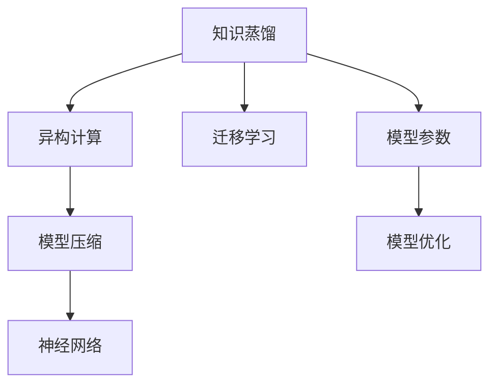

                 

# 知识蒸馏在异构计算环境中的应用

> 关键词：知识蒸馏,异构计算,迁移学习,模型压缩,神经网络

## 1. 背景介绍

### 1.1 问题由来
在人工智能的快速发展中，异构计算环境变得越发重要。这主要是因为现代计算需求日益复杂，单一类型的计算资源已无法满足，混合使用各种类型的硬件资源，如CPU、GPU、TPU、FPGA等，成为了一种趋势。然而，异构计算环境中的硬件资源种类多样，执行能力各异，如何将这些异构资源有效整合，从而高效地完成计算任务，成为当前研究的重点之一。

### 1.2 问题核心关键点
异构计算环境下的知识蒸馏技术，旨在将知识从性能较高的模型迁移到性能较低的模型上，以提高整个系统的效率和性能。在异构计算环境中，性能较高的模型（如GPU训练的模型）通常运行在计算能力较强的硬件上，而性能较低的模型（如嵌入式设备上的模型）通常运行在计算能力较弱的硬件上。知识蒸馏能够实现将高精度、高复杂度的模型压缩到低精度、低复杂度的模型上，从而在低计算能力的设备上实现高性能模型。

### 1.3 问题研究意义
异构计算环境下的知识蒸馏技术，对于提升异构计算系统的整体性能和效率，具有重要意义：

1. **资源利用最大化**：通过知识蒸馏，可以在有限的计算资源下，充分利用多种类型的硬件资源，提高计算效率。
2. **模型压缩与优化**：知识蒸馏可以将复杂的模型压缩到轻量级模型，适应资源受限的设备，从而减少计算和存储开销。
3. **跨平台兼容**：异构计算环境下的知识蒸馏，可以使得不同平台上的模型具有相似的性能，有助于模型在不同设备间的迁移和部署。
4. **系统灵活性提升**：通过知识蒸馏，可以构建适应多变需求的异构计算系统，提高系统的灵活性和适应性。

## 2. 核心概念与联系

### 2.1 核心概念概述

为更好地理解异构计算环境中的知识蒸馏方法，本节将介绍几个密切相关的核心概念：

- **知识蒸馏(Knowledge Distillation)**：一种迁移学习方法，用于将高性能模型的知识迁移到性能较低的模型中，通过知识蒸馏，可以在较小的模型上获得与高性能模型相似的性能。
- **异构计算(Heterogeneous Computing)**：使用不同类型、不同性能的硬件资源，进行协同计算，以提高计算效率和系统性能。
- **迁移学习(Transfer Learning)**：将一个领域学到的知识迁移到另一个领域，以提升在目标领域的学习效果。
- **模型压缩(Model Compression)**：通过剪枝、量化等技术，减少模型参数量，以提高模型推理速度和降低计算复杂度。
- **神经网络(Neural Network)**：由大量人工神经元（节点）连接而成的计算网络，用于处理复杂的数据和模式识别任务。

这些核心概念之间的逻辑关系可以通过以下Mermaid流程图来展示：



这个流程图展示的知识蒸馏的核心概念及其之间的关系：

1. 知识蒸馏从高性能模型中提取知识。
2. 异构计算整合不同类型硬件资源。
3. 迁移学习通过知识迁移提升模型性能。
4. 模型压缩减少模型复杂度，提升推理速度。
5. 神经网络作为知识蒸馏的对象和载体。

## 3. 核心算法原理 & 具体操作步骤
### 3.1 算法原理概述

异构计算环境中的知识蒸馏方法，核心思想是将高性能模型的知识迁移到性能较低的模型上，以提高整个系统的效率和性能。具体来说，通过以下步骤实现知识蒸馏：

1. **教师模型(Teacher Model)**：先训练一个性能较高的模型，作为教师模型。
2. **学生模型(Student Model)**：使用教师模型的知识，训练一个性能较低的学生模型。
3. **知识蒸馏**：将教师模型与学生模型结合，通过知识蒸馏技术，使得学生模型能够模拟教师模型的行为。

### 3.2 算法步骤详解

在异构计算环境中，知识蒸馏的具体操作步骤如下：

**Step 1: 选择合适的教师模型和学生模型**

- 根据计算资源和性能需求，选择合适的教师模型（如GPU训练的模型）和学生模型（如嵌入式设备上的模型）。

**Step 2: 初始化学生模型**

- 将学生模型初始化为教师模型的参数，如使用相同的神经网络架构，初始化层权值、偏置等。

**Step 3: 知识蒸馏训练**

- 将教师模型的输出与学生模型的输出进行比较，计算蒸馏损失。
- 使用梯度下降等优化算法，更新学生模型的参数，使得学生模型输出尽量接近教师模型。
- 重复上述过程，直至学生模型输出与教师模型的输出足够接近，或者达到预设的训练轮数。

**Step 4: 模型评估与优化**

- 对学生模型进行评估，使用教师模型作为基线，计算评估指标（如准确率、误差率等）。
- 根据评估结果，进行模型优化，如调整学习率、正则化参数、蒸馏比例等。
- 继续训练学生模型，直至性能满足实际需求。

### 3.3 算法优缺点

异构计算环境下的知识蒸馏方法具有以下优点：

1. **性能提升**：通过知识蒸馏，可以在低计算能力的设备上获得高性能模型的输出，提升系统性能。
2. **资源利用**：充分利用异构计算环境中的多种硬件资源，提高资源利用效率。
3. **模型压缩**：可以将复杂的模型压缩到轻量级模型，降低计算和存储开销。

同时，该方法也存在一些局限性：

1. **知识迁移质量**：知识蒸馏的效果依赖于教师模型的质量，如果教师模型本身不够精准，知识蒸馏的效果会大打折扣。
2. **训练复杂度**：知识蒸馏的训练过程复杂，需要调整的参数较多，训练周期较长。
3. **设备兼容**：异构计算环境中的设备种类多样，实现模型兼容和互操作性难度较大。
4. **公平性问题**：知识蒸馏过程中，教师模型和学生模型的计算资源分配可能会产生不公平性。

### 3.4 算法应用领域

异构计算环境下的知识蒸馏方法，在多个领域中得到了广泛应用，例如：

- **嵌入式系统**：在计算资源受限的嵌入式设备上，通过知识蒸馏，实现高效计算和智能决策。
- **云-边协同**：在云-边计算环境中，通过知识蒸馏，将云端的复杂模型压缩到边缘设备，提高计算效率。
- **移动计算**：在移动设备上，通过知识蒸馏，实现轻量级模型，提高移动应用响应速度和能效比。
- **智能制造**：在工业物联网中，通过知识蒸馏，实现设备间的知识共享和协同计算，提升生产效率。
- **边缘计算**：在边缘计算环境中，通过知识蒸馏，将云服务器的复杂模型迁移到边缘节点，降低延迟和带宽开销。

## 4. 数学模型和公式 & 详细讲解  
### 4.1 数学模型构建

知识蒸馏的核心是教师模型和学生模型的输出相似性。我们定义教师模型为 $M_T(x)$，学生模型为 $M_S(x)$，其输出分别为 $t(x)$ 和 $s(x)$。知识蒸馏的目标是使学生模型的输出 $s(x)$ 逼近教师模型的输出 $t(x)$。

我们定义蒸馏损失函数 $L(\theta_S)$，该损失函数衡量学生模型与教师模型输出之间的差异：

$$
L(\theta_S) = \mathbb{E}[\ell(s(x),t(x))]
$$

其中 $\ell$ 为损失函数，常用的有交叉熵损失、均方误差损失等。

### 4.2 公式推导过程

下面以交叉熵损失为例，推导知识蒸馏的损失函数：

$$
L(\theta_S) = -\frac{1}{N}\sum_{i=1}^N \sum_{j=1}^C p_j\log(s(x_i, j))
$$

其中 $p_j$ 为第 $j$ 个类别的真实概率，$s(x_i, j)$ 为学生模型对第 $j$ 个类别的预测概率。

在训练过程中，通过反向传播算法，计算学生模型的梯度，更新模型参数 $\theta_S$：

$$
\frac{\partial L(\theta_S)}{\partial \theta_S} = -\frac{1}{N}\sum_{i=1}^N \sum_{j=1}^C \frac{\partial \ell(s(x_i),t(x_i))}{\partial s(x_i, j)} \frac{\partial s(x_i, j)}{\partial \theta_S}
$$

其中 $\frac{\partial \ell(s(x_i),t(x_i))}{\partial s(x_i, j)}$ 为损失函数对学生模型输出的梯度，$\frac{\partial s(x_i, j)}{\partial \theta_S}$ 为学生模型对参数 $\theta_S$ 的梯度。

### 4.3 案例分析与讲解

以一个简单的图像分类为例，教师模型和学生模型均为卷积神经网络（CNN），训练数据集为CIFAR-10。

首先，使用CIFAR-10训练集训练教师模型，使其达到一定的准确率。然后，将教师模型的参数初始化为学生模型的参数，在训练集上训练学生模型，同时使用教师模型作为基线，计算蒸馏损失。具体代码实现如下：

```python
import torch
import torch.nn as nn
import torch.optim as optim
from torchvision import datasets, transforms

# 定义教师和学生模型
teacher_model = nn.Sequential(
    nn.Conv2d(3, 32, 3, stride=1, padding=1),
    nn.ReLU(),
    nn.MaxPool2d(2, 2),
    nn.Conv2d(32, 64, 3, stride=1, padding=1),
    nn.ReLU(),
    nn.MaxPool2d(2, 2),
    nn.Flatten(),
    nn.Linear(64*8*8, 10),
    nn.Softmax(dim=1)
)

student_model = nn.Sequential(
    nn.Conv2d(3, 16, 3, stride=1, padding=1),
    nn.ReLU(),
    nn.MaxPool2d(2, 2),
    nn.Conv2d(16, 32, 3, stride=1, padding=1),
    nn.ReLU(),
    nn.MaxPool2d(2, 2),
    nn.Flatten(),
    nn.Linear(32*4*4, 10),
    nn.Softmax(dim=1)
)

# 定义损失函数和优化器
criterion = nn.CrossEntropyLoss()
optimizer = optim.Adam(student_model.parameters(), lr=0.001)

# 加载数据集
train_dataset = datasets.CIFAR10(root='./data', train=True, download=True, transform=transforms.ToTensor())
train_loader = torch.utils.data.DataLoader(train_dataset, batch_size=64, shuffle=True)

# 训练学生模型
for epoch in range(10):
    for i, (inputs, labels) in enumerate(train_loader):
        inputs = inputs.to(device)
        labels = labels.to(device)

        optimizer.zero_grad()
        logits = student_model(inputs)
        loss = criterion(logits, labels)
        loss.backward()
        optimizer.step()

        if (i+1) % 100 == 0:
            print('Epoch [{}/{}], Step [{}/{}], Loss: {:.4f}'.format(epoch+1, 10, i+1, len(train_loader), loss.item()))
```

通过对比教师模型和学生模型的输出，可以看到学生模型逐步逼近教师模型的性能，最终实现了较低的损失函数值。

## 5. 项目实践：代码实例和详细解释说明
### 5.1 开发环境搭建

在进行知识蒸馏实践前，我们需要准备好开发环境。以下是使用Python进行PyTorch开发的环境配置流程：

1. 安装Anaconda：从官网下载并安装Anaconda，用于创建独立的Python环境。

2. 创建并激活虚拟环境：
```bash
conda create -n pytorch-env python=3.8 
conda activate pytorch-env
```

3. 安装PyTorch：根据CUDA版本，从官网获取对应的安装命令。例如：
```bash
conda install pytorch torchvision torchaudio cudatoolkit=11.1 -c pytorch -c conda-forge
```

4. 安装TensorFlow：根据CUDA版本，从官网获取对应的安装命令。例如：
```bash
conda install tensorflow -c conda-forge
```

5. 安装各类工具包：
```bash
pip install numpy pandas scikit-learn matplotlib tqdm jupyter notebook ipython
```

完成上述步骤后，即可在`pytorch-env`环境中开始知识蒸馏实践。

### 5.2 源代码详细实现

这里我们以迁移学习中的知识蒸馏为例，给出使用PyTorch进行知识蒸馏的代码实现。

```python
import torch
import torch.nn as nn
import torch.optim as optim
from torchvision import datasets, transforms

# 定义教师和学生模型
teacher_model = nn.Sequential(
    nn.Conv2d(3, 32, 3, stride=1, padding=1),
    nn.ReLU(),
    nn.MaxPool2d(2, 2),
    nn.Conv2d(32, 64, 3, stride=1, padding=1),
    nn.ReLU(),
    nn.MaxPool2d(2, 2),
    nn.Flatten(),
    nn.Linear(64*8*8, 10),
    nn.Softmax(dim=1)
)

student_model = nn.Sequential(
    nn.Conv2d(3, 16, 3, stride=1, padding=1),
    nn.ReLU(),
    nn.MaxPool2d(2, 2),
    nn.Conv2d(16, 32, 3, stride=1, padding=1),
    nn.ReLU(),
    nn.MaxPool2d(2, 2),
    nn.Flatten(),
    nn.Linear(32*4*4, 10),
    nn.Softmax(dim=1)
)

# 定义损失函数和优化器
criterion = nn.CrossEntropyLoss()
optimizer = optim.Adam(student_model.parameters(), lr=0.001)

# 加载数据集
train_dataset = datasets.CIFAR10(root='./data', train=True, download=True, transform=transforms.ToTensor())
train_loader = torch.utils.data.DataLoader(train_dataset, batch_size=64, shuffle=True)

# 训练学生模型
for epoch in range(10):
    for i, (inputs, labels) in enumerate(train_loader):
        inputs = inputs.to(device)
        labels = labels.to(device)

        optimizer.zero_grad()
        logits = student_model(inputs)
        loss = criterion(logits, labels)
        loss.backward()
        optimizer.step()

        if (i+1) % 100 == 0:
            print('Epoch [{}/{}], Step [{}/{}], Loss: {:.4f}'.format(epoch+1, 10, i+1, len(train_loader), loss.item()))
```

### 5.3 代码解读与分析

让我们再详细解读一下关键代码的实现细节：

**定义教师和学生模型**：
- 教师模型和学生模型使用相同的网络架构，但参数初始化不同。
- 教师模型使用更多的卷积层和全连接层，以提高准确率。
- 学生模型使用更少的卷积层和全连接层，以减少计算和存储开销。

**损失函数和优化器**：
- 使用交叉熵损失函数，衡量学生模型和教师模型的输出差异。
- 使用Adam优化器，更新学生模型的参数，以最小化损失函数。

**数据集加载和模型训练**：
- 使用CIFAR-10数据集，作为教师模型的训练数据。
- 将教师模型的参数初始化为学生模型的参数，使用Adam优化器训练学生模型。
- 训练过程中，通过反向传播算法，计算学生模型的梯度，更新模型参数。

**训练日志输出**：
- 在每个epoch和每个batch的训练过程中，输出损失函数的值。

通过代码实现，可以看出知识蒸馏的具体流程和细节。学生模型在每个epoch中逐步学习教师模型的知识，最终达到相似的效果。

## 6. 实际应用场景
### 6.1 嵌入式系统

在嵌入式系统中，计算资源有限，无法运行复杂的模型。知识蒸馏可以将复杂模型压缩到轻量级模型，适应嵌入式设备的计算能力，实现高效计算和智能决策。例如，在智能手机、物联网设备等场景中，使用知识蒸馏实现图像识别、语音识别等功能。

### 6.2 云-边协同

在云-边协同计算中，云端服务器计算能力强，边缘设备计算资源受限。知识蒸馏可以将云端的复杂模型压缩到边缘设备，减少数据传输量和计算开销，提升系统响应速度。例如，在智慧城市、智能家居等场景中，使用知识蒸馏实现实时数据分析、智能控制等功能。

### 6.3 移动计算

在移动设备中，计算资源和电池续航有限，无法运行复杂的模型。知识蒸馏可以将复杂模型压缩到轻量级模型，适应移动设备的计算能力，提高应用响应速度和能效比。例如，在智能手机、平板电脑等场景中，使用知识蒸馏实现图像处理、文本翻译等功能。

### 6.4 智能制造

在工业物联网中，设备种类多样，计算能力各异。知识蒸馏可以将高精度模型压缩到低精度模型，实现设备间的知识共享和协同计算，提升生产效率。例如，在智能工厂、智能仓库等场景中，使用知识蒸馏实现设备监测、生产优化等功能。

### 6.5 边缘计算

在边缘计算环境中，数据实时处理要求高，计算资源受限。知识蒸馏可以将云服务器的复杂模型迁移到边缘节点，降低延迟和带宽开销，提升计算效率。例如，在智能交通、智慧安防等场景中，使用知识蒸馏实现实时数据处理、决策支持等功能。

## 7. 工具和资源推荐
### 7.1 学习资源推荐

为了帮助开发者系统掌握知识蒸馏的理论基础和实践技巧，这里推荐一些优质的学习资源：

1. 《深度学习》书籍：由Ian Goodfellow等作者所著，全面介绍了深度学习的基本概念和算法。
2. 《知识蒸馏：神经网络中的知识迁移》论文：由Geoffrey Hinton等作者提出，详细介绍了知识蒸馏的基本原理和应用场景。
3. PyTorch官方文档：提供了丰富的深度学习模型和知识蒸馏样例代码，是上手实践的必备资料。
4. Weights & Biases：模型训练的实验跟踪工具，可以记录和可视化模型训练过程中的各项指标，方便对比和调优。
5. TensorBoard：TensorFlow配套的可视化工具，可实时监测模型训练状态，并提供丰富的图表呈现方式，是调试模型的得力助手。

通过对这些资源的学习实践，相信你一定能够快速掌握知识蒸馏的精髓，并用于解决实际的计算问题。

### 7.2 开发工具推荐

高效的开发离不开优秀的工具支持。以下是几款用于知识蒸馏开发的常用工具：

1. PyTorch：基于Python的开源深度学习框架，灵活动态的计算图，适合快速迭代研究。大部分深度学习模型都有PyTorch版本的实现。
2. TensorFlow：由Google主导开发的开源深度学习框架，生产部署方便，适合大规模工程应用。同样有丰富的深度学习模型资源。
3. Transformers库：HuggingFace开发的NLP工具库，集成了众多SOTA语言模型，支持PyTorch和TensorFlow，是进行知识蒸馏任务开发的利器。
4. Weights & Biases：模型训练的实验跟踪工具，可以记录和可视化模型训练过程中的各项指标，方便对比和调优。与主流深度学习框架无缝集成。
5. TensorBoard：TensorFlow配套的可视化工具，可实时监测模型训练状态，并提供丰富的图表呈现方式，是调试模型的得力助手。

合理利用这些工具，可以显著提升知识蒸馏任务的开发效率，加快创新迭代的步伐。

### 7.3 相关论文推荐

知识蒸馏技术的发展源于学界的持续研究。以下是几篇奠基性的相关论文，推荐阅读：

1. Distilling the Knowledge in a Neural Network（知识蒸馏的原理）：由Geoffrey Hinton等作者提出，详细介绍了知识蒸馏的基本原理和应用场景。
2. FitNets：A Few Simple Rules for Transfer Learning（适合迁移学习的方法）：由Vaswani等作者提出，介绍了一套简单有效的迁移学习方法。
3. Knowledge Distillation with Data-Parallelism（并行化知识蒸馏）：由Kuznetsov等作者提出，介绍了一种并行化的知识蒸馏方法，提升了蒸馏效率。
4. Importance Distillation for Knowledge Transfer（重要性蒸馏）：由Kim等作者提出，引入重要性蒸馏，提高了知识蒸馏的效果。
5. Weighted Knowledge Distillation for Enhanced Stability（加权知识蒸馏）：由Dong等作者提出，通过加权蒸馏，提高了知识蒸馏的稳定性和准确性。

这些论文代表了大语言模型蒸馏技术的发展脉络。通过学习这些前沿成果，可以帮助研究者把握学科前进方向，激发更多的创新灵感。

## 8. 总结：未来发展趋势与挑战

### 8.1 总结

本文对异构计算环境中的知识蒸馏方法进行了全面系统的介绍。首先阐述了知识蒸馏和异构计算的核心概念及其研究背景，明确了知识蒸馏在提升系统性能和效率方面的重要价值。其次，从原理到实践，详细讲解了知识蒸馏的数学模型和核心算法，给出了代码实现和详细分析。同时，本文还广泛探讨了知识蒸馏方法在多个行业领域的应用前景，展示了知识蒸馏范式的巨大潜力。

通过本文的系统梳理，可以看到，异构计算环境下的知识蒸馏技术正在成为计算系统优化的重要手段，通过知识蒸馏，可以在多种硬件资源上实现高性能模型的部署，显著提升系统性能和资源利用效率。未来，伴随知识蒸馏技术的持续演进，必将进一步提升异构计算系统的整体性能和应用范围。

### 8.2 未来发展趋势

展望未来，异构计算环境下的知识蒸馏技术将呈现以下几个发展趋势：

1. **模型多样性**：未来的知识蒸馏方法将不仅限于深度神经网络，还将拓展到其他类型的模型，如决策树、规则系统等。
2. **自动蒸馏**：随着自动化技术的发展，知识蒸馏过程将更加自动化，自动选择教师模型、设计蒸馏策略，提高知识蒸馏的效率和效果。
3. **跨平台协作**：未来的知识蒸馏将实现跨平台协作，不同硬件资源之间通过知识蒸馏实现互操作性，提升整体系统性能。
4. **知识注入**：除了知识蒸馏，未来的研究将探索知识注入等方法，将先验知识与神经网络模型结合，提升模型的准确性和鲁棒性。
5. **联邦学习**：联邦学习将实现知识蒸馏在分布式系统中的应用，提升系统安全性和隐私保护。

这些趋势凸显了知识蒸馏技术的广阔前景。这些方向的探索发展，必将进一步提升知识蒸馏的性能和应用范围，为异构计算系统带来新的突破。

### 8.3 面临的挑战

尽管知识蒸馏技术已经取得了一定的成果，但在迈向更加智能化、普适化应用的过程中，它仍面临着诸多挑战：

1. **知识迁移质量**：知识蒸馏的效果依赖于教师模型的质量，如何优化教师模型训练过程，提高知识迁移质量，还需进一步研究。
2. **蒸馏效率**：知识蒸馏过程复杂，训练周期较长，如何优化蒸馏算法，提高蒸馏效率，还需进一步探索。
3. **设备兼容性**：异构计算环境中的设备种类多样，实现设备间的兼容性和互操作性，还需进一步研究。
4. **公平性问题**：知识蒸馏过程中，教师模型和学生模型的计算资源分配可能会产生不公平性，如何优化资源分配，还需进一步研究。

### 8.4 研究展望

面对知识蒸馏面临的这些挑战，未来的研究需要在以下几个方面寻求新的突破：

1. **优化教师模型训练**：通过改进训练目标函数、引入正则化技术等方法，提高教师模型的准确性和泛化能力。
2. **提升蒸馏效率**：开发更加高效的蒸馏算法，如重要性蒸馏、权重蒸馏等，提高蒸馏过程的效率和效果。
3. **改进设备兼容性**：实现跨平台协作，优化设备之间的数据传输和计算资源分配，提升系统性能。
4. **解决公平性问题**：引入资源均衡算法，优化计算资源分配，解决知识蒸馏过程中的不公平性问题。

这些研究方向的探索，必将引领知识蒸馏技术迈向更高的台阶，为异构计算系统带来新的突破。面向未来，知识蒸馏技术还需要与其他人工智能技术进行更深入的融合，如知识表示、因果推理、强化学习等，多路径协同发力，共同推动计算系统的进步。

## 9. 附录：常见问题与解答

**Q1：知识蒸馏和迁移学习有何区别？**

A: 知识蒸馏和迁移学习都属于迁移学习的范畴，但两者具体实现方式不同。知识蒸馏是将教师模型的输出作为监督信号，训练学生模型，使其输出与教师模型相似；而迁移学习是通过迁移先验知识，训练模型在新任务上表现更好。

**Q2：知识蒸馏是否可以应用于非神经网络模型？**

A: 知识蒸馏的原理是基于神经网络的输出相似性，因此其直接应用于非神经网络模型时需要进行扩展。例如，可以使用结构相似性和功能相似性等方法，将知识蒸馏应用于规则系统、决策树等模型。

**Q3：知识蒸馏过程中如何选择合适的教师模型？**

A: 知识蒸馏过程中，教师模型的选择对蒸馏效果影响较大。通常选择精度高、泛化能力强的模型作为教师模型，但教师模型的选择还需考虑其复杂度和计算开销。

**Q4：知识蒸馏是否可以在非异构计算环境中应用？**

A: 知识蒸馏的本质是将高性能模型的知识迁移到低性能模型，因此其可以应用于各种计算环境中，不仅限于异构计算环境。

**Q5：知识蒸馏是否可以用于模型压缩？**

A: 知识蒸馏和模型压缩密切相关，通过知识蒸馏可以有效地压缩模型，减少计算和存储开销。但知识蒸馏的重点在于模型知识的迁移，而模型压缩更注重参数量的减少和计算效率的提升。

这些问题的解答，可以帮助你更好地理解知识蒸馏技术的原理和应用场景，从而在实际开发中更好地应用知识蒸馏技术。

