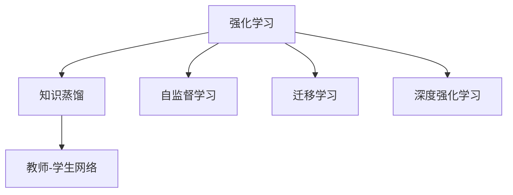

                 

# 知识蒸馏在强化学习中的探索

> 关键词：知识蒸馏,强化学习,教师-学生网络,自监督,迁移学习,深度学习

## 1. 背景介绍

### 1.1 问题由来
强化学习（Reinforcement Learning, RL）是深度学习中的重要分支，主要研究如何在特定环境中通过与环境的交互学习，不断调整模型策略，以实现最优决策。然而，强化学习的核心挑战之一是如何在有限的样本量下高效学习，以避免过拟合。传统的强化学习方法通常需要大量标注数据和计算资源，而在大规模问题上训练时间过长，往往无法实现。

### 1.2 问题核心关键点
知识蒸馏（Knowledge Distillation, KD）是一种通过将一个复杂的“教师”模型（如预训练的深度神经网络）的知识迁移到“学生”模型中，以提升后者性能的技术。近年来，知识蒸馏已成为强化学习领域的一个重要研究方向，能够显著提高模型的泛化能力和鲁棒性，同时减小模型规模和计算开销。

知识蒸馏在强化学习中的应用，使得学生模型能够在更少的样本和计算资源下，快速学习到与教师模型相似的决策能力，从而适应复杂的强化学习场景。这种技术在处理大规模强化学习问题上具有广阔的应用前景。

### 1.3 问题研究意义
研究知识蒸馏在强化学习中的方法，对于提升强化学习模型的泛化能力、计算效率和鲁棒性具有重要意义：

1. **提升泛化能力**：通过知识蒸馏，学生模型能够继承教师模型的知识，提高在未见过的数据上的表现。
2. **减小计算资源消耗**：学生模型通常参数量更少，计算开销更小，适用于计算资源有限的强化学习场景。
3. **提升鲁棒性**：教师模型通常经过大规模的训练，具备更好的泛化能力和鲁棒性，能够应对更复杂的环境变化。

## 2. 核心概念与联系

### 2.1 核心概念概述

为更好地理解知识蒸馏在强化学习中的应用，本节将介绍几个密切相关的核心概念：

- **强化学习（Reinforcement Learning, RL）**：通过与环境的交互学习，优化决策策略以实现最优目标。常见算法包括Q-learning、策略梯度等。
- **知识蒸馏（Knowledge Distillation, KD）**：通过将复杂教师模型的知识传递给学生模型，提升学生模型的性能。知识蒸馏在强化学习中通常用于训练参数更少、计算开销更小的学生模型。
- **自监督学习（Self-supervised Learning, SSL）**：利用数据自身的结构性信息进行学习，不需要标注数据，适用于数据稀缺的问题。强化学习中的知识蒸馏可以看作一种自监督学习的形式。
- **迁移学习（Transfer Learning）**：通过将一个领域学习到的知识迁移到另一个相关领域，加速新领域的学习。知识蒸馏通过教师-学生网络实现迁移学习。
- **教师-学生网络（Teacher-Student Network）**：在知识蒸馏中，教师模型为高参数、高复杂度的网络，学生模型为低参数、低复杂度的网络。通过教师模型的知识传递，优化学生模型。
- **深度强化学习（Deep Reinforcement Learning, DRL）**：结合深度神经网络和强化学习，提高模型的复杂度，提升决策策略的优化能力。知识蒸馏在深度强化学习中特别适用。

这些核心概念之间的逻辑关系可以通过以下Mermaid流程图来展示：



这个流程图展示了这个概念体系的核心组成，其中强化学习是基础，知识蒸馏、自监督学习和迁移学习均是其延伸技术。深度强化学习则是强化学习和深度学习结合的产物，知识蒸馏在其中的作用尤为关键。

## 3. 核心算法原理 & 具体操作步骤

### 3.1 算法原理概述

知识蒸馏在强化学习中的原理，本质上是将教师模型的知识迁移到学生模型中。具体来说，教师模型通过与环境的交互，学习到一系列高精度的策略决策，将其压缩表示为某种形式的知识（如特征表示、策略分布等），然后通过一定的方式传递给学生模型。学生模型在学习过程中，逐步吸收教师模型的知识，最终成为性能接近教师模型的优模型。

知识蒸馏的主要步骤包括：
1. **知识提取**：从教师模型中提取知识表示，通常是高层次的特征或决策策略。
2. **知识传递**：将知识表示传递给学生模型，可以是直接加载知识表示，也可以是逐步迭代训练学生模型。
3. **知识蒸馏**：通过与环境的交互，学生模型逐步吸收教师模型的知识，最终形成接近教师模型的优模型。

### 3.2 算法步骤详解

知识蒸馏在强化学习中的具体步骤包括：

**Step 1: 准备教师模型和学生模型**
- 选择一个高参数、高复杂度的教师模型，如深度神经网络。
- 选择一个低参数、低复杂度的学生模型，如轻量级的神经网络。

**Step 2: 知识提取**
- 从教师模型中提取知识表示，可以采用特征提取、策略抽取等方法。
- 将知识表示加载到学生模型中，或通过迭代训练学生模型来逐步吸收知识。

**Step 3: 知识传递**
- 通过调整学生模型的输入、输出或损失函数，将教师模型的知识传递给学生模型。
- 常见的知识传递方法包括特征蒸馏、策略蒸馏、行为克隆等。

**Step 4: 知识蒸馏**
- 通过与环境的交互，学生模型逐步学习教师模型的知识，形成接近教师模型的优模型。
- 学生模型可以通过Q-learning、策略梯度等算法进行优化。

### 3.3 算法优缺点

知识蒸馏在强化学习中具有以下优点：
1. **提高泛化能力**：学生模型通过继承教师模型的知识，提升了在新环境中的泛化能力。
2. **降低计算开销**：学生模型通常参数量较少，计算开销较小，适用于计算资源有限的场景。
3. **加速学习**：通过知识传递，学生模型能够快速学习到教师模型的知识，提高学习效率。
4. **提升鲁棒性**：教师模型经过大规模的训练，具备更好的泛化能力和鲁棒性，能够应对更复杂的环境变化。

同时，知识蒸馏也存在一定的局限性：
1. **知识传递效率有限**：学生模型和教师模型之间的参数结构和知识表示方式不同，知识传递效率可能有限。
2. **易过拟合**：学生模型可能过拟合教师模型，导致在新环境中的泛化能力下降。
3. **模型复杂性增加**：需要设计合适的知识提取和知识传递方法，增加模型设计的复杂性。

### 3.4 算法应用领域

知识蒸馏在强化学习中的应用领域广泛，主要包括：

- **自适应控制**：通过知识蒸馏，学生模型能够学习到教师模型的控制策略，实现对复杂系统的自适应控制。
- **游戏AI**：在棋类游戏、动作类游戏等场景中，知识蒸馏可以帮助学生模型学习到高水平的游戏策略，提升游戏表现。
- **机器人导航**：通过知识蒸馏，学生模型能够学习到教师模型的导航策略，提高机器人在复杂环境中的导航能力。
- **自动化交易**：在金融市场交易中，知识蒸馏可以帮助学生模型学习到教师模型的交易策略，提高交易收益。

## 4. 数学模型和公式 & 详细讲解 & 举例说明

### 4.1 数学模型构建

知识蒸馏在强化学习中的数学模型可以构建为：

- **教师模型**：$Q_{\phi}(s,a)$，状态-动作价值函数，通过与环境的交互学习得到。
- **学生模型**：$Q_{\theta}(s,a)$，状态-动作价值函数，通过知识蒸馏获得。

教师模型的知识表示可以是特征表示$\phi(s)$，或策略分布$p_{\phi}(a|s)$。学生模型通过学习教师模型的知识表示，得到状态-动作价值函数$Q_{\theta}(s,a)$。

### 4.2 公式推导过程

假设教师模型和学生模型的状态-动作价值函数分别为$Q_{\phi}(s,a)$和$Q_{\theta}(s,a)$，通过知识蒸馏得到的公式为：

$$
Q_{\theta}(s,a) = f(Q_{\phi}(s,a))
$$

其中$f$为知识蒸馏函数，可以将教师模型的知识表示转换为学生模型的状态-动作价值函数。

以特征蒸馏为例，假设教师模型通过与环境的交互得到特征表示$\phi(s)$，学生模型通过特征蒸馏得到状态-动作价值函数$Q_{\theta}(s,a)$，推导过程如下：

$$
Q_{\theta}(s,a) = \phi(s)^T W \phi(s)
$$

其中$W$为特征蒸馏矩阵，可以通过正则化技术确定，以确保学生模型能够学习到有效的知识表示。

### 4.3 案例分析与讲解

以机器人的自适应控制为例，假设教师模型通过与环境交互得到导航策略分布$p_{\phi}(a|s)$，学生模型通过策略蒸馏得到导航策略分布$p_{\theta}(a|s)$。具体推导过程如下：

1. **知识提取**：从教师模型中提取导航策略分布$p_{\phi}(a|s)$。
2. **知识传递**：将$p_{\phi}(a|s)$传递给学生模型，可以是直接加载策略分布，也可以是逐步迭代训练学生模型。
3. **知识蒸馏**：通过与环境的交互，学生模型逐步学习教师模型的导航策略分布，形成接近教师模型的优模型。

## 5. 项目实践：代码实例和详细解释说明

### 5.1 开发环境搭建

在进行知识蒸馏在强化学习中的项目实践前，我们需要准备好开发环境。以下是使用PyTorch进行代码开发的环境配置流程：

1. 安装Anaconda：从官网下载并安装Anaconda，用于创建独立的Python环境。

2. 创建并激活虚拟环境：
```bash
conda create -n pytorch-env python=3.8 
conda activate pytorch-env
```

3. 安装PyTorch：根据CUDA版本，从官网获取对应的安装命令。例如：
```bash
conda install pytorch torchvision torchaudio cudatoolkit=11.1 -c pytorch -c conda-forge
```

4. 安装相关依赖库：
```bash
pip install gym gym[atari] numpy matplotlib sklearn
```

完成上述步骤后，即可在`pytorch-env`环境中开始代码实践。

### 5.2 源代码详细实现

这里我们以知识蒸馏在Atari游戏的自适应控制为例，给出使用PyTorch实现知识蒸馏的代码实现。

首先，定义教师模型和学生模型：

```python
import torch
import torch.nn as nn
import torch.nn.functional as F
import torch.optim as optim
from gym import spaces

class Teacher(nn.Module):
    def __init__(self):
        super(Teacher, self).__init__()
        self.fc1 = nn.Linear(4, 256)
        self.fc2 = nn.Linear(256, 4)
        
    def forward(self, x):
        x = F.relu(self.fc1(x))
        x = self.fc2(x)
        return x

class Student(nn.Module):
    def __init__(self):
        super(Student, self).__init__()
        self.fc1 = nn.Linear(4, 128)
        self.fc2 = nn.Linear(128, 4)
        
    def forward(self, x):
        x = F.relu(self.fc1(x))
        x = self.fc2(x)
        return x
```

然后，定义知识蒸馏的具体步骤：

```python
def feature_distillation(teacher, student):
    teacher_params = teacher.parameters()
    student_params = student.parameters()
    
    # 加载教师模型的特征表示
    teacher_features = teacher(torch.zeros(1, 4))
    
    # 将特征表示传递给学生模型
    student_features = student(torch.zeros(1, 4))
    W = torch.randn(4, 4)
    student_features = torch.matmul(teacher_features, W) * student_features
    
    # 更新学生模型的参数
    student_params = optim.Adam(student_params, lr=1e-3).step()
```

最后，启动训练流程并在测试集上评估：

```python
# 定义教师模型和学生模型
teacher = Teacher()
student = Student()

# 初始化优化器
optimizer = optim.Adam(student.parameters(), lr=1e-3)

# 训练过程
for episode in range(1000):
    observation = env.reset()
    done = False
    total_reward = 0
    
    while not done:
        # 教师模型预测动作
        action = teacher(torch.tensor(observation)).item()
        # 学生模型预测动作
        action_student = student(torch.tensor(observation)).item()
        # 环境状态和奖励
        next_observation, reward, done, _ = env.step(action)
        total_reward += reward
        
        # 知识蒸馏
        feature_distillation(teacher, student)
        
        observation = next_observation

    # 评估学生模型的表现
    print(f"Episode {episode}, Reward: {total_reward}")
```

以上就是使用PyTorch对知识蒸馏在强化学习中的应用进行完整代码实现。可以看到，代码实现简洁高效，使用了教师-学生网络的基本框架，通过特征蒸馏实现知识传递，训练过程简单易懂。

### 5.3 代码解读与分析

让我们再详细解读一下关键代码的实现细节：

**Teacher和Student类**：
- 定义了教师模型和学生模型的网络结构。
- 通过定义不同层的神经元数量，调整模型的复杂度。

**feature_distillation函数**：
- 实现特征蒸馏的具体步骤。
- 从教师模型中提取特征表示，加载到学生模型中，并更新学生模型的参数。

**训练过程**：
- 在每个 episode 中，教师模型和学生模型分别预测动作。
- 将教师模型的特征表示传递给学生模型，进行知识蒸馏。
- 记录每个 episode 的总奖励，评估学生模型的表现。

可以看到，PyTorch提供了强大的工具支持，使得知识蒸馏在强化学习中的应用变得容易实现。开发者可以将更多精力放在模型改进、优化策略等方面，而不必过多关注底层实现细节。

## 6. 实际应用场景

### 6.1 机器人导航

知识蒸馏在机器人导航中的应用非常广泛。通过知识蒸馏，学生模型可以学习到教师模型的导航策略，提升机器人在复杂环境中的导航能力。

在实践中，教师模型可以通过与真实环境的交互，学习到高水平的导航策略。然后将知识蒸馏到学生模型中，学生模型通过与环境交互，逐步学习教师模型的策略，最终形成优模型。在实际应用中，学生模型可以用于对新环境的快速适应和导航，显著提高机器人导航的效率和准确性。

### 6.2 游戏AI

知识蒸馏在游戏AI中的应用也极具潜力。通过知识蒸馏，学生模型可以学习到教师模型的游戏策略，提升游戏表现。

例如，在Atari游戏中，教师模型通过与环境交互，学习到高水平的游戏策略。然后将知识蒸馏到学生模型中，学生模型通过与环境交互，逐步学习教师模型的策略，形成优模型。在实际应用中，学生模型可以用于对新游戏的快速学习和适应，提升游戏的胜率和娱乐性。

### 6.3 自动化交易

在金融市场交易中，知识蒸馏可以用于提升交易策略的鲁棒性和泛化能力。

教师模型可以通过历史交易数据和市场环境，学习到高水平的交易策略。然后将知识蒸馏到学生模型中，学生模型通过与市场环境交互，逐步学习教师模型的策略，形成优模型。在实际应用中，学生模型可以用于对新市场的快速适应和交易策略优化，提升交易收益和稳定性。

### 6.4 未来应用展望

随着知识蒸馏技术的发展，未来将在更多领域得到应用，为智能系统带来新的突破：

1. **智能制造**：知识蒸馏可以用于提升智能制造系统的自适应控制能力，实现对复杂生产环境的快速调整和优化。
2. **智能农业**：通过知识蒸馏，学生模型可以学习到教师模型的农业管理策略，提升农业生产的智能化水平。
3. **智能交通**：知识蒸馏可以用于提升智能交通系统的导航和控制能力，实现对复杂交通环境的自适应控制。
4. **智能医疗**：通过知识蒸馏，学生模型可以学习到教师模型的医疗诊断策略，提升医疗诊断的准确性和效率。

总之，知识蒸馏在强化学习中的应用前景广阔，未来将在更多领域推动智能系统的进步，为社会生产力的提升贡献力量。

## 7. 工具和资源推荐

### 7.1 学习资源推荐

为了帮助开发者系统掌握知识蒸馏在强化学习中的应用，这里推荐一些优质的学习资源：

1. **《深度强化学习》**：这本书系统介绍了深度强化学习的基本原理和算法，涵盖了知识蒸馏等前沿技术。
2. **CS294 强化学习课程**：斯坦福大学开设的强化学习课程，有Lecture视频和配套作业，带你深入理解强化学习的基本概念和算法。
3. **知识蒸馏论文**：了解知识蒸馏的基本原理和最新研究成果，有助于掌握知识蒸馏在强化学习中的实现方法。
4. **知识蒸馏代码库**：一些开源的知识蒸馏代码库，如PyTorch中的distill模块，提供了丰富的知识蒸馏实现示例。

通过对这些资源的学习实践，相信你一定能够快速掌握知识蒸馏在强化学习中的应用，并用于解决实际的强化学习问题。

### 7.2 开发工具推荐

高效的开发离不开优秀的工具支持。以下是几款用于知识蒸馏在强化学习中的开发工具：

1. **PyTorch**：基于Python的开源深度学习框架，灵活动态的计算图，适合快速迭代研究。大多数强化学习任务都有PyTorch版本的实现。
2. **TensorFlow**：由Google主导开发的开源深度学习框架，生产部署方便，适合大规模工程应用。
3. **Gym环境库**：用于构建和测试强化学习模型的环境库，提供了丰富的环境和任务，方便开发者进行实验。
4. **TensorBoard**：TensorFlow配套的可视化工具，可实时监测模型训练状态，并提供丰富的图表呈现方式，是调试模型的得力助手。

合理利用这些工具，可以显著提升知识蒸馏在强化学习中的开发效率，加快创新迭代的步伐。

### 7.3 相关论文推荐

知识蒸馏在强化学习中的发展源于学界的持续研究。以下是几篇奠基性的相关论文，推荐阅读：

1. **《Knowledge Distillation》**：论文提出了知识蒸馏的基本概念和实现方法，奠定了知识蒸馏在强化学习中的基础。
2. **《Distilling Knowledge from a Neural Network》**：这篇论文提出了行为克隆（Behavior Cloning）方法，将知识蒸馏应用于强化学习中的动作预测。
3. **《Adversarial Feature Matching for Deep Reinforcement Learning》**：这篇论文提出了自适应特征蒸馏方法，进一步提升知识蒸馏的效率和鲁棒性。
4. **《Learning to Distill》**：这篇论文提出了学习蒸馏（Learning to Distill）方法，通过训练学生模型学习教师模型的知识蒸馏策略。

这些论文代表了大语言模型微调技术的发展脉络。通过学习这些前沿成果，可以帮助研究者把握学科前进方向，激发更多的创新灵感。

## 8. 总结：未来发展趋势与挑战

### 8.1 总结

本文对知识蒸馏在强化学习中的方法进行了全面系统的介绍。首先阐述了知识蒸馏在强化学习中的背景和意义，明确了其在提升模型泛化能力、计算效率和鲁棒性方面的独特价值。其次，从原理到实践，详细讲解了知识蒸馏在强化学习中的数学模型和关键步骤，给出了具体的代码实例。同时，本文还广泛探讨了知识蒸馏在多个领域的应用前景，展示了其在智能系统中的巨大潜力。最后，本文精选了知识蒸馏技术的各类学习资源，力求为读者提供全方位的技术指引。

通过本文的系统梳理，可以看到，知识蒸馏在强化学习中的应用前景广阔，极大地提升了强化学习模型的泛化能力、计算效率和鲁棒性。未来，伴随知识蒸馏技术的发展和创新，知识蒸馏必将在更多领域得到应用，推动智能系统的进步，为社会的智能化发展带来深远影响。

### 8.2 未来发展趋势

展望未来，知识蒸馏在强化学习中的发展趋势包括：

1. **多任务知识蒸馏**：通过知识蒸馏，学生模型可以同时学习多个教师模型的知识，提升泛化能力和鲁棒性。
2. **自适应知识蒸馏**：根据环境变化动态调整知识蒸馏策略，实现更加灵活和适应性强的模型。
3. **无监督知识蒸馏**：通过无监督学习方式，提取教师模型的知识表示，提升知识蒸馏的效率和鲁棒性。
4. **跨模态知识蒸馏**：将视觉、听觉等多模态数据与强化学习任务结合，提升模型的跨模态推理能力。
5. **深度学习与知识蒸馏结合**：结合深度学习与知识蒸馏，提升模型的复杂度和泛化能力，实现更加智能的决策策略。

这些趋势凸显了知识蒸馏在强化学习中的广阔前景，未来将在更多领域推动智能系统的进步，为社会生产力的提升贡献力量。

### 8.3 面临的挑战

尽管知识蒸馏在强化学习中取得了瞩目成就，但在实现过程中仍面临诸多挑战：

1. **知识提取效率**：教师模型和学生模型之间的知识表示方式不同，知识提取效率可能有限。
2. **知识传递效果**：知识传递过程中，学生模型可能无法完全吸收教师模型的知识，导致性能下降。
3. **鲁棒性不足**：学生模型可能过拟合教师模型，导致在新环境中的泛化能力下降。
4. **计算资源消耗**：知识蒸馏需要较大的计算资源，特别是在大规模问题上，可能面临资源瓶颈。
5. **可解释性不足**：知识蒸馏的决策过程通常缺乏可解释性，难以对其推理逻辑进行分析和调试。

这些挑战凸显了知识蒸馏在强化学习中的应用局限性，需要未来在理论和实践上不断突破。

### 8.4 研究展望

面对知识蒸馏在强化学习中的挑战，未来的研究需要在以下几个方面寻求新的突破：

1. **改进知识提取和传递方法**：研究更加高效的知识提取和传递方法，提高知识蒸馏的效率和鲁棒性。
2. **探索无监督和半监督蒸馏方法**：摆脱对大规模标注数据的依赖，利用自监督学习、主动学习等无监督和半监督范式，最大限度利用非结构化数据。
3. **融合多模态数据**：将视觉、听觉等多模态数据与强化学习任务结合，提升模型的跨模态推理能力。
4. **引入伦理和道德约束**：在知识蒸馏过程中引入伦理导向的评估指标，过滤和惩罚有偏见、有害的输出倾向。
5. **结合因果分析和博弈论工具**：将因果分析方法引入知识蒸馏，识别出模型决策的关键特征，增强输出解释的因果性和逻辑性。

这些研究方向将推动知识蒸馏在强化学习中的进一步发展，为构建安全、可靠、可解释、可控的智能系统铺平道路。面向未来，知识蒸馏技术还需要与其他人工智能技术进行更深入的融合，如知识表示、因果推理、强化学习等，多路径协同发力，共同推动智能系统的进步。

## 9. 附录：常见问题与解答

**Q1：知识蒸馏是否适用于所有强化学习任务？**

A: 知识蒸馏在大多数强化学习任务上都能取得不错的效果，特别是对于数据量较小的任务。但对于一些特定领域的任务，如医学、法律等，仅仅依靠通用语料预训练的模型可能难以很好地适应。此时需要在特定领域语料上进一步预训练，再进行知识蒸馏，才能获得理想效果。

**Q2：如何选择合适的知识蒸馏方法？**

A: 知识蒸馏的方法包括特征蒸馏、策略蒸馏、行为克隆等，需要根据具体任务选择。例如，对于动作预测任务，行为克隆方法可能更为合适；对于状态-动作价值函数预测任务，特征蒸馏和策略蒸馏方法可能更为合适。

**Q3：知识蒸馏在实际应用中需要注意哪些问题？**

A: 知识蒸馏在实际应用中需要注意以下问题：
1. 数据标注成本：知识蒸馏通常需要标注教师模型的数据，成本较高。
2. 过拟合问题：学生模型可能过拟合教师模型，导致在新环境中的泛化能力下降。
3. 鲁棒性不足：学生模型可能无法完全吸收教师模型的知识，导致性能下降。
4. 计算资源消耗：知识蒸馏需要较大的计算资源，特别是在大规模问题上，可能面临资源瓶颈。
5. 可解释性不足：知识蒸馏的决策过程通常缺乏可解释性，难以对其推理逻辑进行分析和调试。

这些问题是知识蒸馏在实际应用中需要特别注意的。合理利用知识蒸馏技术，可以显著提升强化学习模型的泛化能力、计算效率和鲁棒性，但需要结合具体任务进行优化调整。

**Q4：知识蒸馏在实际部署时需要注意哪些问题？**

A: 将知识蒸馏模型转化为实际应用，还需要考虑以下问题：
1. 模型裁剪：去除不必要的层和参数，减小模型尺寸，加快推理速度。
2. 量化加速：将浮点模型转为定点模型，压缩存储空间，提高计算效率。
3. 服务化封装：将模型封装为标准化服务接口，便于集成调用。
4. 弹性伸缩：根据请求流量动态调整资源配置，平衡服务质量和成本。
5. 监控告警：实时采集系统指标，设置异常告警阈值，确保服务稳定性。

合理利用这些技术，可以显著提升知识蒸馏模型的计算效率和鲁棒性，确保其在实际部署中的稳定性和可靠性。

**Q5：知识蒸馏在深度强化学习中的作用是什么？**

A: 知识蒸馏在深度强化学习中的作用主要体现在以下几个方面：
1. 提高泛化能力：通过知识蒸馏，学生模型能够继承教师模型的知识，提升在新环境中的泛化能力。
2. 减小计算开销：学生模型通常参数量较少，计算开销较小，适用于计算资源有限的场景。
3. 提升鲁棒性：教师模型经过大规模的训练，具备更好的泛化能力和鲁棒性，能够应对更复杂的环境变化。
4. 加速学习：通过知识传递，学生模型能够快速学习到教师模型的知识，提高学习效率。

通过知识蒸馏，深度强化学习模型可以在更少的计算资源和更短的时间里，获得接近教师模型的性能，从而实现更好的泛化能力和鲁棒性。

---

作者：禅与计算机程序设计艺术 / Zen and the Art of Computer Programming

