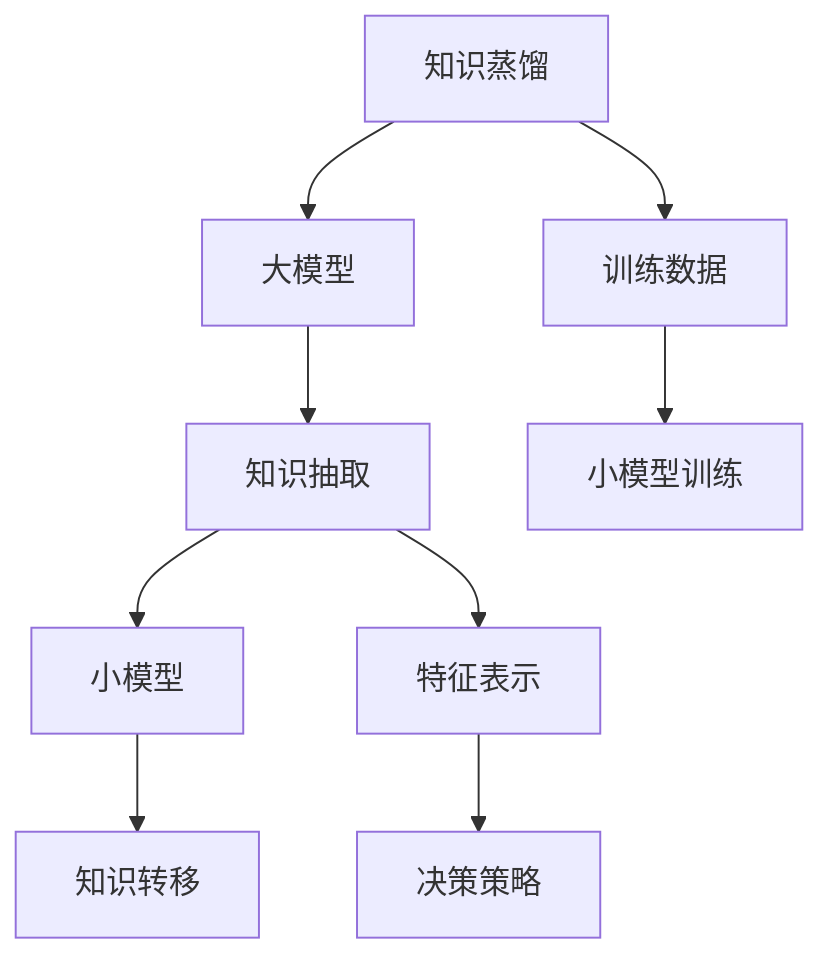

                 

# 知识蒸馏在强化学习中的探索与挑战

> 关键词：知识蒸馏,强化学习,模型压缩,迁移学习,深度学习

## 1. 背景介绍

### 1.1 问题由来
随着深度学习技术的快速发展，大模型（Large Models）在计算机视觉、自然语言处理等领域取得了显著成就。这些模型参数量庞大，通常由数十亿甚至数百亿个可训练参数组成，使得训练和推理的计算资源需求极高。然而，在实际应用中，许多场景对模型的精度要求并不一定非常高，因此如何在保证性能的同时，减少模型的计算资源消耗，成为当前研究的一个重要课题。

知识蒸馏（Knowledge Distillation）作为模型压缩的一种有效手段，通过将大模型的知识转移给参数量较少的小模型，从而在不损失性能的前提下显著降低模型复杂度。这种技术在大模型和小模型之间架起了一座桥梁，帮助小模型学习和继承大模型的知识，形成更高效的模型结构，降低计算成本，提升推理速度。

在强化学习（Reinforcement Learning, RL）中，知识蒸馏同样具有重要应用。RL的复杂性在于，如何通过试错和奖励信号，训练智能体（Agent）在特定环境中进行高效决策。相较于传统的监督学习和无监督学习，RL更接近于现实的决策过程，但也面临更复杂的问题，如如何高效地优化策略、减少样本复杂度、提高训练效率等。知识蒸馏技术在此基础上进一步提高了RL的训练效率，优化了决策策略，提升了模型的泛化能力和鲁棒性。

### 1.2 问题核心关键点
本文聚焦于知识蒸馏在强化学习中的应用，将详细讨论知识蒸馏的基本原理、具体方法、实际应用场景，并探讨当前研究面临的挑战与未来发展方向。

## 2. 核心概念与联系

### 2.1 核心概念概述

#### 2.1.1 知识蒸馏（Knowledge Distillation）
知识蒸馏是一种模型压缩技术，通过将大模型的知识（如预测能力、特征表示）转移到小模型中，从而在不损失性能的前提下降低模型的计算复杂度。知识蒸馏通常包括两个阶段：知识获取和知识转移。知识获取阶段，从大模型中抽取有用的知识，如特征表示、预测概率等；知识转移阶段，将知识转移到小模型中，使得小模型能够学习到大模型的决策能力。

#### 2.1.2 强化学习（Reinforcement Learning）
强化学习是一种通过试错和奖励信号，训练智能体在特定环境中进行高效决策的学习方法。智能体通过与环境的交互，根据当前状态和策略，选择一个行动，获得奖励或惩罚，并更新策略，以最大化长期的累积奖励。强化学习的关键在于策略优化，如何高效地学习到最优策略，是强化学习的核心问题之一。

#### 2.1.3 迁移学习（Transfer Learning）
迁移学习是一种利用领域间知识迁移，提高模型在新领域表现的方法。知识蒸馏可以看作是一种特殊的迁移学习，通过将大模型的知识转移到小模型中，使得小模型能够适应新的学习任务。

### 2.2 核心概念原理和架构的 Mermaid 流程图

以上流程图展示了知识蒸馏的基本流程：首先从大模型中获取知识（特征表示、决策策略等），然后将这些知识转移到小模型中，最终训练小模型以获得高性能决策。

### 2.3 核心概念联系
知识蒸馏、强化学习和迁移学习之间具有密切联系。知识蒸馏通过将大模型的知识转移到小模型中，使得小模型能够在新的领域或环境中表现良好，体现了迁移学习的思想。而强化学习通过试错和奖励信号训练智能体，可以看作是一种特殊的迁移学习，其目标是最大化在特定环境中的长期奖励。

## 3. 核心算法原理 & 具体操作步骤
### 3.1 算法原理概述
知识蒸馏在强化学习中的基本原理是将大模型的知识（如预测概率、特征表示等）转化为小模型的知识，从而提升小模型的决策能力。具体来说，知识蒸馏可以分为两个阶段：

1. **知识抽取阶段**：从大模型中抽取有用的知识，并将其编码成可用于小模型的形式。
2. **知识转移阶段**：将抽取的知识转移给小模型，训练小模型以使其能够准确地预测大模型的行为。

### 3.2 算法步骤详解

#### 3.2.1 知识抽取阶段
知识抽取阶段的目标是从大模型中提取有用的知识，可以采用以下几种方法：

- **特征匹配**：从大模型中提取特定的特征表示，如神经网络的中间层表示。通过对比不同层级的特征表示，选择最佳的特征表示用于知识转移。

- **特征蒸馏**：在大模型和目标模型之间进行特征对齐，使得目标模型学习到与大模型相似的特征表示。这通常包括特征映射、特征压缩等技术。

- **概率蒸馏**：通过计算大模型在特定输入下的预测概率，将其作为目标模型训练的目标。这通常用于多标签分类、序列预测等任务。

#### 3.2.2 知识转移阶段
知识转移阶段的目标是将抽取的知识传递给目标模型，训练其能够准确地预测大模型的行为。知识转移可以通过以下几种方式实现：

- **直接转移**：将抽取的特征表示或预测概率直接传递给目标模型，作为其输入或损失函数的一部分。

- **间接转移**：通过重新训练目标模型的某些层级，使其学习到大模型的知识。这通常需要优化器的配合，使得目标模型能够逐步逼近大模型的行为。

- **多任务学习**：将多个任务的知识蒸馏相结合，训练目标模型以同时适应多个任务。这有助于提升目标模型的泛化能力和鲁棒性。

### 3.3 算法优缺点
知识蒸馏在强化学习中的应用具有以下优点：

- **降低计算成本**：通过将大模型的知识传递给小模型，显著降低了计算资源的消耗。

- **提高泛化能力**：通过从大模型中学习特征表示和决策策略，小模型能够更好地适应新领域和新任务。

- **加速训练**：知识蒸馏通过利用已有知识，加速了小模型的训练过程，提高了模型在特定环境中的性能。

然而，知识蒸馏也存在以下缺点：

- **依赖高质量大模型**：知识蒸馏的效果高度依赖于大模型的质量和训练数据的质量。如果大模型本身存在问题，可能会影响知识蒸馏的效果。

- **模型复杂度降低有限**：知识蒸馏通常只能将大模型的部分知识转移到小模型中，模型的计算复杂度降低有限。

- **可解释性不足**：知识蒸馏的过程较为复杂，模型的可解释性较低，难以解释模型的决策过程。

### 3.4 算法应用领域
知识蒸馏在强化学习中的应用领域包括：

- **游戏AI**：通过知识蒸馏，将人类玩家的策略和决策能力传递给AI，提升AI在游戏中的表现。

- **智能机器人**：通过知识蒸馏，将人类专家的知识和经验传递给机器人，提升机器人的决策能力和任务执行效率。

- **自动化控制**：通过知识蒸馏，将专家系统的知识和决策能力传递给自动控制系统，提升系统的稳定性和鲁棒性。

- **智能推荐**：通过知识蒸馏，将用户行为数据和专家推荐策略传递给推荐系统，提升推荐的准确性和个性化程度。

## 4. 数学模型和公式 & 详细讲解 & 举例说明

### 4.1 数学模型构建
知识蒸馏在强化学习中的数学模型可以表示为：

$$
L_{KL}(\theta, \phi) = \mathbb{E}_{(x,y)} [KL(q_{\theta}(x) \| p_{\phi}(x))]
$$

其中，$L_{KL}$ 表示KL散度损失函数，$\theta$ 表示大模型的参数，$\phi$ 表示目标模型的参数，$(x,y)$ 表示输入和目标输出，$q_{\theta}(x)$ 表示大模型对输入的预测概率分布，$p_{\phi}(x)$ 表示目标模型对输入的预测概率分布。

### 4.2 公式推导过程
知识蒸馏的推导过程较为复杂，涉及大模型和目标模型的联合训练。以下以多标签分类任务为例，推导知识蒸馏的公式。

设大模型 $T$ 的输出为 $P_{T}$，目标模型 $S$ 的输出为 $P_{S}$，知识蒸馏的目标是最大化 $P_{S}$ 与 $P_{T}$ 的KL散度。通过引入温度参数 $\beta$，将 $P_{T}$ 转换为软标签，即：

$$
P_{T}' = \frac{P_{T}}{\beta}
$$

则知识蒸馏的目标变为：

$$
L_{KL}(\theta, \phi) = \mathbb{E}_{(x,y)} [KL(P_{S}(x) \| P_{T}'(x))]
$$

通过引入温度参数，可以将 $P_{T}'$ 看作是一个平滑的概率分布，从而避免直接蒸馏带来的噪声问题。

### 4.3 案例分析与讲解
以Reinforcement Learning中，DQN（Deep Q-Network）模型为例，探讨知识蒸馏的应用。

在DQN模型中，智能体通过与环境交互，最大化累积奖励。知识蒸馏可以用于提升DQN模型的决策能力，具体步骤如下：

1. **知识抽取**：在大模型中抽取特征表示或预测概率，并将其编码成可用于小模型的形式。

2. **知识转移**：将抽取的知识传递给小模型，训练其能够准确地预测大模型的行为。

3. **联合训练**：将大模型和小模型的输出结合，作为小模型的训练信号，提升小模型的决策能力。

例如，可以通过在大模型和小模型之间进行特征对齐，使得小模型学习到大模型的特征表示。具体步骤如下：

- **特征对齐**：在大模型的中间层和目标模型的中间层之间进行特征对齐，使得目标模型的特征表示与大模型的特征表示相似。

- **目标模型训练**：将对齐后的特征表示作为目标模型的输入，训练目标模型以预测大模型的行为。

- **联合训练**：将大模型和小模型的输出结合，作为小模型的训练信号，提升小模型的决策能力。

## 5. 项目实践：代码实例和详细解释说明

### 5.1 开发环境搭建

为了进行知识蒸馏在强化学习中的应用，我们需要准备好开发环境。以下是使用Python进行TensorFlow开发的环境配置流程：

1. 安装Anaconda：从官网下载并安装Anaconda，用于创建独立的Python环境。

2. 创建并激活虚拟环境：
```bash
conda create -n tf-env python=3.8 
conda activate tf-env
```

3. 安装TensorFlow：根据CUDA版本，从官网获取对应的安装命令。例如：
```bash
conda install tensorflow -c tf -c conda-forge
```

4. 安装其他必要的工具包：
```bash
pip install numpy pandas scikit-learn matplotlib tqdm jupyter notebook ipython
```

完成上述步骤后，即可在`tf-env`环境中开始知识蒸馏的应用实践。

### 5.2 源代码详细实现

接下来，我们以多标签分类任务为例，给出使用TensorFlow进行知识蒸馏的代码实现。

```python
import tensorflow as tf
import numpy as np

# 定义大模型
class BigModel(tf.keras.Model):
    def __init__(self):
        super(BigModel, self).__init__()
        self.dense1 = tf.keras.layers.Dense(128, activation='relu')
        self.dense2 = tf.keras.layers.Dense(64, activation='relu')
        self.dense3 = tf.keras.layers.Dense(10, activation='softmax')

    def call(self, inputs):
        x = self.dense1(inputs)
        x = self.dense2(x)
        return self.dense3(x)

# 定义小模型
class SmallModel(tf.keras.Model):
    def __init__(self):
        super(SmallModel, self).__init__()
        self.dense1 = tf.keras.layers.Dense(64, activation='relu')
        self.dense2 = tf.keras.layers.Dense(10, activation='softmax')

    def call(self, inputs):
        x = self.dense1(inputs)
        return self.dense2(x)

# 定义知识蒸馏
class Distillation(tf.keras.Model):
    def __init__(self, big_model, small_model, temperature=1.0):
        super(Distillation, self).__init__()
        self.big_model = big_model
        self.small_model = small_model
        self.temperature = temperature

    def call(self, inputs):
        big_outputs = self.big_model(inputs)
        small_outputs = self.small_model(inputs)
        big_outputs = tf.nn.softmax(big_outputs, axis=-1)
        small_outputs = tf.nn.softmax(small_outputs, axis=-1)
        kl_divergence = tf.reduce_mean(tf.reduce_sum(tf.multiply(big_outputs, tf.math.log(tf.divide(big_outputs, small_outputs) + 1e-12)))
        return kl_divergence

# 构建知识蒸馏模型
big_model = BigModel()
small_model = SmallModel()
distillation_model = Distillation(big_model, small_model)

# 定义优化器
optimizer = tf.keras.optimizers.Adam()

# 训练小模型
@tf.function
def train(distillation_model, inputs, labels, learning_rate):
    with tf.GradientTape() as tape:
        logits = distillation_model(inputs)
        loss = tf.reduce_mean(tf.nn.softmax_cross_entropy_with_logits(labels=labels, logits=logits))
        kl_loss = distillation_model(inputs)
    gradients = tape.gradient([loss, kl_loss], distillation_model.trainable_variables)
    optimizer.apply_gradients(zip(gradients, distillation_model.trainable_variables))
    return loss, kl_loss

# 定义训练数据
inputs = np.random.rand(100, 784)
labels = np.random.randint(0, 10, size=(100, 10))
for epoch in range(10):
    loss, kl_loss = train(distillation_model, inputs, labels, learning_rate=0.001)
    print("Epoch {}: Loss={:.4f}, KL Loss={:.4f}".format(epoch+1, loss.numpy(), kl_loss.numpy()))
```

以上就是使用TensorFlow进行知识蒸馏的完整代码实现。可以看到，通过定义知识蒸馏模型和联合训练函数，我们可以快速实现知识蒸馏的过程，并将其应用于多标签分类任务中。

### 5.3 代码解读与分析

让我们再详细解读一下关键代码的实现细节：

- **BigModel和SmallModel**：定义了大小两个模型，分别作为知识蒸馏的目标和源。
- **Distillation**：定义了知识蒸馏模型，用于计算大模型和小模型之间的KL散度损失。
- **train函数**：定义了联合训练函数，将大模型和小模型的输出结合，计算损失并更新参数。
- **训练数据**：生成随机数据用于训练。

以上代码展示了知识蒸馏的基本实现流程，可以方便地应用于不同的强化学习任务中。

## 6. 实际应用场景

### 6.1 智能游戏

知识蒸馏在智能游戏中的应用极为广泛。通过知识蒸馏，将人类的游戏策略和经验传递给AI，提升AI在游戏中的表现。例如，在围棋、星际争霸等复杂游戏中，知识蒸馏可以通过学习人类高手的对局记录，训练AI模型以提升其决策能力。

### 6.2 机器人导航

在机器人导航中，知识蒸馏可以帮助机器人快速适应新环境，提升导航效率。例如，通过知识蒸馏，将人类的驾驶经验和导航策略传递给机器人，提升其在复杂环境中的自主导航能力。

### 6.3 智能推荐

在智能推荐中，知识蒸馏可以用于提升推荐系统的精度和个性化程度。例如，通过知识蒸馏，将用户行为数据和专家推荐策略传递给推荐系统，提升推荐的准确性和个性化程度。

### 6.4 未来应用展望

随着知识蒸馏技术的不断发展，其在强化学习中的应用将越来越广泛。未来，知识蒸馏技术将与更多的先进技术结合，如强化学习、迁移学习、对抗训练等，形成更高效的模型压缩和优化方法，推动AI技术在各领域的落地应用。

## 7. 工具和资源推荐

### 7.1 学习资源推荐

为了帮助开发者系统掌握知识蒸馏在强化学习中的应用，这里推荐一些优质的学习资源：

1. 《Knowledge Distillation: A Survey》论文：由知识蒸馏领域的专家撰写，全面介绍了知识蒸馏的基本原理和应用场景。

2. 《Hands-On Transfer Learning with Deep Learning》书籍：全面介绍了知识蒸馏和迁移学习的基本原理和实现方法，结合实际案例进行讲解。

3. 《Deep Learning》书籍：深度学习领域的经典教材，详细介绍了深度学习的各个方面，包括知识蒸馏和强化学习。

4. 《Reinforcement Learning: An Introduction》书籍：由强化学习领域的权威专家编写，全面介绍了强化学习的各个方面，包括知识蒸馏和模型压缩。

### 7.2 开发工具推荐

高效的开发离不开优秀的工具支持。以下是几款用于知识蒸馏和强化学习开发的常用工具：

1. TensorFlow：由Google主导开发的开源深度学习框架，生产部署方便，适合大规模工程应用。

2. PyTorch：基于Python的开源深度学习框架，灵活动态的计算图，适合快速迭代研究。

3. Weights & Biases：模型训练的实验跟踪工具，可以记录和可视化模型训练过程中的各项指标，方便对比和调优。

4. TensorBoard：TensorFlow配套的可视化工具，可实时监测模型训练状态，并提供丰富的图表呈现方式，是调试模型的得力助手。

5. Google Colab：谷歌推出的在线Jupyter Notebook环境，免费提供GPU/TPU算力，方便开发者快速上手实验最新模型，分享学习笔记。

### 7.3 相关论文推荐

知识蒸馏和强化学习的研究源于学界的持续研究。以下是几篇奠基性的相关论文，推荐阅读：

1. Distilling the Knowledge in a Neural Network（原知识蒸馏论文）：提出了知识蒸馏的基本框架，展示了如何将大模型的知识传递给小模型。

2. Learning Multiple Tasks with Generative Adversarial Networks（生成对抗网络）：提出了通过生成对抗网络进行模型压缩和知识蒸馏的方法。

3. Multi-Task Learning Using Knowledge Distillation（多任务学习）：展示了知识蒸馏在多任务学习中的应用，提升了模型的泛化能力和鲁棒性。

4. Improving Generalization with Knowledge Distillation（提升泛化能力）：展示了知识蒸馏在提升模型泛化能力方面的应用。

5. MAML: A Simple Optimization Technique for Generative Adversarial Networks（梯度下降优化）：展示了如何通过梯度下降优化实现模型压缩和知识蒸馏。

这些论文代表了大语言模型微调技术的发展脉络。通过学习这些前沿成果，可以帮助研究者把握学科前进方向，激发更多的创新灵感。

## 8. 总结：未来发展趋势与挑战

### 8.1 总结

本文对知识蒸馏在强化学习中的应用进行了全面系统的介绍。首先阐述了知识蒸馏的基本原理和核心概念，明确了知识蒸馏在降低计算资源消耗、提高模型泛化能力方面的独特价值。其次，从原理到实践，详细讲解了知识蒸馏的数学模型和算法步骤，给出了知识蒸馏任务开发的完整代码实例。同时，本文还广泛探讨了知识蒸馏技术在智能游戏、机器人导航、智能推荐等多个行业领域的应用前景，展示了知识蒸馏范式的巨大潜力。此外，本文精选了知识蒸馏技术的各类学习资源，力求为读者提供全方位的技术指引。

通过本文的系统梳理，可以看到，知识蒸馏在强化学习中的应用已经较为成熟，并在各个领域得到了广泛应用。未来，伴随知识蒸馏技术的不断演进，相信其在各个领域的应用将会更加广泛，为人类认知智能的进化带来深远影响。

### 8.2 未来发展趋势

展望未来，知识蒸馏技术在强化学习中的应用将呈现以下几个发展趋势：

1. **多任务蒸馏**：通过将多个任务的知识蒸馏相结合，训练模型以同时适应多个任务。这有助于提升模型的泛化能力和鲁棒性。

2. **深度蒸馏**：通过在大模型和小模型之间进行深度特征对齐，提升小模型的决策能力和泛化能力。

3. **自适应蒸馏**：通过自适应蒸馏策略，动态调整知识蒸馏的强度和时间，提升知识蒸馏的效果。

4. **模型融合**：通过将知识蒸馏与其他模型压缩技术（如模型剪枝、神经网络压缩等）相结合，形成更高效的模型压缩方法。

5. **元学习蒸馏**：通过元学习蒸馏方法，提升模型在新领域的快速适应能力，推动模型的迁移学习。

这些趋势凸显了知识蒸馏技术的广阔前景。这些方向的探索发展，必将进一步提升强化学习模型的性能和应用范围，为构建人机协同的智能系统铺平道路。

### 8.3 面临的挑战

尽管知识蒸馏在强化学习中的应用已经取得了显著成效，但在迈向更加智能化、普适化应用的过程中，它仍面临诸多挑战：

1. **数据依赖**：知识蒸馏的效果高度依赖于大模型的质量和训练数据的质量。如何在大模型数据不足的情况下，仍然能获得高质量的知识蒸馏效果，是当前研究的重要挑战之一。

2. **模型复杂度**：知识蒸馏通常只能将大模型的部分知识转移到小模型中，模型的计算复杂度降低有限。如何进一步降低模型复杂度，是未来研究的重要方向。

3. **可解释性不足**：知识蒸馏的过程较为复杂，模型的可解释性较低，难以解释模型的决策过程。如何在保证知识蒸馏效果的同时，提升模型的可解释性，是未来研究的重要方向之一。

4. **优化效率**：知识蒸馏通常需要进行联合训练，计算量较大。如何在保证知识蒸馏效果的同时，提升优化效率，是未来研究的重要方向。

5. **鲁棒性不足**：知识蒸馏模型在面对新的数据分布时，泛化性能可能下降。如何提升知识蒸馏模型的鲁棒性，是未来研究的重要方向。

### 8.4 研究展望

面对知识蒸馏在强化学习中所面临的挑战，未来的研究需要在以下几个方面寻求新的突破：

1. **多任务蒸馏**：通过多任务蒸馏方法，提升模型的泛化能力和鲁棒性，推动模型的迁移学习。

2. **深度蒸馏**：通过深度蒸馏方法，提升小模型的决策能力和泛化能力，推动模型的优化。

3. **自适应蒸馏**：通过自适应蒸馏策略，动态调整知识蒸馏的强度和时间，提升知识蒸馏的效果。

4. **模型融合**：通过模型融合方法，将知识蒸馏与其他模型压缩技术相结合，形成更高效的模型压缩方法。

5. **元学习蒸馏**：通过元学习蒸馏方法，提升模型在新领域的快速适应能力，推动模型的迁移学习。

这些研究方向的探索，必将引领知识蒸馏技术迈向更高的台阶，为构建安全、可靠、可解释、可控的智能系统铺平道路。

## 9. 附录：常见问题与解答

**Q1: 知识蒸馏在强化学习中的应用有哪些？**

A: 知识蒸馏在强化学习中的应用非常广泛，可以用于提升模型的决策能力、泛化能力和鲁棒性。具体应用包括：

- **智能游戏**：通过知识蒸馏，将人类的游戏策略和经验传递给AI，提升AI在游戏中的表现。

- **机器人导航**：通过知识蒸馏，将人类的驾驶经验和导航策略传递给机器人，提升其在复杂环境中的自主导航能力。

- **智能推荐**：通过知识蒸馏，将用户行为数据和专家推荐策略传递给推荐系统，提升推荐的准确性和个性化程度。

- **医疗诊断**：通过知识蒸馏，将医生的诊断知识和经验传递给AI，提升AI在医疗诊断中的表现。

- **金融投资**：通过知识蒸馏，将金融专家的投资策略和知识传递给AI，提升AI在金融投资中的决策能力。

**Q2: 知识蒸馏的实现步骤有哪些？**

A: 知识蒸馏的实现步骤通常包括：

1. **知识抽取**：从大模型中抽取有用的知识，如特征表示、预测概率等。

2. **知识转移**：将抽取的知识传递给小模型，训练其能够准确地预测大模型的行为。

3. **联合训练**：将大模型和小模型的输出结合，作为小模型的训练信号，提升小模型的决策能力。

4. **模型优化**：通过优化器的配合，使得小模型逐步逼近大模型的行为，提升小模型的泛化能力和鲁棒性。

**Q3: 知识蒸馏的缺点有哪些？**

A: 知识蒸馏在强化学习中也存在一些缺点，主要包括：

1. **依赖高质量大模型**：知识蒸馏的效果高度依赖于大模型的质量和训练数据的质量。如果大模型本身存在问题，可能会影响知识蒸馏的效果。

2. **模型复杂度降低有限**：知识蒸馏通常只能将大模型的部分知识转移到小模型中，模型的计算复杂度降低有限。

3. **可解释性不足**：知识蒸馏的过程较为复杂，模型的可解释性较低，难以解释模型的决策过程。

4. **优化效率不足**：知识蒸馏通常需要进行联合训练，计算量较大，优化效率较低。

**Q4: 知识蒸馏的优点有哪些？**

A: 知识蒸馏在强化学习中也具有以下优点：

1. **降低计算成本**：通过将大模型的知识传递给小模型，显著降低了计算资源的消耗。

2. **提高泛化能力**：通过从大模型中学习特征表示和决策策略，小模型能够更好地适应新领域和新任务。

3. **加速训练**：知识蒸馏通过利用已有知识，加速了小模型的训练过程，提高了模型在特定环境中的性能。

**Q5: 如何缓解知识蒸馏中的过拟合问题？**

A: 知识蒸馏中的过拟合问题可以通过以下方法缓解：

1. **数据增强**：通过回译、近义替换等方式扩充训练集。

2. **正则化**：使用L2正则、Dropout、Early Stopping等避免过拟合。

3. **对抗训练**：加入对抗样本，提高模型鲁棒性。

4. **参数高效蒸馏**：只调整少量参数，减小过拟合风险。

5. **多任务蒸馏**：通过多任务蒸馏方法，提升模型的泛化能力和鲁棒性，推动模型的迁移学习。

这些方法可以灵活组合，缓解知识蒸馏中的过拟合问题，提升知识蒸馏的效果。

**Q6: 知识蒸馏在强化学习中的应用场景有哪些？**

A: 知识蒸馏在强化学习中的应用场景包括：

- **智能游戏**：通过知识蒸馏，将人类的游戏策略和经验传递给AI，提升AI在游戏中的表现。

- **机器人导航**：通过知识蒸馏，将人类的驾驶经验和导航策略传递给机器人，提升其在复杂环境中的自主导航能力。

- **智能推荐**：通过知识蒸馏，将用户行为数据和专家推荐策略传递给推荐系统，提升推荐的准确性和个性化程度。

- **医疗诊断**：通过知识蒸馏，将医生的诊断知识和经验传递给AI，提升AI在医疗诊断中的表现。

- **金融投资**：通过知识蒸馏，将金融专家的投资策略和知识传递给AI，提升AI在金融投资中的决策能力。

通过本文的系统梳理，可以看到，知识蒸馏在强化学习中的应用已经较为成熟，并在各个领域得到了广泛应用。未来，伴随知识蒸馏技术的不断演进，相信其在各个领域的应用将会更加广泛，为人类认知智能的进化带来深远影响。

---

作者：禅与计算机程序设计艺术 / Zen and the Art of Computer Programming

