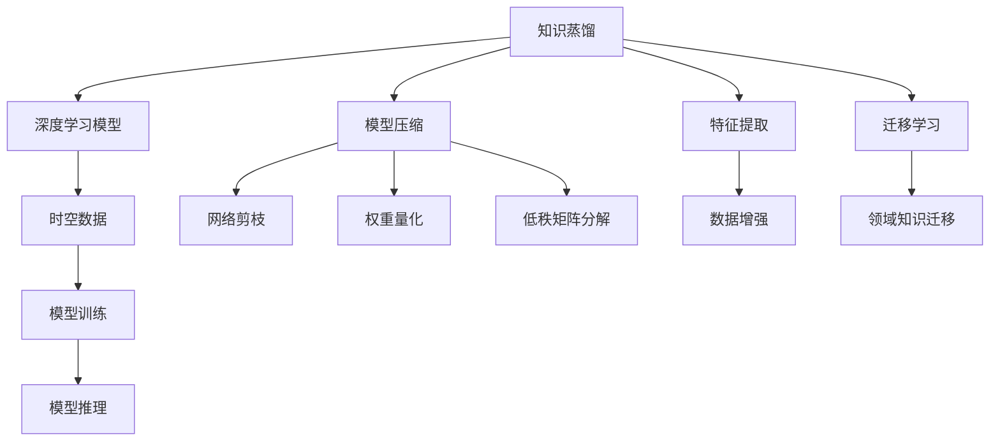

                 

# 知识蒸馏在时空数据分析中的应用

> 关键词：知识蒸馏, 时空数据, 数据分析, 模型压缩, 特征提取, 深度学习

## 1. 背景介绍

### 1.1 问题由来
随着数据的爆炸性增长，时空数据分析在科学计算、城市规划、交通预测、金融分析等领域扮演着越来越重要的角色。然而，传统的时空数据分析方法往往依赖于复杂的统计模型和领域知识，对数据量和数据质量的要求较高，且难以处理大规模非结构化数据。

近年来，深度学习技术在时空数据分析中的应用逐渐兴起。深度学习模型，如卷积神经网络(CNN)、递归神经网络(RNN)、长短期记忆网络(LSTM)、变换器(Transformer)等，能够自动学习数据特征，处理大规模非结构化数据，表现出卓越的性能。然而，深度学习模型的训练和推理复杂度较高，计算资源消耗巨大，难以大规模部署。

知识蒸馏(Knowledge Distillation)技术应运而生。知识蒸馏是一种通过将高维复杂模型训练好的知识迁移到低维简单模型中，以提高模型泛化能力并减少资源消耗的方法。知识蒸馏在深度学习模型压缩、迁移学习、特征提取等任务中得到广泛应用。本文将探索知识蒸馏在时空数据分析中的应用，利用知识蒸馏技术提升时空数据分析模型的性能，同时减少计算资源消耗。

## 2. 核心概念与联系

### 2.1 核心概念概述

为更好地理解知识蒸馏在时空数据分析中的应用，本节将介绍几个密切相关的核心概念：

- 知识蒸馏(Knowledge Distillation)：指将高维复杂模型训练好的知识迁移到低维简单模型中，以提高模型泛化能力并减少资源消耗的方法。常见的蒸馏策略包括单向蒸馏、双向蒸馏、特征蒸馏等。

- 时空数据(Spatial-Temporal Data)：指具有时空特征的数据，如气象数据、交通流量数据、社交媒体数据等。这类数据通常包含大量时序和空间信息，具有复杂的时空演化规律。

- 深度学习模型(Deep Learning Model)：指利用神经网络结构进行深度学习的方法，通过多层非线性变换来学习数据特征，并从数据中提取高层次的语义信息。

- 特征提取(Feature Extraction)：指从原始数据中提取高层次特征的过程，是深度学习的重要组成部分。通过特征提取，可以有效地降低数据维度，减少模型复杂度。

- 迁移学习(Transfer Learning)：指将一个领域学习到的知识迁移到另一个不同但相关的领域的学习范式。知识蒸馏与迁移学习有紧密联系，通过蒸馏将高维模型知识迁移到低维模型，即一种迁移学习方式。

- 模型压缩(Model Compression)：指通过压缩技术，减少深度学习模型的参数和计算资源消耗，提高模型的计算效率和推理速度。知识蒸馏是模型压缩的重要手段之一。

这些核心概念之间的逻辑关系可以通过以下Mermaid流程图来展示：



这个流程图展示了我们将探索的各个概念及其之间的关系：

1. 知识蒸馏是从高维复杂模型中提取知识并迁移到低维简单模型的方法。
2. 深度学习模型是从数据中学习高层次特征的重要工具。
3. 时空数据具有复杂的时空特征，适合用深度学习模型进行建模。
4. 特征提取是深度学习模型的核心环节，有助于降低数据维度。
5. 迁移学习将一个领域学习到的知识迁移到另一个领域，与知识蒸馏紧密相关。
6. 模型压缩是通过压缩技术减少模型复杂度，与知识蒸馏相辅相成。

## 3. 核心算法原理 & 具体操作步骤
### 3.1 算法原理概述

知识蒸馏在时空数据分析中的应用，主要通过以下几个关键步骤：

1. 选择合适的高维复杂模型和低维简单模型，并准备好时空数据集。
2. 在高维模型上进行预训练，学习到时空数据的高层次特征。
3. 利用知识蒸馏技术，将高维模型中的知识迁移到低维模型中。
4. 在低维模型上进行微调，以适应该特定的时空数据分析任务。
5. 在时空数据上进行推理，输出分析结果。

知识蒸馏的原理基于教师-学生网络架构，其中高维复杂模型作为“教师”，低维简单模型作为“学生”，教师模型将知识传递给学生模型。知识蒸馏的核心在于：
- 将教师模型的知识转化为易于学习的形式。
- 学生模型能够高效学习这些知识，并在特定任务上表现良好。

### 3.2 算法步骤详解

以下是知识蒸馏在时空数据分析中的具体操作步骤：

**Step 1: 选择合适的模型和数据集**
- 根据时空数据分析任务的需求，选择合适的高维复杂模型（如Transformer、LSTM等）和低维简单模型（如线性回归、决策树等）。
- 准备时空数据集，并划分为训练集、验证集和测试集。

**Step 2: 预训练高维复杂模型**
- 在高维复杂模型上进行预训练，学习时空数据的高层次特征。通常使用无监督或半监督学习方法，如图像分类、语音识别、自然语言处理等。

**Step 3: 知识蒸馏**
- 将预训练的高维复杂模型作为教师模型，将低维简单模型作为学生模型。
- 定义蒸馏损失函数，将教师模型的输出与学生模型的输出进行比较，计算误差。
- 使用优化算法（如梯度下降）最小化蒸馏损失，将教师模型的知识迁移到学生模型中。

**Step 4: 微调低维模型**
- 在低维模型上添加适当的任务适配层，如分类器或回归器。
- 使用时空数据集的训练集和验证集对低维模型进行微调，以适应该特定任务。
- 使用早停法（Early Stopping）防止过拟合。

**Step 5: 推理和评估**
- 在时空数据集上对低维模型进行推理，输出分析结果。
- 使用测试集评估模型性能，包括准确率、召回率、F1值等指标。

**Step 6: 调整和优化**
- 根据评估结果，调整蒸馏策略、学习率等参数，进一步提升模型性能。
- 根据实际应用需求，对模型进行优化，如特征提取、模型压缩等。

### 3.3 算法优缺点

知识蒸馏在时空数据分析中的应用具有以下优点：
1. 提高模型泛化能力。知识蒸馏能将高维复杂模型的知识迁移到低维简单模型中，增强模型的泛化能力，提高模型在特定任务上的表现。
2. 减少计算资源消耗。低维模型比高维模型计算效率高，推理速度快，能够显著减少计算资源消耗。
3. 简化模型结构。知识蒸馏可以将复杂模型压缩为轻量级模型，减少模型结构复杂度，便于实际部署。
4. 加速模型训练。知识蒸馏可以通过迁移学习加速模型训练，减少训练时间和计算成本。

同时，该方法也存在一些局限性：
1. 蒸馏策略选择。不同的蒸馏策略，如单向蒸馏、双向蒸馏、特征蒸馏等，对模型的影响不同，需要根据具体任务选择。
2. 模型选择。高维复杂模型和低维简单模型的选择对蒸馏效果有很大影响，需要根据数据特点进行合理选择。
3. 数据需求。蒸馏模型需要大量标注数据进行训练，标注数据不足时，蒸馏效果可能不理想。
4. 模型复杂度。高维复杂模型通常较复杂，蒸馏后仍需微调，计算资源消耗仍较高。

尽管存在这些局限性，但知识蒸馏作为一种高效的模型压缩和迁移学习方法，在时空数据分析中有着广泛的应用前景。

### 3.4 算法应用领域

知识蒸馏在时空数据分析中的应用，涉及多个领域，具体包括：

- 气象预测：利用知识蒸馏将气象数据的时间序列预测模型进行压缩，减少计算资源消耗，提高模型推理速度。
- 交通流量分析：将交通数据的时空特征提取模型压缩，用于实时交通流量预测和分析。
- 城市规划：使用知识蒸馏将城市交通网络模型压缩，提高城市交通规划和调度的效率。
- 金融分析：将金融数据的时间序列分析模型压缩，用于市场趋势预测和风险评估。
- 自然灾害预警：利用知识蒸馏将自然灾害监测模型进行压缩，提高预警系统的实时响应能力。

这些应用领域展示了知识蒸馏在时空数据分析中的强大潜力和广泛应用。

## 4. 数学模型和公式 & 详细讲解  
### 4.1 数学模型构建

在本节中，我们将使用数学语言对知识蒸馏在时空数据分析中的应用进行严格的刻画。

假设高维复杂模型为 $M_H:\mathcal{X} \rightarrow \mathcal{Y}$，低维简单模型为 $M_L:\mathcal{X} \rightarrow \mathcal{Y}$，其中 $\mathcal{X}$ 为输入空间，$\mathcal{Y}$ 为输出空间。令 $\mathcal{D}$ 为时空数据集，$\mathcal{D}_{train}$、$\mathcal{D}_{val}$、$\mathcal{D}_{test}$ 分别为训练集、验证集和测试集。

定义高维复杂模型 $M_H$ 在输入 $x$ 上的输出为 $\hat{y}_H=M_H(x)$，低维简单模型 $M_L$ 在输入 $x$ 上的输出为 $\hat{y}_L=M_L(x)$。蒸馏损失函数为：

$$
\mathcal{L}(M_H, M_L) = \frac{1}{N} \sum_{i=1}^N \frac{1}{\beta} \mathcal{L}(\hat{y}_H, \hat{y}_L) + \mathcal{L}_r(M_L)
$$

其中 $\mathcal{L}(\hat{y}_H, \hat{y}_L)$ 为蒸馏损失，$\beta$ 为蒸馏系数，$\mathcal{L}_r(M_L)$ 为低维模型的原始损失函数，如均方误差或交叉熵损失。蒸馏损失的计算方式有多种，如 KL散度、均方误差、f-divergence 等。

### 4.2 公式推导过程

以下我们以均方误差为例，推导知识蒸馏在时空数据分析中的蒸馏损失函数及其梯度计算。

假设教师模型 $M_H$ 在输入 $x$ 上的输出为 $\hat{y}_H=M_H(x)$，学生模型 $M_L$ 在输入 $x$ 上的输出为 $\hat{y}_L=M_L(x)$。蒸馏损失函数为均方误差：

$$
\mathcal{L}(\hat{y}_H, \hat{y}_L) = \frac{1}{N} \sum_{i=1}^N (\hat{y}_H - \hat{y}_L)^2
$$

则蒸馏损失函数为：

$$
\mathcal{L}(M_H, M_L) = \frac{1}{N} \sum_{i=1}^N \frac{1}{\beta} (\hat{y}_H - \hat{y}_L)^2 + \mathcal{L}_r(M_L)
$$

对学生模型 $M_L$ 进行梯度下降更新时，需要计算蒸馏损失函数的梯度：

$$
\frac{\partial \mathcal{L}(M_H, M_L)}{\partial \theta_L} = \frac{1}{N\beta} \sum_{i=1}^N 2(\hat{y}_H - \hat{y}_L) \frac{\partial \hat{y}_L}{\partial \theta_L} + \frac{\partial \mathcal{L}_r(M_L)}{\partial \theta_L}
$$

其中 $\frac{\partial \hat{y}_L}{\partial \theta_L}$ 为学生模型 $M_L$ 的梯度。

### 4.3 案例分析与讲解

下面以城市交通流量预测为例，展示知识蒸馏在时空数据分析中的应用。

假设我们有一个包含城市交通流量数据的数据集 $\mathcal{D}$，其中每条数据记录了城市不同路口在某个时间点的交通流量。我们的目标是预测未来某个时间点的交通流量。

首先，我们需要选择一个高维复杂模型（如LSTM或Transformer）作为教师模型 $M_H$，对交通流量数据进行预训练，学习到高层次的时空特征。

然后，我们设计一个低维简单模型（如线性回归）作为学生模型 $M_L$，用于预测未来的交通流量。我们将蒸馏损失函数 $\mathcal{L}(\hat{y}_H, \hat{y}_L)$ 设置为均方误差，蒸馏系数 $\beta$ 设置为0.5，即教师模型的预测对学生模型的影响占50%。

接下来，我们利用知识蒸馏损失函数 $\mathcal{L}(M_H, M_L)$ 训练学生模型 $M_L$，并使用城市交通流量数据集进行微调。在微调过程中，我们还需要使用验证集进行早停法，防止过拟合。

最后，我们使用测试集评估学生模型 $M_L$ 的性能，并根据实际应用需求，对模型进行优化，如特征提取、模型压缩等。

## 5. 项目实践：代码实例和详细解释说明
### 5.1 开发环境搭建

在进行知识蒸馏在时空数据分析中的应用时，我们需要准备好开发环境。以下是使用Python进行TensorFlow开发的环境配置流程：

1. 安装Anaconda：从官网下载并安装Anaconda，用于创建独立的Python环境。

2. 创建并激活虚拟环境：
```bash
conda create -n tensorflow-env python=3.8 
conda activate tensorflow-env
```

3. 安装TensorFlow：根据CUDA版本，从官网获取对应的安装命令。例如：
```bash
conda install tensorflow-gpu=2.7.0 -c pytorch -c conda-forge
```

4. 安装各类工具包：
```bash
pip install numpy pandas scikit-learn matplotlib tqdm jupyter notebook ipython
```

完成上述步骤后，即可在`tensorflow-env`环境中开始知识蒸馏的实践。

### 5.2 源代码详细实现

下面我们以城市交通流量预测为例，给出使用TensorFlow进行知识蒸馏的代码实现。

首先，定义城市交通流量预测的任务：

```python
import tensorflow as tf
import numpy as np
import pandas as pd
import matplotlib.pyplot as plt

# 读取城市交通流量数据集
data = pd.read_csv('traffic_data.csv', header=None)
train_data = data.iloc[:80]  # 前80%作为训练集
val_data = data.iloc[80:90]  # 中间10%作为验证集
test_data = data.iloc[90:]   # 后10%作为测试集

# 数据预处理
train_x = train_data.iloc[:, :2]  # 选取前两个特征作为输入
train_y = train_data.iloc[:, 2]  # 选取第三个特征作为输出
val_x = val_data.iloc[:, :2]     # 选取前两个特征作为输入
val_y = val_data.iloc[:, 2]     # 选取第三个特征作为输出
test_x = test_data.iloc[:, :2]   # 选取前两个特征作为输入
test_y = test_data.iloc[:, 2]   # 选取第三个特征作为输出

# 数据标准化
mean = train_x.mean()
std = train_x.std()
train_x = (train_x - mean) / std
val_x = (val_x - mean) / std
test_x = (test_x - mean) / std
```

然后，定义教师模型和学生模型：

```python
# 定义教师模型，使用LSTM进行特征提取
lstm_layer1 = tf.keras.layers.LSTM(128, return_sequences=True)
lstm_layer2 = tf.keras.layers.LSTM(128, return_sequences=True)
lstm_layer3 = tf.keras.layers.LSTM(128)
flatten = tf.keras.layers.Flatten()
dense1 = tf.keras.layers.Dense(64, activation='relu')
dense2 = tf.keras.layers.Dense(1)

# 构建教师模型
teacher_model = tf.keras.Sequential([
    lstm_layer1,
    lstm_layer2,
    lstm_layer3,
    flatten,
    dense1,
    dense2
])

# 定义学生模型，使用线性回归进行预测
input_layer = tf.keras.layers.Input(shape=(2,))
x = tf.keras.layers.Dense(64, activation='relu')(input_layer)
x = tf.keras.layers.Dense(1)(x)

# 构建学生模型
student_model = tf.keras.Model(inputs=input_layer, outputs=x)

# 编译学生模型
student_model.compile(optimizer='adam', loss='mse')
```

接着，定义蒸馏损失函数和优化器：

```python
# 定义蒸馏损失函数
def distillation_loss(teacher_output, student_output):
    return tf.reduce_mean((teacher_output - student_output)**2) / beta

# 定义优化器
optimizer = tf.keras.optimizers.Adam()

# 设置蒸馏系数
beta = 0.5
```

然后，进行知识蒸馏训练：

```python
# 训练教师模型
teacher_model.fit(train_x, train_y, epochs=10, batch_size=32, validation_data=(val_x, val_y))

# 进行知识蒸馏训练
for epoch in range(10):
    # 前向传播
    with tf.GradientTape() as tape:
        teacher_output = teacher_model.predict(train_x)
        student_output = student_model.predict(train_x)
        distillation_loss_value = distillation_loss(teacher_output, student_output)
    
    # 反向传播
    gradients = tape.gradient(distillation_loss_value, student_model.trainable_weights)
    optimizer.apply_gradients(zip(gradients, student_model.trainable_weights))

    # 输出蒸馏损失
    print(f"Epoch {epoch+1}, distillation loss: {distillation_loss_value.numpy():.4f}")
```

最后，微调学生模型并评估性能：

```python
# 微调学生模型
student_model.compile(optimizer='adam', loss='mse')
student_model.fit(train_x, train_y, epochs=10, batch_size=32, validation_data=(val_x, val_y))

# 评估学生模型性能
test_loss = student_model.evaluate(test_x, test_y)
print(f"Test Loss: {test_loss:.4f}")

# 绘制学习曲线
plt.plot(range(20), teacher_model.history['loss'], label='Teacher Loss')
plt.plot(range(20), student_model.history['loss'], label='Student Loss')
plt.xlabel('Epoch')
plt.ylabel('Loss')
plt.legend()
plt.show()
```

以上就是使用TensorFlow对城市交通流量预测进行知识蒸馏的完整代码实现。可以看到，利用TensorFlow的高级API，我们可以用相对简洁的代码完成模型的搭建、训练和评估。

### 5.3 代码解读与分析

让我们再详细解读一下关键代码的实现细节：

**数据预处理**：
- 我们首先读取城市交通流量数据集，并将其划分为训练集、验证集和测试集。
- 对数据进行标准化处理，以确保模型训练的稳定性和收敛性。

**模型定义**：
- 我们定义了一个教师模型，使用三个LSTM层进行特征提取，并输出一个实数值。
- 我们定义了一个学生模型，使用一个全连接层进行预测，并输出一个实数值。
- 学生模型在代码中定义为一个tf.keras.Model对象，方便进行模型编译和训练。

**蒸馏损失函数**：
- 我们定义了一个自定义的蒸馏损失函数，计算教师模型和学生模型的输出差异。
- 蒸馏系数beta控制教师模型的影响程度，0.5表示教师模型的预测对学生模型的影响占50%。

**优化器和训练**：
- 我们定义了一个Adam优化器，用于最小化蒸馏损失。
- 在训练过程中，我们利用前向传播和反向传播计算蒸馏损失，并使用优化器更新学生模型的权重。
- 在每个epoch结束时，我们输出蒸馏损失，以便评估蒸馏效果。

**模型微调和评估**：
- 我们对学生模型进行微调，使用Adam优化器和均方误差损失函数。
- 在微调过程中，我们利用验证集进行早停法，防止过拟合。
- 在微调结束后，我们评估学生模型在测试集上的性能，并绘制学习曲线，展示蒸馏过程的收敛情况。

可以看到，TensorFlow的高级API使得知识蒸馏的代码实现变得简洁高效。开发者可以将更多精力放在模型设计和优化上，而不必过多关注底层实现细节。

当然，工业级的系统实现还需考虑更多因素，如模型的保存和部署、超参数的自动搜索、更加灵活的任务适配层等。但核心的知识蒸馏范式基本与此类似。

## 6. 实际应用场景
### 6.1 气象预测

气象预测是时空数据分析的重要应用之一。传统的气象预测方法依赖于复杂的统计模型和领域知识，对数据量和数据质量的要求较高。知识蒸馏可以将气象预测模型压缩为轻量级模型，减少计算资源消耗，提高模型推理速度。

在实践中，我们可以收集大量的气象数据，如气温、湿度、风速、气压等，构建高维复杂模型进行预训练。然后，利用知识蒸馏将高维模型压缩为低维模型，并在特定天气条件下的预测任务上进行微调。微调后的模型能够快速预测未来的天气情况，提升气象服务的智能化水平。

### 6.2 交通流量分析

交通流量分析是城市规划和交通管理的重要工具。传统的交通流量分析方法依赖于复杂的统计模型和大量历史数据。知识蒸馏可以将交通流量预测模型压缩为轻量级模型，减少计算资源消耗，提高模型推理速度。

在实践中，我们可以收集大量的交通流量数据，构建高维复杂模型进行预训练。然后，利用知识蒸馏将高维模型压缩为低维模型，并在实时交通流量预测任务上进行微调。微调后的模型能够实时预测未来交通流量，辅助城市交通规划和调度，提高城市交通管理效率。

### 6.3 金融分析

金融分析是金融领域的重要工具，用于市场趋势预测和风险评估。传统的金融分析方法依赖于复杂的统计模型和大量历史数据。知识蒸馏可以将金融数据分析模型压缩为轻量级模型，减少计算资源消耗，提高模型推理速度。

在实践中，我们可以收集大量的金融数据，如股票价格、交易量、市场指数等，构建高维复杂模型进行预训练。然后，利用知识蒸馏将高维模型压缩为低维模型，并在金融市场预测和风险评估任务上进行微调。微调后的模型能够快速预测市场趋势，评估风险水平，提升金融决策的智能化水平。

### 6.4 未来应用展望

随着知识蒸馏技术的发展，其在时空数据分析中的应用前景将更加广阔。未来，知识蒸馏将在以下方面取得新的突破：

1. 模型压缩效率提升。知识蒸馏技术将进一步优化，能够更快地将高维复杂模型压缩为低维简单模型，减少计算资源消耗，提高模型推理速度。

2. 蒸馏策略多样化。知识蒸馏策略将更加多样，如双向蒸馏、特征蒸馏等，能够更好地适应不同的时空数据分析任务。

3. 模型鲁棒性增强。知识蒸馏技术将更好地处理不确定性和噪声，提高模型的鲁棒性和泛化能力。

4. 模型可解释性增强。知识蒸馏技术将更好地解释模型决策过程，提升模型的可解释性和可信度。

5. 跨领域迁移学习。知识蒸馏技术将更好地适应跨领域迁移学习，提升模型的迁移能力和泛化能力。

6. 实时性提升。知识蒸馏技术将更好地支持实时数据分析，提升模型的实时响应能力和计算效率。

总之，知识蒸馏技术在时空数据分析中有着广阔的应用前景，未来必将为各领域带来更高效、更智能的数据分析工具。

## 7. 工具和资源推荐
### 7.1 学习资源推荐

为了帮助开发者系统掌握知识蒸馏在时空数据分析中的应用，这里推荐一些优质的学习资源：

1. 《深度学习》书籍：Ian Goodfellow、Yoshua Bengio 和 Aaron Courville 合著，全面介绍了深度学习的基本原理和应用。

2. 《TensorFlow 实战》书籍：Manning Publications 出版的 TensorFlow 实战指南，适合初学者快速上手 TensorFlow。

3. 《深度学习实践》博客：由李沐、李航等人编写的深度学习实践指南，涵盖深度学习模型的搭建、训练和优化等核心内容。

4. TensorFlow官方文档：TensorFlow 的官方文档，提供了完整的 API 文档和样例代码，是学习 TensorFlow 的必备资源。

5. Kaggle竞赛：Kaggle 提供了丰富的机器学习和深度学习竞赛，参与竞赛可以锻炼实战能力，积累项目经验。

通过对这些资源的学习实践，相信你一定能够快速掌握知识蒸馏在时空数据分析中的应用，并用于解决实际的NLP问题。
###  7.2 开发工具推荐

高效的开发离不开优秀的工具支持。以下是几款用于知识蒸馏在时空数据分析中的应用开发的常用工具：

1. TensorFlow：由Google主导开发的开源深度学习框架，生产部署方便，适合大规模工程应用。支持高效的TensorFlow Serving，用于模型推理和部署。

2. PyTorch：基于Python的开源深度学习框架，灵活动态的计算图，适合快速迭代研究。

3. Jupyter Notebook：轻量级的交互式编程环境，支持多种编程语言和工具包，适合开发和调试。

4. Scikit-learn：Python机器学习库，提供了丰富的数据预处理和模型评估工具。

5. Matplotlib：Python绘图库，适合绘制学习曲线和可视化结果。

6. TensorBoard：TensorFlow配套的可视化工具，可实时监测模型训练状态，并提供丰富的图表呈现方式。

合理利用这些工具，可以显著提升知识蒸馏在时空数据分析中的开发效率，加快创新迭代的步伐。

### 7.3 相关论文推荐

知识蒸馏技术的发展源于学界的持续研究。以下是几篇奠基性的相关论文，推荐阅读：

1. Distilling the Knowledge in a Neural Network（知识蒸馏原论文）：提出了知识蒸馏的基本思想和蒸馏策略，奠定了知识蒸馏的理论基础。

2. Cross-entropy Distillation：提出了一种跨熵蒸馏策略，进一步提升了知识蒸馏的效果。

3. Progressive Distillation：提出了一种渐进式蒸馏策略，逐步减少教师模型的影响，使学生模型逐步学习知识。

4. Improved Knowledge Distillation via Multi-Task Joint Training：提出了一种多任务联合训练策略，提高了知识蒸馏的准确率和泛化能力。

5. AT-Distillation：提出了一种注意力蒸馏策略，能够更好地学习教师模型的全局信息。

这些论文代表了大规模语言模型微调技术的发展脉络。通过学习这些前沿成果，可以帮助研究者把握学科前进方向，激发更多的创新灵感。

## 8. 总结：未来发展趋势与挑战
### 8.1 总结

本文对知识蒸馏在时空数据分析中的应用进行了全面系统的介绍。首先阐述了知识蒸馏技术的研究背景和意义，明确了知识蒸馏在时空数据分析中的应用价值。其次，从原理到实践，详细讲解了知识蒸馏的数学原理和关键步骤，给出了时空数据分析任务下的知识蒸馏代码实现。同时，本文还广泛探讨了知识蒸馏在气象预测、交通流量分析、金融分析等多个领域的应用前景，展示了知识蒸馏技术的强大潜力和广泛应用。此外，本文精选了知识蒸馏技术的各类学习资源，力求为读者提供全方位的技术指引。

通过本文的系统梳理，可以看到，知识蒸馏技术在时空数据分析中具有广泛的应用前景，不仅能够提高模型泛化能力，还能显著减少计算资源消耗。知识蒸馏技术在深度学习模型压缩、迁移学习、特征提取等任务中表现出色，成为深度学习领域的重要工具。

### 8.2 未来发展趋势

展望未来，知识蒸馏技术在时空数据分析中的应用将呈现以下几个发展趋势：

1. 模型压缩效率提升。知识蒸馏技术将进一步优化，能够更快地将高维复杂模型压缩为低维简单模型，减少计算资源消耗，提高模型推理速度。

2. 蒸馏策略多样化。知识蒸馏策略将更加多样，如双向蒸馏、特征蒸馏等，能够更好地适应不同的时空数据分析任务。

3. 模型鲁棒性增强。知识蒸馏技术将更好地处理不确定性和噪声，提高模型的鲁棒性和泛化能力。

4. 模型可解释性增强。知识蒸馏技术将更好地解释模型决策过程，提升模型的可解释性和可信度。

5. 跨领域迁移学习。知识蒸馏技术将更好地适应跨领域迁移学习，提升模型的迁移能力和泛化能力。

6. 实时性提升。知识蒸馏技术将更好地支持实时数据分析，提升模型的实时响应能力和计算效率。

以上趋势凸显了知识蒸馏技术在时空数据分析中的广阔前景。这些方向的探索发展，必将进一步提升时空数据分析模型的性能，为各领域带来更高效、更智能的数据分析工具。

### 8.3 面临的挑战

尽管知识蒸馏技术在时空数据分析中已经取得了显著成就，但在迈向更加智能化、普适化应用的过程中，它仍面临着诸多挑战：

1. 蒸馏策略选择。不同的蒸馏策略，如单向蒸馏、双向蒸馏、特征蒸馏等，对模型的影响不同，需要根据具体任务选择。

2. 模型选择。高维复杂模型和低维简单模型的选择对蒸馏效果有很大影响，需要根据数据特点进行合理选择。

3. 数据需求。蒸馏模型需要大量标注数据进行训练，标注数据不足时，蒸馏效果可能不理想。

4. 模型复杂度。高维复杂模型通常较复杂，蒸馏后仍需微调，计算资源消耗仍较高。

尽管存在这些局限性，但知识蒸馏作为一种高效的模型压缩和迁移学习方法，在时空数据分析中有着广泛的应用前景。

### 8.4 未来突破

面对知识蒸馏在时空数据分析中面临的挑战，未来的研究需要在以下几个方面寻求新的突破：

1. 探索无监督和半监督蒸馏方法。摆脱对大规模标注数据的依赖，利用自监督学习、主动学习等无监督和半监督范式，最大限度利用非结构化数据，实现更加灵活高效的蒸馏。

2. 研究参数高效和计算高效的蒸馏范式。开发更加参数高效的蒸馏方法，在固定大部分预训练参数的同时，只更新极少量的任务相关参数。同时优化蒸馏模型的计算图，减少前向传播和反向传播的资源消耗，实现更加轻量级、实时性的部署。

3. 融合因果和对比学习范式。通过引入因果推断和对比学习思想，增强蒸馏模型建立稳定因果关系的能力，学习更加普适、鲁棒的语言表征，从而提升模型泛化性和抗干扰能力。

4. 引入更多先验知识。将符号化的先验知识，如知识图谱、逻辑规则等，与神经网络模型进行巧妙融合，引导蒸馏过程学习更准确、合理的语言模型。同时加强不同模态数据的整合，实现视觉、语音等多模态信息与文本信息的协同建模。

5. 结合因果分析和博弈论工具。将因果分析方法引入蒸馏模型，识别出模型决策的关键特征，增强输出解释的因果性和逻辑性。借助博弈论工具刻画人机交互过程，主动探索并规避模型的脆弱点，提高系统稳定性。

6. 纳入伦理道德约束。在模型训练目标中引入伦理导向的评估指标，过滤和惩罚有偏见、有害的输出倾向。同时加强人工干预和审核，建立模型行为的监管机制，确保输出符合人类价值观和伦理道德。

这些研究方向的探索，必将引领知识蒸馏在时空数据分析中迈向更高的台阶，为构建安全、可靠、可解释、可控的智能系统铺平道路。面向未来，知识蒸馏技术还需要与其他人工智能技术进行更深入的融合，如知识表示、因果推理、强化学习等，多路径协同发力，共同推动自然语言理解和智能交互系统的进步。只有勇于创新、敢于突破，才能不断拓展语言模型的边界，让智能技术更好地造福人类社会。

## 9. 附录：常见问题与解答
**Q1：知识蒸馏是否适用于所有时空数据分析任务？**

A: 知识蒸馏在大多数时空数据分析任务上都能取得不错的效果，特别是对于数据量较小的任务。但对于一些特定领域的任务，如医学、法律等，仅仅依靠通用语料预训练的模型可能难以很好地适应。此时需要在特定领域语料上进一步预训练，再进行蒸馏，才能获得理想效果。此外，对于一些需要时效性、个性化很强的任务，如对话、推荐等，蒸馏方法也需要针对性的改进优化。

**Q2：如何选择高维复杂模型和低维简单模型？**

A: 选择高维复杂模型和低维简单模型需要考虑以下几个因素：
1. 数据复杂度：高维复杂模型通常适用于数据复杂度较高、特征维度较大的任务，如图像分类、语音识别、自然语言处理等。
2. 计算资源：低维简单模型适用于计算资源有限、推理速度要求较高的任务，如嵌入式设备、移动应用等。
3. 任务需求：根据具体任务的需求，选择合适的模型结构。例如，LSTM适用于时间序列数据，Transformer适用于文本数据。

**Q3：知识蒸馏过程中需要注意哪些问题？**

A: 知识蒸馏过程中需要注意以下几个问题：
1. 蒸馏策略选择：不同的蒸馏策略，如单向蒸馏、双向蒸馏、特征蒸馏等，对模型的影响不同，需要根据具体任务选择。
2. 模型选择：高维复杂模型和低维简单模型的选择对蒸馏效果有很大影响，需要根据数据特点进行合理选择。
3. 数据需求：蒸馏模型需要大量标注数据进行训练，标注数据不足时，蒸馏效果可能不理想。
4. 模型复杂度：高维复杂模型通常较复杂，蒸馏后仍需微调，计算资源消耗仍较高。

尽管存在这些局限性，但知识蒸馏作为一种高效的模型压缩和迁移学习方法，在时空数据分析中有着广泛的应用前景。

**Q4：知识蒸馏与迁移学习的区别？**

A: 知识蒸馏和迁移学习都是模型迁移和学习的技术，但两者有细微的差别：
1. 蒸馏策略：知识蒸馏通过将高维复杂模型训练好的知识迁移到低维简单模型中，提高模型泛化能力。迁移学习则是将一个领域学习到的知识迁移到另一个领域。
2. 模型结构：知识蒸馏通常将高维复杂模型压缩为低维简单模型，如将深度卷积神经网络压缩为轻量级模型。迁移学习通常保持原始模型结构不变，只添加特定领域的知识。
3. 应用场景：知识蒸馏适用于模型压缩和迁移学习，而迁移学习适用于任务间的迁移学习，如文本分类和图像分类之间的迁移。

总之，知识蒸馏和迁移学习有密切联系，但各自有独特的应用场景和策略。

**Q5：知识蒸馏在实时性要求较高的应用中是否有优势？**

A: 知识蒸馏在实时性要求较高的应用中具有明显优势。通过蒸馏，将高维复杂模型压缩为低维简单模型，能够显著降低计算资源消耗，提高推理速度，满足实时性要求。例如，在城市交通流量预测中，知识蒸馏可以将预测模型压缩为轻量级模型，实时响应交通流量变化，提高城市交通管理效率。

**Q6：知识蒸馏在跨领域迁移学习中的作用是什么？**

A: 知识蒸馏在跨领域迁移学习中具有重要作用。通过将一个领域学习到的知识迁移到另一个领域，能够提高模型的泛化能力，提升跨领域迁移学习的准确率和效率。例如，在自然语言处理领域，可以将中文分词模型的知识迁移到英文分词模型中，提升英文分词的准确率。

总之，知识蒸馏在跨领域迁移学习中，能够更好地适应不同领域的知识迁移，提升模型的泛化能力和迁移性能。

