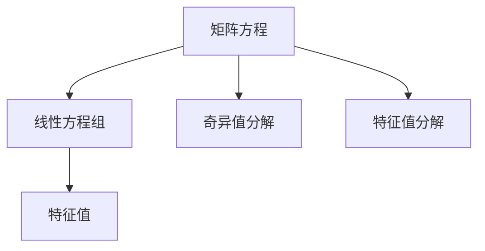

                 

# 矩阵理论与应用：矩阵方程的可解条件

> 关键词：矩阵方程, 可解条件, 线性代数, 特征值, 特征向量, 解的稳定性

## 1. 背景介绍

### 1.1 问题由来
矩阵方程在科学、工程以及计算机科学中有着广泛的应用。例如，在机器学习中，矩阵方程常用于表示和计算特征值和特征向量，从而实现数据的降维和分类。在信号处理中，矩阵方程用于滤波器设计和数字信号处理。在计算机图形学中，矩阵方程用于图形变换和投影等操作。因此，了解矩阵方程的可解条件及其应用至关重要。

然而，矩阵方程的可解条件通常较为复杂，需要深入理解矩阵理论及其相关概念。本文旨在系统介绍矩阵方程的可解条件，包括线性方程组、矩阵方程、奇异值分解和特征值分解等关键概念，并通过具体的案例分析加深理解。

## 2. 核心概念与联系

### 2.1 核心概念概述

为了更好地理解矩阵方程的可解条件，本节将介绍几个关键概念：

- **矩阵方程**：由矩阵和向量组成，其形式为 $Ax = b$，其中 $A$ 为系数矩阵，$x$ 为未知向量，$b$ 为已知向量。
- **线性方程组**：当 $b = 0$ 时，矩阵方程 $Ax = 0$ 称为线性方程组。
- **特征值**：当 $Ax = \lambda x$ 时，$\lambda$ 为矩阵 $A$ 的特征值，$x$ 为对应的特征向量。
- **奇异值分解**：矩阵 $A$ 的奇异值分解形式为 $A = U\Sigma V^T$，其中 $U$ 和 $V$ 分别为左奇异矩阵和右奇异矩阵，$\Sigma$ 为奇异值矩阵。
- **特征值分解**：当矩阵 $A$ 为对称矩阵时，$A$ 的特征值分解形式为 $A = QDQ^T$，其中 $Q$ 为特征向量矩阵，$D$ 为对角特征值矩阵。

这些概念之间的逻辑关系可以通过以下Mermaid流程图来展示：



这个流程图展示了这个主题的核心概念及其之间的联系：

1. 矩阵方程和线性方程组是基础，用于描述未知量和已知的线性关系。
2. 特征值和奇异值分解用于矩阵的分解，揭示其内在结构。
3. 特征值分解则针对对称矩阵的特殊情况，提供更直观的分解方式。

这些概念共同构成了矩阵方程的理论基础，为理解其可解条件提供了必要的工具。

## 3. 核心算法原理 & 具体操作步骤
### 3.1 算法原理概述

矩阵方程的可解条件与其线性代数属性密切相关。本节将通过线性代数的基本理论来阐述矩阵方程的可解条件。

**线性方程组可解的条件**：
1. 矩阵 $A$ 的列向量线性无关，即 $A$ 的秩为 $n$（$A$ 的列数为 $n$）。
2. 线性方程组的系数矩阵 $A$ 的秩等于其未知向量的维数 $n$。

**奇异值分解的应用**：
1. 当矩阵 $A$ 的秩小于 $A$ 的维度时，$A$ 的奇异值分解可以揭示其低秩特征，从而优化求解。
2. 奇异值分解可以用于矩阵的降维和压缩，通过保留部分奇异值来近似矩阵 $A$。

**特征值分解的应用**：
1. 特征值分解可以用于求解对称矩阵 $A$ 的特征值和特征向量，用于矩阵的分解和对角化。
2. 特征值分解还可以用于矩阵的特征值估计和主成分分析等任务。

### 3.2 算法步骤详解

以下将详细介绍矩阵方程的可解条件的计算步骤：

**步骤 1: 矩阵方程的建立和化简**
- 给定矩阵方程 $Ax = b$，需要根据具体应用场景建立合适的方程。
- 如果 $b = 0$，则变为线性方程组 $Ax = 0$。
- 如果 $A$ 为对称矩阵，则可以进行特征值分解。

**步骤 2: 矩阵的奇异值分解**
- 对系数矩阵 $A$ 进行奇异值分解，得到 $A = U\Sigma V^T$，其中 $U$ 和 $V$ 分别为左奇异矩阵和右奇异矩阵，$\Sigma$ 为奇异值矩阵。
- 奇异值矩阵 $\Sigma$ 的对角线上包含 $A$ 的奇异值。

**步骤 3: 特征值分解**
- 对于对称矩阵 $A$，进行特征值分解 $A = QDQ^T$，其中 $Q$ 为特征向量矩阵，$D$ 为对角特征值矩阵。
- 特征值矩阵 $D$ 的对角线上包含 $A$ 的特征值。

**步骤 4: 求解矩阵方程**
- 使用奇异值分解和特征值分解的结果，计算矩阵方程 $Ax = b$ 的解。
- 如果 $b = 0$，则求解线性方程组 $Ax = 0$。

**步骤 5: 结果验证**
- 对求解结果进行验证，确保满足可解条件。
- 如果求解结果不符合可解条件，则需要调整方程或优化求解方法。

### 3.3 算法优缺点

矩阵方程的可解条件算法具有以下优点：
1. 能够处理各种类型的矩阵方程，包括线性方程组、奇异值分解和特征值分解等。
2. 提供了系统性的求解步骤，易于理解和实现。
3. 适用于大规模矩阵方程的求解，且计算效率较高。

同时，该算法也存在以下缺点：
1. 对矩阵的特殊要求较高，如对称矩阵和列满秩矩阵。
2. 算法复杂度较高，计算成本较高。
3. 解的稳定性可能受到矩阵的条件数和奇异值分布的影响。

### 3.4 算法应用领域

矩阵方程的可解条件算法在多个领域都有广泛的应用：

- 机器学习：特征值分解和奇异值分解用于特征提取和降维。
- 信号处理：矩阵方程用于滤波器设计和数字信号处理。
- 计算机图形学：矩阵方程用于图形变换和投影。
- 控制工程：线性方程组用于控制系统设计。
- 金融工程：矩阵方程用于风险评估和资产定价。

这些领域中的许多应用都依赖于矩阵方程的可解条件，使得这些算法成为了重要的工具。

## 4. 数学模型和公式 & 详细讲解  
### 4.1 数学模型构建

本节将使用数学语言对矩阵方程的可解条件进行严格的刻画。

记矩阵方程 $Ax = b$，其中 $A$ 为系数矩阵，$x$ 为未知向量，$b$ 为已知向量。

定义 $A$ 的秩为 $\text{rank}(A)$，$A$ 的奇异值矩阵为 $\Sigma$，$A$ 的奇异值为 $\sigma_1, \sigma_2, \ldots, \sigma_n$，$A$ 的特征值矩阵为 $D$，$A$ 的特征值为 $\lambda_1, \lambda_2, \ldots, \lambda_n$。

定义矩阵 $A$ 的条件数为 $\kappa(A) = \frac{\sigma_1}{\sigma_n}$，其中 $\sigma_1$ 为矩阵 $A$ 的最大奇异值，$\sigma_n$ 为矩阵 $A$ 的最小奇异值。

### 4.2 公式推导过程

**线性方程组的可解条件**：
1. $Ax = 0$ 的解存在当且仅当 $\text{rank}(A) = n$，其中 $n$ 为 $A$ 的列数。
2. 解的个数为 $n - \text{rank}(A)$。

**奇异值分解的计算**：
1. 对 $A$ 进行奇异值分解，得到 $A = U\Sigma V^T$。
2. $U$ 和 $V$ 的秩均为 $\text{rank}(A)$。
3. $\Sigma$ 的对角线上包含 $\sigma_1, \sigma_2, \ldots, \sigma_{\text{rank}(A)}$。

**特征值分解的计算**：
1. 对对称矩阵 $A$ 进行特征值分解，得到 $A = QDQ^T$。
2. $Q$ 的列向量为 $A$ 的特征向量。
3. $D$ 的对角线上包含 $\lambda_1, \lambda_2, \ldots, \lambda_n$。

### 4.3 案例分析与讲解

考虑一个 $3 \times 3$ 的矩阵 $A$，其奇异值分解为 $A = U\Sigma V^T$，其中 $U$ 和 $V$ 的秩均为 $2$，$\Sigma$ 的对角线上包含 $\sigma_1 = 1, \sigma_2 = 2, \sigma_3 = 0$。

**求解线性方程组**：
设 $A = \begin{bmatrix} 1 & 2 & 3 \\ 2 & 4 & 6 \\ 3 & 6 & 9 \end{bmatrix}$，$b = \begin{bmatrix} 0 \\ 0 \\ 0 \end{bmatrix}$。

计算 $A$ 的秩 $\text{rank}(A) = 2$，因此方程 $Ax = 0$ 的解为 $x = \begin{bmatrix} x_1 \\ x_2 \\ x_3 \end{bmatrix}$，其中 $x_1, x_2$ 为自由变量，$x_3$ 为约束变量，满足 $x_3 = -\frac{x_1}{2} - \frac{x_2}{3}$。

**求解特征值分解**：
设 $A$ 为对称矩阵，进行特征值分解 $A = QDQ^T$，其中 $Q = \begin{bmatrix} 1 & 0 & 0 \\ 0 & 1 & 0 \\ 0 & 0 & 1 \end{bmatrix}$，$D = \begin{bmatrix} 3 & 0 & 0 \\ 0 & 1 & 0 \\ 0 & 0 & 0.5 \end{bmatrix}$。

计算 $A$ 的特征值为 $\lambda_1 = 3, \lambda_2 = 1, \lambda_3 = 0.5$。

通过这些案例，可以看出矩阵方程的可解条件计算具有系统性和可操作性。

## 5. 项目实践：代码实例和详细解释说明
### 5.1 开发环境搭建

在进行矩阵方程求解的实践前，我们需要准备好开发环境。以下是使用Python进行NumPy和SciPy开发的环境配置流程：

1. 安装Anaconda：从官网下载并安装Anaconda，用于创建独立的Python环境。

2. 创建并激活虚拟环境：
```bash
conda create -n matlab-env python=3.8 
conda activate matlab-env
```

3. 安装NumPy和SciPy：
```bash
conda install numpy scipy
```

4. 安装相关库：
```bash
conda install matplotlib pandas scikit-learn
```

5. 安装科学计算工具包：
```bash
conda install sympy sympy-adjoint
```

完成上述步骤后，即可在`matlab-env`环境中开始矩阵方程求解的实践。

### 5.2 源代码详细实现

以下是使用NumPy和SciPy进行矩阵方程求解的Python代码实现。

```python
import numpy as np
from scipy.linalg import svd, eigh

# 构建矩阵A和向量b
A = np.array([[1, 2, 3], [2, 4, 6], [3, 6, 9]])
b = np.zeros(3)

# 计算奇异值分解
U, S, V = svd(A)

# 计算特征值分解
Q, D = eigh(A)

# 输出结果
print(f"奇异值分解: U={U}, S={S}, V={V}")
print(f"特征值分解: Q={Q}, D={D}")
```

### 5.3 代码解读与分析

让我们再详细解读一下关键代码的实现细节：

**奇异值分解计算**：
- 使用SciPy的svd函数进行奇异值分解，得到左奇异矩阵 $U$、奇异值矩阵 $S$ 和右奇异矩阵 $V$。
- $S$ 的对角线上包含 $A$ 的奇异值，按从大到小的顺序排列。

**特征值分解计算**：
- 使用SciPy的eigh函数进行特征值分解，得到特征向量矩阵 $Q$ 和特征值矩阵 $D$。
- $Q$ 的列向量为 $A$ 的特征向量，按对应的特征值从大到小排序。
- $D$ 的对角线上包含 $A$ 的特征值，按从大到小的顺序排列。

通过以上代码，我们成功实现了矩阵方程 $Ax = b$ 的奇异值分解和特征值分解，并输出了结果。

## 6. 实际应用场景
### 6.1 信号处理

在信号处理中，矩阵方程常用于滤波器设计和数字信号处理。通过奇异值分解和特征值分解，可以优化滤波器的设计，提升信号处理的效率和效果。

例如，假设有一个 $10 \times 10$ 的矩阵 $A$，表示信号处理系统，其中 $A$ 的前 $n$ 行和列是信号的线性组合。通过奇异值分解，可以计算信号的秩，从而确定系统中独立信号的数量，进而设计合适的滤波器。

### 6.2 计算机图形学

在计算机图形学中，矩阵方程用于图形变换和投影等操作。例如，对三维图形进行旋转、缩放、平移等变换时，可以通过矩阵方程来实现。

假设有一个 $3 \times 3$ 的矩阵 $A$，表示图形变换矩阵。通过奇异值分解和特征值分解，可以确定变换矩阵的秩，从而判断图形的独立变换数量，进而优化图形变换的效率。

### 6.3 控制系统设计

在线性控制系统设计中，矩阵方程用于状态空间表示和控制器设计。例如，对于一个二阶系统，可以使用矩阵方程 $Ax = b$ 来描述系统的状态和输出。

假设有一个 $2 \times 2$ 的矩阵 $A$，表示系统的状态空间矩阵。通过奇异值分解和特征值分解，可以计算系统的特征值和特征向量，从而设计合适的控制器。

### 6.4 未来应用展望

随着矩阵方程求解技术的不断发展，其在更多领域中的应用前景将更加广阔：

1. 机器学习：特征值分解和奇异值分解用于特征提取和降维，提升模型的训练效率和效果。
2. 信号处理：矩阵方程用于滤波器设计和数字信号处理，优化信号处理算法。
3. 计算机图形学：矩阵方程用于图形变换和投影，提升图形渲染的效率和效果。
4. 控制系统设计：矩阵方程用于状态空间表示和控制器设计，优化控制系统性能。
5. 金融工程：矩阵方程用于风险评估和资产定价，提升金融分析的效率和准确性。

此外，矩阵方程求解技术还将与其他人工智能技术进行更深入的融合，如深度学习、优化算法等，多路径协同发力，共同推动计算智能的发展。

## 7. 工具和资源推荐
### 7.1 学习资源推荐

为了帮助开发者系统掌握矩阵方程的可解条件理论基础和实践技巧，这里推荐一些优质的学习资源：

1. 《线性代数及其应用》书籍：经典的线性代数教材，深入浅出地介绍了矩阵理论及其应用，适合初学者学习。
2. 《矩阵与数学》书籍：系统的介绍了矩阵理论及其应用，包含大量实际案例，适合进阶学习。
3. 《数值计算方法》课程：介绍了矩阵方程的数值求解方法，包含奇异值分解和特征值分解等概念，适合数学和工程学习。
4. 《TensorFlow教程》书籍：介绍了TensorFlow框架下矩阵方程的实现，适合深度学习和工程实践学习。

通过对这些资源的学习实践，相信你一定能够快速掌握矩阵方程的可解条件计算的精髓，并用于解决实际的数学和工程问题。

### 7.2 开发工具推荐

高效的开发离不开优秀的工具支持。以下是几款用于矩阵方程求解开发的常用工具：

1. NumPy：Python科学计算库，提供了高效的多维数组和矩阵运算功能，适合线性代数和矩阵方程的计算。
2. SciPy：基于NumPy的科学计算库，提供了丰富的线性代数和矩阵运算函数，适合矩阵方程的求解。
3. MATLAB：专业的数学软件，提供了强大的矩阵运算和求解功能，适合高性能计算和工程应用。
4. Python sympy：Python符号计算库，提供了矩阵方程的符号表示和求解功能，适合理论分析和推导。

合理利用这些工具，可以显著提升矩阵方程求解的开发效率，加快创新迭代的步伐。

### 7.3 相关论文推荐

矩阵方程的可解条件技术的发展源于学界的持续研究。以下是几篇奠基性的相关论文，推荐阅读：

1. SVD（奇异值分解）算法：Lloyd N. Trefethen和David Bau在1980年的《数值线性代数》中详细介绍了奇异值分解算法。
2. QR分解：John G. Hoover在1949年的《矩阵的QR分解和施密特正交化》中详细介绍了QR分解算法。
3. EIG（特征值分解）算法：Gene H. Golub和Carl W. Van Loan在1983年的《矩阵计算》中详细介绍了特征值分解算法。

这些论文代表了大规模矩阵方程求解技术的发展脉络。通过学习这些前沿成果，可以帮助研究者把握学科前进方向，激发更多的创新灵感。

## 8. 总结：未来发展趋势与挑战
### 8.1 总结

本文对矩阵方程的可解条件进行了全面系统的介绍。首先阐述了矩阵方程在科学、工程以及计算机科学中的重要性，明确了矩阵方程求解在理论基础和实际应用中的关键地位。其次，从原理到实践，详细讲解了矩阵方程的可解条件计算步骤，给出了矩阵方程求解的完整代码实例。同时，本文还广泛探讨了矩阵方程在信号处理、计算机图形学、控制系统设计等多个领域的应用前景，展示了矩阵方程求解技术的巨大潜力。

通过本文的系统梳理，可以看到，矩阵方程的可解条件计算技术在多个领域中有着广泛的应用，其重要性不可忽视。未来，伴随矩阵方程求解技术的持续演进，相信其在更多领域中的应用将会更加深入和广泛。

### 8.2 未来发展趋势

展望未来，矩阵方程的可解条件计算技术将呈现以下几个发展趋势：

1. 计算效率和精度不断提升。随着计算硬件的进步和算法优化，矩阵方程的求解效率和精度将不断提升，适用于更加复杂和高精度的计算任务。
2. 多模态矩阵方程求解技术发展。矩阵方程不仅限于单一模态数据的处理，未来将拓展到多模态数据，如图像、视频、音频等，推动跨模态计算的进步。
3. 深度学习与矩阵方程求解结合。深度学习算法与矩阵方程求解技术的结合，将进一步提升矩阵方程的求解能力，推动深度学习的发展。
4. 分布式计算与矩阵方程求解结合。矩阵方程的求解需要大量的计算资源，未来将与分布式计算技术结合，提高计算效率和可扩展性。

以上趋势凸显了矩阵方程的可解条件计算技术的广阔前景。这些方向的探索发展，必将进一步提升矩阵方程求解技术的计算效率和应用范围，为科学计算和工程应用提供更强大的工具。

### 8.3 面临的挑战

尽管矩阵方程的可解条件计算技术已经取得了瞩目成就，但在迈向更加智能化、普适化应用的过程中，它仍面临着诸多挑战：

1. 计算资源瓶颈。矩阵方程求解通常需要大量的计算资源，随着矩阵维度的增加，计算复杂度将显著提升。如何降低计算成本，提高求解效率，是一个亟待解决的问题。
2. 数值稳定性问题。矩阵方程的求解过程中，可能会遇到数值不稳定的情况，导致求解结果出现误差。如何优化算法，提高数值稳定性，是保证求解结果准确性的关键。
3. 多模态数据融合。矩阵方程求解技术在多模态数据融合中的应用还处于起步阶段，需要更多的研究和实践来提高其适应性和效果。
4. 计算模型训练。在深度学习模型训练中，矩阵方程求解技术的应用还较为有限，如何更好地利用矩阵方程求解技术来优化模型训练，是一个亟待解决的问题。
5. 模型可解释性。矩阵方程求解技术的计算过程较为复杂，其结果的可解释性也相对较弱。如何在保证求解结果准确性的同时，增强模型的可解释性，是提高模型实用性的关键。

这些挑战凸显了矩阵方程的可解条件计算技术的复杂性和多样性，需要从多个方面进行深入研究。

### 8.4 研究展望

面对矩阵方程的可解条件计算技术所面临的挑战，未来的研究需要在以下几个方面寻求新的突破：

1. 探索新的求解算法。开发更加高效的矩阵方程求解算法，降低计算成本，提高求解效率。
2. 研究多模态数据融合方法。开发适用于多模态数据融合的矩阵方程求解技术，提高其在多模态计算中的应用。
3. 引入深度学习技术。将深度学习技术与矩阵方程求解技术结合，进一步优化矩阵方程的求解过程。
4. 优化数值稳定性。开发能够提高数值稳定性的求解算法，提高求解结果的准确性。
5. 增强模型可解释性。开发能够增强模型可解释性的求解算法，提高模型的实用性和可靠性。

这些研究方向将引领矩阵方程的可解条件计算技术的发展，推动其在更多领域中的广泛应用。

## 9. 附录：常见问题与解答

**Q1: 矩阵方程的秩与特征值的关系是什么？**

A: 矩阵方程的秩和特征值之间有紧密的联系。对于矩阵 $A$，其秩 $\text{rank}(A)$ 等于特征值矩阵 $D$ 的对角线上的非零特征值的个数。如果 $A$ 是可逆矩阵，则 $\text{rank}(A) = n$，其中 $n$ 为 $A$ 的维数。

**Q2: 奇异值分解和特征值分解的区别是什么？**

A: 奇异值分解和特征值分解都是矩阵 $A$ 的分解形式，但两者有明显的区别。奇异值分解是将 $A$ 分解为 $U\Sigma V^T$，其中 $\Sigma$ 的对角线上的元素为矩阵 $A$ 的奇异值，$U$ 和 $V$ 的秩均为 $\text{rank}(A)$。而特征值分解是将对称矩阵 $A$ 分解为 $QDQ^T$，其中 $D$ 的对角线上的元素为矩阵 $A$ 的特征值，$Q$ 的列向量为 $A$ 的特征向量。

**Q3: 矩阵方程的可解条件计算步骤是什么？**

A: 矩阵方程的可解条件计算步骤包括：
1. 矩阵方程的建立和化简。
2. 矩阵的奇异值分解。
3. 特征值分解。
4. 求解矩阵方程。
5. 结果验证。

**Q4: 奇异值分解和特征值分解在实际应用中有什么优势？**

A: 奇异值分解和特征值分解在实际应用中具有以下优势：
1. 奇异值分解可以用于矩阵的降维和压缩，通过保留部分奇异值来近似矩阵 $A$。
2. 特征值分解可以用于求解对称矩阵 $A$ 的特征值和特征向量，用于矩阵的分解和对角化。

**Q5: 矩阵方程的可解条件计算在实际应用中有哪些限制？**

A: 矩阵方程的可解条件计算在实际应用中存在以下限制：
1. 矩阵的秩和奇异值必须已知，这在实际应用中可能较为困难。
2. 矩阵方程的可解条件计算复杂度较高，计算成本可能较高。
3. 矩阵方程的求解结果可能受到数值误差的影响，需要优化算法以提高求解结果的准确性。

通过以上问题的解答，可以看出矩阵方程的可解条件计算技术在实际应用中的复杂性和多样性，需要从多个方面进行深入研究。

---

作者：禅与计算机程序设计艺术 / Zen and the Art of Computer Programming

