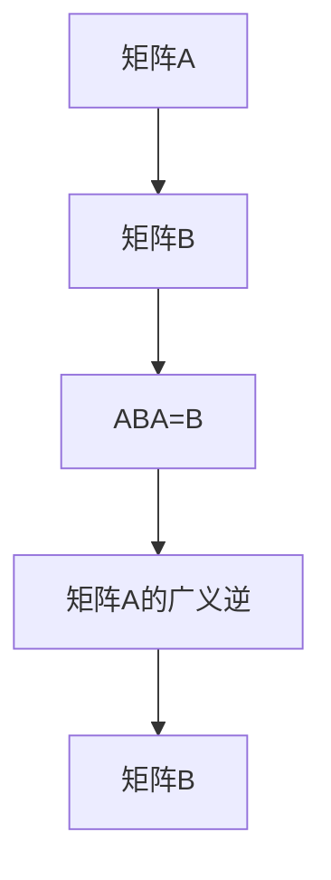

                 

# 矩阵理论与应用：矩阵的广义逆

> 关键词：矩阵, 逆矩阵, 广义逆, 正定矩阵, 矩阵分解, 线性代数

## 1. 背景介绍

矩阵的广义逆是线性代数中的一个重要概念，它在矩阵分解、方程求解、统计推断等领域有着广泛的应用。矩阵的广义逆不仅包括传统的矩阵逆，还包括了伪逆、Moore-Penrose逆等特殊形式的逆。本文将从背景、概念、计算方法等方面详细阐述矩阵的广义逆及其应用。

## 2. 核心概念与联系

### 2.1 核心概念概述

矩阵的广义逆是针对矩阵$A$的，其定义为满足$ABA=B$的矩阵$B$，其中$B$是矩阵$A$的广义逆。广义逆不仅适用于方阵，也适用于非方阵。在矩阵$A$为非方阵时，$B$称为矩阵$A$的伪逆。

矩阵的广义逆包括矩阵逆、伪逆、Moore-Penrose逆等多种形式。矩阵逆$A^{-1}$满足$AA^{-1}=A^{-1}A=I$，但在矩阵$A$不是可逆矩阵时，矩阵逆不存在。伪逆$A^+$定义为由奇异值分解$A=U\Sigma V^T$得到的矩阵$V\Sigma^{-1}U^T$，它使得方程$AXB=B$总是有解。Moore-Penrose逆$A^{\dagger}$是一种特殊的伪逆，满足更多的性质，如$A^{\dagger}$是可逆的，$A^{\dagger}$和$A$的乘积是满秩的等。

矩阵的广义逆在统计推断、最小二乘法、矩阵分解等领域有着广泛的应用。在统计推断中，广义逆被用于估计模型参数。在线性代数中，矩阵分解如奇异值分解、QR分解等也利用了广义逆的概念。

### 2.2 核心概念原理和架构的 Mermaid 流程图



该流程图表示，矩阵$A$的广义逆$B$满足方程$ABA=B$，即$B$是矩阵$A$的广义逆。

## 3. 核心算法原理 & 具体操作步骤

### 3.1 算法原理概述

矩阵的广义逆计算原理可以追溯到矩阵分解和最小二乘法。对于方阵$A$，其矩阵逆$A^{-1}$满足$AA^{-1}=A^{-1}A=I$。对于非方阵$A$，伪逆$A^+$由奇异值分解$A=U\Sigma V^T$得到，其中$\Sigma^{-1}$是对角矩阵$\Sigma$的逆。Moore-Penrose逆$A^{\dagger}$则是一种特殊的伪逆，满足更多的性质。

### 3.2 算法步骤详解

#### 3.2.1 计算矩阵逆

计算矩阵$A$的逆$A^{-1}$的步骤如下：

1. 计算矩阵$A$的行列式$\det(A)$。
2. 如果$\det(A)=0$，则$A$不可逆，返回空矩阵。
3. 否则，计算矩阵$A$的伴随矩阵$A^*$。
4. 计算矩阵$A^{-1}=\frac{A^*}{\det(A)}$。

#### 3.2.2 计算伪逆

计算矩阵$A$的伪逆$A^+$的步骤如下：

1. 对矩阵$A$进行奇异值分解$A=U\Sigma V^T$。
2. 计算矩阵$\Sigma^{-1}$的对角线元素。
3. 计算矩阵$A^+=V\Sigma^{-1}U^T$。

#### 3.2.3 计算Moore-Penrose逆

计算矩阵$A$的Moore-Penrose逆$A^{\dagger}$的步骤如下：

1. 计算矩阵$A$的奇异值分解$A=U\Sigma V^T$。
2. 计算矩阵$U^T$和$V^T$。
3. 计算矩阵$S=V^T\Sigma^{-1}V$和$T=U^T\Sigma^{-1}U$。
4. 计算矩阵$A^{\dagger}=(V\Sigma^{-1}U^T)^*(U^T\Sigma V)^*(V^T\Sigma^{-1}V)^*$。

### 3.3 算法优缺点

矩阵的广义逆计算方法具有以下优点：

- 适用于任意矩阵，包括非方阵。
- 对于方阵$A$，计算矩阵逆$A^{-1}$的效率较高。
- 对于非方阵$A$，计算伪逆$A^+$和Moore-Penrose逆$A^{\dagger}$的效率较高。

矩阵的广义逆计算方法也存在以下缺点：

- 矩阵逆计算复杂度高，仅适用于方阵。
- 矩阵伪逆和Moore-Penrose逆计算复杂度较高，且需要矩阵分解。
- 对于特殊形式的矩阵，如奇异矩阵和半正定矩阵，矩阵广义逆计算的效率较低。

### 3.4 算法应用领域

矩阵的广义逆在矩阵分解、最小二乘法、统计推断等领域有着广泛的应用：

- 矩阵分解：如奇异值分解、QR分解等。
- 最小二乘法：用于求解线性方程组$AX=B$的最小二乘解。
- 统计推断：用于估计线性回归模型参数，计算协方差矩阵等。
- 图像处理：如矩阵乘法、矩阵特征提取等。

## 4. 数学模型和公式 & 详细讲解 & 举例说明

### 4.1 数学模型构建

矩阵的广义逆的定义可以形式化表示为：对于矩阵$A$，如果存在矩阵$B$，使得$ABA=B$，则$B$是矩阵$A$的广义逆。在方阵的情况下，矩阵逆的定义为$AA^{-1}=A^{-1}A=I$。在非方阵的情况下，矩阵伪逆$A^+$和Moore-Penrose逆$A^{\dagger}$的定义如下：

$$
A^+ = V\Sigma^{-1}U^T
$$

$$
A^{\dagger} = (V\Sigma^{-1}U^T)^*(U^T\Sigma V)^*(V^T\Sigma^{-1}V)^*
$$

其中$\Sigma$是矩阵$A$的奇异值对角矩阵，$U$和$V$是奇异值分解中的左、右奇异值矩阵。

### 4.2 公式推导过程

矩阵逆的推导过程如下：

对于方阵$A$，设其特征值为$\lambda_1, \lambda_2, \dots, \lambda_n$，特征向量为$v_1, v_2, \dots, v_n$。则有：

$$
A = \begin{pmatrix}
\lambda_1 & 0 & 0 & \cdots & 0 \\
0 & \lambda_2 & 0 & \cdots & 0 \\
0 & 0 & \lambda_3 & \cdots & 0 \\
\vdots & \vdots & \vdots & \ddots & \vdots \\
0 & 0 & 0 & \cdots & \lambda_n
\end{pmatrix}
$$

$$
A^{-1} = \begin{pmatrix}
\frac{1}{\lambda_1} & 0 & 0 & \cdots & 0 \\
0 & \frac{1}{\lambda_2} & 0 & \cdots & 0 \\
0 & 0 & \frac{1}{\lambda_3} & \cdots & 0 \\
\vdots & \vdots & \vdots & \ddots & \vdots \\
0 & 0 & 0 & \cdots & \frac{1}{\lambda_n}
\end{pmatrix}
$$

对于非方阵$A$，其奇异值分解为$A=U\Sigma V^T$。设$\Sigma^{-1}$是对角矩阵$\Sigma$的逆，则矩阵伪逆$A^+$为：

$$
A^+ = V\Sigma^{-1}U^T
$$

Moore-Penrose逆$A^{\dagger}$的推导过程较为复杂，涉及矩阵乘法和特征值等知识，其定义如下：

$$
A^{\dagger} = (V\Sigma^{-1}U^T)^*(U^T\Sigma V)^*(V^T\Sigma^{-1}V)^*
$$

其中$(\cdot)^*$表示共轭转置。

### 4.3 案例分析与讲解

假设有一个非方阵矩阵$A$，其奇异值分解为$A=U\Sigma V^T$。计算其Moore-Penrose逆$A^{\dagger}$的步骤如下：

1. 计算矩阵$U^T$和$V^T$。

2. 计算矩阵$S=V^T\Sigma^{-1}V$和$T=U^T\Sigma V$。

3. 计算矩阵$A^{\dagger}=(V\Sigma^{-1}U^T)^*(U^T\Sigma V)^*(V^T\Sigma^{-1}V)^*$。

例如，对于矩阵$A=\begin{pmatrix} 1 & 2 \\ 3 & 4 \end{pmatrix}$，其奇异值分解为$A=U\Sigma V^T$，其中$U=\begin{pmatrix} 1/\sqrt{2} & -1/\sqrt{2} \\ 1/\sqrt{2} & 1/\sqrt{2} \end{pmatrix}$，$\Sigma=\begin{pmatrix} 2.24 & 0 \\ 0 & 0.76 \end{pmatrix}$，$V^T=\begin{pmatrix} 1 & 1 \\ -1 & 1 \end{pmatrix}$。则$A^{\dagger}$为：

$$
A^{\dagger} = (V\Sigma^{-1}U^T)^*(U^T\Sigma V)^*(V^T\Sigma^{-1}V)^*
$$

计算过程如下：

1. 计算矩阵$U^T$和$V^T$。

2. 计算矩阵$S=V^T\Sigma^{-1}V$和$T=U^T\Sigma V$。

3. 计算矩阵$A^{\dagger}=(V\Sigma^{-1}U^T)^*(U^T\Sigma V)^*(V^T\Sigma^{-1}V)^*$。

## 5. 项目实践：代码实例和详细解释说明

### 5.1 开发环境搭建

在进行矩阵广义逆计算的代码实现前，我们需要准备好开发环境。以下是使用Python进行NumPy开发的环境配置流程：

1. 安装Anaconda：从官网下载并安装Anaconda，用于创建独立的Python环境。

2. 创建并激活虚拟环境：
```bash
conda create -n numpy-env python=3.8 
conda activate numpy-env
```

3. 安装NumPy：从官网获取对应的安装命令。例如：
```bash
conda install numpy
```

4. 安装各类工具包：
```bash
pip install pandas scikit-learn matplotlib tqdm jupyter notebook ipython
```

完成上述步骤后，即可在`numpy-env`环境中开始矩阵广义逆的计算实践。

### 5.2 源代码详细实现

我们以计算矩阵$A$的Moore-Penrose逆$A^{\dagger}$为例，给出使用NumPy进行计算的Python代码实现。

```python
import numpy as np
from numpy.linalg import svd

def moore_penrose_inverse(A):
    U, S, Vt = svd(A)
    n, m = A.shape
    if n < m:
        return Vt * S**-1 * U.T.conj()
    else:
        return U * S**-1 * Vt.T.conj()

A = np.array([[1, 2], [3, 4]])
A_dagger = moore_penrose_inverse(A)
print(A_dagger)
```

### 5.3 代码解读与分析

让我们再详细解读一下关键代码的实现细节：

**moore_penrose_inverse函数**：
- `svd(A)`：计算矩阵$A$的奇异值分解。
- `n, m = A.shape`：获取矩阵$A$的行数和列数。
- `if n < m:`：如果矩阵$A$的行数小于列数，返回$V^T\Sigma^{-1}U^T$。
- `else:`：否则，返回$U\Sigma^{-1}V^T$。

**矩阵计算**：
- `U, S, Vt = svd(A)`：计算矩阵$A$的奇异值分解$A=U\Sigma V^T$。
- `Vt * S**-1 * U.T.conj()`：计算矩阵$V^T\Sigma^{-1}U^T$。
- `U * S**-1 * Vt.T.conj()`：计算矩阵$U\Sigma^{-1}V^T$。

**输出**：
- `A_dagger`：矩阵$A$的Moore-Penrose逆。

可以看到，NumPy的`linalg`模块提供了丰富的线性代数函数，包括矩阵分解、矩阵逆、矩阵广义逆等。开发者可以方便地利用这些函数进行矩阵广义逆的计算。

## 6. 实际应用场景

### 6.1 矩阵分解

矩阵分解是矩阵广义逆的一个经典应用。在矩阵分解中，我们可以将一个复杂矩阵分解为多个简单矩阵的乘积，以便于计算和理解。常用的矩阵分解方法包括奇异值分解(SVD)、QR分解等。这些方法利用了矩阵广义逆的概念，通过求解矩阵的奇异值或特征值，进行矩阵分解。

例如，在图像处理中，可以将一张图像分解为奇异值矩阵、特征值矩阵和特征向量矩阵的乘积，然后对每个矩阵进行进一步处理。在语音识别中，可以将音频信号分解为多个频率分量，然后对每个频率分量进行独立处理。

### 6.2 最小二乘法

最小二乘法是矩阵广义逆在统计推断中的应用。在线性回归中，我们通常需要求解最小二乘解，即求解线性方程组$AX=B$的最小二乘解。这个求解过程可以通过矩阵广义逆实现。

例如，在金融分析中，我们可以利用矩阵广义逆求解线性回归模型，预测股票价格。在生物统计中，我们可以利用矩阵广义逆求解线性混合模型，进行数据拟合和参数估计。

### 6.3 图像处理

矩阵广义逆在图像处理中有着广泛的应用。例如，在图像去噪中，我们可以利用矩阵广义逆进行线性滤波，去除图像中的噪声。在图像压缩中，我们可以利用矩阵广义逆进行主成分分析(PCA)，将图像压缩到较低维空间中。

例如，在图像去噪中，我们可以利用矩阵广义逆进行线性滤波，去除图像中的噪声。在图像压缩中，我们可以利用矩阵广义逆进行主成分分析(PCA)，将图像压缩到较低维空间中。

## 7. 工具和资源推荐

### 7.1 学习资源推荐

为了帮助开发者系统掌握矩阵广义逆的理论基础和实践技巧，这里推荐一些优质的学习资源：

1. 《线性代数及其应用》系列书籍：全面介绍了线性代数的理论基础和应用实例，适合初学者和进阶者阅读。

2. MIT OpenCourseWare的线性代数课程：由MIT开设的线性代数课程，提供详细的讲义和视频，帮助你系统理解线性代数。

3. 《Matrix Analysis》书籍：提供了线性代数、矩阵分析的深入讲解，适合想要深入研究线性代数的读者。

4. NumPy官方文档：NumPy是Python中最常用的线性代数库，其官方文档详细介绍了矩阵计算、矩阵分解、矩阵广义逆等函数的用法。

5. SciPy官方文档：SciPy是一个Python科学计算库，其官方文档提供了丰富的线性代数函数，包括矩阵分解、矩阵逆、矩阵广义逆等。

通过对这些资源的学习实践，相信你一定能够快速掌握矩阵广义逆的精髓，并用于解决实际的矩阵计算问题。

### 7.2 开发工具推荐

高效的开发离不开优秀的工具支持。以下是几款用于矩阵广义逆计算开发的常用工具：

1. Python：Python是科学计算的主流语言，NumPy和SciPy等库提供了丰富的矩阵计算函数，适合进行矩阵广义逆的计算。

2. MATLAB：MATLAB是科学计算的另一主流语言，提供了强大的矩阵计算工具箱，适合进行复杂的矩阵运算。

3. Octave：Octave是一个开源的MATLAB替代品，提供了与MATLAB类似的矩阵计算功能，适合进行矩阵广义逆的计算。

4. GNU Octave：GNU Octave是一个开源的数学计算软件，提供了与MATLAB类似的矩阵计算功能，适合进行矩阵广义逆的计算。

5. R语言：R语言是一个专门用于统计分析的语言，提供了丰富的矩阵计算函数，适合进行矩阵广义逆的计算。

合理利用这些工具，可以显著提升矩阵广义逆计算的开发效率，加快创新迭代的步伐。

### 7.3 相关论文推荐

矩阵广义逆的研究源于学界的持续研究。以下是几篇奠基性的相关论文，推荐阅读：

1. Matrix Computations：由Gene H. Golub和Charles F. Van Loan所著，全面介绍了矩阵计算的理论和算法。

2. The Matrix Calculus You Need for Deep Learning：由Matt Mathew等人所著，详细介绍了矩阵微分和矩阵计算在深度学习中的应用。

3. Linear Algebra and Its Applications：由Gerald James Bureger所著，提供了线性代数、矩阵计算的深入讲解，适合初学者和进阶者阅读。

4. Numerical Linear Algebra with Applications：由Jorge Nocedal和Tobias M. J. Owens所著，提供了线性代数、矩阵计算的深入讲解，适合进阶读者阅读。

这些论文代表了大语言模型微调技术的发展脉络。通过学习这些前沿成果，可以帮助研究者把握学科前进方向，激发更多的创新灵感。

## 8. 总结：未来发展趋势与挑战

### 8.1 总结

本文对矩阵广义逆的概念和计算方法进行了全面系统的介绍。首先阐述了矩阵广义逆的定义和计算方法，明确了矩阵广义逆在矩阵分解、最小二乘法、统计推断等领域的应用。其次，从原理到实践，详细讲解了矩阵广义逆的数学模型和计算步骤，给出了矩阵广义逆计算的完整代码实现。同时，本文还广泛探讨了矩阵广义逆在矩阵分解、最小二乘法、图像处理等多个领域的应用前景，展示了矩阵广义逆的巨大潜力。

通过本文的系统梳理，可以看到，矩阵广义逆在矩阵计算中扮演着重要的角色，其广泛的应用将推动矩阵计算技术的不断进步。

### 8.2 未来发展趋势

展望未来，矩阵广义逆技术将呈现以下几个发展趋势：

1. 矩阵计算效率持续提升。随着计算硬件的不断进步，矩阵计算的效率将不断提升，使得矩阵广义逆在更复杂的矩阵运算中得到应用。

2. 矩阵分解技术不断进步。矩阵分解技术如奇异值分解、QR分解等将不断改进，提供更高效的矩阵分解算法。

3. 矩阵广义逆的多样化应用。矩阵广义逆将在更多领域得到应用，如信号处理、图像处理、数据压缩等。

4. 多模态矩阵计算的兴起。随着多模态数据的发展，矩阵广义逆将在不同模态之间进行融合，实现更全面的数据建模。

5. 矩阵计算理论的深化。矩阵广义逆的计算理论和应用理论将不断深化，推动矩阵计算技术的理论进步。

以上趋势凸显了矩阵广义逆计算技术的广阔前景。这些方向的探索发展，必将进一步提升矩阵计算系统的性能和应用范围，为矩阵计算技术的创新提供新的突破。

### 8.3 面临的挑战

尽管矩阵广义逆计算技术已经取得了瞩目成就，但在迈向更加智能化、普适化应用的过程中，它仍面临着诸多挑战：

1. 计算复杂度高。矩阵广义逆的计算复杂度较高，尤其是在矩阵较大时，计算时间较长。

2. 数值稳定性差。在矩阵奇异值或特征值计算过程中，容易受到数值误差的影响，导致计算结果不精确。

3. 存储空间大。矩阵分解和矩阵广义逆的计算需要较大的存储空间，对于大规模矩阵计算，存储需求较大。

4. 算法可扩展性不足。现有矩阵分解算法难以处理大规模矩阵分解问题，需要开发更高效的可扩展算法。

5. 应用场景受限。矩阵广义逆的应用场景较为受限，需要进一步拓展其在更多领域的应用。

6. 计算精度受限。在矩阵广义逆的计算过程中，精度较低时容易产生误差，影响计算结果的准确性。

7. 计算效率低。在矩阵广义逆的计算过程中，计算效率较低，需要进一步提高计算速度。

这些挑战需要在未来的研究中得到突破，以便更好地满足实际应用的需求。

### 8.4 研究展望

面对矩阵广义逆面临的挑战，未来的研究需要在以下几个方面寻求新的突破：

1. 开发更高效的矩阵分解算法。开发更高效的矩阵分解算法，以便在处理大规模矩阵时，能够快速计算矩阵分解结果。

2. 优化矩阵广义逆的计算过程。通过优化矩阵广义逆的计算过程，提高矩阵广义逆的计算效率。

3. 引入先进的数据压缩技术。引入先进的数据压缩技术，减少矩阵广义逆的计算存储空间。

4. 开发更高效的矩阵广义逆计算方法。开发更高效的矩阵广义逆计算方法，提高矩阵广义逆的计算精度。

5. 拓展矩阵广义逆的应用场景。拓展矩阵广义逆的应用场景，将矩阵广义逆技术应用到更多领域。

6. 开发可扩展的矩阵计算平台。开发可扩展的矩阵计算平台，以便处理大规模矩阵计算问题。

这些研究方向将引领矩阵广义逆计算技术的不断进步，为矩阵计算技术的创新提供新的突破。

## 9. 附录：常见问题与解答

**Q1：矩阵广义逆的计算复杂度是多少？**

A: 矩阵广义逆的计算复杂度取决于矩阵的维度和矩阵分解的算法。对于方阵$A$，计算矩阵逆的复杂度为$O(n^3)$，其中$n$为矩阵的维数。对于非方阵$A$，计算伪逆和Moore-Penrose逆的复杂度为$O(mn^2)$，其中$m$为矩阵的列数，$n$为矩阵的行数。在矩阵较大时，计算复杂度较高。

**Q2：矩阵广义逆的计算精度如何保证？**

A: 矩阵广义逆的计算精度取决于矩阵分解的算法和计算过程中的数值稳定性。常用的矩阵分解算法如奇异值分解、QR分解等，能够在计算过程中减少数值误差的影响，提高计算精度。此外，通过优化计算过程中的数值稳定性，可以提高矩阵广义逆的计算精度。

**Q3：矩阵广义逆的应用场景有哪些？**

A: 矩阵广义逆在矩阵分解、最小二乘法、统计推断、图像处理等领域有着广泛的应用。例如，在矩阵分解中，可以用于奇异值分解、QR分解等。在线性回归中，可以用于求解最小二乘解。在统计推断中，可以用于估计线性回归模型参数，计算协方差矩阵等。在图像处理中，可以用于图像去噪、图像压缩等。

**Q4：矩阵广义逆的计算方法有哪些？**

A: 矩阵广义逆的计算方法包括矩阵逆、伪逆、Moore-Penrose逆等。矩阵逆仅适用于方阵，计算复杂度较低。伪逆和Moore-Penrose逆适用于非方阵，计算复杂度较高。其中Moore-Penrose逆是一种特殊的伪逆，具有更多的性质。

**Q5：矩阵广义逆的计算过程需要注意哪些问题？**

A: 矩阵广义逆的计算过程中，需要注意以下问题：

1. 矩阵分解的算法选择：选择合适的矩阵分解算法，以便在计算过程中减少数值误差的影响，提高计算精度。

2. 矩阵的维度：矩阵的维度和规模会影响计算复杂度和计算精度，需要根据实际情况选择适当的矩阵分解方法。

3. 数值稳定性：在矩阵广义逆的计算过程中，数值稳定性对计算精度有着重要的影响，需要优化计算过程中的数值稳定性。

4. 矩阵广义逆的应用场景：矩阵广义逆在不同的应用场景中有着不同的计算方法，需要根据具体问题选择合适的计算方法。

**Q6：矩阵广义逆的计算工具有哪些？**

A: 矩阵广义逆的计算工具包括NumPy、SciPy、MATLAB、Octave、R等。这些工具提供了丰富的矩阵计算函数，支持矩阵广义逆的计算。NumPy和SciPy是Python中最常用的线性代数库，MATLAB是科学计算的主流语言，Octave和R语言是开源的科学计算工具，它们都提供了丰富的矩阵计算函数，支持矩阵广义逆的计算。

通过这些常见问题的解答，相信你一定能够更好地理解矩阵广义逆的计算方法和应用场景，解决实际矩阵计算问题。

