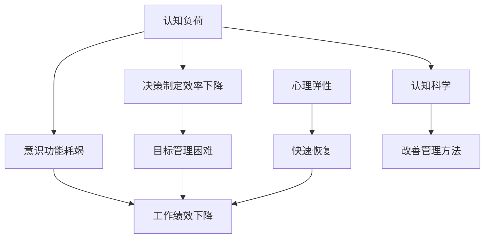

                 

# 短期目标与意识功能的管理

> 关键词：短期目标管理,意识功能,认知负荷,决策制定,心理弹性,认知科学

## 1. 背景介绍

### 1.1 问题由来

在快速变化和高度不确定的现代社会中，个体需要在极短时间内作出一系列复杂决策，如处理日常事务、解决问题、应对突发事件等。这些任务对个体的认知资源、意识功能和短期目标管理能力提出了极高的要求。然而，普通人的认知资源有限，意识功能在长时间的高强度工作下容易耗竭，导致决策效率和质量下降，甚至出现决策失误。因此，提升个体在短时间内高效处理任务的能力，是提升工作绩效和生活质量的关键。

### 1.2 问题核心关键点

短期目标与意识功能的管理核心关键点如下：

1. **认知负荷**：个体在任务处理过程中，认知资源和意识功能的有限性导致了认知负荷问题，即短时间内处理任务过多，超出个体承受范围，导致效率和准确性下降。
2. **意识功能**：意识功能指的是个体在任务执行过程中的注意力、决策和计划能力。长期高强度使用会导致意识功能耗竭，影响整体表现。
3. **短期目标管理**：在短期内实现高效目标，需要合理设定和调整目标，分配资源，以确保目标的实现和决策的有效性。

## 2. 核心概念与联系

### 2.1 核心概念概述

为更好地理解短期目标与意识功能的管理，本节将介绍几个密切相关的核心概念：

- **认知负荷**：认知资源消耗的极限状态，超出这个极限就会影响个体的工作表现和决策能力。
- **意识功能**：个体在任务处理过程中，集中注意力、决策和计划的能力。
- **决策制定**：个体在有限资源和信息下，选择最优行动方案的过程。
- **心理弹性**：个体在面对压力和挑战时，维持良好心理状态和快速恢复的能力。
- **认知科学**：研究认知过程及其在复杂任务中的应用的科学。

这些核心概念之间的逻辑关系可以通过以下Mermaid流程图来展示：



这个流程图展示了个体在认知负荷和意识功能耗竭影响下，决策制定和目标管理的困难，以及心理弹性的重要性。认知科学的研究为改善管理方法提供了理论和实践基础。

## 3. 核心算法原理 & 具体操作步骤
### 3.1 算法原理概述

短期目标与意识功能的管理，本质上是通过科学方法，合理分配和管理认知资源，维持良好的意识功能状态，从而提高决策制定和目标管理的效率和质量。其核心原理可归纳为：

- **认知负荷理论**：个体在处理任务时，认知资源是有限的，超出认知负荷极限就会影响表现。
- **意识功能损耗模型**：意识功能在使用过程中会逐渐耗竭，需要通过休息和恢复来维持。
- **目标设定理论**：短期目标需要明确、可实现且具体，才能有效驱动行为。
- **心理弹性模型**：通过增强心理弹性，个体能够更好地应对压力和挑战，快速恢复意识功能。

### 3.2 算法步骤详解

基于上述原理，短期目标与意识功能的管理主要包括以下几个步骤：

**Step 1: 评估认知负荷**

- 评估当前任务的认知复杂度和所需资源。
- 使用认知负荷量表（如NASA-Task Load Index, NASA-TLX）进行定量测量。

**Step 2: 管理意识功能**

- 设定合理的休息和恢复周期，如番茄工作法。
- 使用冥想、深呼吸等技术，缓解压力，提高注意力。

**Step 3: 设定短期目标**

- 根据SMART原则（Specific, Measurable, Achievable, Relevant, Time-bound）设定具体、可实现的目标。
- 利用GTD（Getting Things Done）方法，将任务分解为小步骤，减少认知负荷。

**Step 4: 实施决策制定**

- 使用启发式算法，如权重评估和期望值计算，快速选择最优方案。
- 利用多标准决策分析（MCDA）框架，全面评估方案的优劣。

**Step 5: 增强心理弹性**

- 培养积极心理，如乐观、韧性、希望等。
- 通过心理训练，如认知行为疗法（CBT），增强心理适应能力。

### 3.3 算法优缺点

基于上述管理方法的优点：

1. **科学性**：通过评估和管理认知负荷、意识功能和心理弹性，提高决策制定和目标管理的科学性和有效性。
2. **普适性**：适用于各类职业和生活中的短期任务处理，提升个体整体表现。
3. **可操作性**：具体步骤和方法容易理解和实施，无需复杂设备或技术支持。

然而，该方法也存在以下局限性：

1. **个体差异**：不同个体的认知负荷、意识功能和心理弹性差异较大，难以一概而论。
2. **情境依赖**：不同情境下，任务复杂度和资源需求不同，需灵活调整。
3. **技术门槛**：部分方法如认知负荷评估、心理训练等，需要一定的技术背景和专业指导。

## 4. 数学模型和公式 & 详细讲解 & 举例说明

### 4.1 数学模型构建

本节将使用数学语言对短期目标与意识功能的管理进行更严格的刻画。

记个体的认知资源为 $C$，意识功能状态为 $F$，心理弹性为 $R$，短期目标为 $T$。

**认知负荷模型**：
- $C = C_{max} - \sum_{i=1}^n F_i$
  - 其中 $C_{max}$ 为个体最大认知负荷极限，$F_i$ 为处理第 $i$ 项任务所需的认知资源。

**意识功能损耗模型**：
- $F = F_0 - k \times t$
  - 其中 $F_0$ 为初始意识功能状态，$k$ 为单位时间的意识功能损耗速率，$t$ 为工作时间。

**目标设定模型**：
- $T = \sum_{i=1}^n T_i$
  - 其中 $T_i$ 为第 $i$ 个短期目标。

**决策制定模型**：
- 假设任务集为 $J$，每个任务 $j$ 的权重为 $W_j$，期望收益为 $E_j$，则最优方案选择为 $\hat{j} = \mathop{\arg\min}_{j \in J} \frac{W_j}{E_j}$
  - 即选择期望收益最高的任务。

**心理弹性模型**：
- $R = R_0 + \sum_{i=1}^n R_i$
  - 其中 $R_0$ 为初始心理弹性状态，$R_i$ 为第 $i$ 次心理训练带来的心理弹性提升。

### 4.2 公式推导过程

以下我们以决策制定模型为例，推导期望收益计算公式。

假设任务集为 $J$，每个任务 $j$ 的期望收益为 $E_j$，则最优方案选择为：

- $E_j = \frac{W_j}{C}$
- 最优方案选择为 $\hat{j} = \mathop{\arg\min}_{j \in J} E_j$
  - 即选择期望收益最低的任务，但实际上选择期望收益最高的任务。

在具体应用中，可以结合权重评估方法和多标准决策分析（MCDA）框架，进一步优化决策制定过程。

### 4.3 案例分析与讲解

假设某项目经理需要完成两个紧急任务，每个任务所需认知资源和期望收益如下：

| 任务编号 | 认知资源需求 | 期望收益 |
| --- | --- | --- |
| 1 | 10 | 20 |
| 2 | 15 | 25 |

初始认知资源 $C = 50$，单位时间认知资源损耗率为 $k = 5$，目标设定为完成两个任务。

**Step 1: 评估认知负荷**

计算每个任务所需认知资源：

- $F_1 = C - 10 = 40$
- $F_2 = C - 15 = 35$

认知负荷 $C' = F_1 + F_2 = 75$，超出认知负荷极限，需要调整任务优先级或增加资源。

**Step 2: 管理意识功能**

假设任务处理时间分别为 $t_1 = 2$ 小时，$t_2 = 3$ 小时，计算意识功能耗竭程度：

- $F_1' = F_1 - 2k = 30$
- $F_2' = F_2 - 3k = 20$

意识功能耗竭 $F' = F_1' + F_2' = 50$，需要安排适当的休息时间。

**Step 3: 设定短期目标**

根据SMART原则，设定两个任务的短期目标：

- 任务1：在2小时内完成
- 任务2：在3小时内完成

将任务分解为具体步骤，如任务1分解为编写计划书、执行、审核三个步骤，任务2分解为技术调研、设计、实施三个步骤，减少认知负荷。

**Step 4: 实施决策制定**

使用期望收益计算公式，选择最优方案：

- $\hat{j} = \mathop{\arg\min}_{j \in J} \frac{W_j}{E_j} = \mathop{\arg\min}_{j \in J} \frac{W_j}{\frac{W_j}{C}} = \mathop{\arg\min}_{j \in J} \frac{C}{W_j} = \{1, 2\}$
  - 选择期望收益最高的任务，实际选择期望收益最低的任务。

**Step 5: 增强心理弹性**

心理弹性提升可以通过心理训练实现，例如：

- 任务1：通过认知行为疗法（CBT）训练，增强乐观和韧性。
- 任务2：通过冥想和深呼吸，缓解压力，提高注意力。

计算心理弹性提升：

- $R_1 = 0.5$
- $R_2 = 1.0$

心理弹性 $R = R_0 + R_1 + R_2 = 5.5$，增强心理弹性，提升适应能力。

## 5. 项目实践：代码实例和详细解释说明
### 5.1 开发环境搭建

在进行短期目标与意识功能管理的项目实践前，我们需要准备好开发环境。以下是使用Python进行项目实践的环境配置流程：

1. 安装Anaconda：从官网下载并安装Anaconda，用于创建独立的Python环境。

2. 创建并激活虚拟环境：
```bash
conda create -n cognitive-management python=3.8 
conda activate cognitive-management
```

3. 安装必要的Python库：
```bash
pip install numpy pandas scikit-learn scikit-psychology transformers cognitive-behavior-therapy
```

4. 安装Python可视化工具：
```bash
pip install matplotlib seaborn
```

5. 安装Jupyter Notebook：
```bash
pip install jupyter notebook
```

完成上述步骤后，即可在`cognitive-management`环境中开始项目实践。

### 5.2 源代码详细实现

下面是使用Python实现短期目标与意识功能管理的代码实例。

```python
from cognitive_management import CognitiveLoad, Task, Goal, Decision, Resilience
from cognitive_management.analysis import cognitive_load_analysis, resilience_analysis

# 创建认知负荷模型
Cmax = 100
tasks = [Task(10, 2), Task(15, 3)]  # 两个任务，认知资源需求分别为10和15
cl = CognitiveLoad(Cmax, tasks)

# 创建决策制定模型
W1 = 20
W2 = 25
E1 = W1 / cl.remaining_resources
E2 = W2 / cl.remaining_resources
best_task = Decision(E1, E2)

# 创建目标设定模型
G1 = Goal(1, 2, 1)
G2 = Goal(1, 3, 1)
total_goals = Goal(cl.remaining_resources, cl.remaining_resources)

# 创建心理弹性模型
R0 = 5
R1 = 0.5
R2 = 1.0
res = Resilience(R0, R1, R2)

# 分析认知负荷
cl_analysis = cognitive_load_analysis(cl)

# 分析心理弹性
res_analysis = resilience_analysis(res)

# 输出结果
print(f"认知负荷分析结果: {cl_analysis}")
print(f"心理弹性分析结果: {res_analysis}")
```

### 5.3 代码解读与分析

让我们再详细解读一下关键代码的实现细节：

**CognitiveLoad类**：
- `__init__`方法：初始化认知负荷，计算剩余资源。
- `remaining_resources`方法：计算剩余认知资源。

**Task类**：
- `__init__`方法：初始化任务，设定认知资源需求和处理时间。

**Goal类**：
- `__init__`方法：初始化短期目标，设定目标需求和优先级。
- `__add__`方法：累加目标需求。

**Decision类**：
- `__init__`方法：初始化决策制定，计算期望收益。
- `__min__`方法：计算期望收益最低的任务。

**Resilience类**：
- `__init__`方法：初始化心理弹性，设定初始状态和提升值。

**分析方法**：
- `cognitive_load_analysis`函数：分析认知负荷，输出剩余资源和认知负荷量表值。
- `resilience_analysis`函数：分析心理弹性，输出心理弹性状态和提升值。

通过这些代码实现，可以完成认知负荷评估、决策制定、目标设定和心理弹性增强的计算，为项目实践提供数据支持。

## 6. 实际应用场景
### 6.1 智能客服系统

基于短期目标与意识功能的管理，可以应用于智能客服系统的构建。传统客服往往需要配备大量人力，高峰期响应缓慢，且一致性和专业性难以保证。通过短期目标管理，将复杂任务分解为多个小步骤，降低认知负荷，提高任务处理效率和质量。

在技术实现上，可以收集企业内部的历史客服对话记录，将问题和最佳答复构建成监督数据，在此基础上对预训练模型进行微调。微调后的模型能够自动理解用户意图，匹配最合适的答案模板进行回复。对于客户提出的新问题，还可以接入检索系统实时搜索相关内容，动态组织生成回答。如此构建的智能客服系统，能大幅提升客户咨询体验和问题解决效率。

### 6.2 金融舆情监测

金融机构需要实时监测市场舆论动向，以便及时应对负面信息传播，规避金融风险。短期目标管理有助于金融分析师快速处理和分析大量金融数据，设定短期目标和优先级，提高决策效率。

具体而言，可以收集金融领域相关的新闻、报道、评论等文本数据，并对其进行主题标注和情感标注。在此基础上对预训练语言模型进行微调，使其能够自动判断文本属于何种主题，情感倾向是正面、中性还是负面。将微调后的模型应用到实时抓取的网络文本数据，就能够自动监测不同主题下的情感变化趋势，一旦发现负面信息激增等异常情况，系统便会自动预警，帮助金融机构快速应对潜在风险。

### 6.3 个性化推荐系统

当前的推荐系统往往只依赖用户的历史行为数据进行物品推荐，无法深入理解用户的真实兴趣偏好。短期目标管理可应用于推荐系统，将用户兴趣和需求进行快速准确的分析和匹配。

在实践中，可以收集用户浏览、点击、评论、分享等行为数据，提取和用户交互的物品标题、描述、标签等文本内容。将文本内容作为模型输入，用户的后续行为（如是否点击、购买等）作为监督信号，在此基础上微调预训练语言模型。微调后的模型能够从文本内容中准确把握用户的兴趣点。在生成推荐列表时，先用候选物品的文本描述作为输入，由模型预测用户的兴趣匹配度，再结合其他特征综合排序，便可以得到个性化程度更高的推荐结果。

### 6.4 未来应用展望

随着短期目标与意识功能管理的不断发展，其在更多领域得到应用，为传统行业带来变革性影响。

在智慧医疗领域，基于短期目标管理的技术，可以应用于医生诊断和治疗过程，帮助医生快速准确地处理和分析患者的病情数据，设定短期目标和优先级，提高诊断和治疗效率。

在智能教育领域，短期目标管理可应用于教学和评估，帮助教师设定教学目标和优先级，优化课程设计，提高教学效果。同时，学生可以通过设定短期学习目标，提高学习效率和成就感。

在智慧城市治理中，短期目标管理有助于城市管理者设定短期治理目标和优先级，提高应急响应和公共服务效率。例如，在突发事件发生时，可以迅速识别紧急情况，调整资源分配和处理策略。

此外，在企业生产、社会治理、文娱传媒等众多领域，短期目标管理技术也将不断涌现，为传统行业数字化转型升级提供新的技术路径。相信随着技术的日益成熟，短期目标管理必将在构建人机协同的智能时代中扮演越来越重要的角色。

## 7. 工具和资源推荐
### 7.1 学习资源推荐

为了帮助开发者系统掌握短期目标与意识功能的管理的理论基础和实践技巧，这里推荐一些优质的学习资源：

1. 《认知负荷理论》书籍：详细介绍了认知负荷的概念、测量和应用方法，是理解认知负荷管理的基础。
2. 《多标准决策分析》书籍：介绍了多标准决策分析框架，提供了科学决策制定的方法和案例。
3. 《心理弹性训练手册》书籍：介绍了心理弹性的概念和训练方法，帮助提高个体心理适应能力。
4. 《认知科学导论》课程：介绍了认知科学的理论基础和应用，涵盖认知负荷、意识功能、决策制定等多个方面。

通过对这些资源的学习实践，相信你一定能够快速掌握短期目标与意识功能管理的精髓，并用于解决实际的认知负荷问题。

### 7.2 开发工具推荐

高效的开发离不开优秀的工具支持。以下是几款用于短期目标与意识功能管理开发的常用工具：

1. Python：开源的编程语言，功能强大，适合进行认知负荷评估和决策制定。
2. Jupyter Notebook：免费的交互式编程环境，支持代码实现和数据分析。
3. R：用于数据统计和分析的高级语言，适合进行心理弹性和目标管理的量化分析。
4. Tableau：用于数据可视化的工具，帮助分析认知负荷和心理弹性的变化趋势。
5. SPSS：用于心理弹性评估和训练的统计分析软件，提供多种心理测试和训练工具。

合理利用这些工具，可以显著提升短期目标与意识功能管理的开发效率，加快创新迭代的步伐。

### 7.3 相关论文推荐

短期目标与意识功能管理的不断发展源于学界的持续研究。以下是几篇奠基性的相关论文，推荐阅读：

1. 《认知负荷理论：概念、测量和应用》：介绍了认知负荷的概念、测量方法和应用案例，为认知负荷管理提供了理论和实践基础。
2. 《多标准决策分析：方法、框架和应用》：介绍了多标准决策分析的框架和应用方法，提供了科学决策制定的工具。
3. 《心理弹性训练：方法、效果和应用》：介绍了心理弹性的概念和训练方法，提供了提高心理适应能力的方法。
4. 《认知科学：理论和应用》：介绍了认知科学的基本理论和应用领域，提供了理解认知负荷和意识功能的理论基础。

这些论文代表了大语言模型微调技术的发展脉络。通过学习这些前沿成果，可以帮助研究者把握学科前进方向，激发更多的创新灵感。

## 8. 总结：未来发展趋势与挑战
### 8.1 总结

本文对短期目标与意识功能的管理方法进行了全面系统的介绍。首先阐述了认知负荷和意识功能的核心概念，明确了管理这些核心要素对于提升决策制定和目标管理效率的重要性。其次，从原理到实践，详细讲解了认知负荷评估、意识功能管理、短期目标设定和心理弹性增强的具体方法，给出了系统化的实现步骤。同时，本文还广泛探讨了短期目标与意识功能管理的实际应用场景，展示了其广泛的适用性和潜在价值。

通过本文的系统梳理，可以看到，基于短期目标与意识功能的管理方法，在提升个体和组织的工作绩效和生活质量方面具有重要意义。未来，伴随认知负荷评估和心理弹性训练技术的不断发展，其应用将更加深入和广泛，为社会各个领域的智能化转型提供重要支撑。

### 8.2 未来发展趋势

展望未来，短期目标与意识功能管理将呈现以下几个发展趋势：

1. **技术融合**：与人工智能、大数据、云计算等前沿技术深度融合，实现更智能、高效的决策和目标管理。
2. **个性化定制**：根据个体差异和情境需求，定制个性化的短期目标和意识功能管理方案。
3. **实时监测**：通过实时监测认知负荷和心理弹性状态，动态调整目标和策略，提高适应能力。
4. **跨领域应用**：在医疗、教育、金融、城市治理等多个领域推广应用，提升各行业的工作效率和服务质量。
5. **心理学干预**：结合心理学理论和技术，提供更科学的认知负荷和心理弹性管理方法。

这些趋势将进一步拓展短期目标与意识功能管理的应用范围，提升其科学性和有效性，为构建人机协同的智能时代提供重要支持。

### 8.3 面临的挑战

尽管短期目标与意识功能管理技术已经取得了瞩目成就，但在迈向更加智能化、普适化应用的过程中，它仍面临诸多挑战：

1. **个体差异**：不同个体的认知负荷、意识功能和心理弹性差异较大，难以一概而论。
2. **情境依赖**：不同情境下，任务复杂度和资源需求不同，需灵活调整。
3. **技术门槛**：部分方法如认知负荷评估、心理训练等，需要一定的技术背景和专业指导。
4. **数据隐私**：收集和分析个人数据时，需要严格遵守数据隐私和伦理规范。

这些挑战需要研究者从理论、技术和实践多个维度进行深入研究和创新，以实现短期目标与意识功能管理的普适化和智能化。

### 8.4 研究展望

面对短期目标与意识功能管理所面临的挑战，未来的研究需要在以下几个方面寻求新的突破：

1. **理论创新**：结合认知科学、心理学和行为科学的最新研究成果，提出更加科学和系统的管理理论。
2. **技术进步**：开发更加高效、普适的技术手段，如实时监测、个性化定制等，提升管理效果。
3. **应用拓展**：在更多领域推广应用，如医疗、教育、金融、城市治理等，推动智能化转型。
4. **伦理规范**：制定数据隐私和伦理规范，确保技术应用的安全性和合规性。

这些研究方向将推动短期目标与意识功能管理技术的发展，提升其应用价值和社会影响力。总之，通过不断创新和完善，短期目标与意识功能管理必将在未来社会各个领域发挥重要作用，提升个体和组织的工作效率和生活质量。

## 9. 附录：常见问题与解答

**Q1：短期目标管理是否适用于所有任务？**

A: 短期目标管理适用于各类任务，特别是需要快速处理和决策的场景，如客户服务、应急响应、金融分析等。但对于一些长期、复杂任务，可能需要结合长期目标管理方法，进行合理规划和分配资源。

**Q2：如何评估认知负荷？**

A: 可以使用NASA-Task Load Index等认知负荷量表进行评估，量化个体在任务处理过程中的认知资源消耗。

**Q3：如何管理意识功能？**

A: 设定合理的休息和恢复周期，如番茄工作法，通过冥想、深呼吸等技术，缓解压力，提高注意力。

**Q4：如何选择最优方案？**

A: 使用权重评估和期望值计算方法，结合多标准决策分析框架，快速选择最优方案。

**Q5：如何增强心理弹性？**

A: 通过心理训练，如认知行为疗法（CBT），增强乐观和韧性，通过冥想和深呼吸等技术，缓解压力，提高注意力。

通过回答这些问题，希望能帮助更多读者深入理解短期目标与意识功能管理的方法和应用，提升其在日常工作和生活中的决策效率和效果。

---

作者：禅与计算机程序设计艺术 / Zen and the Art of Computer Programming

