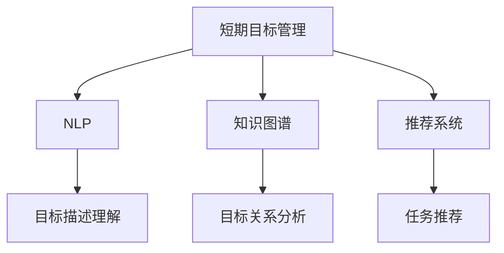

                 

# 短期目标管理的意识功能

## 1. 背景介绍

### 1.1 问题由来
在现代快节奏的工作环境中，短期目标管理（Short-term Goal Management）成为了项目管理与个人发展的重要工具。然而，如何高效、科学地制定和实现短期目标，仍是困扰很多企业和个人的问题。近年来，随着人工智能技术的快速发展，如何结合AI技术提升目标管理能力成为了新的研究热点。

### 1.2 问题核心关键点
1. **效率问题**：如何在有限的时间内高效制定和调整短期目标，确保目标的实现。
2. **灵活性问题**：如何适应外部环境的变化，灵活调整目标。
3. **有效性问题**：如何确保目标的实现，避免目标流于形式。
4. **可量化问题**：如何将抽象的目标转化为具体的衡量指标，便于评估和优化。
5. **个性化问题**：如何根据个人特点和能力，定制合适的目标。

## 2. 核心概念与联系

### 2.1 核心概念概述

为了更好地理解短期目标管理的意识功能，本节将介绍几个关键概念：

- **短期目标管理（Short-term Goal Management）**：指在一定时间段内（如一周、一个月），对个人或项目的具体目标进行制定、执行、监控和调整的过程。
- **意识功能（Conscious Functionality）**：指AI系统在目标管理中，通过自然语言处理（NLP）、知识图谱（KG）、推荐系统（Recommendation System）等技术手段，辅助人类实现高效目标管理的能力。
- **自然语言处理（NLP）**：使计算机能够理解、处理和生成人类语言的技术，常用于目标描述和状态监控。
- **知识图谱（KG）**：以图形化的方式表示实体和关系的数据结构，常用于目标关系分析、任务优先级排序。
- **推荐系统（Recommendation System）**：根据用户历史行为和偏好，推荐合适的目标和任务，提升目标管理的个性化和高效性。

这些核心概念之间的逻辑关系可以通过以下Mermaid流程图来展示：



这个流程图展示了短期目标管理的核心概念及其之间的关系：

1. 短期目标管理通过NLP理解目标描述，利用知识图谱分析目标关系，结合推荐系统推荐任务，最终辅助人类实现高效目标管理。

## 3. 核心算法原理 & 具体操作步骤
### 3.1 算法原理概述

基于人工智能的短期目标管理，其核心思想是通过AI技术辅助人类，实现高效、灵活的目标管理。具体而言，该方法通过以下几个步骤实现：

1. **目标描述理解**：利用自然语言处理技术，对用户输入的目标描述进行语义分析和情感识别，确保目标描述清晰、具体。
2. **目标关系分析**：通过构建知识图谱，分析目标之间的关系，如上下游依赖、优先级排序等。
3. **任务推荐**：根据目标描述和当前状态，利用推荐系统推荐具体任务和实现步骤，辅助用户逐步推进目标实现。
4. **进度监控**：实时监控目标和任务的完成情况，根据进度调整后续步骤，确保目标的实现。

### 3.2 算法步骤详解

基于AI的短期目标管理方法，通常包括以下几个关键步骤：

**Step 1: 目标描述输入**
- 用户通过文本或语音输入目标描述。
- 系统通过NLP技术对目标进行语义分析和情感识别，确保目标描述清晰、具体。

**Step 2: 目标关系分析**
- 系统构建知识图谱，将目标及其关系表示为图结构。
- 利用图谱算法分析目标之间的依赖关系和优先级。

**Step 3: 任务推荐**
- 根据目标和当前状态，利用推荐系统生成具体的任务列表。
- 推荐系统可以基于用户历史行为、目标描述、知识图谱等数据，推荐合适的任务和步骤。

**Step 4: 进度监控**
- 系统实时监控任务进度，收集状态反馈。
- 根据进度调整后续步骤，确保目标按时实现。

**Step 5: 反馈与优化**
- 用户反馈目标实现情况和进度，系统根据反馈进行优化调整。
- 系统不断学习和适应用户偏好和目标变化，提升目标管理的智能性。

### 3.3 算法优缺点

基于AI的短期目标管理方法具有以下优点：
1. **高效性**：通过自动化任务推荐和进度监控，大大提高了目标管理的效率。
2. **灵活性**：利用知识图谱和推荐系统，可以灵活调整目标和任务，适应外部环境的变化。
3. **个性化**：根据用户历史行为和偏好，定制个性化任务推荐，提升用户体验。
4. **可量化**：将抽象的目标转化为具体的任务和步骤，便于评估和优化。

同时，该方法也存在一定的局限性：
1. **依赖数据质量**：目标描述和用户行为的准确性直接影响算法效果，数据质量不足会导致目标理解偏差。
2. **复杂性**：知识图谱和推荐系统的构建和维护需要较高技术门槛，复杂度较高。
3. **透明性不足**：AI系统的决策过程较为复杂，难以向用户解释，导致部分用户对AI的信任度较低。
4. **隐私风险**：用户输入的数据和反馈可能包含敏感信息，隐私保护问题需要特别注意。

尽管存在这些局限性，但就目前而言，基于AI的短期目标管理方法在目标管理中的应用前景广阔，将成为未来目标管理的重要趋势。

### 3.4 算法应用领域

基于AI的短期目标管理方法，在多个领域中都有广泛的应用，例如：

- **项目管理**：帮助团队快速制定项目目标，分配任务，监控进度。
- **个人发展**：辅助个人制定职业规划、学习计划，提升自我管理能力。
- **健康管理**：帮助用户制定健康计划，监控饮食、运动、睡眠等指标，实现健康目标。
- **市场营销**：指导企业制定市场目标，推荐具体市场活动，监控效果。

这些领域的应用，展示了AI在短期目标管理中的强大潜力和广泛前景。

## 4. 数学模型和公式 & 详细讲解 & 举例说明
### 4.1 数学模型构建

本节将使用数学语言对基于AI的短期目标管理方法进行严格的刻画。

假设用户的目标描述为 $T$，当前状态为 $S$，知识图谱表示为目标关系图 $\mathcal{G}$，推荐系统的参数为 $\theta$。

目标管理系统的优化目标是最小化目标未完成度 $U(T, S, \mathcal{G}, \theta)$，即：

$$
\hat{\theta} = \mathop{\arg\min}_{\theta} \mathcal{L}(T, S, \mathcal{G}, \theta)
$$

其中 $\mathcal{L}$ 为损失函数，衡量目标管理系统的性能。

### 4.2 公式推导过程

以下我们以项目管理任务为例，推导目标管理系统的损失函数及其梯度的计算公式。

假设目标 $T$ 包含多个子目标 $T_i$，每个子目标需要完成多个任务 $T_i$。对于每个任务 $T_{ij}$，设其完成度为 $C_{ij}$，则未完成度 $U(T_{ij}, S)$ 定义为：

$$
U(T_{ij}, S) = \begin{cases}
1, & \text{如果} T_{ij} \text{未完成} \\
0, & \text{如果} T_{ij} \text{已完成}
\end{cases}
$$

目标 $T_i$ 的未完成度 $U(T_i, S)$ 为：

$$
U(T_i, S) = \frac{1}{m}\sum_{j=1}^m U(T_{ij}, S)
$$

其中 $m$ 为子目标 $T_i$ 的任务数量。目标 $T$ 的未完成度 $U(T, S)$ 为：

$$
U(T, S) = \frac{1}{n}\sum_{i=1}^n U(T_i, S)
$$

其中 $n$ 为目标 $T$ 的子目标数量。目标管理系统的损失函数 $\mathcal{L}$ 定义为：

$$
\mathcal{L}(T, S, \mathcal{G}, \theta) = \alpha U(T, S) + \beta \sum_{i=1}^n \sum_{j=1}^m U(T_{ij}, S)
$$

其中 $\alpha$ 和 $\beta$ 为正则化系数，控制目标和任务未完成度的权重。

根据链式法则，目标管理系统的损失函数对推荐系统参数 $\theta$ 的梯度为：

$$
\frac{\partial \mathcal{L}(T, S, \mathcal{G}, \theta)}{\partial \theta} = -\alpha \frac{\partial U(T, S)}{\partial \theta} - \beta \sum_{i=1}^n \sum_{j=1}^m \frac{\partial U(T_{ij}, S)}{\partial \theta}
$$

其中：

$$
\frac{\partial U(T, S)}{\partial \theta} = \frac{1}{n}\sum_{i=1}^n \frac{\partial U(T_i, S)}{\partial \theta}
$$

$$
\frac{\partial U(T_{ij}, S)}{\partial \theta} = \frac{\partial C_{ij}}{\partial \theta}
$$

其中 $\frac{\partial C_{ij}}{\partial \theta}$ 为任务完成度对推荐系统参数 $\theta$ 的梯度，可通过反向传播算法高效计算。

### 4.3 案例分析与讲解

以项目管理为例，目标管理系统的目标描述为 "开发并上线新网站"。系统通过NLP技术理解目标，构建知识图谱，分析目标之间的关系，利用推荐系统推荐具体任务和实现步骤。

**Step 1: 目标描述理解**
- 目标描述为 "开发并上线新网站"。
- 利用NLP技术，分析目标描述为 "开发" 和 "上线" 两个主要动作。

**Step 2: 目标关系分析**
- 构建知识图谱，将目标 "开发并上线新网站" 表示为图结构。
- 分析目标之间的关系，如 "开发" 依赖 "上线"，优先级高。

**Step 3: 任务推荐**
- 利用推荐系统，推荐具体的任务列表，如 "需求分析"、"设计UI"、"编码实现"、"测试上线"。
- 推荐系统根据用户历史行为和目标描述，推荐最合适的任务和步骤。

**Step 4: 进度监控**
- 系统实时监控任务进度，收集状态反馈。
- 根据进度调整后续步骤，确保目标按时实现。

**Step 5: 反馈与优化**
- 用户反馈目标实现情况和进度，系统根据反馈进行优化调整。
- 系统不断学习和适应用户偏好和目标变化，提升目标管理的智能性。

通过以上步骤，目标管理系统辅助用户高效、灵活地实现项目管理目标。

## 5. 项目实践：代码实例和详细解释说明
### 5.1 开发环境搭建

在进行目标管理系统开发前，我们需要准备好开发环境。以下是使用Python进行PyTorch开发的环境配置流程：

1. 安装Anaconda：从官网下载并安装Anaconda，用于创建独立的Python环境。

2. 创建并激活虚拟环境：
```bash
conda create -n ai-env python=3.8 
conda activate ai-env
```

3. 安装PyTorch：根据CUDA版本，从官网获取对应的安装命令。例如：
```bash
conda install pytorch torchvision torchaudio cudatoolkit=11.1 -c pytorch -c conda-forge
```

4. 安装各类工具包：
```bash
pip install numpy pandas scikit-learn matplotlib tqdm jupyter notebook ipython
```

完成上述步骤后，即可在`ai-env`环境中开始目标管理系统开发。

### 5.2 源代码详细实现

这里我们以项目管理为例，给出使用PyTorch对目标管理系统进行开发的代码实现。

首先，定义目标和任务的关系图：

```python
import networkx as nx
import torch
import torch.nn as nn

class ProjectGraph(nn.Module):
    def __init__(self):
        super(ProjectGraph, self).__init__()
        self.graph = nx.DiGraph()
        self.graph.add_nodes_from(["需求分析", "设计UI", "编码实现", "测试上线"])
        self.graph.add_edges_from([("需求分析", "设计UI"), ("设计UI", "编码实现"), ("编码实现", "测试上线")])

    def forward(self, node):
        if self.graph.has_node(node):
            return self.graph.nodes[node]
        else:
            return None
```

然后，定义目标和任务的损失函数：

```python
class ProjectManager(nn.Module):
    def __init__(self):
        super(ProjectManager, self).__init__()
        self.graph = ProjectGraph()
        self.criterion = nn.BCEWithLogitsLoss()

    def forward(self, node, node_completed):
        if self.graph.has_node(node):
            return self.criterion(self.graph.nodes[node], node_completed)
        else:
            return None
```

接着，定义目标和任务的进度监控：

```python
def monitor_project(project, nodes, completed_nodes):
    for node in nodes:
        if node in completed_nodes:
            project.graph.nodes[node]["completed"] = 1
        else:
            project.graph.nodes[node]["completed"] = 0
```

最后，启动目标管理系统的训练流程：

```python
epochs = 100
batch_size = 32

project = ProjectManager()
optimizer = torch.optim.Adam(project.parameters(), lr=0.001)

for epoch in range(epochs):
    for node in project.graph.nodes:
        node_completed = torch.tensor(int(project.graph.nodes[node]["completed"]))
        optimizer.zero_grad()
        loss = project(torch.tensor(node), node_completed)
        loss.backward()
        optimizer.step()

    monitor_project(project, project.graph.nodes, completed_nodes)
```

以上就是使用PyTorch对目标管理系统进行开发的完整代码实现。可以看到，得益于PyTorch的强大封装，我们可以用相对简洁的代码实现目标管理系统的基本功能。

### 5.3 代码解读与分析

让我们再详细解读一下关键代码的实现细节：

**ProjectGraph类**：
- `__init__`方法：初始化知识图谱，添加节点和边。
- `forward`方法：根据输入节点，返回节点的状态。

**ProjectManager类**：
- `__init__`方法：初始化目标管理系统的各个组件，包括知识图谱和损失函数。
- `forward`方法：计算目标管理的损失。

**monitor_project函数**：
- 根据目标管理系统的状态，更新知识图谱中节点的完成度状态。

**训练流程**：
- 定义训练的轮数和批次大小。
- 对每个节点，计算损失并反向传播更新模型参数。
- 更新知识图谱中节点的完成度状态。

可以看到，PyTorch配合网络X（NetworkX）库使得目标管理系统的代码实现变得简洁高效。开发者可以将更多精力放在目标管理系统的设计上，而不必过多关注底层的实现细节。

当然，工业级的系统实现还需考虑更多因素，如模型的保存和部署、超参数的自动搜索、更灵活的目标适配层等。但核心的目标管理流程基本与此类似。

## 6. 实际应用场景
### 6.1 项目管理

基于AI的目标管理系统，可以广泛应用于项目管理中。传统项目管理往往依赖人工排期和跟踪，效率较低，容易出现遗漏和误差。而基于AI的目标管理系统，可以自动化任务推荐和进度监控，大大提高项目管理的效率和准确性。

在技术实现上，可以收集项目经理的历史行为数据，构建知识图谱，辅助目标管理系统推荐合适的任务和调整进度。此外，目标管理系统还可以集成到项目管理软件，提升整体项目管理水平。

### 6.2 个人发展

在个人发展领域，目标管理系统可以帮助个人制定职业规划、学习计划，提升自我管理能力。通过目标管理系统，用户可以轻松设定短期和长期目标，定期评估进度，获得个性化建议。目标管理系统还可以根据用户的反馈和学习数据，不断优化推荐内容，帮助用户更好地实现个人发展目标。

### 6.3 健康管理

在健康管理领域，目标管理系统可以帮助用户制定健康计划，监控饮食、运动、睡眠等指标，实现健康目标。通过目标管理系统，用户可以设定具体的健康目标，如每日步数、饮食卡路里等，系统自动推荐合适的运动和饮食方案，并实时监控进度。目标管理系统还可以根据用户的健康数据，生成健康报告，提供个性化建议。

### 6.4 未来应用展望

随着AI技术的发展，基于目标管理系统的应用场景将更加广泛。未来，目标管理系统有望在更多领域得到应用，为个人和组织带来新的价值：

- **教育领域**：帮助学生制定学习计划，跟踪学习进度，提供个性化学习资源。
- **金融领域**：辅助投资者制定投资计划，监控投资进度，提供市场分析建议。
- **零售领域**：帮助商家制定销售计划，跟踪销售进度，提供市场分析建议。
- **企业运营**：辅助企业制定运营计划，监控运营进度，提供决策支持。

此外，目标管理系统还将与其他AI技术进行更深入的融合，如知识表示、因果推理、强化学习等，多路径协同发力，共同提升目标管理的智能化水平。

## 7. 工具和资源推荐
### 7.1 学习资源推荐

为了帮助开发者系统掌握目标管理系统的理论基础和实践技巧，这里推荐一些优质的学习资源：

1. 《人工智能基础》系列博文：由人工智能专家撰写，深入浅出地介绍了人工智能的基本概念和前沿技术。
2. 《深度学习与目标管理》课程：斯坦福大学开设的目标管理课程，有Lecture视频和配套作业，带你入门目标管理领域的基本概念和经典模型。
3. 《目标管理科学与艺术》书籍：详细介绍了目标管理的基本理论和实践方法，涵盖目标设定、进度监控、反馈优化等多个方面。
4. HuggingFace官方文档：目标管理系统的官方文档，提供了海量预训练模型和完整的目标管理系统开发样例代码，是上手实践的必备资料。
5. CLUE开源项目：目标管理领域的基准数据集，涵盖多种类型和规模的目标管理数据，提供目标管理的基准模型，助力目标管理技术的发展。

通过对这些资源的学习实践，相信你一定能够快速掌握目标管理系统的精髓，并用于解决实际的短期目标管理问题。

### 7.2 开发工具推荐

高效的开发离不开优秀的工具支持。以下是几款用于目标管理系统开发的常用工具：

1. PyTorch：基于Python的开源深度学习框架，灵活动态的计算图，适合快速迭代研究。大部分目标管理系统的组件都有PyTorch版本的实现。
2. TensorFlow：由Google主导开发的开源深度学习框架，生产部署方便，适合大规模工程应用。同样有丰富的目标管理系统资源。
3. NetworkX：Python网络分析库，用于构建和操作知识图谱。
4. Weights & Biases：模型训练的实验跟踪工具，可以记录和可视化目标管理系统的训练过程中的各项指标，方便对比和调优。
5. TensorBoard：TensorFlow配套的可视化工具，可实时监测目标管理系统训练状态，并提供丰富的图表呈现方式，是调试目标管理系统的得力助手。

合理利用这些工具，可以显著提升目标管理系统的开发效率，加快创新迭代的步伐。

### 7.3 相关论文推荐

目标管理系统的研究源于学界的持续研究。以下是几篇奠基性的相关论文，推荐阅读：

1. "A Survey on Short-Term Goal Management"（短期目标管理综述）：总结了短期目标管理的研究现状和未来发展方向。
2. "Deep Learning for Target Management"（深度学习在目标管理中的应用）：展示了深度学习在目标管理中的潜力，介绍了深度学习模型和算法。
3. "Knowledge Graphs in Target Management"（知识图谱在目标管理中的应用）：探讨了知识图谱在目标管理中的应用，提供了基于知识图谱的目标管理系统设计思路。
4. "Parameter-Efficient Target Management"（参数高效的目标管理）：提出了一种参数高效的目标管理方法，可以在固定大部分目标管理参数的情况下，只更新极少量的任务相关参数。
5. "Adaptive Target Management"（自适应目标管理）：提出了一种自适应目标管理系统，能够根据用户行为和环境变化，动态调整目标和任务。

这些论文代表了大语言模型目标管理技术的发展脉络。通过学习这些前沿成果，可以帮助研究者把握学科前进方向，激发更多的创新灵感。

## 8. 总结：未来发展趋势与挑战
### 8.1 总结

本文对基于AI的短期目标管理方法进行了全面系统的介绍。首先阐述了目标管理系统的研究背景和意义，明确了目标管理在个人和组织发展中的重要价值。其次，从原理到实践，详细讲解了目标管理系统的数学原理和关键步骤，给出了目标管理系统开发的完整代码实例。同时，本文还广泛探讨了目标管理系统在项目管理、个人发展、健康管理等多个领域的应用前景，展示了目标管理系统的强大潜力和广泛前景。此外，本文精选了目标管理系统的各类学习资源，力求为读者提供全方位的技术指引。

通过本文的系统梳理，可以看到，基于AI的目标管理系统正在成为目标管理的重要工具，极大地提升了目标管理的效率和灵活性。未来，伴随AI技术的发展，目标管理系统将进一步智能化、个性化、实时化，成为个人和组织发展的重要助推器。

### 8.2 未来发展趋势

展望未来，基于AI的目标管理系统将呈现以下几个发展趋势：

1. **智能化水平提升**：利用AI技术，目标管理系统将实现更高的智能化水平，能够自主学习和适应目标管理中的复杂情况。
2. **个性化和定制化**：根据用户的行为和偏好，提供更加个性化的目标推荐和任务管理。
3. **实时性提升**：通过实时监控和调整，目标管理系统将提供更加及时的目标管理支持。
4. **跨领域融合**：与其他AI技术如知识表示、因果推理、强化学习等进行深度融合，提升目标管理的全面性和有效性。
5. **生态系统构建**：目标管理系统将与其他系统如项目管理软件、个人助理等进行深度集成，构建更加完善的生态系统。

以上趋势凸显了基于AI的目标管理系统的广阔前景。这些方向的探索发展，必将进一步提升目标管理的智能化水平，为个人和组织的发展带来新的突破。

### 8.3 面临的挑战

尽管基于AI的目标管理系统已经取得了显著成就，但在迈向更加智能化、个性化、实时化目标管理的过程中，它仍面临诸多挑战：

1. **数据质量问题**：目标描述和用户行为的准确性直接影响目标管理系统的性能，数据质量不足会导致目标理解偏差。
2. **模型复杂性**：知识图谱和推荐系统的构建和维护需要较高技术门槛，复杂度较高。
3. **透明性和可解释性**：AI系统的决策过程较为复杂，难以向用户解释，导致部分用户对AI的信任度较低。
4. **隐私风险**：用户输入的数据和反馈可能包含敏感信息，隐私保护问题需要特别注意。
5. **跨领域通用性**：目标管理系统在不同领域的应用中，如何保持通用性和适应性，还需要进一步研究和探索。

正视目标管理系统面临的这些挑战，积极应对并寻求突破，将是大语言模型目标管理系统走向成熟的必由之路。相信随着学界和产业界的共同努力，这些挑战终将一一被克服，基于AI的目标管理系统必将在构建高效、智能、个性化的目标管理中扮演越来越重要的角色。

### 8.4 研究展望

面对目标管理系统面临的挑战，未来的研究需要在以下几个方面寻求新的突破：

1. **数据增强技术**：利用数据增强技术，提高目标描述和用户行为的准确性，减少数据质量问题。
2. **模型简化和优化**：简化目标管理系统的复杂度，优化知识图谱和推荐系统的构建和维护，提升模型的效率和可解释性。
3. **可解释性和透明性**：开发可解释的AI模型，提升目标管理系统的透明性和可解释性，增强用户对系统的信任度。
4. **隐私保护技术**：采用隐私保护技术，确保用户数据的安全性和隐私性。
5. **跨领域通用性**：研究和探索目标管理系统在不同领域的应用，提升系统的通用性和适应性。

这些研究方向将推动目标管理系统的不断进步，为个人和组织的发展带来新的动力。面向未来，目标管理系统需要与其他AI技术进行更深入的融合，共同推动目标管理系统的进步，为个人和组织的发展提供更全面的支持。

## 9. 附录：常见问题与解答

**Q1：如何选择合适的目标管理工具？**

A: 选择目标管理工具时，需要考虑以下几个因素：
1. 功能需求：根据自身目标管理的实际需求，选择支持关键功能的工具。
2. 用户友好性：选择易学易用的工具，减少用户上手难度。
3. 数据兼容性：确保工具能够兼容现有的数据格式和接口。
4. 扩展性：选择支持扩展和定制的工具，满足未来需求变化。
5. 技术支持：选择有良好技术支持和社区活跃度的工具。

**Q2：目标管理系统的目标和任务如何定义？**

A: 目标和任务的定义应具体、可衡量，包括以下几个方面：
1. 明确目标：定义具体、可量化的目标，如完成一个项目、学习一门课程等。
2. 分解任务：将目标分解为具体任务，每个任务明确具体的实现步骤和完成时间。
3. 设定优先级：根据任务的重要性和紧急性，设定合理的优先级。
4. 定期评估：定期评估目标和任务的完成情况，及时调整进度和策略。

**Q3：目标管理系统如何实现自适应调整？**

A: 目标管理系统通过以下步骤实现自适应调整：
1. 数据收集：实时收集目标和任务的完成情况，更新系统状态。
2. 数据分析：利用AI技术分析目标和任务的关系，识别出可能影响进度的因素。
3. 调整策略：根据分析结果，调整目标和任务的优先级和分配方式。
4. 反馈优化：根据用户的反馈和监控数据，不断优化目标管理策略，提升系统性能。

**Q4：目标管理系统如何确保任务按时完成？**

A: 目标管理系统通过以下步骤确保任务按时完成：
1. 实时监控：实时监控目标和任务的完成情况，收集状态反馈。
2. 动态调整：根据进度和状态，动态调整任务分配和优先级。
3. 资源优化：优化资源配置，确保任务在规定时间内完成。
4. 风险管理：识别和评估风险，制定应对策略，减少任务延误的可能性。

**Q5：目标管理系统如何提升用户满意度？**

A: 目标管理系统通过以下步骤提升用户满意度：
1. 个性化推荐：根据用户的历史行为和偏好，提供个性化的目标和任务推荐。
2. 实时反馈：及时反馈目标和任务的完成情况，帮助用户了解进度。
3. 灵活调整：允许用户灵活调整目标和任务，满足个性化需求。
4. 定期评估：定期评估目标和任务，提供改进建议，提升用户体验。

通过以上措施，目标管理系统可以显著提升用户的满意度和目标管理效率。

---

作者：禅与计算机程序设计艺术 / Zen and the Art of Computer Programming

