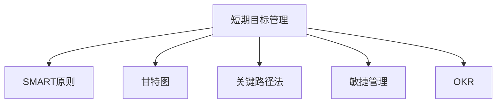

                 

# 短期目标管理的意识机制

目标管理在现代企业和个人生活中都扮演着至关重要的角色，它是确保资源合理分配、提升效率和达成预期成果的关键。本文将深入探讨短期目标管理的核心概念、算法原理、具体操作步骤，并结合实际应用场景，阐述其优缺点及未来发展趋势，以期为读者提供全面的指导。

## 1. 背景介绍

### 1.1 问题由来

在快节奏的现代社会中，无论是个人还是企业，都在面临复杂多变的挑战。短期目标管理作为一项行之有效的工具，能够帮助人们在有限的资源和时间内，高效地达成既定目标。从企业项目管理到个人时间管理，其应用范围广泛，涵盖教育、医疗、金融等多个领域。

### 1.2 问题核心关键点

短期目标管理的核心在于如何高效规划和执行目标，其关键点包括：

- **目标设定**：明确具体的短期目标，并设定清晰的衡量标准。
- **资源分配**：合理分配时间、资金、人力等资源，确保目标的可实现性。
- **执行监控**：实时监控目标执行情况，及时调整策略。
- **评估反馈**：定期评估目标完成情况，进行总结反馈，不断优化。

## 2. 核心概念与联系

### 2.1 核心概念概述

- **短期目标管理(Short-Term Goal Management, STGM)**：指在有限时间内（通常为一到四周），通过科学的方法设定、执行、监控和评估目标，以实现预期成果的管理活动。
- **SMART原则**：目标设定应具备具体(Specific)、可测量(Measurable)、可达成(Achievable)、相关性(Relevant)和时限性(Time-bound)。
- **甘特图(Gantt Chart)**：一种用于项目管理时间安排的图形化工具，直观展示任务进度和依赖关系。
- **关键路径法(Critical Path Method, CPM)**：用于项目管理中计算最短工期和关键路径的技术。
- **敏捷管理(Agile Management)**：一种强调快速响应变化、持续交付的项目管理方法。
- **OKR(目标与关键结果)**：一种目标管理框架，强调设定挑战性目标和关键结果指标，以驱动组织成长。

这些概念之间的逻辑关系可以通过以下Mermaid流程图来展示：



这个流程图展示了一组相互关联的核心概念，共同构成了短期目标管理的基础框架。

## 3. 核心算法原理 & 具体操作步骤

### 3.1 算法原理概述

短期目标管理的核心算法原理主要基于项目管理理论和心理行为学的结合。其核心在于通过科学的方法论，确保目标设定的合理性、执行过程的可控性和成果评估的有效性。

### 3.2 算法步骤详解

基于短期目标管理的算法，其操作步骤一般包括以下几个关键步骤：

**Step 1: 目标设定**
- 根据SMART原则，明确短期目标。
- 将目标分解为具体、可执行的任务列表。
- 设定每个任务的具体衡量标准。

**Step 2: 资源分配**
- 评估可用资源（时间、人力、资金等）。
- 根据任务重要性和紧急性，合理分配资源。
- 确定关键路径和关键节点。

**Step 3: 执行监控**
- 定期检查任务进度，及时调整计划。
- 采用甘特图、关键路径法等工具，可视化任务执行情况。
- 使用敏捷管理等方法，灵活应对变化。

**Step 4: 评估反馈**
- 定期评估目标完成情况。
- 采用OKR等框架，设定关键结果指标。
- 根据评估结果，进行总结反馈，优化目标管理流程。

### 3.3 算法优缺点

短期目标管理具有以下优点：
- 结构化明确：通过科学的步骤和方法，确保目标设定的合理性和可执行性。
- 灵活性高：采用敏捷管理等方法，能够快速应对变化，提升执行效率。
- 可视化直观：甘特图等工具，帮助清晰展示任务进度和资源使用情况。

然而，该方法也存在一些局限性：
- 依赖于资源分配：若资源分配不合理，可能导致任务延误。
- 需要持续监控：长期执行过程中，需要投入大量时间和精力进行监控。
- 主观性强：目标设定和评估依赖于个人主观判断，可能导致偏差。

### 3.4 算法应用领域

短期目标管理的应用领域广泛，涵盖企业项目管理、个人时间管理、团队协作、教育培训等多个领域。例如：

- **企业项目管理**：用于项目规划、资源分配、进度监控和成果评估。
- **个人时间管理**：帮助个人设定每日、每周或每月的目标，提升时间利用效率。
- **团队协作**：在跨部门、跨团队的项目中，确保目标一致，协作高效。
- **教育培训**：用于课程规划、教师评估、学生反馈等，提升教学质量。

## 4. 数学模型和公式 & 详细讲解 & 举例说明

### 4.1 数学模型构建

假设目标管理过程有 $N$ 个任务，每个任务耗时 $t_i$，最早开始时间 $e_i$，最晚开始时间 $l_i$，最早结束时间 $f_i$，最晚结束时间 $p_i$。定义关键路径为所有任务最早和最晚开始、结束时间的最大值。

定义关键路径函数 $T_{cp}$ 为：
$$
T_{cp} = \max_{i=1}^{N} (p_i - e_i)
$$

### 4.2 公式推导过程

根据关键路径函数，可以推导出计算关键路径长度的公式。例如，对于两个任务 $A$ 和 $B$，如果 $A$ 是 $B$ 的先决条件，则：

$$
p_A = f_B \\
l_A = e_B + t_B
$$

代入 $T_{cp}$ 公式，得：

$$
T_{cp} = \max \{ p_A - e_A, p_B - e_B \} = \max \{ f_B - e_A, f_B - e_B + t_B \}
$$

### 4.3 案例分析与讲解

以企业项目管理的甘特图为例，分析关键路径和关键节点的计算方法。假设项目有 $N=5$ 个任务，耗时和开始时间如下：

| 任务编号 | 耗时 $t_i$ | 最早开始时间 $e_i$ | 最晚开始时间 $l_i$ | 最早结束时间 $f_i$ | 最晚结束时间 $p_i$ |
|---------|------------|---------------------|---------------------|---------------------|---------------------|
| 1       | 3          | 0                   | 7                   | 3                   | 6                   |
| 2       | 5          | 3                   | 8                   | 8                   | 13                  |
| 3       | 4          | 7                   | 11                  | 11                  | 15                  |
| 4       | 2          | 10                  | 11                  | 12                  | 14                  |
| 5       | 1          | 12                  | 13                  | 13                  | 14                  |

根据上述数据，计算关键路径和关键节点：

- 计算关键路径节点 $k$：
$$
k = \max \{ p_i - e_i \} = \max \{ 6-0, 13-3, 15-7, 14-10, 14-12 \} = 15
$$

因此，关键路径为任务 3、4、5，总耗时 $T_{cp} = 15$。

## 5. 项目实践：代码实例和详细解释说明

### 5.1 开发环境搭建

在进行短期目标管理的项目实践前，我们需要准备好开发环境。以下是使用Python进行PyTorch开发的环境配置流程：

1. 安装Anaconda：从官网下载并安装Anaconda，用于创建独立的Python环境。

2. 创建并激活虚拟环境：
```bash
conda create -n stgm-env python=3.8 
conda activate stgm-env
```

3. 安装PyTorch：根据CUDA版本，从官网获取对应的安装命令。例如：
```bash
conda install pytorch torchvision torchaudio cudatoolkit=11.1 -c pytorch -c conda-forge
```

4. 安装各类工具包：
```bash
pip install numpy pandas scikit-learn matplotlib tqdm jupyter notebook ipython
```

完成上述步骤后，即可在`stgm-env`环境中开始项目实践。

### 5.2 源代码详细实现

下面以项目管理的甘特图为例，给出使用Python和Matplotlib库进行甘特图绘制的代码实现。

```python
import matplotlib.pyplot as plt
import numpy as np

# 定义任务信息
tasks = {
    1: {'name': 'Task 1', 'start': 0, 'end': 3},
    2: {'name': 'Task 2', 'start': 3, 'end': 8},
    3: {'name': 'Task 3', 'start': 7, 'end': 11},
    4: {'name': 'Task 4', 'start': 10, 'end': 12},
    5: {'name': 'Task 5', 'start': 12, 'end': 13},
}

# 创建画布和坐标轴
fig, ax = plt.subplots(figsize=(10, 6))

# 定义时间间隔
time_interval = 1

# 绘制甘特图
for task_id, task in tasks.items():
    ax.bar(task['start'], task['end'] - task['start'], width=time_interval, label=task['name'])

# 添加横纵坐标轴标签
ax.set_xlabel('Time')
ax.set_ylabel('Task')

# 添加图例
ax.legend()

# 显示图像
plt.show()
```

运行上述代码，即可得到甘特图的可视化展示。

### 5.3 代码解读与分析

让我们再详细解读一下关键代码的实现细节：

**任务信息定义**：
- 通过字典定义每个任务的信息，包括任务名称、开始时间和结束时间。

**甘特图绘制**：
- 使用Matplotlib库中的bar函数，绘制任务进度条形图。
- 设置时间间隔为1，即每个任务的宽度为1。
- 使用legend函数添加图例，显示任务名称。

**坐标轴设置**：
- 使用set_xlabel和set_ylabel函数设置横纵坐标轴标签。

**图像显示**：
- 使用show函数显示图像。

可以看到，通过Matplotlib库，我们可以用简洁的代码实现甘特图的绘制，直观展示项目进度和任务依赖关系。

## 6. 实际应用场景

### 6.1 项目管理

在项目管理中，短期目标管理是确保项目按时完成的关键。通过明确目标、合理分配资源、实时监控进度和评估成果，可以显著提高项目执行效率，减少延误和风险。

### 6.2 时间管理

个人时间管理是短期目标管理的另一个重要应用场景。通过设定每日、每周和每月的工作目标，并根据实际情况灵活调整，可以提升时间利用效率，减少时间浪费。

### 6.3 团队协作

在跨部门、跨团队的协作项目中，短期目标管理有助于确保团队成员在相同目标下高效协作。通过统一的目标设定和资源分配，可以避免资源冲突和信息不对称。

## 7. 工具和资源推荐

### 7.1 学习资源推荐

为了帮助开发者系统掌握短期目标管理的理论基础和实践技巧，这里推荐一些优质的学习资源：

1. 《项目管理基础》系列课程：由知名项目管理专家撰写，全面介绍项目管理的理论、方法和工具，适合初学者和有经验的项目经理。

2. 《敏捷项目管理》系列书籍：介绍敏捷管理方法和工具，适合希望提升敏捷管理能力的管理者和开发者。

3. 《OKR实践指南》：提供OKR框架的详细介绍和案例分析，适合企业应用OKR框架的管理者。

4. 《甘特图制作教程》：详细介绍如何使用Excel、Tableau等工具制作甘特图，适合需要具体工具应用的管理者。

5. 《关键路径法》在线课程：详细讲解关键路径法的原理和应用，适合项目管理领域的学习者。

通过对这些资源的学习实践，相信你一定能够快速掌握短期目标管理的精髓，并用于解决实际的项目管理问题。

### 7.2 开发工具推荐

高效的开发离不开优秀的工具支持。以下是几款用于短期目标管理开发的常用工具：

1. MS Project：项目管理软件，功能全面，支持甘特图、关键路径法等项目管理工具。

2. Trello：基于看板的项目管理工具，适合小型团队和个人使用。

3. Asana：功能丰富的项目管理工具，支持任务分配、进度跟踪和报告生成。

4. JIRA：项目管理工具，适合中大型企业使用，支持敏捷管理等方法。

5. Microsoft Teams：企业协作平台，支持任务分配、进度跟踪和团队沟通。

合理利用这些工具，可以显著提升短期目标管理的开发效率，加快创新迭代的步伐。

### 7.3 相关论文推荐

短期目标管理的研究源于学界的持续探索。以下是几篇奠基性的相关论文，推荐阅读：

1. "A Strategic Approach to Time Management" by Michael Bosacki：提出SMART目标设定方法，并详细介绍了如何通过SMART原则提升时间管理效果。

2. "Critical Path Method: A survey" by R. H. Johnson, R. E. Fridovich-Keil：详细介绍了关键路径法的原理和应用，适用于项目管理领域。

3. "OKR: The Secret Sauce of Innovation" by John Doerr：介绍OKR框架的起源和应用，适用于企业应用OKR框架的管理者。

4. "Gantt Charts: A Comprehensive Guide" by Project Management Academy：详细讲解甘特图的制作和使用，适用于项目管理领域。

5. "Applying Agile Methodologies for Software Development" by Victor Basile：介绍敏捷管理方法在软件开发中的应用，适用于软件开发领域。

这些论文代表了大语言模型微调技术的发展脉络。通过学习这些前沿成果，可以帮助研究者把握学科前进方向，激发更多的创新灵感。

## 8. 总结：未来发展趋势与挑战

### 8.1 总结

本文对短期目标管理的核心概念、算法原理和操作步骤进行了全面系统的介绍。首先阐述了短期目标管理的背景和意义，明确了目标设定、资源分配、执行监控和评估反馈等关键步骤。其次，通过Python代码实例展示了甘特图的绘制方法，详细讲解了甘特图在项目管理中的应用。同时，本文还广泛探讨了短期目标管理在项目管理、时间管理、团队协作等多个领域的应用前景，展示了其巨大的潜力和价值。此外，本文精选了短期目标管理的各类学习资源，力求为读者提供全方位的技术指引。

通过本文的系统梳理，可以看到，短期目标管理作为一项行之有效的管理工具，在提高工作效率、确保项目按时完成等方面发挥了重要作用。未来，伴随项目管理理论和方法的不断演进，短期目标管理必将在更广阔的应用领域大放异彩。

### 8.2 未来发展趋势

展望未来，短期目标管理将呈现以下几个发展趋势：

1. **技术集成化**：随着AI和大数据技术的发展，短期目标管理将更多地集成自动化和智能化工具，如AI优化资源分配、大数据分析项目进展等，提高管理效率。

2. **个性化定制**：针对不同行业、不同领域的特点，开发定制化的目标管理工具，满足不同用户的需求。

3. **远程协作**：在远程办公和全球协作日益普及的背景下，短期目标管理将进一步加强在线协作和沟通功能，提升跨地域团队协作的效率。

4. **多层次管理**：从项目级管理扩展到企业级、部门级、团队级、个人级的多层次管理，实现全组织的目标协同和资源整合。

5. **数据驱动**：通过大数据分析和机器学习技术，实时监控和评估目标管理效果，提供决策支持。

6. **智能化升级**：结合AI技术，如自然语言处理、图像识别等，提升目标管理工具的智能化水平，自动化生成报告和分析。

以上趋势凸显了短期目标管理技术的广阔前景。这些方向的探索发展，必将进一步提升目标管理的科学性和实用性，为组织和个人提供更高效、更智能的管理工具。

### 8.3 面临的挑战

尽管短期目标管理技术已经取得了瞩目成就，但在迈向更加智能化、普适化应用的过程中，它仍面临着诸多挑战：

1. **资源管理复杂性**：在大型复杂项目中，资源管理变得更加复杂，需要综合考虑多种资源之间的平衡和协调。

2. **数据隐私与安全**：目标管理涉及大量的数据收集和分析，需要确保数据隐私和安全，防止信息泄露。

3. **用户参与度**：目标管理的效果很大程度上依赖于用户的参与和反馈，如何提高用户的参与度，增强目标设定的可执行性，还需要进一步优化。

4. **跨部门协作**：在多部门协作项目中，确保目标一致、信息透明和协作高效，是一个重要的挑战。

5. **灵活性和可扩展性**：在快速变化的环境中，目标管理工具需要具备高度的灵活性和可扩展性，以适应不同的管理需求。

6. **人机协作**：如何通过智能化工具辅助人工管理，提升管理效率和效果，同时避免过度依赖技术，还需不断探索。

这些挑战需要从技术和组织层面共同解决，才能实现短期目标管理的持续优化和升级。

### 8.4 未来突破

面对短期目标管理所面临的种种挑战，未来的研究需要在以下几个方面寻求新的突破：

1. **智能化优化**：开发基于AI的资源优化和目标调整算法，提升目标管理工具的自动化和智能化水平。

2. **多模态整合**：结合多模态数据，如时间、空间、情感等，提升目标管理的全面性和深度。

3. **数据隐私保护**：引入数据加密、匿名化等技术，确保数据隐私和安全。

4. **个性化定制**：开发可根据用户行为和偏好自动调整的目标管理工具，提供个性化服务。

5. **协作工具优化**：进一步优化跨部门协作工具，提升团队沟通效率和协作效果。

6. **用户体验提升**：通过用户体验研究，提升目标管理工具的操作便捷性和用户满意度。

这些研究方向的探索，必将引领短期目标管理技术迈向更高的台阶，为构建高效、智能、安全的目标管理工具铺平道路。面向未来，短期目标管理技术还需要与其他人工智能技术进行更深入的融合，如知识表示、因果推理、强化学习等，多路径协同发力，共同推动自然语言理解和智能交互系统的进步。只有勇于创新、敢于突破，才能不断拓展目标管理的边界，让目标管理工具更好地服务于组织和个人。

## 9. 附录：常见问题与解答

**Q1：如何设定短期目标？**

A: 根据SMART原则，设定具体、可测量、可达成、相关性和时限性的目标。可以使用OKR框架，设定挑战性目标和关键结果指标。

**Q2：如何评估目标完成情况？**

A: 定期评估目标完成情况，使用甘特图等工具可视化进度，结合关键路径法等方法，计算项目总耗时和关键节点。

**Q3：如何选择最适合的目标管理工具？**

A: 根据项目规模、团队结构和管理需求选择工具。小型项目适合使用Trello等看板工具，中大型项目适合使用JIRA等项目管理工具，远程协作项目适合使用Microsoft Teams等协作平台。

**Q4：如何应对资源管理复杂性？**

A: 使用关键路径法等工具，计算项目关键路径和关键节点，合理分配资源，确保重点任务按时完成。

**Q5：如何提升用户参与度？**

A: 定期与团队成员沟通，了解需求和反馈，使用敏捷管理等方法，灵活调整目标和计划。

---

作者：禅与计算机程序设计艺术 / Zen and the Art of Computer Programming

