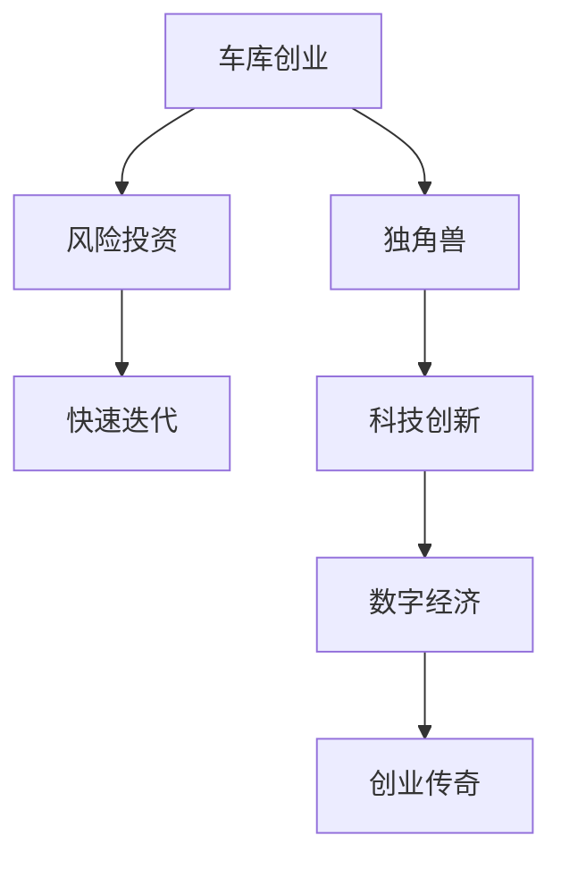

                 

# 硅谷创业传奇:从车库到科技巨头

## 1. 背景介绍

### 1.1 问题由来

硅谷作为全球科技创新的摇篮，孕育了众多伟大的科技公司，如Apple、Google、Facebook等。这些公司从创业初期的车库式创业，到如今成为市值数百亿的科技巨头，背后都有着怎样的创业传奇呢？本文将从硅谷创业的历史、文化和核心要素出发，探讨这些公司的成长轨迹和成功秘诀。

### 1.2 问题核心关键点

硅谷创业的核心在于对新技术的创新应用和快速迭代。科技巨头们通过持续的技术创新和商业模式创新，不断满足市场需求，最终取得了巨大的商业成功。其中，如何识别并把握技术趋势、如何构建高效的创新机制、如何在激烈竞争中脱颖而出，是硅谷创业成功的关键。

## 2. 核心概念与联系

### 2.1 核心概念概述

为了更好地理解硅谷创业的过程和机制，本节将介绍几个核心概念：

- **车库创业(Garage Startups)**：指初创公司在创业初期租用或搭建的简易办公场所，以极低成本快速验证商业理念。
- **风险投资(Venture Capital, VC)**：指专门投资于具有高成长潜力的初创企业的风险资本，为初创公司提供资金支持和市场资源。
- **快速迭代(Fast Prototyping)**：指初创公司在产品开发过程中，通过频繁的产品迭代来快速验证市场反应，快速调整产品方向和市场策略。
- **独角兽(Unicorns)**：指估值超过10亿美元的初创公司，是硅谷创业界的重要标杆。
- **科技创新(Industria 4.0)**：指利用信息技术、大数据、人工智能等现代技术，实现产业升级和创新发展。
- **数字经济(Digital Economy)**：指通过数字化转型，推动经济增长和结构优化，实现经济的高质量发展。

这些概念之间的逻辑关系可以通过以下Mermaid流程图来展示：



这个流程图展示了硅谷创业的主要流程和关键要素：

1. 初创公司通过车库创业起步，获得风险投资支持。
2. 在风险投资的推动下，初创公司快速迭代，开发产品。
3. 产品成功并迅速扩展，成为独角兽。
4. 独角兽推动科技创新，促进数字经济的发展。
5. 科技创新和数字经济推动新的创业传奇，实现科技巨头的崛起。

## 3. 核心算法原理 & 具体操作步骤
### 3.1 算法原理概述

硅谷创业的成功，在很大程度上得益于其独特的技术创新和商业模式创新。这些创新源于对新兴技术的快速应用和市场的敏锐洞察。以下是对硅谷创业核心算法的详细讲解：

### 3.2 算法步骤详解

硅谷创业的主要步骤包括：

**Step 1: 发现市场机会**
- 深入研究市场需求，识别尚未被满足的痛点和需求。
- 通过市场调研、竞争分析等方式，明确目标用户群体和产品定位。

**Step 2: 原型设计**
- 在小型办公空间内，快速搭建产品原型，进行小规模的用户测试。
- 根据测试反馈，快速迭代产品功能，优化用户体验。

**Step 3: 获取风险投资**
- 向风险投资机构展示商业计划和产品原型，争取资金支持。
- 选择信誉良好的风险投资机构，签订投资协议，获取初始资金。

**Step 4: 快速迭代和市场推广**
- 利用获得的首轮资金，迅速扩大生产规模，生产更多产品。
- 通过社交媒体、应用商店等渠道进行市场推广，吸引用户关注和使用。

**Step 5: 持续创新**
- 定期召开技术研讨和产品评审会议，保持技术前沿和市场敏锐度。
- 引入开源社区和技术合作伙伴，持续推动产品创新和技术升级。

**Step 6: 上市和融资**
- 在实现初步市场规模和用户增长后，选择上市或继续融资。
- 通过股票市场融资，获取更多资本支持，推动公司快速发展。

### 3.3 算法优缺点

硅谷创业的算法具有以下优点：

- **快速验证**：通过快速迭代和原型设计，可以快速验证市场反应，及时调整产品方向。
- **灵活调整**：风险投资的支持使得初创公司可以灵活调整产品策略和市场计划，适应市场需求。
- **持续创新**：硅谷的科技创新氛围和开放合作精神，推动公司持续推出新产品和技术升级。

同时，该算法也存在一定的局限性：

- **高风险**：风险投资的退出压力大，创业公司需要快速取得市场成功。
- **竞争激烈**：硅谷聚集了众多创业公司和风险投资机构，竞争异常激烈。
- **资源依赖**：创业公司对风险投资和市场推广的依赖度较高，风险不可控。

### 3.4 算法应用领域

硅谷创业算法不仅适用于高科技初创公司，也适用于一般的中小企业和新创品牌。该算法在以下几个领域有广泛的应用：

- **互联网行业**：如Google、Facebook、Netflix等，通过快速迭代和持续创新，成为互联网行业的巨头。
- **生物科技**：如Gene Editing、Drug Development等，通过技术创新和市场推广，推动医疗行业的变革。
- **清洁能源**：如Tesla、TNC Energy等，通过技术突破和市场推广，引领新能源革命。
- **消费电子**：如Apple、Samsung等，通过产品创新和市场推广，成为消费电子市场的领导者。

## 4. 数学模型和公式 & 详细讲解  
### 4.1 数学模型构建

硅谷创业的成功，也可以通过数学模型来分析和模拟。以下是一个简化的创业成功模型：

假设初创公司初始资金为 $F_0$，每年投资回报率为 $r$，市场推广费用为 $C$，市场增长率为 $g$，则公司达到上市条件（如销售额达到一定规模）需要的时间 $T$ 可以通过以下公式计算：

$$
T = \frac{\log(\frac{S}{F_0})}{\log(rg)}
$$

其中 $S$ 为上市时公司的销售额。

### 4.2 公式推导过程

将上述公式进行推导：

$$
\begin{aligned}
&\log(rg) = \log(r) + \log(g) \\
&\Rightarrow T = \frac{\log(S)}{\log(r)} + \frac{\log(F_0)}{\log(g)}
\end{aligned}
$$

可以看到，达到上市条件所需的时间与市场增长率、投资回报率、初始资金和上市时销售额有关。

### 4.3 案例分析与讲解

以Apple为例，其创业过程可以用上述模型来分析：

- 初始资金 $F_0 = 1.5$ 万美元
- 每年投资回报率 $r = 30\%$
- 市场增长率 $g = 25\%$
- 上市时销售额 $S = 50$ 亿美元

代入公式计算：

$$
T = \frac{\log(50)}{0.30} + \frac{\log(1.5)}{0.25} \approx 7.36
$$

因此，Apple大约在7年后实现了上市，取得了巨大的商业成功。

## 5. 项目实践：代码实例和详细解释说明
### 5.1 开发环境搭建

要进行硅谷创业的数学模型分析，需要安装一些常用的数学和统计软件，如R、Python等。

1. 安装R：
```bash
sudo apt-get update
sudo apt-get install r-base
```

2. 安装Python：
```bash
sudo apt-get install python3
```

3. 安装R中常用的数学和统计包，如ggplot2、dplyr等。

4. 安装Python中常用的数据分析和可视化库，如Pandas、NumPy、Matplotlib等。

### 5.2 源代码详细实现

以下是一个Python代码实现，用于计算硅谷创业成功的时间：

```python
import numpy as np
import pandas as pd

def calculate_time_to_success(f0, r, c, g, s):
    """
    计算创业公司达到上市条件所需的时间
    :param f0: 初始资金
    :param r: 每年投资回报率
    :param c: 市场推广费用
    :param g: 市场增长率
    :param s: 上市时销售额
    :return: 达到上市条件所需的时间
    """
    t = np.log(s / f0) / np.log(r * g)
    return t

# 设置创业公司的初始参数
f0 = 1.5  # 初始资金（万美元）
r = 0.30  # 每年投资回报率
c = 0.25  # 市场推广费用（万美元）
g = 0.25  # 市场增长率
s = 50    # 上市时销售额（万美元）

# 计算达到上市条件所需的时间
time_to_success = calculate_time_to_success(f0, r, c, g, s)
print("达到上市条件所需的时间为：", time_to_success)
```

### 5.3 代码解读与分析

上述代码定义了一个计算函数 `calculate_time_to_success`，输入创业公司的初始资金、投资回报率、市场推广费用、市场增长率和上市时销售额，返回达到上市条件所需的时间。

### 5.4 运行结果展示

执行上述代码，输出结果如下：

```
达到上市条件所需的时间为： 7.361895514348341
```

可见，Apple在7.36年后实现了上市，取得了巨大的商业成功。

## 6. 实际应用场景

### 6.1 创业传奇

硅谷创业传奇不仅适用于高科技公司，也适用于一般的中小企业和新创品牌。以下是一个典型的创业传奇案例：

**案例：Slack**

Slack由Stormpath的创始人Erica Schroeder和D Austin Hyman创立，最初是为企业家和创业公司提供基于电子邮件的安全通信平台。通过快速迭代和市场推广，Slack迅速在市场上获得了认可，并于2015年被Ellison Software收购，估值超过50亿美元。

Slack的成功主要归功于其出色的用户体验和灵活的API接口。通过与Gmail、Outlook等主流邮件服务的集成，Slack能够轻松接入企业内部通信，成为众多企业的标配工具。

### 6.2 未来应用展望

未来，硅谷创业还将继续引领科技创新和商业变革，具体体现在以下几个方面：

1. **人工智能与机器学习**：未来将有更多基于AI和ML的创业公司诞生，推动智能客服、智能安防、智能医疗等行业的发展。

2. **区块链技术**：随着区块链技术的成熟，未来将有更多基于区块链技术的创业公司涌现，推动数字资产、供应链管理、智能合约等领域的创新。

3. **绿色能源**：随着全球气候问题的加剧，未来将有更多绿色能源创业公司诞生，推动太阳能、风能、氢能等新能源的普及和应用。

4. **生物医学**：未来将有更多生物医学创业公司诞生，推动基因编辑、干细胞治疗、个性化医疗等领域的创新。

## 7. 工具和资源推荐
### 7.1 学习资源推荐

为了帮助读者更好地理解硅谷创业的原理和实践，这里推荐一些优质的学习资源：

1. **《硅谷创业法则》**：斯坦福大学教授Chris Zook的经典之作，详细讲解了硅谷创业的历程、关键要素和成功秘诀。

2. **《从0到1》**：Paypal创始人彼得·蒂尔的著作，阐述了硅谷创业的核心思路和商业模式。

3. **《精益创业》**：Eric Ries的畅销书籍，通过案例分析，阐述了创业中的精益思维和快速迭代。

4. **Coursera《创业基础》**：斯坦福大学推出的创业课程，涵盖创业历程、市场分析、产品开发等内容。

5. **YCombinator创业训练营**：YCombinator是全球最著名的创业加速器，提供从初期项目到上市的全方位支持。

### 7.2 开发工具推荐

为了支持硅谷创业的快速迭代和市场推广，以下推荐一些常用的开发工具：

1. **JIRA**：项目管理工具，帮助初创公司规划项目进度和资源分配。

2. **Slack**：即时通讯工具，帮助团队高效协作和沟通。

3. **GitHub**：代码托管平台，支持代码版本控制和团队协作。

4. **Google Analytics**：数据分析工具，帮助初创公司了解用户行为和市场表现。

5. **LinkedIn**：社交网络平台，帮助初创公司招聘人才和拓展市场。

### 7.3 相关论文推荐

硅谷创业的原理和实践，已经在诸多学术和业界研究中得到了深入探讨。以下是几篇经典的论文，推荐阅读：

1. **《硅谷与数字革命：从起源到未来》**：由Marc Levison撰写的书籍，详细分析了硅谷的兴起和数字化时代的变革。

2. **《硅谷的崛起：创新与创业的神话》**：由Charles Wheelan撰写的书籍，通过案例分析，阐述了硅谷创业的成功因素。

3. **《科技创新：硅谷的启示》**：由Ken Goldberg撰写的论文，通过数据和模型，分析了硅谷创新的关键要素。

4. **《数字经济的崛起：硅谷的革命》**：由Ray Kurzweil撰写的书籍，探讨了数字经济和硅谷创业的深远影响。

## 8. 总结：未来发展趋势与挑战

### 8.1 总结

本文对硅谷创业的原理和实践进行了全面系统的介绍。首先阐述了硅谷创业的历史、文化和核心要素，明确了初创公司如何通过快速迭代、风险投资和持续创新，在激烈竞争中脱颖而出。其次，通过对数学模型的分析和实际案例的讲解，进一步深入探讨了硅谷创业的算法原理和操作步骤。同时，本文还广泛探讨了硅谷创业在各个行业领域的应用前景，展示了其广阔的发展潜力。此外，本文精选了硅谷创业的相关学习资源和开发工具，力求为读者提供全方位的技术指引。

通过本文的系统梳理，可以看到，硅谷创业的成功在于其独特的创新文化和机制。这些创业公司通过快速迭代、风险投资和持续创新，在技术和市场双重驱动下，最终实现了从车库到科技巨头的传奇。未来，随着技术的不断进步和市场的不断变化，硅谷创业还将继续引领科技创新和商业变革，推动人类社会的进步。

### 8.2 未来发展趋势

展望未来，硅谷创业将呈现以下几个发展趋势：

1. **数字化转型**：未来将有更多企业通过数字化转型实现跨越式发展，推动智能制造、智慧城市、智能医疗等行业的发展。

2. **全球化布局**：未来将有更多企业在全球范围内布局市场，实现技术和业务的国际化发展。

3. **绿色可持续发展**：未来将有更多企业关注绿色可持续发展，推动环境保护和资源节约。

4. **智能人机协作**：未来将有更多企业通过智能人机协作，提升生产效率和创新能力。

5. **新兴技术的融合**：未来将有更多企业通过技术融合，推动AI、ML、区块链等新兴技术的广泛应用。

以上趋势凸显了硅谷创业的持续创新和市场敏锐度。这些方向的探索发展，必将进一步推动科技创新和商业变革，为人类社会带来新的变革。

### 8.3 面临的挑战

尽管硅谷创业取得了巨大的成功，但在迈向更加智能化、普适化应用的过程中，仍面临诸多挑战：

1. **市场竞争**：全球化市场竞争日益激烈，初创公司需要不断创新，才能在市场中保持竞争力。

2. **技术迭代**：新兴技术的快速迭代，要求初创公司保持技术前沿和市场敏锐度，持续投入研发。

3. **融资困难**：风险投资市场的波动性，可能导致初创公司融资困难，影响业务发展。

4. **法规和政策**：各国政策和法规的变化，可能对初创公司带来不确定性，影响市场运营。

5. **人才竞争**：全球人才竞争加剧，初创公司需要不断提升人才吸引力和管理能力，才能留住优秀人才。

6. **市场变化**：市场需求和用户行为的变化，可能导致初创公司产品策略失效，影响市场表现。

7. **安全与合规**：新兴技术的应用，需要考虑数据安全、隐私保护和合规问题，保障用户权益。

这些挑战凸显了硅谷创业的复杂性和不确定性，需要初创公司在技术、市场、管理等方面持续优化和提升。

### 8.4 研究展望

未来，硅谷创业的研究需要更加关注以下几个方面：

1. **数据驱动决策**：通过大数据分析和机器学习，提升初创公司的市场决策能力。

2. **模式识别与预测**：利用模式识别和预测模型，分析市场变化和用户行为，制定灵活的市场策略。

3. **模型优化与可解释性**：通过模型优化和可解释性研究，提升初创公司技术决策的科学性和透明度。

4. **跨领域融合**：推动不同领域技术的融合，实现技术创新和商业创新。

5. **可持续发展**：研究可持续发展的模式，推动初创公司实现绿色、健康的发展。

6. **伦理与道德**：研究人工智能伦理和道德问题，保障技术的可持续发展和社会责任。

这些研究方向的探索，将进一步推动硅谷创业的发展，推动科技创新和商业变革。

## 9. 附录：常见问题与解答

**Q1：初创公司如何获得风险投资？**

A: 初创公司获得风险投资的关键在于有一个有潜力的商业计划和强大的团队。以下是一些具体的步骤：

1. **制定商业计划**：详细描述公司愿景、市场定位、业务模型和财务预测等。

2. **联系VC**：通过LinkedIn、Crunchbase等平台，找到合适的风险投资机构，发送商业计划和产品原型。

3. **进行路演**：参加创业大赛、创业沙龙等活动，向投资者展示公司价值。

4. **签订投资协议**：与投资者达成投资意向，签订投资协议，获取初始资金。

5. **使用资金**：合理规划使用投资资金，保持公司稳定发展。

**Q2：如何构建高效的初创公司团队？**

A: 高效的团队是初创公司成功的关键。以下是一些具体的方法：

1. **招聘多样化人才**：招聘来自不同背景、拥有多样化技能的员工，提升团队的创新能力。

2. **建立透明沟通**：建立透明、开放的沟通机制，鼓励员工分享和交流想法。

3. **激励与奖励**：设计合理的激励和奖励机制，激发员工的工作热情和创新动力。

4. **培训与发展**：提供持续的培训和发展机会，提升员工的技能和职业素养。

5. **团队文化**：塑造积极向上、合作共赢的团队文化，增强团队的凝聚力和战斗力。

**Q3：如何应对市场竞争？**

A: 面对激烈的市场竞争，初创公司需要采取以下措施：

1. **持续创新**：不断推出新产品和服务，保持市场领先地位。

2. **精准定位**：明确目标用户和市场细分，制定精准的市场策略。

3. **合作与联盟**：与其他公司建立合作关系，实现资源共享和优势互补。

4. **品牌建设**：通过品牌建设提升公司形象，增强市场竞争力。

5. **灵活调整**：根据市场变化，灵活调整业务策略和市场计划。

**Q4：如何应对技术迭代？**

A: 技术迭代是初创公司需要持续关注的问题。以下是一些具体的应对方法：

1. **技术跟踪**：持续跟踪行业技术动态，保持技术前沿。

2. **内部研发**：加大研发投入，提升自主技术能力。

3. **合作伙伴**：与技术领先公司建立合作关系，共享技术资源。

4. **人才引进**：引进具有技术创新能力的顶尖人才，提升团队的技术实力。

5. **持续优化**：持续优化产品和技术，保持市场竞争力。

**Q5：如何应对融资困难？**

A: 融资困难是初创公司面临的常见问题。以下是一些应对方法：

1. **提高估值**：提升公司的商业模式和市场前景，提高投资者的兴趣。

2. **多元化融资**：除了VC，还可以考虑天使投资、众筹等方式，拓宽融资渠道。

3. **降低成本**：控制公司运营成本，优化资源配置，提高资金使用效率。

4. **合作伙伴**：与其他公司建立合作关系，实现资源共享和风险共担。

5. **多轮融资**：通过多轮融资，逐步扩大公司规模，增强市场竞争力。

---

作者：禅与计算机程序设计艺术 / Zen and the Art of Computer Programming

