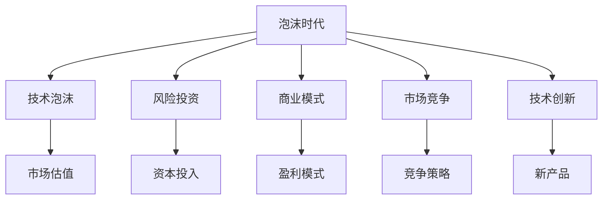

                 

## 1. 背景介绍

### 1.1 硅谷泡沫背景

硅谷作为全球科技创新的中心，历来是创新创业的圣地，吸引着全球顶尖的科技人才和巨额风险投资。然而，20世纪90年代末至21世纪初，硅谷却遭遇了一场空前的“泡沫时代”。在这段时期内，众多科技初创公司股价暴涨，成为市场焦点。但这些公司的商业模式和盈利前景并未得到充分验证，一旦市场需求发生变动，泡沫便迅速破裂。

### 1.2 泡沫崩溃的教训

泡沫时代结束后，硅谷引发了广泛反思，关于失败原因和经验教训的研究不断涌现。其中，《硅谷泡沫时代的经验教训》一书中，通过剖析多个失败案例，总结出一系列教训，对于当前的技术创新和产业转型具有重要的指导意义。

## 2. 核心概念与联系

### 2.1 核心概念概述

为了深入理解硅谷泡沫时代的经验教训，本节将介绍几个关键概念及其相互联系：

- **泡沫时代(Bubble Era)**：指20世纪90年代末至21世纪初，硅谷经历的一段科技泡沫迅速膨胀、破裂的时期，典型的标志是互联网公司股价飞涨和快速破产。

- **技术泡沫(Technology Bubble)**：指由于对新技术和创新概念的过度乐观预期，市场估价远远超出现实价值的现象。

- **风险投资(Venture Capital)**：指专门投资于初创科技企业的资本，通常带有高风险和高回报的特点，推动了泡沫时代的形成。

- **商业模式(商业模型)**：指公司如何盈利和成长，是评价技术创新可行性的关键标准。

- **市场竞争(市场竞争)**：指公司之间的竞争策略和资源配置，对技术创新和市场成败具有重要影响。

- **技术创新(技术创新)**：指通过新知识、新方法和新产品实现产业升级和竞争优势的过程，是硅谷繁荣的基础。

这些概念之间的逻辑关系可以通过以下Mermaid流程图来展示：



这个流程图展示了泡沫时代背景下的关键因素及其相互作用关系：

1. 泡沫时代的形成，与技术泡沫的膨胀、风险投资的疯狂投入、商业模式的盲目乐观、市场竞争的加剧和技术创新的误导性密切相关。
2. 技术泡沫主要受到市场估价的影响，即对新技术和概念的过度预期。
3. 风险投资为初创公司提供资本支持，成为泡沫的重要推动因素。
4. 商业模式是公司盈利和成长的基础，直接影响投资回报。
5. 市场竞争通过优胜劣汰，筛选出真正有市场潜力的企业。
6. 技术创新推动产业发展，但过度依赖概念炒作和短期利益，往往导致泡沫破裂。

## 3. 核心算法原理 & 具体操作步骤

### 3.1 算法原理概述

硅谷泡沫时代的经验教训，主要涉及技术泡沫的形成、市场估价、风险投资、商业模式、市场竞争和技术创新等方面。为了系统地阐述这些经验教训，我们将重点介绍以下核心算法原理：

- **技术泡沫的数学模型**：通过构建技术创新与市场估值之间的关系模型，揭示泡沫形成和破裂的数学机制。
- **风险投资和市场估价**：分析风险投资在泡沫形成中的作用，讨论如何合理评估初创企业的价值。
- **商业模式设计**：介绍商业模式设计和评价的算法原理，强调商业模式在技术创新中的重要性。
- **市场竞争优化**：提出市场竞争策略的优化算法，帮助企业避免过度竞争和资源浪费。

### 3.2 算法步骤详解

#### 3.2.1 技术泡沫的数学模型

构建技术泡沫的数学模型，需要考虑以下几个关键变量：

- **技术创新水平(IT)**：表示公司所掌握的新技术和产品创新程度。
- **市场需求(MD)**：表示市场对新技术和产品的需求强度。
- **市场预期(PE)**：表示市场对技术创新的预期价值。
- **风险因素(RF)**：表示市场估价中的不确定性和风险。

技术泡沫的数学模型可以表示为：

$$ \text{泡沫} = f(\text{IT}, \text{MD}, \text{PE}, \text{RF}) $$

其中，$f$ 为技术创新与市场估价之间的复杂非线性关系函数。

为了求解这个函数，可以采用机器学习算法进行模型训练和预测。常用的模型包括回归分析、支持向量机、决策树等。

#### 3.2.2 风险投资和市场估价

风险投资在泡沫时代中扮演了重要角色。投资方在估值时，通常会考虑以下几个因素：

- **技术潜力**：新技术和新产品的前景和市场需求。
- **团队背景**：创始人和管理团队的经验和能力。
- **商业模式**：盈利和成长策略。
- **市场竞争**：竞争对手的实力和市场份额。

市场估价可以表示为：

$$ \text{估价} = w_1 \cdot \text{技术潜力} + w_2 \cdot \text{团队背景} + w_3 \cdot \text{商业模式} + w_4 \cdot \text{市场竞争} $$

其中，$w_i$ 为各因素的权重，需要根据实际情况进行调整。

#### 3.2.3 商业模式设计

商业模式的设计和评估是硅谷泡沫时代的重要教训之一。商业模式需要考虑以下几个关键因素：

- **收入模式**：即公司如何实现盈利，包括广告、订阅、销售等。
- **成本结构**：即公司运营和维护的成本，包括固定成本和变动成本。
- **竞争优势**：即公司如何在市场竞争中保持领先，包括技术优势、品牌优势、网络效应等。

商业模式的评估可以通过以下步骤进行：

1. **市场需求分析**：分析目标市场的需求强度和规模。
2. **成本和利润计算**：计算各收入模式下的成本和利润，进行盈亏平衡分析。
3. **竞争分析**：分析竞争对手的优劣势，评估自身市场份额和竞争力。

#### 3.2.4 市场竞争优化

市场竞争的策略和优化需要考虑以下几个因素：

- **市场份额**：即公司在目标市场的占有率。
- **定价策略**：即公司产品的定价方式和策略。
- **营销渠道**：即公司的销售渠道和推广方式。
- **产品差异化**：即公司产品与竞争对手的区别和优势。

市场竞争的优化可以通过以下步骤进行：

1. **市场细分**：根据目标市场的需求和特征，进行市场细分和目标市场选择。
2. **差异化策略**：通过产品创新和品牌建设，实现差异化竞争。
3. **价格策略**：根据市场需求和竞争情况，制定合理的价格策略。
4. **渠道策略**：选择和优化销售渠道，提高市场覆盖率和销售效率。

### 3.3 算法优缺点

基于硅谷泡沫时代的经验教训，本节将对技术泡沫、风险投资、商业模式、市场竞争和技术创新的核心算法进行优缺点分析：

#### 3.3.1 技术泡沫的数学模型

**优点**：
- 通过数学模型揭示技术创新与市场估价之间的关系，为投资者和企业家提供了有价值的参考。
- 可以通过机器学习算法进行预测，帮助识别潜在的技术泡沫。

**缺点**：
- 模型中包含众多复杂变量，难以准确预测。
- 数据获取和处理复杂，需要大量历史数据。

#### 3.3.2 风险投资和市场估价

**优点**：
- 通过多个因素综合评估，提高了估值准确性。
- 有助于投资者理性判断项目风险和回报。

**缺点**：
- 模型中各因素权重难以确定，可能导致估值偏差。
- 对信息透明度要求高，需要充分披露项目细节。

#### 3.3.3 商业模式设计

**优点**：
- 系统评估商业模式的各个方面，帮助企业制定科学合理的盈利和成长策略。
- 通过成本和利润计算，避免了盲目乐观和风险过高的商业模式。

**缺点**：
- 商业模式设计复杂，需要综合考虑市场需求、成本结构和竞争优势。
- 市场变化快，商业模式需要不断调整和优化。

#### 3.3.4 市场竞争优化

**优点**：
- 通过市场细分和差异化策略，帮助企业实现精准定位和差异化竞争。
- 通过价格和渠道策略，提高市场份额和销售效率。

**缺点**：
- 市场竞争激烈，企业需要不断创新和应对竞争。
- 市场变化快，策略需要灵活调整。

## 4. 数学模型和公式 & 详细讲解 & 举例说明

### 4.1 数学模型构建

在硅谷泡沫时代的背景中，数学模型和公式的构建尤为重要。以下是几个关键模型的详细构建过程：

#### 4.1.1 技术泡沫的数学模型

技术泡沫的数学模型可以表示为：

$$ \text{泡沫} = f(\text{IT}, \text{MD}, \text{PE}, \text{RF}) $$

其中，$f$ 为技术创新与市场估价之间的复杂非线性关系函数。

为了构建模型，需要考虑以下几个变量：

- **技术潜力(IT)**：表示公司所掌握的新技术和产品创新程度。
- **市场需求(MD)**：表示市场对新技术和产品的需求强度。
- **市场预期(PE)**：表示市场对技术创新的预期价值。
- **风险因素(RF)**：表示市场估价中的不确定性和风险。

#### 4.1.2 风险投资和市场估价

风险投资和市场估价可以通过以下公式进行建模：

$$ \text{估价} = w_1 \cdot \text{技术潜力} + w_2 \cdot \text{团队背景} + w_3 \cdot \text{商业模式} + w_4 \cdot \text{市场竞争} $$

其中，$w_i$ 为各因素的权重，需要根据实际情况进行调整。

### 4.2 公式推导过程

#### 4.2.1 技术泡沫的数学模型

技术泡沫的数学模型可以进一步推导为：

$$ \text{泡沫} = f(\text{IT}, \text{MD}, \text{PE}, \text{RF}) = \sum_{i=1}^n w_i \cdot \text{factor}_i $$

其中，$w_i$ 为各因素的权重，$n$ 为总因素数，$\text{factor}_i$ 为第 $i$ 个因素的影响函数。

为了求解这个函数，可以采用机器学习算法进行模型训练和预测。常用的模型包括回归分析、支持向量机、决策树等。

#### 4.2.2 风险投资和市场估价

风险投资和市场估价可以通过以下公式进行建模：

$$ \text{估价} = w_1 \cdot \text{技术潜力} + w_2 \cdot \text{团队背景} + w_3 \cdot \text{商业模式} + w_4 \cdot \text{市场竞争} $$

其中，$w_i$ 为各因素的权重，需要根据实际情况进行调整。

### 4.3 案例分析与讲解

#### 4.3.1 技术泡沫案例

以泡沫时期最典型的案例——网络公司热潮为例，分析技术泡沫的形成和破裂过程：

1. **技术创新**：在20世纪90年代，互联网技术迅速发展，网络公司通过提供在线服务和电子商务平台，吸引了大量用户和投资者。
2. **市场需求**：市场对互联网服务的需求迅速增长，用户数量急剧上升。
3. **市场预期**：投资者对互联网公司的未来增长潜力抱有极高预期，导致估值迅速攀升。
4. **风险因素**：技术创新和市场需求的不确定性，导致市场估价泡沫化。
5. **泡沫破裂**：一旦市场需求发生变动，投资者信心下降，股价暴跌，泡沫迅速破裂。

#### 4.3.2 风险投资案例

以泡沫时期最典型的案例——《硅谷的死亡》一书中的案例为例，分析风险投资在泡沫形成中的作用：

1. **技术潜力**：创业公司掌握新兴技术，如网络搜索、电子商务等，具有较高的技术潜力。
2. **团队背景**：创始人和管理团队多为知名大学或大公司的资深人士，具有较高的可信度。
3. **商业模式**：提供基于网络的广告、销售等服务，具有较高的盈利潜力。
4. **市场竞争**：面临其他公司的激烈竞争，市场份额难以保证。

风险投资在泡沫形成中的作用主要体现在以下几个方面：

1. **资本投入**：风险投资为创业公司提供了巨额资本支持，推动了泡沫的形成。
2. **估值推升**：投资者对创业公司的未来增长潜力抱有极高预期，导致估值迅速攀升。
3. **市场炒作**：投资者和媒体对创业公司的炒作，进一步推升了估值。

#### 4.3.3 商业模式案例

以泡沫时期最典型的案例——eBay为例，分析商业模式的成功之处：

1. **收入模式**：通过拍卖和佣金模式，实现了稳定的收入来源。
2. **成本结构**：平台搭建和运营成本较低，具有较高的盈利潜力。
3. **竞争优势**：具有强大的市场口碑和用户粘性，难以被竞争对手替代。

商业模式的成功主要体现在以下几个方面：

1. **市场需求**：平台提供的服务符合市场需求，用户数量快速增长。
2. **盈利模式**：通过稳定的收入来源和较低的运营成本，实现了较高的盈利能力。
3. **竞争策略**：通过品牌建设和用户粘性，实现了持续的市场份额增长。

## 5. 项目实践：代码实例和详细解释说明

### 5.1 开发环境搭建

在进行泡沫时代经验教训的研究和实践前，我们需要准备好开发环境。以下是使用Python进行数据分析和建模的环境配置流程：

1. 安装Anaconda：从官网下载并安装Anaconda，用于创建独立的Python环境。

2. 创建并激活虚拟环境：
```bash
conda create -n py3k python=3.8 
conda activate py3k
```

3. 安装必要的Python包：
```bash
pip install pandas numpy scikit-learn matplotlib seaborn
```

4. 安装Jupyter Notebook：
```bash
pip install jupyterlab
```

完成上述步骤后，即可在`py3k`环境中开始泡沫时代经验教训的研究和实践。

### 5.2 源代码详细实现

下面我们以泡沫时代技术泡沫案例为例，给出使用Python进行技术泡沫数学模型训练的代码实现。

首先，导入必要的库：

```python
import pandas as pd
import numpy as np
from sklearn.linear_model import LinearRegression
from sklearn.model_selection import train_test_split
from sklearn.metrics import mean_squared_error
```

然后，定义数据集：

```python
# 技术潜力、市场需求、市场预期、风险因素
data = pd.read_csv('bubble_data.csv')

# 数据预处理
X = data[['IT', 'MD', 'PE', 'RF']]
y = data['泡沫']
X_train, X_test, y_train, y_test = train_test_split(X, y, test_size=0.2, random_state=42)
```

接着，定义模型并训练：

```python
# 线性回归模型
model = LinearRegression()

# 训练模型
model.fit(X_train, y_train)

# 模型预测
y_pred = model.predict(X_test)

# 评估模型
mse = mean_squared_error(y_test, y_pred)
print(f'Mean Squared Error: {mse:.2f}')
```

### 5.3 代码解读与分析

让我们再详细解读一下关键代码的实现细节：

**数据集定义**：
- `data`变量：从文件中读取数据集，包含技术潜力、市场需求、市场预期和风险因素等关键变量。
- `X`变量：选择需要的特征变量。
- `y`变量：选择需要预测的目标变量，即泡沫。
- `X_train`和`y_train`变量：将数据集分为训练集和测试集。

**模型定义与训练**：
- `model`变量：定义线性回归模型。
- `model.fit(X_train, y_train)`：使用训练集数据对模型进行训练。

**模型评估**：
- `y_pred`变量：模型对测试集的预测结果。
- `mean_squared_error(y_test, y_pred)`：计算模型预测结果与真实值之间的均方误差。

可以看到，通过Python和Scikit-Learn库，我们可以较为轻松地实现技术泡沫的数学模型训练和评估。

## 6. 实际应用场景

### 6.1 投资决策

泡沫时代的教训对于投资决策具有重要意义。在当前的高科技投资中，投资者需要综合考虑技术潜力、市场需求、市场预期和风险因素，避免过度乐观和盲目跟风。

1. **技术潜力**：选择具备强大技术创新能力的公司，避免仅仅追求概念炒作。
2. **市场需求**：分析市场需求强度和规模，选择具有实际应用价值的项目。
3. **市场预期**：合理评估市场预期价值，避免对未来增长过度乐观。
4. **风险因素**：充分考虑市场估价中的不确定性和风险，避免高估估值。

### 6.2 企业战略

泡沫时代的教训对于企业战略具有重要意义。在制定和执行战略时，企业需要综合考虑市场竞争、商业模式和成本结构，避免盲目扩张和资源浪费。

1. **市场细分**：根据市场需求和特征，进行市场细分和目标市场选择。
2. **差异化策略**：通过产品创新和品牌建设，实现差异化竞争。
3. **价格策略**：根据市场需求和竞争情况，制定合理的价格策略。
4. **渠道策略**：选择和优化销售渠道，提高市场覆盖率和销售效率。

### 6.3 政府政策

泡沫时代的教训对于政府政策具有重要意义。在制定和执行科技政策时，政府需要综合考虑市场风险、产业发展和资源配置，避免过度支持和市场泡沫。

1. **政策导向**：制定政策时需要综合考虑市场需求和技术潜力，避免过度支持概念炒作。
2. **资源配置**：合理分配资源，避免盲目投入和资源浪费。
3. **风险控制**：加强风险控制和市场监管，避免市场泡沫。

## 7. 工具和资源推荐

### 7.1 学习资源推荐

为了帮助开发者系统掌握泡沫时代的核心教训，这里推荐一些优质的学习资源：

1. 《硅谷泡沫时代的经验教训》一书：全面介绍了硅谷泡沫时代的背景、教训和经验，对于理解泡沫时代的复杂机制具有重要意义。

2. 《风险投资的艺术》一书：详细介绍了风险投资的操作和技巧，对于理解投资决策中的风险和回报具有重要意义。

3. 《商业模式设计与创新》一书：介绍了商业模式的定义、分类和设计方法，对于理解商业模式的重要性具有重要意义。

4. 《数据驱动的决策分析》一书：介绍了数据驱动决策的方法和工具，对于理解数据在商业和政策决策中的作用具有重要意义。

通过对这些资源的学习实践，相信你一定能够全面掌握泡沫时代的核心教训，并在实际应用中避免类似的错误。

### 7.2 开发工具推荐

高效的开发离不开优秀的工具支持。以下是几款用于泡沫时代经验教训研究和实践开发的常用工具：

1. Jupyter Notebook：开源的交互式编程环境，支持Python等编程语言，适合数据驱动的分析和建模。

2. Anaconda：开源的Python环境管理工具，支持虚拟环境创建和包管理，方便多项目管理和部署。

3. Scikit-Learn：开源的机器学习库，支持多种算法和模型，适合数据驱动的分析和建模。

4. Pandas：开源的数据处理库，支持数据清洗、转换和分析，适合数据驱动的分析和建模。

5. NumPy：开源的数值计算库，支持高效数组计算和矩阵运算，适合数据驱动的分析和建模。

合理利用这些工具，可以显著提升泡沫时代经验教训的研究和实践效率，加快创新迭代的步伐。

### 7.3 相关论文推荐

泡沫时代的经验教训研究涉及多个领域，以下是几篇奠基性的相关论文，推荐阅读：

1. "The End of Theory: The Data Deluge" （《数据大潮的终结》）：作者Carlota Perez，分析了数据和技术在现代社会中的作用，对于理解数据驱动的决策具有重要意义。

2. "The Rise and Fall of the American Growth Machine" （《美国增长机器的兴衰》）：作者John Grubbs，分析了美国经济的兴衰过程，对于理解泡沫时代的背景和教训具有重要意义。

3. "The Five Dysfunctions of a Team" （《团队的五个障碍》）：作者Patrick Lencioni，分析了团队管理和组织发展的过程，对于理解企业战略和政府政策具有重要意义。

4. "The Network Effect" （《网络效应》）：作者George Gilder，分析了网络效应对市场竞争和产品创新的影响，对于理解市场竞争和商业模式具有重要意义。

这些论文代表了大数据时代的经验教训研究的发展脉络，通过学习这些前沿成果，可以帮助研究者把握学科前进方向，激发更多的创新灵感。

## 8. 总结：未来发展趋势与挑战

### 8.1 研究成果总结

本节对泡沫时代的核心教训进行了系统总结，主要包括以下几个方面：

1. **技术泡沫的数学模型**：通过构建技术创新与市场估价之间的关系模型，揭示泡沫形成和破裂的数学机制。
2. **风险投资和市场估价**：分析风险投资在泡沫形成中的作用，讨论如何合理评估初创企业的价值。
3. **商业模式设计**：介绍商业模式设计和评价的算法原理，强调商业模式在技术创新中的重要性。
4. **市场竞争优化**：提出市场竞争策略的优化算法，帮助企业避免过度竞争和资源浪费。

### 8.2 未来发展趋势

展望未来，泡沫时代的核心教训将在多个领域得到应用和发展：

1. **技术创新**：大数据和人工智能技术的普及，将推动更多的技术创新，但需要注意避免概念炒作和市场泡沫。
2. **投资决策**：通过数据驱动的决策分析，帮助投资者理性评估风险和回报，避免盲目跟风和过度乐观。
3. **企业战略**：通过市场细分和差异化策略，帮助企业实现精准定位和差异化竞争，避免盲目扩张和资源浪费。
4. **政府政策**：通过数据驱动的政策导向和资源配置，避免过度支持和市场泡沫，促进产业健康发展。

### 8.3 面临的挑战

尽管泡沫时代的教训对于当前的技术创新和产业转型具有重要指导意义，但在实际应用中仍面临诸多挑战：

1. **数据获取和处理**：数据的质量和完整性直接影响模型的准确性，需要投入大量时间和资源进行数据清洗和处理。
2. **模型复杂性**：复杂的数学模型需要大量的计算资源和时间，对于小企业和大数据项目都是一个挑战。
3. **算法透明度**：机器学习模型的黑盒特性导致其决策过程难以解释，需要进一步加强可解释性和可审计性。
4. **伦理和法律问题**：数据隐私和模型公平性是当前技术应用的重要挑战，需要制定相应的伦理和法律规范。

### 8.4 研究展望

面对泡沫时代教训面临的挑战，未来的研究需要在以下几个方面寻求新的突破：

1. **数据驱动的决策**：利用大数据和机器学习技术，帮助投资者和企业做出更加科学的决策，避免过度乐观和盲目跟风。
2. **算法透明性和可解释性**：通过可解释性算法和可解释性模型，提高机器学习模型的透明度和可解释性，增强决策的科学性和可信度。
3. **伦理和法律规范**：制定数据隐私和模型公平性的伦理和法律规范，保障数据和模型的安全性和公正性。

这些研究方向将有助于解决泡沫时代的核心教训中的关键问题，推动技术创新和产业转型朝着更加科学、公正和可持续的方向发展。

## 9. 附录：常见问题与解答

**Q1: 泡沫时代的教训对于当前的技术创新和产业转型具有什么意义？**

A: 泡沫时代的教训对于当前的技术创新和产业转型具有重要指导意义。通过总结泡沫时代的核心教训，可以帮助投资者和企业避免盲目乐观和过度风险，理性评估项目和技术，制定科学合理的战略和政策。

**Q2: 泡沫时代的核心教训主要体现在哪些方面？**

A: 泡沫时代的核心教训主要体现在以下几个方面：
1. **技术泡沫的数学模型**：揭示技术创新与市场估价之间的关系，避免过度乐观和市场泡沫。
2. **风险投资和市场估价**：合理评估初创企业的价值，避免过度乐观和盲目跟风。
3. **商业模式设计**：强调商业模式在技术创新中的重要性，避免盲目扩张和资源浪费。
4. **市场竞争优化**：通过市场细分和差异化策略，避免过度竞争和资源浪费。

**Q3: 泡沫时代的经验教训对于当前的市场决策有何启发？**

A: 泡沫时代的经验教训对于当前的市场决策有以下启发：
1. **数据驱动的决策**：利用大数据和机器学习技术，帮助投资者和企业做出更加科学的决策，避免过度乐观和盲目跟风。
2. **算法透明性和可解释性**：通过可解释性算法和可解释性模型，提高机器学习模型的透明度和可解释性，增强决策的科学性和可信度。
3. **伦理和法律规范**：制定数据隐私和模型公平性的伦理和法律规范，保障数据和模型的安全性和公正性。

---

作者：禅与计算机程序设计艺术 / Zen and the Art of Computer Programming

