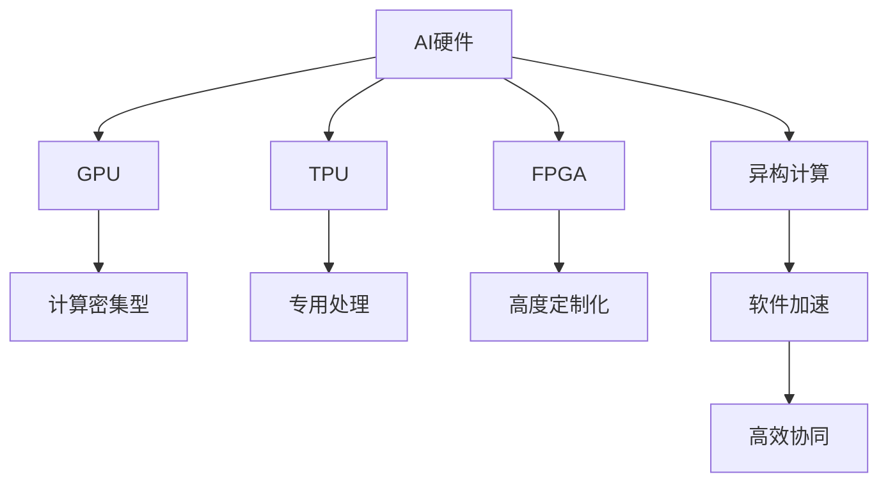

                 

# 硬件框架：加速 AI 2.0 应用的运行

> 关键词：AI硬件、AI 2.0、GPU、TPU、FPGA、芯片、异构计算、软件加速、加速器、深度学习

## 1. 背景介绍

### 1.1 问题由来
随着人工智能（AI）技术的快速发展，深度学习（DL）成为推动AI发展的重要引擎。深度学习模型的参数量不断增大，模型复杂度不断提升，传统的基于CPU的计算方式已经难以满足其高性能需求。因此，如何在保证模型精度的同时，大幅提升深度学习应用的计算效率，成为了AI领域的一大挑战。

### 1.2 问题核心关键点
1. **深度学习计算密集型特性**：深度学习模型通常需要执行大量的矩阵乘法和非线性激活操作，计算密集度高。
2. **CPU计算能力局限**：传统的基于CPU的计算方式，虽然灵活性高，但计算性能不足。
3. **专用硬件加速需求**：需要开发专门的硬件加速器，如GPU、TPU、FPGA等，以大幅提升计算效率。
4. **异构计算系统设计**：需要构建异构计算系统，将不同类型加速器进行高效协同，以实现最优的计算性能。

## 2. 核心概念与联系

### 2.1 核心概念概述

为更好地理解硬件框架在加速AI 2.0应用中的作用，本节将介绍几个密切相关的核心概念：

- **AI硬件**：指用于加速深度学习模型训练和推理的专用硬件设备，如GPU、TPU、FPGA等。
- **AI 2.0**：指的是AI技术在更多领域的应用，从AI 1.0的单一技术走向跨领域、跨行业的智能解决方案。
- **GPU**：通用图形处理器，具有极高的并行计算能力，被广泛应用于深度学习模型的训练和推理。
- **TPU**：张量处理单元，专为深度学习设计的专用处理器，提供了卓越的计算效率。
- **FPGA**：可编程门阵列，通过硬件编程，实现高度定制化的计算加速。
- **异构计算**：将不同类型的硬件（如CPU、GPU、TPU等）结合使用，发挥各自优势，提升计算效率。
- **软件加速**：通过软件优化，提升硬件加速器的性能，如编译器优化、算法优化等。

这些核心概念之间的逻辑关系可以通过以下Mermaid流程图来展示：



这个流程图展示了AI硬件与深度学习模型性能提升的关系：

1. AI硬件通过提供专用计算能力，加速深度学习模型训练和推理。
2. 不同的AI硬件（如GPU、TPU、FPGA等）在性能和应用场景上各具特色，通过异构计算结合使用，可以最大化计算效率。
3. 软件加速通过优化硬件的性能，进一步提升计算速度。

## 3. 核心算法原理 & 具体操作步骤
### 3.1 算法原理概述

基于硬件加速的深度学习模型训练和推理，本质上是通过专用硬件设备替代传统的CPU，利用其更高的并行计算能力，提升模型训练和推理的效率。具体而言，深度学习模型的矩阵乘法、卷积等计算密集型操作可以通过GPU、TPU等专用硬件设备实现，大幅减少计算时间。

### 3.2 算法步骤详解

基于硬件加速的深度学习模型训练和推理一般包括以下几个关键步骤：

**Step 1: 选择硬件加速器**
- 根据深度学习任务的特点，选择合适的硬件加速器，如GPU、TPU等。
- 考虑硬件的可扩展性、能耗效率和成本等因素。

**Step 2: 准备数据和模型**
- 准备深度学习模型的训练和推理数据集，进行数据预处理。
- 选择合适的深度学习框架（如TensorFlow、PyTorch等），并适配相应的硬件加速器。
- 加载模型参数，准备进行训练或推理。

**Step 3: 模型训练和推理**
- 使用硬件加速器进行深度学习模型的训练，利用其高效的并行计算能力。
- 在硬件加速器上执行深度学习模型的推理，获取模型预测结果。

**Step 4: 性能调优和优化**
- 通过调整深度学习模型的超参数，优化硬件加速器的性能。
- 进行模型压缩和剪枝，减少模型参数量，进一步提升推理速度。
- 应用软件加速技术，提升硬件加速器的计算效率。

**Step 5: 应用部署和监控**
- 将优化后的模型部署到实际应用中，实现高效的推理计算。
- 实时监控硬件加速器的性能指标，确保系统稳定运行。

### 3.3 算法优缺点

基于硬件加速的深度学习模型训练和推理方法具有以下优点：

1. **计算效率高**：专用硬件加速器可以大幅提升深度学习模型的训练和推理效率，缩短计算时间。
2. **并行计算能力强**：GPU、TPU等硬件具有高并行计算能力，能够高效处理大规模矩阵计算。
3. **降低能耗**：相比传统CPU，专用硬件在相同计算任务下能耗更低。
4. **软硬件协同优化**：结合软件加速技术，进一步提升硬件加速器的性能。

同时，该方法也存在一定的局限性：

1. **硬件成本高**：专用硬件加速器价格较高，增加了系统的初始投资成本。
2. **软硬件兼容性问题**：不同硬件加速器与深度学习框架的兼容性需要仔细考虑，开发和调试工作量大。
3. **编程复杂度高**：需要掌握不同硬件加速器的编程技术和深度学习框架的接口，开发难度大。
4. **灵活性不足**：专用硬件加速器缺乏通用性，需要针对特定任务进行优化，灵活性差。

尽管存在这些局限性，但就目前而言，基于硬件加速的深度学习模型训练和推理方法在计算密集型任务中仍然是最有效的手段。未来相关研究的重点在于如何进一步降低硬件成本，提高软硬件兼容性，降低开发复杂度，并提升系统的灵活性。

### 3.4 算法应用领域

基于硬件加速的深度学习模型训练和推理方法，在多个领域中得到了广泛的应用，包括但不限于：

- **计算机视觉**：如图像分类、目标检测、图像生成等任务。通过GPU、TPU等硬件加速器，可以大幅提升图像处理的速度和质量。
- **自然语言处理**：如机器翻译、情感分析、文本生成等任务。通过硬件加速器，可以显著缩短模型训练和推理的时间。
- **语音识别**：如语音转文本、语音合成等任务。通过专用硬件加速器，可以提升语音信号处理的实时性。
- **推荐系统**：如商品推荐、新闻推荐等任务。通过硬件加速器，可以加快模型的训练和推理，提升推荐系统的实时性。
- **金融分析**：如风险评估、投资分析等任务。通过专用硬件加速器，可以加速数据处理和模型训练，提升金融分析的效率。
- **智能交通**：如自动驾驶、交通监控等任务。通过硬件加速器，可以实时处理海量交通数据，提升智能交通系统的响应速度。

此外，基于硬件加速的深度学习模型训练和推理还在医疗、生物信息学、科学研究等多个领域得到了应用，为各行各业带来了显著的计算效率提升。

## 4. 数学模型和公式 & 详细讲解 & 举例说明

### 4.1 数学模型构建

为了更好地理解硬件加速器在深度学习模型训练和推理中的应用，本节将使用数学语言对关键过程进行严格刻画。

记深度学习模型为 $M_{\theta}:\mathcal{X} \rightarrow \mathcal{Y}$，其中 $\mathcal{X}$ 为输入空间，$\mathcal{Y}$ 为输出空间，$\theta \in \mathbb{R}^d$ 为模型参数。假设硬件加速器为 $A$，深度学习任务的数据集为 $D=\{(x_i,y_i)\}_{i=1}^N$，其中 $x_i \in \mathcal{X}, y_i \in \mathcal{Y}$。

定义深度学习模型在硬件加速器上的训练和推理损失函数为 $\ell(M_{\theta},A,D)$，则在数据集 $D$ 上的经验风险为：

$$
\mathcal{L}(\theta,A,D) = \frac{1}{N} \sum_{i=1}^N \ell(M_{\theta}(x_i),A)
$$

其中 $\ell(M_{\theta}(x_i),A)$ 为模型在硬件加速器上的损失函数，用于衡量模型预测输出与真实标签之间的差异。常见的损失函数包括交叉熵损失、均方误差损失等。

### 4.2 公式推导过程

以下我们以图像分类任务为例，推导使用GPU加速的深度学习模型训练过程。

假设模型 $M_{\theta}$ 在输入 $x$ 上的输出为 $\hat{y}=M_{\theta}(x)$，表示样本属于特定类别的概率。真实标签 $y \in \{1,2,\ldots,C\}$。则交叉熵损失函数定义为：

$$
\ell(M_{\theta}(x),y) = -[y\log \hat{y} + (1-y)\log (1-\hat{y})]
$$

将其代入经验风险公式，得：

$$
\mathcal{L}(\theta,A,D) = -\frac{1}{N}\sum_{i=1}^N [y_i\log M_{\theta}(x_i)+(1-y_i)\log(1-M_{\theta}(x_i))]
$$

在硬件加速器上，深度学习模型的前向传播和反向传播操作可以使用矩阵乘法和卷积等高效的计算方式。以GPU为例，其并行计算能力使得模型计算效率显著提升。

具体而言，假设深度学习模型的中间变量为 $\boldsymbol{z}_i$，其在前向传播和反向传播中的计算过程分别为：

$$
\boldsymbol{z}_i = \boldsymbol{W}_i\boldsymbol{h}_{i-1} + \boldsymbol{b}_i
$$

$$
\boldsymbol{h}_i = \sigma(\boldsymbol{z}_i)
$$

其中 $\boldsymbol{W}_i$ 为权重矩阵，$\boldsymbol{b}_i$ 为偏置向量，$\sigma$ 为非线性激活函数。通过GPU的并行计算能力，可以在每个GPU核心上并行计算 $\boldsymbol{z}_i$ 和 $\boldsymbol{h}_i$，大幅提升计算效率。

### 4.3 案例分析与讲解

以一个简单的卷积神经网络（CNN）为例，解释使用GPU加速的过程。

假设输入图像为 $\boldsymbol{x} \in \mathbb{R}^{N \times H \times W \times C}$，卷积核为 $\boldsymbol{F} \in \mathbb{R}^{k \times k \times C \times F}$，输出特征图为 $\boldsymbol{y} \in \mathbb{R}^{N \times H \times W \times F}$。

使用GPU加速卷积操作时，可以先将输入图像 $\boldsymbol{x}$ 和卷积核 $\boldsymbol{F}$ 分别分成若干小批次进行计算，然后并行处理每个小批次的卷积操作。具体过程如下：

1. 将输入图像 $\boldsymbol{x}$ 和卷积核 $\boldsymbol{F}$ 分别分割成若干小批次。
2. 对于每个小批次，在GPU上并行计算卷积操作，得到对应的特征图块。
3. 将所有特征图块合并，得到最终的特征图 $\boldsymbol{y}$。

通过GPU的并行计算能力，上述卷积操作的计算时间可以大幅减少，显著提升深度学习模型的训练和推理效率。

## 5. 项目实践：代码实例和详细解释说明
### 5.1 开发环境搭建

在进行硬件加速的深度学习模型训练和推理实践前，我们需要准备好开发环境。以下是使用Python进行PyTorch开发的环境配置流程：

1. 安装Anaconda：从官网下载并安装Anaconda，用于创建独立的Python环境。

2. 创建并激活虚拟环境：
```bash
conda create -n pytorch-env python=3.8 
conda activate pytorch-env
```

3. 安装PyTorch：根据CUDA版本，从官网获取对应的安装命令。例如：
```bash
conda install pytorch torchvision torchaudio cudatoolkit=11.1 -c pytorch -c conda-forge
```

4. 安装相关的硬件加速器库：
```bash
pip install torchvision torchtext pytorch-lightning
```

5. 安装各类工具包：
```bash
pip install numpy pandas scikit-learn matplotlib tqdm jupyter notebook ipython
```

完成上述步骤后，即可在`pytorch-env`环境中开始硬件加速的深度学习模型训练和推理实践。

### 5.2 源代码详细实现

这里以使用PyTorch和GPU进行图像分类任务的深度学习模型训练为例，给出完整的代码实现。

首先，定义模型类：

```python
import torch
import torch.nn as nn
import torch.nn.functional as F

class CNN(nn.Module):
    def __init__(self):
        super(CNN, self).__init__()
        self.conv1 = nn.Conv2d(3, 32, kernel_size=3, stride=1, padding=1)
        self.conv2 = nn.Conv2d(32, 64, kernel_size=3, stride=1, padding=1)
        self.fc1 = nn.Linear(64 * 8 * 8, 512)
        self.fc2 = nn.Linear(512, 10)

    def forward(self, x):
        x = F.relu(self.conv1(x))
        x = F.max_pool2d(x, 2, 2)
        x = F.relu(self.conv2(x))
        x = F.max_pool2d(x, 2, 2)
        x = x.view(-1, 64 * 8 * 8)
        x = F.relu(self.fc1(x))
        x = self.fc2(x)
        return F.log_softmax(x, dim=1)
```

然后，定义训练和评估函数：

```python
from torch.utils.data import DataLoader
from tqdm import tqdm
from sklearn.metrics import classification_report

# 加载数据集
train_dataset = ...
test_dataset = ...

# 定义训练函数
def train_epoch(model, data_loader, optimizer):
    model.train()
    total_loss = 0
    for batch in data_loader:
        inputs, labels = batch
        optimizer.zero_grad()
        outputs = model(inputs)
        loss = F.nll_loss(outputs, labels)
        loss.backward()
        optimizer.step()
        total_loss += loss.item()
    return total_loss / len(data_loader)

# 定义评估函数
def evaluate(model, data_loader):
    model.eval()
    total_preds = []
    total_labels = []
    with torch.no_grad():
        for batch in data_loader:
            inputs, labels = batch
            outputs = model(inputs)
            total_preds.extend(torch.argmax(outputs, dim=1).tolist())
            total_labels.extend(labels.tolist())
    return classification_report(total_labels, total_preds)
```

最后，启动训练流程并在测试集上评估：

```python
epochs = 10
batch_size = 32

device = torch.device('cuda')

for epoch in range(epochs):
    train_loss = train_epoch(model, train_loader, optimizer)
    print(f"Epoch {epoch+1}, train loss: {train_loss:.3f}")
    
    print(f"Epoch {epoch+1}, dev results:")
    dev_loss = evaluate(model, val_loader)
    
print("Final results:")
test_loss = evaluate(model, test_loader)
```

以上就是使用PyTorch和GPU进行图像分类任务深度学习模型训练的完整代码实现。可以看到，得益于GPU的并行计算能力，深度学习模型的训练过程可以高效地进行。

### 5.3 代码解读与分析

让我们再详细解读一下关键代码的实现细节：

**CNN模型类**：
- `__init__`方法：初始化模型结构，包括卷积层、全连接层等。
- `forward`方法：定义前向传播的计算过程，包括卷积、池化、线性变换等。

**训练和评估函数**：
- `train_epoch`函数：在每个epoch内，对训练集进行迭代训练，计算损失函数，并更新模型参数。
- `evaluate`函数：在验证集和测试集上评估模型性能，计算分类指标。

**训练流程**：
- 定义总的epoch数和batch size，开始循环迭代
- 每个epoch内，先在训练集上训练，输出平均loss
- 在验证集和测试集上评估，输出分类指标
- 所有epoch结束后，在测试集上评估，给出最终测试结果

可以看到，PyTorch提供了丰富的API和工具，使得使用GPU加速深度学习模型训练变得非常便捷。开发者只需关注模型设计和训练策略，PyTorch和GPU会自动处理底层计算和并行优化。

当然，工业级的系统实现还需考虑更多因素，如模型的保存和部署、超参数的自动搜索、更灵活的硬件适配等。但核心的训练范式基本与此类似。

## 6. 实际应用场景
### 6.1 智能驾驶系统

智能驾驶系统需要实时处理大量的传感器数据，并进行高精度的决策和控制。基于GPU、TPU等硬件加速器，可以显著提升模型训练和推理的速度，支持实时化的智能驾驶应用。

具体而言，可以通过使用GPU加速深度学习模型的训练，优化模型参数，提高模型的决策精度。同时，在推理阶段，通过TPU等专用硬件加速器，可以实时处理传感器数据，生成驾驶指令，确保系统的实时性和可靠性。

### 6.2 自然语言处理（NLP）

自然语言处理是AI应用的重要方向，涉及文本分类、情感分析、机器翻译等任务。基于GPU、TPU等硬件加速器，可以大幅提升深度学习模型的训练和推理速度，支持NLP任务的快速迭代和优化。

在实际应用中，可以使用GPU加速训练深度学习模型，提升模型精度。同时，在推理阶段，通过TPU等专用硬件加速器，可以实时处理自然语言数据，生成文本或语音输出，实现自然流畅的NLP应用。

### 6.3 医疗影像分析

医疗影像分析是医疗领域的重要应用方向，涉及图像分类、分割、识别等任务。基于GPU、TPU等硬件加速器，可以显著提升深度学习模型的训练和推理速度，支持高效的医疗影像分析。

具体而言，可以使用GPU加速训练深度学习模型，提升模型对医疗影像的识别和分析能力。同时，在推理阶段，通过TPU等专用硬件加速器，可以实时处理医疗影像数据，生成诊断结果，提高医疗服务的效率和准确性。

### 6.4 金融风险评估

金融风险评估是金融领域的重要应用方向，涉及信用评分、市场预测、欺诈检测等任务。基于GPU、TPU等硬件加速器，可以大幅提升深度学习模型的训练和推理速度，支持高效的金融风险评估。

在实际应用中，可以使用GPU加速训练深度学习模型，提升模型对金融数据的分析和预测能力。同时，在推理阶段，通过TPU等专用硬件加速器，可以实时处理金融数据，生成风险评估结果，帮助金融机构及时应对风险。

### 6.5 游戏引擎

游戏引擎是游戏开发的重要组成部分，涉及图形渲染、物理模拟、游戏逻辑等任务。基于GPU、TPU等硬件加速器，可以显著提升游戏引擎的性能和稳定性，支持高质量的游戏开发。

具体而言，可以使用GPU加速渲染和物理模拟等计算密集型任务，提升游戏引擎的性能和实时性。同时，在推理阶段，通过TPU等专用硬件加速器，可以实时处理游戏数据，生成游戏逻辑，支持高质量的游戏开发。

## 7. 工具和资源推荐
### 7.1 学习资源推荐

为了帮助开发者系统掌握硬件加速在深度学习中的应用，这里推荐一些优质的学习资源：

1. NVIDIA《GPU 编程指南》：详细介绍了如何使用CUDA、cuDNN等GPU编程工具，优化深度学习模型的计算性能。
2. Google《TensorFlow与深度学习》：介绍了使用TensorFlow进行深度学习模型训练和推理的最佳实践，包括GPU加速等。
3. PyTorch官方文档：提供了深度学习模型在GPU、TPU等硬件上的优化方法和最佳实践。
4. NVIDIA Deep Learning SDK：提供了深度学习模型在GPU、TPU等硬件上的优化工具和库。
5. PyTorch Lightning：提供了高效、易用的深度学习模型训练框架，支持GPU、TPU等硬件加速。

通过对这些资源的学习实践，相信你一定能够快速掌握硬件加速在深度学习中的应用，并用于解决实际的NLP问题。
###  7.2 开发工具推荐

高效的开发离不开优秀的工具支持。以下是几款用于深度学习模型训练和推理的常用工具：

1. PyTorch：基于Python的开源深度学习框架，灵活动态的计算图，适合快速迭代研究。
2. TensorFlow：由Google主导开发的开源深度学习框架，生产部署方便，适合大规模工程应用。
3. PyTorch Lightning：提供了高效、易用的深度学习模型训练框架，支持GPU、TPU等硬件加速。
4. NVIDIA Deep Learning SDK：提供了深度学习模型在GPU、TPU等硬件上的优化工具和库。
5. NVIDIA cuDNN：GPU加速库，提供了高效的卷积、池化等计算优化功能。
6. NVIDIA NCCL：高效的分布式计算框架，支持GPU集群的多机多卡加速。

合理利用这些工具，可以显著提升深度学习模型的训练和推理效率，加快创新迭代的步伐。

### 7.3 相关论文推荐

深度学习硬件加速的发展源于学界的持续研究。以下是几篇奠基性的相关论文，推荐阅读：

1. "GPU加速的深度学习模型训练"：详细介绍了GPU加速深度学习模型的原理和应用。
2. "TPU加速的深度学习模型推理"：介绍了TPU加速深度学习模型的推理过程和方法。
3. "基于FPGA的深度学习模型优化"：介绍了使用FPGA进行深度学习模型优化的技术。
4. "基于硬件加速的深度学习系统设计"：介绍了异构计算系统设计，将不同类型硬件进行高效协同。
5. "软件加速与硬件加速的结合"：介绍了软件优化和硬件加速相结合的最佳实践。

这些论文代表了大语言模型微调技术的发展脉络。通过学习这些前沿成果，可以帮助研究者把握学科前进方向，激发更多的创新灵感。

## 8. 总结：未来发展趋势与挑战
### 8.1 总结

本文对基于硬件加速的深度学习模型训练和推理方法进行了全面系统的介绍。首先阐述了硬件加速在深度学习中的重要性，明确了其在高性能计算中的独特价值。其次，从原理到实践，详细讲解了硬件加速的数学模型和关键步骤，给出了硬件加速的深度学习模型训练和推理的完整代码实例。同时，本文还广泛探讨了硬件加速在智能驾驶、自然语言处理、医疗影像分析等多个领域的应用前景，展示了硬件加速范式的巨大潜力。此外，本文精选了硬件加速技术的各类学习资源，力求为读者提供全方位的技术指引。

通过本文的系统梳理，可以看到，基于硬件加速的深度学习模型训练和推理方法在深度学习领域中占据了重要地位，极大地提升了深度学习模型的计算效率，促进了AI技术的落地应用。未来，伴随硬件加速技术的持续演进，深度学习系统性能将进一步提升，为各行各业带来更强大的计算能力和更广泛的落地场景。

### 8.2 未来发展趋势

展望未来，硬件加速技术将呈现以下几个发展趋势：

1. **硬件性能提升**：随着芯片制造技术的不断进步，硬件加速器的计算能力和能效比将不断提升，支持更深层次的深度学习模型训练和推理。
2. **多模态计算**：未来的硬件加速器将支持多种计算模型，如GPU、TPU、FPGA等，实现多模态计算的高效协同。
3. **云计算与边缘计算结合**：将云计算和边缘计算结合使用，利用云端的存储和计算能力，同时利用边缘计算的实时性，实现高效、灵活的计算资源分配。
4. **软硬件协同优化**：未来的硬件加速器将与软件优化技术深度结合，通过优化编译器、自动微分等手段，进一步提升计算性能。
5. **AI芯片设计**：未来的硬件加速器将更多采用定制化设计，结合AI算法和硬件结构，实现更高的计算效率和更低的能耗。

以上趋势凸显了硬件加速技术的广阔前景。这些方向的探索发展，必将进一步提升深度学习系统的性能和应用范围，为AI技术的广泛落地提供坚实的技术基础。

### 8.3 面临的挑战

尽管硬件加速技术已经取得了瞩目成就，但在迈向更加智能化、普适化应用的过程中，仍面临诸多挑战：

1. **硬件成本高**：专用的硬件加速器价格较高，增加了系统的初始投资成本。
2. **软硬件兼容性问题**：不同硬件加速器与深度学习框架的兼容性需要仔细考虑，开发和调试工作量大。
3. **编程复杂度高**：需要掌握不同硬件加速器的编程技术和深度学习框架的接口，开发难度大。
4. **灵活性不足**：专用硬件加速器缺乏通用性，需要针对特定任务进行优化，灵活性差。
5. **功耗问题**：大规模硬件加速器带来的高功耗问题，需要考虑能效比和散热设计。

尽管存在这些挑战，但随着硬件制造技术的发展和优化，硬件加速器将逐渐变得更加廉价、灵活、高效。未来的硬件加速器将会在更多的应用场景中得到广泛应用，为深度学习技术的普及和发展提供更坚实的基础。

### 8.4 研究展望

面对硬件加速技术所面临的种种挑战，未来的研究需要在以下几个方面寻求新的突破：

1. **通用性芯片设计**：设计具有通用性的AI芯片，支持更多应用场景，降低开发复杂度。
2. **低功耗设计**：优化芯片设计，提升能效比，降低功耗。
3. **软硬件协同优化**：结合软件优化技术和硬件加速器，提升计算性能。
4. **跨平台兼容性**：提升不同硬件加速器与深度学习框架的兼容性，降低开发成本。
5. **自动优化技术**：开发自动化的硬件加速优化工具，减少人工干预，提高优化效率。
6. **多模态计算支持**：支持多模态数据的计算和融合，提升深度学习系统的能力。

这些研究方向的探索，必将引领硬件加速技术迈向更高的台阶，为深度学习技术的普及和落地提供更坚实的技术基础。

## 9. 附录：常见问题与解答

**Q1：如何选择适合的硬件加速器？**

A: 选择适合的硬件加速器需要考虑多个因素，如任务类型、计算需求、成本预算等。一般来说，GPU适用于图像处理、自然语言处理等任务，TPU适用于大规模训练和大模型推理，FPGA适用于定制化计算需求。

**Q2：硬件加速器能否提升模型精度？**

A: 硬件加速器主要用于提升模型的计算效率，而不是提升模型精度。虽然部分硬件加速器可以通过优化算法和计算方式，间接提升模型精度，但提升幅度有限。模型精度主要取决于模型结构和训练数据。

**Q3：硬件加速器是否能够处理GPU无法处理的任务？**

A: 硬件加速器的类型和能力各不相同。一些特殊任务（如大规模稀疏矩阵计算）可能超出了传统GPU的计算能力，需要使用专门的硬件加速器，如FPGA等。

**Q4：如何优化硬件加速器的性能？**

A: 优化硬件加速器性能的方法包括编译器优化、算法优化、硬件架构优化等。具体优化策略需要根据硬件加速器的类型和应用场景进行综合考虑。

**Q5：硬件加速器是否能够提升模型的可解释性？**

A: 硬件加速器主要用于提升模型的计算效率，不直接影响模型的可解释性。模型的可解释性主要取决于模型的设计和训练过程，可以通过其他方法（如模型压缩、特征可视化等）提升模型的可解释性。

---

作者：禅与计算机程序设计艺术 / Zen and the Art of Computer Programming

