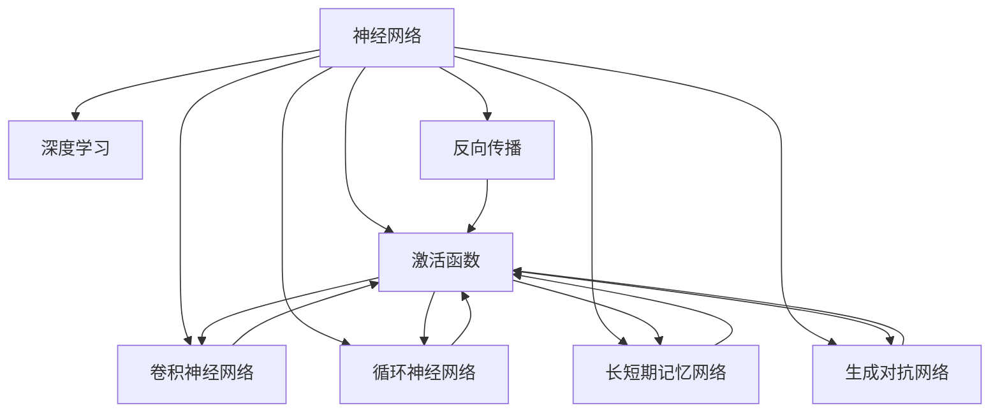

                 

# 神经网络 (Neural Networks) 原理与代码实例讲解

> 关键词：神经网络,深度学习,反向传播,激活函数,卷积神经网络(CNN),循环神经网络(RNN),长短期记忆网络(LSTM),生成对抗网络(GAN),代码实例,PyTorch

## 1. 背景介绍

神经网络(Neural Networks)是人工智能(AI)领域中最为重要的基础技术之一，广泛应用于机器学习、计算机视觉、自然语言处理等众多领域。其通过模拟人类大脑的神经元结构，实现复杂的非线性映射，从而解决诸多复杂问题。

近年来，深度学习(Deep Learning)技术基于神经网络的架构，通过引入多层次的隐藏层，有效处理海量非结构化数据，显著提升了模型性能。深度学习的诸多经典算法，如卷积神经网络(CNN)、循环神经网络(RNN)、长短期记忆网络(LSTM)、生成对抗网络(GAN)等，已经广泛应用于各种实际场景。

本文将系统地介绍神经网络的原理，并以代码实例形式展示几种常见神经网络模型的构建和训练过程。通过这些实例，读者可以更深入地理解神经网络的数学模型和训练过程，掌握实际应用中的代码实现。

## 2. 核心概念与联系

### 2.1 核心概念概述

为更好地理解神经网络的原理，本节将介绍几个密切相关的核心概念：

- 神经网络(Neural Network)：由多个神经元组成的计算模型，用于模拟人类大脑的神经元网络。通常包括输入层、隐藏层和输出层。
- 深度学习(Deep Learning)：基于神经网络的架构，通过引入多层次的隐藏层，实现复杂非线性映射的机器学习范式。
- 反向传播(Backpropagation)：一种高效的训练算法，通过反向计算梯度，不断更新模型参数以最小化损失函数。
- 激活函数(Activation Function)：神经元输出函数，引入非线性变换，实现模型表达能力增强。
- 卷积神经网络(CNN)：主要用于图像处理任务，通过卷积、池化等操作提取图像特征。
- 循环神经网络(RNN)：主要用于序列数据处理任务，通过循环结构捕捉序列依赖关系。
- 长短期记忆网络(LSTM)：一种特殊的RNN，通过门控结构解决梯度消失问题，适用于处理长时间依赖的序列数据。
- 生成对抗网络(GAN)：通过两个对抗的网络模型，生成高质量的伪造数据，广泛应用于图像、音频、文本等生成任务。

这些核心概念之间的逻辑关系可以通过以下Mermaid流程图来展示：



这个流程图展示了大语言模型的核心概念及其之间的关系：

1. 神经网络通过反向传播和激活函数实现复杂映射。
2. CNN、RNN、LSTM、GAN等神经网络架构分别适用于不同任务，具有不同的表达能力和处理方式。
3. 深度学习利用多层次的隐藏层，提升模型表达能力和泛化性能。

## 3. 核心算法原理 & 具体操作步骤
### 3.1 算法原理概述

神经网络的核心思想是通过多层次的计算单元（即神经元）实现复杂映射，通过反向传播算法最小化损失函数，更新模型参数。

具体来说，神经网络由输入层、多个隐藏层和输出层组成，其中每个神经元接收若干输入，通过激活函数进行非线性变换，输出结果传递给下一层神经元。训练过程中，反向传播算法通过链式法则，计算损失函数对每个参数的梯度，利用梯度下降等优化算法不断调整模型参数。

### 3.2 算法步骤详解

神经网络的训练一般包括以下几个关键步骤：

**Step 1: 数据预处理**
- 将原始数据进行归一化、标准化、分词、特征提取等预处理操作。
- 划分为训练集、验证集和测试集，确保数据分布一致。

**Step 2: 模型初始化**
- 选择合适的神经网络架构，如CNN、RNN、LSTM等。
- 初始化模型参数，如权重、偏置等，通常使用随机初始化。

**Step 3: 前向传播**
- 将训练数据输入模型，计算网络输出。
- 计算损失函数，评估模型预测结果与真实标签之间的差异。

**Step 4: 反向传播**
- 使用反向传播算法计算损失函数对每个参数的梯度。
- 根据梯度下降等优化算法，更新模型参数。

**Step 5: 模型评估**
- 在验证集和测试集上评估模型性能，对比训练前后的精度、召回率等指标。
- 保存最优模型参数，供实际应用使用。

### 3.3 算法优缺点

神经网络具有以下优点：
1. 表达能力强。多层次隐藏层可以处理复杂的非线性关系，提升模型表达能力。
2. 泛化性能好。通过反向传播不断调整参数，适应新数据分布。
3. 可解释性强。神经网络的计算过程是可解释的，能够揭示数据之间的依赖关系。

同时，该方法也存在一些缺点：
1. 计算资源消耗大。神经网络参数较多，训练和推理消耗大量计算资源。
2. 训练过程复杂。神经网络训练需要优化算法和大量数据，容易过拟合。
3. 模型难以调试。神经网络模型复杂，调试过程繁琐，需要专业知识。

尽管存在这些缺点，但神经网络在处理复杂非线性问题时仍然具有无可替代的优势。随着硬件设备的提升和算法优化，未来神经网络的应用场景将更加广泛。

### 3.4 算法应用领域

神经网络在多个领域都得到了广泛应用，例如：

- 计算机视觉：如图像分类、目标检测、人脸识别等。
- 自然语言处理：如文本分类、情感分析、机器翻译等。
- 语音识别：如自动语音识别、语音合成等。
- 推荐系统：如商品推荐、广告推荐等。
- 信号处理：如信号去噪、语音增强等。

除了这些经典任务，神经网络还被创新性地应用于更多场景中，如医疗诊断、自动驾驶、金融风控等，为各行各业带来了新的突破。

## 4. 数学模型和公式 & 详细讲解 & 举例说明

### 4.1 数学模型构建

神经网络的数学模型可以抽象为输入层、隐藏层和输出层的多层感知器(Multilayer Perceptron, MLP)模型。假设输入为 $x$，输出为 $y$，隐藏层为 $h$，则网络模型可以表示为：

$$
y = f(\text{W}_1h_1 + b_1) = f(\text{W}_2h_2 + b_2)
$$

其中 $f$ 为激活函数，$\text{W}_1, \text{W}_2$ 为权重矩阵，$b_1, b_2$ 为偏置向量。

### 4.2 公式推导过程

以二分类任务为例，神经网络的输出层可以使用sigmoid激活函数，其数学模型如下：

$$
y = \sigma(\text{W}_3h_3 + b_3)
$$

其中 $\sigma$ 为sigmoid函数，$\text{W}_3, b_3$ 为输出层的权重和偏置。

给定训练样本 $(x_i, y_i)$，其损失函数可以使用交叉熵损失函数：

$$
\mathcal{L} = -\frac{1}{N}\sum_{i=1}^N(y_i\log(y_i) + (1-y_i)\log(1-y_i))
$$

其中 $N$ 为样本数量，$y_i$ 为真实标签，$\log$ 为自然对数。

### 4.3 案例分析与讲解

假设我们有一个二分类数据集，包含 $N=1000$ 个样本，每个样本 $x_i$ 为 $10$ 维向量，输出 $y_i$ 为二分类标签。我们使用一个包含两个隐藏层的神经网络进行二分类任务，隐藏层神经元数为 $50$ 和 $30$，激活函数使用ReLU。我们将在Kaggle的mnist手写数字数据集上进行模型训练和测试。

首先，导入必要的库和数据集：

```python
import torch
import torch.nn as nn
import torch.optim as optim
from torchvision import datasets, transforms
import matplotlib.pyplot as plt

train_data = datasets.MNIST(root='./data', train=True, transform=transforms.ToTensor(), download=True)
test_data = datasets.MNIST(root='./data', train=False, transform=transforms.ToTensor(), download=True)
```

然后，定义神经网络模型：

```python
class Net(nn.Module):
    def __init__(self):
        super(Net, self).__init__()
        self.fc1 = nn.Linear(28*28, 50)
        self.fc2 = nn.Linear(50, 30)
        self.fc3 = nn.Linear(30, 2)
        self.relu = nn.ReLU()
    
    def forward(self, x):
        x = x.view(-1, 28*28)
        x = self.fc1(x)
        x = self.relu(x)
        x = self.fc2(x)
        x = self.relu(x)
        x = self.fc3(x)
        return x
```

接着，定义训练函数：

```python
def train(model, train_loader, optimizer, criterion, epoch):
    model.train()
    train_loss = 0
    correct = 0
    total = 0
    for data, target in train_loader:
        optimizer.zero_grad()
        output = model(data)
        loss = criterion(output, target)
        loss.backward()
        optimizer.step()
        train_loss += loss.item() * data.size(0)
        _, predicted = output.max(1)
        total += target.size(0)
        correct += predicted.eq(target).sum().item()
    
    train_loss /= len(train_loader.dataset)
    train_acc = 100. * correct / total
    return train_loss, train_acc
```

最后，训练并测试模型：

```python
batch_size = 64
num_epochs = 10
learning_rate = 0.001
criterion = nn.CrossEntropyLoss()

train_loader = torch.utils.data.DataLoader(train_data, batch_size=batch_size, shuffle=True)
test_loader = torch.utils.data.DataLoader(test_data, batch_size=batch_size, shuffle=False)

model = Net()
optimizer = optim.Adam(model.parameters(), lr=learning_rate)

losses, accs = [], []
for epoch in range(num_epochs):
    train_loss, train_acc = train(model, train_loader, optimizer, criterion, epoch)
    if (epoch + 1) % 1 == 0:
        test_loss, test_acc = evaluate(model, test_loader, criterion)
        print('Epoch: {} \t'.format(epoch + 1),
              'Training Loss: {:.4f} \t'.format(train_loss),
              'Training Acc: {:.4f} \t'.format(train_acc),
              'Test Loss: {:.4f} \t'.format(test_loss),
              'Test Acc: {:.4f}'.format(test_acc))
        
    losses.append(train_loss)
    accs.append(train_acc)

plt.plot(losses, label='Training Loss')
plt.plot(accs, label='Training Accuracy')
plt.xlabel('Epochs')
plt.legend()
plt.show()
```

以上就是使用PyTorch构建并训练神经网络的完整代码实现。可以看到，通过设置模型参数、选择优化器和损失函数，我们可以快速构建和训练一个二分类神经网络模型。

## 5. 项目实践：代码实例和详细解释说明
### 5.1 开发环境搭建

在进行神经网络开发前，我们需要准备好开发环境。以下是使用Python进行PyTorch开发的环境配置流程：

1. 安装Anaconda：从官网下载并安装Anaconda，用于创建独立的Python环境。

2. 创建并激活虚拟环境：
```bash
conda create -n pytorch-env python=3.8 
conda activate pytorch-env
```

3. 安装PyTorch：根据CUDA版本，从官网获取对应的安装命令。例如：
```bash
conda install pytorch torchvision torchaudio cudatoolkit=11.1 -c pytorch -c conda-forge
```

4. 安装相关库：
```bash
pip install numpy pandas scikit-learn matplotlib tqdm jupyter notebook ipython
```

完成上述步骤后，即可在`pytorch-env`环境中开始神经网络实践。

### 5.2 源代码详细实现

下面我们以二分类任务为例，给出使用PyTorch构建和训练神经网络的代码实现。

首先，定义神经网络模型：

```python
class Net(nn.Module):
    def __init__(self):
        super(Net, self).__init__()
        self.fc1 = nn.Linear(784, 50)
        self.fc2 = nn.Linear(50, 30)
        self.fc3 = nn.Linear(30, 2)
        self.relu = nn.ReLU()
    
    def forward(self, x):
        x = x.view(-1, 784)
        x = self.fc1(x)
        x = self.relu(x)
        x = self.fc2(x)
        x = self.relu(x)
        x = self.fc3(x)
        return x
```

然后，定义训练函数：

```python
def train(model, train_loader, optimizer, criterion, epoch):
    model.train()
    train_loss = 0
    correct = 0
    total = 0
    for data, target in train_loader:
        optimizer.zero_grad()
        output = model(data)
        loss = criterion(output, target)
        loss.backward()
        optimizer.step()
        train_loss += loss.item() * data.size(0)
        _, predicted = output.max(1)
        total += target.size(0)
        correct += predicted.eq(target).sum().item()
    
    train_loss /= len(train_loader.dataset)
    train_acc = 100. * correct / total
    return train_loss, train_acc
```

接着，定义测试函数：

```python
def evaluate(model, test_loader, criterion):
    model.eval()
    test_loss = 0
    correct = 0
    total = 0
    with torch.no_grad():
        for data, target in test_loader:
            output = model(data)
            loss = criterion(output, target)
            test_loss += loss.item() * data.size(0)
            _, predicted = output.max(1)
            total += target.size(0)
            correct += predicted.eq(target).sum().item()
    
    test_loss /= len(test_loader.dataset)
    test_acc = 100. * correct / total
    return test_loss, test_acc
```

最后，训练并测试模型：

```python
batch_size = 64
num_epochs = 10
learning_rate = 0.001
criterion = nn.CrossEntropyLoss()

train_loader = torch.utils.data.DataLoader(train_data, batch_size=batch_size, shuffle=True)
test_loader = torch.utils.data.DataLoader(test_data, batch_size=batch_size, shuffle=False)

model = Net()
optimizer = optim.Adam(model.parameters(), lr=learning_rate)

losses, accs = [], []
for epoch in range(num_epochs):
    train_loss, train_acc = train(model, train_loader, optimizer, criterion, epoch)
    if (epoch + 1) % 1 == 0:
        test_loss, test_acc = evaluate(model, test_loader, criterion)
        print('Epoch: {} \t'.format(epoch + 1),
              'Training Loss: {:.4f} \t'.format(train_loss),
              'Training Acc: {:.4f} \t'.format(train_acc),
              'Test Loss: {:.4f} \t'.format(test_loss),
              'Test Acc: {:.4f}'.format(test_acc))
        
    losses.append(train_loss)
    accs.append(train_acc)

plt.plot(losses, label='Training Loss')
plt.plot(accs, label='Training Accuracy')
plt.xlabel('Epochs')
plt.legend()
plt.show()
```

以上就是使用PyTorch构建并训练神经网络的完整代码实现。可以看到，通过设置模型参数、选择优化器和损失函数，我们可以快速构建和训练一个二分类神经网络模型。

### 5.3 代码解读与分析

让我们再详细解读一下关键代码的实现细节：

**Net类**：
- `__init__`方法：初始化网络参数，包括线性层、激活函数等。
- `forward`方法：定义前向传播过程，将输入数据传递通过多层神经元计算输出。

**train函数**：
- 在训练过程中，计算模型输出，计算损失，进行反向传播和参数更新。
- 记录训练损失和准确率，并在每个epoch结束时打印输出。

**evaluate函数**：
- 在测试过程中，计算模型输出，计算损失，评估模型准确率。
- 记录测试损失和准确率，并返回结果。

**训练流程**：
- 定义总epoch数、batch size和学习率等超参数。
- 创建数据加载器，用于批量处理训练数据。
- 创建优化器和损失函数，定义模型的初始化参数和目标函数。
- 在每个epoch中，分别调用训练函数和测试函数，评估模型性能。

可以看到，PyTorch提供了灵活的模型构建和训练框架，使得神经网络的实现变得更加简洁高效。开发者可以专注于模型的结构和训练过程的设计，而不必过多关注底层计算细节。

## 6. 实际应用场景

神经网络在实际应用中已经得到了广泛的应用，覆盖了几乎所有常见任务，例如：

- 图像分类：如手写数字识别、物体识别、人脸识别等。
- 目标检测：如行人检测、车辆检测等。
- 自然语言处理：如文本分类、情感分析、机器翻译等。
- 语音识别：如自动语音识别、语音合成等。
- 推荐系统：如商品推荐、广告推荐等。

除了这些经典任务外，神经网络还被创新性地应用于更多场景中，如医疗影像分析、智能客服、金融风控等，为各行各业带来了新的突破。

## 7. 工具和资源推荐
### 7.1 学习资源推荐

为了帮助开发者系统掌握神经网络的原理和实践技巧，这里推荐一些优质的学习资源：

1. 《深度学习》书籍：Ian Goodfellow、Yoshua Bengio和Aaron Courville合著的《深度学习》是神经网络领域的经典教材，涵盖了神经网络的基本原理、模型构建、训练优化等方方面面。

2. Coursera《深度学习专项课程》：由斯坦福大学教授Andrew Ng主讲的深度学习课程，系统讲解了神经网络的数学模型和训练技巧，并提供了丰富的编程实践。

3. PyTorch官方文档：PyTorch是主流的深度学习框架之一，其官方文档详细介绍了神经网络的构建、训练和优化方法，并提供了丰富的实例代码。

4. TensorFlow官方文档：TensorFlow是另一款主流的深度学习框架，其官方文档涵盖了神经网络、分布式训练、模型部署等全面内容，并提供了广泛的API支持。

5. Fast.ai：Fast.ai是一个以实战为主导的深度学习课程，涵盖了神经网络的各个方面，从入门到进阶，提供了大量实战项目和代码示例。

通过这些资源的学习实践，相信你一定能够快速掌握神经网络的精髓，并用于解决实际的机器学习问题。

### 7.2 开发工具推荐

高效的开发离不开优秀的工具支持。以下是几款用于神经网络开发的常用工具：

1. PyTorch：基于Python的开源深度学习框架，灵活动态的计算图，适合快速迭代研究。支持动态计算图和静态计算图，灵活性较高。

2. TensorFlow：由Google主导开发的开源深度学习框架，生产部署方便，适合大规模工程应用。支持分布式训练和静态计算图，适合复杂模型训练。

3. Keras：基于TensorFlow和Theano的高级深度学习库，提供简洁易用的API，可以快速构建和训练神经网络。

4. MXNet：由亚马逊开发的开源深度学习框架，支持多种编程语言，支持分布式训练，适合大规模数据处理。

5. Caffe：由Berkeley Vision and Learning Center开发的深度学习框架，支持卷积神经网络，性能高效，适合图像处理任务。

合理利用这些工具，可以显著提升神经网络开发的效率，加快创新迭代的步伐。

### 7.3 相关论文推荐

神经网络的研究发展迅速，以下是几篇奠基性的相关论文，推荐阅读：

1. A Neural Network for Machine Translation：提出了一种基于神经网络的机器翻译模型，奠定了神经网络在自然语言处理领域的应用基础。

2. ImageNet Classification with Deep Convolutional Neural Networks：提出了一种基于卷积神经网络的图像分类模型，刷新了图像分类任务的性能记录。

3. Recurrent Neural Network Based Language Model：提出了一种基于循环神经网络的自然语言处理模型，实现了对语言序列的建模。

4. Learning to Generate Captions for Image Collections：提出了一种基于卷积神经网络和循环神经网络的图像描述生成模型，为图像描述任务提供了新的解决方案。

5. Deep Residual Learning for Image Recognition：提出了一种基于残差网络的图像分类模型，有效地解决了深度网络训练过程中的梯度消失问题。

这些论文代表了大语言模型神经网络的发展脉络。通过学习这些前沿成果，可以帮助研究者把握学科前进方向，激发更多的创新灵感。

## 8. 总结：未来发展趋势与挑战

### 8.1 研究成果总结

本文对神经网络的原理和代码实例进行了全面系统的介绍。首先阐述了神经网络在深度学习中的重要地位，明确了神经网络在处理复杂非线性问题时的独特价值。其次，从原理到实践，详细讲解了神经网络的数学模型和训练过程，给出了神经网络代码实例的完整实现。同时，本文还广泛探讨了神经网络在计算机视觉、自然语言处理、语音识别等诸多领域的应用前景，展示了神经网络技术的广泛潜力。

通过本文的系统梳理，可以看到，神经网络作为一种强大的机器学习工具，已经广泛应用于各个领域。得益于深度学习框架的进步和工程实践的积累，神经网络的发展前景依然广阔，将在未来继续推动人工智能技术的进步。

### 8.2 未来发展趋势

展望未来，神经网络将呈现以下几个发展趋势：

1. 模型规模持续增大。随着算力成本的下降和数据规模的扩张，神经网络模型参数量将继续增长，有望实现更大规模、更高精度的模型。

2. 深度神经网络的发展。未来深度神经网络将在处理复杂问题时发挥更大作用，从简单的前馈网络到更加复杂的层次结构，将带来更多创新应用。

3. 自适应神经网络的发展。通过引入自适应计算图、自适应优化等技术，提升神经网络的计算效率和鲁棒性。

4. 联邦学习和隐私保护技术的应用。神经网络模型将更加注重隐私保护，通过联邦学习技术，实现分布式数据训练，提高数据安全和模型鲁棒性。

5. 神经网络与符号计算的结合。神经网络和符号计算的结合，将提升模型的可解释性和逻辑性，增强模型的推理能力。

6. 神经网络与强化学习的融合。神经网络与强化学习的结合，将提升模型的决策能力和自适应能力，实现更加智能的机器人、自动驾驶等应用。

以上趋势凸显了神经网络的广阔前景。这些方向的探索发展，必将进一步提升神经网络的性能和应用范围，为人工智能技术的发展提供新的动力。

### 8.3 面临的挑战

尽管神经网络已经取得了瞩目成就，但在迈向更加智能化、普适化应用的过程中，它仍面临着诸多挑战：

1. 计算资源瓶颈。当前神经网络模型通常具有海量参数，训练和推理需要消耗大量计算资源，如何提高计算效率和降低资源消耗，是一个重要研究方向。

2. 过拟合问题。神经网络模型容易发生过拟合，尤其是在训练数据不足的情况下。如何改进正则化方法、数据增强策略，提高模型的泛化能力，还需要更多的研究。

3. 模型可解释性不足。神经网络模型往往是“黑盒”系统，难以解释其内部工作机制和决策逻辑。如何赋予神经网络更强的可解释性，将是未来的一个重要研究方向。

4. 训练时间和数据需求。神经网络模型通常需要大量训练数据和时间，如何通过迁移学习、无监督学习等技术，降低对数据和时间的依赖，是未来需要解决的问题。

5. 对抗样本攻击。神经网络模型容易受到对抗样本攻击，如何增强模型的鲁棒性和安全性，是未来需要关注的问题。

6. 伦理和安全问题。神经网络模型可能学习到有害信息，如何保证模型的伦理和安全，避免恶意用途，也是未来需要解决的问题。

7. 模型扩展性和可维护性。神经网络模型通常复杂庞大，如何设计更好的模型架构和训练方法，提升模型的扩展性和可维护性，是未来需要解决的问题。

正视神经网络面临的这些挑战，积极应对并寻求突破，将使其进一步发展成熟。相信随着学界和产业界的共同努力，这些挑战终将一一被克服，神经网络技术必将迎来新的突破。

### 8.4 研究展望

面向未来，神经网络的研究需要在以下几个方面寻求新的突破：

1. 探索更加高效的模型压缩和量化方法，降低计算资源消耗，提高模型推理效率。

2. 开发更加灵活和可解释的神经网络架构，提升模型的推理能力和可解释性。

3. 引入更多先验知识和规则，与神经网络模型进行巧妙融合，提高模型的逻辑性和泛化能力。

4. 结合因果分析方法，提升神经网络的推理能力，增强模型的因果关系建模能力。

5. 引入对抗训练和鲁棒性优化方法，提高神经网络的鲁棒性和安全性。

6. 研究分布式训练和联邦学习方法，提升神经网络在大规模数据集上的训练效率和安全性。

7. 结合符号计算和逻辑推理，提升神经网络的推理能力和逻辑性，增强模型的决策能力。

这些研究方向的探索，必将引领神经网络技术迈向更高的台阶，为构建安全、可靠、可解释、可控的智能系统铺平道路。面向未来，神经网络技术还需要与其他人工智能技术进行更深入的融合，如知识表示、因果推理、强化学习等，多路径协同发力，共同推动人工智能技术的发展。只有勇于创新、敢于突破，才能不断拓展神经网络的边界，让智能技术更好地造福人类社会。

## 9. 附录：常见问题与解答

**Q1：神经网络是否适用于所有机器学习任务？**

A: 神经网络适用于处理复杂非线性关系的数据，在许多机器学习任务中已经取得了很好的效果。但对于一些线性关系明显或数据量较小的问题，使用简单的线性模型或统计模型可能更为合适。

**Q2：神经网络如何避免过拟合？**

A: 神经网络通常通过正则化方法、数据增强策略、早停策略等技术来避免过拟合。例如，使用L2正则化、Dropout、Early Stopping等方法，可以有效地控制模型的复杂度，防止过拟合。

**Q3：神经网络的计算效率如何提高？**

A: 神经网络的计算效率可以通过模型压缩、量化加速、分布式训练等方法进行优化。例如，使用混合精度训练、梯度累积、分布式优化器等技术，可以显著提升神经网络的计算效率。

**Q4：神经网络的参数数量如何控制？**

A: 神经网络的参数数量可以通过模型结构的设计进行控制。例如，使用较小的神经元数量、减少隐藏层数量、使用深度压缩等方法，可以有效地控制神经网络的参数数量。

**Q5：神经网络的可解释性如何提升？**

A: 神经网络的可解释性可以通过模型可视化、特征分析、模型压缩等方法进行提升。例如，使用可视化工具绘制网络结构图，分析特征重要性，使用知识蒸馏技术将神经网络转换为可解释的模型，可以提升神经网络的可解释性。

通过本文的系统梳理，可以看到，神经网络作为一种强大的机器学习工具，已经广泛应用于各个领域。随着深度学习框架的进步和工程实践的积累，神经网络的发展前景依然广阔，将在未来继续推动人工智能技术的进步。

---

作者：禅与计算机程序设计艺术 / Zen and the Art of Computer Programming

