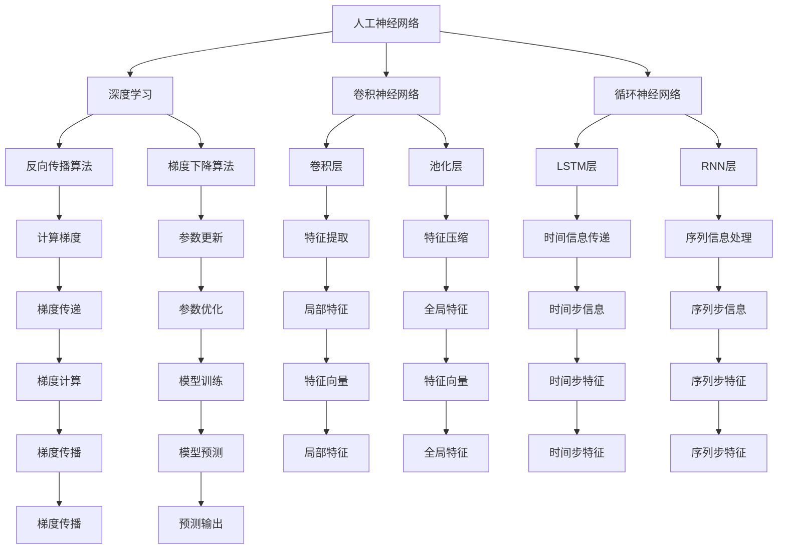

                 

# 神经网络：人工智能的基石

> 关键词：神经网络,人工智能,深度学习,机器学习,反向传播,梯度下降,激活函数,卷积神经网络,循环神经网络,深度学习框架,PyTorch

## 1. 背景介绍

### 1.1 问题由来
人工智能（AI）是当前科技发展的前沿领域，涵盖了机器学习、计算机视觉、自然语言处理等多个子领域。在AI的众多技术中，神经网络（Neural Network, NN）是最具代表性和影响力的基础技术之一。神经网络通过模拟人脑的神经元连接方式，实现了对于各种复杂模式的识别和预测，并广泛应用于图像识别、语音识别、自然语言处理等任务中。

近年来，随着深度学习（Deep Learning, DL）技术的迅猛发展，神经网络在多领域的应用取得了显著突破。通过多层次的神经网络结构，能够处理大规模数据，自动学习和提取特征，大幅提升了AI系统的准确性和泛化能力。但神经网络的原理和实现细节如何？本节将通过一篇系统性的介绍，阐述神经网络及其关键技术，为深入理解AI奠定基础。

### 1.2 问题核心关键点
神经网络是深度学习的重要组成部分，其核心思想是通过大量训练数据，自动学习输入与输出之间的复杂映射关系。神经网络通常由多个神经元（也称为节点）构成，这些神经元通过连接形成层次化的网络结构。每个神经元接收来自其他神经元的输入信号，经过激活函数处理后输出结果。通过反向传播算法，不断调整网络参数，最小化预测误差，从而实现从输入到输出的精准映射。

神经网络的关键概念包括：
- 神经元（Neuron）：神经网络的基本单位，接收输入信号并通过激活函数进行处理。
- 权重（Weight）：神经元之间的连接权重，用于表示输入信号的相对重要性。
- 偏置（Bias）：神经元中的偏置项，用于调整激活函数的输出。
- 激活函数（Activation Function）：用于将神经元的输入信号转化为输出结果的函数。
- 反向传播（Backpropagation）：通过链式法则计算梯度的过程，用于训练神经网络。
- 损失函数（Loss Function）：用于衡量模型预测输出与真实标签之间的差异。
- 正则化（Regularization）：通过引入惩罚项，避免过拟合。

这些关键概念共同构成了神经网络的工作原理，并通过反向传播算法和优化算法实现模型的训练和预测。神经网络的技术发展推动了人工智能技术在各个领域的应用，从语音识别到自然语言处理，从计算机视觉到自动驾驶，神经网络的应用范围越来越广泛。

## 2. 核心概念与联系

### 2.1 核心概念概述

为更好地理解神经网络的工作原理和架构，本节将介绍几个核心概念及其相互关系：

- 人工神经网络（Artificial Neural Network, ANN）：一种通过模拟人脑神经元结构和功能的计算模型，用于处理复杂的数据模式识别和分类问题。
- 深度学习（Deep Learning, DL）：一种基于神经网络的技术，通过多层次的特征提取和表示学习，实现对于高维数据的自动建模和预测。
- 卷积神经网络（Convolutional Neural Network, CNN）：一种专门用于处理图像和视频等二维数据的神经网络结构，通过卷积和池化操作提取局部特征。
- 循环神经网络（Recurrent Neural Network, RNN）：一种能够处理序列数据的神经网络结构，通过时间维度上的信息传递，实现对于时序数据的建模和预测。
- 反向传播算法（Backpropagation Algorithm）：一种用于训练神经网络的优化算法，通过计算梯度，调整网络参数以最小化预测误差。
- 梯度下降算法（Gradient Descent Algorithm）：一种常用的优化算法，用于求解损失函数的极小值，通过不断更新参数来逼近最优解。
- 激活函数（Activation Function）：一种用于将神经元的输入信号转化为输出结果的函数，如ReLU、Sigmoid等。

这些核心概念之间的关系可以通过以下Mermaid流程图来展示：



这个流程图展示了大语言模型微调的核心概念及其相互联系：

1. 人工神经网络是深度学习的基础，通过多层次的结构自动提取数据特征。
2. 卷积神经网络和循环神经网络是人工神经网络的特殊形式，分别用于处理图像和序列数据。
3. 反向传播算法和梯度下降算法是神经网络训练的关键技术，通过最小化损失函数优化模型参数。
4. 激活函数用于非线性变换，使得神经网络能够处理复杂的多项式函数。

这些概念通过合理的组合和设计，构成了神经网络的多样化架构，并广泛应用于各种复杂的AI任务中。

## 3. 核心算法原理 & 具体操作步骤

### 3.1 算法原理概述

神经网络的核心算法原理包括反向传播算法和梯度下降算法。反向传播算法用于计算损失函数对每个参数的梯度，梯度下降算法则根据梯度更新模型参数，以最小化损失函数。

以一个简单的单层神经网络为例，设神经网络的输入为 $x$，权重为 $w$，偏置为 $b$，激活函数为 $\sigma$，输出为 $y$，损失函数为 $L(y, y_{true})$，其中 $y_{true}$ 为真实标签。神经网络的输出 $y$ 通过前向传播计算得到：

$$
y = \sigma(wx+b)
$$

在训练过程中，通过反向传播算法计算梯度，并将其传递回每一层，更新权重和偏置。具体地，反向传播算法的核心步骤包括：
1. 前向传播：计算输出 $y$。
2. 计算损失函数：$L(y, y_{true})$。
3. 反向传播：计算每一层的梯度。
4. 参数更新：通过梯度下降算法更新权重和偏置。

### 3.2 算法步骤详解

神经网络的具体训练过程可以通过以下步骤进行：

**Step 1: 准备数据和模型**

- 收集训练数据集和测试数据集，并进行预处理（如归一化、标准化等）。
- 选择合适的神经网络架构（如全连接网络、卷积网络、循环网络等）。
- 初始化模型参数（如权重、偏置等），一般采用随机初始化。

**Step 2: 定义损失函数**

- 根据具体任务，选择适合的损失函数，如均方误差（MSE）、交叉熵（Cross-Entropy）等。
- 在训练集中进行前向传播，计算模型输出 $y$ 与真实标签 $y_{true}$ 之间的差异。
- 计算损失函数 $L(y, y_{true})$。

**Step 3: 反向传播计算梯度**

- 根据链式法则，计算每一层的梯度。
- 将梯度传递回每一层，计算权重和偏置的更新量。

**Step 4: 更新模型参数**

- 使用梯度下降算法更新权重和偏置，即 $\theta_{old} \leftarrow \theta_{old} - \eta\nabla_{\theta}L$，其中 $\eta$ 为学习率，$\nabla_{\theta}L$ 为损失函数对参数的梯度。
- 重复 Step 2-4，直至模型在测试集上达到满意的性能指标。

### 3.3 算法优缺点

神经网络具有以下优点：
- 强大的特征提取能力：通过多层次的非线性变换，能够自动提取数据的高级特征。
- 处理复杂模式：适用于多种类型的输入数据，如图像、文本、时间序列等。
- 鲁棒性：通过大量的训练数据，神经网络能够适应多种复杂模式。

同时，神经网络也存在一些缺点：
- 参数量大：神经网络通常需要大量的参数，训练和推理计算量较大。
- 训练难度大：神经网络训练过程中需要大量的标注数据和计算资源。
- 可解释性差：神经网络的决策过程难以解释，缺乏透明性。
- 过拟合风险：神经网络容易过拟合，需要通过正则化等手段进行优化。

尽管存在这些缺点，神经网络仍然是当前最主流的AI基础技术之一，被广泛应用于图像识别、语音识别、自然语言处理等多个领域。

### 3.4 算法应用领域

神经网络技术已经广泛应用于各个领域，以下是一些主要的应用场景：

- 计算机视觉：图像分类、目标检测、图像分割等任务。通过卷积神经网络（CNN）提取图像特征，实现高效的图像处理。
- 自然语言处理：文本分类、情感分析、机器翻译等任务。通过循环神经网络（RNN）或Transformer模型处理文本数据。
- 语音识别：语音识别、语音合成等任务。通过卷积神经网络（CNN）和循环神经网络（RNN）处理音频信号。
- 时间序列分析：股票预测、天气预测、工业控制等任务。通过循环神经网络（RNN）处理时间序列数据。
- 强化学习：游戏AI、机器人控制等任务。通过深度强化学习（DRL）模型，实现智能决策和控制。

## 4. 数学模型和公式 & 详细讲解 & 举例说明

### 4.1 数学模型构建

本节将使用数学语言对神经网络的数学模型进行详细阐述。

设神经网络包含 $L$ 层，每一层神经元的数量分别为 $n_1, n_2, ..., n_L$，则神经网络的输出 $y$ 通过前向传播计算得到：

$$
y = f_W(x)
$$

其中 $x$ 为输入向量，$W$ 为神经网络的参数矩阵，$f_W$ 为神经网络的前向传播函数，具体形式如下：

$$
f_W(x) = W_L \sigma_{L-1}(f_{W_{L-1}}(...\sigma_1(f_W(x))))
$$

每一层的激活函数为 $\sigma$，激活函数的具体形式由神经网络的结构决定。例如，对于全连接神经网络，激活函数通常为 Sigmoid 或 ReLU。

在训练过程中，通过反向传播算法计算损失函数对每一层的梯度，并使用梯度下降算法更新模型参数。设损失函数为 $L$，则神经网络的训练目标为：

$$
\min_{W} L(y, y_{true})
$$

其中 $y_{true}$ 为真实标签，$y$ 为模型预测输出。

### 4.2 公式推导过程

以下我们以二分类任务为例，推导交叉熵损失函数及其梯度的计算公式。

设神经网络的输出 $y$ 为 $y = \sigma(Wx+b)$，其中 $x$ 为输入向量，$W$ 为权重矩阵，$b$ 为偏置向量，$\sigma$ 为激活函数。设真实标签 $y_{true}$ 为 $[0, 1]$ 之间的二元向量，则二分类交叉熵损失函数定义为：

$$
L(y, y_{true}) = -y_{true}\log y + (1-y_{true})\log(1-y)
$$

在训练过程中，通过反向传播算法计算每一层的梯度。设激活函数为 Sigmoid，则激活函数的导数为 $\sigma' = \sigma(y) - \sigma(y)^2$。根据链式法则，计算每一层的梯度如下：

$$
\frac{\partial L}{\partial W} = \frac{\partial L}{\partial y} \frac{\partial y}{\partial W}
$$

其中 $\frac{\partial L}{\partial y} = (y_{true}-y)$，$\frac{\partial y}{\partial W} = x\sigma'(xW+b)$。

通过上述公式，我们可以计算出每一层权重矩阵 $W$ 的梯度，并使用梯度下降算法更新模型参数。

### 4.3 案例分析与讲解

假设我们有一个二分类任务，训练集包含 1000 个样本，每个样本的特征向量为 64 维。我们使用一个包含 4 层全连接神经网络，其中每层神经元的数量为 256。训练过程中，我们选择交叉熵损失函数，并使用 Adam 优化器进行参数更新。在训练过程中，我们使用小批量随机梯度下降法，每批次包含 32 个样本，学习率为 $10^{-3}$，训练 100 个epoch。

在训练过程中，我们需要计算每一层的梯度，并进行参数更新。具体步骤如下：

1. 初始化模型参数 $W$ 和 $b$。
2. 在训练集中随机选择一批数据，进行前向传播计算模型输出 $y$。
3. 计算损失函数 $L(y, y_{true})$。
4. 根据链式法则计算每一层的梯度。
5. 使用梯度下降算法更新模型参数 $W$ 和 $b$。
6. 重复步骤 2-5，直至训练完毕。

在训练过程中，我们需要关注以下几个关键点：

- 数据预处理：归一化、标准化等预处理步骤对训练结果有重要影响。
- 激活函数选择：ReLU 通常比 Sigmoid 更快收敛，适用于大多数任务。
- 正则化方法：L1、L2 正则化等方法可以避免过拟合。
- 学习率调整：学习率过大或过小都会影响模型收敛速度。
- 批次大小：批次大小会影响模型的收敛速度和计算效率。

## 5. 项目实践：代码实例和详细解释说明

### 5.1 开发环境搭建

在进行神经网络项目实践前，我们需要准备好开发环境。以下是使用Python进行PyTorch开发的环境配置流程：

1. 安装Anaconda：从官网下载并安装Anaconda，用于创建独立的Python环境。

2. 创建并激活虚拟环境：
```bash
conda create -n pytorch-env python=3.8 
conda activate pytorch-env
```

3. 安装PyTorch：根据CUDA版本，从官网获取对应的安装命令。例如：
```bash
conda install pytorch torchvision torchaudio cudatoolkit=11.1 -c pytorch -c conda-forge
```

4. 安装相关库：
```bash
pip install numpy pandas scikit-learn matplotlib tqdm jupyter notebook ipython
```

完成上述步骤后，即可在`pytorch-env`环境中开始神经网络开发实践。

### 5.2 源代码详细实现

这里我们以手写数字识别任务为例，使用PyTorch框架实现一个简单的全连接神经网络，并进行训练和测试。

首先，定义神经网络的类：

```python
import torch
import torch.nn as nn
import torch.optim as optim

class NeuralNet(nn.Module):
    def __init__(self):
        super(NeuralNet, self).__init__()
        self.fc1 = nn.Linear(784, 128)
        self.fc2 = nn.Linear(128, 10)
        self.relu = nn.ReLU()
        self.softmax = nn.Softmax(dim=1)
    
    def forward(self, x):
        x = x.view(-1, 784)
        x = self.relu(self.fc1(x))
        x = self.softmax(self.fc2(x))
        return x
```

然后，定义训练函数：

```python
def train(model, train_loader, test_loader, device, epochs=5, learning_rate=0.001):
    model.to(device)
    criterion = nn.CrossEntropyLoss()
    optimizer = optim.Adam(model.parameters(), lr=learning_rate)
    
    for epoch in range(epochs):
        train_loss = 0
        correct = 0
        total = 0
        for images, labels in train_loader:
            images = images.to(device)
            labels = labels.to(device)
            optimizer.zero_grad()
            outputs = model(images)
            loss = criterion(outputs, labels)
            loss.backward()
            optimizer.step()
            train_loss += loss.item()
            _, predicted = torch.max(outputs.data, 1)
            total += labels.size(0)
            correct += (predicted == labels).sum().item()
        
        train_acc = correct / total
        print(f'Epoch {epoch+1}, Train Loss: {train_loss/len(train_loader):.4f}, Train Acc: {train_acc:.2f}')
        
    test_loss = 0
    correct = 0
    total = 0
    with torch.no_grad():
        for images, labels in test_loader:
            images = images.to(device)
            labels = labels.to(device)
            outputs = model(images)
            loss = criterion(outputs, labels)
            test_loss += loss.item()
            _, predicted = torch.max(outputs.data, 1)
            total += labels.size(0)
            correct += (predicted == labels).sum().item()
    
    test_acc = correct / total
    print(f'Test Loss: {test_loss/len(test_loader):.4f}, Test Acc: {test_acc:.2f}')
```

最后，启动训练流程：

```python
from torchvision import datasets, transforms
from torch.utils.data import DataLoader

# 加载数据集
train_data = datasets.MNIST('data/', train=True, download=True, transform=transforms.ToTensor())
test_data = datasets.MNIST('data/', train=False, transform=transforms.ToTensor())
train_loader = DataLoader(train_data, batch_size=64, shuffle=True)
test_loader = DataLoader(test_data, batch_size=64, shuffle=False)

# 创建模型
model = NeuralNet()

# 训练模型
train(model, train_loader, test_loader, device='cuda')
```

以上就是使用PyTorch实现手写数字识别任务的完整代码实现。可以看到，得益于PyTorch的强大封装，我们可以用相对简洁的代码实现一个简单的全连接神经网络，并快速完成模型的训练和测试。

### 5.3 代码解读与分析

让我们再详细解读一下关键代码的实现细节：

**NeuralNet类**：
- `__init__`方法：初始化神经网络的参数。
- `forward`方法：定义前向传播计算过程。

**train函数**：
- 加载数据集并进行预处理。
- 定义模型、损失函数和优化器。
- 在每个epoch内，对训练集进行前向传播、计算损失、反向传播和参数更新。
- 在每个epoch结束后，计算训练集的损失和准确率。
- 在所有epoch结束后，计算测试集的损失和准确率。

**train_loop函数**：
- 加载数据集，创建模型。
- 在训练集中进行模型训练，并在测试集中评估性能。

可以看到，PyTorch提供了丰富的API和框架支持，使得神经网络的开发和实践变得更加便捷高效。开发者可以更加专注于算法和模型的设计，而不必过多关注底层实现细节。

当然，在实际应用中，还需要考虑更多的因素，如模型压缩、超参数调优、可视化工具等。但核心的神经网络训练流程基本与此类似。

## 6. 实际应用场景

### 6.1 图像识别

神经网络在图像识别任务中有着广泛的应用。例如，在医学影像识别中，通过训练神经网络，可以实现对肿瘤、病变等异常区域的自动标注和分类，辅助医生进行诊断和治疗。在自动驾驶领域，通过训练神经网络，可以实现对路标、行人、车辆等目标的检测和分类，提升驾驶安全性和智能化水平。

在实际应用中，神经网络通常通过卷积神经网络（CNN）提取图像特征，并通过池化层进行特征压缩。例如，对于手写数字识别任务，可以使用卷积层提取图像的局部特征，并通过池化层进行特征压缩，最后通过全连接层进行分类。

### 6.2 自然语言处理

神经网络在自然语言处理任务中也得到了广泛应用。例如，在机器翻译任务中，通过训练神经网络，可以实现对多语言文本的自动翻译。在文本分类任务中，通过训练神经网络，可以实现对新闻、评论等文本的自动分类。在问答系统中，通过训练神经网络，可以实现对自然语言问题的自动回答。

在自然语言处理任务中，神经网络通常使用循环神经网络（RNN）或Transformer模型处理文本数据。例如，在机器翻译任务中，可以使用编码器-解码器架构，通过循环神经网络处理源语言文本，并使用Transformer模型生成目标语言文本。在文本分类任务中，可以使用全连接神经网络或卷积神经网络处理文本数据。

### 6.3 时间序列分析

神经网络在时间序列分析任务中也有着广泛的应用。例如，在金融市场中，通过训练神经网络，可以实现对股票价格、汇率等时间序列数据的预测。在工业控制中，通过训练神经网络，可以实现对设备故障、生产异常等时间序列数据的预测和诊断。

在时间序列分析任务中，神经网络通常使用循环神经网络（RNN）或长短期记忆网络（LSTM）处理时间序列数据。例如，在股票预测任务中，可以使用循环神经网络处理历史股票价格数据，并通过LSTM模型进行预测。在工业控制中，可以使用循环神经网络处理设备运行数据，并通过LSTM模型进行故障诊断。

### 6.4 未来应用展望

随着神经网络技术的不断发展，未来神经网络将在更多领域得到应用，为人类认知智能的进化带来深远影响。以下是一些可能的未来应用场景：

- 自然语言生成：通过训练神经网络，可以实现对自然语言的自动生成，如自动摘要、自动翻译、自动写作等。
- 自动推理：通过训练神经网络，可以实现对逻辑推理、因果推理等复杂任务的自动推断，提升人工智能的智能化水平。
- 知识图谱：通过训练神经网络，可以实现对知识图谱的自动构建和维护，帮助人类更好地理解和利用知识。
- 交互式学习：通过训练神经网络，可以实现人机交互式学习，使得机器能够通过对话等方式，主动学习人类的知识和经验。

神经网络技术的发展将极大地推动人工智能技术在各个领域的应用，为人类社会带来更加智能、便捷的生活方式。

## 7. 工具和资源推荐

### 7.1 学习资源推荐

为了帮助开发者系统掌握神经网络的理论基础和实践技巧，这里推荐一些优质的学习资源：

1. 《深度学习》（Deep Learning）：Ian Goodfellow等人所著，全面介绍了深度学习的基础理论和技术细节，是深度学习领域的经典教材。
2. CS231n《卷积神经网络》课程：斯坦福大学开设的计算机视觉课程，讲解了卷积神经网络的基本原理和实现方法，配套有大量的编程作业和项目实践。
3. CS224n《序列模型》课程：斯坦福大学开设的自然语言处理课程，讲解了循环神经网络、Transformer模型等序列模型的基本原理和实现方法。
4. TensorFlow官方文档：Google开发的深度学习框架，提供了丰富的API和工具支持，是神经网络开发的重要参考。
5. PyTorch官方文档：Facebook开发的深度学习框架，提供了丰富的API和工具支持，是神经网络开发的重要参考。

通过对这些资源的学习实践，相信你一定能够快速掌握神经网络的核心技术，并用于解决实际的AI问题。

### 7.2 开发工具推荐

高效的开发离不开优秀的工具支持。以下是几款用于神经网络开发的常用工具：

1. TensorFlow：由Google主导开发的深度学习框架，生产部署方便，适合大规模工程应用。
2. PyTorch：由Facebook开发的深度学习框架，灵活动态的计算图，适合快速迭代研究。
3. Keras：高层次的深度学习框架，提供了丰富的API支持，适合快速原型设计和项目实践。
4. Weights & Biases：模型训练的实验跟踪工具，可以记录和可视化模型训练过程中的各项指标，方便对比和调优。
5. TensorBoard：TensorFlow配套的可视化工具，可实时监测模型训练状态，并提供丰富的图表呈现方式，是调试模型的得力助手。
6. Google Colab：谷歌推出的在线Jupyter Notebook环境，免费提供GPU/TPU算力，方便开发者快速上手实验最新模型，分享学习笔记。

合理利用这些工具，可以显著提升神经网络开发的效率，加快创新迭代的步伐。

### 7.3 相关论文推荐

神经网络技术的发展源于学界的持续研究。以下是几篇奠基性的相关论文，推荐阅读：

1. A New Approach to Neural Network Theory（感知器）：Rosenblatt提出感知器模型，奠定了神经网络理论的基础。
2. Backpropagation: Application to Feedforward Networks and Error-Backpropagation（反向传播）：Rumelhart等人提出反向传播算法，成为神经网络训练的核心技术。
3. ImageNet Classification with Deep Convolutional Neural Networks（ImageNet分类）：Krizhevsky等人提出卷积神经网络（CNN），实现了ImageNet数据集的分类任务。
4. Sequence to Sequence Learning with Neural Networks（序列到序列）：Sutskever等人提出序列到序列模型，推动了机器翻译、自动摘要等任务的发展。
5. Deep Residual Learning for Image Recognition（残差网络）：He等人提出残差网络（ResNet），解决了深度网络训练过程中的梯度消失问题。
6. Attention is All You Need（Transformer）：Vaswani等人提出Transformer模型，实现了自然语言处理任务的突破。

这些论文代表了大语言模型微调技术的发展脉络。通过学习这些前沿成果，可以帮助研究者把握学科前进方向，激发更多的创新灵感。

## 8. 总结：未来发展趋势与挑战

### 8.1 总结

本文对神经网络及其核心技术进行了全面系统的介绍。首先阐述了神经网络的基本概念和工作原理，明确了其在人工智能技术中的重要地位。其次，从原理到实践，详细讲解了神经网络的核心算法和具体操作步骤，给出了神经网络项目开发的完整代码实例。同时，本文还广泛探讨了神经网络在各个领域的应用前景，展示了其巨大的潜力。此外，本文精选了神经网络技术的各类学习资源，力求为读者提供全方位的技术指引。

通过本文的系统梳理，可以看到，神经网络技术是人工智能技术的重要基础，通过多层次的神经网络结构，能够自动提取数据的高维特征，实现复杂模式的识别和预测。得益于反向传播算法和梯度下降算法，神经网络能够高效地进行训练和推理，广泛应用于图像识别、自然语言处理、时间序列分析等多个领域。未来，神经网络技术将随着深度学习、强化学习等技术的发展，持续拓展其应用边界，推动人工智能技术向更深层次发展。

### 8.2 未来发展趋势

展望未来，神经网络技术将呈现以下几个发展趋势：

1. 多模态学习：通过引入视觉、语音、文本等多种模态信息，实现跨模态数据的协同建模，提升神经网络的泛化能力。
2. 弱监督学习：通过利用半监督、无监督等方法，降低神经网络训练过程中对标注数据的需求。
3. 自动化设计：通过神经网络自动设计方法，生成高效的网络结构和超参数，提升神经网络的性能。
4. 融合其他技术：通过与其他AI技术的融合，如知识图谱、强化学习等，提升神经网络的智能水平和应用范围。
5. 边缘计算：通过将神经网络部署在边缘设备上，实现实时推理和决策，提升系统响应速度和安全性。
6. 分布式训练：通过分布式训练方法，加速神经网络的训练过程，提高大规模模型的高效训练能力。

这些趋势将进一步推动神经网络技术的发展，为人工智能技术带来更广阔的应用前景。

### 8.3 面临的挑战

尽管神经网络技术已经取得了瞩目成就，但在迈向更加智能化、普适化应用的过程中，仍面临诸多挑战：

1. 数据瓶颈：神经网络训练过程中需要大量的标注数据，数据的获取和标注成本较高。如何降低数据需求，利用无监督和半监督学习方法，将是未来的一个重要研究方向。
2. 计算资源：神经网络训练过程中需要大量的计算资源，GPU/TPU等高性能设备的使用成本较高。如何优化模型结构，提高计算效率，减少资源消耗，将是未来的一个重要研究方向。
3. 可解释性：神经网络模型通常被视为"黑盒"系统，缺乏透明性和可解释性。如何增强神经网络的可解释性，提升系统的可信度，将是未来的一个重要研究方向。
4. 鲁棒性：神经网络模型容易受到输入数据的噪声和扰动影响，模型的鲁棒性有待提升。如何提高神经网络的鲁棒性，避免过拟合和灾难性遗忘，将是未来的一个重要研究方向。
5. 迁移能力：神经网络模型通常只适用于特定任务和领域，模型的迁移能力有待提升。如何提升神经网络的迁移能力，实现跨领域和跨任务的应用，将是未来的一个重要研究方向。
6. 隐私保护：神经网络模型在处理敏感数据时，数据隐私和安全问题需要重视。如何保护神经网络模型的隐私，确保数据安全，将是未来的一个重要研究方向。

这些挑战亟待解决，只有不断克服困难，才能推动神经网络技术的持续发展和应用。

### 8.4 研究展望

面对神经网络技术所面临的挑战，未来的研究需要在以下几个方面寻求新的突破：

1. 强化学习：通过引入强化学习技术，提升神经网络的智能水平和自适应能力，解决复杂的智能决策问题。
2. 小样本学习：通过引入小样本学习技术，降低神经网络训练过程中对标注数据的需求，提升模型的泛化能力。
3. 模型压缩：通过模型压缩技术，减少神经网络模型的参数量和计算资源消耗，提升系统的响应速度和计算效率。
4. 数据增强：通过数据增强技术，提高神经网络模型的鲁棒性和泛化能力，解决数据多样性和标注数据不足的问题。
5. 模型融合：通过模型融合技术，将多个神经网络模型进行集成，提升系统的稳定性和泛化能力，解决单模型泛化能力有限的问题。
6. 跨模态学习：通过跨模态学习技术，实现多模态数据的协同建模，解决单模态数据限制的问题。

这些研究方向将推动神经网络技术的不断进步，为人工智能技术带来更广泛的应用前景。通过多路径协同发力，神经网络技术必将迈向更加智能化、普适化的新阶段。

## 9. 附录：常见问题与解答

**Q1：神经网络与深度学习的区别是什么？**

A: 深度学习是神经网络的一种，是利用多层神经网络结构进行深度特征提取和表示学习的技术。深度学习是神经网络的一种应用，通常使用较深层次的神经网络结构，能够处理更加复杂的数据模式。

**Q2：神经网络训练过程中为何要使用反向传播算法？**

A: 反向传播算法是神经网络训练的核心技术之一，通过链式法则计算损失函数对每个参数的梯度，并将梯度传递回每一层，更新模型参数。反向传播算法能够高效地计算梯度，实现参数更新，从而最小化损失函数，提升模型性能。

**Q3：神经网络中的激活函数有什么作用？**

A: 激活函数是神经网络中的非线性变换单元，用于将神经元的输入信号转化为输出结果。激活函数能够增加神经网络的非线性能力，提升模型对于复杂数据模式的拟合能力。常用的激活函数包括Sigmoid、ReLU、Tanh等。

**Q4：神经网络为何要引入正则化技术？**

A: 正则化技术用于防止神经网络过拟合，通过引入惩罚项，限制模型复杂度。常用的正则化技术包括L1正则、L2正则、Dropout等，能够在训练过程中防止模型过度适应训练数据，提升模型泛化能力。

**Q5：神经网络为何要使用卷积神经网络（CNN）和循环神经网络（RNN）？**

A: 卷积神经网络（CNN）和循环神经网络（RNN）是神经网络的特殊形式，适用于处理图像和序列数据。CNN通过卷积和池化操作，能够高效提取图像的局部特征，提升模型对于图像数据的识别能力。RNN通过时间维度上的信息传递，能够高效处理序列数据，提升模型对于时间序列数据的预测能力。

这些问题的解答展示了神经网络技术的核心概念和应用场景，帮助读者更好地理解神经网络的工作原理和实践技巧。

