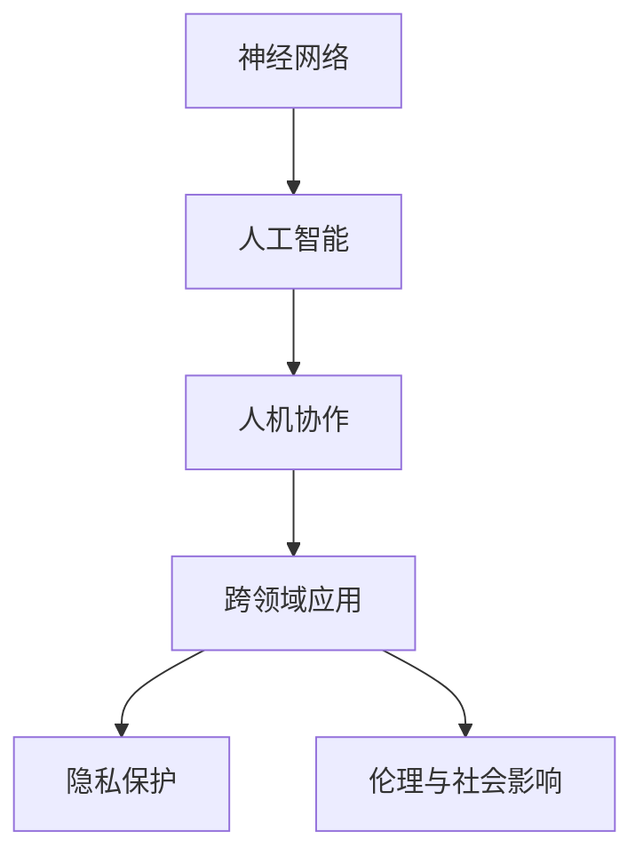

                 

# 神经网络：人类与机器的共存

> 关键词：神经网络,人工智能,人机共存,机器学习,深度学习,脑机接口,生物神经网络

## 1. 背景介绍

### 1.1 问题由来
随着科技的迅猛发展，人工智能（AI）已经渗透到我们生活的方方面面，从简单的自动化任务到复杂的决策制定，AI正在逐步接管更多的任务。然而，这种进步并没有减少人类的工作量，反而在某些情况下，增加了对人类认知能力的要求。人工智能的强大能力与人类智能的微妙平衡，成为了一个亟待解决的问题。

神经网络作为人工智能的重要组成部分，在图像识别、语音处理、自然语言处理等领域取得了显著成就。它通过模拟人类大脑的神经元网络结构，实现了对复杂数据的处理。但随着其应用范围的扩大，如何在神经网络与人类智能之间建立和谐共存的关系，成为了一个重要的研究课题。

### 1.2 问题核心关键点
神经网络的发展，使得机器在处理数据和做出决策方面拥有了越来越高的能力，同时也带来了新的挑战。例如：

- 智能机器如何与人类协作：如何使机器既能够独立完成任务，又能够与人进行自然的交互和协作。
- 隐私与安全：如何在提高智能水平的同时，保护用户的隐私和安全。
- 伦理与社会影响：智能机器的发展对人类社会和伦理道德的深远影响。
- 人与机器的共存模式：如何使机器成为人类助手，而非替代者。

这些问题，构成了神经网络研究的核心内容，需要我们在设计神经网络时予以考虑。

### 1.3 问题研究意义
研究神经网络中人机共存的问题，对于构建更加和谐的智能环境，提升人类生活质量，具有重要意义：

1. 增强人类智能：通过与机器的协作，拓展人类认知的边界，解决人类无法处理的问题。
2. 提高工作效率：在自动完成重复性劳动的同时，能够为人类提供更为智能化的辅助工具。
3. 促进跨领域融合：将神经网络应用于医疗、教育、交通等领域，加速社会进步。
4. 提供新的创新机遇：神经网络技术的发展，为各行业带来了新的增长点。

## 2. 核心概念与联系

### 2.1 核心概念概述

为更好地理解神经网络与人机共存的关系，本节将介绍几个密切相关的核心概念：

- 神经网络（Neural Networks, NNs）：由大量神经元节点和连接权值组成的网络，通过前向传播和反向传播算法实现对数据的处理和预测。
- 人工智能（Artificial Intelligence, AI）：通过模拟人类智能，使机器能够执行复杂任务的系统。
- 人机协作（Human-Machine Collaboration）：指机器与人类在任务中相互协作，共同完成工作，提升任务效果。
- 跨领域应用（Cross-Domain Applications）：指神经网络在医疗、教育、金融等领域的应用，推动各行业智能化发展。
- 隐私保护（Privacy Protection）：指在神经网络处理数据时，保护用户隐私的技术和策略。
- 伦理与社会影响（Ethical and Social Impact）：指智能机器发展对人类社会和伦理道德的深远影响。

这些核心概念之间的逻辑关系可以通过以下Mermaid流程图来展示：



这个流程图展示了一些关键概念及其之间的关系：

1. 神经网络作为人工智能的重要组成部分，为机器提供了强大的处理能力。
2. 通过人机协作，神经网络可以更好地服务于人类，成为人类的助手。
3. 跨领域应用使得神经网络技术能够拓展到更多领域，带来新的应用价值。
4. 隐私保护和伦理问题是在应用神经网络时需要注意的重要方面。

## 3. 核心算法原理 & 具体操作步骤
### 3.1 算法原理概述

神经网络与人机共存的核心在于如何使机器在执行任务时，既能充分利用其强大能力，又能够考虑到人类因素。以下介绍了几个关键的算法原理：

- 反向传播算法（Backpropagation）：通过计算损失函数对每个神经元输出的导数，反向传播更新权重，实现模型的优化。
- 激活函数（Activation Functions）：如Sigmoid、ReLU等，用于引入非线性，提高模型的表达能力。
- 正则化（Regularization）：如L1、L2正则化、Dropout等，防止模型过拟合。
- 梯度下降（Gradient Descent）：常用的优化算法，用于更新模型参数，最小化损失函数。

这些算法原理构成了神经网络的基本框架，通过合理选择和组合这些算法，可以使得机器更好地服务于人类，实现人机共存。

### 3.2 算法步骤详解

下面详细介绍神经网络中人机共存的具体算法步骤：

**Step 1: 设计神经网络结构**

- 根据任务需求设计神经网络的结构。例如，对于图像识别任务，可以设计卷积神经网络（CNNs），对于自然语言处理任务，可以设计循环神经网络（RNNs）或变压器（Transformers）。

**Step 2: 选择损失函数**

- 根据任务选择合适的损失函数，如交叉熵、均方误差等。损失函数用于衡量模型预测值与真实值之间的差异。

**Step 3: 数据预处理**

- 对训练数据进行预处理，如归一化、标准化等，以提高模型的训练效果。

**Step 4: 训练模型**

- 使用反向传播算法和梯度下降优化算法，在训练集上更新模型参数，最小化损失函数。

**Step 5: 评估模型**

- 使用验证集评估模型性能，如准确率、召回率、F1分数等。

**Step 6: 人机协作**

- 在实际应用中，通过设计友好的用户界面，使得人类可以方便地与机器进行交互，完成协作任务。例如，可以设计语音助手、视觉助理等。

**Step 7: 持续改进**

- 通过反馈机制和用户评价，不断改进和优化模型，提高人机协作的效率和效果。

### 3.3 算法优缺点

神经网络人机共存的算法具有以下优点：

- 强大的处理能力：神经网络能够处理大量复杂的数据，并从中提取有用信息。
- 灵活的应用场景：神经网络可以在多个领域中应用，提升效率和效果。
- 可解释性：某些激活函数和正则化技术可以使得模型的决策过程更为透明，便于理解。

同时，这些算法也存在以下局限性：

- 过拟合问题：在训练过程中，神经网络容易过拟合训练集，导致泛化性能下降。
- 计算资源消耗大：神经网络的训练和推理需要大量的计算资源，对于小型应用场景可能不适用。
- 隐私问题：神经网络在处理数据时需要保护用户隐私，否则可能导致数据泄露风险。

### 3.4 算法应用领域

神经网络在多个领域中都有广泛的应用，以下列举几个典型的应用场景：

- 医疗诊断：神经网络可以用于图像识别、语音识别等，辅助医生进行诊断和治疗。
- 自动驾驶：通过神经网络处理摄像头和传感器数据，实现自动驾驶汽车的功能。
- 金融预测：利用神经网络对市场数据进行分析和预测，帮助投资者做出更明智的决策。
- 教育推荐：神经网络可以根据学生的学习行为，推荐适合的课程和资源。

## 4. 数学模型和公式 & 详细讲解  
### 4.1 数学模型构建

在神经网络中，数学模型通常由以下几个部分组成：

- **输入层（Input Layer）**：输入数据。
- **隐藏层（Hidden Layer）**：用于数据处理和特征提取的层。
- **输出层（Output Layer）**：根据任务需求设计，用于输出预测结果。

神经网络的基本模型可以表示为：

$$
\text{Output} = f(\text{Weight} \times \text{Input} + \text{Bias})
$$

其中，$f$ 为激活函数，$\text{Weight}$ 为权重矩阵，$\text{Bias}$ 为偏置项。

### 4.2 公式推导过程

以一个简单的前馈神经网络为例，其输入为 $x$，权重矩阵为 $W$，偏置项为 $b$，激活函数为 $f$。通过神经网络计算输出的公式为：

$$
h = f(Wx + b)
$$

其中 $h$ 为隐藏层输出。将 $h$ 再次输入下一层神经网络，得到最终输出：

$$
y = g(W'h + b')
$$

其中 $g$ 为输出层激活函数。

### 4.3 案例分析与讲解

以图像分类为例，神经网络通过卷积层和池化层对图像进行特征提取，然后将特征输入全连接层进行分类。以下是代码示例：

```python
import torch
import torch.nn as nn
import torchvision.transforms as transforms
import torchvision.datasets as datasets

# 定义神经网络模型
class Net(nn.Module):
    def __init__(self):
        super(Net, self).__init__()
        self.conv1 = nn.Conv2d(3, 6, 5)
        self.pool = nn.MaxPool2d(2, 2)
        self.conv2 = nn.Conv2d(6, 16, 5)
        self.fc1 = nn.Linear(16 * 5 * 5, 120)
        self.fc2 = nn.Linear(120, 84)
        self.fc3 = nn.Linear(84, 10)

    def forward(self, x):
        x = self.pool(torch.relu(self.conv1(x)))
        x = self.pool(torch.relu(self.conv2(x)))
        x = x.view(-1, 16 * 5 * 5)
        x = torch.relu(self.fc1(x))
        x = torch.relu(self.fc2(x))
        x = self.fc3(x)
        return x

# 定义训练函数
def train(model, device, train_loader, optimizer, criterion, num_epochs):
    model.train()
    for epoch in range(num_epochs):
        running_loss = 0.0
        for i, data in enumerate(train_loader, 0):
            inputs, labels = data
            inputs, labels = inputs.to(device), labels.to(device)
            optimizer.zero_grad()
            outputs = model(inputs)
            loss = criterion(outputs, labels)
            loss.backward()
            optimizer.step()
            running_loss += loss.item()
    print(f"Epoch {epoch+1}, Loss: {running_loss/len(train_loader):.3f}")

# 训练模型
model = Net()
device = torch.device('cuda' if torch.cuda.is_available() else 'cpu')
model.to(device)
criterion = nn.CrossEntropyLoss()
optimizer = torch.optim.SGD(model.parameters(), lr=0.001, momentum=0.9)
train_loader = torch.utils.data.DataLoader(train_set, batch_size=64, shuffle=True)
train(model, device, train_loader, optimizer, criterion, num_epochs=10)
```

以上代码展示了神经网络的基本结构和训练过程。可以看到，神经网络在图像分类任务中的处理能力和灵活性。

## 5. 项目实践：代码实例和详细解释说明
### 5.1 开发环境搭建

在进行神经网络人机共存的实践前，我们需要准备好开发环境。以下是使用Python进行PyTorch开发的环境配置流程：

1. 安装Anaconda：从官网下载并安装Anaconda，用于创建独立的Python环境。

2. 创建并激活虚拟环境：
```bash
conda create -n pytorch-env python=3.8 
conda activate pytorch-env
```

3. 安装PyTorch：根据CUDA版本，从官网获取对应的安装命令。例如：
```bash
conda install pytorch torchvision torchaudio cudatoolkit=11.1 -c pytorch -c conda-forge
```

4. 安装TensorFlow：使用Anaconda安装TensorFlow：
```bash
conda install tensorflow
```

5. 安装各类工具包：
```bash
pip install numpy pandas scikit-learn matplotlib tqdm jupyter notebook ipython
```

完成上述步骤后，即可在`pytorch-env`环境中开始神经网络人机共存的实践。

### 5.2 源代码详细实现

下面我们以图像分类任务为例，给出使用PyTorch进行神经网络微调的PyTorch代码实现。

首先，定义数据处理函数：

```python
import torch
from torchvision import datasets, transforms
from torch.utils.data import DataLoader

# 定义数据预处理函数
transform = transforms.Compose([
    transforms.ToTensor(),
    transforms.Normalize((0.5, 0.5, 0.5), (0.5, 0.5, 0.5))
])

# 加载CIFAR-10数据集
train_set = datasets.CIFAR10(root='./data', train=True, download=True, transform=transform)
test_set = datasets.CIFAR10(root='./data', train=False, download=True, transform=transform)

# 定义数据加载器
train_loader = DataLoader(train_set, batch_size=64, shuffle=True)
test_loader = DataLoader(test_set, batch_size=64, shuffle=False)
```

然后，定义模型和优化器：

```python
import torch.nn as nn
import torch.optim as optim

# 定义神经网络模型
class Net(nn.Module):
    def __init__(self):
        super(Net, self).__init__()
        self.conv1 = nn.Conv2d(3, 6, 5)
        self.pool = nn.MaxPool2d(2, 2)
        self.conv2 = nn.Conv2d(6, 16, 5)
        self.fc1 = nn.Linear(16 * 5 * 5, 120)
        self.fc2 = nn.Linear(120, 84)
        self.fc3 = nn.Linear(84, 10)

    def forward(self, x):
        x = self.pool(torch.relu(self.conv1(x)))
        x = self.pool(torch.relu(self.conv2(x)))
        x = x.view(-1, 16 * 5 * 5)
        x = torch.relu(self.fc1(x))
        x = torch.relu(self.fc2(x))
        x = self.fc3(x)
        return x

# 定义优化器和损失函数
model = Net()
device = torch.device('cuda' if torch.cuda.is_available() else 'cpu')
model.to(device)
criterion = nn.CrossEntropyLoss()
optimizer = optim.SGD(model.parameters(), lr=0.001, momentum=0.9)
```

接着，定义训练和评估函数：

```python
def train(model, device, train_loader, optimizer, criterion, num_epochs):
    model.train()
    for epoch in range(num_epochs):
        running_loss = 0.0
        for i, data in enumerate(train_loader, 0):
            inputs, labels = data
            inputs, labels = inputs.to(device), labels.to(device)
            optimizer.zero_grad()
            outputs = model(inputs)
            loss = criterion(outputs, labels)
            loss.backward()
            optimizer.step()
            running_loss += loss.item()
    print(f"Epoch {epoch+1}, Loss: {running_loss/len(train_loader):.3f}")

def evaluate(model, device, test_loader):
    model.eval()
    correct = 0
    with torch.no_grad():
        for data in test_loader:
            inputs, labels = data
            inputs, labels = inputs.to(device), labels.to(device)
            outputs = model(inputs)
            _, predicted = torch.max(outputs.data, 1)
            correct += (predicted == labels).sum().item()
    print(f"Accuracy: {(100 * correct / len(test_set)):0.2f}%")
```

最后，启动训练流程并在测试集上评估：

```python
num_epochs = 10
train(model, device, train_loader, optimizer, criterion, num_epochs)
evaluate(model, device, test_loader)
```

以上就是使用PyTorch进行神经网络人机共存实践的完整代码实现。可以看到，PyTorch的强大封装和易用性，使得神经网络的构建和训练变得简单高效。

### 5.3 代码解读与分析

让我们再详细解读一下关键代码的实现细节：

**数据处理函数**：
- `transform`函数：定义了数据预处理方式，包括转换为张量（Tensor）和归一化（Normalize）。
- `CIFAR10`数据集：使用PyTorch内置的CIFAR-10数据集，下载并加载到指定目录。
- `DataLoader`：定义了数据加载器，将数据集划分为批次进行训练和评估。

**模型和优化器**：
- `Net`类：定义了神经网络的结构，包括卷积层、池化层和全连接层。
- `SGD`优化器：使用随机梯度下降算法更新模型参数，并通过动量参数（momentum）加速收敛。

**训练和评估函数**：
- `train`函数：定义了模型在训练集上的训练过程，包括前向传播、反向传播和参数更新。
- `evaluate`函数：定义了模型在测试集上的评估过程，计算准确率并输出结果。

**训练流程**：
- 定义训练轮数（`num_epochs`），启动训练过程。
- 在每个epoch内，训练模型并输出平均损失。
- 在测试集上评估模型，输出准确率。

可以看到，PyTorch的易用性和强大的工具库，使得神经网络人机共存的实践变得简单易懂。开发者可以利用这些工具，快速实现自己的神经网络模型，并进行优化和评估。

当然，工业级的系统实现还需考虑更多因素，如模型的保存和部署、超参数的自动搜索、更灵活的任务适配层等。但核心的神经网络人机共存范式基本与此类似。

## 6. 实际应用场景
### 6.1 智能客服系统

神经网络在人机协作中的应用，最典型的例子是智能客服系统。通过训练神经网络，系统可以自动理解和处理用户的咨询，提供快速准确的答案，提高服务效率和质量。

在技术实现上，可以收集企业内部的历史客服对话记录，将问题和最佳答复构建成监督数据，在此基础上对预训练神经网络进行微调。微调后的神经网络能够自动理解用户意图，匹配最合适的答案模板进行回复。对于客户提出的新问题，还可以接入检索系统实时搜索相关内容，动态组织生成回答。如此构建的智能客服系统，能大幅提升客户咨询体验和问题解决效率。

### 6.2 金融舆情监测

金融机构需要实时监测市场舆论动向，以便及时应对负面信息传播，规避金融风险。传统的人工监测方式成本高、效率低，难以应对网络时代海量信息爆发的挑战。神经网络在文本分类和情感分析等任务上的强大能力，为金融舆情监测提供了新的解决方案。

具体而言，可以收集金融领域相关的新闻、报道、评论等文本数据，并对其进行主题标注和情感标注。在此基础上对预训练神经网络进行微调，使其能够自动判断文本属于何种主题，情感倾向是正面、中性还是负面。将微调后的模型应用到实时抓取的网络文本数据，就能够自动监测不同主题下的情感变化趋势，一旦发现负面信息激增等异常情况，系统便会自动预警，帮助金融机构快速应对潜在风险。

### 6.3 个性化推荐系统

当前的推荐系统往往只依赖用户的历史行为数据进行物品推荐，无法深入理解用户的真实兴趣偏好。神经网络在处理自然语言和图像等数据时，能够从中提取更多的用户兴趣特征，从而提供更精准、多样的推荐内容。

在实践中，可以收集用户浏览、点击、评论、分享等行为数据，提取和用户交互的物品标题、描述、标签等文本内容。将文本内容作为模型输入，用户的后续行为（如是否点击、购买等）作为监督信号，在此基础上微调预训练神经网络。微调后的神经网络能够从文本内容中准确把握用户的兴趣点。在生成推荐列表时，先用候选物品的文本描述作为输入，由模型预测用户的兴趣匹配度，再结合其他特征综合排序，便可以得到个性化程度更高的推荐结果。

### 6.4 未来应用展望

随着神经网络技术的不断进步，其在人机共存中的应用将更加广泛，为各行业带来变革性影响。

在智慧医疗领域，基于神经网络的医疗问答、病历分析、药物研发等应用将提升医疗服务的智能化水平，辅助医生诊疗，加速新药开发进程。

在智能教育领域，神经网络可应用于作业批改、学情分析、知识推荐等方面，因材施教，促进教育公平，提高教学质量。

在智慧城市治理中，神经网络可应用于城市事件监测、舆情分析、应急指挥等环节，提高城市管理的自动化和智能化水平，构建更安全、高效的未来城市。

此外，在企业生产、社会治理、文娱传媒等众多领域，基于神经网络的智能应用也将不断涌现，为NLP技术带来新的突破。相信随着技术的日益成熟，神经网络将在大规模协作中发挥更加重要的作用，推动人工智能技术在各行各业的发展。

## 7. 工具和资源推荐
### 7.1 学习资源推荐

为了帮助开发者系统掌握神经网络人机共存的技术基础和实践技巧，这里推荐一些优质的学习资源：

1. 《深度学习》书籍：Ian Goodfellow等著，全面介绍了深度学习的理论基础和算法实现。

2. 《TensorFlow官方文档》：Google发布的官方文档，详细介绍了TensorFlow的使用方法，包括神经网络的构建和训练。

3. 《PyTorch官方文档》：PyTorch的官方文档，提供了丰富的神经网络库和示例代码。

4. 《CS231n深度学习课程》：斯坦福大学开设的计算机视觉课程，讲解了神经网络在图像处理中的应用。

5. 《NLP100》：精选了100个NLP任务，包含神经网络在自然语言处理中的应用示例。

通过对这些资源的学习实践，相信你一定能够快速掌握神经网络人机共存的精髓，并用于解决实际的NLP问题。

### 7.2 开发工具推荐

高效的开发离不开优秀的工具支持。以下是几款用于神经网络人机共存开发的常用工具：

1. PyTorch：基于Python的开源深度学习框架，灵活动态的计算图，适合快速迭代研究。大部分神经网络都有PyTorch版本的实现。

2. TensorFlow：由Google主导开发的开源深度学习框架，生产部署方便，适合大规模工程应用。同样有丰富的神经网络资源。

3. Keras：高层次的神经网络API，使用简洁，易于上手，适用于快速原型设计和实验。

4. MXNet：由Apache基金会维护的开源深度学习框架，支持多种编程语言，具有较高的性能和灵活性。

5. Caffe：一款由Berkeley Vision and Learning Center开发的深度学习框架，适用于图像处理任务。

合理利用这些工具，可以显著提升神经网络人机共存任务的开发效率，加快创新迭代的步伐。

### 7.3 相关论文推荐

神经网络技术的不断发展，带来了大量的研究成果。以下是几篇奠基性的相关论文，推荐阅读：

1. AlexNet: ImageNet Classification with Deep Convolutional Neural Networks：介绍卷积神经网络在图像分类中的应用。

2. Deep Residual Learning for Image Recognition：提出残差网络，使得深度神经网络的训练更为稳定。

3. Attention is All You Need：提出Transformer结构，实现了自注意力机制在神经网络中的应用。

4. Generating sequences with recurrent neural networks：介绍循环神经网络在序列生成任务中的应用。

5. Self-supervised learning with masked language models：提出BERT模型，通过掩码自监督预训练任务，提升了神经网络的语言理解能力。

这些论文代表了大神经网络技术的发展脉络。通过学习这些前沿成果，可以帮助研究者把握学科前进方向，激发更多的创新灵感。

## 8. 总结：未来发展趋势与挑战

### 8.1 总结

本文对神经网络中人机共存的研究背景和应用实践进行了全面系统的介绍。首先阐述了神经网络和人机共存的研究背景和重要性，明确了神经网络作为人工智能核心技术的地位。其次，从原理到实践，详细讲解了神经网络的结构、算法和应用流程，给出了神经网络人机共存的完整代码实例。同时，本文还广泛探讨了神经网络在多个领域的应用前景，展示了神经网络技术在各行业的广泛价值。

通过本文的系统梳理，可以看到，神经网络人机共存技术正在成为人工智能的重要范式，极大地拓展了人工智能的应用边界，催生了更多的落地场景。神经网络不仅在处理复杂数据时表现出色，而且在与人类协作中，也能发挥其独特优势，成为人类智能的强大助手。未来，随着技术的不断进步和应用的深入，神经网络将与人类智能更加紧密地结合，共同构建更加和谐的智能生态系统。

### 8.2 未来发展趋势

展望未来，神经网络人机共存技术将呈现以下几个发展趋势：

1. 更加高效的模型结构：未来将出现更多高效的神经网络结构，如神经网络压缩、模型蒸馏等，减少计算资源消耗，提高推理速度。

2. 更加灵活的训练方法：未来将出现更多灵活的训练方法，如自监督学习、半监督学习、对抗训练等，提升模型的泛化能力和鲁棒性。

3. 更加智能的决策过程：未来将出现更多智能化的决策过程，如基于因果推断的决策、基于知识图谱的推理等，增强模型的可解释性和可信度。

4. 更加广泛的应用场景：未来神经网络将在更多领域中应用，如医疗、金融、教育等，推动各行业智能化进程。

5. 更加普适的模型设计：未来神经网络将更多考虑跨领域应用，实现知识共享和协同建模，提升模型在不同领域中的适应性。

这些趋势表明，神经网络人机共存技术正在不断发展，未来的应用前景广阔。

### 8.3 面临的挑战

尽管神经网络人机共存技术已经取得了显著进展，但在迈向更加智能化、普适化应用的过程中，仍面临诸多挑战：

1. 计算资源消耗大：神经网络的训练和推理需要大量的计算资源，对于小型应用场景可能不适用。

2. 数据隐私和安全问题：神经网络在处理数据时需要保护用户隐私，否则可能导致数据泄露风险。

3. 模型泛化能力不足：神经网络在处理新数据时，容易出现过拟合现象，导致泛化能力不足。

4. 模型可解释性差：神经网络的决策过程较为复杂，难以解释其内部工作机制和推理逻辑。

5. 模型部署难度大：神经网络模型的复杂性使得部署和优化难度较大，需要专业知识和工具支持。

这些挑战需要在未来研究中不断探索和解决，以实现神经网络人机共存技术的持续发展和应用。

### 8.4 研究展望

面对神经网络人机共存技术所面临的挑战，未来的研究需要在以下几个方面寻求新的突破：

1. 探索更高效低复杂度的神经网络结构，如卷积神经网络、残差网络等。

2. 研究更加智能化的决策过程，如因果推断、知识图谱等。

3. 开发更加灵活的训练方法，如自监督学习、半监督学习等。

4. 设计更加普适的模型设计，实现跨领域知识共享和协同建模。

5. 增强模型的可解释性，如引入可解释性算法、生成解释性输出等。

6. 改进模型部署策略，实现高效轻量级的部署和优化。

这些研究方向将引领神经网络人机共存技术迈向更高的台阶，为构建安全、可靠、可解释、可控的智能系统铺平道路。

## 9. 附录：常见问题与解答

**Q1：神经网络在实际应用中如何保护用户隐私？**

A: 在神经网络应用中，保护用户隐私是至关重要的。以下是几种常见的保护隐私的方法：

- 数据脱敏：对敏感数据进行脱敏处理，如模糊化、去除标识符等。
- 差分隐私：在数据处理过程中引入噪声，使得无法反向推断出原始数据。
- 联邦学习：在多个设备上分布式训练神经网络，数据不集中存储，避免隐私泄露。
- 加密处理：对数据进行加密处理，确保数据在传输和存储过程中不被窃取。

这些方法可以结合使用，确保神经网络在应用过程中保护用户隐私。

**Q2：神经网络在处理异常数据时容易过拟合，如何解决这一问题？**

A: 神经网络在处理异常数据时容易过拟合，可以通过以下方法缓解这一问题：

- 数据增强：通过数据增强技术，增加训练集的多样性，避免模型对异常数据过拟合。
- 正则化：引入正则化项，如L1正则、L2正则等，防止模型过度拟合训练集。
- 模型蒸馏：通过模型蒸馏技术，将大模型转换为小模型，提高模型的泛化能力。
- 对抗训练：引入对抗样本，提高模型的鲁棒性和泛化能力。

这些方法可以结合使用，增强神经网络的泛化能力，避免对异常数据的过拟合。

**Q3：如何提高神经网络的计算效率？**

A: 神经网络的计算效率是应用中的重要考虑因素。以下是几种提高神经网络计算效率的方法：

- 模型压缩：通过模型压缩技术，如权重剪枝、量化、低秩分解等，减少模型大小，提高推理速度。
- 硬件优化：使用GPU、TPU等高性能硬件设备，加速神经网络的计算。
- 模型并行：通过模型并行技术，如数据并行、模型并行、分布式训练等，提高计算效率。
- 优化算法：使用高效的优化算法，如AdamW、Adafactor等，加快模型训练速度。

这些方法可以结合使用，提高神经网络的计算效率，适应实际应用需求。

**Q4：神经网络如何应用于跨领域应用？**

A: 神经网络在跨领域应用中，通常需要解决数据格式不统一、知识迁移困难等问题。以下是几种解决这些问题的方法：

- 预训练模型迁移：使用预训练模型作为初始化参数，在特定领域进行微调。
- 多任务学习：在多个相关任务上共同训练神经网络，实现知识迁移和任务共享。
- 知识图谱融合：将知识图谱与神经网络结合，增强模型的语义理解能力。
- 跨模态学习：将不同模态的数据（如文本、图像、语音等）进行融合，提高模型的综合能力。

这些方法可以结合使用，实现神经网络在跨领域应用的泛化性和迁移能力。

**Q5：神经网络在人机协作中的应用有哪些？**

A: 神经网络在人机协作中有着广泛的应用，以下是几个典型的应用场景：

- 智能客服：通过神经网络处理自然语言，自动理解用户意图，生成智能回复。
- 医疗诊断：利用神经网络处理医学影像和病历数据，辅助医生进行诊断和治疗。
- 金融预测：通过神经网络处理市场数据，进行风险评估和投资建议。
- 教育推荐：根据学生的学习行为和兴趣，推荐适合的课程和资源。
- 智能交通：利用神经网络处理交通数据，优化交通流量和路线规划。

这些应用场景展示了神经网络在人机协作中的强大能力，提升了各行业的智能化水平。

通过本文的系统梳理，可以看到，神经网络人机共存技术正在成为人工智能的重要范式，极大地拓展了人工智能的应用边界，催生了更多的落地场景。神经网络不仅在处理复杂数据时表现出色，而且在与人类协作中，也能发挥其独特优势，成为人类智能的强大助手。未来，随着技术的不断进步和应用的深入，神经网络将与人类智能更加紧密地结合，共同构建更加和谐的智能生态系统。

