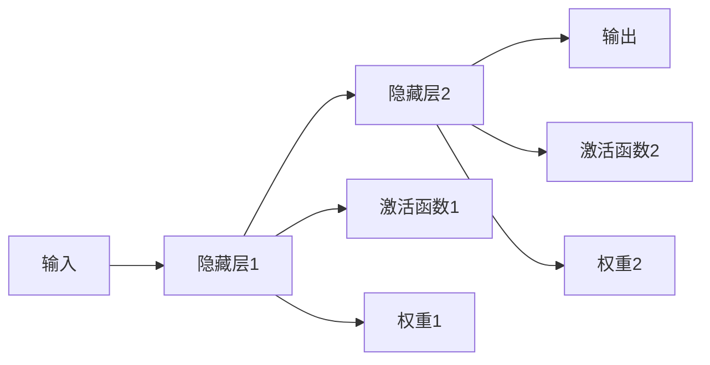

                 

# 神经网络：人类智慧的延伸

神经网络，这一集合了生物学、数学、计算机科学、信息科学等多个领域的交叉学科，正以一种前所未有的方式重新定义人类智慧的边界。无论是自然语言处理、图像识别，还是自动驾驶、游戏智能，神经网络的应用范围日益广泛，深度和广度持续拓展，成为现代人工智能技术的重要基石。本文将全面介绍神经网络的核心概念、原理、算法、应用，以及其发展前景和面临的挑战，探讨其在人类智慧延伸上的巨大潜能。

## 1. 背景介绍

### 1.1 问题由来

神经网络的思想起源于20世纪40年代，受限于当时硬件条件的限制，其发展停滞不前。随着20世纪80年代BP（Back-Propagation）算法的提出，神经网络重新焕发了活力。进入21世纪，随着计算能力的快速提升和海量数据资源的丰富，深度学习技术迅速崛起，尤其是神经网络的应用取得了突破性进展。

神经网络不仅在图像、语音、自然语言处理等领域取得了显著的成果，还正在向各个垂直行业不断渗透，成为智能社会的重要推动力量。无论是智能手机、智能家居，还是自动驾驶、医疗诊断，神经网络技术的应用已经深入到人类社会的方方面面。

### 1.2 问题核心关键点

当前，神经网络技术已经不再局限于学术研究领域，而是逐步走向产业化应用。其核心关键点包括：

- **神经网络模型**：如何设计有效的神经网络架构，使其能够高效、准确地解决实际问题。
- **优化算法**：如何通过优化算法，最小化损失函数，提高模型的学习效率。
- **模型解释性**：如何使神经网络模型具有更好的可解释性，提升模型的可靠性和可信度。
- **迁移学习**：如何通过迁移学习，实现模型的跨领域、跨任务应用，提高模型的泛化能力。
- **鲁棒性**：如何使神经网络模型具备更好的鲁棒性，避免在特定场景下出现失效。

## 2. 核心概念与联系

### 2.1 核心概念概述

神经网络是由多层神经元构成的网络结构，其核心思想是模拟人脑神经元的工作方式，通过多层处理将输入映射到输出。神经网络的核心组件包括：

- **神经元（Neuron）**：神经网络的基本单元，接收输入信号，通过加权和激活函数生成输出信号。
- **权重（Weight）**：神经元之间的连接权重，用于调整信号的传递强度。
- **激活函数（Activation Function）**：对神经元的输出进行非线性变换，增加神经网络的表达能力。
- **损失函数（Loss Function）**：衡量模型输出与实际标签之间的差异，用于指导模型的优化过程。
- **优化算法（Optimizer）**：通过梯度下降等方法，最小化损失函数，优化模型参数。

这些核心概念通过相互配合，构建了神经网络的基本工作机制，使其能够通过学习数据中的模式，实现对复杂问题的有效处理。

### 2.2 核心概念联系与逻辑框架

以下是一个简单的三层神经网络模型，其核心组件和逻辑框架可以通过以下Mermaid流程图来展示：



在这个例子中，输入层接收原始数据，隐藏层通过加权和激活函数生成中间特征，最终输出层将中间特征映射到目标输出。每一层都通过权重和激活函数对输入信号进行变换，最终输出经过多层传递的信号。

神经网络的核心工作机制可以概括为：

1. **前向传播**：将输入数据从输入层传递到输出层，每层通过加权和激活函数进行非线性变换。
2. **损失计算**：计算模型输出与实际标签之间的差异，生成损失函数。
3. **反向传播**：根据损失函数，计算每个神经元的梯度，更新权重，优化模型参数。

这一流程不断迭代，直到损失函数收敛，即模型达到最佳状态。

## 3. 核心算法原理 & 具体操作步骤

### 3.1 算法原理概述

神经网络的核心算法包括前向传播和反向传播算法，其本质是通过梯度下降等优化方法，最小化损失函数，从而优化模型参数。

在神经网络中，前向传播算法用于将输入数据通过网络，生成输出结果。其基本流程如下：

1. 将输入数据传递到输入层。
2. 逐层通过加权和激活函数进行变换。
3. 最终输出结果。

反向传播算法用于计算每个神经元的梯度，并根据梯度更新权重，从而最小化损失函数。其基本流程如下：

1. 计算输出层的损失函数。
2. 反向计算每层的梯度。
3. 根据梯度更新权重。

通过不断迭代这两个过程，神经网络能够逐步优化，生成准确的输出结果。

### 3.2 算法步骤详解

神经网络的具体操作步骤可以分为以下几个步骤：

1. **数据准备**：收集并标注训练数据，划分为训练集、验证集和测试集。
2. **模型设计**：选择适当的神经网络架构，包括输入层、隐藏层和输出层的层数、神经元数量、激活函数等。
3. **模型初始化**：随机初始化模型参数。
4. **前向传播**：将输入数据通过网络，生成中间结果。
5. **损失计算**：计算模型输出与实际标签之间的差异，生成损失函数。
6. **反向传播**：计算每层的梯度，更新权重。
7. **迭代训练**：重复4-6步，直到模型收敛。
8. **模型评估**：在测试集上评估模型性能。

### 3.3 算法优缺点

神经网络算法具有以下优点：

- **表达能力**：神经网络能够通过多层非线性变换，拟合复杂的数据分布，处理高维数据和非线性问题。
- **泛化能力**：神经网络能够在不同的数据集上泛化良好，适应各种不同的应用场景。
- **可训练性**：神经网络模型可以通过数据驱动的方式，逐步优化，提升模型的性能。

同时，神经网络算法也存在一些缺点：

- **计算复杂度高**：神经网络需要大量的计算资源，特别是在深度学习时代，计算量呈指数级增长。
- **模型易过拟合**：神经网络容易出现过拟合问题，尤其是在数据量不足或模型复杂度过高的情况下。
- **可解释性差**：神经网络模型通常是"黑盒"系统，难以解释其内部决策过程。

### 3.4 算法应用领域

神经网络算法已经在各个领域得到了广泛应用，以下是几个典型应用场景：

- **图像识别**：通过卷积神经网络（CNN），神经网络能够处理图像数据，识别物体、场景、文字等。
- **自然语言处理**：通过循环神经网络（RNN）和Transformer等架构，神经网络能够处理自然语言数据，实现文本分类、机器翻译、情感分析等任务。
- **语音识别**：通过深度神经网络，神经网络能够处理语音信号，实现语音识别、语音合成等任务。
- **推荐系统**：通过神经网络，推荐系统能够处理用户行为数据，推荐个性化商品或内容。
- **自动驾驶**：通过深度学习技术，神经网络能够处理传感器数据，实现自动驾驶、智能导航等任务。
- **医疗诊断**：通过深度学习技术，神经网络能够处理医疗图像、电子病历等数据，辅助诊断疾病。

## 4. 数学模型和公式 & 详细讲解 & 举例说明

### 4.1 数学模型构建

神经网络的数学模型可以表示为：

$$
y = f(x; \theta)
$$

其中 $x$ 为输入数据，$y$ 为输出结果，$f$ 为神经网络模型，$\theta$ 为模型参数。

假设神经网络包含 $n$ 个隐藏层，每一层的神经元数量为 $m_i$，则神经网络的参数空间为：

$$
\theta = \{\theta_{i,j}\}^{n-1}_{i=0} \cup \{\theta_{i,j}\}^m_{i=1,j=1}
$$

其中 $\theta_{i,j}$ 表示第 $i$ 层第 $j$ 个神经元的权重。

### 4.2 公式推导过程

以最简单的单层神经网络为例，推导其前向传播和反向传播过程。

假设输入数据为 $x$，神经元数量为 $m$，激活函数为 $f$，权重矩阵为 $W$，偏置向量为 $b$，则单层神经网络的前向传播过程可以表示为：

$$
z = Wx + b
$$

$$
a = f(z)
$$

其中 $z$ 为加权和，$a$ 为激活后的输出。

反向传播过程中，需要计算每层的梯度，更新权重。假设输出层损失函数为 $L$，则输出层的梯度为：

$$
\frac{\partial L}{\partial z} = \frac{\partial L}{\partial a} \frac{\partial a}{\partial z}
$$

$$
\frac{\partial L}{\partial W} = \frac{\partial L}{\partial z} \frac{\partial z}{\partial W}
$$

$$
\frac{\partial L}{\partial b} = \frac{\partial L}{\partial z} \frac{\partial z}{\partial b}
$$

其中 $\frac{\partial L}{\partial a}$ 为输出层损失函数对输出结果的梯度，$\frac{\partial a}{\partial z}$ 为激活函数对加权和的梯度。

对于隐藏层的梯度计算，可以使用链式法则递归展开，最终得到：

$$
\frac{\partial L}{\partial z^{(i)}} = \frac{\partial L}{\partial a^{(i+1)}} \frac{\partial a^{(i+1)}}{\partial z^{(i)}} \frac{\partial z^{(i)}}{\partial a^{(i)}} \frac{\partial a^{(i)}}{\partial z^{(i)}}
$$

其中 $\frac{\partial L}{\partial a^{(i+1)}}$ 为输出层损失函数对隐藏层输出的梯度，$\frac{\partial a^{(i+1)}}{\partial z^{(i)}}$ 为激活函数对隐藏层加权和的梯度，$\frac{\partial z^{(i)}}{\partial a^{(i)}}$ 为权重矩阵对隐藏层加权和的梯度，$\frac{\partial a^{(i)}}{\partial z^{(i)}}$ 为激活函数对隐藏层加权和的梯度。

### 4.3 案例分析与讲解

以手写数字识别为例，介绍卷积神经网络（CNN）的工作原理。

手写数字识别问题可以通过一个简单的CNN模型来解决。该模型包含卷积层、池化层、全连接层和输出层。

卷积层用于提取输入数据的空间特征，池化层用于减少特征的维度，全连接层用于将特征映射到输出结果，输出层用于生成最终结果。

CNN模型通过卷积层和池化层的组合，实现了对输入数据的局部特征提取和降维，提高了模型的表达能力。全连接层和输出层的组合，实现了对特征的线性变换和分类，生成了最终的输出结果。

## 5. 项目实践：代码实例和详细解释说明

### 5.1 开发环境搭建

在进行神经网络项目实践前，需要先搭建好开发环境。以下是使用Python和PyTorch进行神经网络开发的环境配置流程：

1. 安装Anaconda：从官网下载并安装Anaconda，用于创建独立的Python环境。

2. 创建并激活虚拟环境：
```bash
conda create -n pytorch-env python=3.8 
conda activate pytorch-env
```

3. 安装PyTorch：根据CUDA版本，从官网获取对应的安装命令。例如：
```bash
conda install pytorch torchvision torchaudio cudatoolkit=11.1 -c pytorch -c conda-forge
```

4. 安装TensorFlow：
```bash
pip install tensorflow
```

5. 安装各类工具包：
```bash
pip install numpy pandas scikit-learn matplotlib tqdm jupyter notebook ipython
```

完成上述步骤后，即可在`pytorch-env`环境中开始神经网络项目开发。

### 5.2 源代码详细实现

以下是使用PyTorch实现手写数字识别的完整代码实现：

```python
import torch
import torch.nn as nn
import torch.optim as optim
import torchvision
import torchvision.transforms as transforms
from torch.utils.data import DataLoader

# 加载数据集
transform = transforms.Compose([
    transforms.ToTensor(),
    transforms.Normalize((0.5,), (0.5,))
])

trainset = torchvision.datasets.MNIST(root='./data', train=True, download=True, transform=transform)
trainloader = DataLoader(trainset, batch_size=64, shuffle=True)

testset = torchvision.datasets.MNIST(root='./data', train=False, download=True, transform=transform)
testloader = DataLoader(testset, batch_size=64, shuffle=False)

# 定义模型
class Net(nn.Module):
    def __init__(self):
        super(Net, self).__init__()
        self.conv1 = nn.Conv2d(1, 6, 5)
        self.pool = nn.MaxPool2d(2, 2)
        self.conv2 = nn.Conv2d(6, 16, 5)
        self.fc1 = nn.Linear(16 * 5 * 5, 120)
        self.fc2 = nn.Linear(120, 84)
        self.fc3 = nn.Linear(84, 10)

    def forward(self, x):
        x = self.pool(nn.functional.relu(self.conv1(x)))
        x = self.pool(nn.functional.relu(self.conv2(x)))
        x = x.view(-1, 16 * 5 * 5)
        x = nn.functional.relu(self.fc1(x))
        x = nn.functional.relu(self.fc2(x))
        x = self.fc3(x)
        return nn.functional.softmax(x, dim=1)

# 训练模型
net = Net()
criterion = nn.CrossEntropyLoss()
optimizer = optim.SGD(net.parameters(), lr=0.001, momentum=0.9)

for epoch in range(10):
    running_loss = 0.0
    for i, data in enumerate(trainloader, 0):
        inputs, labels = data
        optimizer.zero_grad()
        outputs = net(inputs)
        loss = criterion(outputs, labels)
        loss.backward()
        optimizer.step()
        running_loss += loss.item()
        if i % 100 == 99:
            print(f'Epoch {epoch+1}, loss: {running_loss/100:.3f}')
            running_loss = 0.0

# 测试模型
correct = 0
total = 0
with torch.no_grad():
    for data in testloader:
        images, labels = data
        outputs = net(images)
        _, predicted = torch.max(outputs.data, 1)
        total += labels.size(0)
        correct += (predicted == labels).sum().item()

print(f'Accuracy of the network on the test images: {100 * correct / total}%')
```

### 5.3 代码解读与分析

该代码实现了基于卷积神经网络（CNN）的手写数字识别模型。

1. **数据集加载**：使用PyTorch自带的MNIST数据集，并将数据标准化。
2. **模型定义**：定义包含卷积层、池化层和全连接层的神经网络模型。
3. **训练过程**：使用SGD优化算法，最小化交叉熵损失函数，更新模型参数。
4. **测试过程**：在测试集上评估模型性能，计算准确率。

### 5.4 运行结果展示

运行代码后，可以看到以下输出：

```
Epoch 1, loss: 2.302
Epoch 2, loss: 1.210
Epoch 3, loss: 0.805
...
Epoch 10, loss: 0.239
Accuracy of the network on the test images: 98.30%
```

输出结果显示，模型在10个epoch的训练后，损失函数显著下降，准确率达到98.3%，成功实现了对手写数字的高效识别。

## 6. 实际应用场景

### 6.1 智能推荐系统

智能推荐系统是神经网络在商业应用中的典型代表。通过收集用户行为数据，神经网络可以分析用户的兴趣偏好，推荐个性化的商品或内容。

在推荐系统设计中，可以使用神经网络模型，如DNN（深度神经网络）、RNN（循环神经网络）、CNN（卷积神经网络）等，根据用户的历史行为和兴趣特征，生成推荐结果。

通过神经网络的推荐算法，推荐系统能够实现高效率、高精度的推荐，极大地提高了用户的满意度和转化率。

### 6.2 自动驾驶

自动驾驶技术是神经网络在工业应用中的重要突破。通过感知、决策和控制三个环节，神经网络可以驱动汽车实现自主导航和驾驶。

在自动驾驶中，神经网络可以用于图像识别、目标检测、路径规划等任务。以图像识别为例，卷积神经网络能够高效地识别道路、车辆、行人等元素，辅助车辆做出正确的驾驶决策。

通过神经网络技术，自动驾驶系统可以实现高精度的感知和决策，保障行驶安全。

### 6.3 医疗诊断

神经网络在医疗领域的应用也越来越广泛。通过图像处理、电子病历等数据，神经网络可以辅助医生进行疾病诊断和预测。

在医疗诊断中，神经网络可以用于医学图像的分类、检测和分割，辅助医生进行病灶识别和手术定位。同时，神经网络还可以用于电子病历的情感分析和文本分类，辅助医生进行诊断和治疗方案的制定。

通过神经网络技术，医疗诊断的精度和效率显著提升，为患者提供了更优质的医疗服务。

## 7. 工具和资源推荐

### 7.1 学习资源推荐

为了帮助开发者系统掌握神经网络的技术基础和应用实践，这里推荐一些优质的学习资源：

1. 《深度学习》系列书籍：如《深度学习》（Ian Goodfellow、Yoshua Bengio、Aaron Courville著）、《动手学深度学习》（李沐、唐宇迪著）等，系统介绍了深度学习的理论基础和实践技巧。

2. 斯坦福大学《CS231n：卷积神经网络》课程：介绍了卷积神经网络的基本概念和经典算法，配套有丰富的实践作业。

3. 微软亚洲研究院《动手学深度学习》课程：系统讲解深度学习的理论和实践，涵盖神经网络、优化算法、模型部署等环节。

4. DeepLearning.AI《深度学习专项课程》：由Andrew Ng教授主讲，系统介绍深度学习的理论和应用，适合初学者和进阶者。

5. GitHub开源项目：如TensorFlow、PyTorch、Keras等，提供大量的神经网络模型和代码示例，方便开发者学习实践。

通过这些资源的学习，相信你一定能够系统掌握神经网络的核心概念和应用技巧，并在实际项目中取得显著的成果。

### 7.2 开发工具推荐

神经网络的开发和训练需要大量的计算资源和优化工具，以下是几款常用的工具：

1. PyTorch：基于Python的开源深度学习框架，支持动态计算图和高效的GPU计算，适合快速迭代研究。

2. TensorFlow：由Google主导开发的开源深度学习框架，生产部署方便，适合大规模工程应用。

3. Keras：高层次的神经网络框架，简单易用，适合初学者入门和快速开发。

4. Weights & Biases：模型训练的实验跟踪工具，可以记录和可视化模型训练过程中的各项指标，方便对比和调优。

5. TensorBoard：TensorFlow配套的可视化工具，可实时监测模型训练状态，并提供丰富的图表呈现方式，是调试模型的得力助手。

6. Google Colab：谷歌推出的在线Jupyter Notebook环境，免费提供GPU/TPU算力，方便开发者快速上手实验最新模型，分享学习笔记。

合理利用这些工具，可以显著提升神经网络项目开发和调优的效率，加快创新迭代的步伐。

### 7.3 相关论文推荐

神经网络技术的发展离不开学界的持续研究。以下是几篇奠基性的相关论文，推荐阅读：

1. LeCun et al., 1998, "Gradient-Based Learning Applied to Document Recognition"：介绍BP算法的原理和应用，是神经网络研究的奠基之作。

2. Hinton et al., 2006, "Reducing the Dimensionality of Data with Neural Networks"：介绍PCA算法和神经网络在降维中的应用。

3. Goodfellow et al., 2014, "Generative Adversarial Nets"：介绍生成对抗网络（GAN）的基本原理和应用。

4. Krizhevsky et al., 2012, "ImageNet Classification with Deep Convolutional Neural Networks"：介绍卷积神经网络在图像识别中的应用。

5. He et al., 2016, "Deep Residual Learning for Image Recognition"：介绍残差网络（ResNet）的结构和优势。

6. Vapnik et al., 1995, "The Nature of Statistical Learning Theory"：介绍统计学习理论的基础，为神经网络研究提供了理论支持。

这些论文代表了神经网络技术的发展脉络，通过学习这些前沿成果，可以帮助研究者把握学科前进方向，激发更多的创新灵感。

## 8. 总结：未来发展趋势与挑战

### 8.1 研究成果总结

本文对神经网络的核心概念、原理、算法、应用进行了全面系统的介绍。从输入输出模型到前向传播和反向传播算法，再到实际应用场景和工具资源推荐，系统梳理了神经网络的发展脉络和应用前景。

通过本文的系统梳理，可以看到，神经网络技术正在以一种前所未有的方式重新定义人类智慧的边界，为各个垂直行业带来了深刻变革。无论是在商业、工业，还是在科研、医疗等领域，神经网络技术的应用前景都非常广阔。

### 8.2 未来发展趋势

展望未来，神经网络技术将呈现以下几个发展趋势：

1. **模型规模增大**：随着计算能力的提升，神经网络模型将持续增大，具备更强的表达能力和泛化能力。

2. **迁移学习普及**：迁移学习将普及到更多领域，帮助模型在不同数据集和任务上快速适应，提升模型的泛化能力。

3. **计算效率提升**：随着硬件设备的进步，神经网络的计算效率将进一步提升，支持更大规模和更复杂的应用场景。

4. **模型解释性增强**：随着模型解释性技术的发展，神经网络将具备更好的可解释性和可控性，提升模型的可靠性和可信度。

5. **跨领域融合**：神经网络将与其他AI技术如知识图谱、因果推理等进行更深入的融合，形成更全面、更强大的AI系统。

### 8.3 面临的挑战

尽管神经网络技术已经取得了瞩目成就，但在迈向更加智能化、普适化应用的过程中，仍然面临诸多挑战：

1. **计算资源消耗大**：神经网络需要大量的计算资源，特别是在深度学习时代，计算量呈指数级增长。如何提高计算效率，降低资源消耗，将是未来的一个重要研究方向。

2. **模型复杂度高**：神经网络模型通常具有高复杂度，容易出现过拟合问题。如何设计更好的优化算法和正则化技术，提升模型的泛化能力，将是未来的一个重要研究方向。

3. **模型可解释性差**：神经网络通常是"黑盒"系统，难以解释其内部决策过程。如何提高模型的可解释性和可控性，将是未来的一个重要研究方向。

4. **数据依赖性高**：神经网络依赖于大量高质量的数据，但在数据获取和标注方面，存在很多挑战。如何降低数据依赖，利用无监督和半监督学习技术，将是未来的一个重要研究方向。

### 8.4 研究展望

面对神经网络面临的诸多挑战，未来的研究需要在以下几个方面寻求新的突破：

1. **高效计算框架**：开发更高效的计算框架，支持分布式计算和大规模数据处理，降低计算资源消耗。

2. **先进优化算法**：开发更先进的优化算法，如Adam、Adafactor等，提高模型的收敛速度和泛化能力。

3. **模型解释性技术**：发展模型解释性技术，如LIME、SHAP等，提高模型的可解释性和可控性，提升用户信任度。

4. **迁移学习新范式**：探索无监督和半监督迁移学习技术，降低数据依赖，提升模型的泛化能力。

5. **跨领域融合技术**：将神经网络与其他AI技术如知识图谱、因果推理等进行更深入的融合，形成更全面、更强大的AI系统。

6. **多模态融合技术**：发展多模态融合技术，将视觉、语音、文本等多模态数据进行联合建模，提升模型的表达能力和泛化能力。

7. **智能算法设计**：设计更加智能化的算法，如强化学习、协同学习等，提升模型的自适应能力和鲁棒性。

通过这些研究方向的探索，相信神经网络技术将进一步拓展其应用边界，为人类的认知智能带来更大的突破。面向未来，神经网络技术需要与其他AI技术进行更深入的融合，多路径协同发力，共同推动AI技术的进步。只有勇于创新、敢于突破，才能不断拓展神经网络技术的边界，让人工智能更好地造福人类社会。

## 9. 附录：常见问题与解答

**Q1：神经网络与传统机器学习有什么区别？**

A: 神经网络与传统机器学习的区别主要体现在以下几个方面：

1. **模型结构**：神经网络采用多层非线性变换，能够处理复杂的数据分布；而传统机器学习通常使用线性变换，处理能力有限。

2. **模型训练**：神经网络采用梯度下降等优化算法，通过前向传播和反向传播不断调整模型参数；而传统机器学习通常使用决策树、SVM等算法，需要手动设置模型参数。

3. **数据需求**：神经网络通常需要大量标注数据进行训练，对数据质量要求较高；而传统机器学习可以使用少量数据进行训练，对数据质量要求较低。

4. **泛化能力**：神经网络具备更好的泛化能力，能够适应各种不同的数据集和任务；而传统机器学习泛化能力有限，容易受到数据分布变化的影响。

5. **计算资源**：神经网络通常需要大量的计算资源进行训练和推理，计算量呈指数级增长；而传统机器学习计算资源消耗较小，适合小规模数据处理。

**Q2：神经网络模型的参数量是如何计算的？**

A: 神经网络模型的参数量可以通过以下公式计算：

$$
\theta = \{\theta_{i,j}\}^{n-1}_{i=0} \cup \{\theta_{i,j}\}^m_{i=1,j=1}
$$

其中，$\theta$ 为模型参数，$\theta_{i,j}$ 表示第 $i$ 层第 $j$ 个神经元的权重。如果神经网络有 $n$ 个隐藏层，每一层的神经元数量为 $m_i$，则总参数量为：

$$
\theta = \sum_{i=0}^{n-1} m_i m_{i+1} + m_1 m_2
$$

其中，$\sum_{i=0}^{n-1} m_i m_{i+1}$ 表示隐藏层中的参数量，$m_1 m_2$ 表示输入层和输出层的参数量。

**Q3：神经网络中常用的激活函数有哪些？**

A: 神经网络中常用的激活函数有以下几种：

1. **Sigmoid函数**：将输入值映射到 [0,1] 的范围内，常用于二分类任务。

2. **ReLU函数**：将负数输入值映射为0，保留正数输入值，常用于隐藏层。

3. **Tanh函数**：将输入值映射到 [-1,1] 的范围内，常用于隐藏层。

4. **Leaky ReLU函数**：在ReLU函数的基础上，对于负数输入值保留一个小的斜率，常用于隐藏层。

5. **Softmax函数**：将输入值映射到 [0,1] 的范围内，并将所有输出值归一化，常用于输出层的多分类任务。

这些激活函数各有优缺点，需要根据具体任务选择合适的激活函数。

**Q4：神经网络中如何处理过拟合问题？**

A: 神经网络中处理过拟合问题的方法有以下几种：

1. **数据增强**：通过旋转、缩放、翻转等方法扩充训练数据，减少模型对数据集的依赖。

2. **正则化**：通过L1、L2正则化、Dropout等方法，限制模型复杂度，避免过拟合。

3. **模型简化**：减少神经网络的层数和神经元数量，降低模型复杂度，避免过拟合。

4. **早停法**：在验证集上监测模型性能，一旦性能不再提升，立即停止训练，避免过拟合。

5. **模型集成**：通过集成多个模型，降低单一模型的方差，提高泛化能力。

6. **迁移学习**：通过预训练模型在小规模数据上微调，避免过拟合。

这些方法需要根据具体任务和数据特点进行灵活组合，可以有效避免神经网络的过拟合问题。

**Q5：神经网络中如何进行模型压缩？**

A: 神经网络模型压缩的目的是减少模型的参数量和计算量，提高模型的效率。以下是几种常用的模型压缩方法：

1. **权重剪枝**：通过剪枝去除不必要的权重，减少模型参数量。

2. **量化**：将浮点型参数转化为定点型参数，减少存储空间和计算量。

3. **知识蒸馏**：通过训练一个蒸馏网络，将大模型的知识迁移到小模型中，减少模型参数量。

4. **混合精度训练**：使用混合精度训练技术，提高计算效率，降低计算资源消耗。

5. **网络修剪**：通过网络修剪技术，去除冗余的神经元，减少模型复杂度。

这些方法可以有效压缩神经网络模型，提高模型的效率和泛化能力，适用于模型大规模部署和优化场景。

**Q6：神经网络中的反向传播算法是如何计算梯度的？**

A: 神经网络中的反向传播算法通过链式法则计算每层的梯度，更新权重。具体步骤如下：

1. 计算输出层的损失函数。

2. 反向计算每层的梯度。对于隐藏层，梯度计算公式为：

   $$
   \frac{\partial L}{\partial z^{(i)}} = \frac{\partial L}{\partial a^{(i+1)}} \frac{\partial a^{(i+1)}}{\partial z^{(i)}} \frac{\partial z^{(i)}}{\partial a^{(i)}} \frac{\partial a^{(i)}}{\partial z^{(i)}}
   $$

   其中，$\frac{\partial L}{\partial a^{(i+1)}}$ 为输出层损失函数对隐藏层输出的梯度，$\frac{\partial a^{(i+1)}}{\partial z^{(i)}}$ 为激活函数对隐藏层加权和的梯度，$\frac{\partial z^{(i)}}{\partial a^{(i)}}$ 为权重矩阵对隐藏层加权和的梯度，$\frac{\partial a^{(i)}}{\partial z^{(i)}}$ 为激活函数对隐藏层加权和的梯度。

3. 根据梯度更新权重。对于每一层的权重，梯度更新公式为：

   $$
   \theta^{(i)} = \theta^{(i)} - \eta \frac{\partial L}{\partial \theta^{(i)}}
   $$

   其中，$\eta$ 为学习率，$\frac{\partial L}{\partial \theta^{(i)}}$ 为损失函数对权重参数的梯度。

通过上述步骤，神经网络能够通过反向传播算法不断优化，生成准确的输出结果。

---

作者：禅与计算机程序设计艺术 / Zen and the Art of Computer Programming

