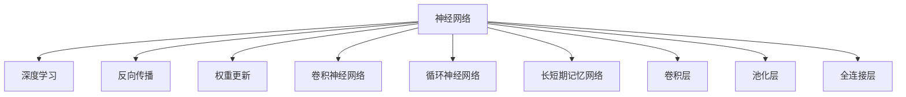

                 

# 神经网络：探索未知的领域

> 关键词：神经网络,深度学习,神经元,反向传播,权重更新,卷积神经网络(CNN),循环神经网络(RNN),长短期记忆网络(LSTM),卷积层,池化层,全连接层

## 1. 背景介绍

### 1.1 问题由来
神经网络(Neural Network)是深度学习(Deep Learning)的核心技术，经过多年的发展，已在计算机视觉、自然语言处理、语音识别、推荐系统等多个领域取得突破性进展。然而，神经网络模型复杂、计算量大，其背后的理论基础仍未完全弄清楚，如何高效地训练和优化神经网络，使其能够更好地适应各种实际应用场景，成为了当前学术界和工业界研究的热点。

### 1.2 问题核心关键点
神经网络研究的核心关键点包括：
- 神经网络的架构设计，如何选择合适的网络结构来应对不同的任务。
- 神经网络的训练优化，如何快速、高效地训练模型，使其性能接近最优。
- 神经网络的泛化能力，如何构建具有良好泛化能力的模型，避免过拟合。
- 神经网络的解释性，如何理解和解释神经网络模型的决策过程。
- 神经网络的可解释性，如何使模型决策过程更加透明，提升可信度。

这些关键点共同构成了神经网络研究的主要方向，推动了深度学习技术的不断进步。

### 1.3 问题研究意义
理解神经网络的原理和优化方法，对于推动深度学习技术的发展，提高人工智能系统的性能，有着重要的意义。神经网络在图像识别、语音识别、自然语言处理等领域的应用，极大地提升了人类对这些复杂问题的处理能力，为智慧城市的构建、自动驾驶、智能家居等新兴领域提供了强有力的技术支持。

## 2. 核心概念与联系

### 2.1 核心概念概述

为更好地理解神经网络的原理和优化方法，本节将介绍几个密切相关的核心概念：

- 神经网络(Neural Network)：由多个神经元组成的层次结构，通过反向传播算法训练得到参数，以实现复杂数据的映射和分类。
- 深度学习(Deep Learning)：基于神经网络，通过多个层次的非线性变换，学习和提取数据的高层次特征，进行复杂的模式识别和决策。
- 反向传播(Backpropagation)：神经网络训练的核心算法，通过链式法则计算误差对各个参数的导数，从而更新模型参数。
- 权重更新(Weight Update)：神经网络参数更新的主要方式，通过反向传播计算导数，使用梯度下降等优化算法更新模型权重。
- 卷积神经网络(CNN)：专门用于图像处理的神经网络，通过卷积和池化等操作提取图像特征。
- 循环神经网络(RNN)：处理序列数据的神经网络，通过循环连接记忆历史信息，适用于自然语言处理、时间序列预测等任务。
- 长短期记忆网络(LSTM)：一种特殊的RNN，通过门控机制实现长距离信息传递，适用于语言模型、机器翻译等任务。
- 卷积层(Convolutional Layer)：CNN中的核心层，通过卷积操作提取局部特征，具有平移不变性。
- 池化层(Pooling Layer)：CNN中的辅助层，通过降采样操作减少特征维度，提高计算效率。
- 全连接层(Fully Connected Layer)：通用神经网络中常用的层，通过线性变换连接输入和输出，实现复杂的非线性映射。

这些核心概念之间的逻辑关系可以通过以下Mermaid流程图来展示：



这个流程图展示了几大类神经网络的关联关系：

1. 神经网络是深度学习的基础。
2. 深度学习通过多个层次的非线性变换，学习数据高层次特征。
3. 反向传播是神经网络训练的核心算法。
4. 权重更新是神经网络参数更新的主要方式。
5. CNN用于处理图像，LSTM用于处理序列数据。
6. 卷积层和池化层是CNN的核心组件。
7. 全连接层是通用神经网络的常用组件。

这些概念共同构成了神经网络的理论基础，使得神经网络能够应对各种复杂问题。

## 3. 核心算法原理 & 具体操作步骤
### 3.1 算法原理概述

神经网络的训练过程是通过反向传播算法进行的，其核心思想是：通过将输出误差通过链式法则，逐层回传到网络中，更新每个神经元的权重。

假设神经网络的结构为 $M_{\theta}$，其中 $\theta$ 为神经网络的参数集合，包含所有权重和偏置。给定训练数据集 $D=\{(x_i,y_i)\}_{i=1}^N$，其中 $x_i$ 为输入，$y_i$ 为标签。训练的目标是找到最优参数 $\theta^*$，使得模型输出 $M_{\theta}(x_i)$ 与标签 $y_i$ 差距最小，即最小化均方误差损失：

$$
\theta^* = \mathop{\arg\min}_{\theta} \frac{1}{N}\sum_{i=1}^N (y_i - M_{\theta}(x_i))^2
$$

在训练过程中，首先前向传播计算神经网络输出 $M_{\theta}(x_i)$，然后计算输出误差 $E_i = (y_i - M_{\theta}(x_i))^2$，并通过反向传播计算误差对参数的导数 $\nabla_{\theta}E_i$。使用梯度下降等优化算法，更新参数 $\theta$ 使得误差最小化。

### 3.2 算法步骤详解

神经网络的训练过程可以分为以下几步：

**Step 1: 准备数据集**
- 将训练数据集划分为训练集和验证集，通常以80:20的比例划分。
- 使用数据预处理技术，如归一化、标准化、数据增强等，减少数据偏差，提升模型泛化能力。

**Step 2: 初始化模型参数**
- 随机初始化神经网络参数 $\theta$，通常使用Xavier或He初始化方法，保证参数分布合理。
- 设置学习率 $\eta$ 和优化算法，如梯度下降、Adam、Adagrad等。

**Step 3: 前向传播和损失计算**
- 对训练集中的每个样本 $x_i$，通过前向传播计算神经网络的输出 $M_{\theta}(x_i)$。
- 计算输出误差 $E_i$，并计算损失函数 $\mathcal{L}(\theta)$。

**Step 4: 反向传播和参数更新**
- 使用反向传播算法计算损失函数对每个参数的梯度 $\nabla_{\theta}\mathcal{L}(\theta)$。
- 使用优化算法更新模型参数 $\theta$，使得损失函数 $\mathcal{L}(\theta)$ 最小化。

**Step 5: 验证集评估**
- 使用验证集评估模型性能，避免过拟合。
- 如果模型在验证集上表现不佳，调整学习率或使用正则化技术。

**Step 6: 测试集评估**
- 使用测试集评估模型泛化能力，得到最终的模型性能指标。

### 3.3 算法优缺点

神经网络的训练优化方法具有以下优点：
1. 通过反向传播算法，能够高效地更新模型参数，适应复杂任务。
2. 使用梯度下降等优化算法，可以快速收敛到最优解。
3. 通过正则化技术，如L2正则、Dropout等，避免过拟合。
4. 支持大规模数据训练，能够提升模型性能。

同时，这些方法也存在一些缺点：
1. 模型训练需要大量计算资源，特别是深度神经网络，计算复杂度高。
2. 训练过程容易陷入局部最优解，导致模型性能波动。
3. 神经网络结构复杂，调试和优化难度大。
4. 缺乏可解释性，难以理解模型内部决策机制。

尽管存在这些局限性，神经网络优化方法仍然是当前深度学习应用的核心技术，广泛应用于图像识别、自然语言处理、语音识别等领域，为人类认知智能的发展提供了重要推动力。

### 3.4 算法应用领域

神经网络优化方法在多个领域得到广泛应用，包括：

- 计算机视觉：如图像分类、目标检测、人脸识别等。
- 自然语言处理：如机器翻译、情感分析、问答系统等。
- 语音识别：如语音转文本、语音合成等。
- 推荐系统：如商品推荐、广告推荐等。
- 游戏AI：如AlphaGo、星际争霸等。
- 自动驾驶：如路径规划、障碍物检测等。

这些应用领域展示了神经网络优化方法的强大能力，极大地推动了人工智能技术的发展。

## 4. 数学模型和公式 & 详细讲解  
### 4.1 数学模型构建

神经网络的结构通常由输入层、隐藏层和输出层组成，其中隐藏层包含多个神经元。对于一般的多层神经网络，其数学模型可以表示为：

$$
y_i = f(W^{\text{out}}x_i + b^{\text{out}})
$$

$$
x_i' = f(W^{\text{hidden}}x_i + b^{\text{hidden}})
$$

$$
x_i = f(W^{\text{in}}x_{i-1} + b^{\text{in}})
$$

其中 $y_i$ 为输出层输出，$x_i$ 为输入，$x_i'$ 为隐藏层输出，$W$ 和 $b$ 分别为权重矩阵和偏置向量，$f$ 为激活函数，如ReLU、Sigmoid等。

对于分类任务，通常使用Softmax激活函数，使得输出层输出一个概率分布，即每个类别的概率：

$$
p(y_i | x_i; \theta) = \frac{e^{M_{\theta}(x_i)}}{\sum_{j=1}^K e^{M_{\theta}(x_i)^j}}
$$

其中 $K$ 为类别数，$M_{\theta}(x_i)$ 为输出层线性变换后的特征。

### 4.2 公式推导过程

以二分类任务为例，推导交叉熵损失函数及其梯度计算公式。

假设输出层为线性变换，激活函数为Sigmoid，输出 $y_i = M_{\theta}(x_i)$。则二分类交叉熵损失函数定义为：

$$
\ell(y_i, M_{\theta}(x_i)) = -(y_i\log M_{\theta}(x_i) + (1-y_i)\log(1-M_{\theta}(x_i)))
$$

其梯度计算公式为：

$$
\nabla_{\theta}\ell(y_i, M_{\theta}(x_i)) = (y_i - M_{\theta}(x_i))\frac{dM_{\theta}(x_i)}{dx_i}\frac{dx_i}{d\theta}
$$

其中 $\frac{dM_{\theta}(x_i)}{dx_i}$ 为激活函数导数，$\frac{dx_i}{d\theta}$ 为输出层权重对输入的导数，可以通过链式法则计算。

在得到损失函数的梯度后，即可带入优化算法更新模型参数，完成模型的迭代优化。重复上述过程直至收敛，最终得到适应目标任务的神经网络。

## 5. 项目实践：代码实例和详细解释说明
### 5.1 开发环境搭建

在进行神经网络优化实践前，我们需要准备好开发环境。以下是使用Python进行PyTorch开发的环境配置流程：

1. 安装Anaconda：从官网下载并安装Anaconda，用于创建独立的Python环境。

2. 创建并激活虚拟环境：
```bash
conda create -n pytorch-env python=3.8 
conda activate pytorch-env
```

3. 安装PyTorch：根据CUDA版本，从官网获取对应的安装命令。例如：
```bash
conda install pytorch torchvision torchaudio cudatoolkit=11.1 -c pytorch -c conda-forge
```

4. 安装TensorFlow：
```bash
conda install tensorflow=2.5.0
```

5. 安装PyTorch优化库：
```bash
conda install pytorch-lightning torchvision transformers torchtext
```

完成上述步骤后，即可在`pytorch-env`环境中开始神经网络优化实践。

### 5.2 源代码详细实现

下面我们以图像分类任务为例，给出使用PyTorch对卷积神经网络进行训练和微调的PyTorch代码实现。

首先，定义数据处理函数：

```python
import torch
from torchvision import datasets, transforms

# 数据增强
transform_train = transforms.Compose([
    transforms.RandomCrop(32, padding=4),
    transforms.RandomHorizontalFlip(),
    transforms.ToTensor(),
    transforms.Normalize([0.5, 0.5, 0.5], [0.5, 0.5, 0.5])
])

# 测试集预处理
transform_test = transforms.Compose([
    transforms.ToTensor(),
    transforms.Normalize([0.5, 0.5, 0.5], [0.5, 0.5, 0.5])
])

# 加载CIFAR-10数据集
trainset = datasets.CIFAR10(root='data', train=True, download=True, transform=transform_train)
testset = datasets.CIFAR10(root='data', train=False, download=True, transform=transform_test)

# 数据集批处理
trainloader = torch.utils.data.DataLoader(trainset, batch_size=128, shuffle=True)
testloader = torch.utils.data.DataLoader(testset, batch_size=128, shuffle=False)
```

然后，定义神经网络模型：

```python
import torch.nn as nn
import torch.nn.functional as F

# 定义卷积神经网络
class Net(nn.Module):
    def __init__(self):
        super(Net, self).__init__()
        self.conv1 = nn.Conv2d(3, 32, 3, 1, 1)
        self.conv2 = nn.Conv2d(32, 64, 3, 1, 1)
        self.pool = nn.MaxPool2d(2, 2)
        self.fc1 = nn.Linear(64 * 8 * 8, 120)
        self.fc2 = nn.Linear(120, 84)
        self.fc3 = nn.Linear(84, 10)

    def forward(self, x):
        x = self.pool(F.relu(self.conv1(x)))
        x = self.pool(F.relu(self.conv2(x)))
        x = x.view(-1, 64 * 8 * 8)
        x = F.relu(self.fc1(x))
        x = F.relu(self.fc2(x))
        x = self.fc3(x)
        return x

# 实例化神经网络
net = Net()
```

接着，定义损失函数和优化器：

```python
import torch.optim as optim

# 定义交叉熵损失函数
criterion = nn.CrossEntropyLoss()

# 定义优化器
optimizer = optim.SGD(net.parameters(), lr=0.001, momentum=0.9)
```

最后，执行训练过程：

```python
import torch.optim.lr_scheduler as lr_scheduler

# 定义训练循环
def train(epoch):
    net.train()
    train_loss = 0
    correct = 0
    total = 0
    for batch_idx, (inputs, targets) in enumerate(trainloader):
        optimizer.zero_grad()
        outputs = net(inputs)
        loss = criterion(outputs, targets)
        loss.backward()
        optimizer.step()
        train_loss += loss.item() * inputs.size(0)
        _, predicted = outputs.max(1)
        total += targets.size(0)
        correct += predicted.eq(targets).sum().item()
    train_loss /= len(trainloader.dataset)
    acc = correct / total
    print('Train Epoch: {} \tLoss: {:.6f} \tAcc: {:.6f}'.format(epoch, train_loss, acc))

# 定义验证循环
def test(epoch):
    net.eval()
    test_loss = 0
    correct = 0
    total = 0
    with torch.no_grad():
        for batch_idx, (inputs, targets) in enumerate(testloader):
            outputs = net(inputs)
            loss = criterion(outputs, targets)
            test_loss += loss.item() * inputs.size(0)
            _, predicted = outputs.max(1)
            total += targets.size(0)
            correct += predicted.eq(targets).sum().item()
    test_loss /= len(testloader.dataset)
    acc = correct / total
    print('Test Epoch: {} \tLoss: {:.6f} \tAcc: {:.6f}'.format(epoch, test_loss, acc))

# 定义学习率调整策略
scheduler = lr_scheduler.StepLR(optimizer, step_size=7, gamma=0.7)

# 定义训练过程
for epoch in range(1, 10):
    train(epoch)
    scheduler.step()
    test(epoch)
```

以上就是使用PyTorch对卷积神经网络进行训练和微调的完整代码实现。可以看到，得益于PyTorch的强大封装，我们可以用相对简洁的代码完成神经网络的训练过程。

### 5.3 代码解读与分析

让我们再详细解读一下关键代码的实现细节：

**Net类**：
- `__init__`方法：定义神经网络的结构，包含卷积层、池化层、全连接层等组件。
- `forward`方法：定义前向传播过程，通过激活函数和线性变换计算输出。

**数据处理函数**：
- 使用torchvision库中的数据增强技术，对训练集进行随机裁剪、翻转、标准化等处理。
- 使用torchvision库提供的DataLoader类，将数据集划分为批次，进行批处理和迭代。

**损失函数和优化器**：
- 定义交叉熵损失函数，用于分类任务。
- 定义随机梯度下降优化器，设置学习率和动量等超参数。

**训练过程**：
- 定义训练循环，对每个epoch进行前向传播和反向传播，更新模型参数。
- 定义验证循环，计算模型在验证集上的性能指标，并调整学习率。
- 重复上述过程，直到模型收敛。

可以看到，PyTorch配合神经网络库使得神经网络训练的代码实现变得简洁高效。开发者可以将更多精力放在模型设计和调参上，而不必过多关注底层的实现细节。

当然，工业级的系统实现还需考虑更多因素，如模型保存和部署、超参数搜索、更灵活的优化策略等。但核心的神经网络训练过程基本与此类似。

## 6. 实际应用场景
### 6.1 计算机视觉

神经网络优化方法在计算机视觉领域得到了广泛应用，如图像分类、目标检测、人脸识别等。通过训练卷积神经网络，可以从图像中提取高层次特征，实现复杂的模式识别和决策。

在实际应用中，可以收集大量的标注图像数据，如ImageNet数据集，对其进行预处理、归一化、数据增强等，然后对神经网络进行训练和微调。微调后的模型能够在新的图像数据上进行高精度的分类和检测。

### 6.2 自然语言处理

神经网络优化方法在自然语言处理领域也得到了广泛应用，如机器翻译、情感分析、问答系统等。通过训练循环神经网络和长短期记忆网络，可以实现对自然语言的理解和生成。

在实际应用中，可以收集大量的标注文本数据，如Wikipedia、新闻语料库等，对其进行预处理、分词、归一化等，然后对神经网络进行训练和微调。微调后的模型能够在新的文本数据上进行情感分析、问答等任务。

### 6.3 语音识别

神经网络优化方法在语音识别领域也得到了广泛应用，如语音转文本、语音合成等。通过训练卷积神经网络和循环神经网络，可以实现对语音信号的特征提取和处理。

在实际应用中，可以收集大量的标注语音数据，如LibriSpeech、TIMIT等，对其进行预处理、特征提取、数据增强等，然后对神经网络进行训练和微调。微调后的模型能够在新的语音数据上进行高精度的识别和合成。

### 6.4 未来应用展望

随着神经网络优化技术的不断发展，未来在更多领域都将得到应用，为人类认知智能的发展带来新的突破。

在智慧医疗领域，基于神经网络优化技术的医疗问答、病历分析、药物研发等应用将提升医疗服务的智能化水平，辅助医生诊疗，加速新药开发进程。

在智能教育领域，神经网络优化技术可应用于作业批改、学情分析、知识推荐等方面，因材施教，促进教育公平，提高教学质量。

在智慧城市治理中，神经网络优化模型可应用于城市事件监测、舆情分析、应急指挥等环节，提高城市管理的自动化和智能化水平，构建更安全、高效的未来城市。

此外，在企业生产、社会治理、文娱传媒等众多领域，神经网络优化技术也将不断涌现，为经济社会发展注入新的动力。相信随着技术的日益成熟，神经网络优化方法将成为人工智能技术的重要范式，推动人工智能技术在更广阔的领域落地应用。

## 7. 工具和资源推荐
### 7.1 学习资源推荐

为了帮助开发者系统掌握神经网络优化理论基础和实践技巧，这里推荐一些优质的学习资源：

1. 《深度学习》课程：斯坦福大学李飞飞教授主讲的深度学习课程，系统介绍深度学习的理论基础和实践方法，适合初学者入门。

2. 《神经网络与深度学习》书籍：Michael Nielsen的神经网络与深度学习经典教材，深入浅出地讲解神经网络和深度学习的基本原理和算法。

3. DeepLearning.AI的Coursera课程：Andrew Ng教授的深度学习课程，涵盖深度学习的各个方面，从基础到高级。

4. PyTorch官方文档：PyTorch官方提供的文档，详细介绍了PyTorch的使用方法和API，是快速上手深度学习的必备资源。

5. TensorFlow官方文档：TensorFlow官方提供的文档，涵盖深度学习模型的各个方面，包括模型构建、优化、评估等。

6. Transformers库官方文档：HuggingFace开发的Transformer库的官方文档，详细介绍了Transformer模型的使用方法和API，是深度学习模型开发的重要工具。

通过对这些资源的学习实践，相信你一定能够快速掌握神经网络优化技术的精髓，并用于解决实际的深度学习问题。

### 7.2 开发工具推荐

高效的开发离不开优秀的工具支持。以下是几款用于神经网络优化开发的常用工具：

1. PyTorch：基于Python的开源深度学习框架，灵活动态的计算图，适合快速迭代研究。

2. TensorFlow：由Google主导开发的开源深度学习框架，生产部署方便，适合大规模工程应用。

3. Keras：基于TensorFlow和Theano的高级神经网络API，简单易用，适合快速原型开发。

4. MXNet：由Amazon开发的深度学习框架，支持多种编程语言，具有高效的分布式计算能力。

5. Caffe：由Berkeley开发的深度学习框架，适合图像处理任务，具有高效的卷积计算能力。

6. Theano：由蒙特利尔大学开发的深度学习框架，支持GPU加速，适合高效计算。

合理利用这些工具，可以显著提升神经网络优化任务的开发效率，加快创新迭代的步伐。

### 7.3 相关论文推荐

神经网络优化技术的发展源于学界的持续研究。以下是几篇奠基性的相关论文，推荐阅读：

1. 《多层次感知器》论文：Rumelhart等人提出的多层感知器，奠定了神经网络理论基础。

2. 《卷积神经网络》论文：LeCun等人提出的卷积神经网络，在图像识别领域取得了突破性进展。

3. 《长短期记忆网络》论文：Hochreiter等人提出的长短期记忆网络，在自然语言处理领域取得了突破性进展。

4. 《残差网络》论文：He等人提出的残差网络，通过跨层连接解决了深度神经网络训练难的问题。

5. 《迁移学习》论文：Hinton等人提出的迁移学习，通过预训练模型提升新任务的性能。

6. 《自适应优化算法》论文：Loshchilov等人提出的自适应优化算法，如Adam、Adagrad等，提高了神经网络优化效率。

这些论文代表了大规模神经网络优化技术的发展脉络。通过学习这些前沿成果，可以帮助研究者把握学科前进方向，激发更多的创新灵感。

## 8. 总结：未来发展趋势与挑战
### 8.1 总结

本文对神经网络优化原理和优化方法的介绍，展示了其在计算机视觉、自然语言处理、语音识别等领域的应用。通过深入分析神经网络的结构和训练过程，为读者提供了一个全面的神经网络优化框架。

神经网络优化技术的广泛应用，极大地推动了深度学习技术的发展，使得人工智能技术在各个领域取得了突破性进展。从图像分类到语音识别，从自然语言处理到智能推荐，神经网络优化技术在每个领域都展示了其强大的能力。

### 8.2 未来发展趋势

展望未来，神经网络优化技术将呈现以下几个发展趋势：

1. 模型规模持续增大。随着算力成本的下降和数据规模的扩张，神经网络的参数量还将持续增长。超大规模神经网络蕴含的丰富特征，有望支撑更加复杂多变的下游任务。

2. 优化算法更加多样。除了传统的梯度下降算法，未来将涌现更多高效的优化算法，如AdamW、Adafactor等，在保证速度的同时，提升模型的稳定性和收敛性。

3. 自适应学习成为常态。未来的神经网络将具备更强的自适应能力，通过在线学习、增量学习等方法，不断更新模型参数，适应新的数据分布。

4. 多任务学习和跨领域迁移成为可能。神经网络将具备更强的泛化能力，能够同时学习多个任务或跨领域迁移，提升模型的实用性和可靠性。

5. 模型压缩与优化成为重要研究方向。随着模型规模的增大，神经网络训练和推理的计算资源消耗将更加明显，模型压缩与优化技术，如剪枝、量化等，将不断涌现。

6. 神经网络架构设计更加灵活。未来的神经网络将具备更强的架构设计能力，通过模块化、可插拔等设计思路，提升模型开发效率。

以上趋势展示了神经网络优化技术的广阔前景。这些方向的探索发展，必将进一步提升神经网络系统的性能和应用范围，为人工智能技术的发展注入新的动力。

### 8.3 面临的挑战

尽管神经网络优化技术已经取得了瞩目成就，但在迈向更加智能化、普适化应用的过程中，它仍面临着诸多挑战：

1. 数据规模和质量。神经网络优化需要大量的标注数据，数据规模和质量直接影响模型的性能。对于小规模或数据质量不佳的数据集，优化效果可能并不理想。

2. 计算资源消耗。神经网络优化计算资源消耗大，对于大规模模型，计算资源成为瓶颈。如何降低计算成本，提高模型训练和推理效率，成为重要挑战。

3. 模型鲁棒性和泛化能力。神经网络容易过拟合，对数据分布的扰动敏感。如何提高模型的鲁棒性和泛化能力，避免过拟合，是未来的重要研究方向。

4. 模型解释性和可解释性。神经网络模型通常难以解释，难以理解模型的内部决策过程。如何赋予模型更好的解释性，增强可信度，是重要的研究方向。

5. 数据隐私和安全。神经网络优化过程中，数据的隐私和安全问题成为重要关注点。如何在保护数据隐私的前提下，进行模型训练和优化，是未来的重要课题。

6. 模型的伦理和道德约束。神经网络模型可能输出偏见或不公平结果，如何构建伦理和道德约束，确保模型决策符合人类价值观和伦理标准，是未来的重要研究方向。

这些挑战凸显了神经网络优化技术在实际应用中的复杂性，需要在数据、模型、算法、工程等多个维度进行全面优化，才能真正实现神经网络优化技术的广泛应用。

### 8.4 研究展望

面对神经网络优化技术所面临的挑战，未来的研究需要在以下几个方面寻求新的突破：

1. 无监督和半监督学习技术的发展。摆脱对大规模标注数据的依赖，利用无监督和半监督学习技术，最大化利用数据资源，提升模型性能。

2. 自适应学习和在线学习的优化。未来的神经网络将具备更强的自适应能力，通过在线学习、增量学习等方法，不断更新模型参数，适应新的数据分布。

3. 多任务学习和跨领域迁移的研究。研究如何通过多任务学习和跨领域迁移技术，提升神经网络模型的泛化能力，使其能够在更广泛的领域得到应用。

4. 模型压缩与优化的深入研究。研究如何通过剪枝、量化等模型压缩技术，提升神经网络模型的计算效率，降低计算资源消耗。

5. 神经网络架构设计的新思路。研究如何通过模块化、可插拔等设计思路，提升神经网络模型的开发效率和应用范围。

6. 神经网络解释性和可解释性的提升。研究如何通过符号化表示、可解释性模型等方法，赋予神经网络模型更好的解释性，增强可信度。

7. 神经网络伦理和道德约束的研究。研究如何构建伦理和道德约束，确保神经网络模型决策符合人类价值观和伦理标准。

这些研究方向展示了神经网络优化技术的广阔前景，需要学术界和产业界的共同努力，才能推动神经网络优化技术的不断进步，为人类认知智能的发展提供新的动力。

## 9. 附录：常见问题与解答

**Q1：神经网络优化与传统机器学习模型相比，有哪些优点？**

A: 神经网络优化具有以下优点：
1. 能够处理大规模非结构化数据。神经网络可以处理图像、文本、音频等多种类型的数据，而传统机器学习模型通常只能处理结构化数据。
2. 具备强大的特征提取能力。神经网络能够通过多层非线性变换，学习到数据的高级特征，提升模型的性能。
3. 具备自适应学习能力。神经网络能够通过在线学习、增量学习等方法，适应新的数据分布。

**Q2：神经网络优化中的梯度消失和梯度爆炸问题如何解决？**

A: 神经网络优化中的梯度消失和梯度爆炸问题可以通过以下方法解决：
1. 使用ReLU、LeakyReLU等激活函数，避免梯度消失。
2. 使用Batch Normalization等技术，稳定层内方差，减少梯度爆炸风险。
3. 使用残差连接等设计，确保梯度可以顺利传递。
4. 使用梯度裁剪等技术，限制梯度范数，防止梯度爆炸。

**Q3：如何选择合适的激活函数？**

A: 激活函数的选择取决于神经网络的层和任务类型。
1. 对于卷积层，通常使用ReLU或LeakyReLU等激活函数，增强特征提取能力。
2. 对于全连接层，通常使用Sigmoid或Tanh等激活函数，实现二分类或多分类任务。
3. 对于循环神经网络，通常使用Sigmoid或Tanh等激活函数，避免梯度消失问题。
4. 对于长短期记忆网络，通常使用Sigmoid、Tanh或ReLU等激活函数，确保记忆机制的稳定性和效率。

**Q4：神经网络优化中的过拟合问题如何解决？**

A: 神经网络优化中的过拟合问题可以通过以下方法解决：
1. 数据增强：通过扩充训练集，增加数据的多样性，避免模型过拟合。
2. 正则化：通过L2正则、Dropout等技术，限制模型复杂度，避免过拟合。
3. 早停策略：通过定期验证集评估，提前停止训练，避免模型过拟合。
4. 批标准化：通过Batch Normalization等技术，稳定层内方差，减少过拟合风险。

这些方法往往需要根据具体任务和数据特点进行灵活组合。只有在数据、模型、训练、推理等各环节进行全面优化，才能最大限度地发挥神经网络优化技术的威力。

**Q5：神经网络优化中的参数更新策略有哪些？**

A: 神经网络优化中的参数更新策略包括：
1. 随机梯度下降（SGD）：每次更新使用单个样本来计算梯度，简单易实现，但容易陷入局部最优解。
2. 动量优化（Momentum）：通过累积历史梯度，加速收敛，减少震荡。
3. 自适应学习率优化算法：如Adagrad、Adam等，根据梯度变化动态调整学习率，提升收敛速度。
4. 自适应学习率优化算法变体：如AdamW、Adafactor等，在Adam的基础上加入权重衰减和动量调整，进一步提升优化效果。
7. 余弦衰减策略：在训练后期逐渐减小学习率，避免过拟合。

这些策略可以根据具体任务和数据特点进行选择和组合，以实现更好的优化效果。

---

作者：禅与计算机程序设计艺术 / Zen and the Art of Computer Programming

