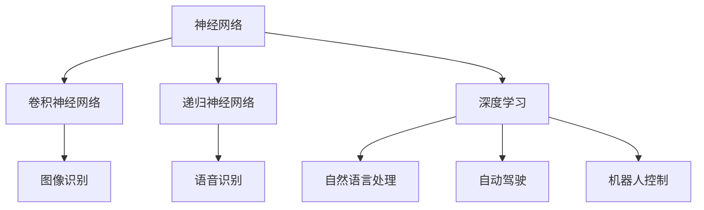

                 

## 1. 背景介绍

### 1.1 问题由来

近年来，随着人工智能技术的迅猛发展，机器学习成为了解决各类实际问题的重要手段。特别是深度学习（Deep Learning），通过构建复杂的神经网络模型，在大数据和大规模计算的支持下，取得了显著的成就。从图像识别、语音识别、自然语言处理到自动驾驶、机器人控制等领域，深度学习技术已经展现出广泛的应用前景。

然而，传统的神经网络模型虽然性能强大，但在模型的设计、训练和部署过程中，仍面临许多挑战。首先，神经网络模型的设计高度依赖于人类经验和领域知识，需要大量手工调整和调试，难以适应复杂多变的任务需求。其次，大规模模型的训练和部署需要极高的计算资源和存储空间，对硬件设施的要求也极为苛刻。再者，深度学习模型的可解释性和透明性不足，难以理解和调试模型的决策过程，这对于医疗、金融等高风险领域尤为重要。

针对这些问题，新一代神经网络模型——基于卷积神经网络（CNN）和递归神经网络（RNN）的深度学习模型应运而生。这些模型通过引入卷积层、循环层等特殊结构，提升了对复杂数据的处理能力，并取得了显著的突破。但随着模型复杂度的增加，其训练和推理效率也面临瓶颈，大模型更是难以部署。

基于此，新一代神经网络——神经网络（Neural Network）应运而生。它不仅继承了深度学习的优点，还引入了新的算法和架构，如集成学习（Ensemble Learning）、自适应算法（Adaptive Algorithms）等，为解决深度学习模型存在的问题提供了新的途径。

### 1.2 问题核心关键点

神经网络是一种基于生物神经元模型的计算模型，通过构建复杂的网络结构，使得输入数据通过一系列非线性变换，最终映射到输出的目标空间。相较于传统的机器学习方法，神经网络模型具有以下几个关键特点：

1. 强大的非线性拟合能力：神经网络通过多层非线性变换，可以逼近任意复杂的非线性函数。
2. 高度的自动化学习：神经网络可以自动学习数据的内在结构，无需手工调整参数，适应复杂任务需求。
3. 高效的特征提取：通过自底向上的信息流动，神经网络可以自动提取数据的高层次特征，减少手工特征工程。
4. 较好的泛化能力：神经网络在泛化能力上通常优于传统的机器学习方法，能够在新数据上表现良好。

这些特点使得神经网络模型在处理复杂数据和任务时表现出色，为机器学习的发展带来了新的范式。

## 2. 核心概念与联系

### 2.1 核心概念概述

为更好地理解神经网络模型的核心概念，本节将介绍几个关键概念，并使用 Mermaid 流程图展现它们之间的联系。

- **神经网络（Neural Network）**：由多个神经元（Neuron）组成的计算模型，通过学习数据的内在结构，自动完成特征提取和分类等任务。
- **卷积神经网络（Convolutional Neural Network, CNN）**：一种专门用于处理图像、视频等二维数据的神经网络模型，通过卷积层和池化层等特殊结构，提升对复杂数据的处理能力。
- **递归神经网络（Recurrent Neural Network, RNN）**：一种专门用于处理序列数据的神经网络模型，通过循环层等结构，提升对序列数据的建模能力。
- **深度学习（Deep Learning）**：一种利用神经网络模型解决复杂问题的机器学习方法，通过多层次的特征提取和分类，实现高效的自动化学习。

这些核心概念之间的逻辑关系可以通过以下 Mermaid 流程图来展示：



这个流程图展示了几类核心概念及其之间的关系：

1. 神经网络是深度学习的基础，通过复杂的网络结构实现自动化学习。
2. 卷积神经网络和递归神经网络是神经网络的两种重要类型，分别针对图像、视频和序列数据。
3. 深度学习则利用神经网络模型解决复杂问题，如图像识别、语音识别、自然语言处理等。

这些概念共同构成了神经网络模型的核心框架，使其在处理复杂数据和任务时表现出色。

## 3. 核心算法原理 & 具体操作步骤
### 3.1 算法原理概述

神经网络模型的核心原理是通过多层非线性变换，将输入数据映射到目标空间，从而实现分类、回归、聚类等任务。其基本结构由输入层、隐藏层和输出层组成。输入层用于接收原始数据，隐藏层通过一系列非线性变换提取数据特征，输出层用于生成最终输出。

神经网络模型的训练过程主要分为两个阶段：前向传播和反向传播。前向传播将输入数据通过网络结构，逐层进行特征提取和变换，最终得到输出结果。反向传播则根据输出结果与真实标签的差异，计算损失函数，并利用梯度下降等优化算法更新网络参数，最小化损失函数。通过多次迭代训练，神经网络模型不断优化网络参数，最终逼近真实函数，实现高效的自动化学习。

### 3.2 算法步骤详解

神经网络模型的训练过程主要包括以下几个关键步骤：

**Step 1: 准备数据集**
- 收集与任务相关的数据集，划分为训练集、验证集和测试集。
- 对数据进行预处理，包括归一化、标准化、数据增强等，提升数据质量和泛化能力。

**Step 2: 初始化模型参数**
- 随机初始化网络各层的权重和偏置参数。
- 通常采用均值为中心、标准差为1的高斯分布，以增加模型初始化多样性，避免梯度消失或爆炸。

**Step 3: 定义损失函数**
- 根据任务类型，选择适合的损失函数，如均方误差（MSE）、交叉熵（Cross-Entropy）等。
- 在多分类任务中，交叉熵损失函数通常用于类别预测，其定义如下：
  $$
  \mathcal{L}(y,\hat{y}) = -\frac{1}{N}\sum_{i=1}^N \sum_{j=1}^C y_{ij} \log \hat{y}_{ij}
  $$
  其中 $y_{ij}$ 表示第 $i$ 个样本在第 $j$ 个类别上的真实标签，$\hat{y}_{ij}$ 表示模型对第 $i$ 个样本在第 $j$ 个类别上的预测概率。

**Step 4: 定义优化器**
- 选择合适的优化器，如随机梯度下降（SGD）、Adam、RMSprop等，并设置相应的超参数，如学习率、批大小等。
- 通过梯度下降等优化算法，不断更新模型参数，最小化损失函数。

**Step 5: 训练模型**
- 将训练集数据分批次输入模型，前向传播计算输出结果和损失函数。
- 反向传播计算梯度，更新模型参数。
- 周期性在验证集上评估模型性能，根据性能指标决定是否触发 Early Stopping。
- 重复上述步骤直到满足预设的迭代轮数或 Early Stopping 条件。

**Step 6: 测试模型**
- 在测试集上评估模型性能，计算准确率、精度、召回率等指标，评估模型泛化能力。

### 3.3 算法优缺点

神经网络模型在处理复杂数据和任务时表现出色，具有以下优点：

1. 强大的非线性拟合能力：通过多层非线性变换，可以逼近任意复杂的非线性函数。
2. 高效的自动化学习：无需手工调整参数，适应复杂任务需求。
3. 较好的泛化能力：在泛化能力上通常优于传统的机器学习方法。

同时，神经网络模型也存在以下缺点：

1. 训练过程复杂：需要大量计算资源和存储空间，难以部署。
2. 可解释性不足：难以理解和调试模型的决策过程。
3. 参数量庞大：随着模型复杂度的增加，参数量呈指数级增长，训练和推理效率降低。
4. 容易出现过拟合：在训练数据不足或噪声较大的情况下，容易出现过拟合现象。

尽管存在这些缺点，但神经网络模型在机器学习中仍然占据重要地位，广泛应用于图像识别、语音识别、自然语言处理等领域。

### 3.4 算法应用领域

神经网络模型在多个领域中都有广泛应用，包括：

- **计算机视觉**：如图像分类、目标检测、图像分割等。通过卷积神经网络（CNN）对图像数据进行特征提取和分类。
- **自然语言处理**：如机器翻译、情感分析、文本分类等。通过递归神经网络（RNN）或长短时记忆网络（LSTM）对文本数据进行建模和分类。
- **语音识别**：如语音识别、语音合成等。通过卷积神经网络和循环神经网络对音频数据进行特征提取和处理。
- **机器人控制**：如运动规划、路径优化等。通过递归神经网络对机器人动作进行建模和优化。
- **自动驾驶**：如车辆行为预测、道路场景理解等。通过卷积神经网络和循环神经网络对传感器数据进行特征提取和处理。

## 4. 数学模型和公式 & 详细讲解  
### 4.1 数学模型构建

神经网络模型的数学模型可以表示为：

$$
y = f(W \cdot x + b)
$$

其中 $x$ 表示输入数据，$y$ 表示输出结果，$W$ 表示权重矩阵，$b$ 表示偏置向量，$f$ 表示激活函数。

在多层次网络中，每一层的输出可以作为下一层的输入，通过多层非线性变换，实现数据的逐层抽象和特征提取。

### 4.2 公式推导过程

神经网络模型的训练过程通过反向传播算法实现，其核心在于最小化损失函数。假设损失函数为 $\mathcal{L}(y,\hat{y})$，模型输出为 $\hat{y}$，真实标签为 $y$，则损失函数对权重矩阵 $W$ 和偏置向量 $b$ 的梯度可以通过链式法则计算如下：

$$
\frac{\partial \mathcal{L}}{\partial W} = \frac{\partial \mathcal{L}}{\partial \hat{y}} \cdot \frac{\partial \hat{y}}{\partial W} = \frac{\partial \mathcal{L}}{\partial y} \cdot \frac{\partial y}{\partial \hat{y}} \cdot \frac{\partial \hat{y}}{\partial W}
$$

其中 $\frac{\partial \mathcal{L}}{\partial y}$ 表示损失函数对输出的梯度，$\frac{\partial y}{\partial \hat{y}}$ 表示输出对预测结果的雅可比矩阵，$\frac{\partial \hat{y}}{\partial W}$ 表示预测结果对权重的梯度。

将梯度代入更新公式，得：

$$
W \leftarrow W - \eta \frac{\partial \mathcal{L}}{\partial W}
$$

其中 $\eta$ 为学习率。通过不断迭代更新，神经网络模型逐渐逼近最小化损失函数，实现自动化的特征提取和分类。

### 4.3 案例分析与讲解

以图像分类任务为例，通过卷积神经网络实现模型训练。假设输入数据 $x$ 为 $3 \times 224 \times 224$ 的彩色图片，输出结果 $y$ 为 $1000$ 个类别的分类概率，激活函数为 ReLU，则卷积神经网络的结构可以表示为：


其中卷积层用于提取图像的局部特征，池化层用于减小特征图的大小和复杂度，全连接层用于将特征映射到类别空间。

通过反向传播算法计算梯度，得：

$$
\frac{\partial \mathcal{L}}{\partial W} = \frac{\partial \mathcal{L}}{\partial y} \cdot \frac{\partial y}{\partial \hat{y}} \cdot \frac{\partial \hat{y}}{\partial W}
$$

其中 $\frac{\partial \mathcal{L}}{\partial y}$ 表示损失函数对输出的梯度，$\frac{\partial y}{\partial \hat{y}}$ 表示输出对预测结果的雅可比矩阵，$\frac{\partial \hat{y}}{\partial W}$ 表示预测结果对权重的梯度。

通过梯度下降等优化算法更新权重和偏置参数，使得模型输出逼近真实标签，实现高效的自动学习和特征提取。

## 5. 项目实践：代码实例和详细解释说明
### 5.1 开发环境搭建

在进行神经网络模型训练之前，我们需要准备好开发环境。以下是使用Python进行TensorFlow开发的环境配置流程：

1. 安装Anaconda：从官网下载并安装Anaconda，用于创建独立的Python环境。

2. 创建并激活虚拟环境：
```bash
conda create -n tf-env python=3.8 
conda activate tf-env
```

3. 安装TensorFlow：根据CUDA版本，从官网获取对应的安装命令。例如：
```bash
conda install tensorflow -c conda-forge
```

4. 安装各类工具包：
```bash
pip install numpy pandas scikit-learn matplotlib tqdm jupyter notebook ipython
```

完成上述步骤后，即可在`tf-env`环境中开始神经网络模型的训练。

### 5.2 源代码详细实现

下面我们以手写数字识别任务为例，给出使用TensorFlow对卷积神经网络进行训练的Python代码实现。

首先，定义数据处理函数：

```python
import tensorflow as tf
from tensorflow.keras.datasets import mnist
from tensorflow.keras.utils import to_categorical

def load_mnist_data():
    (x_train, y_train), (x_test, y_test) = mnist.load_data()
    x_train = x_train.reshape(-1, 28, 28, 1).astype('float32') / 255.0
    x_test = x_test.reshape(-1, 28, 28, 1).astype('float32') / 255.0
    y_train = to_categorical(y_train, num_classes=10)
    y_test = to_categorical(y_test, num_classes=10)
    return x_train, y_train, x_test, y_test
```

然后，定义卷积神经网络模型：

```python
model = tf.keras.Sequential([
    tf.keras.layers.Conv2D(32, (3, 3), activation='relu', input_shape=(28, 28, 1)),
    tf.keras.layers.MaxPooling2D((2, 2)),
    tf.keras.layers.Flatten(),
    tf.keras.layers.Dense(128, activation='relu'),
    tf.keras.layers.Dense(10, activation='softmax')
])
```

接着，定义训练和评估函数：

```python
def train_epoch(model, x_train, y_train, batch_size, optimizer):
    dataloader = tf.data.Dataset.from_tensor_slices((x_train, y_train)).shuffle(10000).batch(batch_size)
    model.compile(optimizer=optimizer, loss='categorical_crossentropy', metrics=['accuracy'])
    model.fit(dataloader, epochs=10, validation_data=(x_test, y_test))

def evaluate(model, x_test, y_test, batch_size):
    dataloader = tf.data.Dataset.from_tensor_slices((x_test, y_test)).batch(batch_size)
    model.evaluate(dataloader, verbose=0)
```

最后，启动训练流程并在测试集上评估：

```python
x_train, y_train, x_test, y_test = load_mnist_data()

optimizer = tf.keras.optimizers.Adam(learning_rate=0.001)
train_epoch(model, x_train, y_train, batch_size=64, optimizer=optimizer)

evaluate(model, x_test, y_test, batch_size=64)
```

以上就是使用TensorFlow对卷积神经网络进行手写数字识别任务训练的完整代码实现。可以看到，得益于TensorFlow的强大封装，我们可以用相对简洁的代码完成卷积神经网络的构建和训练。

### 5.3 代码解读与分析

让我们再详细解读一下关键代码的实现细节：

**load_mnist_data函数**：
- 定义了加载手写数字识别数据集的函数。通过`tf.keras.datasets.mnist.load_data`方法加载数据集，并进行必要的预处理，包括归一化和标签编码。

**train_epoch函数**：
- 定义了训练模型的函数。通过`tf.data.Dataset.from_tensor_slices`方法将数据集转换为TensorFlow的Dataset对象，并进行数据增强、批处理和模型编译等操作。
- 使用`model.fit`方法进行模型训练，设置训练轮数和验证集。

**evaluate函数**：
- 定义了评估模型的函数。通过`tf.data.Dataset.from_tensor_slices`方法将测试集转换为TensorFlow的Dataset对象，并进行模型评估。

**训练流程**：
- 调用`load_mnist_data`函数加载数据集，并进行预处理。
- 定义优化器`Adam`和学习率，设置训练轮数和批大小。
- 调用`train_epoch`函数进行模型训练，在验证集上评估模型性能。
- 调用`evaluate`函数在测试集上评估模型性能。

可以看到，TensorFlow为神经网络模型的开发和训练提供了高度集成的工具和API，使得开发者可以更加方便地实现复杂的神经网络模型。

## 6. 实际应用场景
### 6.1 医疗影像分析

神经网络模型在医疗影像分析领域表现出色，通过深度学习技术，可以实现对CT、MRI等影像数据的自动分析和诊断。以乳腺癌检测为例，通过卷积神经网络对影像数据进行特征提取和分类，可以显著提高诊断准确率，减少医生的工作量，降低误诊风险。

在技术实现上，可以收集大量标注的乳腺癌影像数据，将其分为训练集和测试集。通过卷积神经网络对影像数据进行特征提取和分类，得到乳腺癌的检测结果。在实际应用中，可以将模型集成到影像分析系统中，实时对新的影像数据进行分析和诊断，提升医疗影像的自动化和智能化水平。

### 6.2 金融交易预测

神经网络模型在金融交易预测领域同样具有广泛应用。通过深度学习技术，可以分析历史交易数据，预测股票、期货等金融市场的走势，帮助投资者制定合理的投资策略。

在技术实现上，可以收集大量的金融交易数据，将其分为训练集和测试集。通过卷积神经网络和循环神经网络对交易数据进行特征提取和建模，得到市场走势的预测结果。在实际应用中，可以将模型集成到金融交易预测系统中，实时对市场走势进行预测，辅助投资者做出决策。

### 6.3 自然语言处理

神经网络模型在自然语言处理领域也有广泛应用。以机器翻译为例，通过深度学习技术，可以实现多种语言的自动翻译，提升翻译效率和准确率。

在技术实现上，可以收集大量的双语对照文本数据，将其分为训练集和测试集。通过卷积神经网络和循环神经网络对文本数据进行建模和翻译，得到翻译结果。在实际应用中，可以将模型集成到机器翻译系统中，实现多种语言的自动翻译，提升翻译效率和质量。

### 6.4 未来应用展望

随着神经网络模型的不断发展，未来在以下几个领域将会有更多应用：

1. **自动驾驶**：通过卷积神经网络和循环神经网络，实现对车辆周围环境的自动感知和行为决策。
2. **机器人控制**：通过深度学习技术，实现对机器人动作的自动规划和优化。
3. **自然语言处理**：通过深度学习技术，实现对自然语言语义的理解和生成，提升人机交互的自然性。
4. **医疗影像分析**：通过深度学习技术，实现对医疗影像的自动分析和诊断，提升医疗影像的智能化水平。
5. **金融交易预测**：通过深度学习技术，实现对金融市场的自动分析和预测，辅助投资者制定决策。

## 7. 工具和资源推荐
### 7.1 学习资源推荐

为了帮助开发者系统掌握神经网络模型的理论基础和实践技巧，这里推荐一些优质的学习资源：

1. 《深度学习》系列书籍：由深度学习领域的权威专家撰写，涵盖深度学习的基本概念、算法和应用。
2. Coursera《深度学习专项课程》：由深度学习领域的顶尖学者授课，系统讲解深度学习的理论和实践。
3. TensorFlow官方文档：TensorFlow的官方文档，提供丰富的API参考和示例代码，适合实战学习。
4. PyTorch官方文档：PyTorch的官方文档，提供丰富的API参考和示例代码，适合实战学习。
5. 《Python深度学习》：深度学习领域的经典入门书籍，涵盖深度学习的理论基础和实践技巧。

通过对这些资源的学习实践，相信你一定能够快速掌握神经网络模型的精髓，并用于解决实际的机器学习问题。
### 7.2 开发工具推荐

高效的开发离不开优秀的工具支持。以下是几款用于神经网络模型开发和训练的常用工具：

1. TensorFlow：由Google主导开发的开源深度学习框架，功能强大、生态丰富，适合大规模工程应用。
2. PyTorch：Facebook开发的开源深度学习框架，灵活高效，适合研究型开发。
3. Keras：基于TensorFlow和Theano的高级API，易于上手，适合快速原型开发。
4. MXNet：由亚马逊开发的开源深度学习框架，支持多种编程语言和分布式计算，适合大规模工程应用。
5. Caffe：由伯克利大学开发的深度学习框架，适合图像识别等视觉任务。

合理利用这些工具，可以显著提升神经网络模型的开发效率，加快创新迭代的步伐。

### 7.3 相关论文推荐

神经网络模型的发展得益于学界的持续研究。以下是几篇奠基性的相关论文，推荐阅读：

1. AlexNet：提出卷积神经网络（CNN）结构，在ImageNet图像识别比赛中取得优异成绩，开启深度学习时代。
2. ResNet：提出残差连接（Residual Connection）结构，解决深度神经网络中的梯度消失问题，进一步提升模型的深度和性能。
3. LSTM：提出长短期记忆网络（LSTM）结构，用于处理序列数据，解决传统RNN模型中的梯度消失问题。
4. GANs：提出生成对抗网络（GANs），用于生成新的图像和文本，解决深度学习模型的生成问题。
5. Transformer：提出Transformer结构，实现自注意力机制，提升深度学习模型在序列数据上的建模能力。

这些论文代表了大神经网络模型发展的脉络，通过学习这些前沿成果，可以帮助研究者把握学科前进方向，激发更多的创新灵感。

## 8. 总结：未来发展趋势与挑战

### 8.1 总结

本文对神经网络模型的核心概念和算法原理进行了详细讲解，并通过实际应用场景展示其广泛应用。通过系统梳理，可以看到神经网络模型在处理复杂数据和任务时表现出色，为机器学习的发展带来了新的范式。

神经网络模型具有强大的非线性拟合能力、高效的自动化学习和较好的泛化能力，在图像识别、自然语言处理、金融交易预测等领域展现出广阔的应用前景。但同时，神经网络模型也面临训练复杂、可解释性不足、参数量庞大等挑战，需要进一步优化和改进。

### 8.2 未来发展趋势

展望未来，神经网络模型将呈现以下几个发展趋势：

1. 模型的自动化程度将进一步提升。通过自动化超参数优化、自动化特征工程等技术，使得神经网络模型的设计和训练更加高效和智能化。
2. 模型的可解释性将进一步增强。通过可视化、可解释性学习等方法，使得神经网络模型的决策过程更加透明和可解释。
3. 模型的跨领域应用将更加广泛。通过迁移学习、联邦学习等技术，使得神经网络模型可以应用于更多领域和任务，提升模型的通用性和泛化能力。
4. 模型的计算效率将进一步提高。通过模型压缩、模型并行等技术，使得神经网络模型能够在有限的硬件资源下运行，提升模型的实时性和可扩展性。
5. 模型的安全性和可靠性将进一步加强。通过对抗训练、模型解释等技术，使得神经网络模型在面对恶意攻击和异常数据时具有更好的鲁棒性和安全性。

### 8.3 面临的挑战

尽管神经网络模型在机器学习中已经取得显著成就，但在其发展过程中，仍面临以下挑战：

1. 训练过程复杂。大规模模型的训练和推理需要极高的计算资源和存储空间，难以部署。
2. 可解释性不足。深度学习模型的决策过程难以理解和调试，对医疗、金融等高风险领域尤为重要。
3. 参数量庞大。随着模型复杂度的增加，参数量呈指数级增长，训练和推理效率降低。
4. 容易出现过拟合。在训练数据不足或噪声较大的情况下，容易出现过拟合现象。
5. 鲁棒性不足。面对新的数据或攻击，模型的泛化能力和鲁棒性可能不足，需要进行持续的模型更新和优化。

### 8.4 研究展望

面对神经网络模型面临的挑战，未来的研究需要在以下几个方面寻求新的突破：

1. 探索更高效的模型架构和算法。通过引入更多元化的模型结构，如残差连接、自注意力机制等，提升模型的深度和泛化能力。
2. 引入更多的先验知识。将符号化的先验知识，如知识图谱、逻辑规则等，与神经网络模型进行融合，提升模型的解释性和鲁棒性。
3. 引入多模态信息融合。将视觉、语音、文本等多模态信息进行融合，提升模型的泛化能力和鲁棒性。
4. 引入跨领域迁移学习。通过迁移学习、联邦学习等技术，使得神经网络模型可以应用于更多领域和任务，提升模型的通用性和泛化能力。
5. 引入对抗训练和模型解释。通过对抗训练、模型解释等技术，提升模型的鲁棒性和可解释性。

这些研究方向将引领神经网络模型向更高效、更可靠、更可解释的方向发展，为机器学习的应用和产业化进程提供强有力的技术支撑。

## 9. 附录：常见问题与解答

**Q1：神经网络模型为何需要大量的训练数据？**

A: 神经网络模型需要大量的训练数据，是因为其强大的非线性拟合能力。通过大量的训练数据，模型可以自动学习数据的内在结构，提取数据的高级特征，从而实现高效的自动化学习。但同时，大量的训练数据也带来了存储和计算的挑战，需要借助分布式计算和大规模存储等技术，才能实现高效的训练和推理。

**Q2：神经网络模型为何容易出现过拟合现象？**

A: 神经网络模型容易出现过拟合现象，主要是因为模型的复杂度和参数量较大。在训练数据不足或噪声较大的情况下，模型容易出现过拟合现象，即在训练集上表现良好，但在测试集上表现较差。解决方法包括数据增强、正则化、早停等技术，通过限制模型的复杂度和增强数据的泛化能力，从而提高模型的泛化能力和鲁棒性。

**Q3：神经网络模型为何需要自动化超参数优化？**

A: 神经网络模型需要自动化超参数优化，是因为超参数的选择对模型的性能和泛化能力具有重要影响。通过自动化超参数优化，可以寻找最优的超参数组合，使得模型在训练集和测试集上表现最佳，从而提升模型的性能和泛化能力。常用的自动化超参数优化方法包括贝叶斯优化、随机搜索等技术。

**Q4：神经网络模型为何需要引入对抗训练？**

A: 神经网络模型需要引入对抗训练，是因为对抗训练可以提升模型的鲁棒性和泛化能力。对抗训练通过引入对抗样本，训练模型对异常数据的鲁棒性，从而提升模型的泛化能力和鲁棒性。常用的对抗训练方法包括FGSM、PGD等技术，通过对抗样本的生成和训练，使得模型在面对异常数据和攻击时具有更好的鲁棒性。

**Q5：神经网络模型为何需要引入模型解释技术？**

A: 神经网络模型需要引入模型解释技术，是因为深度学习模型的决策过程难以理解和调试，对医疗、金融等高风险领域尤为重要。通过模型解释技术，可以揭示模型的决策过程和特征提取机制，帮助用户理解模型的行为和输出，提升模型的可信度和可靠性。常用的模型解释技术包括可视化、特征重要性分析等技术。

通过本文的系统梳理，可以看到神经网络模型在机器学习中占据重要地位，具有强大的非线性拟合能力、高效的自动化学习和较好的泛化能力。尽管在训练和部署过程中面临诸多挑战，但通过不断优化和改进，神经网络模型必将在更广泛的应用领域中发挥重要作用。

