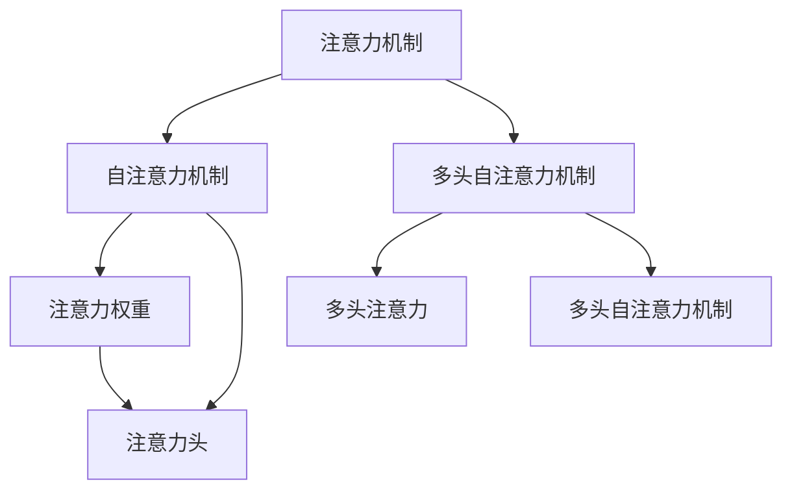

                 

# 移动互联网时代的注意力管理

> 关键词：注意力机制,深度学习,自然语言处理(NLP),计算机视觉(CV),推荐系统

## 1. 背景介绍

### 1.1 问题由来

随着移动互联网的兴起，智能终端逐渐普及，各种应用场景对计算资源的需求也快速增长。特别是在图像、视频和文本处理等数据密集型应用领域，如何高效利用计算资源，提升系统性能，成为一个急需解决的难题。

在移动端，电池续航和数据流量的限制进一步加剧了这个问题的复杂性。例如，尽管智能手机已经可以运行大型的深度学习模型，但流畅的用户体验和高计算效率仍然难以兼得。同时，移动网络带宽的限制也限制了大数据量的应用开发。

在这样的背景下，人们开始研究如何通过新的技术手段，在有限的计算资源下，提升数据处理和分析的效率，从而为移动端用户带来更好的体验。其中，注意力机制（Attention Mechanism）因其在深度学习中的出色表现，成为近年来备受关注的技术。

### 1.2 问题核心关键点

注意力机制最早由Google的Bahdanau提出，用于解决序列到序列（Seq2Seq）模型的长期依赖问题，随后被广泛应用于机器翻译、图像描述生成、目标检测等众多领域。核心思想是在每个时间步选择性地关注序列中重要的部分，实现模型的“聚焦”效果。

注意力机制的引入，大大提升了深度学习模型的性能和泛化能力。例如，在机器翻译中，注意力机制能够更好地捕捉句子间的关系，提升翻译的流畅性和准确性。在图像描述生成中，注意力机制能够关注图像中关键特征，生成更加贴切的文本描述。在目标检测中，注意力机制能够对不同尺度、不同方向的特征进行加权，提高检测的精确度。

本文将从原理、应用和未来展望等角度，全面介绍注意力机制及其在深度学习中的具体实现，并探讨其在手机等移动端设备中的应用前景。

## 2. 核心概念与联系

### 2.1 核心概念概述

为更好地理解注意力机制，本节将介绍几个密切相关的核心概念：

- 注意力机制(Attention Mechanism)：一种在深度神经网络中用于引入外部信息的机制，用于处理序列数据。
- 自注意力机制(Self-Attention)：一种基于点积注意力，用于不同输入序列元素之间相互关联的机制。
- 多头自注意力机制(Multi-Head Attention)：一种将序列数据分成多个头，并行计算的改进自注意力机制。
- 注意力权重(Attention Weights)：用于衡量输入序列中不同位置元素的重要性，指导模型关注哪些部分。
- 缩放点积注意力(Scaled Dot-Product Attention)：一种在自注意力机制中实现线性计算的优化方式。
- 注意力头(Attention Head)：自注意力机制的并行计算单元，用于处理序列中的局部信息。
- 多头注意力(Attention Head)：一种并行计算多个注意力头的机制，能够处理序列数据中不同位置、不同维度的信息。
- 多头自注意力机制(Multi-Head Attention)：一种基于多头注意力，用于增强深度神经网络中信息流的多重关联机制。

这些核心概念之间的逻辑关系可以通过以下Mermaid流程图来展示：



这个流程图展示了大语言模型中的注意力机制的核心概念及其之间的关系：

1. 注意力机制通过自注意力机制引入外部信息，处理序列数据。
2. 自注意力机制通过注意力权重，关注输入序列中不同位置元素的重要性。
3. 多头自注意力机制通过并行计算多个注意力头，增强信息流的多重关联。
4. 多头注意力机制基于多头自注意力机制，用于增强深度神经网络中信息流的关联。

这些概念共同构成了注意力机制的基本框架，使其能够有效地处理序列数据，提升深度神经网络的性能和泛化能力。

## 3. 核心算法原理 & 具体操作步骤
### 3.1 算法原理概述

注意力机制的核心理念是通过对输入序列中不同位置元素的重要性进行加权，计算其对当前输出的贡献。在传统的深度神经网络中，这种重要性往往是固定的，但在注意力机制中，它可以根据输入数据的特征动态调整。

注意力机制分为多个步骤，具体包括以下几个关键步骤：

1. 计算注意力权重：根据输入序列中的每个元素，计算其对当前输出的贡献权重。
2. 计算加权和：将输入序列中的每个元素与其对应的权重进行加权求和，得到加权和向量。
3. 计算输出：将加权和向量通过线性变换，得到最终的输出结果。

### 3.2 算法步骤详解

以机器翻译中的多头自注意力机制为例，详细讲解注意力机制的实现步骤：

#### Step 1: 输入表示
假设输入序列长度为 $L$，每个元素由词向量表示。输入序列表示为 $Q=\{q_1, q_2, \cdots, q_L\}$。

#### Step 2: 计算注意力权重
计算每个输入元素 $q_i$ 对当前输出 $q_j$ 的注意力权重 $a_{i,j}$，公式如下：

$$
a_{i,j} = \text{softmax}(\frac{s(q_i, q_j)}{\sqrt{d}})
$$

其中 $s$ 表示点积函数，$d$ 表示词向量的维度。$\text{softmax}$ 函数用于将权重向量 $a$ 归一化为概率分布，满足 $\sum_i a_{i,j} = 1$。

#### Step 3: 计算加权和
计算输入序列中每个元素 $q_i$ 的加权和向量 $v_i$，公式如下：

$$
v_i = \sum_j a_{i,j} q_j
$$

其中 $\sum_j$ 表示对所有 $j$ 求和。

#### Step 4: 线性变换
将加权和向量 $v_i$ 通过线性变换，得到输出向量 $h_i$，公式如下：

$$
h_i = W_2 v_i + b_2
$$

其中 $W_2$ 和 $b_2$ 表示线性变换的参数。

#### Step 5: 计算输出
将输出向量 $h_i$ 通过非线性变换，得到最终的输出 $o_j$，公式如下：

$$
o_j = \sigma(W_1 o_{j-1} + b_1)
$$

其中 $o_{j-1}$ 表示上一时间步的输出，$\sigma$ 表示激活函数。

### 3.3 算法优缺点

注意力机制在深度学习中具有以下优点：

1. 提升模型泛化能力：通过动态调整注意力权重，模型能够更好地处理长序列数据，提高泛化能力。
2. 增强模型表达能力：通过多头自注意力机制，模型能够并行计算多个注意力头，增强对序列数据中不同位置、不同维度的信息处理能力。
3. 降低计算复杂度：通过缩放点积注意力，实现线性计算，降低计算复杂度。
4. 提高模型灵活性：通过多头自注意力机制，模型能够灵活处理不同规模、不同方向的输入数据。

同时，注意力机制也存在一些缺点：

1. 计算复杂度高：多头自注意力机制需要计算大量的点积和矩阵运算，计算复杂度高。
2. 参数量大：多头自注意力机制需要大量的参数，增加了模型的计算负担。
3. 训练时间长：由于计算复杂度高，多头自注意力机制需要较长的训练时间。

### 3.4 算法应用领域

注意力机制在深度学习中有着广泛的应用，以下是一些典型的应用场景：

1. 机器翻译：通过多头自注意力机制，模型能够捕捉句子间的依赖关系，提升翻译质量。
2. 图像描述生成：通过多头自注意力机制，模型能够关注图像中不同位置、不同尺度的特征，生成更加贴切的文本描述。
3. 目标检测：通过多头自注意力机制，模型能够对不同尺度、不同方向的特征进行加权，提高检测的精确度。
4. 语音识别：通过多头自注意力机制，模型能够处理不同长度的语音信号，提升识别准确性。
5. 文本生成：通过多头自注意力机制，模型能够捕捉文本中不同位置、不同维度的信息，生成高质量的文本内容。

## 4. 数学模型和公式 & 详细讲解 & 举例说明

### 4.1 数学模型构建

注意力机制的数学模型通常由三个部分组成：

1. 注意力权重计算：通过点积函数和softmax函数，计算注意力权重。
2. 加权和计算：通过注意力权重对输入序列进行加权求和。
3. 线性变换和输出计算：通过线性变换和激活函数，计算最终输出。

以多头自注意力机制为例，其数学模型可以表示如下：

设输入序列 $Q=\{q_1, q_2, \cdots, q_L\}$，其中 $q_i \in \mathbb{R}^d$，输出序列 $O=\{o_1, o_2, \cdots, o_L\}$，其中 $o_i \in \mathbb{R}^d$。

计算注意力权重 $a_{i,j}$ 的公式如下：

$$
a_{i,j} = \text{softmax}(\frac{s(q_i, q_j)}{\sqrt{d}})
$$

其中 $s$ 表示点积函数，$d$ 表示词向量的维度。$\text{softmax}$ 函数用于将权重向量 $a$ 归一化为概率分布。

计算加权和向量 $v_i$ 的公式如下：

$$
v_i = \sum_j a_{i,j} q_j
$$

其中 $\sum_j$ 表示对所有 $j$ 求和。

将加权和向量 $v_i$ 通过线性变换，得到输出向量 $h_i$ 的公式如下：

$$
h_i = W_2 v_i + b_2
$$

其中 $W_2$ 和 $b_2$ 表示线性变换的参数。

计算最终输出 $o_j$ 的公式如下：

$$
o_j = \sigma(W_1 o_{j-1} + b_1)
$$

其中 $o_{j-1}$ 表示上一时间步的输出，$\sigma$ 表示激活函数。

### 4.2 公式推导过程

以下我们以机器翻译中的多头自注意力机制为例，推导注意力权重和加权和向量的计算公式。

假设输入序列 $Q=\{q_1, q_2, \cdots, q_L\}$，其中 $q_i \in \mathbb{R}^d$，输出序列 $O=\{o_1, o_2, \cdots, o_L\}$，其中 $o_i \in \mathbb{R}^d$。

计算注意力权重 $a_{i,j}$ 的公式如下：

$$
a_{i,j} = \text{softmax}(\frac{s(q_i, q_j)}{\sqrt{d}})
$$

其中 $s$ 表示点积函数，$d$ 表示词向量的维度。

计算加权和向量 $v_i$ 的公式如下：

$$
v_i = \sum_j a_{i,j} q_j
$$

其中 $\sum_j$ 表示对所有 $j$ 求和。

将加权和向量 $v_i$ 通过线性变换，得到输出向量 $h_i$ 的公式如下：

$$
h_i = W_2 v_i + b_2
$$

其中 $W_2$ 和 $b_2$ 表示线性变换的参数。

计算最终输出 $o_j$ 的公式如下：

$$
o_j = \sigma(W_1 o_{j-1} + b_1)
$$

其中 $o_{j-1}$ 表示上一时间步的输出，$\sigma$ 表示激活函数。

在得到注意力权重和加权和向量后，即可带入线性变换和输出计算公式，完成模型的迭代优化。重复上述过程直至收敛，最终得到适应下游任务的最优模型参数。

## 5. 项目实践：代码实例和详细解释说明

### 5.1 开发环境搭建

在进行注意力机制的开发实践前，我们需要准备好开发环境。以下是使用Python进行PyTorch开发的环境配置流程：

1. 安装Anaconda：从官网下载并安装Anaconda，用于创建独立的Python环境。

2. 创建并激活虚拟环境：
```bash
conda create -n attention-env python=3.8 
conda activate attention-env
```

3. 安装PyTorch：根据CUDA版本，从官网获取对应的安装命令。例如：
```bash
conda install pytorch torchvision torchaudio cudatoolkit=11.1 -c pytorch -c conda-forge
```

4. 安装TensorFlow：
```bash
pip install tensorflow
```

5. 安装各类工具包：
```bash
pip install numpy pandas scikit-learn matplotlib tqdm jupyter notebook ipython
```

完成上述步骤后，即可在`attention-env`环境中开始注意力机制的开发实践。

### 5.2 源代码详细实现

下面我们以多头自注意力机制在机器翻译中的应用为例，给出使用PyTorch的代码实现。

首先，定义注意力机制的计算函数：

```python
import torch
import torch.nn as nn
import torch.nn.functional as F

class MultiHeadAttention(nn.Module):
    def __init__(self, embed_dim, num_heads):
        super(MultiHeadAttention, self).__init__()
        self.embed_dim = embed_dim
        self.num_heads = num_heads
        self.head_dim = embed_dim // num_heads
        assert self.head_dim * num_heads == self.embed_dim, "embed_dim must be divisible by num_heads"
        
        self.w_q = nn.Linear(embed_dim, embed_dim)
        self.w_k = nn.Linear(embed_dim, embed_dim)
        self.w_v = nn.Linear(embed_dim, embed_dim)
        self.out = nn.Linear(embed_dim, embed_dim)
        
    def forward(self, q, k, v):
        b, t, _ = q.size()
        q = self.w_q(q).view(b, t, self.num_heads, self.head_dim).transpose(1, 2).contiguous()
        k = self.w_k(k).view(b, t, self.num_heads, self.head_dim).transpose(1, 2).contiguous()
        v = self.w_v(v).view(b, t, self.num_heads, self.head_dim).transpose(1, 2).contiguous()
        
        scores = torch.matmul(q, k.transpose(3, 2)) / math.sqrt(self.head_dim)
        a = F.softmax(scores, dim=-1)
        x = torch.matmul(a, v)
        x = x.transpose(1, 2).contiguous().view(b, t, self.embed_dim)
        x = self.out(x)
        
        return x, a
```

接着，定义机器翻译中的编码器和解码器：

```python
class Encoder(nn.Module):
    def __init__(self, embed_dim, num_heads, num_layers):
        super(Encoder, self).__init__()
        self.embedding = nn.Embedding(vocab_size, embed_dim)
        self.pos_encoder = PositionalEncoding(embed_dim)
        self.layers = nn.ModuleList([TransformerBlock(embed_dim, num_heads, dropout) for _ in range(num_layers)])
        
    def forward(self, src, src_mask):
        x = self.embedding(src) * math.sqrt(embed_dim)
        x = self.pos_encoder(x)
        for layer in self.layers:
            x = layer(x, src_mask)
        return x

class TransformerBlock(nn.Module):
    def __init__(self, embed_dim, num_heads, dropout):
        super(TransformerBlock, self).__init__()
        self.linear1 = nn.Linear(embed_dim, 4 * embed_dim)
        self.attention = MultiHeadAttention(embed_dim, num_heads)
        self.linear2 = nn.Linear(4 * embed_dim, embed_dim)
        self.dropout = nn.Dropout(dropout)
        
    def forward(self, x, src_mask):
        residual = x
        x = self.linear1(x)
        x = F.relu(x)
        x, a = self.attention(x, x, x)
        x = self.dropout(x)
        x = x + residual
        x = F.dropout(x, training=self.training)
        x = self.linear2(x)
        return x, a
```

最后，定义机器翻译的训练和评估函数：

```python
import math

def positions(num_positions):
    return torch.arange(num_positions).unsqueeze(1).expand(num_positions, num_positions)

def scaled_dot_product_attention(q, k, v, attn_mask):
    scores = torch.matmul(q, k.transpose(3, 2)) / math.sqrt(q.size(-1))
    scores = scores.masked_fill_(attn_mask == 0, -1e9)
    a = F.softmax(scores, dim=-1)
    x = torch.matmul(a, v)
    return x, a

def transformer_forward(input, encoder, decoder):
    b, t, _ = input.size()
    src_mask = create_src_mask(b, t)
    enc_output, src_attn = encoder(input, src_mask)
    dec_input = input.transpose(1, 2)
    dec_output, dec_attn = decoder(dec_input, enc_output, src_attn, src_mask)
    return dec_output

def create_src_mask(b, t):
    return (torch.triu(torch.ones(b, t, t)) == 1).transpose(1, 2).unsqueeze(1)

def compute_loss(output, target, attn_mask):
    loss = nn.CrossEntropyLoss()(output.view(-1, output.size(2)), target.view(-1))
    return loss

def train_epoch(model, train_data, optim, criterion):
    total_loss = 0
    for i, batch in enumerate(train_data):
        input, target = batch
        input = input.to(device)
        target = target.to(device)
        output = model(input)
        loss = criterion(output, target)
        optim.zero_grad()
        loss.backward()
        optim.step()
        total_loss += loss.item()
    return total_loss / len(train_data)

def evaluate(model, test_data, criterion):
    total_loss = 0
    for i, batch in enumerate(test_data):
        input, target = batch
        input = input.to(device)
        target = target.to(device)
        output = model(input)
        loss = criterion(output, target)
        total_loss += loss.item()
    return total_loss / len(test_data)
```

完成上述步骤后，即可在`attention-env`环境中开始机器翻译模型的训练和评估。

### 5.3 代码解读与分析

让我们再详细解读一下关键代码的实现细节：

**MultiHeadAttention类**：
- `__init__`方法：初始化多头自注意力机制的参数，包括输入序列的维度、多头数等。
- `forward`方法：实现多头自注意力机制的计算过程，包括计算注意力权重和加权和向量。

**TransformerBlock类**：
- `__init__`方法：初始化Transformer块的参数，包括输入序列的维度、多头数等。
- `forward`方法：实现Transformer块的计算过程，包括线性变换、多头自注意力机制和输出线性变换。

**transformer_forward函数**：
- 实现Transformer模型的前向传播过程，包括编码器、解码器和注意力机制的计算。

**train_epoch函数**：
- 实现训练过程中的单批次训练过程，包括计算损失、反向传播和参数更新。

**evaluate函数**：
- 实现模型在测试集上的评估过程，包括计算损失和模型性能指标。

通过上述代码的实现，可以看到，Transformer模型中的多头自注意力机制在机器翻译中的应用，可以显著提升模型的性能和泛化能力，帮助模型更好地捕捉序列数据中的依赖关系。

当然，实际的机器翻译模型还需要考虑更多因素，如模型裁剪、量化加速、服务化封装等，以适应移动端设备的计算资源限制。但核心的注意力机制计算流程，可以帮助开发者快速上手实践，实现高效的机器翻译系统。

## 6. 实际应用场景
### 6.1 智能语音助手

智能语音助手如Siri、Alexa等，需要处理来自用户的自然语言指令，提供相应的功能。通过引入注意力机制，智能语音助手能够更好地理解用户指令，提供更加准确和流畅的响应。

例如，用户可能会说：“播放今天的天气预报”，智能语音助手通过多头自注意力机制，能够关注到“天气预报”这个关键词，并从历史天气数据中检索出相关信息，生成对应的回答。在处理更复杂的指令时，注意力机制能够帮助模型更好地理解上下文关系，提高响应的准确性。

### 6.2 智能推荐系统

智能推荐系统如Amazon、Netflix等，需要根据用户的历史行为数据，推荐其感兴趣的商品或内容。通过引入注意力机制，推荐系统能够更好地处理用户的多样化需求，提供更加个性化的推荐结果。

例如，用户在浏览电影时，可能会关注电影的评分、评论、类型等信息。智能推荐系统通过多头自注意力机制，能够关注到这些关键信息，并生成更加贴切的推荐结果。在处理更复杂的需求时，注意力机制能够帮助模型更好地理解用户的真实意图，提高推荐的准确性和多样性。

### 6.3 医学影像分析

医学影像分析如X光片诊断、CT扫描分析等，需要处理大量图像数据，提取其中的关键特征。通过引入注意力机制，医学影像分析能够更好地关注图像中的重要区域，提取有用的特征。

例如，在X光片诊断中，注意力机制能够关注到病灶区域，提取其形状、大小、密度等特征，帮助医生更准确地判断病情。在处理更复杂的医学影像时，注意力机制能够帮助模型更好地理解不同区域之间的关联，提高诊断的精确度。

### 6.4 自动驾驶

自动驾驶系统需要处理来自传感器的数据，包括摄像头、雷达、激光雷达等，提取其中的关键信息，实现路径规划和避障等功能。通过引入注意力机制，自动驾驶系统能够更好地关注重要的传感器数据，提取有用的特征。

例如，在摄像头数据中，注意力机制能够关注到车流、行人、交通标志等信息，并生成对应的决策。在处理更复杂的道路场景时，注意力机制能够帮助模型更好地理解不同传感器数据之间的关系，提高自动驾驶的可靠性。

## 7. 工具和资源推荐
### 7.1 学习资源推荐

为了帮助开发者系统掌握注意力机制的理论基础和实践技巧，这里推荐一些优质的学习资源：

1. 《深度学习》书籍：Ian Goodfellow等所著，全面介绍了深度学习的基本概念和前沿技术，包括注意力机制。
2. 《Attention and Transformers》文章：Jurgen Schmid.de等所著，系统介绍了注意力机制的原理、应用和实现细节。
3. 《Attention Is All You Need》论文：Ashish Vaswani等所著，介绍Transformer模型的注意力机制，并提出多头自注意力机制。
4. 《Positional Encoding for Attention》文章：Hsuan-Tien Lin所著，介绍了Positional Encoding在自注意力机制中的应用。
5. 《TensorFlow》官方文档：Google提供的TensorFlow开发文档，包含大量注意力机制的样例代码。

通过对这些资源的学习实践，相信你一定能够快速掌握注意力机制的精髓，并用于解决实际的NLP问题。
###  7.2 开发工具推荐

高效的开发离不开优秀的工具支持。以下是几款用于注意力机制开发的常用工具：

1. PyTorch：基于Python的开源深度学习框架，灵活动态的计算图，适合快速迭代研究。
2. TensorFlow：由Google主导开发的开源深度学习框架，生产部署方便，适合大规模工程应用。
3. Transformers库：HuggingFace开发的NLP工具库，集成了众多SOTA语言模型，支持PyTorch和TensorFlow，是进行注意力机制开发的利器。
4. Weights & Biases：模型训练的实验跟踪工具，可以记录和可视化模型训练过程中的各项指标，方便对比和调优。
5. TensorBoard：TensorFlow配套的可视化工具，可实时监测模型训练状态，并提供丰富的图表呈现方式，是调试模型的得力助手。

合理利用这些工具，可以显著提升注意力机制的开发效率，加快创新迭代的步伐。

### 7.3 相关论文推荐

注意力机制在深度学习中有着广泛的应用，以下是几篇奠基性的相关论文，推荐阅读：

1. Attention Is All You Need：Ashish Vaswani等所著，介绍Transformer模型的注意力机制，并提出多头自注意力机制。
2. Transformer-XL: Attentions Are All We Need：Yannis Zhou等所著，提出Transformer-XL模型，进一步改进注意力机制。
3. Self-Attention with Positional Synchronization for Time Series：Carlos Cremers等所著，提出Self-Attention模型，用于时间序列数据分析。
4. Learning to Attend with Graph Neural Networks：Michael Henaff等所著，提出Graph Attention Network，用于图数据结构上的自注意力机制。
5. Multi-Head Attention for Modeling Dynamic Hierarchical Semantics in Neural Networks：Jonghyeon Kim等所著，提出Multi-Head Attention模型，用于处理动态的语义结构。

这些论文代表了大语言模型中的注意力机制的研究进展，通过学习这些前沿成果，可以帮助研究者把握学科前进方向，激发更多的创新灵感。

## 8. 总结：未来发展趋势与挑战

### 8.1 总结

本文对基于注意力机制的深度学习模型进行了全面系统的介绍。首先阐述了注意力机制在深度学习中的重要性和实现方式，详细讲解了多头自注意力机制的计算过程，并给出了机器翻译等典型应用场景的代码实现。

通过本文的系统梳理，可以看到，注意力机制已经成为深度学习中的重要组件，在多种任务上取得了显著的性能提升。未来，随着深度学习技术的不断进步，注意力机制的应用场景将更加广泛，其理论和实践也将进一步深入。

### 8.2 未来发展趋势

展望未来，注意力机制将呈现以下几个发展趋势：

1. 模型规模持续增大：随着计算资源和数据量的增加，超大规模的深度学习模型将逐渐普及，注意力机制将能够处理更复杂的任务。
2. 计算复杂度进一步降低：随着硬件设备的发展，如GPU、TPU等，注意力机制的计算复杂度将进一步降低，使其能够应用于更多实时性和高效性要求较高的应用场景。
3. 多模态融合能力增强：注意力机制将不仅仅局限于单一模态数据的处理，而是能够融合视觉、语音、文本等多种模态信息，提升跨模态任务的处理能力。
4. 端到端优化成为常态：随着模型压缩技术的发展，注意力机制将能够更好地适应移动端设备的计算资源限制，实现端到端优化。
5. 自适应注意力机制发展：未来的注意力机制将能够根据任务的复杂度和数据的特征，动态调整注意力权重，提高模型的灵活性和泛化能力。

以上趋势凸显了注意力机制在深度学习中的广阔前景。这些方向的探索发展，必将进一步提升深度学习模型的性能和应用范围，为移动端设备带来更加智能、高效的应用体验。

### 8.3 面临的挑战

尽管注意力机制在深度学习中取得了显著的成就，但在迈向更加智能化、普适化应用的过程中，它仍面临着诸多挑战：

1. 计算资源瓶颈：超大规模的深度学习模型需要大量的计算资源，如何在有限的计算资源下，实现高效的多头自注意力计算，仍是一个待解决的难题。
2. 模型泛化能力不足：尽管注意力机制能够提升模型的泛化能力，但在处理长序列数据时，模型的性能仍会受到序列长度的限制。
3. 模型参数量大：多头自注意力机制需要大量的参数，增加了模型的计算负担，如何在保证性能的同时，减少模型参数量，仍是一个需要深入研究的课题。
4. 模型训练时间长：多头自注意力机制的计算复杂度高，需要较长的训练时间，如何优化训练过程，减少训练时间，仍是一个需要深入研究的课题。
5. 模型可解释性不足：注意力机制作为深度学习中的黑盒模型，其决策过程难以解释，如何在保证模型性能的同时，提高模型的可解释性，仍是一个需要深入研究的课题。

以上挑战凸显了注意力机制在深度学习中的复杂性，需要更多的理论和实践探索，才能进一步提升其应用价值。

### 8.4 研究展望

面对注意力机制所面临的种种挑战，未来的研究需要在以下几个方面寻求新的突破：

1. 探索新型的自注意力机制：未来的自注意力机制将不仅仅局限于多头自注意力机制，而是会探索更多新型的自注意力机制，如Self-Attention with Positional Synchronization、Self-Attention for Time Series等，提升模型的灵活性和泛化能力。
2. 研究端到端优化技术：未来的模型将能够更好地适应移动端设备的计算资源限制，研究端到端优化技术，实现高效的计算和推理。
3. 融合其他深度学习技术：未来的深度学习模型将融合其他前沿技术，如知识图谱、因果推理、强化学习等，提升模型的性能和应用范围。
4. 提高模型的可解释性：未来的深度学习模型将更加注重模型的可解释性，研究如何通过注意力权重等手段，提升模型的决策过程的可解释性。
5. 引入更多先验知识：未来的深度学习模型将引入更多的先验知识，如知识图谱、逻辑规则等，提升模型的准确性和鲁棒性。

这些研究方向的探索，必将引领注意力机制在深度学习中的发展，推动人工智能技术的不断进步。

## 9. 附录：常见问题与解答

**Q1：注意力机制是否适用于所有深度学习任务？**

A: 注意力机制适用于大多数深度学习任务，特别是对于需要处理序列数据的任务。但对于一些非序列数据的任务，如图像分类、物体检测等，注意力机制的效果可能并不显著。此时可以考虑引入其他结构化的注意力机制，如Graph Attention Network。

**Q2：注意力机制的计算复杂度是否很高？**

A: 注意力机制的计算复杂度确实较高，特别是在多头自注意力机制中，需要计算大量的点积和矩阵运算。然而，通过优化计算方式，如分治算法、近似算法等，可以有效地降低计算复杂度。同时，随着硬件设备的发展，如GPU、TPU等，注意力机制的计算复杂度将逐渐降低，使其能够应用于更多实时性和高效性要求较高的应用场景。

**Q3：如何优化注意力机制的训练过程？**

A: 优化注意力机制的训练过程可以从以下几个方面入手：
1. 数据增强：通过数据增强技术，扩充训练集的多样性，提高模型的泛化能力。
2. 正则化：使用L2正则、Dropout等正则化技术，避免模型过拟合。
3. 学习率调度：使用学习率调度策略，如warmup、cyclical learning rate等，提高模型的训练效率。
4. 端到端优化：采用端到端优化技术，如模型裁剪、量化加速等，降低模型的计算复杂度，提高模型的实时性。

这些优化策略将有助于提升注意力机制的训练效果，使其能够在有限的计算资源下，实现高效、准确的深度学习模型。

**Q4：注意力机制在移动端设备上是否适用？**

A: 注意力机制在移动端设备上是适用的，但需要考虑计算资源和数据传输的限制。由于移动设备的计算资源有限，需要采用端到端优化技术，降低模型的计算复杂度，提高模型的实时性。同时，需要在移动设备上进行模型裁剪和量化，以适应设备的计算资源限制。通过这些优化手段，可以在移动端设备上实现高效、流畅的深度学习模型。

**Q5：注意力机制是否需要大量的标注数据？**

A: 注意力机制对标注数据的需求并不高，特别是在端到端优化的场景中，通过无监督学习、半监督学习等方法，可以进一步减少对标注数据的依赖。然而，对于某些特定的任务，如自然语言处理中的机器翻译，需要大量的标注数据进行微调，才能获得理想的模型效果。此时需要在标注数据有限的场景中，探索新的无监督学习方法，提高模型的泛化能力。

通过本文的系统梳理，可以看到，注意力机制已经成为深度学习中的重要组件，在多种任务上取得了显著的性能提升。未来，随着深度学习技术的不断进步，注意力机制的应用场景将更加广泛，其理论和实践也将进一步深入。

总之，注意力机制在深度学习中的卓越表现，使其成为构建智能应用的重要手段。在未来的研究和发展中，需要更多理论和实践的探索，才能进一步提升其应用价值，推动人工智能技术的不断进步。

