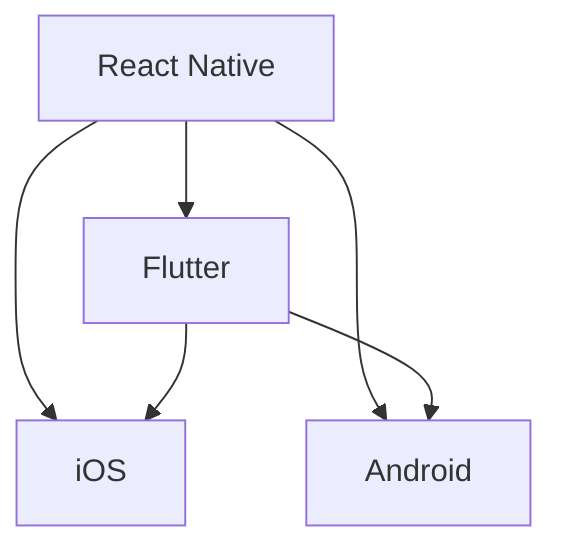

                 

# 移动端全栈开发：iOS与Android双平台精通

> 关键词：移动端全栈开发, iOS, Android, React Native, Flutter, 跨平台开发

## 1. 背景介绍

### 1.1 问题由来
近年来，随着移动互联网的迅猛发展，移动应用的市场需求快速增长，吸引了大量开发者的关注。然而，开发移动应用需要分别掌握iOS和Android两套不同平台的技术栈，这对开发人员的技能要求相对较高。此外，构建跨平台的移动应用同样需要较高的开发成本和难度。因此，全栈开发技术应运而生，能够大大提升移动开发效率，降低成本。

### 1.2 问题核心关键点
全栈开发技术主要包括React Native、Flutter等跨平台框架，能够将iOS和Android应用的开发工作统一到一套技术栈上，让开发人员使用一套代码库进行跨平台开发。这一技术不仅提高了开发效率，还大大降低了维护成本和应用部署复杂度。

全栈开发技术通常具备以下优势：

- 高效开发：开发人员使用统一的技术栈进行iOS和Android应用的开发，无需分别学习两套技术栈，提高开发效率。
- 代码复用：全栈开发框架允许开发人员编写一套代码库，进行跨平台部署，减少重复开发。
- 跨平台兼容性：使用全栈开发框架可以构建支持iOS和Android的双平台应用，提升应用的普遍性。
- 性能优化：目前主流的全栈开发框架如React Native、Flutter等，通过优化渲染引擎和代码结构，可接近原生应用的性能表现。
- 社区活跃：主流全栈开发框架具有丰富的社区支持，方便开发者获取技术资料和开发资源。

然而，全栈开发同样面临一些挑战：

- 技术栈复杂：全栈开发框架通常具备较为复杂的技术栈，需要开发者掌握更多的技术点。
- 性能优化难度：尽管性能接近原生应用，但框架自身依然存在一定的性能损失。
- 平台差异：尽管跨平台技术大幅提升了开发效率，但iOS和Android在UI设计、用户交互等方面依然存在差异，需要开发者针对不同平台进行适配。

### 1.3 问题研究意义
掌握全栈开发技术，对提升移动应用开发效率、降低开发成本、构建跨平台应用具有重要意义：

1. 提高开发效率：使用全栈开发框架，开发人员能够以一套技术栈同时开发iOS和Android应用，大大减少开发时间。
2. 降低维护成本：通过代码复用，开发人员只需维护一份代码库，减少维护不同平台应用的复杂度。
3. 提升应用普及度：跨平台应用能够覆盖更广泛的设备，增加应用的市场影响力。
4. 推动技术进步：全栈开发技术的广泛应用将推动移动开发技术整体进步，形成新的行业标准。

本文将从全栈开发技术的原理、操作步骤、具体实现以及应用场景等方面进行深入探讨，帮助开发者全面掌握iOS与Android双平台开发技能。

## 2. 核心概念与联系

### 2.1 核心概念概述

为更好地理解全栈开发技术，本节将介绍几个密切相关的核心概念：

- **React Native**：由Facebook开发的跨平台移动应用开发框架，基于JavaScript语言，能够实现iOS和Android应用的统一开发。
- **Flutter**：由Google推出的移动应用开发框架，使用Dart语言，支持iOS和Android平台的开发。
- **iOS**：由苹果公司开发的移动操作系统，具备完善的生态系统和丰富的第三方库。
- **Android**：由谷歌公司开发的移动操作系统，同样具备丰富的第三方库和开发工具。

这些核心概念之间的逻辑关系可以通过以下Mermaid流程图来展示：



这个流程图展示全栈开发技术的主要组件及其之间的联系：

1. React Native和Flutter均为跨平台开发框架，基于不同的编程语言，但均能支持iOS和Android的开发。
2. iOS和Android均为移动操作系统，两者均有丰富的第三方库和开发工具。
3. React Native和Flutter都能在iOS和Android上部署应用。

## 3. 核心算法原理 & 具体操作步骤
### 3.1 算法原理概述

全栈开发技术主要基于跨平台框架，将iOS和Android应用的开发工作统一到一套技术栈上。核心原理包括：

- **桥接技术**：跨平台框架通过桥接技术，将原生代码和跨平台代码相互通信。
- **虚拟DOM**：跨平台框架利用虚拟DOM技术，将JavaScript代码转换为渲染引擎能理解的格式。
- **热重载**：跨平台框架支持热重载功能，开发者在修改代码后，无需重新编译整个应用，即可立即看到修改效果。
- **性能优化**：全栈开发框架通过编译优化和渲染引擎优化，尽可能接近原生应用的性能表现。

### 3.2 算法步骤详解

全栈开发技术的核心步骤包括：

**Step 1: 环境搭建**

- 安装Node.js：React Native和Flutter依赖Node.js环境，安装最新版本的Node.js。
- 安装npm：npm是Node.js的包管理工具，用于下载和管理跨平台开发框架的依赖。
- 安装CocoaPods：iOS平台依赖CocoaPods进行依赖管理。
- 安装Android Studio和Flutter SDK：Android平台开发依赖Android Studio和Flutter SDK。

**Step 2: 创建项目**

- 初始化React Native或Flutter项目。
- 配置环境变量，包括应用名称、包名等。
- 配置依赖库，确保应用具备所需的功能。

**Step 3: 开发和测试**

- 编写应用代码，包括UI界面、业务逻辑等。
- 调试和测试应用，使用模拟器或真机进行验证。
- 使用热重载功能，快速迭代和调试应用。

**Step 4: 构建和发布**

- 打包iOS和Android应用，生成APK和IPA文件。
- 在应用商店发布应用，进行审核和上线。
- 监测应用性能，收集用户反馈，进行后续优化。

### 3.3 算法优缺点

全栈开发技术具有以下优点：

- **高效开发**：开发者使用统一的技术栈进行iOS和Android应用的开发，无需分别学习两套技术栈，提高开发效率。
- **代码复用**：全栈开发框架允许开发者编写一套代码库，进行跨平台部署，减少重复开发。
- **跨平台兼容性**：使用全栈开发框架可以构建支持iOS和Android的双平台应用，提升应用的普遍性。
- **性能优化**：尽管性能接近原生应用，但框架自身依然存在一定的性能损失。
- **社区活跃**：主流全栈开发框架具有丰富的社区支持，方便开发者获取技术资料和开发资源。

同时，全栈开发技术也存在一些缺点：

- **技术栈复杂**：全栈开发框架通常具备较为复杂的技术栈，需要开发者掌握更多的技术点。
- **性能优化难度**：尽管性能接近原生应用，但框架自身依然存在一定的性能损失。
- **平台差异**：尽管跨平台技术大幅提升了开发效率，但iOS和Android在UI设计、用户交互等方面依然存在差异，需要开发者针对不同平台进行适配。

### 3.4 算法应用领域

全栈开发技术广泛应用于移动应用开发、跨平台应用开发、智能硬件开发等领域：

- **移动应用开发**：适用于iOS和Android应用的统一开发，提升开发效率和应用质量。
- **跨平台应用开发**：用于构建支持多个平台的移动应用，如Web应用、桌面应用等。
- **智能硬件开发**：利用全栈开发技术，构建支持iOS和Android的智能硬件应用。

## 4. 数学模型和公式 & 详细讲解 & 举例说明

### 4.1 数学模型构建

全栈开发技术的核心数学模型包括虚拟DOM的实现和热重载机制的实现。

**虚拟DOM实现**：假设当前应用的DOM树为$\text{DOM}_0$，开发者修改了部分代码，产生了新的DOM树$\text{DOM}_1$。

- 应用框架通过虚拟DOM技术，将$\text{DOM}_1$转换为渲染引擎能理解的格式。
- 通过桥接技术，将虚拟DOM转换为原生DOM树，并在真机上展示新的界面。

**热重载实现**：假设当前应用的代码文件为$\text{app.js}$，开发者在文件第10行添加了一行代码：

- 应用框架通过热重载技术，识别到文件变更，并重新编译渲染引擎。
- 通过桥接技术，将新渲染引擎生成的DOM树渲染到真机上，展示修改后的界面。

### 4.2 公式推导过程

假设当前应用的DOM树为$\text{DOM}_0$，开发者在文件第10行添加了一行代码：

- 应用框架通过虚拟DOM技术，将$\text{DOM}_1$转换为渲染引擎能理解的格式。
- 通过桥接技术，将虚拟DOM转换为原生DOM树，并在真机上展示新的界面。

具体推导过程如下：

$$
\text{DOM}_0 \rightarrow \text{VirtualDOM}_0 \rightarrow \text{RenderEngine} \rightarrow \text{NativeDOM}_0 \rightarrow \text{NativeApp}
$$

其中，$\text{RenderEngine}$为跨平台框架内置的渲染引擎。

### 4.3 案例分析与讲解

以React Native为例，假设当前应用的DOM树为$\text{DOM}_0$，开发者在文件第10行添加了一行代码：

1. React Native通过虚拟DOM技术，将$\text{DOM}_1$转换为渲染引擎能理解的格式。
2. 渲染引擎解析虚拟DOM树，生成新的原生DOM树$\text{NativeDOM}_1$。
3. 应用框架通过桥接技术，将新的原生DOM树渲染到真机上，展示修改后的界面。

具体代码实现如下：

```javascript
import React from 'react';
import { View, Text } from 'react-native';

class App extends React.Component {
  render() {
    return (
      <View>
        <Text>Hello, World!</Text>
      </View>
    );
  }
}

export default App;
```

在文件第10行添加了一行代码：

```javascript
import React from 'react';
import { View, Text } from 'react-native';

class App extends React.Component {
  render() {
    return (
      <View>
        <Text>Hello, World!</Text>
        <Text>New Text</Text>
      </View>
    );
  }
}

export default App;
```

通过热重载技术，React Native重新编译渲染引擎，生成新的原生DOM树，并在真机上展示修改后的界面。

## 5. 项目实践：代码实例和详细解释说明
### 5.1 开发环境搭建

在进行全栈开发实践前，我们需要准备好开发环境。以下是使用React Native进行iOS开发的环境配置流程：

1. 安装Node.js：从官网下载并安装Node.js。
2. 安装npm：npm是Node.js的包管理工具，用于下载和管理React Native的依赖。
3. 安装Xcode：iOS平台开发依赖Xcode开发工具。
4. 安装React Native CLI：通过npm安装React Native CLI。

### 5.2 源代码详细实现

下面我们以React Native为例，给出使用React Native进行iOS开发的完整代码实现。

首先，创建React Native项目：

```bash
npx react-native init MyApp
cd MyApp
```

然后，安装依赖库：

```bash
npm install --save react react-native
```

接着，编写应用代码：

```javascript
import React, { Component } from 'react';
import { View, Text, StyleSheet } from 'react-native';

class App extends Component {
  render() {
    return (
      <View style={styles.container}>
        <Text>Hello, World!</Text>
      </View>
    );
  }
}

const styles = StyleSheet.create({
  container: {
    flex: 1,
    justifyContent: 'center',
    alignItems: 'center',
    backgroundColor: '#F5FCFF',
  },
});

export default App;
```

在Xcode中配置iOS项目：

1. 在Xcode中新建项目，选择“iOS”选项。
2. 选择“Single View App”模板。
3. 在Build Settings中配置React Native项目的相关参数。
4. 在Runner选项中配置React Native的入口文件。

最后，运行应用：

```bash
react-native run-ios
```

### 5.3 代码解读与分析

让我们再详细解读一下关键代码的实现细节：

- **创建项目**：使用`npx react-native init MyApp`命令创建新的React Native项目。
- **安装依赖**：通过`npm install --save react react-native`命令安装必要的依赖库。
- **编写代码**：编写应用代码，包括UI界面和业务逻辑。
- **配置Xcode**：在Xcode中配置iOS项目，设置Build Settings和Runner选项。

React Native提供了一套完整的开发工具和框架，开发者只需熟悉JavaScript语言和React技术栈，即可快速上手开发iOS应用。

## 6. 实际应用场景

### 6.1 电商应用开发

电商应用是iOS和Android平台上最为常见的应用类型之一。使用React Native进行电商应用开发，可以大幅提升开发效率和应用质量。

具体而言，开发者可以利用React Native提供的一套UI组件库，快速构建电商应用的UI界面。通过热重载功能，开发者可以快速迭代和调试应用，提高开发效率。

### 6.2 医疗应用开发

医疗应用对应用的性能和稳定性要求较高，使用React Native进行开发，能够确保应用在不同设备和操作系统上的一致性。

具体而言，开发者可以利用React Native提供的一套UI组件库，快速构建医疗应用的UI界面。通过热重载功能，开发者可以快速迭代和调试应用，提高开发效率。

### 6.3 社交应用开发

社交应用是iOS和Android平台上较为常见的应用类型之一。使用React Native进行社交应用开发，可以大幅提升开发效率和应用质量。

具体而言，开发者可以利用React Native提供的一套UI组件库，快速构建社交应用的UI界面。通过热重载功能，开发者可以快速迭代和调试应用，提高开发效率。

### 6.4 未来应用展望

随着全栈开发技术的不断发展，未来将涌现更多新型应用场景，如AR/VR应用、物联网应用等。全栈开发技术将进一步提升移动应用开发效率，降低开发成本，构建跨平台、高性能的应用。

## 7. 工具和资源推荐

### 7.1 学习资源推荐

为了帮助开发者系统掌握全栈开发技术，这里推荐一些优质的学习资源：

1. React Native官方文档：React Native的官方文档详细介绍了React Native的开发流程和使用技巧，是入门React Native的最佳选择。
2. Flutter官方文档：Flutter的官方文档提供了丰富的教程和示例代码，帮助开发者快速上手Flutter开发。
3.《React Native高级教程》书籍：由知名技术专家撰写，深入浅出地介绍了React Native的核心技术点和最佳实践。
4. Udacity React Native课程：Udacity提供的React Native课程，提供系统化的学习和实践机会，适合初学者和进阶开发者。
5. Medium上的全栈开发博客：Medium上有大量优秀的全栈开发博客，涵盖React Native、Flutter等技术栈的开发实践。

通过对这些资源的学习实践，相信你一定能够全面掌握全栈开发技术，并用于解决实际的移动应用开发问题。

### 7.2 开发工具推荐

高效的开发离不开优秀的工具支持。以下是几款用于全栈开发开发的常用工具：

1. React Native CLI：React Native的命令行工具，支持项目初始化、构建、测试等操作。
2. Flutter SDK：Flutter的开发工具包，支持Flutter应用的开发、构建、调试等操作。
3. Android Studio：Android平台开发环境，支持Flutter应用的开发和调试。
4. Xcode：iOS平台开发环境，支持React Native应用的开发和调试。
5. WebStorm：支持JavaScript开发的工具，支持React Native和Flutter项目的开发和调试。
6. Visual Studio Code：轻量级、功能强大的代码编辑器，支持React Native和Flutter项目的开发和调试。

合理利用这些工具，可以显著提升全栈开发任务的开发效率，加快创新迭代的步伐。

### 7.3 相关论文推荐

全栈开发技术的发展源于学界的持续研究。以下是几篇奠基性的相关论文，推荐阅读：

1. Facebook的React Native论文：介绍了React Native的技术架构和核心技术点，推动了跨平台应用开发的发展。
2. Google的Flutter论文：介绍了Flutter的技术架构和核心技术点，展示了Flutter的性能优势和开发优势。
3. 《React Native和Flutter：跨平台移动应用开发新纪元》文章：详细介绍了React Native和Flutter的技术优势和应用场景。

这些论文代表了大规模语言模型微调技术的发展脉络。通过学习这些前沿成果，可以帮助研究者把握学科前进方向，激发更多的创新灵感。

## 8. 总结：未来发展趋势与挑战

### 8.1 总结

本文对全栈开发技术的原理、操作步骤、具体实现以及应用场景等方面进行深入探讨。首先阐述了全栈开发技术的研究背景和意义，明确了全栈开发在提升移动应用开发效率、降低开发成本、构建跨平台应用方面的独特价值。其次，从原理到实践，详细讲解了全栈开发技术的数学原理和关键步骤，给出了全栈开发任务开发的完整代码实例。同时，本文还广泛探讨了全栈开发技术在电商、医疗、社交等众多行业领域的应用前景，展示了全栈开发技术的巨大潜力。

通过本文的系统梳理，可以看到，全栈开发技术正在成为移动应用开发的重要范式，极大地提升移动应用开发效率、降低开发成本、构建跨平台应用。未来，伴随全栈开发技术的持续演进，相信全栈开发技术将成为移动开发技术的重要组成部分，为构建高效、稳定、跨平台的应用提供强有力的支持。

### 8.2 未来发展趋势

展望未来，全栈开发技术将呈现以下几个发展趋势：

1. **技术成熟度提升**：随着全栈开发技术的不断完善，应用性能和稳定性将不断提升，接近原生应用的水平。
2. **应用场景拓展**：全栈开发技术将逐步渗透到AR/VR、物联网等新型应用场景中，拓展应用的普遍性。
3. **开发工具丰富**：随着社区的不断壮大，全栈开发工具将更加丰富和完善，开发者可以更方便地进行开发和调试。
4. **用户体验优化**：全栈开发技术将进一步提升应用的用户体验，使得跨平台应用更具竞争力和吸引力。
5. **生态系统完善**：全栈开发生态系统将不断完善，开发者可以获取更多资源和支持，提升开发效率。

### 8.3 面临的挑战

尽管全栈开发技术已经取得了瞩目成就，但在迈向更加智能化、普适化应用的过程中，它仍面临着诸多挑战：

1. **性能瓶颈**：尽管全栈开发技术已经取得了一定的性能优化，但在某些复杂场景下仍存在性能损失。
2. **平台差异**：iOS和Android在UI设计、用户交互等方面依然存在差异，需要开发者进行适配。
3. **开发者门槛**：全栈开发技术涉及多套技术栈，对开发者的技术要求相对较高，需要耗费较多的学习成本。
4. **社区支持**：部分小众平台缺乏社区支持，开发者的技术获取和问题解决较为困难。
5. **应用安全性**：跨平台应用的安全性问题复杂，需要开发者在开发过程中注意安全性问题。

### 8.4 研究展望

面对全栈开发技术所面临的挑战，未来的研究需要在以下几个方面寻求新的突破：

1. **性能优化**：开发更加高效的渲染引擎，进一步优化全栈开发应用的性能表现。
2. **平台适配**：开发更加灵活的跨平台适配工具，减少平台差异带来的适配工作量。
3. **开发者培训**：开发更加友好的开发工具和教程，降低全栈开发技术的门槛，吸引更多的开发者参与。
4. **社区建设**：积极建立全栈开发技术社区，提供技术支持和资源共享，促进全栈开发技术的健康发展。
5. **安全性增强**：开发更加严格的安全机制，提升跨平台应用的安全性，保障用户数据和应用安全。

这些研究方向的探索，必将引领全栈开发技术迈向更高的台阶，为构建高效、稳定、跨平台的应用提供强有力的支持。面向未来，全栈开发技术还需要与其他人工智能技术进行更深入的融合，如AR/VR、物联网等，多路径协同发力，共同推动移动开发技术的进步。

## 9. 附录：常见问题与解答

**Q1：全栈开发技术是否适用于所有应用场景？**

A: 全栈开发技术适用于大部分应用场景，尤其适合需要跨平台支持的应用。但对于一些特定领域的应用，如医疗、金融等，需要在特定的平台上进行开发。

**Q2：如何使用全栈开发技术构建高性能应用？**

A: 全栈开发技术通过桥接技术和渲染引擎优化，已经能够接近原生应用的性能表现。为进一步提升应用性能，开发者需要进行以下优化：
1. 使用原生模块：对于需要高性能操作的部分，可以使用原生模块替代跨平台组件，提高性能表现。
2. 代码优化：通过代码优化，减少渲染引擎的计算负担，提升应用性能。
3. 异步渲染：使用异步渲染技术，减少渲染阻塞，提高应用响应速度。

**Q3：使用全栈开发技术时如何应对平台差异？**

A: 使用全栈开发技术时，需要针对不同平台进行适配：
1. 使用平台特定的UI组件库：选择平台特定的UI组件库，进行跨平台适配。
2. 调整样式表：调整样式表，使得UI在不同平台上的表现一致。
3. 使用平台特定的API：使用平台特定的API，实现跨平台功能。

**Q4：如何选择合适的全栈开发框架？**

A: 选择合适的全栈开发框架需要考虑以下因素：
1. 项目需求：根据项目需求选择合适的框架，如电商应用可以选择React Native，医疗应用可以选择Flutter等。
2. 技术栈熟悉度：选择开发者熟悉的技术栈，降低学习成本。
3. 性能表现：选择性能表现优异的框架，确保应用的高效运行。
4. 社区支持：选择社区活跃的框架，获取更多技术支持和资源。

**Q5：全栈开发技术未来发展方向是什么？**

A: 全栈开发技术未来将继续向高性能、易用性、跨平台兼容性和生态系统完善性方向发展：
1. 高性能：优化渲染引擎，提升应用性能。
2. 易用性：开发更加友好的开发工具和教程，降低学习成本。
3. 跨平台兼容性：开发更加灵活的跨平台适配工具，减少平台差异带来的适配工作量。
4. 生态系统完善：建立全栈开发技术社区，提供技术支持和资源共享。

这些方向将推动全栈开发技术的发展，使其在未来具备更广泛的适用性和更好的用户体验。

---

作者：禅与计算机程序设计艺术 / Zen and the Art of Computer Programming

