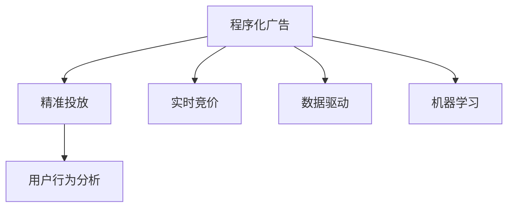

                 

# 程序化广告创业：精准投放的未来

> 关键词：程序化广告, 精准投放, 数据驱动, 实时竞价, 机器学习, 广告优化, 用户行为分析

## 1. 背景介绍

### 1.1 问题由来
随着互联网的普及和数字化营销的兴起，程序化广告市场近年来呈现爆发式增长，成为广告主投放的重要手段。传统广告业务通过代理商、媒体售卖等形式，存在诸多环节成本，而程序化广告通过在线交易平台，实现广告主、媒体、代理商三方的直接对接，极大地提高了广告投放的效率和效果。然而，尽管程序化广告发展迅速，其精准投放的实现仍面临诸多挑战，数据利用效率不足、用户行为分析精度不够等问题亟需解决。

### 1.2 问题核心关键点
程序化广告的核心在于精准投放，即通过大数据分析，实现用户行为和广告内容的最优匹配。其关键在于：
- 数据驱动的决策：利用数据预测用户行为，制定最有效的投放策略。
- 实时竞价机制：根据广告位、用户行为等实时变化调整出价策略，提高投放效率。
- 机器学习技术：通过算法优化广告投放，提升效果。
- 用户行为分析：精准理解用户需求，提升投放精准度。

本文将从以上几个方面，系统介绍程序化广告的创业机会和关键技术，帮助读者全面了解这一领域的潜力和挑战。

## 2. 核心概念与联系

### 2.1 核心概念概述

为更好地理解程序化广告的精准投放，本节将介绍几个密切相关的核心概念：

- 程序化广告(Programmatic Advertising)：通过在线程序化交易平台，实现广告主、媒体、代理商三方直接对接，自动完成广告投放的广告形式。
- 精准投放(Programmatic Advertising Optimization)：利用数据驱动和机器学习技术，实现广告位和用户行为的最优匹配，提高广告效果。
- 实时竞价(Real-Time Bidding, RTB)：根据广告位、用户行为等实时数据调整出价策略，自动完成广告投放的机制。
- 数据驱动(Data-Driven)：以大量数据分析为依据，驱动广告投放决策的过程。
- 机器学习(Deep Learning, DL)：利用深度学习技术，优化广告投放的算法。
- 用户行为分析(User Behavior Analysis)：通过数据挖掘和分析，理解用户需求和行为模式，提升广告精准度。

这些核心概念之间的逻辑关系可以通过以下Mermaid流程图来展示：



这个流程图展示了大语言模型的核心概念及其之间的关系：

1. 程序化广告通过在线平台实现广告投放，是精准投放的基础。
2. 精准投放利用数据和机器学习技术，实现广告位和用户行为的最优匹配。
3. 实时竞价机制根据广告位、用户行为等实时数据调整出价策略。
4. 数据驱动的决策过程，要求大量数据分析作为基础。
5. 机器学习算法用于优化广告投放效果。
6. 用户行为分析进一步提升广告的精准度。

这些概念共同构成了程序化广告的精准投放框架，使得广告主能够更加高效地投放广告，提升广告效果和投放精准度。

## 3. 核心算法原理 & 具体操作步骤
### 3.1 算法原理概述

程序化广告的精准投放，本质上是一个数据驱动和机器学习的优化过程。其核心思想是：通过大数据分析和预测，优化广告投放策略，实现广告位和用户行为的最优匹配。

形式化地，假设广告位集合为 $\mathcal{A}$，用户行为特征集合为 $\mathcal{F}$，广告主的目标是最大化广告点击率 $C$ 和转化率 $R$，即：

$$
\max_{a \in \mathcal{A}, f \in \mathcal{F}} \text{点击率}(C) + \text{转化率}(R)
$$

其中 $C$ 和 $R$ 分别表示广告在广告位 $a$ 和用户行为特征 $f$ 下的点击率和转化率。在实际投放过程中，我们通常使用点击率（CPC）或千次展示费用（CPM）等指标，用于衡量广告效果。

通过优化算法，如梯度下降法，可以最大化广告投放的总体效果，即：

$$
\theta^* = \mathop{\arg\max}_{\theta} \sum_{a \in \mathcal{A}} \sum_{f \in \mathcal{F}} \lambda_{C}C(a,f;\theta) + \lambda_{R}R(a,f;\theta)
$$

其中 $\theta$ 表示广告投放策略的参数，$\lambda_C$ 和 $\lambda_R$ 为点击率和转化率的权重。

### 3.2 算法步骤详解

程序化广告的精准投放一般包括以下几个关键步骤：

**Step 1: 数据准备与清洗**
- 收集广告位和用户行为数据，并进行预处理和清洗。数据可能来源于在线广告平台、社交媒体、网站访问记录等。
- 将原始数据转化为特征向量，用于机器学习模型的输入。

**Step 2: 特征工程**
- 选择和构建与广告投放效果相关的特征。如用户行为特征（点击、浏览、购买等）、广告位特征（位置、大小、展示时长等）、广告创意特征（标题、图像、文本等）。
- 特征工程包括特征选择、特征组合、特征归一化等，目的是提取最具有预测能力的特征。

**Step 3: 选择算法与模型**
- 选择合适的机器学习算法，如线性回归、逻辑回归、决策树、随机森林、深度学习模型等。
- 选择适用于程序化广告的评估指标，如点击率（CPC）、千次展示费用（CPM）、转化率（CR）等。

**Step 4: 训练与评估**
- 在训练集上使用机器学习算法训练模型，根据评估指标调整模型参数。
- 在验证集上评估模型的性能，防止过拟合，选择最优模型进行应用。

**Step 5: 实时投放与优化**
- 将训练好的模型应用到实际投放过程中，实时获取用户行为数据，调整投放策略。
- 根据实时竞价机制，根据广告位和用户行为数据动态调整出价策略。

**Step 6: 持续优化与迭代**
- 根据实际投放效果，不断优化模型和投放策略，如调整广告创意、增加新特征等。
- 定期评估广告投放效果，进行效果提升和策略迭代。

以上是程序化广告精准投放的一般流程。在实际应用中，还需要针对具体任务的特点，对上述各个环节进行优化设计，如改进特征工程策略、探索新算法等，以进一步提升广告投放的精准度和效果。

### 3.3 算法优缺点

程序化广告精准投放的方法具有以下优点：
1. 效率高：通过在线交易平台实现自动投放，减少人力成本和时间成本。
2. 效果优：通过机器学习算法优化投放策略，提升广告点击率和转化率。
3. 灵活性高：可以根据实时数据动态调整投放策略，灵活应对市场变化。
4. 数据驱动：以数据为决策依据，科学合理地评估广告效果。

同时，该方法也存在一定的局限性：
1. 数据依赖性高：精准投放依赖大量高质量数据，数据获取和预处理成本较高。
2. 模型复杂度高：深度学习模型训练复杂度较高，需要强大计算资源。
3. 广告创意限制：广告创意的设计和优化难度较大，对创意团队要求较高。
4. 隐私风险：收集和分析用户数据，可能涉及隐私问题，需要严格遵守法律法规。

尽管存在这些局限性，但就目前而言，程序化广告精准投放仍是广告主投放的主要手段。未来相关研究的重点在于如何进一步降低数据依赖，提高模型的泛化能力，同时兼顾广告创意的多样性和隐私保护等因素。

### 3.4 算法应用领域

程序化广告精准投放已在诸多领域得到广泛应用，包括：

- 在线广告投放：如网页广告、视频广告、移动应用广告等。通过精准投放，提升广告点击率和转化率，降低广告成本。
- 社交媒体广告：如Facebook广告、Instagram广告等。利用用户行为数据，实现个性化投放，提升广告效果。
- 电商广告投放：如淘宝广告、亚马逊广告等。通过精准投放，提升电商平台的转化率，增加销售额。
- 移动广告投放：如微信广告、抖音广告等。利用用户行为数据，实现精准投放，提高用户粘性和转化率。
- 程序化内容投放：如在线视频广告、音频广告等。通过精准投放，提升广告的到达率和效果。

除了上述这些经典应用外，程序化广告精准投放还被创新性地应用于更多场景中，如广告效果优化、广告创意优化、广告投放预算管理等，为广告主提供了更高效、更精准的广告投放手段。

## 4. 数学模型和公式 & 详细讲解  
### 4.1 数学模型构建

本节将使用数学语言对程序化广告精准投放的优化过程进行更加严格的刻画。

假设广告位为 $a$，用户行为特征为 $f$，广告点击率为 $C(a,f)$，转化率为 $R(a,f)$。则程序化广告的优化目标为最大化广告投放效果，即：

$$
\max_{a \in \mathcal{A}} \max_{f \in \mathcal{F}} C(a,f) + R(a,f)
$$

在实际投放过程中，我们通常使用点击率（CPC）或千次展示费用（CPM）等指标，用于衡量广告效果。因此，目标函数可以转化为：

$$
\max_{a \in \mathcal{A}} \max_{f \in \mathcal{F}} C(a,f) + \lambda R(a,f)
$$

其中 $\lambda$ 为转化率的权重。

### 4.2 公式推导过程

以点击率为目标函数为例，假设广告点击率为 $C(a,f) = \text{sigmoid}(\text{dot}(\theta, \text{feature}(a,f)))$，其中 $\text{sigmoid}$ 为激活函数，$\theta$ 为模型参数，$\text{feature}(a,f)$ 为广告位和用户行为特征的组合向量。则目标函数可进一步转化为：

$$
\max_{\theta} \sum_{a \in \mathcal{A}} \sum_{f \in \mathcal{F}} \text{sigmoid}(\text{dot}(\theta, \text{feature}(a,f))) + \lambda R(a,f)
$$

通过梯度下降等优化算法，可以求解上述最优化问题，得到最优参数 $\theta^*$。

在得到模型参数后，即可将其应用于实际广告投放过程，根据广告位和用户行为特征，计算点击率并调整出价策略，实现精准投放。

## 5. 项目实践：代码实例和详细解释说明
### 5.1 开发环境搭建

在进行程序化广告投放的开发前，我们需要准备好开发环境。以下是使用Python进行Pandas开发的环境配置流程：

1. 安装Anaconda：从官网下载并安装Anaconda，用于创建独立的Python环境。

2. 创建并激活虚拟环境：
```bash
conda create -n pytorch-env python=3.8 
conda activate pytorch-env
```

3. 安装PyTorch：根据CUDA版本，从官网获取对应的安装命令。例如：
```bash
conda install pytorch torchvision torchaudio cudatoolkit=11.1 -c pytorch -c conda-forge
```

4. 安装Pandas：
```bash
pip install pandas
```

5. 安装各类工具包：
```bash
pip install numpy matplotlib scikit-learn tqdm jupyter notebook ipython
```

完成上述步骤后，即可在`pytorch-env`环境中开始程序化广告投放的开发。

### 5.2 源代码详细实现

下面我们以程序化广告投放的点击率预测模型为例，给出使用Pandas进行模型训练的PyTorch代码实现。

首先，定义数据处理函数：

```python
import pandas as pd
import numpy as np

def read_data(file_path):
    return pd.read_csv(file_path)

def feature_engineering(df):
    # 特征工程处理，如数据清洗、特征选择、特征组合等
    pass

def train_test_split(df):
    # 数据集划分为训练集和测试集
    pass
```

然后，定义模型和优化器：

```python
import torch
from torch import nn
from torch.optim import Adam

class ClickRateModel(nn.Module):
    def __init__(self, input_size, hidden_size, output_size):
        super(ClickRateModel, self).__init__()
        self.fc1 = nn.Linear(input_size, hidden_size)
        self.fc2 = nn.Linear(hidden_size, output_size)
        self.sigmoid = nn.Sigmoid()

    def forward(self, x):
        x = self.fc1(x)
        x = self.fc2(x)
        return self.sigmoid(x)

model = ClickRateModel(input_size, hidden_size, output_size)
optimizer = Adam(model.parameters(), lr=learning_rate)
```

接着，定义训练和评估函数：

```python
from sklearn.metrics import roc_auc_score

def train(model, train_dataset, optimizer, num_epochs):
    # 在训练集上训练模型
    pass

def evaluate(model, test_dataset):
    # 在测试集上评估模型性能
    pass
```

最后，启动训练流程并在测试集上评估：

```python
train_dataset = train_data
test_dataset = test_data

num_epochs = 10
learning_rate = 0.01

model.train()
optimizer = Adam(model.parameters(), lr=learning_rate)

for epoch in range(num_epochs):
    loss = train(model, train_dataset, optimizer)
    print(f"Epoch {epoch+1}, loss: {loss:.3f}")

model.eval()
evaluate(model, test_dataset)
```

以上就是使用PyTorch对程序化广告投放的点击率预测模型进行训练的完整代码实现。可以看到，得益于Pandas的强大数据处理功能，我们可以很方便地进行数据预处理和模型训练。

### 5.3 代码解读与分析

让我们再详细解读一下关键代码的实现细节：

**read_data函数**：
- 读取广告位和用户行为特征的原始数据，并将其转换为Pandas DataFrame格式。

**feature_engineering函数**：
- 对数据进行预处理，如数据清洗、特征选择、特征组合等，以生成模型所需的特征向量。

**train_test_split函数**：
- 将数据集划分为训练集和测试集，用于模型的训练和评估。

**ClickRateModel类**：
- 定义了用于预测点击率的神经网络模型。
- 其中 `fc1` 和 `fc2` 是全连接层，`sigmoid` 是激活函数。

**train函数**：
- 在训练集上使用梯度下降法训练模型，输出训练过程中各轮次损失值。

**evaluate函数**：
- 在测试集上评估模型的性能，计算点击率预测的ROC-AUC值，用于衡量模型效果。

**训练流程**：
- 在训练集上使用`train`函数进行模型训练，输出各轮次损失值。
- 在测试集上使用`evaluate`函数进行模型评估，输出ROC-AUC值。

可以看到，Pandas的强大数据处理功能和PyTorch的深度学习框架，使得程序化广告投放模型的开发变得非常高效和便捷。开发者可以将更多精力放在模型设计和调参上，而不必过多关注底层的实现细节。

## 6. 实际应用场景
### 6.1 在线广告投放

程序化广告精准投放在在线广告投放中应用广泛，通过数据驱动和机器学习技术，实现广告位和用户行为的最优匹配，提升广告效果。

在实际应用中，广告主可以通过在线交易平台进行广告投放，选择适合的广告位和用户群体，通过实时竞价机制调整出价策略，实现精准投放。广告平台根据用户行为数据和广告位信息，自动生成广告投放策略，实现广告位的最优匹配。广告主只需通过平台界面，选择合适的广告素材和投放策略，即可自动完成广告投放。

### 6.2 社交媒体广告

社交媒体平台如Facebook、Instagram等，通过程序化广告精准投放，实现个性化广告投放，提升广告效果。

社交媒体平台利用用户的社交数据和行为数据，构建广告投放的个性化策略。通过数据驱动的决策，根据用户的兴趣和行为特征，自动生成广告投放策略，实现精准投放。用户可以看到更符合自己兴趣的广告内容，提升广告点击率和转化率。

### 6.3 电商广告投放

电商平台如淘宝、亚马逊等，通过程序化广告精准投放，提升电商平台的转化率，增加销售额。

电商平台利用用户的购买历史、浏览记录等数据，构建广告投放的个性化策略。通过数据驱动的决策，根据用户的兴趣和行为特征，自动生成广告投放策略，实现精准投放。用户可以看到更符合自己需求的广告内容，提升广告点击率和转化率，增加电商平台的用户粘性和销售额。

### 6.4 移动广告投放

移动应用如微信、抖音等，通过程序化广告精准投放，实现个性化广告投放，提升用户粘性和转化率。

移动应用利用用户的移动行为数据和应用使用习惯，构建广告投放的个性化策略。通过数据驱动的决策，根据用户的兴趣和行为特征，自动生成广告投放策略，实现精准投放。用户可以看到更符合自己兴趣的广告内容，提升广告点击率和转化率，增加移动应用的用户粘性和活跃度。

### 6.5 程序化内容投放

在线视频平台如Netflix、YouTube等，通过程序化广告精准投放，实现广告位和用户行为的最优匹配，提升广告效果。

在线视频平台利用用户的视频观看行为数据，构建广告投放的个性化策略。通过数据驱动的决策，根据用户的兴趣和行为特征，自动生成广告投放策略，实现精准投放。用户可以看到更符合自己兴趣的广告内容，提升广告点击率和转化率，增加在线视频平台的广告收入。

## 7. 工具和资源推荐
### 7.1 学习资源推荐

为了帮助开发者系统掌握程序化广告的精准投放的理论基础和实践技巧，这里推荐一些优质的学习资源：

1. 《深度学习与广告推荐系统》系列博文：由广告推荐系统专家撰写，深入浅出地介绍了深度学习在广告推荐系统中的应用，涵盖了程序化广告投放、广告效果优化等多个方面。

2. Coursera《深度学习》课程：由斯坦福大学开设的深度学习课程，系统介绍了深度学习的基本原理和应用，适合想要深入了解程序化广告投放的开发者。

3. 《程序化广告投放指南》书籍：详细介绍了程序化广告投放的原理、实践和优化方法，适合广告主和广告平台的技术开发者。

4. Kaggle程序化广告投放比赛：通过参加Kaggle比赛，深入理解程序化广告投放的实际应用场景和挑战，提升实战能力。

5. ACMsigkdd论文库：收录了大量关于程序化广告投放和广告推荐系统的最新研究论文，适合技术开发者和研究人员进行深入学习。

通过对这些资源的学习实践，相信你一定能够快速掌握程序化广告投放的精髓，并用于解决实际的广告推荐问题。

### 7.2 开发工具推荐

高效的开发离不开优秀的工具支持。以下是几款用于程序化广告投放开发的常用工具：

1. Python：作为程序化广告投放的主要开发语言，Python拥有丰富的库和框架，如Pandas、PyTorch、TensorFlow等，适合数据处理和深度学习模型开发。

2. TensorFlow：由Google主导开发的深度学习框架，支持大规模分布式训练，适合广告主和广告平台进行广告投放优化。

3. PyTorch：基于Python的开源深度学习框架，灵活高效，适合快速迭代研究，广泛用于广告推荐系统和广告投放优化。

4. Hadoop/Spark：大数据处理和分布式计算框架，支持大规模广告数据处理和实时数据流分析，适合广告主和广告平台进行大数据分析。

5. Kibana：开源数据可视化工具，支持实时数据监控和分析，适合广告主和广告平台进行广告效果监控和优化。

合理利用这些工具，可以显著提升程序化广告投放的开发效率，加快创新迭代的步伐。

### 7.3 相关论文推荐

程序化广告投放的发展源于学界的持续研究。以下是几篇奠基性的相关论文，推荐阅读：

1. AdWords: Automated CPC Advertising（AdWords论文）：提出了CPC广告拍卖机制，为程序化广告投放奠定了基础。

2. ClickBench: Click Model Benchmarking for Auction-Based Advertising（ClickBench论文）：介绍了ClickBench平台，用于评估广告投放模型的性能，展示了数据驱动决策的优势。

3. Programmatic Advertising: Models and Algorithms for Competitive Pricing（Programmatic Advertising论文）：总结了程序化广告投放的数学模型和算法，深入分析了广告竞价策略。

4. Predicting and Buying Socially Engaging Content at Scale（Predicting and Buying论文）：展示了Facebook在程序化广告投放中的应用，介绍了其数据驱动决策的实践经验。

5. Deep Learning in Ads: Data-Driven Personalization with Programmatic Advertising（Deep Learning in Ads论文）：介绍了深度学习在程序化广告投放中的应用，展示了广告推荐系统的效果提升。

这些论文代表了大语言模型微调技术的发展脉络。通过学习这些前沿成果，可以帮助研究者把握学科前进方向，激发更多的创新灵感。

## 8. 总结：未来发展趋势与挑战

### 8.1 总结

本文对程序化广告的精准投放方法进行了全面系统的介绍。首先阐述了程序化广告和精准投放的研究背景和意义，明确了数据驱动和机器学习在广告投放决策中的重要价值。其次，从原理到实践，详细讲解了程序化广告投放的数学模型和关键步骤，给出了程序化广告投放的完整代码实例。同时，本文还广泛探讨了程序化广告投放在在线广告、社交媒体、电商、移动应用、视频平台等多个行业领域的应用前景，展示了程序化广告投放的巨大潜力。此外，本文精选了程序化广告投放的学习资源，力求为读者提供全方位的技术指引。

通过本文的系统梳理，可以看到，程序化广告投放技术正在成为广告主投放的主要手段，极大地提高了广告投放的效率和效果。未来，伴随深度学习技术的进一步发展和数据获取成本的降低，程序化广告投放将进一步普及，为广告主带来更多商业价值和创新机会。

### 8.2 未来发展趋势

展望未来，程序化广告精准投放技术将呈现以下几个发展趋势：

1. 数据驱动的自动化决策：利用大数据和机器学习技术，实现广告投放策略的自动生成和优化。

2. 实时竞价的智能化：引入智能竞价算法，实现自动调整出价策略，提高广告投放效率。

3. 广告创意的多样化：利用生成对抗网络（GAN）等技术，自动生成广告创意，实现广告创意的个性化和多样化。

4. 用户行为的多维度分析：引入多模态数据，如图片、视频、语音等，提升用户行为分析的深度和广度。

5. 跨平台数据整合：实现跨平台数据整合，提升广告投放的覆盖面和效果。

6. 智能推荐系统的融合：将程序化广告精准投放与智能推荐系统相结合，提升广告推荐效果。

以上趋势凸显了程序化广告精准投放技术的广阔前景。这些方向的探索发展，必将进一步提升程序化广告投放的精准度和效果，为广告主带来更多的商业价值和创新机会。

### 8.3 面临的挑战

尽管程序化广告精准投放技术已经取得了显著成效，但在迈向更加智能化、普适化应用的过程中，它仍面临诸多挑战：

1. 数据获取和处理难度大：广告投放需要大量的用户行为数据和广告位数据，数据获取和预处理成本较高。

2. 广告创意设计复杂：广告创意的设计和优化难度较大，对创意团队要求较高。

3. 隐私风险：收集和分析用户数据，可能涉及隐私问题，需要严格遵守法律法规。

4. 广告投放效果不稳定：不同广告位和用户行为数据的变化较大，广告投放效果可能不稳定。

5. 技术复杂度高：程序化广告精准投放需要复杂的算法和模型，对技术团队的要求较高。

尽管存在这些挑战，但就目前而言，程序化广告精准投放仍是广告主投放的主要手段。未来相关研究的重点在于如何进一步降低数据依赖，提高广告创意的多样性和泛化能力，同时兼顾用户隐私和广告投放效果稳定性等因素。

### 8.4 未来突破

面对程序化广告精准投放所面临的种种挑战，未来的研究需要在以下几个方面寻求新的突破：

1. 探索无监督和半监督学习范式：摆脱对大规模标注数据的依赖，利用自监督学习、主动学习等无监督和半监督范式，最大限度利用非结构化数据，实现更加灵活高效的广告投放。

2. 研究参数高效和计算高效的投放范式：开发更加参数高效的投放方法，在固定大部分预训练参数的同时，只更新极少量的任务相关参数。同时优化广告投放的计算图，减少前向传播和反向传播的资源消耗，实现更加轻量级、实时性的部署。

3. 融合因果推断和对比学习：通过引入因果推断和对比学习思想，增强广告投放的因果关系，学习更加普适、鲁棒的用户行为表示，从而提升广告投放的泛化性和鲁棒性。

4. 引入更多先验知识：将符号化的先验知识，如知识图谱、逻辑规则等，与神经网络模型进行巧妙融合，引导广告投放过程学习更准确、合理的用户行为表示。同时加强不同模态数据的整合，实现视觉、语音等多模态信息与文本信息的协同建模。

5. 结合因果分析和博弈论：将因果分析方法引入广告投放策略，识别出模型决策的关键特征，增强广告投放策略的因果性和逻辑性。借助博弈论工具刻画人机交互过程，主动探索并规避模型的脆弱点，提高系统稳定性。

6. 纳入伦理道德约束：在广告投放目标中引入伦理导向的评估指标，过滤和惩罚有偏见、有害的输出倾向。同时加强人工干预和审核，建立广告投放行为的监管机制，确保输出符合人类价值观和伦理道德。

这些研究方向的探索，必将引领程序化广告精准投放技术迈向更高的台阶，为广告主带来更多的商业价值和创新机会。面向未来，程序化广告精准投放技术还需要与其他人工智能技术进行更深入的融合，如知识表示、因果推理、强化学习等，多路径协同发力，共同推动程序化广告投放技术的进步。

## 9. 附录：常见问题与解答

**Q1：程序化广告投放是否适用于所有广告主？**

A: 程序化广告投放适用于大多数广告主，特别是那些拥有大量数据和广告位资源的大型广告主。但对于一些规模较小、数据和资源有限的广告主，可能需要根据实际情况，选择适合的广告投放方式。

**Q2：程序化广告投放对广告主的预算和资源要求高吗？**

A: 程序化广告投放需要较大的预算和计算资源，特别是对于大规模投放和实时竞价机制。因此，广告主需要根据自己的预算和计算能力，合理选择投放策略。

**Q3：如何选择合适的广告位？**

A: 广告位的选择需要根据广告主的目标受众和广告效果进行综合考虑。一般来说，选择与广告内容相关性高、用户访问量大的广告位，可以获得更好的广告效果。

**Q4：程序化广告投放的个性化推荐是如何实现的？**

A: 程序化广告投放的个性化推荐，通常利用用户的兴趣和行为数据，通过机器学习算法，自动生成个性化广告推荐。广告平台根据用户的行为特征和兴趣偏好，自动调整广告投放策略，实现精准投放。

**Q5：程序化广告投放的优势有哪些？**

A: 程序化广告投放的优势包括：

1. 效率高：通过在线交易平台实现自动投放，减少人力成本和时间成本。
2. 效果优：利用数据驱动和机器学习技术，提升广告点击率和转化率。
3. 灵活性高：根据实时数据动态调整出价策略，灵活应对市场变化。
4. 数据驱动：以大量数据分析为依据，科学合理地评估广告效果。

这些优势使得程序化广告投放成为广告主投放的主要手段，能够大幅提高广告投放的效率和效果。

---

作者：禅与计算机程序设计艺术 / Zen and the Art of Computer Programming

