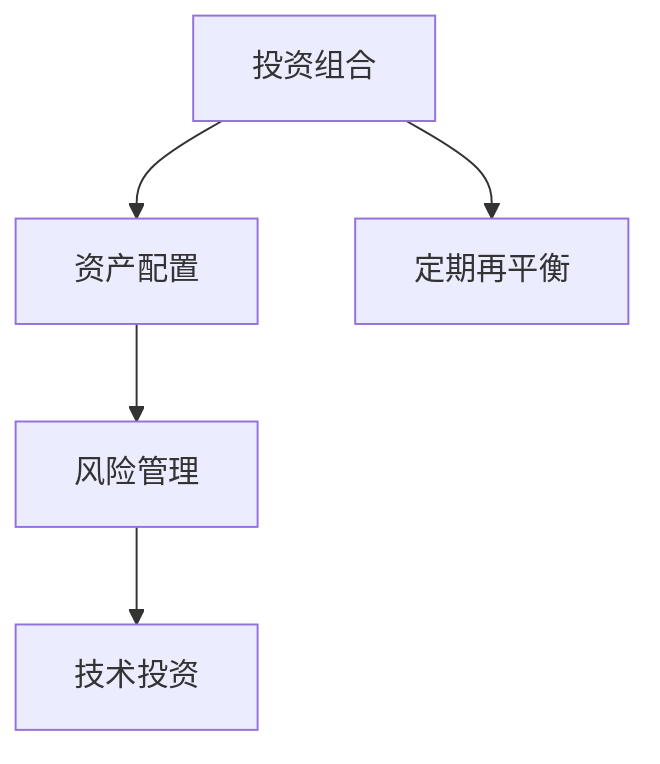

                 

# 程序员如何建立多元投资组合

> 关键词：多元投资组合, 风险管理, 资产配置, 技术股票, 软件基金, 投资策略

## 1. 背景介绍

### 1.1 问题由来
程序员作为高收入群体，理应具备一定的投资意识和理财能力，但许多程序员由于工作性质，往往对股票、基金、房地产等金融投资产品的了解不足，同时也缺乏时间和精力进行深入研究。

同时，随着科技行业的高速发展，不少程序员投资于技术公司的股票和基金，但由于自身知识和经验的局限，可能导致投资决策失误，进而带来巨大的风险和损失。因此，如何构建一个既符合程序员特点又具备良好风险管理的多元投资组合，是一个值得深入探讨的问题。

## 1.2 问题核心关键点
构建多元投资组合的核心在于：

- 分散风险：通过投资不同类型的资产，降低单一资产波动带来的影响。
- 资产配置：根据自身风险承受能力和投资目标，合理分配资产比例。
- 定期再平衡：定期重新评估资产表现，调整投资组合以保持最佳状态。
- 长期持有：避免频繁交易，追求长期稳健回报。
- 技术投资：关注科技行业发展趋势，合理配置科技股票和基金。

本文将从以上几个核心点出发，全面系统地介绍如何构建一个适合程序员的多元投资组合。

## 2. 核心概念与联系

### 2.1 核心概念概述

为更好地理解构建多元投资组合的流程，本节将介绍几个密切相关的核心概念：

- **投资组合(Portfolio)**：由不同类型的资产（如股票、债券、基金等）组成的投资组合，可以分散单一资产的风险。
- **资产配置(Asset Allocation)**：在投资组合中分配资产的比例，以平衡风险和回报。
- **风险管理(Risk Management)**：通过投资组合分散、保险、对冲等方式，降低投资风险。
- **技术投资(Tech Investment)**：聚焦于科技公司的股票和基金，投资于新兴技术和创新领域。
- **定期再平衡(Rebalance)**：定期重新调整投资组合，保持资产分配比例符合设定的目标。

这些概念之间存在逻辑关系，可通过以下Mermaid流程图来展示：



这个流程图展示了几大核心概念之间的关系：

1. 投资组合是资产配置的结果。
2. 资产配置需要考虑风险管理。
3. 技术投资是资产配置的一个分支。
4. 定期再平衡是投资组合动态调整的关键步骤。

## 3. 核心算法原理 & 具体操作步骤
### 3.1 算法原理概述

构建多元投资组合的基本原理是“不要把鸡蛋放在一个篮子里”。即通过分散投资，降低单一资产的波动风险，同时选择性地配置科技领域，以期获取更高的回报。

具体步骤如下：

1. **确定投资目标**：明确投资目的（如退休、购房、子女教育等），并确定期望的回报率和风险承受能力。
2. **分配资产类别**：根据投资目标和风险偏好，分配不同资产类别的比例。
3. **选择具体资产**：在每个资产类别中选择具体的投资标的，如股票、基金、债券等。
4. **定期再平衡**：定期重新评估资产表现，根据市场变化调整资产配置。
5. **持续监控和调整**：持续监控投资组合表现，适时进行策略调整。

### 3.2 算法步骤详解

#### 3.2.1 确定投资目标

投资目标的设定是构建投资组合的第一步。一般来说，投资目标可以分为以下几种：

- **短期目标**：如1-3年内的资金需求，如购房、购车、旅游等。
- **中期目标**：如3-10年内的资金需求，如子女教育、结婚等。
- **长期目标**：如10年及以上的资金需求，如退休等。

投资者需要根据自身情况，确定不同目标所需资金的金额和预计回报率。例如，退休目标可能需要30年的资金积累，期望年回报率在6%左右。

#### 3.2.2 分配资产类别

资产类别的选择和分配是构建投资组合的核心。一般来说，资产类别可以分为以下几类：

- **股票**：包括国内外知名科技公司股票、指数基金、行业基金等。
- **债券**：包括国债、企业债、高收益债券等固定收益类产品。
- **基金**：包括混合型基金、指数型基金、科技主题基金等。
- **房地产**：包括商业地产、住宅地产等。
- **黄金/贵金属**：作为避险资产，调节投资组合风险。
- **现金/货币市场**：保持一定流动性的现金资产。

资产类别的分配需要根据风险偏好和投资目标进行。例如，风险承受能力较低的投资者可以倾向于更多配置债券和基金，而风险承受能力较高的投资者可以更多配置股票和房地产。

#### 3.2.3 选择具体资产

在选择具体资产时，需要考虑以下几个因素：

- **投资标的的历史表现**：选择过往表现稳定的资产。
- **资产的相关性**：选择相关性低的资产，分散风险。
- **管理费用**：选择费用较低的基金和ETF。
- **市场流动性**：选择流动性较好的资产。

以科技股票为例，可以选择如苹果、谷歌、亚马逊等知名科技公司的股票，或者相关行业基金和ETF，如纳斯达克科技指数基金、科技行业ETF等。

#### 3.2.4 定期再平衡

定期再平衡是保持投资组合长期表现的重要步骤。再平衡的频率和方式可以根据个人需求和市场波动调整。

再平衡的步骤如下：

1. **评估资产表现**：定期评估各个资产的表现，比较实际分配比例和目标比例。
2. **调整分配比例**：根据评估结果，调整各个资产的分配比例。
3. **执行调整**：在市场允许的范围内，执行资产买卖操作，调整投资组合。

例如，假设某个投资组合中股票占50%，债券占30%，基金占20%。如果近期股票表现较好，可能占到55%，债券占25%，基金占20%。此时，需要卖出部分股票，买入债券和基金，重新调整至50%股票、30%债券、20%基金。

#### 3.2.5 持续监控和调整

持续监控和调整是保持投资组合长期稳健的必要步骤。投资者需要定期检查投资组合的表现，根据市场变化和自身情况进行策略调整。

监控和调整的步骤如下：

1. **定期检查表现**：每月或每季度检查投资组合的表现，比较实际回报率和目标回报率。
2. **调整投资策略**：根据市场走势和自身情况，适时调整投资策略。
3. **控制风险**：及时发现并控制投资组合中的风险点，避免损失扩大。

例如，如果科技股票表现不佳，可以考虑减少科技股票的比例，增加债券和黄金的比例，以降低组合风险。

### 3.3 算法优缺点

构建多元投资组合的主要优点包括：

1. **分散风险**：通过投资多种不同类型的资产，降低单一资产波动带来的风险。
2. **灵活性**：可以根据市场变化和个人需求，灵活调整投资组合。
3. **稳定回报**：通过长期持有和定期再平衡，保持投资组合的稳健表现。

主要缺点包括：

1. **复杂性**：构建和监控投资组合需要一定的专业知识和经验。
2. **时间和精力投入**：需要定期评估和调整投资组合，需要较多时间和精力。
3. **成本较高**：频繁买卖和再平衡可能会产生较高的交易费用。

## 4. 数学模型和公式 & 详细讲解 & 举例说明

### 4.1 数学模型构建

构建多元投资组合的数学模型可以基于现代组合理论（Modern Portfolio Theory, MPT）构建。MPT理论通过数学模型描述如何构建最优投资组合，以达到在给定风险水平下最大化预期回报，或在给定回报水平下最小化风险。

设投资者可投资的资产总数为N，各个资产的期望回报率为$r_i$，标准差为$\sigma_i$，期望回报率的协方差矩阵为$\Sigma$。投资组合中每个资产的权重为$w_i$，投资组合的期望回报率为$R$，标准差为$\sigma_P$。

构建投资组合的目标是最大化投资组合的期望回报率$R$，同时控制其标准差$\sigma_P$在可接受范围内。

### 4.2 公式推导过程

根据MPT理论，投资组合的期望回报率和标准差可以表示为：

$$
R = \sum_{i=1}^N w_i r_i
$$

$$
\sigma_P = \sqrt{\sum_{i=1}^N \sum_{j=1}^N w_i w_j \Sigma_{ij}}
$$

投资组合的最优解可以通过以下公式求解：

$$
\max_{w_i \geq 0} R
$$

$$
s.t. \sum_{i=1}^N w_i = 1, \quad \sigma_P \leq \sigma_{\max}
$$

其中$\sigma_{\max}$为投资者可接受的投资组合标准差上限。

### 4.3 案例分析与讲解

以构建一个程序员的长期投资组合为例，假设可投资的资产包括股票、债券、房地产和黄金，各资产的历史表现和协方差如下表所示：

| 资产  | 期望回报率$r_i$ | 标准差$\sigma_i$ | 协方差$\Sigma_{ij}$ |
| --- | --- | --- | --- |
| 股票 | 0.10 | 0.15 | 0.02 |
| 债券 | 0.05 | 0.05 | 0.02 |
| 房地产 | 0.07 | 0.10 | 0.01 |
| 黄金 | 0.02 | 0.02 | 0.01 |

假设投资组合中股票、债券、房地产和黄金的权重分别为30%、30%、20%和20%，目标标准差为0.1。

根据上述公式，可以计算出投资组合的期望回报率和标准差：

$$
R = 0.30 \times 0.10 + 0.30 \times 0.05 + 0.20 \times 0.07 + 0.20 \times 0.02 = 0.091
$$

$$
\sigma_P = \sqrt{0.30 \times 0.30 \times 0.02 + 0.30 \times 0.20 \times 0.02 + 0.20 \times 0.20 \times 0.01 + 0.30 \times 0.10 \times 0.05 + 0.30 \times 0.30 \times 0.15 + 0.30 \times 0.20 \times 0.07 + 0.30 \times 0.10 \times 0.07 + 0.30 \times 0.20 \times 0.02 + 0.20 \times 0.20 \times 0.05 + 0.20 \times 0.10 \times 0.05 + 0.20 \times 0.20 \times 0.02} = 0.09
$$

可以看出，目标标准差为0.1，实际计算出的标准差为0.09，符合投资目标。

## 5. 项目实践：代码实例和详细解释说明

### 5.1 开发环境搭建

在进行投资组合构建和监控的实践前，我们需要准备好开发环境。以下是使用Python进行Pandas和NumPy开发的配置流程：

1. 安装Anaconda：从官网下载并安装Anaconda，用于创建独立的Python环境。

2. 创建并激活虚拟环境：
```bash
conda create -n portfolio-env python=3.8 
conda activate portfolio-env
```

3. 安装必要的库：
```bash
conda install pandas numpy matplotlib jupyter notebook ipython
```

完成上述步骤后，即可在`portfolio-env`环境中开始投资组合构建和监控的实践。

### 5.2 源代码详细实现

我们通过Pandas和NumPy实现一个简单的投资组合构建和监控系统。

```python
import pandas as pd
import numpy as np
import matplotlib.pyplot as plt

# 定义投资组合类
class Portfolio:
    def __init__(self, assets, weights, target_return, target_std):
        self.assets = assets
        self.weights = weights
        self.target_return = target_return
        self.target_std = target_std
        
        # 初始化投资组合
        self.calculate()
    
    def calculate(self):
        self.return_ = np.dot(self.assets['r'], self.weights)
        self.std_ = np.sqrt(np.dot(np.dot(self.assets['r'], self.weights.T), self.assets['r'] * self.weights) / len(self.assets))
        
        # 检查是否达到目标
        if abs(self.std_ - self.target_std) < 1e-5:
            print(f"投资组合达到目标，期望回报率为{self.return_:.4f}，标准差为{self.std_:.4f}")
        else:
            print(f"投资组合未达到目标，期望回报率为{self.return_:.4f}，标准差为{self.std_:.4f}")
    
    def update(self, assets, weights, target_return, target_std):
        self.assets = assets
        self.weights = weights
        self.target_return = target_return
        self.target_std = target_std
        
        self.calculate()
    
    def plot(self):
        plt.figure(figsize=(10, 6))
        plt.title("投资组合表现")
        plt.plot(self.assets['r'], label="期望回报率")
        plt.plot(self.return_, label="实际回报率")
        plt.plot(self.target_return, label="目标回报率")
        plt.plot(self.assets['r'], label="标准差")
        plt.plot(self.std_, label="实际标准差")
        plt.plot(self.target_std, label="目标标准差")
        plt.xlabel("时间")
        plt.ylabel("值")
        plt.legend()
        plt.show()

# 创建投资组合
assets = pd.DataFrame({
    'r': np.array([0.10, 0.05, 0.07, 0.02]),
    'sigma': np.array([0.15, 0.05, 0.10, 0.02])
})

weights = np.array([0.30, 0.30, 0.20, 0.20])
target_return = 0.091
target_std = 0.1

portfolio = Portfolio(assets, weights, target_return, target_std)
portfolio.calculate()
portfolio.plot()
```

### 5.3 代码解读与分析

代码中，我们定义了一个名为`Portfolio`的投资组合类，包含以下几个关键方法：

- `__init__`方法：初始化投资组合的资产、权重、期望回报率和目标标准差，并计算初始投资组合的表现。
- `calculate`方法：计算投资组合的实际期望回报率和标准差，并与目标进行比较。
- `update`方法：更新投资组合的资产、权重、期望回报率和目标标准差，并重新计算投资组合的表现。
- `plot`方法：绘制投资组合的期望回报率和标准差随时间变化的曲线图。

在这个代码实现中，我们使用了Pandas和NumPy库，简洁高效地实现了投资组合的计算和可视化。

## 6. 实际应用场景

### 6.1 智能投顾

智能投顾系统可以帮助程序员构建和监控投资组合。智能投顾通过AI算法和量化模型，根据市场动态和个人偏好，自动调整投资组合，并提供实时建议。

智能投顾系统可以通过API接口与投资组合系统对接，提供以下功能：

1. **自动构建组合**：根据投资者的风险偏好和目标，自动推荐最优投资组合。
2. **实时监控**：实时监测市场变化和投资组合表现，及时调整策略。
3. **风险管理**：根据市场波动和投资者情绪，动态调整资产配置，避免风险。
4. **定期再平衡**：定期自动调整投资组合，保持最佳状态。
5. **交易执行**：根据建议执行买卖操作，实现最优投资。

智能投顾系统可以通过自然语言处理和机器学习技术，更好地理解用户需求和市场变化，提供更个性化和精准的投资建议。

### 6.2 企业资产管理

企业资产管理需要构建和监控多品种、多时点的投资组合。通过构建多元投资组合，企业可以分散风险，实现稳健回报。

企业资产管理可以通过以下方式实现：

1. **资产配置**：根据企业风险承受能力和投资目标，合理分配资产类别和比例。
2. **定期再平衡**：定期重新评估资产表现，调整投资组合以保持最佳状态。
3. **风险管理**：通过资产分散、保险、对冲等方式，降低投资风险。
4. **报告生成**：定期生成投资组合表现报告，供管理层和投资者参考。
5. **合规监控**：确保投资组合符合相关法律法规，避免法律风险。

企业资产管理系统可以采用Python和R语言等工具，构建复杂的多变量模型，实现精准的资产配置和风险管理。

### 6.3 个人理财规划

个人理财规划需要根据自身情况，构建多元投资组合，实现财务自由和财富增值。

个人理财规划可以通过以下方式实现：

1. **投资目标设定**：根据短期、中期和长期目标，设定不同的资金需求和回报率。
2. **资产配置**：根据风险承受能力和投资目标，合理分配资产类别和比例。
3. **定期再平衡**：定期重新评估资产表现，调整投资组合以保持最佳状态。
4. **税务规划**：根据税务政策，合理规划资产配置和交易行为，降低税务成本。
5. **遗产规划**：根据家庭情况，制定遗产规划，确保财富传承。

个人理财规划可以通过Excel、Python和R语言等工具，构建投资组合模型，实现自动化和优化。

## 7. 工具和资源推荐

### 7.1 学习资源推荐

为帮助程序员掌握多元投资组合的构建和监控，这里推荐一些优质的学习资源：

1. 《量化投资：从入门到精通》书籍：系统介绍了量化投资的基本概念和经典模型，适合初学者。
2. Coursera《金融工程与风险管理》课程：斯坦福大学开设的金融工程课程，涵盖金融工程和风险管理的基本知识和应用。
3. CFA《金融分析与估值》教材：国际认证的金融分析师教材，详细介绍了投资组合构建和风险管理的理论和实践。
4. Bloomberg《金融市场分析》视频：Bloomberg公司提供的金融市场分析课程，深入讲解金融市场和投资组合的构建。

通过这些资源的学习实践，相信你一定能够掌握多元投资组合的构建和监控的精髓，并用于解决实际的投资问题。

### 7.2 开发工具推荐

高效的开发离不开优秀的工具支持。以下是几款用于多元投资组合构建和监控开发的常用工具：

1. Python：免费开源的编程语言，灵活性强，适用于构建复杂的多变量模型。
2. R语言：统计分析的强大工具，适合数据处理和模型构建。
3. Excel：简单易用的办公工具，适合个人理财和资产配置。
4. Alpaca API：提供实时股票交易接口，支持量化交易。
5. QuantConnect：基于Python的量化交易平台，提供完整的量化交易解决方案。
6. Qlib：基于C++的量化交易框架，适合高并发和高性能的交易系统。

合理利用这些工具，可以显著提升多元投资组合的开发效率，加快创新迭代的步伐。

### 7.3 相关论文推荐

多元投资组合构建的研究领域涉及金融工程、量化投资等多个学科。以下是几篇奠基性的相关论文，推荐阅读：

1. Markowitz《资产组合选择理论》：提出现代投资组合理论，为多元资产配置奠定了基础。
2. Black and Litterman《全球资产配置：一个市场均衡的方法》：提出市场均衡模型，应用于多元资产配置。
3. Fama and French《共同基金组合表现分析》：分析共同基金的表现，提出价值投资和成长投资策略。
4. Banz《股票收益和市场价值：小公司效应》：提出小公司效应，应用于股票投资组合构建。
5. Thorp《战胜市场：基于统计分析和计算机的交易策略》：介绍量化交易策略，应用于股票和期货市场。

这些论文代表了大投资组合构建理论的发展脉络。通过学习这些前沿成果，可以帮助研究者把握学科前进方向，激发更多的创新灵感。

## 8. 总结：未来发展趋势与挑战

### 8.1 总结

本文对构建多元投资组合的方法进行了全面系统的介绍。首先阐述了构建多元投资组合的背景和意义，明确了投资组合在分散风险、资产配置等方面的核心价值。其次，从原理到实践，详细讲解了多元投资组合的数学模型和关键步骤，给出了详细的代码实现和解释。同时，本文还广泛探讨了多元投资组合在智能投顾、企业资产管理、个人理财规划等多个领域的应用前景，展示了多元投资组合的广阔应用空间。此外，本文精选了多元投资组合构建的相关学习资源，力求为读者提供全方位的技术指引。

通过本文的系统梳理，可以看到，多元投资组合的构建方法已经成为量化投资和金融工程的重要范式，极大地拓展了投资组合的应用边界，为金融市场的稳健发展和个人财富增值提供了新的思路。未来，伴随投资组合构建技术的不断进步，多元投资组合必将在更广泛的金融领域大放异彩。

### 8.2 未来发展趋势

展望未来，多元投资组合构建将呈现以下几个发展趋势：

1. **智能化程度提升**：利用AI和机器学习技术，自动构建和优化投资组合，提升投资决策的精准性。
2. **自动化操作普及**：通过量化交易系统，实现投资组合的自动化交易和管理，提高操作效率。
3. **跨境投资扩展**：随着全球金融市场的融合，多元投资组合将更多地涉足国际市场，进行全球资产配置。
4. **区块链应用兴起**：结合区块链技术，实现透明、安全的投资组合管理，提高投资安全性。
5. **大数据分析应用**：利用大数据和深度学习技术，进行多变量分析和预测，提升投资组合的表现。

这些趋势凸显了多元投资组合构建技术的广阔前景。这些方向的探索发展，必将进一步提升投资组合的智能化水平，为金融市场的稳健发展和个人财富增值提供新的动力。

### 8.3 面临的挑战

尽管多元投资组合构建技术已经取得了瞩目成就，但在迈向更加智能化、普适化应用的过程中，它仍面临诸多挑战：

1. **数据获取难度**：高质量投资数据的获取和处理需要较高的技术和资源投入。
2. **模型复杂性**：构建和优化复杂的多变量模型需要强大的计算能力和专业知识。
3. **系统安全性**：投资组合管理系统需要具备高可靠性和高安全性，以保障数据和资产的安全。
4. **市场波动性**：市场波动可能带来较大的投资风险，需要有效的风险管理策略。
5. **合规问题**：投资组合管理需要符合相关法律法规，避免法律风险。

尽管存在这些挑战，多元投资组合构建技术的不断发展和完善，必将在未来得到进一步提升。

### 8.4 研究展望

面对多元投资组合构建所面临的挑战，未来的研究需要在以下几个方面寻求新的突破：

1. **数据融合与处理**：利用大数据和深度学习技术，提高数据获取和处理的效率和质量。
2. **模型自动化与优化**：开发更加智能和自动化的投资组合构建和优化方法，提高模型的操作效率和效果。
3. **区块链技术应用**：结合区块链技术，实现透明、安全的投资组合管理，提升系统的可信赖性。
4. **市场动态预测**：利用AI和机器学习技术，预测市场走势，优化投资组合配置。
5. **风险管理策略**：引入更多先进的风险管理工具和策略，提高投资组合的稳健性。

这些研究方向将推动多元投资组合构建技术迈向更高的台阶，为构建安全、可靠、可解释、可控的智能系统铺平道路。面向未来，多元投资组合构建技术还需要与其他人工智能技术进行更深入的融合，如知识表示、因果推理、强化学习等，多路径协同发力，共同推动投资组合构建技术的进步。

## 9. 附录：常见问题与解答

**Q1：如何构建一个多元投资组合？**

A: 构建多元投资组合的关键在于资产配置和风险管理。具体步骤如下：
1. 确定投资目标和风险承受能力。
2. 选择合适的资产类别，如股票、债券、基金、房地产等。
3. 根据市场数据，计算各个资产的期望回报率和标准差。
4. 使用MPT理论，构建最优投资组合，最大化期望回报率，同时控制标准差。
5. 定期再平衡，根据市场变化调整资产配置。

**Q2：构建多元投资组合需要多少数据？**

A: 构建多元投资组合需要大量高质量的财务数据，如历史股票价格、公司财务报表、经济数据等。数据量越大，模型越能准确反映市场变化和资产表现。一般建议获取至少10-20年的历史数据，以确保模型的稳定性和可靠性。

**Q3：如何选择最优的投资组合？**

A: 选择最优的投资组合需要综合考虑多个因素，如资产表现、风险水平、市场趋势等。可以使用历史回测、压力测试、蒙特卡罗模拟等多种方法，评估不同组合的表现。一般来说，需要构建多种投资组合，比较不同策略的效果，选择最优的组合。

**Q4：如何评估投资组合的表现？**

A: 评估投资组合的表现可以使用多种指标，如年化回报率、夏普比率、最大回撤等。一般建议综合使用多个指标，全面评估投资组合的表现。可以使用Python和R语言等工具，进行复杂的数据分析和模型构建。

**Q5：如何应对市场波动风险？**

A: 应对市场波动风险需要采取多种策略，如分散投资、保险、对冲等。一般来说，需要构建多种投资组合，根据市场变化动态调整资产配置。可以使用VaR、CVaR、Black-Scholes等模型，进行风险评估和控制。

---

作者：禅与计算机程序设计艺术 / Zen and the Art of Computer Programming

