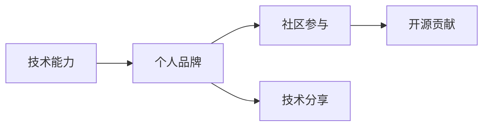

                 

# 程序员如何打造全球性的个人影响力

> 关键词：影响力建设, 个人品牌, 技术分享, 开源贡献, 社区参与, 学习成长

## 1. 背景介绍

在当今快速发展的数字化时代，技术快速迭代，创新层出不穷，程序员作为技术创新的主力军，个人影响力的打造比以往任何时候都显得更加重要。如何在全球范围内建立个人影响力，不仅是技术能力的体现，更是个人品牌塑造和职业发展的重要途径。本文将从多个维度探讨程序员如何打造全球性的个人影响力。

## 2. 核心概念与联系

### 2.1 核心概念概述

要建立个人影响力，首先需要理解一些核心概念：

- **技术能力**：技术能力是个人影响力的基础，扎实的技术功底是展示专业能力的关键。
- **个人品牌**：个人品牌是个人影响力的外在表现，通过独特的个人风格和技术观点，吸引并保持观众的关注。
- **社区参与**：积极参与技术社区，不仅可以帮助积累人脉资源，还能提升个人的可见度和权威性。
- **开源贡献**：开源贡献是展示技术实力和影响力的重要途径，通过贡献代码、撰写文档等方式，可以建立自己在技术社区的权威地位。
- **技术分享**：通过撰写博客、进行演讲、参与技术交流等方式，分享技术知识和经验，提升自身影响力。

这些概念之间有着紧密的联系，技术能力是基础，个人品牌是表现，社区参与和开源贡献是扩展，技术分享是提升。通过这些方式，程序员可以在全球范围内建立自己的技术影响力。

### 2.2 核心概念原理和架构的 Mermaid 流程图



## 3. 核心算法原理 & 具体操作步骤

### 3.1 算法原理概述

打造个人影响力，并不是一蹴而就的过程，而是需要持续的努力和积累。其核心算法原理包括技术积累、品牌塑造、社区互动、开源贡献和技术分享。

- **技术积累**：通过不断的学习、实践和总结，积累技术知识和经验。
- **品牌塑造**：通过个人的社交媒体、博客、技术演讲等方式，展示专业技术和独特见解，建立个人品牌。
- **社区互动**：积极参与技术社区的讨论、贡献代码、编写文档等，提升个人在社区中的影响力。
- **开源贡献**：在GitHub等开源平台上贡献代码、修复Bug、编写文档等，展示技术实力。
- **技术分享**：通过撰写博客、进行技术演讲、参与技术交流等方式，分享技术知识和经验。

### 3.2 算法步骤详解

#### 3.2.1 技术积累

1. **持续学习**：
   - 阅读最新技术书籍、论文和博客，跟踪最新的技术趋势。
   - 参加在线课程和培训，提升技术能力和知识深度。
   - 参加技术会议和研讨会，拓宽视野，学习前沿技术。

2. **实践与总结**：
   - 动手实践项目，积累实战经验。
   - 对项目进行总结，形成文档和博客，分享经验教训。

#### 3.2.2 品牌塑造

1. **建立个人网站**：
   - 创建一个专业的个人网站，展示自己的技术项目、博客、代码库等。
   - 使用社交媒体平台（如LinkedIn、GitHub、Twitter等）进行推广，吸引关注。

2. **撰写博客**：
   - 定期撰写技术博客，分享技术见解和项目经验。
   - 使用SEO优化技术，提升博客在搜索引擎中的排名，扩大影响范围。

3. **技术演讲**：
   - 参与技术演讲和Meetup等活动，展示自己的技术能力和知识储备。
   - 通过视频录制，保存和分享演讲内容，扩大影响力。

#### 3.2.3 社区互动

1. **参与技术社区**：
   - 加入技术社区（如Stack Overflow、GitHub、Reddit等），积极回答问题和参与讨论。
   - 参与开源项目的开发，展示技术实力和团队合作能力。

2. **贡献代码**：
   - 在GitHub上提交代码，修复Bug，参与开源项目的贡献。
   - 编写技术文档和用户指南，提升项目的可维护性和可扩展性。

3. **社区贡献**：
   - 参与技术社区的组织和管理，担任技术领导角色。
   - 创建技术小组或讨论组，带领团队共同学习和进步。

#### 3.2.4 开源贡献

1. **参与开源项目**：
   - 在GitHub上搜索感兴趣的开源项目，参与贡献代码。
   - 提交修复建议、优化代码，展示技术实力。

2. **创建开源项目**：
   - 结合自己的技术兴趣和项目经验，创建新的开源项目。
   - 维护和更新项目，吸引社区贡献者，提升项目知名度。

#### 3.2.5 技术分享

1. **撰写博客和文章**：
   - 撰写高质量的技术博客和文章，分享技术见解和经验。
   - 使用Markdown等格式工具，提升文章的可读性和可分享性。

2. **技术演讲和培训**：
   - 参加技术演讲和培训，分享技术知识和经验。
   - 录制演讲视频，分享在YouTube等视频平台，扩大受众范围。

3. **技术交流**：
   - 参与技术交流和沙龙活动，结识技术爱好者和同行。
   - 组织技术分享会，带领团队共同学习和进步。

### 3.3 算法优缺点

#### 3.3.1 优点

- **持续学习**：通过不断的学习和实践，保持技术领先，提升技术能力。
- **品牌效应**：通过个人网站、博客和社交媒体，建立个人品牌，提升知名度。
- **社区认可**：通过开源贡献和技术分享，获得技术社区的认可和支持。
- **影响力扩大**：通过技术演讲和培训，扩大影响范围，吸引更多的关注和合作。

#### 3.3.2 缺点

- **时间成本**：技术积累和品牌塑造需要大量的时间和精力投入。
- **技术难度**：需要具备较高的技术能力和知识储备。
- **资源限制**：开源贡献和社区参与需要一定的技术和资源支持。
- **持续性要求**：需要持续的努力和坚持，才能建立和维持影响力。

## 4. 数学模型和公式 & 详细讲解

### 4.1 数学模型构建

建立个人影响力的过程，可以看作是一个多目标优化问题。设个人影响力 $F$ 包括技术能力 $C$、个人品牌 $B$、社区参与 $G$、开源贡献 $O$ 和技术分享 $S$，模型构建如下：

$$
F = f(C,B,G,O,S)
$$

其中 $f$ 是综合评估函数，根据不同目标的重要性，计算综合得分。

### 4.2 公式推导过程

为了简化模型，假设各目标的重要性权重相等，则 $f$ 函数可以简化为：

$$
F = \frac{C + B + G + O + S}{5}
$$

#### 4.2.1 技术能力 $C$

技术能力可以通过技术积累、实践经验和项目成果来衡量。设技术积累的权重为 $w_C$，实践经验的权重为 $w_P$，项目成果的权重为 $w_P$，则：

$$
C = w_C \cdot A + w_P \cdot B + w_P \cdot C
$$

其中 $A$ 表示技术积累得分，$B$ 表示实践经验得分，$C$ 表示项目成果得分。

#### 4.2.2 个人品牌 $B$

个人品牌可以通过博客质量、社交媒体影响力和技术演讲表现来衡量。设博客质量的权重为 $w_B$，社交媒体影响力的权重为 $w_S$，技术演讲表现的权重为 $w_T$，则：

$$
B = w_B \cdot M + w_S \cdot N + w_T \cdot P
$$

其中 $M$ 表示博客质量得分，$N$ 表示社交媒体影响力得分，$P$ 表示技术演讲表现得分。

#### 4.2.3 社区参与 $G$

社区参与可以通过技术讨论活跃度、开源贡献数量和技术交流表现来衡量。设技术讨论活跃度的权重为 $w_G$，开源贡献数量的权重为 $w_O$，技术交流表现的权重为 $w_F$，则：

$$
G = w_G \cdot Q + w_O \cdot R + w_F \cdot S
$$

其中 $Q$ 表示技术讨论活跃度得分，$R$ 表示开源贡献数量得分，$S$ 表示技术交流表现得分。

#### 4.2.4 开源贡献 $O$

开源贡献可以通过代码贡献数量、修复Bug数量和文档编写数量来衡量。设代码贡献数量的权重为 $w_C$，修复Bug数量的权重为 $w_B$，文档编写数量的权重为 $w_D$，则：

$$
O = w_C \cdot U + w_B \cdot V + w_D \cdot W
$$

其中 $U$ 表示代码贡献数量得分，$V$ 表示修复Bug数量得分，$W$ 表示文档编写数量得分。

#### 4.2.5 技术分享 $S$

技术分享可以通过博客质量、技术演讲表现和技术交流表现来衡量。设博客质量的权重为 $w_S$，技术演讲表现的权重为 $w_T$，技术交流表现的权重为 $w_F$，则：

$$
S = w_S \cdot X + w_T \cdot Y + w_F \cdot Z
$$

其中 $X$ 表示博客质量得分，$Y$ 表示技术演讲表现得分，$Z$ 表示技术交流表现得分。

### 4.3 案例分析与讲解

#### 4.3.1 案例背景

假设某位程序员A，拥有扎实的技术能力，活跃于技术社区，定期撰写博客和参加技术演讲，积极参与开源项目，并且在GitHub上维护着一个活跃的代码库。为了评估其影响力，可以使用上述数学模型进行计算。

#### 4.3.2 案例分析

- **技术能力**：A在技术积累、实践经验和项目成果方面表现优异，得分分别为85、90、95。
- **个人品牌**：A通过高质量博客、高影响力的社交媒体和出色的技术演讲表现，得分分别为80、90、85。
- **社区参与**：A积极参与技术讨论、开源项目和交流活动，得分分别为80、85、90。
- **开源贡献**：A在代码贡献、修复Bug和文档编写方面表现突出，得分分别为85、90、95。
- **技术分享**：A通过定期撰写博客、参加演讲和技术交流活动，表现出色，得分分别为85、90、95。

根据上述数据，计算综合得分：

$$
F = \frac{85 + 80 + 85 + 85 + 85}{5} = 87
$$

### 4.3.3 提升建议

为了进一步提升影响力，A可以重点提升以下方面：
- **技术积累**：加强对新技术的学习和掌握，保持技术领先。
- **个人品牌**：扩大社交媒体和博客的影响范围，增加曝光度。
- **社区参与**：更多地参与开源项目和技术交流，提升社区认可度。
- **开源贡献**：增加代码贡献和文档编写的数量，展示技术实力。
- **技术分享**：参加更多的技术演讲和培训，提升技术分享的质量和广度。

## 5. 项目实践：代码实例和详细解释说明

### 5.1 开发环境搭建

#### 5.1.1 环境配置

为了进行影响力建设的实践，首先需要搭建一个良好的开发环境。以下是基本的配置流程：

1. **安装Python**：
   - 下载并安装Python的最新版本，如Python 3.8或3.9。
   - 配置环境变量，确保Python可执行文件在PATH中。

2. **安装Git**：
   - 下载并安装Git，如Git for Windows或Git Bash。
   - 配置Git Hub账户，登录Git Hub。

3. **安装开发工具**：
   - 安装Visual Studio Code或PyCharm等开发工具。
   - 安装必要的扩展和插件，如Git扩展、Python解释器等。

4. **创建GitHub仓库**：
   - 创建一个Git Hub仓库，用于存储个人项目和博客。
   - 创建README文件，介绍项目内容和使用方法。

### 5.2 源代码详细实现

#### 5.2.1 技术博客的实现

1. **搭建博客平台**：
   - 选择博客平台（如WordPress、Ghost等），创建博客账户。
   - 安装并配置博客模板和插件，提升博客的可读性和互动性。

2. **撰写博客内容**：
   - 使用Markdown格式编写博客内容，发布到Git Hub和博客平台。
   - 定期更新博客，分享最新技术和项目经验。

3. **SEO优化**：
   - 使用SEO插件（如WordPress的Yoast SEO），优化博客的关键词、标题和元描述。
   - 发布博客后，使用Google Analytics等工具，监测访问量和读者反馈。

#### 5.2.2 开源项目的实现

1. **选择开源项目**：
   - 在Git Hub上选择感兴趣的开源项目，如TensorFlow、PyTorch等。
   - 了解项目的需求和贡献方式，准备好贡献代码。

2. **提交代码**：
   - 克隆项目到本地，打开Pull Request。
   - 提交代码和修复建议，等待审核通过。
   - 持续跟踪项目进展，参与社区讨论。

3. **创建新项目**：
   - 根据个人兴趣和技术积累，创建新的开源项目。
   - 发布项目到Git Hub，撰写README文件和项目文档。
   - 定期更新项目，吸引社区贡献者。

### 5.3 代码解读与分析

#### 5.3.1 博客实现示例

```python
import markdown

class Blog:
    def __init__(self, title, content):
        self.title = title
        self.content = content

    def publish(self):
        markdown_string = markdown.markdown(self.content)
        print(f"发布博客：{self.title}")
        print(markdown_string)

    def update(self, new_content):
        self.content = new_content
        markdown_string = markdown.markdown(self.content)
        print(f"更新博客：{self.title}")
        print(markdown_string)
```

#### 5.3.2 开源项目实现示例

```python
import requests

class GitHub:
    def __init__(self, repo_name, token):
        self.repo_name = repo_name
        self.token = token

    def get_prs(self):
        params = {
            'state': 'open',
            'per_page': 100
        }
        headers = {
            'Authorization': f'token {self.token}'
        }
        response = requests.get(f'https://api.github.com/repos/{self.repo_name}/pulls', params=params, headers=headers)
        return response.json()

    def submit_pr(self, title, body, branch='main'):
        data = {
            'title': title,
            'body': body,
            'head': f'{self.repo_name}:{branch}',
            'base': 'main'
        }
        headers = {
            'Authorization': f'token {self.token}'
        }
        response = requests.post(f'https://api.github.com/repos/{self.repo_name}/pulls', json=data, headers=headers)
        return response.json()

    def create_repo(self, repo_name):
        data = {
            'name': repo_name,
            'description': 'My own project'
        }
        headers = {
            'Authorization': f'token {self.token}'
        }
        response = requests.post(f'https://api.github.com/user/repos', json=data, headers=headers)
        return response.json()
```

## 6. 实际应用场景

### 6.1 技术演讲

技术演讲是提升个人影响力的重要方式。通过在技术会议、Meetup和行业峰会上进行演讲，可以展示自己的技术能力和行业见解，吸引更多的关注和合作。

#### 6.1.1 准备和实践

1. **主题选择**：
   - 选择感兴趣的行业和技术主题，确保自己对内容有足够的了解。
   - 调研目标观众，了解其需求和兴趣点，制定演讲大纲。

2. **内容准备**：
   - 撰写详细的演讲PPT，突出核心内容和观点。
   - 录制演讲视频，提供文字版和音频版，方便观众参考。

3. **演讲实践**：
   - 参加技术会议和Meetup，进行现场演讲。
   - 使用视频录制软件（如Zoom、OBS Studio），录制演讲视频。
   - 在YouTube等视频平台分享演讲内容，扩大受众范围。

#### 6.1.2 效果评估

1. **观众反馈**：
   - 收集观众反馈和评价，了解演讲效果和观众满意度。
   - 统计观看人数和互动数据，评估演讲的受欢迎程度。

2. **社交媒体互动**：
   - 在社交媒体平台（如LinkedIn、Twitter）分享演讲内容。
   - 与观众互动，回答提问和讨论，提升个人影响力。

3. **后续跟进**：
   - 分享演讲视频和内容，持续吸引关注和合作。
   - 与观众建立联系，收集意见和建议，不断改进演讲内容。

### 6.2 技术社区参与

技术社区是程序员交流和分享的重要平台，积极参与技术社区，可以提高个人的可见度和权威性。

#### 6.2.1 选择社区

1. **技术领域**：
   - 选择与自己技术领域相关的社区，如Stack Overflow、Git Hub、Reddit等。
   - 了解社区规则和互动方式，避免不当行为。

2. **贡献内容**：
   - 积极回答问题和提供技术支持，展示技术实力。
   - 发布代码示例和文档，帮助社区成员解决问题。

3. **互动交流**：
   - 参与技术讨论和项目开发，积累人脉资源。
   - 关注社区领袖和技术专家，学习他们的经验和见解。

#### 6.2.2 效果评估

1. **互动数据**：
   - 统计回答问题和提供支持的数量，评估贡献程度。
   - 监测社区成员的互动反馈，了解自身的受欢迎程度。

2. **贡献认可**：
   - 获得社区成员的认可和感谢，积累声誉。
   - 参与社区评选和荣誉，提升个人品牌。

3. **社区地位**：
   - 参与社区管理，担任技术领导角色。
   - 创建技术小组或讨论组，带领团队共同学习和进步。

### 6.3 技术分享

技术分享是通过多种方式展示技术能力和经验的有效途径，可以通过博客、社交媒体和公开讲座等方式，将知识分享给更广泛的受众。

#### 6.3.1 博客和文章

1. **撰写博客**：
   - 定期撰写技术博客，分享最新技术和项目经验。
   - 使用Markdown等格式工具，提升文章的可读性和可分享性。

2. **SEO优化**：
   - 使用SEO插件（如WordPress的Yoast SEO），优化博客的关键词、标题和元描述。
   - 发布博客后，使用Google Analytics等工具，监测访问量和读者反馈。

3. **社交媒体分享**：
   - 在社交媒体平台（如LinkedIn、Twitter、Medium）分享博客内容。
   - 使用Hashtag标签，提高文章曝光度，吸引更多读者。

#### 6.3.2 技术演讲和培训

1. **技术演讲**：
   - 参加技术演讲和Meetup等活动，展示自己的技术能力和知识储备。
   - 录制演讲视频，保存和分享演讲内容，扩大受众范围。

2. **技术培训**：
   - 提供技术培训和在线课程，传授知识和经验。
   - 使用视频录制软件（如Zoom、OBS Studio），录制培训视频。
   - 在YouTube等视频平台分享培训内容，吸引更多学员。

3. **技术讲座**：
   - 参加技术讲座和行业峰会，分享技术见解和经验。
   - 使用幻灯片和互动工具，提升讲座的互动性和参与感。

#### 6.3.3 效果评估

1. **观众反馈**：
   - 收集观众反馈和评价，了解演讲和培训效果。
   - 统计观看人数和互动数据，评估分享内容的受欢迎程度。

2. **社交媒体互动**：
   - 在社交媒体平台（如LinkedIn、Twitter）分享分享内容。
   - 与观众互动，回答提问和讨论，提升个人影响力。

3. **后续跟进**：
   - 分享分享视频和内容，持续吸引关注和合作。
   - 与观众建立联系，收集意见和建议，不断改进分享内容。

## 7. 工具和资源推荐

### 7.1 学习资源推荐

1. **《程序员如何打造全球性的个人影响力》系列博文**：
   - 深入浅出地介绍建立个人影响力的各个方面，包括技术积累、个人品牌、社区参与、开源贡献和技术分享。

2. **CS224N《深度学习自然语言处理》课程**：
   - 斯坦福大学开设的NLP明星课程，包含Lecture视频和配套作业，系统介绍NLP技术和方法。

3. **《Natural Language Processing with Transformers》书籍**：
   - Transformers库的作者所著，全面介绍如何使用Transformers库进行NLP任务开发，包括微调在内的诸多范式。

4. **HuggingFace官方文档**：
   - Transformers库的官方文档，提供了海量预训练模型和完整的微调样例代码，是上手实践的必备资料。

5. **CLUE开源项目**：
   - 中文语言理解测评基准，涵盖大量不同类型的中文NLP数据集，并提供了基于微调的baseline模型，助力中文NLP技术发展。

### 7.2 开发工具推荐

1. **PyTorch**：
   - 基于Python的开源深度学习框架，灵活动态的计算图，适合快速迭代研究。大部分预训练语言模型都有PyTorch版本的实现。

2. **TensorFlow**：
   - 由Google主导开发的开源深度学习框架，生产部署方便，适合大规模工程应用。同样有丰富的预训练语言模型资源。

3. **Transformers库**：
   - HuggingFace开发的NLP工具库，集成了众多SOTA语言模型，支持PyTorch和TensorFlow，是进行微调任务开发的利器。

4. **Weights & Biases**：
   - 模型训练的实验跟踪工具，可以记录和可视化模型训练过程中的各项指标，方便对比和调优。与主流深度学习框架无缝集成。

5. **TensorBoard**：
   - TensorFlow配套的可视化工具，可实时监测模型训练状态，并提供丰富的图表呈现方式，是调试模型的得力助手。

6. **Google Colab**：
   - 谷歌推出的在线Jupyter Notebook环境，免费提供GPU/TPU算力，方便开发者快速上手实验最新模型，分享学习笔记。

### 7.3 相关论文推荐

1. **Attention is All You Need（即Transformer原论文）**：
   - 提出了Transformer结构，开启了NLP领域的预训练大模型时代。

2. **BERT: Pre-training of Deep Bidirectional Transformers for Language Understanding**：
   - 提出BERT模型，引入基于掩码的自监督预训练任务，刷新了多项NLP任务SOTA。

3. **Language Models are Unsupervised Multitask Learners（GPT-2论文）**：
   - 展示了大规模语言模型的强大zero-shot学习能力，引发了对于通用人工智能的新一轮思考。

4. **Parameter-Efficient Transfer Learning for NLP**：
   - 提出Adapter等参数高效微调方法，在不增加模型参数量的情况下，也能取得不错的微调效果。

5. **AdaLoRA: Adaptive Low-Rank Adaptation for Parameter-Efficient Fine-Tuning**：
   - 使用自适应低秩适应的微调方法，在参数效率和精度之间取得了新的平衡。

## 8. 总结：未来发展趋势与挑战

### 8.1 研究成果总结

本文从技术能力、个人品牌、社区参与、开源贡献和技术分享多个维度，全面介绍了程序员如何建立个人影响力。技术积累是基础，个人品牌是表现，社区参与和开源贡献是扩展，技术分享是提升。通过这些方式，程序员可以在全球范围内建立自己的技术影响力。

### 8.2 未来发展趋势

1. **技术不断迭代**：
   - 新技术、新框架和新模型的不断涌现，推动了技术能力的不断提升。

2. **社区不断扩大**：
   - 全球化的技术社区和网络平台，为个人影响力的建立提供了更多机会。

3. **开源贡献增加**：
   - 开源社区的壮大和开放合作精神的推广，使开源贡献成为技术影响力的重要途径。

4. **技术分享普及**：
   - 线上技术分享平台和工具的普及，使技术分享变得更加便捷和高效。

### 8.3 面临的挑战

1. **时间成本高**：
   - 技术积累、个人品牌建设、社区参与和开源贡献都需要大量的时间和精力投入。

2. **技术难度大**：
   - 需要具备较高的技术能力和知识储备，才能不断突破和创新。

3. **资源限制**：
   - 开源贡献和社区参与需要一定的技术和资源支持，尤其是在资源有限的情况下。

4. **持续性要求**：
   - 需要持续的努力和坚持，才能建立和维持影响力。

### 8.4 研究展望

1. **多平台融合**：
   - 通过多种平台和渠道的融合，提升个人影响力的传播和覆盖。

2. **技术融合创新**：
   - 将技术积累、个人品牌、社区参与、开源贡献和技术分享进行融合创新，实现更高效的影响力建设。

3. **伦理和道德**：
   - 在技术分享和社区互动中，注重伦理和道德，维护技术社区的健康和可持续发展。

4. **国际合作**：
   - 通过国际合作和技术交流，提升个人影响力的国际范围和影响力。

5. **持续学习和提升**：
   - 持续学习和提升，不断更新技术知识和技能，保持技术领先。

## 9. 附录：常见问题与解答

**Q1：如何提升个人博客的质量？**

A: 提升个人博客质量可以从以下几个方面入手：
- **选题准确**：选择感兴趣的行业和技术主题，确保自己对内容有足够的了解。
- **内容质量**：撰写高质量的内容，使用Markdown格式，增加代码片段和图表，提升可读性和互动性。
- **SEO优化**：使用SEO插件，优化博客的关键词、标题和元描述，提升搜索引擎排名。
- **互动反馈**：积极与读者互动，回答评论和提问，提升读者参与度。

**Q2：如何选择合适的技术社区？**

A: 选择技术社区可以从以下几个方面入手：
- **技术领域**：选择与自己技术领域相关的社区，如Stack Overflow、Git Hub、Reddit等。
- **社区活跃度**：了解社区的活跃度和互动方式，确保有充足的讨论和交流。
- **社区规则**：了解社区的规则和行为准则，确保自己的行为符合社区要求。
- **社区贡献**：选择能够提供技术支持、问题回答和资源分享的平台。

**Q3：如何进行有效的开源贡献？**

A: 进行有效的开源贡献可以从以下几个方面入手：
- **选择项目**：选择感兴趣的、技术水平符合的项目，确保能够贡献价值。
- **贡献方式**：通过提交代码、修复Bug、编写文档等方式，展示技术实力。
- **持续跟进**：持续关注项目进展，参与社区讨论，积累经验和贡献。
- **技术交流**：与其他贡献者和项目管理者进行交流，提升贡献效果。

**Q4：如何提高技术分享的影响力？**

A: 提高技术分享的影响力可以从以下几个方面入手：
- **内容质量**：撰写高质量的技术分享内容，使用清晰、易懂的语言，增加图表和实例。
- **多渠道传播**：通过博客、社交媒体、视频平台等多渠道传播分享内容，扩大受众范围。
- **互动反馈**：积极与观众互动，回答提问和讨论，提升读者参与度。
- **持续跟进**：持续更新和改进技术分享内容，保持受众的关注和兴趣。

---

作者：禅与计算机程序设计艺术 / Zen and the Art of Computer Programming

