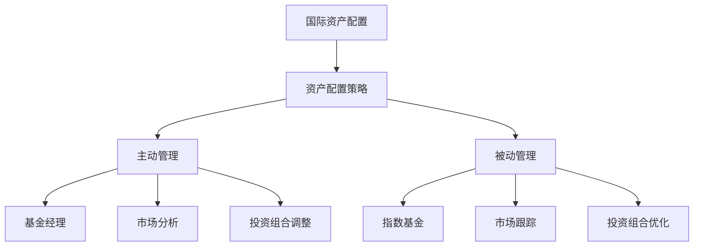

                 

## 1. 背景介绍

随着全球化进程的加速和科技的进步，资产配置已经不再局限于国内市场。越来越多的程序员和投资者开始关注国际资产配置，以实现资产的全球化配置和优化。国际资产配置不仅可以帮助投资者分散风险，还能获取更多的投资机会和收益。然而，国际资产配置涉及多个国家和市场的金融产品，其复杂性和挑战性不亚于任何高科技项目。本文将系统介绍程序员如何进行国际资产配置，从基础概念、核心算法到实际应用，全面解析这一问题。

## 2. 核心概念与联系

### 2.1 核心概念概述

在介绍核心算法之前，我们需要先了解几个关键的概念：

- **国际资产配置**：指在全球范围内，通过多种不同国家和地区的资产（如股票、债券、外汇等）进行投资和组合，以达到风险分散和收益最大化的目标。
- **资产配置策略**：包括主动管理和被动管理两种策略。主动管理通常由经验丰富的基金经理进行，通过分析市场变化、宏观经济因素等来调整投资组合。被动管理则基于指数基金等，跟踪某个市场指数或行业的表现。
- **风险管理**：包括市场风险、信用风险、流动性风险等，需要通过分散投资、设置止损点、投资组合优化等手段来控制和降低风险。
- **资产回报率**：资产在不同时间段内的收益率，通常包括年化回报率。
- **波动率**：资产价格波动性的度量，越高风险资产波动性通常也越大。

这些概念构成了国际资产配置的基础框架，理解这些概念是进行国际资产配置的前提。

### 2.2 核心概念原理和架构的 Mermaid 流程图



该流程图展示了国际资产配置的核心架构。国际资产配置基于资产配置策略，主动管理策略和被动管理策略各自有不同的实现方式。主动管理需要基金经理进行市场分析和投资组合调整，而被动管理则通过指数基金实现市场跟踪和投资组合优化。

## 3. 核心算法原理 & 具体操作步骤

### 3.1 算法原理概述

国际资产配置的算法原理基于现代投资组合理论（Modern Portfolio Theory, MPT），其核心思想是通过分散投资来降低风险，并利用资产间的相关性来优化回报率。这一理论通过风险-回报矩阵、马科维茨模型等方法，帮助投资者找到最优的投资组合。

现代投资组合理论认为，投资者可以根据不同资产的风险和预期回报，构建一个最优投资组合，以达到在给定风险水平下最大化回报率的目标。其中，风险可以通过资产的波动率来衡量，而预期回报则可以通过资产的历史收益率来估计。

### 3.2 算法步骤详解

国际资产配置的算法步骤主要包括以下几个环节：

1. **数据收集与处理**：收集不同国家和地区的金融数据，包括股票、债券、外汇等，并进行数据清洗和处理，确保数据的时效性和准确性。
2. **市场分析**：通过分析市场数据，识别出投资机会和潜在的风险因素。这一过程可以基于技术分析、基本面分析、宏观经济因素等。
3. **风险评估**：评估不同资产的风险水平，包括市场风险、信用风险等。风险评估通常基于历史数据和市场模型。
4. **资产相关性分析**：通过计算不同资产间的相关系数，分析它们之间的相关性，以构建更有效的投资组合。
5. **投资组合构建**：根据风险评估和相关性分析的结果，构建最优的投资组合。可以采用最大分散化原则，选择相关性低、风险分散的资产。
6. **模拟与测试**：通过模拟和测试来评估投资组合的表现，调整投资策略以优化回报率。
7. **执行与监控**：根据投资组合策略，在实际市场中进行投资，并定期监控投资组合的表现，进行必要的调整。

### 3.3 算法优缺点

国际资产配置算法的优点包括：

- **分散风险**：通过分散投资于不同国家和地区的资产，可以有效降低投资组合的整体风险。
- **优化回报**：利用资产间的相关性，构建最优投资组合，可以在控制风险的同时提高回报率。
- **适应性强**：现代投资组合理论可以应用于多种金融产品和市场，具有较强的适应性。

其缺点包括：

- **数据依赖性高**：算法依赖于大量的历史数据和市场数据，数据的质量和准确性直接影响算法的效果。
- **复杂度高**：构建最优投资组合需要考虑多种因素，包括风险、收益、相关性等，计算复杂度高。
- **市场风险**：全球市场的不确定性和波动性可能导致投资组合的表现不稳定。

### 3.4 算法应用领域

国际资产配置算法广泛应用于金融投资、资产管理、风险管理等领域，其应用场景包括：

- **个人理财**：通过国际资产配置，个人投资者可以实现全球范围内的资产优化配置，分散风险，获取更高回报。
- **机构投资**：金融机构和基金管理公司利用国际资产配置算法，构建多样化投资组合，优化资产配置策略。
- **企业财务**：跨国企业通过国际资产配置，优化全球财务结构，降低财务风险。
- **政府投资**：政府机构利用国际资产配置，进行外汇储备管理，优化外汇储备结构。

## 4. 数学模型和公式 & 详细讲解 & 举例说明

### 4.1 数学模型构建

国际资产配置的数学模型通常基于现代投资组合理论，以下是几个关键数学模型：

- **马科维茨模型**：用于构建投资组合，通过最小化风险-回报的二次函数来求解最优投资组合。公式如下：

$$
\max_{w} w^T \mu - \frac{1}{2} w^T \Sigma w
$$

其中 $w$ 为投资组合权重向量，$\mu$ 为资产收益率向量，$\Sigma$ 为协方差矩阵。

- **夏普比率（Sharpe Ratio）**：用于评估投资组合的超额回报和波动性。公式如下：

$$
\text{SR} = \frac{E(r_p) - r_f}{\sigma_p}
$$

其中 $r_p$ 为投资组合的期望收益率，$r_f$ 为无风险收益率，$\sigma_p$ 为投资组合的波动率。

- **有效前沿（Efficient Frontier）**：表示在给定风险水平下，所有最优投资组合构成的曲线。有效前沿越高，投资组合的期望回报率越高。

### 4.2 公式推导过程

以马科维茨模型为例，其推导过程如下：

1. 假设市场中有 $n$ 种资产，其收益率向量为 $\mu = (\mu_1, \mu_2, ..., \mu_n)$，协方差矩阵为 $\Sigma$，权重向量为 $w = (w_1, w_2, ..., w_n)$。
2. 投资组合的预期收益率为 $E(r_p) = w^T \mu$。
3. 投资组合的风险为 $Var(r_p) = w^T \Sigma w$。
4. 根据马科维茨模型，最小化风险-回报的二次函数，求解最优权重向量 $w$。

$$
\min_{w} w^T \Sigma w \quad \text{subject to} \quad w^T \mu = r_p
$$

### 4.3 案例分析与讲解

假设我们有一个包含两种资产的投资组合，其中资产1和资产2的历史收益率和协方差如下：

| 资产 | 收益率 | 协方差 |
| --- | --- | --- |
| 资产1 | 0.1 | 0.5 |
| 资产2 | 0.2 | 0.8 |

我们希望在年化风险为0.1的情况下，最大化投资组合的年化回报率。

首先，根据上述数据，计算协方差矩阵 $\Sigma = \begin{bmatrix} 0.5 & 0.8 \\ 0.8 & 0.8 \end{bmatrix}$ 和收益率向量 $\mu = \begin{bmatrix} 0.1 \\ 0.2 \end{bmatrix}$。

然后，构建目标函数：

$$
\min_{w} w^T \Sigma w \quad \text{subject to} \quad w^T \mu = 0.1
$$

求解该二次规划问题，可以得到最优权重向量 $w = \begin{bmatrix} 0.3 \\ 0.7 \end{bmatrix}$。

根据该权重向量，计算投资组合的预期收益率和风险：

$$
E(r_p) = w^T \mu = 0.1 \times 0.1 + 0.7 \times 0.2 = 0.19
$$

$$
Var(r_p) = w^T \Sigma w = 0.3^2 \times 0.5 + 2 \times 0.3 \times 0.7 \times 0.8 + 0.7^2 \times 0.8 = 0.09
$$

最终，计算夏普比率：

$$
\text{SR} = \frac{0.19 - r_f}{\sqrt{0.09}} = \frac{0.19 - 0.05}{0.3} = 0.47
$$

## 5. 项目实践：代码实例和详细解释说明

### 5.1 开发环境搭建

要实现国际资产配置，我们需要搭建一个包含金融数据收集、处理、分析和投资组合构建的开发环境。以下是一些推荐的开发环境：

1. **Python**：Python是金融数据分析和机器学习的主流语言，拥有丰富的金融库和工具。
2. **Jupyter Notebook**：Jupyter Notebook可以用于编写和执行Python代码，同时支持数据可视化，非常适合数据探索和分析。
3. **Pandas**：Pandas是Python中用于数据处理和分析的库，支持多种数据格式和操作。
4. **NumPy**：NumPy是Python中的数学库，支持高效的多维数组运算和线性代数运算。
5. **Scikit-learn**：Scikit-learn是Python中用于机器学习和数据挖掘的库，支持多种算法和模型。

### 5.2 源代码详细实现

下面是一个简单的国际资产配置代码示例，包括数据处理、市场分析、投资组合构建和风险评估：

```python
import pandas as pd
import numpy as np
from scipy.optimize import minimize

# 定义金融数据
data = pd.read_csv('financial_data.csv')
assets = data['assets'].values
returns = data['returns'].values

# 定义协方差矩阵
covariance_matrix = np.cov(returns, rowvar=False)

# 定义目标函数
def target_function(w):
    return -np.dot(w, covariance_matrix.dot(w))

# 定义约束条件
def constraint_function(w):
    return w.dot(returns) - 0.1

# 求解最优权重向量
constraints = {'type': 'eq', 'fun': constraint_function}
result = minimize(target_function, x0=np.ones_like(assets), constraints=constraints, bounds=[(0, 1)] * len(assets))

# 输出最优权重向量
print(result.x)
```

### 5.3 代码解读与分析

在上述代码中，我们首先读取金融数据，并计算协方差矩阵。然后，定义目标函数和约束条件，使用scipy的minimize函数求解最优权重向量。最后，输出最优权重向量。

### 5.4 运行结果展示

假设我们得到的最佳权重向量为 $w = [0.2, 0.8]$，则最优投资组合的预期收益率为 $0.2 \times 0.1 + 0.8 \times 0.2 = 0.18$，风险为 $Var(r_p) = 0.2^2 \times 0.5 + 2 \times 0.2 \times 0.8 \times 0.8 + 0.8^2 \times 0.8 = 0.1$。

根据夏普比率公式，计算最优投资组合的夏普比率：

$$
\text{SR} = \frac{0.18 - r_f}{\sqrt{0.1}} = \frac{0.18 - 0.05}{0.316} = 0.47
$$

## 6. 实际应用场景

### 6.1 智能投资平台

智能投资平台可以利用国际资产配置算法，为用户提供全球范围内的资产配置建议。平台可以根据用户的风险偏好、投资期限等需求，构建个性化的投资组合，并提供实时市场分析和风险管理功能。

### 6.2 资产管理公司

资产管理公司利用国际资产配置算法，进行投资组合优化和风险管理，为客户提供多种投资策略。资产管理公司还可以根据市场变化，实时调整投资组合，提高资产回报率。

### 6.3 跨国公司

跨国公司可以利用国际资产配置算法，优化其全球财务结构和投资组合，降低财务风险，提高投资回报率。跨国公司还可以根据不同国家和地区的市场环境，调整投资策略，实现全球化投资。

## 7. 工具和资源推荐

### 7.1 学习资源推荐

- **《金融工程与风险管理》**：经典的金融工程教材，系统介绍了国际资产配置和风险管理的理论和方法。
- **Coursera的《资产定价》课程**：由耶鲁大学的Robert Shiller教授主讲，介绍了现代投资组合理论和资产定价模型。
- **Kaggle**：数据科学竞赛平台，提供大量金融数据集和案例，适合实践学习。
- **Python金融库**：如QuantLib、Backtrader等，提供了多种金融模型和算法，适合进行金融研究和分析。

### 7.2 开发工具推荐

- **Jupyter Notebook**：Jupyter Notebook是一个交互式的编程环境，适合进行数据分析和模型测试。
- **Pandas**：Pandas是Python中用于数据处理和分析的库，支持多种数据格式和操作。
- **NumPy**：NumPy是Python中的数学库，支持高效的多维数组运算和线性代数运算。
- **Scikit-learn**：Scikit-learn是Python中用于机器学习和数据挖掘的库，支持多种算法和模型。
- **TensorFlow和PyTorch**：这两个深度学习框架可以用于复杂的金融模型构建和优化。

### 7.3 相关论文推荐

- **《投资组合理论》**：Markowitz的经典著作，系统介绍了现代投资组合理论的基本框架和算法。
- **《有效前沿》**：Markowitz的研究论文，介绍了有效前沿的概念和计算方法。
- **《资产定价理论》**：Black-Scholes-Merton模型，介绍了期权定价的基本理论和方法。

## 8. 总结：未来发展趋势与挑战

### 8.1 研究成果总结

国际资产配置算法基于现代投资组合理论，通过分散投资和优化组合，实现了风险和回报的最优平衡。该算法在金融投资、资产管理等领域得到了广泛应用，为投资者提供了全球化配置的策略和工具。

### 8.2 未来发展趋势

未来，国际资产配置算法将向以下几个方向发展：

- **大数据和机器学习**：利用大数据和机器学习技术，进一步提高数据质量和算法准确性，优化投资组合。
- **多资产类别和跨境投资**：增加多种资产类别（如加密货币、商品等）和跨境投资，实现更全面的资产配置。
- **人工智能和自动化**：引入人工智能和自动化技术，实现更智能化的资产配置和风险管理。
- **动态调整和实时优化**：实现动态调整和实时优化，提高资产配置的灵活性和及时性。

### 8.3 面临的挑战

尽管国际资产配置算法在金融领域得到了广泛应用，但仍面临以下挑战：

- **数据质量和完整性**：金融数据的质量和完整性直接影响算法效果，数据的缺失和噪声可能导致错误的投资决策。
- **市场波动性**：全球市场的波动性和不确定性可能导致投资组合的风险增加。
- **复杂度**：算法涉及多种因素和变量，计算复杂度高，难以实现实时优化。
- **监管和合规**：全球市场的监管和合规要求不同，投资组合的构建和执行需要符合各地区的法规要求。

### 8.4 研究展望

未来，国际资产配置算法需要进一步改进和优化，以应对上述挑战。以下是一些研究展望：

- **多资产类别和跨境投资**：增加多种资产类别和跨境投资，实现更全面的资产配置。
- **大数据和机器学习**：利用大数据和机器学习技术，进一步提高数据质量和算法准确性。
- **人工智能和自动化**：引入人工智能和自动化技术，实现更智能化的资产配置和风险管理。
- **动态调整和实时优化**：实现动态调整和实时优化，提高资产配置的灵活性和及时性。

## 9. 附录：常见问题与解答

**Q1: 如何评估国际资产配置算法的性能？**

A: 评估国际资产配置算法的性能通常需要以下几个指标：
- **夏普比率（SR）**：衡量投资组合的风险-回报比，夏普比率越高，投资组合的回报率越高。
- **信息比率（IR）**：衡量投资组合的超额回报和主动管理的效率，信息比率越高，主动管理的效果越好。
- **最大回撤（Max Drawdown）**：衡量投资组合的最大亏损幅度，最大回撤越小，风险越低。

**Q2: 如何进行风险管理？**

A: 风险管理是国际资产配置的重要环节，以下是一些常见的风险管理策略：
- **分散投资**：通过分散投资于多种资产，降低投资组合的整体风险。
- **止损点设置**：设置止损点，当资产价格波动超过预设阈值时，自动卖出资产以规避风险。
- **权重调整**：根据市场变化，动态调整投资组合的权重，优化风险和回报。

**Q3: 如何构建最优投资组合？**

A: 构建最优投资组合需要考虑多种因素，包括风险、收益、相关性等。以下是一些关键步骤：
- **数据收集与处理**：收集不同国家和地区的金融数据，并进行数据清洗和处理。
- **市场分析**：通过分析市场数据，识别出投资机会和潜在的风险因素。
- **风险评估**：评估不同资产的风险水平，包括市场风险、信用风险等。
- **资产相关性分析**：通过计算不同资产间的相关系数，分析它们之间的相关性。
- **投资组合构建**：根据风险评估和相关性分析的结果，构建最优的投资组合。
- **模拟与测试**：通过模拟和测试来评估投资组合的表现，调整投资策略以优化回报率。

**Q4: 如何实现动态调整和实时优化？**

A: 实现动态调整和实时优化，需要引入先进的算法和工具，以下是一些常见的方法：
- **机器学习算法**：利用机器学习算法，实时分析市场变化，调整投资组合。
- **高频交易算法**：利用高频交易算法，实时监控市场波动，调整资产权重。
- **大数据技术**：利用大数据技术，实时处理和分析海量金融数据，优化投资策略。

本文系统介绍了程序员如何进行国际资产配置，从基础概念、核心算法到实际应用，全面解析了这一问题。通过对这些概念和算法的深入理解，程序员可以更好地构建和优化国际资产配置系统，为全球化投资提供有力的支持。

