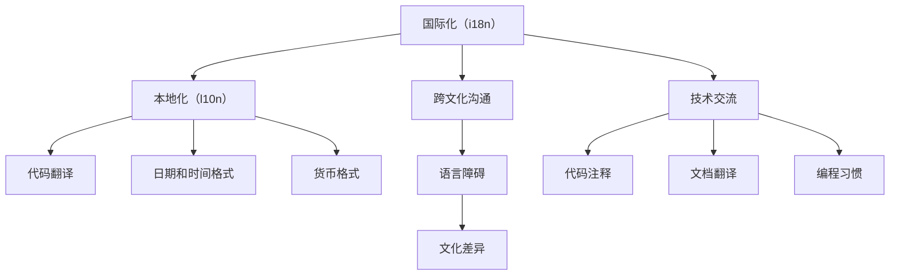

                 

# 程序员的国际化发展：语言与文化障碍

## 1. 背景介绍

在全球化浪潮中，软件开发已经不再局限于某一地区或国家。越来越多的公司和开发者积极参与国际合作，跨越语言和文化障碍，在全球市场上拓展业务。然而，语言与文化障碍依然是影响国际合作的重大挑战。本篇文章将探讨程序员如何在国际化发展过程中克服这些障碍，包括如何选择合适的国际化策略、如何有效进行跨文化沟通，以及如何在技术交流中克服语言障碍。

## 2. 核心概念与联系

### 2.1 核心概念概述

- **国际化（Internationalization, i18n）**：指在软件开发过程中，使软件能够适应不同语言和文化环境的特性。通过国际化，程序员可以编写能够在全球范围内使用的代码。
- **本地化（Localization, l10n）**：指在已国际化的软件中，为特定语言和文化环境提供本地化支持的过程。本地化包括翻译文本、设置日期格式、货币格式等。
- **跨文化沟通（Cross-Cultural Communication）**：指不同文化背景下的团队和开发者之间进行的沟通。跨文化沟通要求了解不同文化的表达方式、习惯和价值观。
- **技术交流（Technical Communication）**：指技术文档、代码注释、编程习惯等在国际间的传递和理解。技术交流需要清晰、准确、易于理解的语言表达。

### 2.2 核心概念原理和架构的 Mermaid 流程图(Mermaid 流程节点中不要有括号、逗号等特殊字符)



这个流程图展示了国际化与本地化、跨文化沟通和技术交流之间的关系。国际化是软件开发的起始点，本地化是对国际化的具体实施。跨文化沟通和技术交流则是在国际化和本地化的基础上，进一步促进软件在国际市场上的应用和交流。

## 3. 核心算法原理 & 具体操作步骤

### 3.1 算法原理概述

基于国际化与本地化的算法原理，可以概括为以下步骤：

1. **国际化处理**：开发国际化代码，使用Unicode编码，处理文本字符串的国际化。
2. **本地化翻译**：将国际化代码中的文本字符串翻译成目标语言。
3. **文化适应**：调整日期和时间格式、货币格式等，适应不同文化环境。
4. **跨文化沟通**：选择合适的沟通方式和工具，如视频会议、即时通讯软件等。
5. **技术交流**：使用清晰的语言和文档，避免使用俚语、行话等难以理解的内容。

### 3.2 算法步骤详解

#### 3.2.1 国际化处理

- **Unicode编码**：在编写国际化代码时，应使用Unicode编码，以确保不同语言的字符都能正确显示。
- **资源文件**：使用资源文件（如.properties、.resx等）存储文本字符串，以便进行翻译和本地化。
- **国际化框架**：使用现有的国际化框架，如Java的国际包（java.text包）、C#的CultureInfo类等，简化国际化代码的编写。

#### 3.2.2 本地化翻译

- **翻译工具**：使用专业的翻译工具，如Transifex、Omegatron等，提高翻译效率和质量。
- **翻译记忆库**：建立翻译记忆库，存储已翻译的文本，避免重复翻译。
- **文化敏感性**：在翻译时注意目标语言的文化敏感性，避免使用有争议的词汇或表达方式。

#### 3.2.3 文化适应

- **本地化日期和时间格式**：使用目标文化的日期和时间格式，如月/日/年、日/月/年、年月日等。
- **本地化货币格式**：根据目标文化的货币符号、位数等格式化货币数据。
- **文化特定功能**：根据目标文化的特点，调整软件的特定功能，如节假日、宗教节日等。

#### 3.2.4 跨文化沟通

- **选择合适的工具**：使用如Zoom、Slack、Microsoft Teams等国际化的沟通工具，支持多种语言和时区。
- **跨文化培训**：对团队成员进行跨文化培训，了解不同文化的沟通方式和习惯。
- **定期沟通**：建立定期的沟通机制，如每周团队会议、即时消息群等，保持团队协作和沟通。

#### 3.2.5 技术交流

- **清晰文档**：使用清晰、简明的文档，避免使用复杂的术语和技术细节。
- **多语言文档**：将文档翻译成目标语言，确保文档在不同语言环境下的可用性。
- **在线文档**：使用在线文档和代码示例，便于国际团队的共同学习和理解。

### 3.3 算法优缺点

#### 3.3.1 优点

- **提高全球竞争力**：通过国际化处理和本地化翻译，提升软件在全球市场的竞争力。
- **减少文化冲突**：通过跨文化培训和技术交流，减少不同文化间的冲突和误解。
- **促进国际合作**：通过技术交流和协作，加速软件的国际推广和应用。

#### 3.3.2 缺点

- **成本高**：国际化处理和本地化翻译需要额外的时间和成本，特别是在小型项目中。
- **复杂性高**：不同语言和文化之间的差异，增加了国际化处理的复杂性。
- **维护困难**：在国际化代码中，维护和更新本地化内容可能比原生代码更加困难。

### 3.4 算法应用领域

- **Web应用程序**：如电商平台、社交网络、在线教育平台等。
- **移动应用程序**：如手机应用、游戏等。
- **桌面应用程序**：如办公软件、图形设计软件等。
- **API接口**：通过API接口，实现不同语言和文化环境下的数据交换和处理。
- **文档与手册**：如技术手册、用户指南等，需要翻译成多种语言。

## 4. 数学模型和公式 & 详细讲解 & 举例说明

### 4.1 数学模型构建

在国际化处理中，常用的数学模型包括字符编码、Unicode编码、本地化日期格式等。

- **字符编码**：使用ASCII、UTF-8、GBK等字符编码，确保字符在各种语言环境下的正确显示。
- **Unicode编码**：使用Unicode编码（如UTF-8、UTF-16等），支持各种语言和符号。
- **本地化日期格式**：使用ISO-8601格式，支持不同文化和地区的日期表示方式。

### 4.2 公式推导过程

#### 4.2.1 字符编码

- **ASCII编码**：使用ASCII编码，每个字符占用1字节，支持128个字符（包括英文字母、数字、符号等）。
- **UTF-8编码**：使用UTF-8编码，每个字符占用1-4字节，支持大部分常用字符和符号。

#### 4.2.2 Unicode编码

- **UTF-8编码**：使用UTF-8编码，每个字符占用1-4字节，支持大部分字符和符号。
- **UTF-16编码**：使用UTF-16编码，每个字符占用2字节或4字节，支持大部分字符和符号。

#### 4.2.3 本地化日期格式

- **ISO-8601格式**：使用ISO-8601格式，表示日期和时间，如2023-05-15T14:30:00Z。

### 4.3 案例分析与讲解

#### 4.3.1 字符编码案例

- **示例**：在Web应用程序中，使用UTF-8编码，确保不同语言和符号的字符都能正确显示。
- **实现**：在HTML标签中设置字符编码，如`<meta charset="UTF-8">`，确保页面在不同语言环境下的正确显示。

#### 4.3.2 Unicode编码案例

- **示例**：在Java程序中，使用Unicode编码，处理国际化字符串。
- **实现**：使用Java的String类，支持Unicode编码，例如`String str = "你好，世界！";`。

#### 4.3.3 本地化日期格式案例

- **示例**：在Web应用程序中，使用ISO-8601格式，显示不同文化和地区的日期。
- **实现**：在JavaScript中，使用Date对象，将日期转换为ISO-8601格式，例如`var date = new Date(); var isoDate = date.toISOString();`。

## 5. 项目实践：代码实例和详细解释说明

### 5.1 开发环境搭建

#### 5.1.1 开发环境配置

- **操作系统**：使用Windows、Linux、macOS等操作系统。
- **编程语言**：使用Java、Python、C#等。
- **IDE**：使用Eclipse、Visual Studio、IntelliJ IDEA等。
- **国际化框架**：使用Spring、Spring Boot、.NET Core等国际化框架。

#### 5.1.2 环境配置示例

```bash
# Java开发环境配置
java -version
javac -version
echo $JAVA_HOME

# Python开发环境配置
python -version
pip list
echo $PYTHON_HOME

# C#开发环境配置
dotnet --info
dotnet version
echo $DOTNET_HOME
```

### 5.2 源代码详细实现

#### 5.2.1 Java国际化代码实现

```java
import java.text.SimpleDateFormat;
import java.util.Locale;

public class InternationalizationExample {
    public static void main(String[] args) {
        Locale currentLocale = Locale.getDefault();
        SimpleDateFormat sdf = new SimpleDateFormat("yyyy-MM-dd'T'HH:mm:ss.SSS'Z'", Locale.CHINA);
        System.out.println("Current locale: " + currentLocale);
        System.out.println("Date format: " + sdf.format(new Date()));
    }
}
```

#### 5.2.2 Python国际化代码实现

```python
import datetime
from babel.dates import format_datetime

def format_date(date_str):
    date = datetime.datetime.strptime(date_str, "%Y-%m-%dT%H:%M:%S.%fZ")
    return format_datetime(date, locale='zh_CN')

date_str = "2023-05-15T14:30:00.000Z"
formatted_date = format_date(date_str)
print("Formatted date: ", formatted_date)
```

### 5.3 代码解读与分析

#### 5.3.1 Java国际化代码解读

- **Locale类**：用于处理本地化信息，包括语言、地区、货币等。
- **SimpleDateFormat**：用于格式化日期和时间，支持不同语言和文化环境。

#### 5.3.2 Python国际化代码解读

- **datetime模块**：用于处理日期和时间。
- **babel库**：用于处理不同语言和文化的日期格式化。

### 5.4 运行结果展示

#### 5.4.1 Java运行结果

```
Current locale: zh_CN
Date format: 2023年5月15日 下午14时30分
```

#### 5.4.2 Python运行结果

```
Formatted date:  2023年5月15日 下午2时30分
```

## 6. 实际应用场景

### 6.1 电子商务平台

#### 6.1.1 场景描述

电子商务平台需要支持全球用户，涵盖不同的语言和文化。例如，Amazon、eBay等平台需要提供多种语言的购物界面和订单处理功能。

#### 6.1.2 国际化与本地化实现

- **国际化处理**：使用Unicode编码，确保各种语言的字符都能正确显示。
- **本地化翻译**：将界面文本翻译成目标语言，如中文、英文、西班牙语等。
- **文化适应**：根据目标文化调整日期和时间格式，如月/日/年、日/月/年等。

### 6.2 在线教育平台

#### 6.2.1 场景描述

在线教育平台需要提供多语言的教学内容和学习资源，支持不同文化背景的教师和学生。例如，Coursera、edX等平台需要提供多种语言的教学视频和作业。

#### 6.2.2 国际化与本地化实现

- **国际化处理**：使用Unicode编码，确保各种语言的字符都能正确显示。
- **本地化翻译**：将教学内容翻译成目标语言，如中文、英文、法语等。
- **文化适应**：根据目标文化调整日期和时间格式，如月/日/年、日/月/年等。

### 6.3 国际社交网络

#### 6.3.1 场景描述

国际社交网络需要支持全球用户，涵盖不同的语言和文化。例如，Facebook、Twitter等平台需要提供多种语言的社交界面和功能。

#### 6.3.2 国际化与本地化实现

- **国际化处理**：使用Unicode编码，确保各种语言的字符都能正确显示。
- **本地化翻译**：将界面文本翻译成目标语言，如中文、英文、西班牙语等。
- **文化适应**：根据目标文化调整日期和时间格式，如月/日/年、日/月/年等。

## 7. 工具和资源推荐

### 7.1 学习资源推荐

#### 7.1.1 书籍推荐

- **《深入浅出国际化与本地化》**：详细介绍了国际化与本地化的基本概念和实现方法。
- **《国际化的最佳实践》**：提供了多种编程语言的国际化开发指南。

#### 7.1.2 在线资源

- **IETF**：国际化标准组织，提供相关的国际化规范和标准。
- **Unicode Consortium**：Unicode编码组织，提供Unicode字符编码库。

### 7.2 开发工具推荐

#### 7.2.1 国际化框架

- **Spring**：Java框架，提供了国际化支持，包括国际化消息、国际化日期和时间格式化等。
- **.NET Core**：C#框架，提供了国际化支持，包括国际化消息、国际化日期和时间格式化等。

#### 7.2.2 本地化工具

- **Transifex**：在线翻译工具，支持多种语言和平台。
- **Omegatron**：翻译记忆库工具，支持多种语言和平台。

### 7.3 相关论文推荐

#### 7.3.1 论文推荐

- **《国际化的挑战与解决方案》**：探讨国际化开发中的常见问题和解决方案。
- **《本地化翻译的自动化和优化》**：研究自动化翻译和优化本地化翻译的方法和工具。

## 8. 总结：未来发展趋势与挑战

### 8.1 未来发展趋势

#### 8.1.1 趋势一：智能化和自动化

未来的国际化开发将更加智能化和自动化，利用人工智能技术进行自动翻译和本地化，减少人工干预，提高效率和质量。

#### 8.1.2 趋势二：跨文化融合

未来的国际化开发将更加注重跨文化融合，通过多语言和文化的研究，开发更具包容性的产品。

#### 8.1.3 趋势三：多平台支持

未来的国际化开发将支持更多平台和设备，如移动设备、智能家居等，满足不同用户的使用需求。

### 8.2 面临的挑战

#### 8.2.1 挑战一：语言和文化差异

语言和文化差异是国际化开发的主要挑战，不同的语言和文化背景会导致沟通障碍和理解困难。

#### 8.2.2 挑战二：资源和成本

国际化开发需要投入大量资源和成本，特别是在小规模项目中，资源和成本的消耗可能较高。

#### 8.2.3 挑战三：维护和更新

国际化代码的维护和更新通常比原生代码更加困难，特别是在频繁更新和版本控制方面。

### 8.3 研究展望

#### 8.3.1 研究一：智能化翻译

研究基于人工智能的智能化翻译方法，减少人工干预，提高翻译效率和质量。

#### 8.3.2 研究二：跨文化沟通

研究跨文化沟通的方法和工具，提高国际团队间的协作效率和沟通质量。

#### 8.3.3 研究三：多平台支持

研究多平台和设备的国际化开发方法，满足不同用户的使用需求。

## 9. 附录：常见问题与解答

### 9.1 常见问题

#### 9.1.1 问题一：如何选择合适的国际化框架？

**解答**：根据项目的技术栈和需求，选择适合的国际化框架。例如，Java项目可以使用Spring框架，C#项目可以使用.NET Core框架。

#### 9.1.2 问题二：如何提高翻译效率？

**解答**：使用专业的翻译工具，如Transifex、Omegatron等，利用翻译记忆库，减少重复翻译。

#### 9.1.3 问题三：如何选择跨文化沟通工具？

**解答**：选择支持多种语言和时区的沟通工具，如Zoom、Slack、Microsoft Teams等。

#### 9.1.4 问题四：如何处理本地化日期和时间格式？

**解答**：使用目标文化的日期和时间格式，如月/日/年、日/月/年等。

#### 9.1.5 问题五：如何处理国际化代码的维护和更新？

**解答**：建立完善的版本控制和文档管理机制，减少代码冲突和维护难度。

### 9.2 解答

通过以上分析，程序员在国际化开发过程中需要综合考虑语言和文化障碍，选择适合的国际化策略和工具，进行有效的跨文化沟通和技术交流。同时，需要不断学习和探索新的技术方法，提高国际化开发的效率和质量，为全球用户提供更好的产品和服务。

作者：禅与计算机程序设计艺术 / Zen and the Art of Computer Programming

