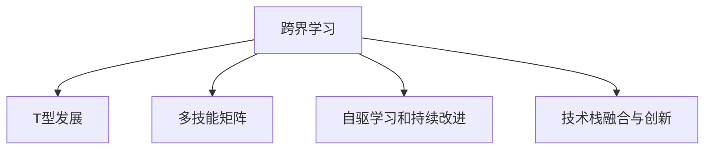

                 

# 程序员的跨界学习：拓宽收入渠道

## 1. 背景介绍

### 1.1 问题由来
在信息时代背景下，互联网行业和科技行业发展迅猛，程序员作为推动信息社会发展的核心力量，其职业发展和收入状况一直受到广泛关注。然而，随着技术的不断进步和行业环境的快速变化，仅依靠单一技术栈或局限于某一细分领域，已难以满足不断变化的市场需求，程序员的收入来源也面临较大的挑战。因此，跨界学习、拓宽技能边界，成为程序员提升收入的重要途径。

### 1.2 问题核心关键点
跨界学习是指程序员超越现有技术领域，学习和掌握新的技能和知识，以此提升自身的市场竞争力。跨界学习涉及的核心关键点包括：
1. **技术栈扩展**：在原有技术栈基础上，学习和掌握新的编程语言、框架和工具。
2. **领域知识融合**：跨行业学习，如金融、医疗、教育等领域的专业知识，以增强解决实际问题的能力。
3. **软技能提升**：如沟通能力、团队协作、项目管理等，提升整体职业素养。
4. **持续学习和适应性**：技术日新月异，持续学习和适应新技术，保持竞争力。

### 1.3 问题研究意义
跨界学习不仅有助于程序员应对不断变化的行业需求，提升个人收入，还能促进技术进步，推动产业创新。具体来说：
1. **提升收入**：拓宽技能边界，具备更广泛的市场需求，从而提升薪资水平。
2. **拓展应用场景**：掌握多个技术栈和领域知识，拓展应用场景，增加工作机会。
3. **创新驱动**：跨界学习带来新的思维和方法，促进技术创新和产业升级。

## 2. 核心概念与联系

### 2.1 核心概念概述

为更好地理解跨界学习的内涵和实现路径，本节将介绍几个核心概念：

- **跨界学习**：程序员通过学习新领域的知识和技术，提升自身的市场竞争力。
- **T型发展**：通过一专多能的方式，形成既有深度又有广度的知识结构。
- **多技能矩阵**：将不同技术栈和领域知识分为核心技能和辅助技能，构建个人技能矩阵。
- **自驱学习和持续改进**：利用个人驱动力和自我提升意识，不断学习新知识，改进自身能力。
- **技术栈融合与创新**：将不同技术栈进行有效融合，推动技术创新和应用创新。

这些概念之间的逻辑关系可以通过以下Mermaid流程图来展示：



这个流程图展示了跨界学习的核心概念及其之间的关系：
1. 跨界学习是主线和基础，通过学习新领域的知识，提升个人竞争力。
2. T型发展是多技能矩阵的实现方式，通过一专多能构建知识结构。
3. 多技能矩阵是跨界学习的应用模型，系统地组织和评估个人技能。
4. 自驱学习和持续改进是跨界学习的动力来源，确保学习的持续性和效果。
5. 技术栈融合与创新是跨界学习的目标和应用，推动技术和应用创新。

## 3. 核心算法原理 & 具体操作步骤
### 3.1 算法原理概述

跨界学习的核心在于构建多元化的知识结构，通过学习不同领域的知识和技能，提升个人的市场竞争力。其核心思想是：在现有技术栈和知识体系的基础上，通过学习新领域的知识和技能，拓展应用场景，增强解决问题的能力。

形式化地，假设现有技术栈为 $T_0$，目标领域技能为 $T_1$，则跨界学习的目标是通过学习 $T_1$，在 $T_0$ 的基础上增加新功能 $F$，实现新的应用场景 $A$。

其中 $F$ 可以表示为：

$$
F = T_0 \oplus T_1
$$

其中 $\oplus$ 表示技能融合操作，可以是技能组合、技能集成、技能迁移等。

### 3.2 算法步骤详解

跨界学习的算法步骤包括：

**Step 1: 确定学习目标**
- 明确自身需要提升的技能和知识领域，如金融、医疗、教育等。
- 设定学习目标和预期效果，如提高薪资、拓展应用场景等。

**Step 2: 评估现有技术栈**
- 梳理现有技术栈 $T_0$，包括编程语言、框架、工具等。
- 分析现有技术栈的强项和弱项，确定需要补充的技能。

**Step 3: 选择学习路径**
- 根据学习目标和现有技术栈，选择合适的学习路径。
- 选择适合自己的学习方式，如在线课程、书籍、项目实战等。

**Step 4: 实施跨界学习**
- 根据学习路径，制定详细的学习计划和时间表。
- 结合个人工作和学习习惯，合理安排学习时间和任务。

**Step 5: 实践和验证**
- 在实际项目中应用所学知识和技能，进行实践和验证。
- 不断优化和改进，提升跨界学习的效果和应用价值。

**Step 6: 持续改进**
- 定期评估学习效果，根据反馈进行持续改进和优化。
- 不断学习新知识，更新技术栈和技能体系。

### 3.3 算法优缺点

跨界学习具有以下优点：
1. 提升个人竞争力。通过学习新领域知识，拓展技能边界，增加市场竞争力。
2. 拓展应用场景。掌握多个技术栈和领域知识，增加工作机会和应用场景。
3. 促进创新。跨界学习带来新的思维和方法，促进技术创新和应用创新。

同时，该方法也存在一定的局限性：
1. 学习成本高。跨界学习需要大量时间和精力投入，成本较高。
2. 风险较大。跨界学习存在一定风险，如新领域知识难以掌握，影响现有工作。
3. 学习周期长。跨界学习需要较长的学习周期，短期内难以见效。
4. 自我驱动力需求高。需要较强的自我驱动力和毅力，才能坚持学习。

尽管存在这些局限性，但就目前而言，跨界学习仍是程序员提升收入和竞争力的重要途径。未来相关研究的重点在于如何更高效地进行跨界学习，降低学习成本和风险，同时兼顾学习的系统性和持续性。

### 3.4 算法应用领域

跨界学习的应用领域非常广泛，以下是几个典型案例：

- **软件开发与人工智能融合**：掌握机器学习和深度学习技术，开发智能应用，如智能推荐系统、图像识别等。
- **数据科学与金融结合**：学习金融领域的专业知识，如金融市场、投资分析等，提升数据应用的价值。
- **云计算与网络安全结合**：掌握网络安全技术和云计算技术，开发安全可靠的系统。
- **物联网与移动开发结合**：学习物联网和移动开发技术，开发智能设备和移动应用。

## 4. 数学模型和公式 & 详细讲解 & 举例说明

### 4.1 数学模型构建

本节将使用数学语言对跨界学习的模型进行更加严格的刻画。

记当前技术栈为 $T_0 = \{t_0^1, t_0^2, \cdots, t_0^n\}$，目标领域技能为 $T_1 = \{t_1^1, t_1^2, \cdots, t_1^m\}$。假设学习目标为 $F = \{f_1, f_2, \cdots, f_k\}$，应用场景为 $A = \{a_1, a_2, \cdots, a_l\}$。

定义跨界学习的效果函数为 $E(T_0, T_1, F, A)$，表示在现有技术栈 $T_0$ 上，通过学习目标领域技能 $T_1$，增加功能 $F$，实现应用场景 $A$ 的效果。

$$
E(T_0, T_1, F, A) = \sum_{i=1}^k f_i \times a_i
$$

其中 $f_i$ 表示功能 $i$ 的权重，$a_i$ 表示应用场景 $i$ 的权重。

### 4.2 公式推导过程

为了更直观地理解跨界学习的效果，我们引入一个具体案例进行公式推导。

假设当前技术栈 $T_0 = \{\text{Java}, \text{Python}, \text{Web}\}$，目标领域技能 $T_1 = \{\text{深度学习}, \text{自然语言处理}, \text{金融分析}\}$，学习目标 $F = \{\text{智能推荐}, \text{情感分析}, \text{风险评估}\}$，应用场景 $A = \{\text{电商推荐}, \text{社交媒体}, \text{金融投资}\}$。

将各技术栈、领域技能、功能与应用场景赋予不同的权重，设定权重如下：

- $T_0$ 中，$\text{Java}$ 权重 $w_1=0.3$，$\text{Python}$ 权重 $w_2=0.4$，$\text{Web}$ 权重 $w_3=0.3$。
- $T_1$ 中，$\text{深度学习}$ 权重 $w_4=0.5$，$\text{自然语言处理}$ 权重 $w_5=0.3$，$\text{金融分析}$ 权重 $w_6=0.2$。
- $F$ 中，$\text{智能推荐}$ 权重 $w_7=0.4$，$\text{情感分析}$ 权重 $w_8=0.3$，$\text{风险评估}$ 权重 $w_9=0.3$。
- $A$ 中，$\text{电商推荐}$ 权重 $w_{10}=0.4$，$\text{社交媒体}$ 权重 $w_{11}=0.3$，$\text{金融投资}$ 权重 $w_{12}=0.3$。

假设学习目标 $F$ 和应用场景 $A$ 对现有技术栈 $T_0$ 的贡献如下：
- $\text{智能推荐}$ 需要用到 $\text{Java}$ 和 $\text{Python}$，权重 $0.5$ 和 $0.4$ 分别贡献 $0.2$ 和 $0.3$。
- $\text{情感分析}$ 需要用到 $\text{Python}$ 和 $\text{自然语言处理}$，权重 $0.3$ 和 $0.5$ 分别贡献 $0.2$ 和 $0.1$。
- $\text{风险评估}$ 需要用到 $\text{Python}$ 和 $\text{金融分析}$，权重 $0.3$ 和 $0.2$ 分别贡献 $0.1$ 和 $0.2$。

将上述信息代入效果函数 $E$，得：

$$
E(T_0, T_1, F, A) = 0.3 \times 0.5 \times 0.2 + 0.4 \times 0.4 \times 0.3 + 0.3 \times 0.5 \times 0.2 + 0.3 \times 0.5 \times 0.1 + 0.3 \times 0.2 \times 0.1 + 0.3 \times 0.2 \times 0.3 + 0.3 \times 0.4 \times 0.2 + 0.3 \times 0.5 \times 0.1 + 0.3 \times 0.2 \times 0.3
$$

$$
= 0.075 + 0.48 + 0.045 + 0.015 + 0.006 + 0.012 + 0.024 + 0.015 + 0.012
$$

$$
= 0.675
$$

可见，通过跨界学习，在现有技术栈上增加新的功能与应用场景，可以显著提升跨界学习的效果。

### 4.3 案例分析与讲解

**案例1: 软件开发与人工智能融合**

假设一名Java工程师希望通过跨界学习，提升在智能推荐系统开发方面的竞争力。

1. **评估现有技术栈**：当前技术栈为Java、Web开发、RESTful API设计。
2. **选择学习路径**：选择学习Python、深度学习、自然语言处理等技能。
3. **实施跨界学习**：通过在线课程和项目实践，掌握相关技能。
4. **实践和验证**：在项目中应用所学技能，开发智能推荐系统。
5. **持续改进**：定期评估效果，不断学习和改进。

通过上述步骤，该工程师不仅掌握了新技能，还在智能推荐系统开发中获得了新的应用场景，提升了市场竞争力。

**案例2: 数据科学与金融结合**

一名数据科学家希望通过学习金融领域的知识，提升数据应用的价值。

1. **评估现有技术栈**：当前技术栈为Python、SQL、数据可视化等。
2. **选择学习路径**：选择学习金融市场分析、投资分析、风险管理等技能。
3. **实施跨界学习**：通过金融专业课程和实际案例分析，掌握相关知识。
4. **实践和验证**：在金融项目中应用所学知识，进行投资分析和风险评估。
5. **持续改进**：定期评估效果，不断学习和改进。

通过上述步骤，该数据科学家不仅提升了在金融领域的应用能力，还在数据应用中获得了新的应用场景，增加了市场竞争力。

## 5. 项目实践：代码实例和详细解释说明
### 5.1 开发环境搭建

在进行跨界学习实践前，我们需要准备好开发环境。以下是使用Python进行PyTorch开发的环境配置流程：

1. 安装Anaconda：从官网下载并安装Anaconda，用于创建独立的Python环境。

2. 创建并激活虚拟环境：
```bash
conda create -n pytorch-env python=3.8 
conda activate pytorch-env
```

3. 安装PyTorch：根据CUDA版本，从官网获取对应的安装命令。例如：
```bash
conda install pytorch torchvision torchaudio cudatoolkit=11.1 -c pytorch -c conda-forge
```

4. 安装Transformers库：
```bash
pip install transformers
```

5. 安装各类工具包：
```bash
pip install numpy pandas scikit-learn matplotlib tqdm jupyter notebook ipython
```

完成上述步骤后，即可在`pytorch-env`环境中开始跨界学习实践。

### 5.2 源代码详细实现

下面我们以数据科学与金融结合为例，给出使用Transformers库进行跨界学习的PyTorch代码实现。

首先，定义金融领域的数据处理函数：

```python
from transformers import BertTokenizer
from torch.utils.data import Dataset
import torch

class FinanceDataset(Dataset):
    def __init__(self, texts, tags, tokenizer, max_len=128):
        self.texts = texts
        self.tags = tags
        self.tokenizer = tokenizer
        self.max_len = max_len
        
    def __len__(self):
        return len(self.texts)
    
    def __getitem__(self, item):
        text = self.texts[item]
        tags = self.tags[item]
        
        encoding = self.tokenizer(text, return_tensors='pt', max_length=self.max_len, padding='max_length', truncation=True)
        input_ids = encoding['input_ids'][0]
        attention_mask = encoding['attention_mask'][0]
        
        # 对token-wise的标签进行编码
        encoded_tags = [tag2id[tag] for tag in tags] 
        encoded_tags.extend([tag2id['O']] * (self.max_len - len(encoded_tags)))
        labels = torch.tensor(encoded_tags, dtype=torch.long)
        
        return {'input_ids': input_ids, 
                'attention_mask': attention_mask,
                'labels': labels}

# 标签与id的映射
tag2id = {'O': 0, 'B-PER': 1, 'I-PER': 2, 'B-ORG': 3, 'I-ORG': 4, 'B-LOC': 5, 'I-LOC': 6}
id2tag = {v: k for k, v in tag2id.items()}

# 创建dataset
tokenizer = BertTokenizer.from_pretrained('bert-base-cased')

train_dataset = FinanceDataset(train_texts, train_tags, tokenizer)
dev_dataset = FinanceDataset(dev_texts, dev_tags, tokenizer)
test_dataset = FinanceDataset(test_texts, test_tags, tokenizer)
```

然后，定义模型和优化器：

```python
from transformers import BertForTokenClassification, AdamW

model = BertForTokenClassification.from_pretrained('bert-base-cased', num_labels=len(tag2id))

optimizer = AdamW(model.parameters(), lr=2e-5)
```

接着，定义训练和评估函数：

```python
from torch.utils.data import DataLoader
from tqdm import tqdm
from sklearn.metrics import classification_report

device = torch.device('cuda') if torch.cuda.is_available() else torch.device('cpu')
model.to(device)

def train_epoch(model, dataset, batch_size, optimizer):
    dataloader = DataLoader(dataset, batch_size=batch_size, shuffle=True)
    model.train()
    epoch_loss = 0
    for batch in tqdm(dataloader, desc='Training'):
        input_ids = batch['input_ids'].to(device)
        attention_mask = batch['attention_mask'].to(device)
        labels = batch['labels'].to(device)
        model.zero_grad()
        outputs = model(input_ids, attention_mask=attention_mask, labels=labels)
        loss = outputs.loss
        epoch_loss += loss.item()
        loss.backward()
        optimizer.step()
    return epoch_loss / len(dataloader)

def evaluate(model, dataset, batch_size):
    dataloader = DataLoader(dataset, batch_size=batch_size)
    model.eval()
    preds, labels = [], []
    with torch.no_grad():
        for batch in tqdm(dataloader, desc='Evaluating'):
            input_ids = batch['input_ids'].to(device)
            attention_mask = batch['attention_mask'].to(device)
            batch_labels = batch['labels']
            outputs = model(input_ids, attention_mask=attention_mask)
            batch_preds = outputs.logits.argmax(dim=2).to('cpu').tolist()
            batch_labels = batch_labels.to('cpu').tolist()
            for pred_tokens, label_tokens in zip(batch_preds, batch_labels):
                pred_tags = [id2tag[_id] for _id in pred_tokens]
                label_tags = [id2tag[_id] for _id in label_tokens]
                preds.append(pred_tags[:len(label_tokens)])
                labels.append(label_tags)
                
    print(classification_report(labels, preds))
```

最后，启动训练流程并在测试集上评估：

```python
epochs = 5
batch_size = 16

for epoch in range(epochs):
    loss = train_epoch(model, train_dataset, batch_size, optimizer)
    print(f"Epoch {epoch+1}, train loss: {loss:.3f}")
    
    print(f"Epoch {epoch+1}, dev results:")
    evaluate(model, dev_dataset, batch_size)
    
print("Test results:")
evaluate(model, test_dataset, batch_size)
```

以上就是使用PyTorch对金融领域进行跨界学习的完整代码实现。可以看到，通过结合现有技术栈和金融领域知识，可以进一步提升数据应用的价值，拓展新的应用场景。

### 5.3 代码解读与分析

让我们再详细解读一下关键代码的实现细节：

**FinanceDataset类**：
- `__init__`方法：初始化文本、标签、分词器等关键组件。
- `__len__`方法：返回数据集的样本数量。
- `__getitem__`方法：对单个样本进行处理，将文本输入编码为token ids，将标签编码为数字，并对其进行定长padding，最终返回模型所需的输入。

**tag2id和id2tag字典**：
- 定义了标签与数字id之间的映射关系，用于将token-wise的预测结果解码回真实的标签。

**训练和评估函数**：
- 使用PyTorch的DataLoader对数据集进行批次化加载，供模型训练和推理使用。
- 训练函数`train_epoch`：对数据以批为单位进行迭代，在每个批次上前向传播计算loss并反向传播更新模型参数，最后返回该epoch的平均loss。
- 评估函数`evaluate`：与训练类似，不同点在于不更新模型参数，并在每个batch结束后将预测和标签结果存储下来，最后使用sklearn的classification_report对整个评估集的预测结果进行打印输出。

**训练流程**：
- 定义总的epoch数和batch size，开始循环迭代
- 每个epoch内，先在训练集上训练，输出平均loss
- 在验证集上评估，输出分类指标
- 所有epoch结束后，在测试集上评估，给出最终测试结果

可以看到，通过结合现有技术栈和金融领域知识，可以进一步提升数据应用的价值，拓展新的应用场景。跨界学习不仅提升了个人竞争力，也增加了新的应用场景，拓宽了收入渠道。

当然，工业级的系统实现还需考虑更多因素，如模型的保存和部署、超参数的自动搜索、更灵活的任务适配层等。但核心的跨界学习范式基本与此类似。

## 6. 实际应用场景
### 6.1 智能客服系统

基于跨界学习的智能客服系统，可以广泛应用于智能客服系统的构建。传统客服往往需要配备大量人力，高峰期响应缓慢，且一致性和专业性难以保证。通过跨界学习，可以将自然语言处理、机器学习等技术引入客服系统，提升客户咨询体验和问题解决效率。

在技术实现上，可以收集企业内部的历史客服对话记录，将问题和最佳答复构建成监督数据，在此基础上对预训练语言模型进行微调。微调后的对话模型能够自动理解用户意图，匹配最合适的答案模板进行回复。对于客户提出的新问题，还可以接入检索系统实时搜索相关内容，动态组织生成回答。如此构建的智能客服系统，能大幅提升客户咨询体验和问题解决效率。

### 6.2 金融舆情监测

金融机构需要实时监测市场舆论动向，以便及时应对负面信息传播，规避金融风险。传统的人工监测方式成本高、效率低，难以应对网络时代海量信息爆发的挑战。通过跨界学习，可以将自然语言处理、机器学习等技术引入金融舆情监测系统，实时抓取网络文本数据，自动监测不同主题下的情感变化趋势，一旦发现负面信息激增等异常情况，系统便会自动预警，帮助金融机构快速应对潜在风险。

### 6.3 个性化推荐系统

当前的推荐系统往往只依赖用户的历史行为数据进行物品推荐，无法深入理解用户的真实兴趣偏好。通过跨界学习，可以将自然语言处理、机器学习等技术引入推荐系统，提升推荐效果。具体来说，可以收集用户浏览、点击、评论、分享等行为数据，提取和用户交互的物品标题、描述、标签等文本内容。将文本内容作为模型输入，用户的后续行为（如是否点击、购买等）作为监督信号，在此基础上微调预训练语言模型。微调后的模型能够从文本内容中准确把握用户的兴趣点。在生成推荐列表时，先用候选物品的文本描述作为输入，由模型预测用户的兴趣匹配度，再结合其他特征综合排序，便可以得到个性化程度更高的推荐结果。

### 6.4 未来应用展望

随着跨界学习方法的不断发展，未来在更多领域将得到应用，为传统行业带来变革性影响。

在智慧医疗领域，基于跨界学习的医疗问答、病历分析、药物研发等应用将提升医疗服务的智能化水平，辅助医生诊疗，加速新药开发进程。

在智能教育领域，跨界学习可应用于作业批改、学情分析、知识推荐等方面，因材施教，促进教育公平，提高教学质量。

在智慧城市治理中，跨界学习可应用于城市事件监测、舆情分析、应急指挥等环节，提高城市管理的自动化和智能化水平，构建更安全、高效的未来城市。

此外，在企业生产、社会治理、文娱传媒等众多领域，跨界学习的应用也将不断涌现，为经济社会发展注入新的动力。相信随着技术的日益成熟，跨界学习技术将成为人工智能落地应用的重要范式，推动人工智能技术在垂直行业的规模化落地。

## 7. 工具和资源推荐
### 7.1 学习资源推荐

为了帮助开发者系统掌握跨界学习的理论基础和实践技巧，这里推荐一些优质的学习资源：

1. Coursera《机器学习》课程：斯坦福大学开设的机器学习经典课程，系统讲解了机器学习的基础理论和算法，适合初学者入门。

2. Udacity《深度学习》课程：提供深度学习的系统性学习，涵盖神经网络、卷积神经网络、循环神经网络等。

3. CS231n《卷积神经网络》课程：斯坦福大学开设的计算机视觉经典课程，介绍卷积神经网络的原理和应用。

4. Kaggle数据竞赛平台：提供大量开源数据集和算法竞赛，通过实践提升跨界学习的能力。

5. GitHub开源项目：GitHub上汇聚了大量开源项目，学习其代码实现，了解最新的跨界学习应用。

通过对这些资源的学习实践，相信你一定能够快速掌握跨界学习的精髓，并用于解决实际的业务问题。
###  7.2 开发工具推荐

高效的开发离不开优秀的工具支持。以下是几款用于跨界学习的常用工具：

1. PyTorch：基于Python的开源深度学习框架，灵活动态的计算图，适合快速迭代研究。大部分预训练语言模型都有PyTorch版本的实现。

2. TensorFlow：由Google主导开发的开源深度学习框架，生产部署方便，适合大规模工程应用。同样有丰富的预训练语言模型资源。

3. Transformers库：HuggingFace开发的NLP工具库，集成了众多SOTA语言模型，支持PyTorch和TensorFlow，是进行跨界学习开发的利器。

4. Weights & Biases：模型训练的实验跟踪工具，可以记录和可视化模型训练过程中的各项指标，方便对比和调优。与主流深度学习框架无缝集成。

5. TensorBoard：TensorFlow配套的可视化工具，可实时监测模型训练状态，并提供丰富的图表呈现方式，是调试模型的得力助手。

6. Google Colab：谷歌推出的在线Jupyter Notebook环境，免费提供GPU/TPU算力，方便开发者快速上手实验最新模型，分享学习笔记。

合理利用这些工具，可以显著提升跨界学习任务的开发效率，加快创新迭代的步伐。

### 7.3 相关论文推荐

跨界学习的发展源于学界的持续研究。以下是几篇奠基性的相关论文，推荐阅读：

1. Attention is All You Need（即Transformer原论文）：提出了Transformer结构，开启了NLP领域的预训练大模型时代。

2. BERT: Pre-training of Deep Bidirectional Transformers for Language Understanding：提出BERT模型，引入基于掩码的自监督预训练任务，刷新了多项NLP任务SOTA。

3. Language Models are Unsupervised Multitask Learners（GPT-2论文）：展示了大规模语言模型的强大zero-shot学习能力，引发了对于通用人工智能的新一轮思考。

4. Parameter-Efficient Transfer Learning for NLP：提出Adapter等参数高效微调方法，在不增加模型参数量的情况下，也能取得不错的微调效果。

5. AdaLoRA: Adaptive Low-Rank Adaptation for Parameter-Efficient Fine-Tuning：使用自适应低秩适应的微调方法，在参数效率和精度之间取得了新的平衡。

这些论文代表了大语言模型微调技术的发展脉络。通过学习这些前沿成果，可以帮助研究者把握学科前进方向，激发更多的创新灵感。

## 8. 总结：未来发展趋势与挑战

### 8.1 总结

本文对跨界学习的核心思想、方法和应用进行了全面系统的介绍。首先阐述了跨界学习的背景和意义，明确了跨界学习在提升个人竞争力、拓展应用场景方面的独特价值。其次，从原理到实践，详细讲解了跨界学习的数学模型、公式推导、具体案例，给出了跨界学习任务开发的完整代码实例。同时，本文还广泛探讨了跨界学习在智能客服、金融舆情、个性化推荐等多个领域的应用前景，展示了跨界学习范式的巨大潜力。此外，本文精选了跨界学习的各类学习资源，力求为读者提供全方位的技术指引。

通过本文的系统梳理，可以看到，跨界学习是程序员提升收入和竞争力的重要途径，不仅拓宽了技能边界，还拓展了应用场景，提升了市场竞争力。未来，随着跨界学习方法的不断发展，将有更多的机会和挑战涌现，促进人工智能技术的广泛应用和产业升级。

### 8.2 未来发展趋势

展望未来，跨界学习将呈现以下几个发展趋势：

1. 技术栈和领域知识的深度融合。跨界学习将更注重跨领域的深度整合，如将自然语言处理和计算机视觉结合，推动跨领域AI技术的创新。

2. 跨界学习工具和平台的发展。工具和平台将更好地支持跨界学习，提供一站式的学习、开发、部署等服务，降低学习成本。

3. 多技能矩阵的优化。跨界学习将更加注重技能矩阵的优化，通过多技能组合和迁移，提升跨界学习的效率和效果。

4. 跨界学习效果的量化评估。将跨界学习的效果量化评估，通过指标体系和对比分析，持续改进跨界学习的方法和策略。

5. 跨界学习的标准化。制定跨界学习的标准和规范，推动跨界学习的普及和应用。

以上趋势凸显了跨界学习的发展方向，技术的进步和工具的完善，将为跨界学习带来更多的可能性，促进人工智能技术的进一步发展。

### 8.3 面临的挑战

尽管跨界学习技术已经取得了瞩目成就，但在迈向更加智能化、普适化应用的过程中，它仍面临着诸多挑战：

1. 学习成本高。跨界学习需要大量时间和精力投入，成本较高。
2. 风险较大。跨界学习存在一定风险，如新领域知识难以掌握，影响现有工作。
3. 学习周期长。跨界学习需要较长的学习周期，短期内难以见效。
4. 自我驱动力需求高。需要较强的自我驱动力和毅力，才能坚持学习。

尽管存在这些局限性，但就目前而言，跨界学习仍是程序员提升收入和竞争力的重要途径。未来相关研究的重点在于如何更高效地进行跨界学习，降低学习成本和风险，同时兼顾学习的系统性和持续性。

### 8.4 研究展望

面对跨界学习面临的挑战，未来的研究需要在以下几个方面寻求新的突破：

1. 探索无监督和半监督跨界学习方法。摆脱对大规模标注数据的依赖，利用自监督学习、主动学习等无监督和半监督范式，最大限度利用非结构化数据，实现更加灵活高效的跨界学习。

2. 研究参数高效和计算高效的跨界学习范式。开发更加参数高效的跨界学习方法，在固定大部分预训练参数的情况下，只更新极少量的任务相关参数。同时优化跨界学习的计算图，减少前向传播和反向传播的资源消耗，实现更加轻量级、实时性的部署。

3. 引入更多先验知识。将符号化的先验知识，如知识图谱、逻辑规则等，与神经网络模型进行巧妙融合，引导跨界学习过程学习更准确、合理的语言模型。同时加强不同模态数据的整合，实现视觉、语音等多模态信息与文本信息的协同建模。

4. 结合因果分析和博弈论工具。将因果分析方法引入跨界学习模型，识别出模型决策的关键特征，增强输出解释的因果性和逻辑性。借助博弈论工具刻画人机交互过程，主动探索并规避模型的脆弱点，提高系统稳定性。

5. 纳入伦理道德约束。在跨界学习目标中引入伦理导向的评估指标，过滤和惩罚有偏见、有害的输出倾向。同时加强人工干预和审核，建立模型行为的监管机制，确保输出符合人类价值观和伦理道德。

这些研究方向的探索，必将引领跨界学习技术迈向更高的台阶，为构建安全、可靠、可解释、可控的智能系统铺平道路。面向未来，跨界学习技术还需要与其他人工智能技术进行更深入的融合，如知识表示、因果推理、强化学习等，多路径协同发力，共同推动人工智能技术在垂直行业的规模化落地。只有勇于创新、敢于突破，才能不断拓展技能边界，让智能技术更好地造福人类社会。

## 9. 附录：常见问题与解答

**Q1：跨界学习是否适用于所有NLP任务？**

A: 跨界学习在大多数NLP任务上都能取得不错的效果，特别是对于数据量较小的任务。但对于一些特定领域的任务，如医学、法律等，仅仅依靠通用语料预训练的模型可能难以很好地适应。此时需要在特定领域语料上进一步预训练，再进行跨界学习，才能获得理想效果。此外，对于一些需要时效性、个性化很强的任务，如对话、推荐等，跨界方法也需要针对性的改进优化。

**Q2：如何选择跨界学习的路径？**

A: 选择跨界学习的路径需要考虑以下几个因素：
1. 目标领域的专业性：选择与现有技术栈关联性较强、较易掌握的领域。
2. 个人兴趣和职业规划：选择个人感兴趣的领域，有利于持续学习和提升。
3. 应用场景的实际需求：选择对现有工作或职业发展有帮助的领域。
4. 学习资源的可用性：选择有丰富学习资源和工具支持的领域。

**Q3：跨界学习是否需要重新学习基础知识？**

A: 跨界学习需要一定的基础知识作为支撑。具体来说，可以从以下几个方面进行知识复习：
1. 基础知识的回顾：如编程语言、数据结构、算法等。
2. 专业领域的入门：如数学、统计学、机器学习等基础知识。
3. 项目实践的积累：通过实际项目练习，巩固知识，提升技能。

**Q4：如何衡量跨界学习的效果？**

A: 衡量跨界学习效果的关键在于量化跨界学习带来的实际价值。具体可以采用以下指标：
1. 技能掌握度：通过学习新技能，掌握新领域的知识和技能。
2. 应用场景的扩展：通过学习新技能，拓展新的应用场景，如参与新项目、获取新客户等。
3. 业务收益的提升：通过学习新技能，提升业务收益，如提升销售额、降低成本等。
4. 个人成长的价值：通过学习新技能，提升个人职业素养和市场竞争力。

**Q5：跨界学习是否需要不断更新技术栈？**

A: 跨界学习需要持续学习新技术，不断更新技术栈，以保持竞争力。但同时也要注意平衡现有技术的熟练度和新技术的掌握度，避免过多分散精力。建议制定一个合理的跨界学习计划，逐步进行学习，确保在现有技术栈的基础上稳步提升。

通过本文的系统梳理，可以看到，跨界学习是程序员提升收入和竞争力的重要途径，不仅拓宽了技能边界，还拓展了应用场景，提升了市场竞争力。未来，随着跨界学习方法的不断发展，将有更多的机会和挑战涌现，促进人工智能技术的广泛应用和产业升级。

