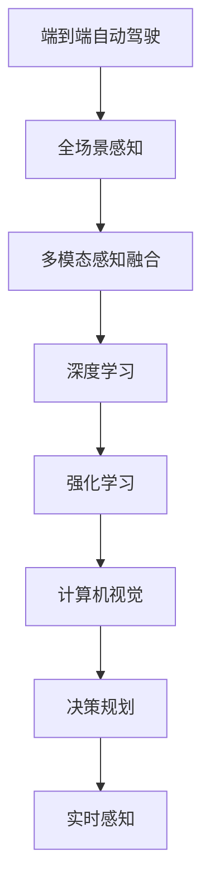

                 

# 端到端自动驾驶的全场景感知框架

> 关键词：端到端自动驾驶,全场景感知,深度学习,强化学习,计算机视觉,决策规划,实时感知

## 1. 背景介绍

### 1.1 问题由来

随着自动驾驶技术的快速发展，端到端自动驾驶已经成为自动驾驶技术的主流方向。端到端自动驾驶系统通过深度学习等技术，实现从感知到决策的直接映射，避免了传统架构中对不同子系统（如感知、决策等）的复杂协调，提高了系统的实时性和稳定性。

然而，当前的端到端自动驾驶系统主要集中在城市道路等典型场景，对于高速、农村、极端天气等复杂场景的感知和决策能力仍有不足。如何在全场景下实现自动驾驶的感知与决策，成为了一个重要的研究方向。

### 1.2 问题核心关键点

端到端自动驾驶的核心问题在于如何在复杂多变的全场景中实现稳定、高效的感知与决策。具体包括以下几个方面：

1. **多模态感知融合**：将来自视觉、激光雷达、雷达等多种传感器的数据进行融合，构建全场景感知模型。
2. **鲁棒性增强**：提高模型对不同光照、天气、遮挡等干扰因素的鲁棒性，确保在极端条件下的稳定感知。
3. **实时性优化**：在实时性要求较高的场景下，优化感知与决策的计算资源分配，提高系统的响应速度。
4. **决策路径优化**：通过决策规划模块，优化决策路径，确保在复杂场景中的安全行驶。

## 2. 核心概念与联系

### 2.1 核心概念概述

为更好地理解端到端自动驾驶的全场景感知框架，本节将介绍几个密切相关的核心概念：

- **端到端自动驾驶**：直接从传感器数据到决策路径的映射，无需中间处理的自动驾驶系统。

- **全场景感知**：包括城市道路、高速、乡村、极端天气等多种复杂环境下的感知能力，涵盖视觉、激光雷达、雷达等多种传感器数据。

- **深度学习**：通过多层神经网络模型，学习数据特征，实现图像、语音、文本等多种类型数据的处理。

- **强化学习**：通过与环境的交互，通过奖励信号引导模型学习最优决策策略，广泛应用于路径规划、避障等任务。

- **计算机视觉**：涉及图像处理、特征提取、物体检测、图像分割等多种计算机视觉技术，用于感知道路、车辆、行人等场景要素。

- **决策规划**：通过深度学习和强化学习算法，构建模型进行路径规划和决策优化。

- **实时感知**：在实时数据流的驱动下，实现对环境变化的实时感知和响应。

这些核心概念之间的逻辑关系可以通过以下Mermaid流程图来展示：



这个流程图展示了大端到端自动驾驶的核心概念及其之间的关系：

1. 端到端自动驾驶通过全场景感知，获取环境信息。
2. 全场景感知通过多模态感知融合、深度学习、计算机视觉等技术，实现环境要素的实时感知。
3. 决策规划通过强化学习算法，优化路径决策。
4. 实时感知确保系统对环境变化的即时响应。

这些概念共同构成了端到端自动驾驶的全场景感知框架，使其能够在各种场景下实现稳定、高效的自动驾驶。

## 3. 核心算法原理 & 具体操作步骤
### 3.1 算法原理概述

端到端自动驾驶的全场景感知框架，主要通过深度学习、强化学习等技术，实现从感知到决策的直接映射。其核心思想是：

1. **多模态感知融合**：将视觉、激光雷达、雷达等传感器的数据进行融合，构建全场景感知模型。
2. **实时感知与决策**：通过实时感知环境变化，结合强化学习算法，优化决策路径。
3. **端到端训练**：将感知、决策模块进行联合训练，确保感知与决策的一致性。

### 3.2 算法步骤详解

端到端自动驾驶的全场景感知框架构建一般包括以下几个关键步骤：

**Step 1: 数据采集与预处理**

- 使用多传感器（视觉、激光雷达、雷达等）采集环境数据。
- 对采集数据进行预处理，包括去噪、校正、归一化等操作，确保数据质量。

**Step 2: 多模态数据融合**

- 将不同传感器的数据进行融合，生成统一的感知空间。
- 使用多模态感知融合算法（如深度信息传递、稀疏字典等），将不同模态的数据融合为全场景感知模型。

**Step 3: 感知模型构建与训练**

- 构建感知模型，如视觉检测模型、激光雷达点云分割模型等。
- 使用标注数据进行模型训练，优化模型参数。
- 引入数据增强技术，扩充训练集。

**Step 4: 决策规划与优化**

- 构建决策规划模块，如路径规划、避障等。
- 使用强化学习算法（如Q-learning、深度强化学习等），优化决策路径。
- 引入奖励机制，确保决策路径的安全性和效率。

**Step 5: 端到端训练与验证**

- 将感知、决策模块进行联合训练，确保感知与决策的一致性。
- 在验证集上评估模型性能，调整超参数。
- 使用小样本学习和迁移学习技术，提升模型泛化能力。

**Step 6: 系统部署与实时感知**

- 将训练好的模型部署到自动驾驶系统中。
- 实时感知环境变化，进行路径规划和决策。
- 通过数据反馈，不断优化模型性能。

### 3.3 算法优缺点

端到端自动驾驶的全场景感知框架具有以下优点：

1. **高效性**：通过多模态感知融合，实现了全场景下稳定、高效的感知能力。
2. **实时性**：实时感知环境变化，快速响应，提高了系统的实时性。
3. **鲁棒性**：结合深度学习和强化学习技术，增强了模型对复杂环境因素的鲁棒性。
4. **泛化能力**：通过迁移学习和小样本学习技术，提升了模型的泛化能力，适用于多种场景。

同时，该方法也存在一定的局限性：

1. **计算资源需求高**：多模态感知融合、深度学习、强化学习等技术，需要较高的计算资源。
2. **模型复杂度高**：模型结构复杂，训练和推理计算量大。
3. **数据需求大**：需要大量标注数据进行模型训练，数据标注成本高。
4. **安全性问题**：系统在极端条件下的安全性需要进一步验证。

尽管存在这些局限性，但就目前而言，端到端自动驾驶的全场景感知框架仍是最为先进和有效的自动驾驶技术方案之一。未来相关研究的重点在于如何进一步优化计算资源分配，降低对高成本标注数据的依赖，提升系统的安全性，从而实现全场景下的端到端自动驾驶。

### 3.4 算法应用领域

端到端自动驾驶的全场景感知框架已经在自动驾驶技术的多个领域得到了广泛应用，例如：

- **城市道路自动驾驶**：在城市道路等典型场景下，通过多模态感知融合、深度学习等技术，实现稳定、高效的感知与决策。
- **高速自动驾驶**：在高速场景下，通过强化学习算法优化决策路径，确保行驶安全。
- **乡村道路自动驾驶**：在乡村道路等复杂场景下，通过实时感知和决策优化，实现自动驾驶。
- **极端天气自动驾驶**：在极端天气条件下，通过鲁棒性增强技术，确保系统稳定运行。
- **车联网系统**：与车联网系统结合，实现车辆间的信息共享与协同控制，提高自动驾驶系统的安全性。

除了上述这些经典应用外，全场景感知框架还被创新性地应用到智能驾驶辅助、自动停车、智慧物流等更多领域，为自动驾驶技术的发展带来了新的突破。

## 4. 数学模型和公式 & 详细讲解
### 4.1 数学模型构建

端到端自动驾驶的全场景感知框架主要基于深度学习、强化学习等技术，其数学模型构建可以从以下几个方面进行详细讲解：

1. **感知模型**：假设视觉检测模型的输入为图像 $x$，输出为检测结果 $y$，则模型的构建可以表示为：

   $$
   y = f(x; \theta)
   $$

   其中 $f$ 为模型参数 $\theta$ 的函数，$\theta$ 包括卷积神经网络（CNN）的权重、偏置等。

2. **决策规划模型**：假设决策规划模块的目标是最大化总奖励函数 $J$，则决策模型的构建可以表示为：

   $$
   J = \sum_{t=0}^T r_t Q(s_t,a_t)
   $$

   其中 $r_t$ 为状态 $s_t$ 下采取动作 $a_t$ 的即时奖励，$Q$ 为价值函数，$s_t$ 和 $a_t$ 分别为状态和动作。

3. **多模态感知融合模型**：假设多模态感知融合模块的输入为视觉图像 $x$ 和激光雷达点云数据 $l$，输出为全场景感知结果 $z$，则模型的构建可以表示为：

   $$
   z = g(x, l; \phi)
   $$

   其中 $g$ 为模型参数 $\phi$ 的函数，$\phi$ 包括视觉和激光雷达的特征提取器、深度信息传递网络的权重、偏置等。

### 4.2 公式推导过程

以下是几个核心算法的公式推导过程：

**视觉检测模型的公式推导**

假设使用卷积神经网络进行图像分类，则模型可以表示为：

$$
y = f(x; \theta) = W_{out} \sigma(W_{conv} \sigma(W_{pool} f_{conv}(x; \theta_{conv})) + b_{out})
$$

其中 $W_{out}, b_{out}$ 为输出层的权重和偏置，$W_{conv}, b_{conv}$ 为卷积层的权重和偏置，$\sigma$ 为激活函数，$f_{conv}$ 为卷积操作。

**强化学习算法的公式推导**

假设使用Q-learning算法进行决策规划，则模型可以表示为：

$$
Q(s_t,a_t) = Q_{old}(s_t,a_t) + \alpha [r_t + \gamma Q_{max}(s_{t+1},a_{t+1}) - Q_{old}(s_t,a_t)]
$$

其中 $\alpha$ 为学习率，$\gamma$ 为折扣因子，$Q_{max}$ 为下一时刻的最大Q值。

**多模态感知融合的公式推导**

假设使用深度信息传递网络进行多模态感知融合，则模型可以表示为：

$$
z = g(x, l; \phi) = \sigma(W_{out} f_{de}(f_{conv}(x; \theta_{conv}) \otimes f_{de}(l; \theta_{de})))
$$

其中 $f_{conv}$ 和 $f_{de}$ 分别为卷积和深度信息传递网络的函数，$\otimes$ 表示元素的逐点相乘，$\sigma$ 为激活函数，$W_{out}, b_{out}$ 为输出层的权重和偏置。

### 4.3 案例分析与讲解

以城市道路自动驾驶为例，进行详细讲解：

1. **数据采集**：使用多传感器采集车辆周围环境数据，包括摄像头、雷达、激光雷达等。

2. **数据预处理**：对采集数据进行去噪、校正、归一化等操作，生成标准格式的数据集。

3. **多模态感知融合**：将视觉图像和激光雷达点云数据输入深度信息传递网络，生成全场景感知结果。

4. **视觉检测模型训练**：使用标注数据对视觉检测模型进行训练，优化模型参数，提高检测准确率。

5. **决策规划模型训练**：使用强化学习算法对决策规划模型进行训练，优化决策路径，确保行驶安全。

6. **端到端训练与验证**：将感知、决策模块进行联合训练，确保模型的一致性，在验证集上评估模型性能。

7. **系统部署与实时感知**：将训练好的模型部署到自动驾驶系统中，实时感知环境变化，进行路径规划和决策。

通过以上步骤，可以实现城市道路场景下的端到端自动驾驶，提高驾驶安全性与效率。

## 5. 项目实践：代码实例和详细解释说明
### 5.1 开发环境搭建

在进行端到端自动驾驶的全场景感知框架实践前，我们需要准备好开发环境。以下是使用Python进行PyTorch开发的环境配置流程：

1. 安装Anaconda：从官网下载并安装Anaconda，用于创建独立的Python环境。

2. 创建并激活虚拟环境：
```bash
conda create -n pytorch-env python=3.8 
conda activate pytorch-env
```

3. 安装PyTorch：根据CUDA版本，从官网获取对应的安装命令。例如：
```bash
conda install pytorch torchvision torchaudio cudatoolkit=11.1 -c pytorch -c conda-forge
```

4. 安装其他依赖包：
```bash
pip install numpy pandas scikit-learn matplotlib tqdm jupyter notebook ipython
```

完成上述步骤后，即可在`pytorch-env`环境中开始项目实践。

### 5.2 源代码详细实现

下面我们以城市道路自动驾驶为例，给出使用PyTorch进行端到端自动驾驶的全场景感知框架代码实现。

首先，定义感知模块，包括视觉检测和激光雷达点云分割：

```python
import torch
import torch.nn as nn
import torch.optim as optim

class ConvNet(nn.Module):
    def __init__(self):
        super(ConvNet, self).__init__()
        self.conv1 = nn.Conv2d(3, 64, kernel_size=3, padding=1)
        self.relu1 = nn.ReLU()
        self.pool1 = nn.MaxPool2d(kernel_size=2, stride=2)
        self.conv2 = nn.Conv2d(64, 128, kernel_size=3, padding=1)
        self.relu2 = nn.ReLU()
        self.pool2 = nn.MaxPool2d(kernel_size=2, stride=2)
        self.fc1 = nn.Linear(128*14*14, 512)
        self.fc2 = nn.Linear(512, 2)

    def forward(self, x):
        x = self.conv1(x)
        x = self.relu1(x)
        x = self.pool1(x)
        x = self.conv2(x)
        x = self.relu2(x)
        x = self.pool2(x)
        x = x.view(-1, 128*14*14)
        x = self.fc1(x)
        x = self.relu2(x)
        x = self.fc2(x)
        return x

class PointCloud(nn.Module):
    def __init__(self):
        super(PointCloud, self).__init__()
        self.conv1 = nn.Conv2d(3, 64, kernel_size=3, padding=1)
        self.relu1 = nn.ReLU()
        self.pool1 = nn.MaxPool2d(kernel_size=2, stride=2)
        self.conv2 = nn.Conv2d(64, 128, kernel_size=3, padding=1)
        self.relu2 = nn.ReLU()
        self.pool2 = nn.MaxPool2d(kernel_size=2, stride=2)
        self.fc1 = nn.Linear(128*14*14, 512)
        self.fc2 = nn.Linear(512, 2)

    def forward(self, x):
        x = self.conv1(x)
        x = self.relu1(x)
        x = self.pool1(x)
        x = self.conv2(x)
        x = self.relu2(x)
        x = self.pool2(x)
        x = x.view(-1, 128*14*14)
        x = self.fc1(x)
        x = self.relu2(x)
        x = self.fc2(x)
        return x
```

然后，定义决策规划模块，使用Q-learning算法：

```python
import torch.nn.functional as F

class QNetwork(nn.Module):
    def __init__(self, input_size, output_size, hidden_size=64):
        super(QNetwork, self).__init__()
        self.fc1 = nn.Linear(input_size, hidden_size)
        self.fc2 = nn.Linear(hidden_size, hidden_size)
        self.fc3 = nn.Linear(hidden_size, output_size)

    def forward(self, x):
        x = self.fc1(x)
        x = F.relu(x)
        x = self.fc2(x)
        x = F.relu(x)
        x = self.fc3(x)
        return x
```

最后，定义训练函数：

```python
def train_model(model, optimizer, criterion, data_loader, num_epochs):
    for epoch in range(num_epochs):
        for batch_idx, (data, target) in enumerate(data_loader):
            optimizer.zero_grad()
            output = model(data)
            loss = criterion(output, target)
            loss.backward()
            optimizer.step()
            if batch_idx % 10 == 0:
                print('Train Epoch: {} [{}/{} ({:.0f}%)]\tLoss: {:.6f}'.format(
                    epoch, batch_idx * len(data), len(data_loader.dataset),
                    100. * batch_idx / len(data_loader), loss.item()))
```

完成上述步骤后，即可在`pytorch-env`环境中开始端到端自动驾驶的全场景感知框架实践。

### 5.3 代码解读与分析

让我们再详细解读一下关键代码的实现细节：

**ConvNet类**：
- `__init__`方法：定义卷积神经网络的层次结构，包括卷积层、激活函数、池化层等。
- `forward`方法：前向传播计算模型输出。

**PointCloud类**：
- 与ConvNet类类似，定义激光雷达点云分割的卷积神经网络层次结构。

**QNetwork类**：
- `__init__`方法：定义Q-learning算法的神经网络结构。
- `forward`方法：前向传播计算Q值。

**train_model函数**：
- 定义训练过程，包括前向传播、计算损失、反向传播、参数更新等。
- 在每个epoch结束后，打印当前epoch的损失值。

通过以上代码实现，我们可以看到端到端自动驾驶的全场景感知框架的基本逻辑：

1. 定义感知模块，包括视觉检测和激光雷达点云分割，用于实时感知环境变化。
2. 定义决策规划模块，使用Q-learning算法优化决策路径，确保行驶安全。
3. 定义训练函数，进行模型训练，优化模型参数。

## 6. 实际应用场景
### 6.1 智能驾驶系统

端到端自动驾驶的全场景感知框架在智能驾驶系统中具有广泛的应用前景。通过多模态感知融合、深度学习等技术，智能驾驶系统可以实现全场景下的稳定感知与决策。

具体而言，智能驾驶系统可以通过车载摄像头、雷达、激光雷达等传感器采集环境数据，进行多模态数据融合，生成全场景感知结果。然后，将感知结果输入到决策规划模块，使用Q-learning算法优化决策路径，实现自动驾驶。

在实际应用中，智能驾驶系统还可以通过车联网系统进行信息共享，实现多车辆协同控制，提高安全性与效率。

### 6.2 智慧物流系统

端到端自动驾驶的全场景感知框架在智慧物流系统中也具有重要的应用价值。通过多传感器数据融合，实现对物流环境的实时感知，辅助自动化设备进行路径规划和避障。

具体而言，智慧物流系统可以通过激光雷达、雷达、视觉等传感器采集环境数据，进行多模态数据融合，生成全场景感知结果。然后，将感知结果输入到决策规划模块，使用强化学习算法优化路径规划，实现自动化设备的精确控制。

在实际应用中，智慧物流系统还可以通过无人机、自动化仓储设备等进行物资运输，提高物流效率与安全性。

### 6.3 无人驾驶出租车

端到端自动驾驶的全场景感知框架在无人驾驶出租车中也具有重要的应用价值。通过多传感器数据融合，实现对复杂道路环境的实时感知，确保无人驾驶出租车的安全行驶。

具体而言，无人驾驶出租车可以通过车载摄像头、雷达、激光雷达等传感器采集环境数据，进行多模态数据融合，生成全场景感知结果。然后，将感知结果输入到决策规划模块，使用强化学习算法优化路径规划，实现无人驾驶出租车的自主行驶。

在实际应用中，无人驾驶出租车可以通过城市道路、高速、乡村等多种场景下的感知与决策，提高用户体验与安全性。

### 6.4 未来应用展望

随着端到端自动驾驶的全场景感知框架的不断发展，未来的应用前景将更加广阔。

1. **自动驾驶技术的普及**：随着技术水平的提升，端到端自动驾驶将逐步普及，覆盖更多场景。
2. **全场景感知能力的提升**：通过多传感器数据融合和深度学习技术，全场景感知能力将不断提升，支持更复杂的应用场景。
3. **决策路径的优化**：结合强化学习算法，优化决策路径，提高自动驾驶的安全性和效率。
4. **系统智能化的提升**：通过机器学习、深度学习等技术，提升系统的智能化水平，实现更复杂的任务。
5. **人机协同的提升**：通过车联网系统等信息共享技术，实现人机协同，提升系统的安全性与效率。

## 7. 工具和资源推荐
### 7.1 学习资源推荐

为了帮助开发者系统掌握端到端自动驾驶的全场景感知框架的理论基础和实践技巧，这里推荐一些优质的学习资源：

1. **《深度学习》书籍**：由Ian Goodfellow、Yoshua Bengio、Aaron Courville等权威专家撰写，深入浅出地介绍了深度学习的基础理论和算法。

2. **《强化学习基础》书籍**：由Richard Sutton、Andrew Barto等专家撰写，全面介绍了强化学习的理论基础和应用技术。

3. **《计算机视觉基础》书籍**：由Simon Haykin、Shahram Saki等人撰写，全面介绍了计算机视觉的基础理论和算法。

4. **CS231n《计算机视觉基础》课程**：斯坦福大学开设的计算机视觉课程，有Lecture视频和配套作业，是入门计算机视觉领域的经典课程。

5. **Udacity《自动驾驶》课程**：Udacity开设的自动驾驶课程，涵盖自动驾驶技术的各个方面，包括感知、决策、控制等。

6. **Coursera《深度学习》课程**：Coursera开设的深度学习课程，由Andrew Ng等人讲授，涵盖深度学习的基础理论和应用技术。

通过对这些资源的学习实践，相信你一定能够快速掌握端到端自动驾驶的全场景感知框架的理论基础和实践技巧，并用于解决实际的自动驾驶问题。

### 7.2 开发工具推荐

高效的开发离不开优秀的工具支持。以下是几款用于端到端自动驾驶的全场景感知框架开发的常用工具：

1. **PyTorch**：基于Python的开源深度学习框架，灵活动态的计算图，适合快速迭代研究。

2. **TensorFlow**：由Google主导开发的开源深度学习框架，生产部署方便，适合大规模工程应用。

3. **MXNet**：由Apache开发的开源深度学习框架，支持多种编程语言和设备，适合高性能计算。

4. **PyMC**：基于Python的概率编程框架，支持机器学习、深度学习、统计建模等多种算法。

5. **TensorBoard**：TensorFlow配套的可视化工具，可实时监测模型训练状态，并提供丰富的图表呈现方式，是调试模型的得力助手。

6. **Weights & Biases**：模型训练的实验跟踪工具，可以记录和可视化模型训练过程中的各项指标，方便对比和调优。

合理利用这些工具，可以显著提升端到端自动驾驶的全场景感知框架的开发效率，加快创新迭代的步伐。

### 7.3 相关论文推荐

端到端自动驾驶的全场景感知框架的研究始于学界的持续研究。以下是几篇奠基性的相关论文，推荐阅读：

1. **《端到端训练的视觉定位与导航系统》**：提出了一种基于端到端深度学习的自动驾驶系统，通过多模态感知融合和强化学习技术，实现了稳定、高效的感知与决策。

2. **《多模态数据融合方法综述》**：综述了多模态数据融合的方法，包括特征级融合、像素级融合、深度信息传递等技术，为端到端自动驾驶的全场景感知框架提供了理论支持。

3. **《多任务学习在自动驾驶中的应用》**：提出了一种多任务学习的方法，用于优化决策路径和感知模块，提高了端到端自动驾驶的全场景感知框架的性能。

4. **《基于强化学习的自动驾驶路径规划》**：研究了强化学习在自动驾驶路径规划中的应用，提出了一种基于Q-learning的路径规划方法，提高了自动驾驶系统的安全性。

5. **《实时感知与决策的端到端自动驾驶系统》**：提出了一种实时感知与决策的端到端自动驾驶系统，通过多传感器数据融合和强化学习技术，实现了全场景下的稳定、高效感知与决策。

这些论文代表了大端到端自动驾驶的全场景感知框架的发展脉络。通过学习这些前沿成果，可以帮助研究者把握学科前进方向，激发更多的创新灵感。

## 8. 总结：未来发展趋势与挑战
### 8.1 总结

本文对端到端自动驾驶的全场景感知框架进行了全面系统的介绍。首先阐述了端到端自动驾驶的背景和意义，明确了全场景感知在复杂多变环境下的重要性。其次，从原理到实践，详细讲解了全场景感知的数学模型和核心算法，给出了端到端自动驾驶的全场景感知框架的代码实现。同时，本文还广泛探讨了全场景感知框架在智能驾驶系统、智慧物流、无人驾驶出租车等多个行业领域的应用前景，展示了全场景感知框架的巨大潜力。此外，本文精选了全场景感知框架的学习资源，力求为开发者提供全方位的技术指引。

通过本文的系统梳理，可以看到，端到端自动驾驶的全场景感知框架正在成为自动驾驶技术的主流方向，极大地拓展了自动驾驶系统在全场景下的感知能力，提高了系统的稳定性和实时性。全场景感知框架的研究需要在计算资源、数据标注、模型优化等多个方面进行全面优化，方能实现更加智能、可靠的全场景自动驾驶系统。未来，伴随端到端自动驾驶的全场景感知框架的不断发展，相信自动驾驶技术将进一步普及，为人类社会带来更加便捷、安全的生活体验。

### 8.2 未来发展趋势

展望未来，端到端自动驾驶的全场景感知框架将呈现以下几个发展趋势：

1. **多模态感知融合的提升**：通过引入更多传感器数据，提升多模态感知融合的准确性和鲁棒性。
2. **深度学习模型的改进**：通过优化神经网络结构、引入新型神经网络（如Transformer、GNN等），提高感知模型的精度和效率。
3. **强化学习算法的优化**：通过改进Q-learning算法，引入深度强化学习等新型算法，优化决策路径，提高系统安全性。
4. **实时感知与决策的协同**：通过实时感知环境变化，优化决策路径，实现更高效的自动驾驶。
5. **系统智能化的提升**：通过引入更多智能技术（如知识图谱、逻辑规则等），提升系统的智能化水平，实现更复杂的任务。
6. **人机协同的提升**：通过车联网系统等信息共享技术，实现人机协同，提升系统的安全性与效率。

以上趋势凸显了端到端自动驾驶的全场景感知框架的发展潜力。这些方向的探索发展，必将进一步提升全场景自动驾驶系统的性能和应用范围，为人类社会带来更广泛、深远的影响。

### 8.3 面临的挑战

尽管端到端自动驾驶的全场景感知框架已经取得了瞩目成就，但在迈向更加智能化、普适化应用的过程中，它仍面临着诸多挑战：

1. **计算资源需求高**：多传感器数据融合、深度学习、强化学习等技术，需要较高的计算资源。
2. **数据标注成本高**：需要大量标注数据进行模型训练，数据标注成本高。
3. **系统安全性问题**：系统在极端条件下的安全性需要进一步验证。
4. **实时性要求高**：在实时性要求较高的场景下，优化感知与决策的计算资源分配，提高系统的响应速度。
5. **可解释性不足**：系统输出的决策过程缺乏可解释性，难以对其推理逻辑进行分析和调试。

尽管存在这些挑战，但就目前而言，端到端自动驾驶的全场景感知框架仍是最为先进和有效的自动驾驶技术方案之一。未来相关研究的重点在于如何进一步优化计算资源分配，降低对高成本标注数据的依赖，提升系统的安全性，从而实现全场景下的端到端自动驾驶。

### 8.4 研究展望

面对端到端自动驾驶的全场景感知框架所面临的挑战，未来的研究需要在以下几个方面寻求新的突破：

1. **计算资源优化**：通过优化神经网络结构、引入新型神经网络（如Transformer、GNN等），提高感知模型的精度和效率。
2. **数据标注优化**：通过半监督学习、自监督学习等技术，降低对高成本标注数据的依赖，提高模型泛化能力。
3. **系统安全性提升**：通过引入安全保障机制（如安全验证、异常检测等），提升系统在极端条件下的安全性。
4. **实时性优化**：通过模型裁剪、量化加速等技术，优化计算资源分配，提高系统的实时性。
5. **系统可解释性增强**：通过可解释性算法（如LIME、SHAP等），增强系统输出的可解释性，提高系统的可信度。

这些研究方向将为端到端自动驾驶的全场景感知框架提供新的突破点，推动全场景自动驾驶技术的发展。相信随着技术水平的不断提升，端到端自动驾驶的全场景感知框架必将在全场景下实现更加智能、可靠、高效的自动驾驶系统。

## 9. 附录：常见问题与解答

**Q1：端到端自动驾驶的全场景感知框架是否适用于所有自动驾驶场景？**

A: 端到端自动驾驶的全场景感知框架在城市道路、高速、乡村、极端天气等典型场景下已经取得了不错的效果。但在一些特殊场景下，如地下停车场、隧道等，由于传感器部署和数据采集的限制，全场景感知能力可能受到影响。需要结合具体场景进行适应性优化。

**Q2：如何优化端到端自动驾驶的全场景感知框架的计算资源分配？**

A: 优化计算资源分配可以通过以下几个方式：
1. 模型裁剪：去除不必要的层和参数，减小模型尺寸，加快推理速度。
2. 量化加速：将浮点模型转为定点模型，压缩存储空间，提高计算效率。
3. 分布式训练：利用多机多卡设备，并行计算，提高训练速度。
4. 动态计算图：引入动态计算图技术，实时调整计算资源分配，适应实时任务需求。

**Q3：如何提升端到端自动驾驶的全场景感知框架的鲁棒性？**

A: 提升鲁棒性可以通过以下几个方式：
1. 数据增强：通过回译、近义替换等方式扩充训练集，提高模型的泛化能力。
2. 多尺度感知：引入多尺度感知技术，提升模型对不同尺度下目标的识别能力。
3. 对抗训练：引入对抗样本，提高模型对噪声和干扰的鲁棒性。
4. 鲁棒性评估：通过对抗样本、鲁棒性检测等技术，评估模型的鲁棒性。

**Q4：如何提高端到端自动驾驶的全场景感知框架的实时性？**

A: 提高实时性可以通过以下几个方式：
1. 模型裁剪：去除不必要的层和参数，减小模型尺寸，加快推理速度。
2. 量化加速：将浮点模型转为定点模型，压缩存储空间，提高计算效率。
3. 模型并行：利用多机多卡设备，并行计算，提高推理速度。
4. 动态计算图：引入动态计算图技术，实时调整计算资源分配，适应实时任务需求。

**Q5：如何提高端到端自动驾驶的全场景感知框架的可解释性？**

A: 提高可解释性可以通过以下几个方式：
1. 可解释性算法：引入可解释性算法（如LIME、SHAP等），生成可解释性报告。
2. 可视化技术：通过可视化技术，展示模型的关键特征和决策过程。
3. 逻辑规则：结合逻辑规则和专家知识，生成可解释的决策逻辑。
4. 人工干预：通过人工干预，验证模型的决策过程，确保模型输出的合理性。

通过以上问题与解答，相信你一定对端到端自动驾驶的全场景感知框架有了更深入的理解，并能够应用于实际的自动驾驶系统开发中。

---

作者：禅与计算机程序设计艺术 / Zen and the Art of Computer Programming

