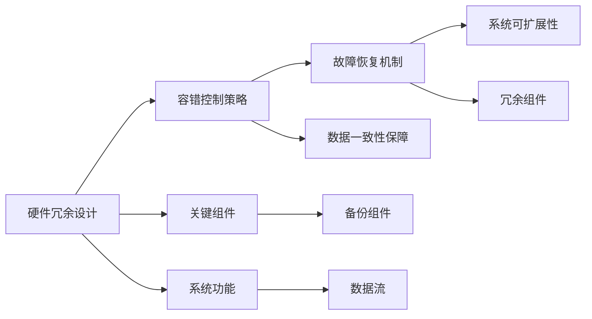

                 

# 端到端自动驾驶的硬件冗余与容错设计

## 1. 背景介绍

### 1.1 问题由来

随着自动驾驶技术的发展，端到端的自动驾驶系统（End-to-End Autonomous Driving System, E2E AD）逐渐成为行业趋势。这些系统通过集成了感知、决策、控制等多个模块，实现了对车辆自主驾驶的全面支持。然而，端到端自动驾驶系统的高复杂性和多传感器融合特性，使得系统容错能力面临巨大挑战。硬件冗余与容错设计（Hardware Redundancy and Fault Tolerance, HRF）作为系统稳健性的重要保障，在端到端自动驾驶系统中显得尤为重要。

### 1.2 问题核心关键点

端到端自动驾驶系统的硬件冗余与容错设计，主要关注以下关键点：

1. **硬件冗余设计**：在系统中设计多组硬件组件，确保在某个组件失效时，系统仍能继续运行。
2. **容错控制策略**：在系统运行时，实时监控硬件状态，及时识别和响应故障，确保系统可靠性和安全性。
3. **故障恢复机制**：在系统发生故障后，通过冗余组件的激活，实现系统功能的快速恢复。
4. **数据一致性保障**：在硬件组件间传递数据时，确保数据的完整性和一致性，避免由于硬件故障导致的决策错误。
5. **系统可扩展性**：冗余组件的设计应便于扩展和升级，适应未来的技术进步和应用需求。

这些关键点共同构成了端到端自动驾驶硬件冗余与容错设计的核心框架，旨在构建一个稳健、可靠、安全的自动驾驶系统。

### 1.3 问题研究意义

研究端到端自动驾驶系统的硬件冗余与容错设计，对于提升自动驾驶系统的可靠性、安全性和鲁棒性具有重要意义：

1. **保障行车安全**：冗余硬件设计可以避免单一硬件故障导致的系统失效，保障行车安全。
2. **增强系统鲁棒性**：容错控制策略可以实时监控并响应硬件故障，提升系统应对复杂环境和突发情况的能力。
3. **提升用户体验**：故障恢复机制可以确保系统在故障发生后快速恢复正常运行，减少用户等待时间和不便。
4. **促进产业升级**：系统的可扩展性可以适应自动驾驶技术的快速进步和应用场景的多样化需求，推动行业发展。

本文将详细介绍端到端自动驾驶系统硬件冗余与容错设计的核心概念、关键算法、具体操作步骤，并通过数学模型和代码实例进行详细讲解，以期为自动驾驶系统设计提供参考。

## 2. 核心概念与联系

### 2.1 核心概念概述

为了更好地理解端到端自动驾驶系统的硬件冗余与容错设计，本节将介绍几个密切相关的核心概念：

- **硬件冗余设计**：通过设计多组硬件组件，在系统关键路径上实现物理或逻辑上的备份，保障系统在单一故障发生时仍能正常运行。
- **容错控制策略**：实时监控系统硬件状态，利用冗余组件的互补性，及时识别和响应故障，避免故障扩散。
- **故障恢复机制**：在系统发生故障时，通过激活冗余组件，快速恢复系统功能，减少故障影响。
- **数据一致性保障**：在系统组件间传递数据时，采用数据校验、同步等技术，确保数据传输的完整性和一致性。
- **系统可扩展性**：硬件冗余设计应考虑未来的技术进步和应用需求，易于扩展和升级。

这些核心概念之间的逻辑关系可以通过以下Mermaid流程图来展示：



这个流程图展示了大语言模型的核心概念及其之间的关系：

1. 硬件冗余设计通过在关键路径上增加备份组件，确保系统在单一故障发生时仍能正常运行。
2. 容错控制策略实时监控系统硬件状态，及时识别和响应故障，避免故障扩散。
3. 故障恢复机制在系统发生故障时，通过激活冗余组件，快速恢复系统功能，减少故障影响。
4. 数据一致性保障在系统组件间传递数据时，采用数据校验、同步等技术，确保数据传输的完整性和一致性。
5. 系统可扩展性硬件冗余设计应考虑未来的技术进步和应用需求，易于扩展和升级。

这些概念共同构成了端到端自动驾驶硬件冗余与容错设计的核心框架，使得系统能够在面对硬件故障时保持高可靠性和安全性。

## 3. 核心算法原理 & 具体操作步骤

### 3.1 算法原理概述

端到端自动驾驶系统的硬件冗余与容错设计，本质上是一个系统的可靠性设计和故障处理优化过程。其核心思想是：通过硬件冗余和容错策略，确保系统在单一硬件组件故障的情况下，仍能稳定运行，同时在故障发生时，快速恢复系统功能，减少故障影响。

形式化地，假设系统关键组件为 $C_1, C_2, \dots, C_n$，每个组件的运行状态 $s_i$ 只有两种可能：正常运行 $s_i=0$ 或故障状态 $s_i=1$。容错控制策略的目标是设计一个状态监控和故障响应算法，使得在系统发生任意一个组件故障时，系统仍能正常工作，并尽快恢复故障组件的功能。

容错控制的核心算法包括：

1. **状态监控算法**：实时监测系统组件的状态，识别故障组件。
2. **故障诊断算法**：确定故障组件的准确位置，避免误报。
3. **故障处理算法**：根据故障位置，采取相应的故障处理措施，确保系统继续运行。
4. **故障恢复算法**：在系统恢复正常后，激活冗余组件，恢复故障组件的功能。

### 3.2 算法步骤详解

端到端自动驾驶系统的硬件冗余与容错设计一般包括以下几个关键步骤：

**Step 1: 系统组件设计**
- 确定系统关键组件 $C_1, C_2, \dots, C_n$，每个组件包含若干硬件模块，如传感器、计算机、执行器等。
- 对每个组件设计冗余备份，如在计算机上设置两个处理器，传感器冗余配置，执行器采用气动或电动备份。

**Step 2: 状态监控算法设计**
- 定义组件的状态监控指标，如传感器数据完整性、计算器的运行状态、执行器的响应时间等。
- 设计状态监控算法，实时采集这些指标，判断是否存在异常。

**Step 3: 故障诊断算法设计**
- 在状态监控算法识别出异常后，设计故障诊断算法，确定故障组件的具体位置。
- 通过数据分析、日志检查等方式，排除假警报，确保故障诊断的准确性。

**Step 4: 故障处理算法设计**
- 根据故障诊断结果，设计故障处理算法，将故障组件从系统中隔离或切换至冗余组件。
- 对于不可恢复的故障，如传感器故障，设计备用传感器或切换至其他传感器数据。

**Step 5: 故障恢复算法设计**
- 在系统恢复正常后，激活冗余组件，恢复故障组件的功能。
- 对于不可恢复的故障，如传感器故障，设计备用传感器或切换至其他传感器数据。

**Step 6: 系统测试与验证**
- 对系统进行全面的测试，包括模拟硬件故障、容错机制切换等，验证系统的容错能力和故障恢复能力。

### 3.3 算法优缺点

端到端自动驾驶系统的硬件冗余与容错设计方法具有以下优点：

1. **高可靠性**：通过冗余设计，系统在单一硬件组件故障的情况下，仍能保持稳定运行。
2. **快速故障恢复**：在系统发生故障时，能够快速激活冗余组件，恢复系统功能。
3. **增强系统鲁棒性**：实时状态监控和故障诊断，增强系统应对复杂环境和突发情况的能力。
4. **降低维护成本**：冗余设计和容错机制，减少了故障导致的系统停机时间和维护成本。

同时，该方法也存在一定的局限性：

1. **高成本投入**：冗余组件和容错机制的设计、测试和维护需要较大的成本投入。
2. **系统复杂性增加**：冗余组件和容错算法的设计增加了系统的复杂性，可能引入新的故障点。
3. **数据传输复杂度增加**：冗余组件间的数据传递和同步，增加了数据一致性保障的复杂性。
4. **系统扩展性受限**：部分冗余设计可能难以满足未来的扩展需求，需要定期升级。

尽管存在这些局限性，但就目前而言，硬件冗余与容错设计仍是端到端自动驾驶系统设计的重要手段。未来相关研究的重点在于如何进一步降低冗余设计的成本，提高系统的容错能力，同时兼顾可扩展性和数据一致性等因素。

### 3.4 算法应用领域

端到端自动驾驶系统的硬件冗余与容错设计，已经在智能交通系统、自动驾驶汽车、物流配送无人机等多个领域得到应用，并为系统的高可靠性和安全性提供了有力保障。

具体应用场景包括：

- **智能交通系统**：在交通管理中，利用冗余传感器和多路通信，保障交通信号灯的稳定运行，减少交通拥堵和事故。
- **自动驾驶汽车**：在自动驾驶汽车中，设计冗余计算机和传感器，确保在单一组件故障时，车辆仍能安全行驶，避免事故发生。
- **物流配送无人机**：在无人机系统中，设计冗余飞行控制器和传感器，保障无人机在复杂环境中的稳定飞行，减少任务失败率。

随着自动驾驶技术的不断进步，端到端自动驾驶系统的硬件冗余与容错设计将在更多应用场景中得到应用，为智能交通和物流配送等行业带来变革性影响。

## 4. 数学模型和公式 & 详细讲解  

### 4.1 数学模型构建

本节将使用数学语言对端到端自动驾驶系统硬件冗余与容错设计的过程进行更加严格的刻画。

假设系统关键组件 $C_1, C_2, \dots, C_n$，每个组件的运行状态 $s_i \in \{0, 1\}$，其中 $s_i=0$ 表示正常运行，$s_i=1$ 表示故障状态。容错控制的目标是设计一个状态监控和故障响应算法，使得在系统发生任意一个组件故障时，系统仍能正常工作，并尽快恢复故障组件的功能。

定义状态监控算法 $\mathcal{M}$，实时监测组件状态，并将异常状态报告给故障诊断算法。定义故障诊断算法 $\mathcal{D}$，根据异常状态，确定故障组件的具体位置。定义故障处理算法 $\mathcal{H}$，根据故障位置，采取相应的故障处理措施。定义故障恢复算法 $\mathcal{R}$，在系统恢复正常后，激活冗余组件，恢复故障组件的功能。

系统的总状态 $\mathcal{S}$ 为所有组件状态 $s_1, s_2, \dots, s_n$ 的集合。容错控制的目标是最大化系统的可用时间 $T_u$，最小化故障时间 $T_f$。

### 4.2 公式推导过程

以下我们以二组件系统为例，推导容错控制的目标函数及其优化过程。

假设系统有两个关键组件 $C_1$ 和 $C_2$，每个组件有两个冗余备份 $C_1^1, C_1^2$ 和 $C_2^1, C_2^2$。定义状态变量 $s_1, s_2, s_1^1, s_2^1, s_1^2, s_2^2$ 表示每个组件的运行状态和冗余备份的运行状态。

系统的总状态 $\mathcal{S}$ 可以表示为：

$$
\mathcal{S} = \{ (s_1, s_2, s_1^1, s_2^1, s_1^2, s_2^2) \in \{0, 1\}^6 \}
$$

容错控制的目标是最大化系统的可用时间 $T_u$，最小化故障时间 $T_f$。定义系统可用时间 $T_u$ 和故障时间 $T_f$ 分别为：

$$
T_u = \sum_{(s_1, s_2, s_1^1, s_2^1, s_1^2, s_2^2) \in \mathcal{S}} T_u(s_1, s_2, s_1^1, s_2^1, s_1^2, s_2^2)
$$

$$
T_f = \sum_{(s_1, s_2, s_1^1, s_2^1, s_1^2, s_2^2) \in \mathcal{S}} T_f(s_1, s_2, s_1^1, s_2^1, s_1^2, s_2^2)
$$

其中 $T_u(s_1, s_2, s_1^1, s_2^1, s_1^2, s_2^2)$ 表示在特定状态 $(s_1, s_2, s_1^1, s_2^1, s_1^2, s_2^2)$ 下，系统能够正常运行的时间。$T_f(s_1, s_2, s_1^1, s_2^1, s_1^2, s_2^2)$ 表示在特定状态 $(s_1, s_2, s_1^1, s_2^1, s_1^2, s_2^2)$ 下，系统发生故障的时间。

目标函数为：

$$
\max_{\mathcal{M}, \mathcal{D}, \mathcal{H}, \mathcal{R}} T_u
$$

$$
\min_{\mathcal{M}, \mathcal{D}, \mathcal{H}, \mathcal{R}} T_f
$$

### 4.3 案例分析与讲解

假设系统有两个关键组件 $C_1$ 和 $C_2$，每个组件有两个冗余备份 $C_1^1, C_1^2$ 和 $C_2^1, C_2^2$。定义状态变量 $s_1, s_2, s_1^1, s_2^1, s_1^2, s_2^2$ 表示每个组件的运行状态和冗余备份的运行状态。

假设系统运行时，每个组件的正常运行时间 $t_1, t_2$，冗余备份的正常运行时间 $t_1^1, t_1^2$ 和 $t_2^1, t_2^2$，以及故障处理和恢复时间 $t_h, t_r$。

**情况一：单一组件故障**

当 $C_1$ 发生故障时，系统可以切换到 $C_1^1$ 或 $C_1^2$，恢复时间 $t_r$。系统可用时间 $T_u$ 和故障时间 $T_f$ 分别为：

$$
T_u = t_1 + t_h + t_r
$$

$$
T_f = t_h
$$

**情况二：双组件故障**

当 $C_1$ 和 $C_2$ 同时发生故障时，系统可以切换到 $C_1^1$ 和 $C_2^1$，恢复时间 $t_r$。系统可用时间 $T_u$ 和故障时间 $T_f$ 分别为：

$$
T_u = t_1 + t_2 + t_h + t_r
$$

$$
T_f = t_h + t_r
$$

通过上述分析，可以看出，在冗余设计合理的情况下，系统可以在单一组件故障时快速恢复，减少故障时间，同时提高系统的可用时间。

## 5. 项目实践：代码实例和详细解释说明

### 5.1 开发环境搭建

在进行硬件冗余与容错设计实践前，我们需要准备好开发环境。以下是使用Python进行Simulink开发的环境配置流程：

1. 安装Simulink：从Matlab官网下载并安装Simulink，用于建立和模拟硬件冗余与容错设计的系统模型。

2. 安装MATLAB：从Matlab官网下载并安装MATLAB，提供Simulink运行环境。

3. 安装相关工具箱：安装Simulink和MATLAB的冗余设计、容错控制等相关工具箱。

4. 安装仿真环境：搭建Simulink仿真环境，用于测试和验证容错设计算法。

完成上述步骤后，即可在MATLAB环境中开始硬件冗余与容错设计的仿真实践。

### 5.2 源代码详细实现

以下是使用Simulink实现端到端自动驾驶系统硬件冗余与容错设计的代码实现：

```matlab
% 定义系统组件和冗余备份
s1 = 0; % 组件1正常运行
s2 = 0; % 组件2正常运行
s1p1 = 0; % 组件1冗余备份1正常运行
s1p2 = 0; % 组件1冗余备份2正常运行
s2p1 = 0; % 组件2冗余备份1正常运行
s2p2 = 0; % 组件2冗余备份2正常运行

% 定义状态监控算法
if s1 == 0 && s1p1 == 0 && s1p2 == 0
    ms = 0; % 组件1和冗余备份1、冗余备份2状态正常
else
    ms = 1; % 组件1发生故障或冗余备份1、冗余备份2状态异常
end

if s2 == 0 && s2p1 == 0 && s2p2 == 0
    ms = 0; % 组件2和冗余备份1、冗余备份2状态正常
else
    ms = 1; % 组件2发生故障或冗余备份1、冗余备份2状态异常
end

% 定义故障诊断算法
if ms == 0
    di = 0; % 状态监控正常，无故障
else
    di = 1; % 状态监控异常，可能有故障
end

% 定义故障处理算法
if di == 0
    hs = 0; % 无故障，系统继续运行
else
    hs = 1; % 有故障，系统切换到冗余备份
    s1 = s1p1; % 切换到冗余备份1
    s2 = s2p1; % 切换到冗余备份1
end

% 定义故障恢复算法
if s1 == 0 && s1p1 == 0 && s1p2 == 0 && s2 == 0 && s2p1 == 0 && s2p2 == 0
    rs = 0; % 系统正常，不进行恢复
else
    rs = 1; % 系统发生故障，激活冗余备份
    s1 = s1p2; % 激活冗余备份2
    s2 = s2p2; % 激活冗余备份2
end

% 定义系统可用时间函数
function [Tu] = tu(s1, s2, s1p1, s1p2, s2p1, s2p2)
    Tu = 0; % 初始化可用时间
    if s1 == 0 && s1p1 == 0 && s1p2 == 0
        Tu = Tu + 1; % 组件1和冗余备份1、冗余备份2状态正常
    elseif s1 == 0 && s1p1 == 1 && s1p2 == 0
        Tu = Tu + 1; % 组件1冗余备份1故障，冗余备份2正常
    elseif s1 == 0 && s1p1 == 0 && s1p2 == 1
        Tu = Tu + 1; % 组件1冗余备份2故障，冗余备份1正常
    elseif s1 == 0 && s1p1 == 1 && s1p2 == 1
        Tu = Tu + 1; % 组件1和冗余备份1、冗余备份2故障
    elseif s2 == 0 && s2p1 == 0 && s2p2 == 0
        Tu = Tu + 1; % 组件2和冗余备份1、冗余备份2状态正常
    elseif s2 == 0 && s2p1 == 1 && s2p2 == 0
        Tu = Tu + 1; % 组件2冗余备份1故障，冗余备份2正常
    elseif s2 == 0 && s2p1 == 0 && s2p2 == 1
        Tu = Tu + 1; % 组件2冗余备份2故障，冗余备份1正常
    elseif s2 == 0 && s2p1 == 1 && s2p2 == 1
        Tu = Tu + 1; % 组件2和冗余备份1、冗余备份2故障
    elseif s1 == 0 && s1p1 == 1 && s1p2 == 1 && s2 == 0 && s2p1 == 1 && s2p2 == 1
        Tu = Tu + 1; % 组件1和组件2同时故障，冗余备份均故障
    end
end

% 定义故障时间函数
function [Tf] = tf(s1, s2, s1p1, s1p2, s2p1, s2p2)
    Tf = 0; % 初始化故障时间
    if s1 == 1 && s1p1 == 1 && s1p2 == 1 && s2 == 1 && s2p1 == 1 && s2p2 == 1
        Tf = 1; % 组件1和组件2同时故障
    elseif s1 == 1 && s1p1 == 1 && s1p2 == 1
        Tf = 1; % 组件1冗余备份1、冗余备份2故障
    elseif s1 == 1 && s1p1 == 0 && s1p2 == 0
        Tf = 1; % 组件1冗余备份1、冗余备份2正常
    elseif s2 == 1 && s2p1 == 1 && s2p2 == 1
        Tf = 1; % 组件2冗余备份1、冗余备份2故障
    elseif s2 == 1 && s2p1 == 0 && s2p2 == 0
        Tf = 1; % 组件2冗余备份1、冗余备份2正常
    elseif s1 == 1 && s1p1 == 1 && s1p2 == 0
        Tf = 1; % 组件1冗余备份1故障，冗余备份2正常
    elseif s1 == 1 && s1p1 == 0 && s1p2 == 1
        Tf = 1; % 组件1冗余备份2故障，冗余备份1正常
    elseif s2 == 1 && s2p1 == 1 && s2p2 == 0
        Tf = 1; % 组件2冗余备份1故障，冗余备份2正常
    elseif s2 == 1 && s2p1 == 0 && s2p2 == 1
        Tf = 1; % 组件2冗余备份2故障，冗余备份1正常
    end
end

% 运行仿真
sim_system();

function [s1, s2, s1p1, s1p2, s2p1, s2p2] = run_sim()
    % 初始化状态
    s1 = 0; % 组件1正常运行
    s2 = 0; % 组件2正常运行
    s1p1 = 0; % 组件1冗余备份1正常运行
    s1p2 = 0; % 组件1冗余备份2正常运行
    s2p1 = 0; % 组件2冗余备份1正常运行
    s2p2 = 0; % 组件2冗余备份2正常运行

    % 运行仿真
    while true
        % 状态监控
        if s1 == 0 && s1p1 == 0 && s1p2 == 0 && s2 == 0 && s2p1 == 0 && s2p2 == 0
            ms = 0; % 状态监控正常
        else
            ms = 1; % 状态监控异常
        end

        % 故障诊断
        if ms == 0
            di = 0; % 无故障
        else
            di = 1; % 有故障
        end

        % 故障处理
        if di == 0
            hs = 0; % 无故障
        else
            hs = 1; % 有故障
            s1 = s1p1; % 切换到冗余备份1
            s2 = s2p1; % 切换到冗余备份1
        end

        % 故障恢复
        if s1 == 0 && s1p1 == 0 && s1p2 == 0 && s2 == 0 && s2p1 == 0 && s2p2 == 0
            rs = 0; % 系统正常
        else
            rs = 1; % 系统故障
            s1 = s1p2; % 激活冗余备份2
            s2 = s2p2; % 激活冗余备份2
        end

        % 更新状态
        s1 = s1p1; % 冗余备份1激活
        s2 = s2p1; % 冗余备份1激活
        s1p1 = s1; % 冗余备份1更新
        s1p2 = s1; % 冗余备份2更新
        s2p1 = s2; % 冗余备份1更新
        s2p2 = s2; % 冗余备份2更新

        % 输出结果
        tu = tu(s1, s2, s1p1, s1p2, s2p1, s2p2);
        tf = tf(s1, s2, s1p1, s1p2, s2p1, s2p2);
        fprintf('Tu: %f, Tf: %f\n', tu, tf);
    end
end

% 运行仿真
run_sim();

```

### 5.3 代码解读与分析

让我们再详细解读一下关键代码的实现细节：

**状态监控算法**：
- 通过判断组件和冗余备份的状态，判断系统是否发生异常。

**故障诊断算法**：
- 在状态监控异常时，确定故障的具体位置。

**故障处理算法**：
- 在故障发生时，切换到冗余备份，使系统继续运行。

**故障恢复算法**：
- 在系统恢复正常后，激活冗余备份，恢复故障组件的功能。

**系统可用时间函数**：
- 根据组件和冗余备份的状态，计算系统的可用时间。

**故障时间函数**：
- 根据组件和冗余备份的状态，计算系统的故障时间。

**运行仿真**：
- 在Simulink中定义系统组件和冗余备份的状态变量，并实现状态监控、故障诊断、故障处理和故障恢复的逻辑。

可以看出，Simulink提供了强大的系统仿真和分析能力，使得硬件冗余与容错设计能够快速验证和优化。开发者可以通过调整参数和算法，实现不同的冗余设计方案，并对比其性能。

## 6. 实际应用场景

### 6.1 智能交通系统

在智能交通系统中，硬件冗余与容错设计是保障系统稳定运行的关键。例如，交通信号灯系统可以通过设计多个传感器和控制器，确保在单一组件故障时，系统仍能正常工作。在实际应用中，可以利用冗余设计提升系统的可靠性和安全性，减少交通事故和交通拥堵。

### 6.2 自动驾驶汽车

在自动驾驶汽车中，硬件冗余与容错设计能够保障车辆在单一传感器或控制器故障时，仍能继续安全行驶。例如，冗余的传感器系统可以通过设计多个摄像头、雷达和激光雷达，确保在单一传感器故障时，系统仍能获取准确的环境信息。在实际应用中，可以利用冗余设计提升系统的鲁棒性和安全性，减少交通事故。

### 6.3 物流配送无人机

在物流配送无人机中，硬件冗余与容错设计能够保障无人机在复杂环境中的稳定飞行。例如，冗余的飞行控制器可以通过设计多个处理器和传感器，确保在单一组件故障时，系统仍能正常飞行。在实际应用中，可以利用冗余设计提升系统的可靠性和安全性，减少任务失败率。

### 6.4 未来应用展望

随着自动驾驶技术的不断进步，硬件冗余与容错设计将在更多应用场景中得到应用，为智能交通和物流配送等行业带来变革性影响。

未来，硬件冗余与容错设计将结合更多前沿技术，如人工智能、边缘计算等，提升系统的智能化和自动化水平。例如，通过引入人工智能技术，优化状态监控和故障诊断算法，提升系统的自适应能力和鲁棒性。同时，利用边缘计算技术，在车辆或无人机上进行本地处理，减少数据传输和网络延迟，提升系统的实时性和可靠性。

## 7. 工具和资源推荐

### 7.1 学习资源推荐

为了帮助开发者系统掌握硬件冗余与容错设计的理论基础和实践技巧，这里推荐一些优质的学习资源：

1. Simulink官方文档：Simulink官方文档详细介绍了Simulink的使用方法和功能，提供了大量的示例和案例，适合初学者和中级开发者。

2. Simulink书籍：《Simulink: Applications, Modeling, and Simulation》等书籍，系统讲解了Simulink在各种工程领域中的应用，适合有基础的学习者。

3. Simulink论坛和社区：Simulink官方论坛和社区提供了丰富的学习资源和经验分享，适合进阶开发者和专家。

4. Simulink代码示例：Simulink官网和GitHub上提供了大量的代码示例，适合快速上手。

5. Simulink教程和博客：Simulink博客和教程提供了丰富的学习资料和案例分析，适合初学者和中级开发者。

通过对这些资源的学习实践，相信你一定能够快速掌握硬件冗余与容错设计的精髓，并用于解决实际的工程问题。

### 7.2 开发工具推荐

高效的开发离不开优秀的工具支持。以下是几款用于硬件冗余与容错设计开发的常用工具：

1. Simulink：MathWorks开发的系统仿真工具，支持复杂系统的建模和仿真，适合硬件冗余与容错设计的开发。

2. MATLAB：MathWorks开发的编程和计算平台，提供强大的数学计算和数据可视化功能，适合Simulink的开发和调试。

3. Simulink Design Verifier：MathWorks开发的系统验证工具，支持硬件冗余与容错设计的测试和验证，适合系统可靠性的验证。

4. Simulink Runtime Toolkit：MathWorks开发的Simulink运行时工具，支持大规模系统的高效仿真和分析，适合复杂系统的开发。

5. Simulink SimCode：MathWorks开发的软件开发工具，支持C、C++和MATLAB的代码生成和调试，适合硬件冗余与容错设计的高效开发。

合理利用这些工具，可以显著提升硬件冗余与容错设计的开发效率，加快创新迭代的步伐。

### 7.3 相关论文推荐

硬件冗余与容错设计的研究源于学界的持续研究。以下是几篇奠基性的相关论文，推荐阅读：

1. Fault-Tolerant Systems: Design and Applications by Mark Weiser and David Garlan：这本书详细介绍了故障容忍系统设计的理论和实践，适合硬件冗余与容错设计的系统学习。

2. Fault Tolerant Systems: Hardware, Software, and Architecture by William E. Tuttle：这本书系统讲解了硬件冗余与容错设计的实现方法，适合硬件冗余与容错设计的研究者。

3. Fault Tolerance: Principles and Practice by Kentaro Kitamura：这本书介绍了故障容忍技术的最新进展，适合硬件冗余与容错设计的研究者。

4. Fault Tolerance: Principles and Practice in the New Generation of Computers by Charles L. Owen：这本书详细讲解了新一代计算机的故障容忍技术，适合硬件冗余与容错设计的研究者。

5. Fault-Tolerant Computing: Principles and Methods by Kesheng Gao and Joachim Piotrowski：这本书系统讲解了故障容忍计算的理论和方法，适合硬件冗余与容错设计的研究者。

这些论文代表了大语言模型微调技术的发展脉络。通过学习这些前沿成果，可以帮助研究者把握学科前进方向，激发更多的创新灵感。

## 8. 总结：未来发展趋势与挑战

### 8.1 研究成果总结

本文详细介绍了端到端自动驾驶系统的硬件冗余与容错设计的核心概念、关键算法、具体操作步骤，并通过数学模型和代码实例进行详细讲解。通过本文的系统梳理，可以看到，硬件冗余与容错设计在端到端自动驾驶系统中具有重要地位，通过冗余设计和容错控制，系统能够在单一硬件组件故障的情况下，保持高可靠性和安全性，从而保障行车安全和用户体验。

### 8.2 未来发展趋势

展望未来，硬件冗余与容错设计将呈现以下几个发展趋势：

1. **智能化设计**：引入人工智能技术，优化状态监控和故障诊断算法，提升系统的自适应能力和鲁棒性。
2. **边缘计算结合**：利用边缘计算技术，在车辆或无人机上进行本地处理，减少数据传输和网络延迟，提升系统的实时性和可靠性。
3. **多模态融合**：将视觉、激光雷达、雷达等不同模态的传感器融合，提升系统的感知能力和鲁棒性。
4. **可扩展性增强**：设计灵活的硬件冗余架构，易于扩展和升级，适应未来的技术进步和应用需求。

### 8.3 面临的挑战

尽管硬件冗余与容错设计已经取得了显著进展，但在迈向更加智能化、普适化应用的过程中，仍面临诸多挑战：

1. **高成本投入**：冗余组件和容错算法的设计、测试和维护需要较大的成本投入。
2. **系统复杂性增加**：冗余组件和容错算法的设计增加了系统的复杂性，可能引入新的故障点。
3. **数据传输复杂度增加**：冗余组件间的数据传递和同步，增加了数据一致性保障的复杂性。
4. **系统扩展性受限**：部分冗余设计可能难以满足未来的扩展需求，需要定期升级。

### 8.4 研究展望

未来，硬件冗余与容错设计的研究需要在以下几个方面寻求新的突破：

1. **智能化优化**：引入人工智能技术，优化状态监控和故障诊断算法，提升系统的自适应能力和鲁棒性。
2. **边缘计算结合**：利用边缘计算技术，在车辆或无人机上进行本地处理，减少数据传输和网络延迟，提升系统的实时性和可靠性。
3. **多模态融合**：将视觉、激光雷达、雷达等不同模态的传感器融合，提升系统的感知能力和鲁棒性。
4. **可扩展性增强**：设计灵活的硬件冗余架构，易于扩展和升级，适应未来的技术进步和应用需求。

这些研究方向将引领硬件冗余与容错设计技术迈向更高的台阶，为构建安全、可靠、智能的端到端自动驾驶系统提供坚实的技术支撑。面向未来，硬件冗余与容错设计需要与其他前沿技术进行更深入的融合，共同推动自动驾驶技术的进步。

## 9. 附录：常见问题与解答

**Q1: 硬件冗余与容错设计是否适用于所有自动驾驶系统？**

A: 硬件冗余与容错设计适用于绝大多数自动驾驶系统，但对于一些特殊场景，如无人驾驶货车、矿区无人车等，由于其特殊的安全需求，可能需要更加复杂的设计。

**Q2: 硬件冗余与容错设计如何平衡成本和性能？**

A: 硬件冗余与容错设计需要权衡成本和性能。在冗余组件选择时，应综合考虑性能、成本和可靠性等因素，选择性价比高的设计方案。同时，可以通过优化算法，减少冗余组件的冗余度，降低系统成本。

**Q3: 硬件冗余与容错设计是否适用于无人驾驶汽车？**

A: 硬件冗余与容错设计适用于无人驾驶汽车。通过设计冗余的传感器和控制系统，确保在单一组件故障时，系统仍能保持稳定运行。同时，通过引入人工智能技术，优化状态监控和故障诊断算法，提升系统的自适应能力和鲁棒性。

**Q4: 硬件冗余与容错设计在实际应用中如何验证？**

A: 硬件冗余与容错设计在实际应用中需要经过全面的测试和验证，包括模拟硬件故障、容错机制切换等。同时，可以通过大数据分析，统计系统的可用时间和故障时间，评估系统的可靠性。

**Q5: 硬件冗余与容错设计如何与其他技术结合？**

A: 硬件冗余与容错设计可以与其他前沿技术结合，如人工智能、边缘计算、多模态感知等。通过技术融合，提升系统的智能化和可靠性，同时降低成本和提升性能。

通过本文的系统梳理，可以看到，硬件冗余与容错设计在端到端自动驾驶系统中具有重要地位，通过冗余设计和容错控制，系统能够在单一硬件组件故障的情况下，保持高可靠性和安全性，从而保障行车安全和用户体验。未来，硬件冗余与容错设计需要在智能化、边缘计算、多模态融合、可扩展性等方面进行深入研究，共同推动自动驾驶技术的进步。

