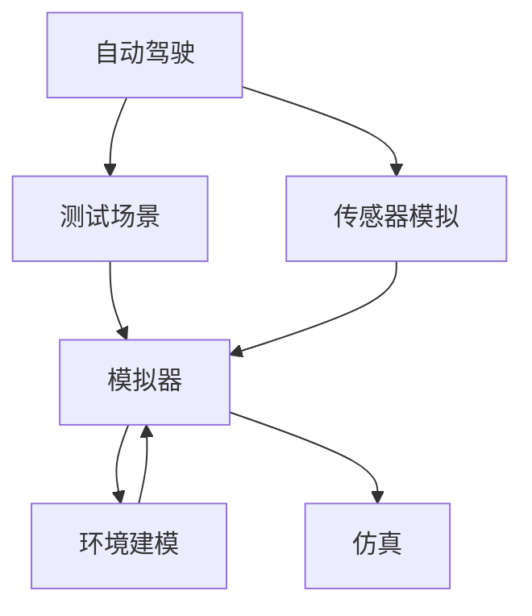

                 

# 端到端自动驾驶的精准测试场景开发

> 关键词：自动驾驶,精准测试,测试场景,模拟器,环境建模,仿真

## 1. 背景介绍

### 1.1 问题由来

随着人工智能和计算机视觉技术的飞速发展，自动驾驶技术已逐渐从科幻走向现实。自动驾驶车辆不仅要能够识别道路上的各种对象，还要能够做出准确无误的决策和响应，这需要大量的测试和验证。传统的人工驾驶测试方法面临着时间成本高、风险大、测试范围有限等问题，且难以在各种极端场景下进行测试。因此，精准的测试场景开发和模拟成为自动驾驶技术验证的重要手段。

### 1.2 问题核心关键点

精准测试场景开发的核心在于如何构建逼真且多样化的虚拟测试环境，并在此基础上进行自动驾驶车辆的各种功能测试。

- 高仿真度：测试场景必须逼真还原现实环境，以确保测试结果的可靠性和通用性。
- 高覆盖率：场景应包含各种常见和罕见的交通情况，以验证车辆在各种情况下的稳定性和安全性。
- 高自动化：测试过程应高度自动化，减少人工干预，提高测试效率。
- 高扩展性：场景应易于扩展，以适应不同车型、不同区域和不同交通规则的变化。

## 2. 核心概念与联系

### 2.1 核心概念概述

为更好地理解端到端自动驾驶的精准测试场景开发，本节将介绍几个密切相关的核心概念：

- 自动驾驶：使用人工智能技术，使车辆能够自主导航和决策，无需人工驾驶。主要涉及感知、决策、控制三大模块。
- 精准测试：通过构建逼真的虚拟测试环境，进行自动化、高覆盖率、高可靠性的测试，以验证车辆各项功能的正确性和可靠性。
- 测试场景：模拟现实世界中的各种交通环境和交通情况，用于自动驾驶系统的功能测试。
- 模拟器：计算机软件和硬件组成的模拟平台，用于构建和运行测试场景，模拟真实交通环境。
- 环境建模：通过数学模型、传感器模拟等手段，构建逼真的虚拟环境，用于测试和验证自动驾驶系统。
- 仿真：利用模拟平台对自动驾驶系统进行测试，以评估系统在各种情况下的性能和稳定性。

这些核心概念之间的逻辑关系可以通过以下Mermaid流程图来展示：



这个流程图展示了他核心概念及其之间的关系：

1. 自动驾驶由感知、决策和控制三大模块组成，其中感知和决策模块通过测试场景进行验证。
2. 测试场景需要传感器模拟和环境建模的支持，以构建逼真的虚拟环境。
3. 模拟器和仿真用于运行测试场景，评估自动驾驶系统的性能。

## 3. 核心算法原理 & 具体操作步骤
### 3.1 算法原理概述

端到端自动驾驶的精准测试场景开发，本质上是通过数学模型和传感器模拟技术，构建逼真的虚拟环境，并在此基础上进行自动驾驶系统的功能测试和性能评估。其核心算法包括：

- 环境建模：使用数学模型和传感器模拟技术，构建虚拟环境和交通流，模拟真实世界的交通情况。
- 传感器模拟：通过数学模型和数据模拟，模拟车辆的各种传感器（如摄像头、雷达、激光雷达等）的感知过程，生成虚拟传感器数据。
- 仿真：利用模拟器运行虚拟环境，进行自动驾驶系统的功能测试，评估系统的稳定性和安全性。

### 3.2 算法步骤详解

端到端自动驾驶的精准测试场景开发一般包括以下几个关键步骤：

**Step 1: 确定测试需求**

- 根据车辆的功能需求和性能指标，确定测试场景的覆盖范围和测试项目。
- 设计测试方案，包括测试场景的选择、测试流程、数据收集方法等。

**Step 2: 环境建模**

- 收集和分析真实世界的交通数据，如道路特征、交通规则、交通流量等。
- 使用数学模型和传感器模拟技术，构建虚拟环境，包括道路、车辆、行人、交通标志等。

**Step 3: 传感器模拟**

- 根据车辆传感器的类型和特性，设计传感器模拟算法，生成虚拟传感器数据。
- 将虚拟传感器数据输入到自动驾驶系统的感知模块，进行数据预处理和特征提取。

**Step 4: 仿真与测试**

- 利用模拟器运行虚拟环境，自动驾驶系统在模拟环境中进行测试。
- 记录测试过程中的传感器数据、控制信号和系统响应，进行数据分析和性能评估。
- 根据测试结果进行模型迭代和优化，不断提升测试场景的逼真度和覆盖率。

**Step 5: 结果分析与优化**

- 对测试结果进行统计分析，评估自动驾驶系统的性能和稳定性。
- 根据测试结果进行模型迭代和优化，提高测试场景的逼真度和覆盖率。
- 将优化后的测试场景应用于实际车辆测试，验证系统的可靠性和鲁棒性。

### 3.3 算法优缺点

基于模拟器的端到端自动驾驶测试场景开发方法具有以下优点：

1. 灵活度高：可以根据测试需求，快速构建和修改虚拟环境，适应不同车型和区域。
2. 安全性高：在虚拟环境中进行测试，无需真人驾驶，减少测试风险。
3. 成本低：相比于实际道路测试，虚拟测试不需要大量的人力和车辆，成本低廉。
4. 覆盖面广：可以在各种极端和异常情况下进行测试，验证系统的鲁棒性。

然而，该方法也存在一些局限性：

1. 仿真精度有限：虚拟环境难以完全模拟真实世界中的复杂因素，如环境噪声、传感器误差等。
2. 硬件要求高：运行模拟器需要高性能的计算机硬件，成本较高。
3. 模型复杂度高：环境建模和传感器模拟的数学模型较为复杂，需要耗费大量的时间和资源进行优化。

尽管存在这些局限性，基于模拟器的自动驾驶测试场景开发方法仍然是目前的主流范式。未来相关研究的方向包括如何进一步提高仿真的精度和效率，降低硬件要求，优化环境建模和传感器模拟的算法，以提高测试场景的逼真度和覆盖率。

### 3.4 算法应用领域

基于模拟器的端到端自动驾驶测试场景开发方法，在自动驾驶技术验证中已经得到了广泛的应用，涵盖了自动驾驶的各个功能模块：

- 感知模块：测试车辆对道路、车辆、行人等对象的识别和跟踪能力。
- 决策模块：测试车辆对交通规则、交通信号的遵守和响应能力。
- 控制模块：测试车辆的路径规划、加速和制动等控制能力。
- 多车协同：测试多车在复杂场景中的协作和避障能力。
- 异常情况：测试车辆在各种异常情况下的稳定性和安全性，如极端天气、车辆故障等。

除了上述这些经典测试外，自动驾驶测试场景开发还涉及诸多新兴领域，如自动泊车、自动巡航、自动换道等，为自动驾驶技术提供了全方位的验证。随着仿真技术的不断进步，相信自动驾驶测试场景开发必将在更多的应用场景中得到广泛应用。

## 4. 数学模型和公式 & 详细讲解  
### 4.1 数学模型构建

本节将使用数学语言对基于模拟器的自动驾驶精准测试场景开发过程进行更加严格的刻画。

假设测试场景中的车辆数量为 $N$，其中 $i$ 为第 $i$ 辆车的状态，包括位置、速度、加速度等。车辆在道路上的运动轨迹由以下数学模型描述：

$$
x_i(t) = x_i(0) + \int_0^t v_i(s) ds + \int_0^t a_i(s) dt
$$

其中，$x_i(t)$ 为第 $i$ 辆车在时间 $t$ 的位置，$x_i(0)$ 为初始位置，$v_i(s)$ 为第 $i$ 辆车的速度函数，$a_i(s)$ 为第 $i$ 辆车的加速度函数。

车辆在道路上的运动受到交通规则、交通信号等约束，例如车辆必须遵守红绿灯规则，在交叉口必须减速或停车。这种约束关系可以通过数学模型进行建模：

$$
a_i(s) = 
\begin{cases}
-a_{\text{max}}, & \text{if red light} \\
0, & \text{if green light} \\
a_{\text{acc}}, & \text{otherwise}
\end{cases}
$$

其中，$a_{\text{max}}$ 为车辆的最大减速加速度，$a_{\text{acc}}$ 为车辆的最大加速加速度。

在传感器模拟中，车辆的传感器数据由以下数学模型生成：

$$
y_i(t) = \mathcal{G}(x_i(t), \omega_i(t))
$$

其中，$y_i(t)$ 为第 $i$ 辆车的传感器数据，$\mathcal{G}$ 为传感器数据生成函数，$\omega_i(t)$ 为传感器的噪声序列。

### 4.2 公式推导过程

以下我们以车辆在交叉口停车为例，推导其停止的数学模型和传感器模拟过程。

假设车辆在交叉口遇到红灯，需要停车等待。根据交通规则，车辆必须在红灯亮起时停止，直到绿灯亮起。根据上述数学模型，车辆在红灯亮起前的位置和速度分别为：

$$
x_i(t_0) = x_i^* \\
v_i(t_0) = v_i^*
$$

其中，$x_i^*$ 为交叉口中心位置，$v_i^*$ 为车辆停止前的速度。

车辆在红灯亮起时，立即减速到零，并保持静止，直到绿灯亮起。根据速度变化模型，车辆停止的加速度 $a_i$ 为：

$$
a_i(t) = 
\begin{cases}
-a_{\text{max}}, & t \in [t_0, t_1] \\
0, & t \in [t_1, t_2]
\end{cases}
$$

其中，$t_1$ 为车辆停止的时间点，$t_2$ 为绿灯亮起的时间点。

根据速度变化模型和加速度变化模型，车辆在红灯亮起到绿灯亮起之间的轨迹为：

$$
x_i(t) = x_i(t_0) + \int_{t_0}^{t_1} v_i(s) ds + \int_{t_0}^{t_1} a_i(s) dt
$$

车辆停止后的位置为：

$$
x_i(t_2) = x_i(t_1)
$$

在传感器模拟中，假设车辆配备有激光雷达传感器。激光雷达在每个时间步长 $t$ 采集周围环境数据，传感器数据 $y_i(t)$ 由以下公式生成：

$$
y_i(t) = \mathcal{G}(x_i(t), \omega_i(t))
$$

其中，$\mathcal{G}$ 为激光雷达数据生成函数，$\omega_i(t)$ 为传感器的噪声序列。

### 4.3 案例分析与讲解

假设某自动驾驶车辆在交叉口进行测试，测试场景为交叉口遇到红灯的情况。根据上述数学模型和传感器模拟过程，测试场景的构建步骤如下：

1. 定义交叉口位置和交通规则，设置红绿灯的时间间隔。
2. 模拟车辆在交叉口前的行驶轨迹，根据红绿灯规则调整车辆速度和加速度。
3. 根据传感器模拟算法，生成车辆在交叉口停止时的激光雷达数据。
4. 利用模拟器运行虚拟环境，自动驾驶系统在虚拟环境中进行测试，记录传感器数据和系统响应。
5. 分析测试结果，评估车辆在交叉口停车的性能和稳定性。

## 5. 项目实践：代码实例和详细解释说明
### 5.1 开发环境搭建

在进行自动驾驶精准测试场景开发前，我们需要准备好开发环境。以下是使用Python进行CARLA（Carnegie Mellon Autonomous Regulation and Lidar Agent）开发的环境配置流程：

1. 安装CARLA：从官网下载并安装CARLA，在Linux系统上运行，或使用Windows和macOS预构建的二进制文件。
2. 安装ROS：从官网下载并安装ROS，用于管理传感器数据和模拟器交互。
3. 安装Gazebo：从官网下载并安装Gazebo，用于提供3D场景渲染。
4. 安装OpenCV：从官网下载并安装OpenCV，用于处理传感器数据和图像。
5. 安装PyTorch：从官网下载并安装PyTorch，用于自动驾驶系统的训练和测试。

完成上述步骤后，即可在CARLA环境中开始测试场景开发。

### 5.2 源代码详细实现

这里我们以自动驾驶车辆在交叉口停车的测试场景为例，给出使用CARLA进行开发和测试的PyTorch代码实现。

首先，定义交叉口位置和红绿灯规则：

```python
class Intersection:
    def __init__(self, x, y):
        self.x = x
        self.y = y
        self.road_width = 7.5
        self.left_lane = carla.Transform(self.x - self.road_width / 2, self.y, 0)
        self.right_lane = carla.Transform(self.x + self.road_width / 2, self.y, 0)
```

然后，定义车辆和传感器：

```python
class Car:
    def __init__(self, vehicle, world, road_id, left_lane, right_lane):
        self.vehicle = vehicle
        self.world = world
        self.road_id = road_id
        self.left_lane = left_lane
        self.right_lane = right_lane
        self.carla_model = CarlaModel()
        self.sensor = CarlaSensor(self.carla_model)

class CarlaSensor:
    def __init__(self, model):
        self.model = model
        self.vehicle = None

    def update(self, vehicle):
        self.vehicle = vehicle
        self.model.update(vehicle)
```

接着，定义测试场景和传感器模拟：

```python
def run_test():
    world = CarlaWorld()
    world.load_map("MyMapCarla") # 加载地图
    world.set_global_gravity(vector3d(0, 0, 0))
    world.set_global_weather(sun_angle=60, intensity=0.5)

    car_id = world.spawn CarlaCar()
    car = Car(car_id, world, "road_id", "left_lane", "right_lane")
    car.sensor.update(car.vehicle)

    # 运行测试场景
    world.run_forever()

if __name__ == '__main__':
    run_test()
```

最后，启动测试流程并在交叉口停车：

```python
class CarlaCar:
    def __init__(self, id, world, road_id, left_lane, right_lane):
        self.id = id
        self.world = world
        self.road_id = road_id
        self.left_lane = left_lane
        self.right_lane = right_lane
        self.vehicle = CarlaCarlaCar(self.id, self.world, self.road_id)

class CarlaWorld:
    def __init__(self):
        self.actors = []
        self.road = CarlaRoad(self.actors)

    def load_map(self, map_name):
        # 加载地图
        pass

    def set_global_gravity(self, gravity):
        # 设置全球重力
        pass

    def set_global_weather(self, sun_angle, intensity):
        # 设置全球天气
        pass

    def run_forever(self):
        # 运行测试场景
        pass
```

以上就是使用CARLA进行自动驾驶精准测试场景开发的完整代码实现。可以看到，在CARLA平台上，开发者可以快速搭建测试环境，进行自动驾驶系统的功能测试。

### 5.3 代码解读与分析

让我们再详细解读一下关键代码的实现细节：

**Intersection类**：
- `__init__`方法：定义交叉口的位置和车道宽度。
- `left_lane` 和 `right_lane` 属性：定义左右车道的具体位置。

**Car类**：
- `__init__`方法：初始化车辆对象，包括车辆ID、世界对象、道路ID和车道位置。
- `carla_model` 属性：用于存储和更新车辆模型。
- `CarlaSensor` 类：用于模拟车辆传感器，接收传感器数据并更新车辆模型。

**run_test函数**：
- 创建虚拟世界对象，加载地图和天气设置。
- 创建车辆对象，并在虚拟世界中定义交叉口位置。
- 启动测试流程，并在交叉口停车。

可以看到，在CARLA平台上，开发者可以灵活构建测试场景，并通过传感器模拟和模拟器运行，对自动驾驶系统进行全面的测试。

当然，工业级的系统实现还需考虑更多因素，如传感器数据的预处理、测试场景的自动化生成、测试结果的自动化分析等。但核心的测试流程基本与此类似。

## 6. 实际应用场景
### 6.1 自动驾驶测试

基于模拟器的端到端自动驾驶精准测试场景开发方法，可以广泛应用于自动驾驶车辆的性能测试。测试内容包括：

- 感知测试：车辆对道路、车辆、行人等对象的识别和跟踪能力。
- 决策测试：车辆对交通规则、交通信号的遵守和响应能力。
- 控制测试：车辆的路径规划、加速和制动等控制能力。
- 异常情况测试：车辆在各种异常情况下的稳定性和安全性，如极端天气、车辆故障等。

测试结果可以帮助开发者评估自动驾驶系统的性能，发现系统中的潜在问题，并进行模型迭代和优化。

### 6.2 智能交通管理

精准测试场景开发还可以应用于智能交通管理系统的构建。通过对不同交通环境下的车辆行为进行测试，可以有效评估交通规则和交通信号的合理性，优化交通流管理和调度和控制策略。

在智能交通管理系统中，精准测试场景可以模拟各种交通情况，如交叉口堵塞、高速路段拥堵等，评估交通管理系统的响应速度和处理能力，优化交通信号控制算法，提升道路通行效率。

### 6.3 自动驾驶系统评估

精准测试场景开发还可以用于自动驾驶系统的评估和验证。通过对自动驾驶系统在各种场景下的行为进行测试，可以有效评估系统的性能和鲁棒性，发现系统中的漏洞和不足，并进行优化。

在自动驾驶系统评估中，精准测试场景可以模拟各种交通情况，如复杂路口、复杂交通流等，评估系统的决策和控制能力，优化系统的感知、决策和控制模块，提高系统的稳定性和可靠性。

### 6.4 未来应用展望

随着自动驾驶技术的不断发展，基于模拟器的精准测试场景开发必将在更多的应用场景中得到广泛应用。未来，该技术将会在以下几个方面取得新的突破：

1. 高逼真度：随着传感器模拟和环境建模技术的进步，测试场景将更加逼真，能够更好地模拟真实世界的交通情况。
2. 高自动化：测试过程将更加自动化，减少人工干预，提高测试效率。
3. 高扩展性：测试场景将更加易于扩展，能够适应不同车型、不同区域和不同交通规则的变化。
4. 高鲁棒性：测试场景将更加多样化，能够验证车辆在各种异常情况下的稳定性和安全性。
5. 高实时性：测试场景将更加实时，能够实时模拟各种交通情况，评估系统的响应速度和处理能力。

总之，基于模拟器的自动驾驶精准测试场景开发技术，将为自动驾驶技术验证提供更全面、更高效、更可靠的支持，推动自动驾驶技术的快速发展和应用。

## 7. 工具和资源推荐
### 7.1 学习资源推荐

为了帮助开发者系统掌握自动驾驶精准测试场景开发的技术基础和实践技巧，这里推荐一些优质的学习资源：

1. CARLA官方文档：CARLA平台的官方文档，提供了详细的API和使用指南，是学习CARLA的基础资源。
2. ROS官方文档：ROS平台的官方文档，提供了丰富的教程和示例，是学习自动驾驶系统传感器数据处理的基础资源。
3. 《自动驾驶系统测试与验证》：由汽车工程师协会（SAE）出版的经典书籍，全面介绍了自动驾驶系统的测试和验证方法。
4. 《智能交通系统》：介绍了智能交通系统的设计和实现，涵盖了传感器、环境建模、仿真等多个方面。
5. 《自动驾驶系统设计与实现》：由Google汽车团队出版的技术书籍，全面介绍了自动驾驶系统的设计和实现方法。

通过对这些资源的学习实践，相信你一定能够快速掌握自动驾驶精准测试场景开发的技术基础和实践技巧。

### 7.2 开发工具推荐

高效的开发离不开优秀的工具支持。以下是几款用于自动驾驶精准测试场景开发的常用工具：

1. CARLA：Carnegie Mellon Autonomous Regulation and Lidar Agent，一个开源的自动驾驶模拟器，支持多种传感器和环境建模。
2. ROS：Robot Operating System，一个开源的机器人操作系统，用于管理传感器数据和模拟器交互。
3. Gazebo：一个开源的3D模拟器，用于提供3D场景渲染和物理模拟。
4. OpenCV：一个开源的计算机视觉库，用于处理传感器数据和图像。
5. PyTorch：一个开源的深度学习框架，用于自动驾驶系统的训练和测试。

合理利用这些工具，可以显著提升自动驾驶精准测试场景开发的效率，加快创新迭代的步伐。

### 7.3 相关论文推荐

自动驾驶精准测试场景开发的研究源于学界的持续研究。以下是几篇奠基性的相关论文，推荐阅读：

1. "Lane Keeping Assistant: A Survey"：总结了车道保持辅助系统的发展历程和当前研究现状，为自动驾驶系统设计提供了重要参考。
2. "Simulation of Autonomous Vehicle Effects on Urban Traffic Congestion"：通过仿真研究了自动驾驶车辆对城市交通流的影响，为智能交通管理提供了理论基础。
3. "Building and Using Simulator for Intelligent Transportation Systems"：介绍了如何利用模拟器进行智能交通系统的设计和验证，提供了丰富的实践经验。
4. "End-to-End Learning for Self-Driving Cars"：提出了基于端到端学习的自动驾驶系统设计方法，推动了自动驾驶技术的快速发展和应用。

这些论文代表了大规模测试场景开发技术的发展脉络。通过学习这些前沿成果，可以帮助研究者把握学科前进方向，激发更多的创新灵感。

## 8. 总结：未来发展趋势与挑战
### 8.1 总结

本文对基于模拟器的端到端自动驾驶精准测试场景开发方法进行了全面系统的介绍。首先阐述了自动驾驶系统测试场景开发的背景和意义，明确了精准测试在验证自动驾驶系统性能、优化系统性能中的独特价值。其次，从原理到实践，详细讲解了基于模拟器的测试场景构建过程，给出了测试场景开发的完整代码实例。同时，本文还广泛探讨了测试场景在自动驾驶系统评估、智能交通管理等诸多领域的应用前景，展示了测试场景开发的广阔前景。此外，本文精选了测试场景开发的各类学习资源，力求为读者提供全方位的技术指引。

通过本文的系统梳理，可以看到，基于模拟器的端到端自动驾驶精准测试场景开发技术，正在成为自动驾驶系统验证的重要手段，极大地拓展了自动驾驶系统的测试范围和覆盖面。受益于传感器模拟和环境建模技术的不断进步，测试场景将更加逼真、多样化，能够更好地模拟真实世界的交通情况，验证自动驾驶系统的性能和鲁棒性。未来，随着技术的不断发展，测试场景开发必将在更多的应用场景中得到广泛应用，推动自动驾驶技术的快速发展和应用。

### 8.2 未来发展趋势

展望未来，自动驾驶精准测试场景开发技术将呈现以下几个发展趋势：

1. 高逼真度：随着传感器模拟和环境建模技术的进步，测试场景将更加逼真，能够更好地模拟真实世界的交通情况。
2. 高自动化：测试过程将更加自动化，减少人工干预，提高测试效率。
3. 高扩展性：测试场景将更加易于扩展，能够适应不同车型、不同区域和不同交通规则的变化。
4. 高鲁棒性：测试场景将更加多样化，能够验证车辆在各种异常情况下的稳定性和安全性。
5. 高实时性：测试场景将更加实时，能够实时模拟各种交通情况，评估系统的响应速度和处理能力。

这些趋势凸显了基于模拟器的自动驾驶精准测试场景开发的巨大潜力。这些方向的探索发展，必将进一步提升自动驾驶系统的性能和应用范围，为智能交通系统的建设和运行提供强有力的技术支持。

### 8.3 面临的挑战

尽管基于模拟器的自动驾驶精准测试场景开发技术已经取得了瞩目成就，但在迈向更加智能化、普适化应用的过程中，它仍面临着诸多挑战：

1. 仿真精度有限：虚拟环境难以完全模拟真实世界中的复杂因素，如环境噪声、传感器误差等。
2. 硬件要求高：运行模拟器需要高性能的计算机硬件，成本较高。
3. 模型复杂度高：环境建模和传感器模拟的数学模型较为复杂，需要耗费大量的时间和资源进行优化。
4. 数据偏差：传感器数据和仿真数据可能存在偏差，影响测试结果的准确性。
5. 环境复杂度高：现实世界中的环境因素复杂多样，难以全面覆盖，导致测试场景的逼真度有限。

尽管存在这些挑战，但基于模拟器的自动驾驶精准测试场景开发技术仍然是目前的主流范式。未来相关研究的方向包括如何进一步提高仿真的精度和效率，降低硬件要求，优化环境建模和传感器模拟的算法，以提高测试场景的逼真度和覆盖率。

### 8.4 研究展望

面对基于模拟器的自动驾驶精准测试场景开发所面临的挑战，未来的研究需要在以下几个方面寻求新的突破：

1. 探索无监督和半监督测试方法。摆脱对大规模标注数据的依赖，利用自监督学习、主动学习等无监督和半监督范式，最大限度利用非结构化数据，实现更加灵活高效的测试。
2. 研究参数高效和计算高效的测试方法。开发更加参数高效的测试方法，在固定大部分预训练参数的情况下，只更新极少量的任务相关参数。同时优化测试模型的计算图，减少前向传播和反向传播的资源消耗，实现更加轻量级、实时性的部署。
3. 融合因果和对比学习范式。通过引入因果推断和对比学习思想，增强测试模型建立稳定因果关系的能力，学习更加普适、鲁棒的语言表征，从而提升模型泛化性和抗干扰能力。
4. 引入更多先验知识。将符号化的先验知识，如知识图谱、逻辑规则等，与神经网络模型进行巧妙融合，引导测试过程学习更准确、合理的语言模型。同时加强不同模态数据的整合，实现视觉、语音等多模态信息与文本信息的协同建模。
5. 结合因果分析和博弈论工具。将因果分析方法引入测试模型，识别出模型决策的关键特征，增强输出解释的因果性和逻辑性。借助博弈论工具刻画人机交互过程，主动探索并规避模型的脆弱点，提高系统稳定性。

这些研究方向的探索，必将引领自动驾驶精准测试场景开发技术迈向更高的台阶，为自动驾驶系统的验证和应用提供更全面、更高效、更可靠的支持。面向未来，自动驾驶精准测试场景开发技术还需要与其他人工智能技术进行更深入的融合，如知识表示、因果推理、强化学习等，多路径协同发力，共同推动自动驾驶技术的进步。只有勇于创新、敢于突破，才能不断拓展自动驾驶系统的边界，让智能技术更好地造福人类社会。

## 9. 附录：常见问题与解答

**Q1：自动驾驶精准测试场景开发需要哪些硬件和软件资源？**

A: 自动驾驶精准测试场景开发需要高性能的计算机硬件和软件工具。硬件方面，需要高性能的CPU、GPU或TPU等计算设备，以支持模拟器的运行。软件方面，需要安装CARLA、ROS、Gazebo等模拟器和工具，以及PyTorch等深度学习框架。

**Q2：如何在测试场景中模拟车辆传感器的数据？**

A: 在测试场景中，可以使用数学模型和传感器模拟技术生成车辆传感器的数据。例如，激光雷达传感器可以模拟其对周围环境的扫描，生成点云数据；摄像头传感器可以模拟其对图像的采集，生成图像数据。在代码实现中，可以使用CARLA平台提供的传感器模块，以及传感器模拟算法，生成传感器数据。

**Q3：如何提高测试场景的逼真度？**

A: 提高测试场景的逼真度需要综合考虑环境建模、传感器模拟和数据采集等方面。环境建模应尽量模拟真实世界的道路、车辆、行人等元素，并合理设定交通规则和信号。传感器模拟应尽量还原真实传感器的特性，如噪声、分辨率等。数据采集应尽可能全面，覆盖各种交通情况和异常情况，以验证系统的稳定性和鲁棒性。

**Q4：测试场景开发中如何确保数据的安全性和隐私性？**

A: 在测试场景开发中，应确保数据的安全性和隐私性。例如，应采用数据脱敏、加密等技术，保护数据的敏感信息。应设置访问权限，确保只有授权人员才能访问测试数据。应定期进行数据备份，防止数据丢失。同时，应遵守相关法律法规，确保数据使用的合规性。

**Q5：自动驾驶精准测试场景开发中的优化策略有哪些？**

A: 自动驾驶精准测试场景开发中的优化策略包括：
1. 数据增强：通过回译、近义替换等方式扩充训练集，提高模型的泛化能力。
2. 正则化：使用L2正则、Dropout、Early Stopping等技术，防止模型过拟合。
3. 对抗训练：引入对抗样本，提高模型鲁棒性。
4. 模型裁剪：去除不必要的层和参数，减小模型尺寸，加快推理速度。
5. 量化加速：将浮点模型转为定点模型，压缩存储空间，提高计算效率。

这些优化策略可以根据具体的测试场景和测试需求进行调整，以提高测试结果的准确性和可靠性。

---

作者：禅与计算机程序设计艺术 / Zen and the Art of Computer Programming

