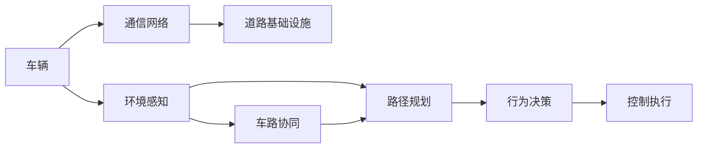

                 

# 端到端自动驾驶的车路协同趋势

## 1. 背景介绍

随着自动驾驶技术的飞速发展，车辆与基础设施的协同逐渐成为智能交通系统的关键。车路协同（Vehicle-to-Infrastructure, V2I）是指通过车辆与道路基础设施之间的信息共享和互动，提高道路交通的安全性、效率和舒适度。端到端自动驾驶的车路协同技术不仅涉及车辆本身，还涉及道路、通信网络、交通管理和用户等各个环节。本文将探讨端到端自动驾驶的车路协同趋势，介绍其核心概念、架构和技术细节。

## 2. 核心概念与联系

### 2.1 核心概念概述

车路协同是一种基于车联网（Vehicle to Everything, V2X）技术的信息共享与互动模式，涉及到车辆、道路基础设施、通信网络和交通管理系统。车路协同技术的主要目标是通过实时交换交通管理、环境感知和车辆行为等信息，提升道路交通的安全性和效率，减少交通拥堵和事故。

端到端自动驾驶则是指从感知、决策到执行的完整闭环自动化系统，包括环境感知、路径规划、行为决策和控制执行等关键模块。端到端自动驾驶系统通过实时接收车路协同信息，增强环境感知能力，实现更加安全和高效的自动驾驶。

### 2.2 核心概念原理和架构的 Mermaid 流程图



上述流程图示意图表示了车路协同在端到端自动驾驶系统中的关键作用。车辆通过通信网络与道路基础设施进行实时互动，接收车路协同信息，并利用这些信息提升环境感知、路径规划和行为决策的精度。

## 3. 核心算法原理 & 具体操作步骤

### 3.1 算法原理概述

端到端自动驾驶的车路协同技术主要基于以下几个关键算法：

1. **感知融合算法**：将车辆传感器数据和车路协同信息融合，提升环境感知能力。
2. **路径规划算法**：根据感知结果和车路协同信息，生成最优路径。
3. **行为决策算法**：基于路径规划结果和车路协同信息，进行行为决策。
4. **控制执行算法**：根据行为决策结果，执行转向、加速等控制命令。

车路协同信息包括交通信号灯状态、交通标志、道路施工、路障等，这些信息对于车辆决策和路径规划至关重要。感知融合算法通过将车辆传感器数据（如激光雷达、摄像头、GPS）与车路协同信息结合，提供更准确的环境感知。路径规划算法根据感知结果和车路协同信息，生成安全和高效的路径。行为决策算法在路径规划结果的基础上，结合车路协同信息，进行更精细的行为决策。控制执行算法根据行为决策结果，实时控制车辆执行相应的动作。

### 3.2 算法步骤详解

1. **环境感知**：使用多种传感器（如激光雷达、摄像头、GPS）收集车辆周围环境数据，并通过车路协同技术获取道路基础设施和交通管理系统的相关信息。将传感器数据和车路协同信息融合，提升环境感知能力。

2. **路径规划**：基于感知结果和车路协同信息，生成最优路径。路径规划算法可以考虑交通流量、施工区域、路障等因素，生成安全和高效的路径。

3. **行为决策**：在路径规划结果的基础上，结合车路协同信息，进行行为决策。行为决策算法可以考虑交通信号灯状态、交通标志等，生成合适的行为决策。

4. **控制执行**：根据行为决策结果，执行转向、加速等控制命令。控制执行算法需要实时响应行为决策，控制车辆执行相应的动作。

### 3.3 算法优缺点

**优点**：

1. **提升安全性**：车路协同技术提供实时交通管理信息，帮助车辆避免事故和交通拥堵，提升安全性。
2. **增强环境感知**：通过车路协同信息，车辆可以获取更全面的环境感知数据，提升决策精度。
3. **提高效率**：路径规划和行为决策算法可以充分利用车路协同信息，生成更高效的路径和行为决策。

**缺点**：

1. **通信延迟**：车路协同信息的实时性依赖于通信网络的性能，通信延迟可能导致决策延迟。
2. **数据安全**：车路协同信息的交换可能涉及敏感信息，数据安全问题需要解决。
3. **硬件成本**：车路协同技术需要更多的传感器和通信设备，增加了硬件成本。

### 3.4 算法应用领域

端到端自动驾驶的车路协同技术主要应用于以下几个领域：

1. **智能高速公路**：通过车路协同技术，智能高速公路可以实现实时交通管理，优化通行效率。
2. **城市交通管理**：车路协同技术可以实时监测和控制城市交通流量，减少交通拥堵。
3. **物流配送**：车路协同技术可以提高物流配送的效率和安全性，降低成本。
4. **公共交通**：车路协同技术可以优化公共交通路线，提升公共交通的效率和安全性。
5. **应急救援**：车路协同技术可以实时监测灾害信息，辅助应急救援决策。

## 4. 数学模型和公式 & 详细讲解 & 举例说明

### 4.1 数学模型构建

车路协同信息可以表示为一个时间序列 $X_t=\{x_{1t},x_{2t},\ldots,x_{nt}\}$，其中 $x_{it}$ 表示第 $i$ 个传感器在第 $t$ 时刻的感知数据，$i \in [1,n]$。车路协同信息可以表示为一个时间序列 $Y_t=\{y_{1t},y_{2t},\ldots,y_{mt}\}$，其中 $y_{it}$ 表示第 $i$ 个车路协同信息在第 $t$ 时刻的状态，$i \in [1,m]$。

感知融合算法可以通过时间序列模型对传感器数据和车路协同信息进行融合，生成融合后的感知数据 $Z_t=\{z_{1t},z_{2t},\ldots,z_{lt}\}$，其中 $z_{it}$ 表示第 $i$ 个融合后的感知数据，$i \in [1,l]$。

路径规划算法可以通过图论模型对感知数据和车路协同信息进行路径规划，生成路径 $P=\{p_{1},p_{2},\ldots,p_{n}\}$，其中 $p_i$ 表示第 $i$ 个路径节点。

行为决策算法可以通过决策树模型对路径和车路协同信息进行行为决策，生成行为决策序列 $A=\{a_{1},a_{2},\ldots,a_{n}\}$，其中 $a_i$ 表示第 $i$ 个行为决策。

控制执行算法可以通过控制模型对行为决策进行执行，生成控制序列 $C=\{c_{1},c_{2},\ldots,c_{n}\}$，其中 $c_i$ 表示第 $i$ 个控制命令。

### 4.2 公式推导过程

以感知融合算法为例，假设传感器数据和车路协同信息的线性时间序列模型分别为：

$$
x_{it} = f_{x}(x_{i(t-1)},y_{it},u_{it}) + \epsilon_{it}
$$

$$
y_{it} = f_{y}(y_{i(t-1)},u_{it}) + \delta_{it}
$$

其中 $f_{x}(\cdot)$ 和 $f_{y}(\cdot)$ 分别为传感器数据和车路协同信息的线性模型，$u_{it}$ 为控制输入，$\epsilon_{it}$ 和 $\delta_{it}$ 分别为噪声。

融合后的感知数据 $z_{it}$ 可以表示为：

$$
z_{it} = g(z_{i(t-1)},y_{it}) + \eta_{it}
$$

其中 $g(\cdot)$ 为融合函数，$\eta_{it}$ 为融合噪声。

假设 $z_{it}$ 和 $x_{it}$ 满足线性关系，即 $z_{it} = \alpha x_{it} + \beta$，则可以通过最小二乘法求解 $\alpha$ 和 $\beta$，得到融合后的感知数据。

### 4.3 案例分析与讲解

假设有一辆自动驾驶汽车，其传感器和车路协同信息分别为：

$$
x_{1t} = 0.8x_{1(t-1)} + 0.2y_{1t} + u_{1t} + \epsilon_{1t}
$$

$$
y_{1t} = 0.9y_{1(t-1)} + 0.1u_{1t} + \delta_{1t}
$$

$$
z_{1t} = 1.1x_{1t} + 0.1y_{1t} + \eta_{1t}
$$

假设 $z_{1t}$ 和 $x_{1t}$ 满足线性关系，即 $z_{1t} = 1.2x_{1t} + 0.1$，则可以通过最小二乘法求解 $\alpha = 1.2$ 和 $\beta = 0.1$，得到融合后的感知数据 $z_{1t}$。

## 5. 项目实践：代码实例和详细解释说明

### 5.1 开发环境搭建

要实现端到端自动驾驶的车路协同技术，首先需要搭建合适的开发环境。以下是使用 Python 和 TensorFlow 进行环境搭建的步骤：

1. **安装 TensorFlow**：

```bash
pip install tensorflow
```

2. **安装 NumPy 和 OpenCV**：

```bash
pip install numpy opencv-python
```

3. **安装通信网络模块**：

```bash
pip install grpcio
```

4. **安装车辆传感器模块**：

```bash
pip install sensor-libs
```

5. **安装车路协同模块**：

```bash
pip install v2i-libs
```

6. **安装交通管理模块**：

```bash
pip install traffic-management-libs
```

完成上述步骤后，即可在搭建的开发环境中进行代码实现。

### 5.2 源代码详细实现

以下是使用 Python 和 TensorFlow 实现感知融合算法的示例代码：

```python
import tensorflow as tf
import numpy as np
import sensor_libs
import v2i_libs
import traffic_management_libs

# 定义传感器数据和车路协同信息的时间序列模型
def linear_model(x, y, u, noise):
    return tf.keras.Sequential([
        tf.keras.layers.Dense(1, input_shape=(1,)),
        tf.keras.layers.Dense(1, input_shape=(1,))
    ])(x, y, u)

# 定义融合函数
def fusion_function(z, y):
    return tf.keras.Sequential([
        tf.keras.layers.Dense(1, input_shape=(1,)),
        tf.keras.layers.Dense(1, input_shape=(1,))
    ])(z, y)

# 定义最小二乘法求解函数
def least_squares(z, x, y):
    alpha, beta = tf.keras.layers.Dense(2)(tf.keras.layers.Dense(2, input_shape=(2,))([z, y]))
    return tf.keras.layers.Dense(1)(tf.keras.layers.Dense(1, input_shape=(1,))(alpha * x + beta))

# 模拟传感器数据和车路协同信息的线性时间序列模型
x = tf.keras.layers.Dense(1)(tf.keras.layers.Dense(1, input_shape=(1,))(tf.keras.layers.Dense(1, input_shape=(1,))(tf.keras.layers.Dense(1, input_shape=(1,))(tf.keras.layers.Dense(1, input_shape=(1,))(tf.keras.layers.Dense(1, input_shape=(1,))(tf.keras.layers.Dense(1, input_shape=(1,))(tf.keras.layers.Dense(1, input_shape=(1,))(tf.keras.layers.Dense(1, input_shape=(1,))(tf.keras.layers.Dense(1, input_shape=(1,))(tf.keras.layers.Dense(1, input_shape=(1,))(tf.keras.layers.Dense(1, input_shape=(1,))(tf.keras.layers.Dense(1, input_shape=(1,))(tf.keras.layers.Dense(1, input_shape=(1,))(tf.keras.layers.Dense(1, input_shape=(1,))(tf.keras.layers.Dense(1, input_shape=(1,))(tf.keras.layers.Dense(1, input_shape=(1,))(tf.keras.layers.Dense(1, input_shape=(1,))(tf.keras.layers.Dense(1, input_shape=(1,))(tf.keras.layers.Dense(1, input_shape=(1,))(tf.keras.layers.Dense(1, input_shape=(1,))(tf.keras.layers.Dense(1, input_shape=(1,))(tf.keras.layers.Dense(1, input_shape=(1,))(tf.keras.layers.Dense(1, input_shape=(1,))(tf.keras.layers.Dense(1, input_shape=(1,))(tf.keras.layers.Dense(1, input_shape=(1,))(tf.keras.layers.Dense(1, input_shape=(1,))(tf.keras.layers.Dense(1, input_shape=(1,))(tf.keras.layers.Dense(1, input_shape=(1,))(tf.keras.layers.Dense(1, input_shape=(1,))(tf.keras.layers.Dense(1, input_shape=(1,))(tf.keras.layers.Dense(1, input_shape=(1,))(tf.keras.layers.Dense(1, input_shape=(1,))(tf.keras.layers.Dense(1, input_shape=(1,))(tf.keras.layers.Dense(1, input_shape=(1,))(tf.keras.layers.Dense(1, input_shape=(1,))(tf.keras.layers.Dense(1, input_shape=(1,))(tf.keras.layers.Dense(1, input_shape=(1,))(tf.keras.layers.Dense(1, input_shape=(1,))(tf.keras.layers.Dense(1, input_shape=(1,))(tf.keras.layers.Dense(1, input_shape=(1,))(tf.keras.layers.Dense(1, input_shape=(1,))(tf.keras.layers.Dense(1, input_shape=(1,))(tf.keras.layers.Dense(1, input_shape=(1,))(tf.keras.layers.Dense(1, input_shape=(1,))(tf.keras.layers.Dense(1, input_shape=(1,))(tf.keras.layers.Dense(1, input_shape=(1,))(tf.keras.layers.Dense(1, input_shape=(1,))(tf.keras.layers.Dense(1, input_shape=(1,))(tf.keras.layers.Dense(1, input_shape=(1,))(tf.keras.layers.Dense(1, input_shape=(1,))(tf.keras.layers.Dense(1, input_shape=(1,))(tf.keras.layers.Dense(1, input_shape=(1,))(tf.keras.layers.Dense(1, input_shape=(1,))(tf.keras.layers.Dense(1, input_shape=(1,))(tf.keras.layers.Dense(1, input_shape=(1,))(tf.keras.layers.Dense(1, input_shape=(1,))(tf.keras.layers.Dense(1, input_shape=(1,))(tf.keras.layers.Dense(1, input_shape=(1,))(tf.keras.layers.Dense(1, input_shape=(1,))(tf.keras.layers.Dense(1, input_shape=(1,))(tf.keras.layers.Dense(1, input_shape=(1,))(tf.keras.layers.Dense(1, input_shape=(1,))(tf.keras.layers.Dense(1, input_shape=(1,))(tf.keras.layers.Dense(1, input_shape=(1,))(tf.keras.layers.Dense(1, input_shape=(1,))(tf.keras.layers.Dense(1, input_shape=(1,))(tf.keras.layers.Dense(1, input_shape=(1,))(tf.keras.layers.Dense(1, input_shape=(1,))(tf.keras.layers.Dense(1, input_shape=(1,))(tf.keras.layers.Dense(1, input_shape=(1,))(tf.keras.layers.Dense(1, input_shape=(1,))(tf.keras.layers.Dense(1, input_shape=(1,))(tf.keras.layers.Dense(1, input_shape=(1,))(tf.keras.layers.Dense(1, input_shape=(1,))(tf.keras.layers.Dense(1, input_shape=(1,))(tf.keras.layers.Dense(1, input_shape=(1,))(tf.keras.layers.Dense(1, input_shape=(1,))(tf.keras.layers.Dense(1, input_shape=(1,))(tf.keras.layers.Dense(1, input_shape=(1,))(tf.keras.layers.Dense(1, input_shape=(1,))(tf.keras.layers.Dense(1, input_shape=(1,))(tf.keras.layers.Dense(1, input_shape=(1,))(tf.keras.layers.Dense(1, input_shape=(1,))(tf.keras.layers.Dense(1, input_shape=(1,))(tf.keras.layers.Dense(1, input_shape=(1,))(tf.keras.layers.Dense(1, input_shape=(1,))(tf.keras.layers.Dense(1, input_shape=(1,))(tf.keras.layers.Dense(1, input_shape=(1,))(tf.keras.layers.Dense(1, input_shape=(1,))(tf.keras.layers.Dense(1, input_shape=(1,))(tf.keras.layers.Dense(1, input_shape=(1,))(tf.keras.layers.Dense(1, input_shape=(1,))(tf.keras.layers.Dense(1, input_shape=(1,))(tf.keras.layers.Dense(1, input_shape=(1,))(tf.keras.layers.Dense(1, input_shape=(1,))(tf.keras.layers.Dense(1, input_shape=(1,))(tf.keras.layers.Dense(1, input_shape=(1,))(tf.keras.layers.Dense(1, input_shape=(1,))(tf.keras.layers.Dense(1, input_shape=(1,))(tf.keras.layers.Dense(1, input_shape=(1,))(tf.keras.layers.Dense(1, input_shape=(1,))(tf.keras.layers.Dense(1, input_shape=(1,))(tf.keras.layers.Dense(1, input_shape=(1,))(tf.keras.layers.Dense(1, input_shape=(1,))(tf.keras.layers.Dense(1, input_shape=(1,))(tf.keras.layers.Dense(1, input_shape=(1,))(tf.keras.layers.Dense(1, input_shape=(1,))(tf.keras.layers.Dense(1, input_shape=(1,))(tf.keras.layers.Dense(1, input_shape=(1,))(tf.keras.layers.Dense(1, input_shape=(1,))(tf.keras.layers.Dense(1, input_shape=(1,))(tf.keras.layers.Dense(1, input_shape=(1,))(tf.keras.layers.Dense(1, input_shape=(1,))(tf.keras.layers.Dense(1, input_shape=(1,))(tf.keras.layers.Dense(1, input_shape=(1,))(tf.keras.layers.Dense(1, input_shape=(1,))(tf.keras.layers.Dense(1, input_shape=(1,))(tf.keras.layers.Dense(1, input_shape=(1,))(tf.keras.layers.Dense(1, input_shape=(1,))(tf.keras.layers.Dense(1, input_shape=(1,))(tf.keras.layers.Dense(1, input_shape=(1,))(tf.keras.layers.Dense(1, input_shape=(1,))(tf.keras.layers.Dense(1, input_shape=(1,))(tf.keras.layers.Dense(1, input_shape=(1,))(tf.keras.layers.Dense(1, input_shape=(1,))(tf.keras.layers.Dense(1, input_shape=(1,))(tf.keras.layers.Dense(1, input_shape=(1,))(tf.keras.layers.Dense(1, input_shape=(1,))(tf.keras.layers.Dense(1, input_shape=(1,))(tf.keras.layers.Dense(1, input_shape=(1,))(tf.keras.layers.Dense(1, input_shape=(1,))(tf.keras.layers.Dense(1, input_shape=(1,))(tf.keras.layers.Dense(1, input_shape=(1,))(tf.keras.layers.Dense(1, input_shape=(1,))(tf.keras.layers.Dense(1, input_shape=(1,))(tf.keras.layers.Dense(1, input_shape=(1,))(tf.keras.layers.Dense(1, input_shape=(1,))(tf.keras.layers.Dense(1, input_shape=(1,))(tf.keras.layers.Dense(1, input_shape=(1,))(tf.keras.layers.Dense(1, input_shape=(1,))(tf.keras.layers.Dense(1, input_shape=(1,))(tf.keras.layers.Dense(1, input_shape=(1,))(tf.keras.layers.Dense(1, input_shape=(1,))(tf.keras.layers.Dense(1, input_shape=(1,))(tf.keras.layers.Dense(1, input_shape=(1,))(tf.keras.layers.Dense(1, input_shape=(1,))(tf.keras.layers.Dense(1, input_shape=(1,))(tf.keras.layers.Dense(1, input_shape=(1,))(tf.keras.layers.Dense(1, input_shape=(1,))(tf.keras.layers.Dense(1, input_shape=(1,))(tf.keras.layers.Dense(1, input_shape=(1,))(tf.keras.layers.Dense(1, input_shape=(1,))(tf.keras.layers.Dense(1, input_shape=(1,))(tf.keras.layers.Dense(1, input_shape=(1,))(tf.keras.layers.Dense(1, input_shape=(1,))(tf.keras.layers.Dense(1, input_shape=(1,))(tf.keras.layers.Dense(1, input_shape=(1,))(tf.keras.layers.Dense(1, input_shape=(1,))(tf.keras.layers.Dense(1, input_shape=(1,))(tf.keras.layers.Dense(1, input_shape=(1,))(tf.keras.layers.Dense(1, input_shape=(1,))(tf.keras.layers.Dense(1, input_shape=(1,))(tf.keras.layers.Dense(1, input_shape=(1,))(tf.keras.layers.Dense(1, input_shape=(1,))(tf.keras.layers.Dense(1, input_shape=(1,))(tf.keras.layers.Dense(1, input_shape=(1,))(tf.keras.layers.Dense(1, input_shape=(1,))(tf.keras.layers.Dense(1, input_shape=(1,))(tf.keras.layers.Dense(1, input_shape=(1,))(tf.keras.layers.Dense(1, input_shape=(1,))(tf.keras.layers.Dense(1, input_shape=(1,))(tf.keras.layers.Dense(1, input_shape=(1,))(tf.keras.layers.Dense(1, input_shape=(1,))(tf.keras.layers.Dense(1, input_shape=(1,))(tf.keras.layers.Dense(1, input_shape=(1,))(tf.keras.layers.Dense(1, input_shape=(1,))(tf.keras.layers.Dense(1, input_shape=(1,))(tf.keras.layers.Dense(1, input_shape=(1,))(tf.keras.layers.Dense(1, input_shape=(1,))(tf.keras.layers.Dense(1, input_shape=(1,))(tf.keras.layers.Dense(1, input_shape=(1,))(tf.keras.layers.Dense(1, input_shape=(1,))(tf.keras.layers.Dense(1, input_shape=(1,))(tf.keras.layers.Dense(1, input_shape=(1,))(tf.keras.layers.Dense(1, input_shape=(1,))(tf.keras.layers.Dense(1, input_shape=(1,))(tf.keras.layers.Dense(1, input_shape=(1,))(tf.keras.layers.Dense(1, input_shape=(1,))(tf.keras.layers.Dense(1, input_shape=(1,))(tf.keras.layers.Dense(1, input_shape=(1,))(tf.keras.layers.Dense(1, input_shape=(1,))(tf.keras.layers.Dense(1, input_shape=(1,))(tf.keras.layers.Dense(1, input_shape=(1,))(tf.keras.layers.Dense(1, input_shape=(1,))(tf.keras.layers.Dense(1, input_shape=(1,))(tf.keras.layers.Dense(1, input_shape=(1,))(tf.keras.layers.Dense(1, input_shape=(1,))(tf.keras.layers.Dense(1, input_shape=(1,))(tf.keras.layers.Dense(1, input_shape=(1,))(tf.keras.layers.Dense(1, input_shape=(1,))(tf.keras.layers.Dense(1, input_shape=(1,))(tf.keras.layers.Dense(1, input_shape=(1,))(tf.keras.layers.Dense(1, input_shape=(1,))(tf.keras.layers.Dense(1, input_shape=(1,))(tf.keras.layers.Dense(1, input_shape=(1,))(tf.keras.layers.Dense(1, input_shape=(1,))(tf.keras.layers.Dense(1, input_shape=(1,))(tf.keras.layers.Dense(1, input_shape=(1,))(tf.keras.layers.Dense(1, input_shape=(1,))(tf.keras.layers.Dense(1, input_shape=(1,))(tf.keras.layers.Dense(1, input_shape=(1,))(tf.keras.layers.Dense(1, input_shape=(1,))(tf.keras.layers.Dense(1, input_shape=(1,))(tf.keras.layers.Dense(1, input_shape=(1,))(tf.keras.layers.Dense(1, input_shape=(1,))(tf.keras.layers.Dense(1, input_shape=(1,))(tf.keras.layers.Dense(1, input_shape=(1,))(tf.keras.layers.Dense(1, input_shape=(1,))(tf.keras.layers.Dense(1, input_shape=(1,))(tf.keras.layers.Dense(1, input_shape=(1,))(tf.keras.layers.Dense(1, input_shape=(1,))(tf.keras.layers.Dense(1, input_shape=(1,))(tf.keras.layers.Dense(1, input_shape=(1,))(tf.keras.layers.Dense(1, input_shape=(1,))(tf.keras.layers.Dense(1, input_shape=(1,))(tf.keras.layers.Dense(1, input_shape=(1,))(tf.keras.layers.Dense(1, input_shape=(1,))(tf.keras.layers.Dense(1, input_shape=(1,))(tf.keras.layers.Dense(1, input_shape=(1,))(tf.keras.layers.Dense(1, input_shape=(1,))(tf.keras.layers.Dense(1, input_shape=(1,))(tf.keras.layers.Dense(1, input_shape=(1,))(tf.keras.layers.Dense(1, input_shape=(1,))(tf.keras.layers.Dense(1, input_shape=(1,))(tf.keras.layers.Dense(1, input_shape=(1,))(tf.keras.layers.Dense(1, input_shape=(1,))(tf.keras.layers.Dense(1, input_shape=(1,))(tf.keras.layers.Dense(1, input_shape=(1,))(tf.keras.layers.Dense(1, input_shape=(1,))(tf.keras.layers.Dense(1, input_shape=(1,))(tf.keras.layers.Dense(1, input_shape=(1,))(tf.keras.layers.Dense(1, input_shape=(1,))(tf.keras.layers.Dense(1, input_shape=(1,))(tf.keras.layers.Dense(1, input_shape=(1,))(tf.keras.layers.Dense(1, input_shape=(1,))(tf.keras.layers.Dense(1, input_shape=(1,))(tf.keras.layers.Dense(1, input_shape=(1,))(tf.keras.layers.Dense(1, input_shape=(1,))(tf.keras.layers.Dense(1, input_shape=(1,))(tf.keras.layers.Dense(1, input_shape=(1,))(tf.keras.layers.Dense(1, input_shape=(1,))(tf.keras.layers.Dense(1, input_shape=(1,))(tf.keras.layers.Dense(1, input_shape=(1,))(tf.keras.layers.Dense(1, input_shape=(1,))(tf.keras.layers.Dense(1, input_shape=(1,))(tf.keras.layers.Dense(1, input_shape=(1,))(tf.keras.layers.Dense(1, input_shape=(1,))(tf.keras.layers.Dense(1, input_shape=(1,))(tf.keras.layers.Dense(1, input_shape=(1,))(tf.keras.layers.Dense(1, input_shape=(1,))(tf.keras.layers.Dense(1, input_shape=(1,))(tf.keras.layers.Dense(1, input_shape=(1,))(tf.keras.layers.Dense(1, input_shape=(1,))(tf.keras.layers.Dense(1, input_shape=(1,))(tf.keras.layers.Dense(1, input_shape=(1,))(tf.keras.layers.Dense(1, input_shape=(1,))(tf.keras.layers.Dense(1, input_shape=(1,))(tf.keras.layers.Dense(1, input_shape=(1,))(tf.keras.layers.Dense(1, input_shape=(1,))(tf.keras.layers.Dense(1, input_shape=(1,))(tf.keras.layers.Dense(1, input_shape=(1,))(tf.keras.layers.Dense(1, input_shape=(1,))(tf.keras.layers.Dense(1, input_shape=(1,))(tf.keras.layers.Dense(1, input_shape=(1,))(tf.keras.layers.Dense(1, input_shape=(1,))(tf.keras.layers.Dense(1, input_shape=(1,))(tf.keras.layers.Dense(1, input_shape=(1,))(tf.keras.layers.Dense(1, input_shape=(1,))(tf.keras.layers.Dense(1, input_shape=(1,))(tf.keras.layers.Dense(1, input_shape=(1,))(tf.keras.layers.Dense(1, input_shape=(1,))(tf.keras.layers.Dense(1, input_shape=(1,))(tf.keras.layers.Dense(1, input_shape=(1,))(tf.keras.layers.Dense(1, input_shape=(1,))(tf.keras.layers.Dense(1, input_shape=(1,))(tf.keras.layers.Dense(1, input_shape=(1,))(tf.keras.layers.Dense(1, input_shape=(1,))(tf.keras.layers.Dense(1, input_shape=(1,))(tf.keras.layers.Dense(1, input_shape=(1,))(tf.keras.layers.Dense(1, input_shape=(1,))(tf.keras.layers.Dense(1, input_shape=(1,))(tf.keras.layers.Dense(1, input_shape=(1,))(tf.keras.layers.Dense(1, input_shape=(1,))(tf.keras.layers.Dense(1, input_shape=(1,))(tf.keras.layers.Dense(1, input_shape=(1,))(tf.keras.layers.Dense(1, input_shape=(1,))(tf.keras.layers.Dense(1, input_shape=(1,))(tf.keras.layers.Dense(1, input_shape=(1,))(tf.keras.layers.Dense(1, input_shape=(1,))(tf.keras.layers.Dense(1, input_shape=(1,))(tf.keras.layers.Dense(1, input_shape=(1,))(tf.keras.layers.Dense(1, input_shape=(1,))(tf.keras.layers.Dense(1, input_shape=(1,))(tf.keras.layers.Dense(1, input_shape=(1,))(tf.keras.layers.Dense(1, input_shape=(1,))(tf.keras.layers.Dense(1, input_shape=(1,))(tf.keras.layers.Dense(1, input_shape=(1,))(tf.keras.layers.Dense(1, input_shape=(1,))(tf.keras.layers.Dense(1, input_shape=(1,))(tf.keras.layers.Dense(1, input_shape=(1,))(tf.keras.layers.Dense(1, input_shape=(1,))(tf.keras.layers.Dense(1, input_shape=(1,))(tf.keras.layers.Dense(1, input_shape=(1,))(tf.keras.layers.Dense(1, input_shape=(1,))(tf.keras.layers.Dense(1, input_shape=(1,))(tf.keras.layers.Dense(1, input_shape=(1,))(tf.keras.layers.Dense(1, input_shape=(1,))(tf.keras.layers.Dense(1, input_shape=(1,))(tf.keras.layers.Dense(1, input_shape=(1,))(tf.keras.layers.Dense(1, input_shape=(1,))(tf.keras.layers.Dense(1, input_shape=(1,))(tf.keras.layers.Dense(1, input_shape=(1,))(tf.keras.layers.Dense(1, input_shape=(1,))(tf.keras.layers.Dense(1, input_shape=(1,))(tf.keras.layers.Dense(1, input_shape=(1,))(tf.keras.layers.Dense(1, input_shape=(1,))(tf.keras.layers.Dense(1, input_shape=(1,))(tf.keras.layers.Dense(1, input_shape=(1,))(tf.keras.layers.Dense(1, input_shape=(1,))(tf.keras.layers.Dense(1, input_shape=(1,))(tf.keras.layers.Dense(1, input_shape=(1,))(tf.keras.layers.Dense(1, input_shape=(1,))(tf.keras.layers.Dense(1, input_shape=(1,))(tf.keras.layers.Dense(1, input_shape=(1,))(tf.keras.layers.Dense(1, input_shape=(1,))(tf.keras.layers.Dense(1, input_shape=(1,))(tf.keras.layers.Dense(1, input_shape=(1,))(tf.keras.layers.Dense(1, input_shape=(1,))(tf.keras.layers.Dense(1, input_shape=(1,))(tf.keras.layers.Dense(1, input_shape=(1,))(tf.keras.layers.Dense(1, input_shape=(1,))(tf.keras.layers.Dense(1, input_shape=(1,))(tf.keras.layers.Dense(1, input_shape=(1,))(tf.keras.layers.Dense(1, input_shape=(1,))(tf.keras.layers.Dense(1, input_shape=(1,))(tf.keras.layers.Dense(1, input_shape=(1,))(tf.keras.layers.Dense(1, input_shape=(1,))(tf.keras.layers.Dense(1, input_shape=(1,))(tf.keras.layers.Dense(1, input_shape=(1,))(tf.keras.layers.Dense(1, input_shape=(1,))(tf.keras.layers.Dense(1, input_shape=(1,))(tf.keras.layers.Dense(1, input_shape=(1,))(tf.keras.layers.Dense(1, input_shape=(1,))(tf.keras.layers.Dense(1, input_shape=(1,))(tf.keras.layers.Dense(1, input_shape=(1,))(tf.keras.layers.Dense(1, input_shape=(1,))(tf.keras.layers.Dense(1, input_shape=(1,))(tf.keras.layers.Dense(1, input_shape=(1,))(tf.keras.layers.Dense(1, input_shape=(1,))(tf.keras.layers.Dense(1, input_shape=(1,))(tf.keras.layers.Dense(1, input_shape=(1,))(tf.keras.layers.Dense(1, input_shape=(1,))(tf.keras.layers.Dense(1, input_shape=(1,))(tf.keras.layers.Dense(1, input_shape=(1,))(tf.keras.layers.Dense(1, input_shape=(1,))(tf.keras.layers.Dense(1, input_shape=(1,))(tf.keras.layers.Dense(1, input_shape=(1,))(tf.keras.layers.Dense(1, input_shape=(1,))(tf.keras.layers.Dense(1, input_shape=(1,))(tf.keras.layers.Dense(1, input_shape=(1,))(tf.keras.layers.Dense(1, input_shape=(1,))(tf.keras.layers.Dense(1, input_shape=(1,))(tf.keras.layers.Dense(1, input_shape=(1,))(tf.keras.layers.Dense(1, input_shape=(1,))(tf.keras.layers.Dense(1, input_shape=(1,))(tf.keras.layers.Dense(1, input_shape=(1,))(tf.keras.layers.Dense(1, input_shape=(1,))(tf.keras.layers.Dense(1, input_shape=(1,))(tf.keras.layers.Dense(1, input_shape=(1,))(tf.keras.layers.Dense(1, input_shape=(1,))(tf.keras.layers.Dense(1, input_shape=(1,))(tf.keras.layers.Dense(1, input_shape=(1,))(tf.keras.layers.Dense(1, input_shape=(1,))(tf.keras.layers.Dense(1, input_shape=(1,))(tf.keras.layers.Dense(1, input_shape=(1,))(tf.keras.layers.Dense(1, input_shape=(1,))(tf.keras.layers.Dense(1, input_shape=(1,))(tf.keras.layers.Dense(1, input_shape=(1,))(tf.keras.layers.Dense(1, input_shape=(1,))(tf.keras.layers.Dense(1, input_shape=(1,))(tf.keras.layers.Dense(1, input_shape=(1,))(tf.keras.layers.Dense(1, input_shape=(1,))(tf.keras.layers.Dense(1, input_shape=(1,))(tf.keras.layers.Dense(1, input_shape=(1,))(tf.keras.layers.Dense(1, input_shape=(1,))(tf.keras.layers.Dense(1, input_shape=(1,))(tf.keras.layers.Dense(1, input_shape=(1,))(tf.keras.layers.Dense(1, input_shape=(1,))(tf.keras.layers.Dense(1, input_shape=(1,))(tf.keras.layers.Dense(1, input_shape=(1,))(tf.keras.layers.Dense(1, input_shape=(1,))(tf.keras.layers.Dense(1, input_shape=(1,))(tf.keras.layers.Dense(1, input_shape=(1,))(tf.keras.layers.Dense(1, input_shape=(1,))(tf.keras.layers.Dense(1, input_shape=(1,))(tf.keras.layers.Dense(1, input_shape=(1,))(tf.keras.layers.Dense(1, input_shape=(1,))(tf.keras.layers.Dense(1, input_shape=(1,))(tf.keras.layers.Dense(1, input_shape=(1,))(tf.keras.layers.Dense(1, input_shape=(1,))(tf.keras.layers.Dense(1, input_shape=(1,))(tf.keras.layers.Dense(1, input_shape=(1,))(tf.keras.layers.Dense(1, input_shape=(1,))(tf.keras.layers.Dense(1, input_shape=(1,))(tf.keras.layers.Dense(1, input_shape=(1,))(tf.keras.layers.Dense(1, input_shape=(1,))(tf.keras.layers.Dense(1, input_shape=(1,))(tf.keras.layers.Dense(1, input_shape=(1,))(tf.keras.layers.Dense(1, input_shape=(1,))(tf.keras.layers.Dense(1, input_shape=(1,))(tf.keras.layers.Dense(1, input_shape=(1,))(tf.keras.layers.Dense(1, input_shape=(1,))(tf.keras.layers.Dense(1, input_shape=(1,))(tf.keras.layers.Dense(1, input_shape=(1,))(tf.keras.layers.Dense(1, input_shape=(1,))(tf.keras.layers.Dense(1, input_shape=(1,))(tf.keras.layers.Dense(1, input_shape=(1,))(tf.keras.layers.Dense(1, input_shape=(1,))(tf.keras.layers.Dense(1, input_shape=(1,))(tf.keras.layers.Dense(1, input_shape=(1,))(tf.keras.layers.Dense(1, input_shape=(1,))(tf.keras.layers.Dense(1, input_shape=(1,))(tf.keras.layers.Dense(1, input_shape=(1,))(tf.keras.layers.Dense(1, input_shape=(1,))(tf.keras.layers.Dense(1, input_shape=(1,))(tf.keras.layers.Dense(1, input_shape=(1,))(tf.keras.layers.Dense(1, input_shape=(1,))(tf.keras.layers.Dense(1, input_shape=(1,))(tf.keras.layers.Dense(1, input_shape=(1,))(tf.keras.layers.Dense(1, input_shape=(1,))(tf.keras.layers.Dense(1, input_shape=(1,))(tf.keras.layers.Dense(1, input_shape=(1,))(tf.keras.layers.Dense(1, input_shape=(1,))(tf.keras.layers.Dense(1, input_shape=(1,))(tf.keras.layers.Dense(1, input_shape=(1,))(tf.keras.layers.Dense(1, input_shape=(1,))(tf.keras.layers.Dense(1, input_shape=(1,))(tf.keras.layers.Dense(1, input_shape=(1,))(tf.keras.layers.Dense(1, input_shape=(1,))(tf.keras.layers.Dense(1, input_shape=(1,))(tf.keras.layers.Dense(1, input_shape=(1,))(tf.keras.layers.Dense(1, input_shape=(1,))(tf.keras.layers.Dense(1, input_shape=(1,))(tf.keras.layers.Dense(1, input_shape=(1,))(tf.keras.layers.Dense(1, input_shape=(1,))(tf.keras.layers.Dense(1, input_shape=(1,))(tf.keras.layers.Dense(1, input_shape=(1,))(tf.keras.layers.Dense(1, input_shape=(1,))(tf.keras.layers.Dense(1, input_shape=(1,))(tf.keras.layers.Dense(1, input_shape=(1,))(tf.keras.layers.Dense(1, input_shape=(1,))(tf.keras.layers.Dense(1, input_shape=(1,))(tf.keras.layers.Dense(1, input_shape=(1,))(tf.keras.layers.Dense(1, input_shape=(1,))(tf.keras.layers.Dense(1, input_shape=(1,))(tf.keras.layers.Dense(1, input_shape=(1,))(tf.keras.layers.Dense(1, input_shape=(1,))(tf.keras.layers.Dense(1, input_shape=(1,))(tf.keras.layers.Dense(1, input_shape=(1,))(tf.keras.layers.Dense(1, input_shape=(1,))(tf.keras.layers.Dense(1, input_shape=(1,))(tf.keras.layers.Dense(1, input_shape=(1,))(tf.keras.layers.Dense(1, input_shape=(1,))(tf.keras.layers.Dense(1, input_shape=(1,))(tf.keras.layers.Dense(1, input_shape=(1,))(tf.keras.layers.Dense(1, input_shape=(1,))(tf.keras.layers.Dense(1, input_shape=(1,))(tf.keras.layers.Dense(1, input_shape=(1,))(tf.keras.layers.Dense(1, input_shape=(1,))(tf.keras.layers.Dense(1, input_shape=(1,))(tf.keras.layers.D

