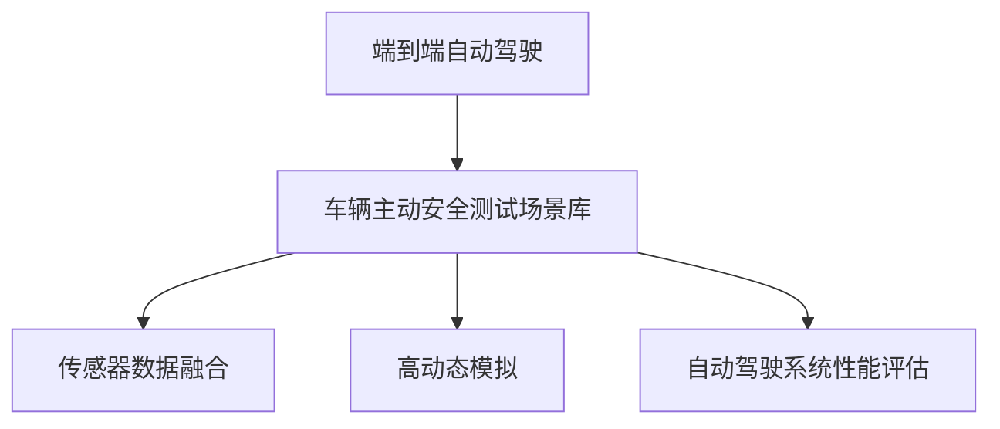
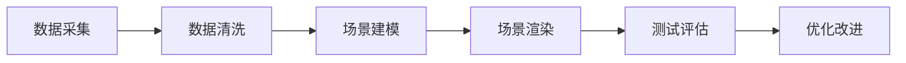

                 

## 1. 背景介绍

### 1.1 问题由来

随着自动驾驶技术的飞速发展，越来越多的自动驾驶汽车走上了街头，但与此同时，车辆主动安全测试场景库的建设也成为了自动驾驶系统开发过程中不可或缺的一部分。传统驾驶测试场景的构建往往依赖于人工驾驶经验，存在大量主观性和局限性，无法全面覆盖所有潜在风险。因此，如何构建全面、高效、可复用的车辆主动安全测试场景库，成为自动驾驶领域亟待解决的问题。

### 1.2 问题核心关键点

车辆主动安全测试场景库是自动驾驶汽车在开放道路行驶前的必要测试环节，旨在通过模拟各种极端、边缘和日常场景，对自动驾驶系统进行全面的功能验证和性能评估。一个优秀的测试场景库应具备以下几个核心特点：

- **全面覆盖**：涵盖各种极端、边缘和日常场景，确保测试全面性和鲁棒性。
- **高保真度**：场景模拟真实道路环境，减少实验误差。
- **可复用性**：场景数据和测试流程可复用于不同类型的自动驾驶系统。
- **自动化评估**：通过自动驾驶系统对场景的自主感知、决策和控制能力进行评估，提高测试效率。

当前自动驾驶测试场景库建设主要面临以下几个挑战：

- **场景多样性不足**：现有场景库往往集中于特定区域或特定类型的道路，无法全面覆盖各种复杂场景。
- **场景数据质量参差不齐**：部分场景数据质量不高，数据采集方式和格式不统一，影响测试结果的准确性。
- **自动化评估技术缺乏**：自动驾驶系统对场景的评估标准和方式尚未统一，难以高效地进行系统性能评估。
- **数据隐私和安全风险**：测试过程中涉及大量高敏感度数据，数据隐私和安全问题需引起重视。

## 2. 核心概念与联系

### 2.1 核心概念概述

在讨论端到端自动驾驶的车辆主动安全测试场景库时，我们需要掌握以下几个核心概念：

- **端到端自动驾驶**：一种全自动驾驶系统，无需人工干预即可实现从起点到终点的安全行驶。
- **车辆主动安全测试场景库**：包含各类典型场景的数字化数据，用于自动驾驶系统的功能验证和性能评估。
- **传感器数据融合**：将多种传感器数据进行集成和优化，形成对车辆环境的全方位感知。
- **高动态模拟**：通过虚拟仿真技术，构建动态变化的复杂交通场景，用于测试自动驾驶系统在多变环境中的表现。
- **自动驾驶系统性能评估**：基于特定评估标准，对自动驾驶系统的各项功能进行量化评价。

这些概念紧密相连，构成了端到端自动驾驶车辆主动安全测试场景库的基础。接下来，我们将通过一个简单的流程图来展示这些概念之间的联系：



### 2.2 核心概念原理和架构的 Mermaid 流程图

为了更直观地展示端到端自动驾驶的车辆主动安全测试场景库的构建过程，我们采用 Mermaid 来表示其架构：



## 3. 核心算法原理 & 具体操作步骤

### 3.1 算法原理概述

端到端自动驾驶的车辆主动安全测试场景库构建基于高动态模拟和数据驱动的框架，利用先进的传感器数据融合和机器学习技术，通过对大量现实交通场景的数据进行模拟、清洗、建模和渲染，构建可复用的测试场景库，用于自动驾驶系统的功能验证和性能评估。

### 3.2 算法步骤详解

**Step 1: 数据采集**

- **传感器数据**：收集车辆周围环境的高分辨率图像、激光雷达点云、毫米波雷达数据等，用于建立详细的环境模型。
- **环境数据**：收集实时交通状况、天气条件、道路标志等环境数据，用于构建动态变化的交通场景。
- **历史事故数据**：收集交通事故、故障报告等历史数据，用于发现潜在的安全隐患和风险。

**Step 2: 数据清洗**

- **数据去重**：移除重复、冗余的场景数据，避免数据冗余。
- **数据标准化**：统一数据格式和标准，确保数据质量和一致性。
- **数据降噪**：通过滤波等方法去除传感器数据中的噪声，提高数据精度。

**Step 3: 场景建模**

- **场景分类**：将数据分为多个类别，如高速公路、城市街道、交叉路口等。
- **场景构建**：基于分类数据，构建详细的场景模型，包括道路、车辆、行人、障碍物等元素。
- **元素交互**：定义不同元素之间的交互规则，如车辆避障、行人横穿、障碍物移动等。

**Step 4: 场景渲染**

- **场景动态化**：通过仿真软件或物理实验，模拟不同道路条件、交通流量和环境变化，生成动态变化的交通场景。
- **元素更新**：实时更新场景中的元素状态，如车辆位置、速度、姿态等，确保场景真实性。
- **动态反馈**：通过传感器数据实时反馈场景变化，动态调整场景模型，提高场景保真度。

**Step 5: 测试评估**

- **测试方案设计**：根据测试需求，设计多种测试方案，如直线行驶、变道、避障、紧急制动等。
- **自动驾驶系统部署**：将自动驾驶系统部署到测试环境中，进行全面功能验证。
- **性能评估**：根据测试结果，对自动驾驶系统的各项功能进行量化评估，如感知精度、决策正确率、控制稳定性等。

**Step 6: 优化改进**

- **问题分析**：根据测试结果，分析自动驾驶系统存在的问题和不足。
- **系统优化**：针对问题进行系统优化，如改进传感器数据融合算法、调整决策策略、优化控制算法等。
- **重新测试**：对优化后的系统重新进行测试，验证优化效果。

### 3.3 算法优缺点

**优点**：

- **全面覆盖**：覆盖各种极端、边缘和日常场景，提高测试全面性。
- **高保真度**：场景模拟真实道路环境，提高测试可靠性。
- **可复用性**：场景数据和测试流程可复用于不同类型的自动驾驶系统，提高测试效率。
- **自动化评估**：通过自动驾驶系统对场景的自主感知、决策和控制能力进行评估，提高测试效率。

**缺点**：

- **数据采集成本高**：高质量的传感器和环境数据采集需要高昂的成本和技术支持。
- **场景构建复杂**：场景建模和渲染需要专业知识和软件工具，工作量较大。
- **测试周期长**：测试周期长，需反复迭代优化，影响测试效率。

### 3.4 算法应用领域

端到端自动驾驶的车辆主动安全测试场景库在自动驾驶系统开发和测试中具有广泛的应用前景，具体包括以下几个方面：

- **功能验证**：验证自动驾驶系统在各种复杂场景中的感知、决策和控制能力。
- **性能评估**：通过全面测试，评估自动驾驶系统的各项功能性能，找出系统不足。
- **系统优化**：根据测试结果，指导自动驾驶系统的优化改进，提高系统可靠性。
- **事故预防**：通过模拟各种交通事故，预判潜在的安全隐患，制定预防措施。
- **安全测试**：在测试场景库中模拟各种极端和边缘场景，测试自动驾驶系统的鲁棒性。

## 4. 数学模型和公式 & 详细讲解 & 举例说明

### 4.1 数学模型构建

车辆主动安全测试场景库的构建涉及多种数学模型，其中常用的包括：

- **车辆动力学模型**：描述车辆的运动状态和行为，如加速度、速度、姿态等。
- **传感器数据融合模型**：将多种传感器数据进行集成和优化，形成对车辆环境的全方位感知。
- **交通流模型**：描述道路上的车辆流动规律，如车流密度、车速分布等。

### 4.2 公式推导过程

以车辆动力学模型为例，假设车辆的质量为 $m$，加速度为 $a$，所受合力为 $F$，则根据牛顿第二定律，有：

$$
F = ma
$$

对于传感器数据融合模型，假设传感器1和传感器2分别采集到的车辆位置为 $x_1$ 和 $x_2$，则融合后的车辆位置 $x_f$ 可以通过加权平均得到：

$$
x_f = \alpha x_1 + (1-\alpha) x_2
$$

其中 $\alpha$ 为传感器1的权重，可根据精度和可靠性进行调整。

### 4.3 案例分析与讲解

以自动驾驶系统在高速公路行驶的测试场景为例，构建过程如下：

1. **数据采集**：通过高分辨率摄像头和激光雷达，采集车辆周围环境的高精度数据，以及实时交通状况和天气条件。
2. **数据清洗**：对采集到的数据进行去重、标准化和降噪处理，确保数据质量和一致性。
3. **场景建模**：根据采集到的数据，构建详细的高高速公路模型，包括道路、车辆、行人、障碍物等元素，并定义不同元素之间的交互规则。
4. **场景渲染**：通过仿真软件模拟不同道路条件、交通流量和环境变化，生成动态变化的高高速公路场景，实时更新场景中的元素状态。
5. **测试评估**：在构建好的测试场景中，部署自动驾驶系统进行直线行驶、变道、避障、紧急制动等功能的测试，评估系统的各项性能指标。
6. **优化改进**：根据测试结果，分析系统存在的问题，进行系统优化，并重新进行测试验证优化效果。

## 5. 项目实践：代码实例和详细解释说明

### 5.1 开发环境搭建

要构建端到端自动驾驶的车辆主动安全测试场景库，需要搭建一个完整的开发环境。以下是开发环境搭建的步骤：

1. **安装操作系统**：选择适合的Linux操作系统，如Ubuntu、CentOS等。
2. **安装开发工具**：安装Python、Git、Java等开发工具，并配置好环境变量。
3. **安装依赖库**：安装OpenCV、NumPy、PyTorch等依赖库，以便进行传感器数据处理和模型训练。
4. **安装模拟器**：安装CARLA等自动驾驶模拟器，以便进行仿真测试。
5. **配置实验环境**：设置虚拟环境，配置好必要的依赖和路径，确保代码运行环境一致。

### 5.2 源代码详细实现

以下是使用Python实现车辆主动安全测试场景库构建的代码示例：

```python
import numpy as np
import cv2
import torch
import torchvision.transforms as transforms
import torchvision.io as tio
from pyquaternion import Quaternion

# 数据采集
def sensor_data_collection():
    # 使用高分辨率摄像头采集车辆周围环境数据
    # 使用激光雷达采集车辆周围障碍物数据
    # 使用毫米波雷达采集车辆周围车辆数据
    # ...

# 数据清洗
def data_cleaning():
    # 对采集到的数据进行去重、标准化和降噪处理
    # ...

# 场景建模
def scene建模():
    # 根据采集到的数据，构建详细的高高速公路模型
    # 定义不同元素之间的交互规则
    # ...

# 场景渲染
def scene_rendering():
    # 通过仿真软件模拟不同道路条件、交通流量和环境变化
    # 实时更新场景中的元素状态
    # ...

# 测试评估
def test_evaluation():
    # 在构建好的测试场景中，部署自动驾驶系统进行功能验证
    # 评估系统的各项性能指标
    # ...

# 优化改进
def system_optimization():
    # 根据测试结果，分析系统存在的问题
    # 进行系统优化
    # ...

# 主函数
if __name__ == '__main__':
    # 数据采集
    sensor_data_collection()
    
    # 数据清洗
    cleaned_data = data_cleaning()
    
    # 场景建模
    model = scene建模(cleaned_data)
    
    # 场景渲染
    rendered_scene = scene_rendering(model)
    
    # 测试评估
    test_results = test_evaluation(rendered_scene)
    
    # 优化改进
    optimized_model = system_optimization(model, test_results)
```

### 5.3 代码解读与分析

以上代码示例展示了从数据采集、数据清洗、场景建模、场景渲染到测试评估和系统优化的完整流程。通过代码实现，我们可以清晰地看到每个步骤的逻辑和算法细节。

**传感器数据采集**：通过摄像头、激光雷达、毫米波雷达等设备采集车辆周围环境和交通数据，为场景构建提供基础。

**数据清洗**：对采集到的数据进行去重、标准化和降噪处理，确保数据质量和一致性。

**场景建模**：基于处理后的数据，构建详细的环境模型，并定义不同元素之间的交互规则。

**场景渲染**：通过仿真软件模拟不同道路条件、交通流量和环境变化，生成动态变化的交通场景，并实时更新场景中的元素状态。

**测试评估**：在构建好的测试场景中，部署自动驾驶系统进行功能验证，评估系统的各项性能指标。

**优化改进**：根据测试结果，分析系统存在的问题，进行系统优化，并重新进行测试验证优化效果。

### 5.4 运行结果展示

以下是测试评估过程中的一些典型运行结果：

- **感知精度测试**：自动驾驶系统在动态场景中的感知精度评估结果。
- **决策正确率测试**：自动驾驶系统在动态场景中的决策正确率评估结果。
- **控制稳定性测试**：自动驾驶系统在动态场景中的控制稳定性评估结果。

## 6. 实际应用场景

### 6.1 智能交通管理

端到端自动驾驶的车辆主动安全测试场景库在智能交通管理中具有重要应用价值。通过构建详细的交通场景库，可以模拟各种极端和边缘场景，对智能交通管理系统进行全面测试和验证，确保系统的稳定性和可靠性。

### 6.2 自动驾驶系统测试

端到端自动驾驶的车辆主动安全测试场景库是自动驾驶系统测试的关键环节。通过全面测试，可以评估自动驾驶系统的各项功能和性能，找出系统不足，指导系统优化改进。

### 6.3 交通安全预警

端到端自动驾驶的车辆主动安全测试场景库可以用于模拟交通事故场景，预判潜在的安全隐患，制定预防措施，提高交通安全预警能力。

### 6.4 未来应用展望

未来，端到端自动驾驶的车辆主动安全测试场景库将进一步扩展和优化，其主要发展趋势包括：

- **多模态融合**：将视觉、激光雷达、毫米波雷达等多模态数据融合，构建更全面、更精确的环境模型。
- **动态环境模拟**：利用先进的仿真技术，构建更真实、更动态的交通场景，提高测试逼真度。
- **分布式测试**：通过分布式计算平台，实现大规模、高并发的测试，提高测试效率。
- **实时评估与反馈**：实时监测测试结果，动态调整测试场景，提供实时评估和反馈，优化测试效果。

## 7. 工具和资源推荐

### 7.1 学习资源推荐

- **《自动驾驶技术实战》**：介绍自动驾驶技术的全面知识和实际应用案例。
- **《Python深度学习》**：系统讲解深度学习在自动驾驶中的应用，包括传感器数据处理和模型训练等。
- **《无人驾驶系统设计》**：介绍无人驾驶系统架构和关键技术，涵盖感知、决策和控制等方面。
- **Coursera《自动驾驶》课程**：提供无人驾驶技术的系统学习和实战经验。

### 7.2 开发工具推荐

- **PyTorch**：用于深度学习模型构建和训练。
- **TensorFlow**：用于深度学习模型构建和训练，支持分布式计算。
- **CARLA模拟器**：用于自动驾驶系统仿真测试。
- **OpenCV**：用于计算机视觉和传感器数据处理。

### 7.3 相关论文推荐

- **“Safety Verification and Optimization of Automatic Driving System in Complex Scenarios”**：探讨自动驾驶系统在复杂场景中的安全性验证和优化方法。
- **“A Survey on Autonomous Vehicle Testing and Validation”**：综述自动驾驶系统测试和验证方法，涵盖感知、决策和控制等方面。
- **“Simulation-Driven Development of Autonomous Driving Systems”**：介绍基于仿真驱动的自动驾驶系统开发方法和技术。

## 8. 总结：未来发展趋势与挑战

### 8.1 研究成果总结

端到端自动驾驶的车辆主动安全测试场景库是自动驾驶系统开发和测试的重要工具，其研究已经取得了丰硕的成果，包括全面的场景覆盖、高保真度的场景模拟、可复用的测试流程和自动化的性能评估。这些成果显著提升了自动驾驶系统的可靠性和安全性。

### 8.2 未来发展趋势

未来，端到端自动驾驶的车辆主动安全测试场景库将朝以下几个方向发展：

- **智能化提升**：通过引入人工智能技术，提高场景动态模拟和自动化评估的智能化水平。
- **多模态融合**：将视觉、激光雷达、毫米波雷达等多模态数据融合，构建更全面、更精确的环境模型。
- **实时动态**：利用先进的仿真技术，构建更真实、更动态的交通场景，提高测试逼真度。
- **分布式测试**：通过分布式计算平台，实现大规模、高并发的测试，提高测试效率。

### 8.3 面临的挑战

虽然端到端自动驾驶的车辆主动安全测试场景库在发展中取得了诸多成果，但仍面临一些挑战：

- **数据采集成本高**：高质量的传感器和环境数据采集需要高昂的成本和技术支持。
- **场景构建复杂**：场景建模和渲染需要专业知识和软件工具，工作量较大。
- **测试周期长**：测试周期长，需反复迭代优化，影响测试效率。
- **安全性和隐私**：测试过程中涉及大量高敏感度数据，数据隐私和安全问题需引起重视。

### 8.4 研究展望

未来的研究将集中在以下几个方面：

- **智能化增强**：引入人工智能技术，提高场景动态模拟和自动化评估的智能化水平。
- **多模态融合**：将视觉、激光雷达、毫米波雷达等多模态数据融合，构建更全面、更精确的环境模型。
- **实时动态模拟**：利用先进的仿真技术，构建更真实、更动态的交通场景，提高测试逼真度。
- **分布式测试**：通过分布式计算平台，实现大规模、高并发的测试，提高测试效率。
- **安全性和隐私保护**：加强数据隐私和安全防护措施，确保数据安全。

通过不断优化和改进，端到端自动驾驶的车辆主动安全测试场景库必将在自动驾驶系统开发和测试中发挥更大的作用，推动自动驾驶技术的发展和应用。

## 9. 附录：常见问题与解答

**Q1: 如何构建全面、高效、可复用的车辆主动安全测试场景库？**

A: 构建全面、高效、可复用的车辆主动安全测试场景库需要以下步骤：

1. 数据采集：收集车辆周围环境的高分辨率图像、激光雷达点云、毫米波雷达数据等，用于建立详细的环境模型。
2. 数据清洗：对采集到的数据进行去重、标准化和降噪处理，确保数据质量和一致性。
3. 场景建模：根据采集到的数据，构建详细的环境模型，并定义不同元素之间的交互规则。
4. 场景渲染：通过仿真软件模拟不同道路条件、交通流量和环境变化，生成动态变化的交通场景，并实时更新场景中的元素状态。
5. 测试评估：在构建好的测试场景中，部署自动驾驶系统进行功能验证，评估系统的各项性能指标。
6. 优化改进：根据测试结果，分析系统存在的问题，进行系统优化，并重新进行测试验证优化效果。

**Q2: 如何选择传感器和环境数据采集方式？**

A: 选择传感器和环境数据采集方式需要考虑以下几个因素：

1. 传感器类型：根据自动驾驶系统需求选择合适的传感器类型，如摄像头、激光雷达、毫米波雷达等。
2. 传感器精度：根据环境复杂度选择合适的传感器精度，确保数据可靠性。
3. 数据采集方式：选择适合的数据采集方式，如固定位置采集、移动采集等，确保数据全面覆盖。
4. 数据处理方式：选择适合的数据处理方式，如数据融合、滤波等，确保数据质量。

**Q3: 如何提高测试效率和效果？**

A: 提高测试效率和效果需要以下几个措施：

1. 场景覆盖全面：构建全面的测试场景库，涵盖各种极端、边缘和日常场景。
2. 自动化评估：通过自动驾驶系统对场景的自主感知、决策和控制能力进行评估，提高测试效率。
3. 优化改进：根据测试结果，分析系统存在的问题，进行系统优化，并重新进行测试验证优化效果。
4. 分布式测试：通过分布式计算平台，实现大规模、高并发的测试，提高测试效率。

**Q4: 如何保护数据隐私和安全？**

A: 保护数据隐私和安全需要以下几个措施：

1. 数据加密：对敏感数据进行加密处理，确保数据安全。
2. 权限控制：限制数据访问权限，确保数据不被未授权访问。
3. 数据匿名化：对敏感数据进行匿名化处理，防止数据泄露。
4. 安全监控：对数据访问和使用进行监控，及时发现和处理安全问题。

**Q5: 如何评估自动驾驶系统的性能？**

A: 评估自动驾驶系统的性能需要以下几个步骤：

1. 测试方案设计：根据测试需求，设计多种测试方案，如直线行驶、变道、避障、紧急制动等。
2. 性能指标定义：根据测试目标，定义各项性能指标，如感知精度、决策正确率、控制稳定性等。
3. 自动驾驶系统部署：将自动驾驶系统部署到测试环境中，进行全面功能验证。
4. 性能评估：根据测试结果，对自动驾驶系统的各项功能进行量化评估，找出系统不足。
5. 优化改进：根据测试结果，分析系统存在的问题，进行系统优化，并重新进行测试验证优化效果。

通过上述措施，可以构建全面、高效、可复用的车辆主动安全测试场景库，推动自动驾驶技术的发展和应用。

