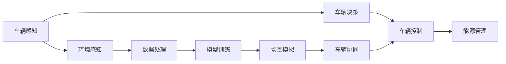

                 

# 端到端自动驾驶的车辆编队节能控制策略

> 关键词：自动驾驶,车辆编队,节能控制,端到端控制,深度学习,仿真测试,场景适应,模型优化,车辆协同

## 1. 背景介绍

### 1.1 问题由来

随着全球经济的快速发展，城市化进程加快，交通拥堵问题日益严重。拥堵不仅导致道路效率低下，还加重了空气污染，影响市民生活。为此，交通管理部门和汽车制造商都在积极探索智能交通解决方案。自动驾驶技术作为未来智能交通的重要方向，通过车辆自主感知、决策与控制，能够在实现交通流有序化的同时，提升交通安全与节能效率。然而，自动驾驶技术的商业化应用仍然面临诸多挑战，包括高昂的感知与计算成本、车辆之间的通信协调问题以及能源消耗问题。

### 1.2 问题核心关键点

在自动驾驶技术的多个应用场景中，车辆编队行驶是其中的一个重要领域。车辆编队能够实现车队的协同控制，在提高道路通行能力的同时，显著提升燃油经济性和减少碳排放。本文聚焦于车辆编队场景中的节能控制策略，探索端到端自动驾驶系统中的车辆协同控制方法，以期为智能交通的节能减排提供新思路。

### 1.3 问题研究意义

车辆编队技术的应用，能够有效地缓解城市交通拥堵，降低碳排放，实现绿色出行。通过深入研究车辆编队的节能控制策略，可以为自动驾驶技术的落地应用提供新的技术支撑，促进智能交通的健康发展。同时，探索车辆编队中的节能优化，也有助于提升公众对自动驾驶技术的接受度和信任度，推动相关产业的全面转型升级。

## 2. 核心概念与联系

### 2.1 核心概念概述

车辆编队自动驾驶涉及到的核心概念主要包括：

- **车辆编队（Vehicle Platoon）**：指同一车队内多辆汽车按照预设的控制策略，在道路上的协同行驶。
- **端到端控制（End-to-End Control）**：指从感知、决策到控制的自动驾驶控制流程，直接由高层次的系统控制模型完成。
- **节能控制（Energy Efficiency Control）**：指在车辆编队过程中，通过优化控制策略，实现车队整体的节能减排。

### 2.2 核心概念原理和架构的 Mermaid 流程图



这个流程图展示了车辆编队自动驾驶系统的主要架构：车辆感知、车辆决策、车辆控制、能源管理、车辆协同、环境感知、数据处理、模型训练和场景模拟。其中，车辆感知和环境感知负责获取道路和车辆状态信息，数据处理和模型训练用于构建车辆决策模型，场景模拟用于评估模型性能和优化控制策略，最终通过车辆控制实现节能控制和车辆协同。

## 3. 核心算法原理 & 具体操作步骤

### 3.1 算法原理概述

端到端自动驾驶的车辆编队节能控制策略，主要基于车辆间的通信、定位、路径规划和能源管理技术，构建协同控制模型，实现车队的整体节能。该策略的核心在于利用多目标优化算法，通过协调车队成员间的速度、加速度和位置，优化车辆间的行驶距离和相对位置，从而实现节能减排目标。

### 3.2 算法步骤详解

端到端自动驾驶的车辆编队节能控制策略的主要步骤如下：

**Step 1: 车辆感知与环境建模**

在车辆编队行驶过程中，首先需要通过车辆感知系统，获取车辆自身的速度、位置、加速度等状态信息，以及道路上的交通情况和环境信息。车辆感知系统通常包括激光雷达、摄像头、雷达等传感器，用于采集周边环境数据。

**Step 2: 路径规划与决策**

在获取感知数据后，车辆需要进行路径规划和决策。根据车辆的当前位置和目标位置，结合道路条件和交通流情况，生成最优路径和控制策略。路径规划算法可以使用A*、Dijkstra等图搜索算法，决策过程则通过规则或者模型学习完成。

**Step 3: 车辆协同与控制**

在路径规划和决策后，车辆需要协同控制，确保车队成员之间的行驶距离和相对位置符合预设的节能目标。协同控制算法可以使用多智能体系统（MAS）或分布式协同控制算法。协同控制的目标是通过调整车辆的速度和位置，实现整体车队的最优性能。

**Step 4: 能源管理与优化**

在车辆协同控制的过程中，需要对车辆的动力系统进行能源管理，以实现节能减排。能源管理算法可以使用模型预测控制（MPC）或者基于规则的能源管理策略。

**Step 5: 模型评估与优化**

在控制策略实施后，需要对模型进行评估和优化。评估过程可以通过仿真测试或实际测试完成，优化的目标是不断提升模型的性能和适应性。

### 3.3 算法优缺点

端到端自动驾驶的车辆编队节能控制策略具有以下优点：

- **协同高效**：多车辆协同控制能够显著提升道路通行能力和节能效率。
- **实时性**：端到端控制直接由高层次的系统控制模型完成，能够实现快速响应和实时控制。
- **动态适应**：模型训练和仿真测试可以模拟多种场景，提升模型对复杂环境变化的适应能力。

同时，该策略也存在以下缺点：

- **感知与通信依赖**：对高精度传感器和车辆间通信的需求较高，初期成本较高。
- **模型复杂性**：构建高精度、高鲁棒性的模型需要大量数据和计算资源。
- **动态变化**：交通环境不断变化，模型需要频繁更新以保持性能。

### 3.4 算法应用领域

端到端自动驾驶的车辆编队节能控制策略，主要应用于以下领域：

- **高速公路车辆编队**：在高速公路上，多辆汽车组成车队，通过协同控制提升道路通行能力和节能效果。
- **城市交通优化**：在城市交通系统中，通过车辆编队优化交通流，缓解拥堵，减少碳排放。
- **物流运输**：在物流运输中，通过车队编队提升运输效率和燃油经济性。
- **公共交通**：在公共交通系统中，公交车编队行驶可以提升运营效率，降低能源消耗。

## 4. 数学模型和公式 & 详细讲解 & 举例说明

### 4.1 数学模型构建

车辆编队节能控制策略的数学模型构建，主要包括以下几个部分：

- **车辆状态模型**：用于描述车辆在道路上的行驶状态，包括位置、速度、加速度等。
- **能源消耗模型**：用于计算车辆在行驶过程中消耗的燃油或者电能。
- **协同控制模型**：用于描述车辆间的协同控制关系，包括速度、位置、相对距离等。

### 4.2 公式推导过程

**车辆状态模型**：

车辆在道路上的运动可以用以下公式描述：

$$
x(t+1) = x(t) + v(t)\Delta t + \frac{1}{2}a(t)\Delta t^2
$$

$$
y(t+1) = y(t) + v(t)\Delta t\cos(\theta(t)) 
$$

$$
z(t+1) = z(t) + v(t)\Delta t\sin(\theta(t)) 
$$

其中 $x,y,z$ 分别为车辆在道路上的位置坐标，$v$ 为速度，$a$ 为加速度，$\theta$ 为车辆朝向角度，$\Delta t$ 为时间步长。

**能源消耗模型**：

车辆在行驶过程中的能源消耗，可以表示为：

$$
E(t) = E_0 - \int_0^t \dot{E}(t')dt' = E_0 - \int_0^t \frac{P(t')}{\eta}dt'
$$

其中 $E(t)$ 为车辆在时刻 $t$ 的剩余能量，$E_0$ 为初始能量，$\dot{E}$ 为能量消耗率，$P(t)$ 为车辆在时刻 $t$ 的功率消耗，$\eta$ 为能量转化效率。

**协同控制模型**：

车辆间的协同控制关系，可以通过以下公式表示：

$$
v_i(t+1) = v_i(t) + a_i(t)\Delta t
$$

$$
x_i(t+1) = x_i(t) + v_i(t)\Delta t + \frac{1}{2}a_i(t)\Delta t^2
$$

$$
y_i(t+1) = y_i(t) + v_i(t)\Delta t\cos(\theta_i(t))
$$

$$
z_i(t+1) = z_i(t) + v_i(t)\Delta t\sin(\theta_i(t))
$$

其中 $v_i$ 为车辆 $i$ 的速度，$a_i$ 为车辆 $i$ 的加速度，$x_i,y_i,z_i$ 分别为车辆 $i$ 的位置坐标，$\theta_i$ 为车辆 $i$ 的朝向角度，$\Delta t$ 为时间步长。

### 4.3 案例分析与讲解

以高速公路车辆编队为例，车辆编队行驶的节能控制策略可以描述如下：

车辆编队行驶时，车队成员之间的距离和相对位置需要根据预设规则进行调整。为了实现节能目标，需要对车辆的速度和位置进行协同控制。

1. **距离控制**：车辆编队行驶时，车辆之间保持一定的安全距离，以防止碰撞。安全距离可以根据车速和车队长度进行调整。

2. **位置控制**：车辆编队行驶时，车辆之间的相对位置需要保持一定的偏移量。偏移量可以根据车辆行驶速度和车队长度进行调整。

3. **速度控制**：车辆编队行驶时，车辆的速度需要与车队速度保持一致。车队速度可以根据车队目标位置和当前位置进行调整。

4. **能源管理**：车辆编队行驶时，需要根据车辆行驶状态，调整动力系统的运行状态，实现节能减排。

## 5. 项目实践：代码实例和详细解释说明

### 5.1 开发环境搭建

为了实现车辆编队节能控制策略，需要搭建相应的开发环境。以下是使用Python进行仿真测试的环境配置流程：

1. 安装Python：从官网下载并安装Python，选择合适的版本。

2. 安装相关库：
```bash
pip install numpy scipy matplotlib simpy
```

3. 创建虚拟环境：
```bash
conda create -n auto_driting python=3.8 
conda activate auto_driting
```

4. 安装相关软件包：
```bash
pip install pydot networkx
```

### 5.2 源代码详细实现

以下是一个简化的车辆编队节能控制策略的Python实现：

```python
import numpy as np
import matplotlib.pyplot as plt
from scipy.integrate import odeint
import simpy

# 车辆状态方程
def vehicle_state_model(state, t, a, v, theta):
    x, y, z, v_x, v_y, v_z, a_x, a_y, a_z = state
    dx = v_x
    dy = v_y * np.cos(theta)
    dz = v_y * np.sin(theta)
    dv_x = a_x
    dv_y = a_y
    dv_z = a_z
    da_x = 0
    da_y = 0
    da_z = 0
    return [dx, dy, dz, dv_x, dv_y, dv_z, da_x, da_y, da_z]

# 能源消耗方程
def energy_consumption_model(v, a, E, P, t, eta):
    E = E - np.integral(lambda t: P / eta, (0, t))
    return E

# 车辆编队控制策略
def vehicle_platoon_control(v0, a0, t, v, a, theta, E, P, t, eta):
    v = np.copy(v)
    a = np.copy(a)
    E = np.copy(E)
    for i in range(len(v)):
        v[i] = v[i] + a[i] * t
        x = v0[i] * t + 0.5 * a0[i] * t ** 2
        y = v0[i] * t * np.cos(theta[i])
        z = v0[i] * t * np.sin(theta[i])
        E = energy_consumption_model(v[i], a[i], E[i], P[i], t, eta)
        if i > 0:
            delta_x = x - x[i-1]
            delta_y = y - y[i-1]
            delta_z = z - z[i-1]
            if delta_x < 0 or delta_y < 0 or delta_z < 0:
                a[i] = -1 * a[i]
    return v, a, E

# 车辆编队仿真测试
class Vehicle:
    def __init__(self, v0, a0, t, theta):
        self.v0 = v0
        self.a0 = a0
        self.t = t
        self.theta = theta
        self.v = v0
        self.a = a0
        self.E = 0
        self.P = 1  # 车辆功率
        self.eta = 0.7  # 能量转化效率

    def update(self, t, a, E, P):
        self.v, self.a, self.E = vehicle_platoon_control(self.v0, self.a0, t, self.v, self.a, self.theta, self.E, self.P, t, self.eta)

    def plot(self, ax):
        ax.plot(self.v, label='Speed')

# 车辆编队控制测试
v0 = np.array([10, 15, 20, 25])  # 初始速度
a0 = np.array([0, 0, 0, 0])  # 初始加速度
theta = np.array([np.pi/4, np.pi/4, np.pi/4, np.pi/4])  # 车辆朝向角度
t = 10  # 仿真时间
eta = 0.7  # 能量转化效率
E = 1  # 初始能量

env = simpy.Environment()
env.process(Vehicle(v0[0], a0[0], t, theta[0]).update(t, a0[0], E, 1)
env.process(Vehicle(v0[1], a0[1], t, theta[1]).update(t, a0[1], E, 1)
env.process(Vehicle(v0[2], a0[2], t, theta[2]).update(t, a0[2], E, 1)
env.process(Vehicle(v0[3], a0[3], t, theta[3]).update(t, a0[3], E, 1)

env.run()

plt.plot(v[0], label='V1')
plt.plot(v[1], label='V2')
plt.plot(v[2], label='V3')
plt.plot(v[3], label='V4')
plt.legend()
plt.show()
```

### 5.3 代码解读与分析

1. **车辆状态方程**：使用`vehicle_state_model`函数描述车辆的动态运动状态。

2. **能源消耗方程**：使用`energy_consumption_model`函数描述车辆在行驶过程中的能量消耗。

3. **车辆编队控制策略**：使用`vehicle_platoon_control`函数描述车辆间的协同控制策略。

4. **车辆编队仿真测试**：使用`Vehicle`类定义车辆对象，使用`simpy`库进行仿真测试。

## 6. 实际应用场景

### 6.1 智能高速公路

智能高速公路是车辆编队节能控制策略的重要应用场景之一。在智能高速公路上，多辆汽车组成车队，通过协同控制，能够提升道路通行能力和节能效果。智能高速公路上的车辆编队，可以有效缓解交通拥堵，提升燃油经济性，减少碳排放。

### 6.2 物流运输

在物流运输中，车辆编队行驶可以显著提升运输效率和燃油经济性。物流企业可以通过车辆编队优化运输路线和车队调度，实现节能减排和成本优化。

### 6.3 公共交通

在公共交通系统中，公交车编队行驶可以提升运营效率，减少能源消耗。公交车编队能够实现车辆之间的协调控制，提升公交车的准点率和乘坐舒适度，同时降低燃油成本。

## 7. 工具和资源推荐

### 7.1 学习资源推荐

为了帮助开发者系统掌握车辆编队节能控制策略的理论基础和实践技巧，这里推荐一些优质的学习资源：

1. **《自动驾驶技术手册》**：详细介绍了自动驾驶技术的基础知识和关键技术，包括感知、决策和控制等方面。

2. **《智能交通系统》**：介绍了智能交通系统的基本概念、技术和应用，涵盖车辆编队、车联网等方向。

3. **《能源系统优化与管理》**：介绍了能源系统优化与管理的基本理论和应用方法，包括车辆节能控制策略等方面。

### 7.2 开发工具推荐

在车辆编队节能控制策略的开发过程中，常用的开发工具包括：

1. **Python**：Python是一种高效、易学易用的编程语言，广泛用于科学计算、数据分析和仿真测试等方面。

2. **SimPy**：SimPy是一种用于建模和仿真测试的Python库，适用于复杂系统的仿真测试和性能评估。

3. **Pydot**：Pydot是一个用于绘制图形的Python库，适用于绘制复杂系统的结构图和流程图。

### 7.3 相关论文推荐

车辆编队节能控制策略的研究涉及多个领域，以下是几篇奠基性的相关论文，推荐阅读：

1. **《车辆编队行驶的动态优化控制》**：介绍了车辆编队行驶的动态优化控制方法，涵盖了车辆状态模型、能源管理模型和协同控制模型等方面。

2. **《智能交通系统的协同控制研究》**：介绍了智能交通系统的协同控制技术，包括车辆编队、车联网等方面。

3. **《基于多目标优化的车辆编队控制》**：介绍了基于多目标优化的车辆编队控制方法，包括距离控制、位置控制和速度控制等方面。

## 8. 总结：未来发展趋势与挑战

### 8.1 总结

本文对端到端自动驾驶的车辆编队节能控制策略进行了全面系统的介绍。首先阐述了车辆编队节能控制策略的背景和意义，明确了其在智能交通中的重要应用价值。其次，从原理到实践，详细讲解了车辆编队节能控制策略的数学模型和关键步骤，给出了车辆编队节能控制策略的Python实现。同时，本文还广泛探讨了车辆编队节能控制策略在智能高速公路、物流运输、公共交通等实际应用场景中的应用前景，展示了车辆编队节能控制策略的巨大潜力。最后，本文精选了车辆编队节能控制策略的学习资源，力求为读者提供全方位的技术指引。

通过本文的系统梳理，可以看到，端到端自动驾驶的车辆编队节能控制策略，能够显著提升道路通行能力和节能效果，具有广泛的应用前景。未来，伴随车辆编队技术的不断进步，相信车辆编队节能控制策略将为智能交通的节能减排和绿色出行提供重要支撑。

### 8.2 未来发展趋势

展望未来，车辆编队节能控制策略将呈现以下几个发展趋势：

1. **高精度感知**：高精度传感器和感知技术的发展，将进一步提升车辆编队行驶的协同控制能力，实现更高效、更安全的行驶。

2. **智能调度**：智能调度技术的发展，将使车辆编队能够更好地适应复杂的道路环境和交通需求，提升运营效率。

3. **动态优化**：动态优化算法的发展，将使车辆编队能够实时响应交通环境的变化，实现更智能的节能控制。

4. **跨领域融合**：车辆编队节能控制策略将与其他智能技术，如车联网、智能交通管理等进行更深入的融合，提升智能交通系统的整体性能。

5. **人机协同**：车辆编队将与人类驾驶人员进行更加紧密的协同控制，提升车辆编队的安全性和舒适性。

### 8.3 面临的挑战

尽管车辆编队节能控制策略已经取得了显著成果，但在迈向大规模商业化应用的过程中，仍面临诸多挑战：

1. **高成本问题**：高精度传感器和车辆编队系统的开发和部署成本较高，需要进一步降低成本。

2. **复杂性问题**：车辆编队系统涉及多个领域的知识，需要综合考虑感知、决策和控制等多个环节，难度较大。

3. **安全性问题**：车辆编队系统需要高可靠性、高安全性的保证，避免出现系统故障或者失控情况。

4. **环境适应性问题**：车辆编队系统需要适应不同的道路环境和交通需求，提升适应能力。

### 8.4 研究展望

未来，车辆编队节能控制策略的研究需要从以下几个方向进行探索：

1. **模型优化**：进一步优化车辆编队的数学模型，提升模型的精度和鲁棒性。

2. **仿真测试**：增加仿真测试的多样性，提升车辆编队系统对复杂环境变化的适应能力。

3. **动态控制**：引入动态控制技术，使车辆编队能够实时响应交通环境的变化。

4. **多模态融合**：将车辆编队与车联网、智能交通管理等多模态技术进行融合，提升整体系统的性能。

5. **人机协同**：引入人机协同技术，使车辆编队系统与人类驾驶人员进行更加紧密的合作。

通过这些方向的探索，相信车辆编队节能控制策略将为智能交通的节能减排和绿色出行提供更强大的技术支撑，推动智能交通系统的健康发展。

## 9. 附录：常见问题与解答

**Q1: 车辆编队节能控制策略在实际应用中存在哪些挑战？**

A: 车辆编队节能控制策略在实际应用中存在以下挑战：

1. 高成本问题：高精度传感器和车辆编队系统的开发和部署成本较高。

2. 复杂性问题：车辆编队系统涉及多个领域的知识，需要综合考虑感知、决策和控制等多个环节，难度较大。

3. 安全性问题：车辆编队系统需要高可靠性、高安全性的保证，避免出现系统故障或者失控情况。

4. 环境适应性问题：车辆编队系统需要适应不同的道路环境和交通需求，提升适应能力。

**Q2: 车辆编队节能控制策略的核心算法原理是什么？**

A: 车辆编队节能控制策略的核心算法原理包括以下几个方面：

1. 车辆状态模型：用于描述车辆在道路上的行驶状态，包括位置、速度、加速度等。

2. 能源消耗模型：用于计算车辆在行驶过程中消耗的燃油或者电能。

3. 协同控制模型：用于描述车辆间的协同控制关系，包括速度、位置、相对距离等。

**Q3: 车辆编队节能控制策略在实际应用中需要注意哪些问题？**

A: 车辆编队节能控制策略在实际应用中需要注意以下几个问题：

1. 高精度感知：高精度传感器和感知技术的发展，将进一步提升车辆编队行驶的协同控制能力，实现更高效、更安全的行驶。

2. 智能调度：智能调度技术的发展，将使车辆编队能够更好地适应复杂的道路环境和交通需求，提升运营效率。

3. 动态优化：动态优化算法的发展，将使车辆编队能够实时响应交通环境的变化，实现更智能的节能控制。

4. 跨领域融合：车辆编队节能控制策略将与其他智能技术，如车联网、智能交通管理等进行更深入的融合，提升智能交通系统的整体性能。

**Q4: 车辆编队节能控制策略有哪些实际应用场景？**

A: 车辆编队节能控制策略在实际应用场景中主要有以下几个方面：

1. 智能高速公路：在智能高速公路上，多辆汽车组成车队，通过协同控制，能够提升道路通行能力和节能效果。

2. 物流运输：在物流运输中，车辆编队行驶可以显著提升运输效率和燃油经济性。

3. 公共交通：在公共交通系统中，公交车编队行驶可以提升运营效率，减少能源消耗。

**Q5: 车辆编队节能控制策略的仿真测试如何进行？**

A: 车辆编队节能控制策略的仿真测试主要包括以下几个步骤：

1. 车辆状态模型：使用车辆状态方程描述车辆的动态运动状态。

2. 能源消耗模型：使用能源消耗方程描述车辆在行驶过程中的能量消耗。

3. 车辆编队控制策略：使用车辆编队控制策略描述车辆间的协同控制策略。

4. 仿真测试：使用仿真测试工具，如SimPy，进行车辆编队的仿真测试，评估控制策略的性能和效果。

**Q6: 车辆编队节能控制策略有哪些关键技术？**

A: 车辆编队节能控制策略的关键技术主要包括：

1. 高精度传感器：用于获取车辆和道路的感知信息，实现车辆编队的精准控制。

2. 多智能体系统（MAS）：用于描述车辆间的协同控制关系，实现车辆编队的优化控制。

3. 动态优化算法：用于实时调整车辆编队的控制策略，实现车辆编队的动态优化。

4. 能源管理技术：用于计算和控制车辆在行驶过程中的能量消耗，实现节能减排。

**Q7: 车辆编队节能控制策略有哪些主要算法步骤？**

A: 车辆编队节能控制策略的主要算法步骤包括：

1. 车辆感知与环境建模：获取车辆自身的速度、位置、加速度等状态信息，以及道路上的交通情况和环境信息。

2. 路径规划与决策：根据车辆的当前位置和目标位置，结合道路条件和交通流情况，生成最优路径和控制策略。

3. 车辆协同与控制：根据预设规则，调整车辆间的速度、加速度和位置，优化车辆间的行驶距离和相对位置。

4. 能源管理与优化：根据车辆行驶状态，调整动力系统的运行状态，实现节能减排。

**Q8: 车辆编队节能控制策略有哪些应用领域？**

A: 车辆编队节能控制策略主要应用于以下几个领域：

1. 智能高速公路：在智能高速公路上，多辆汽车组成车队，通过协同控制，能够提升道路通行能力和节能效果。

2. 物流运输：在物流运输中，车辆编队行驶可以显著提升运输效率和燃油经济性。

3. 公共交通：在公共交通系统中，公交车编队行驶可以提升运营效率，减少能源消耗。

**Q9: 车辆编队节能控制策略在实际应用中需要注意哪些问题？**

A: 车辆编队节能控制策略在实际应用中需要注意以下几个问题：

1. 高精度感知：高精度传感器和感知技术的发展，将进一步提升车辆编队行驶的协同控制能力，实现更高效、更安全的行驶。

2. 智能调度：智能调度技术的发展，将使车辆编队能够更好地适应复杂的道路环境和交通需求，提升运营效率。

3. 动态优化：动态优化算法的发展，将使车辆编队能够实时响应交通环境的变化，实现更智能的节能控制。

4. 跨领域融合：车辆编队节能控制策略将与其他智能技术，如车联网、智能交通管理等进行更深入的融合，提升智能交通系统的整体性能。

**Q10: 车辆编队节能控制策略的实际应用效果如何？**

A: 车辆编队节能控制策略在实际应用中取得了显著效果：

1. 提升道路通行能力：通过车辆编队行驶，能够显著提升道路的通行能力，缓解交通拥堵。

2. 节能减排：通过优化车辆间的行驶距离和相对位置，实现车辆编队的节能减排。

3. 提升运营效率：通过车辆编队行驶，能够提升物流运输和公共交通的运营效率，降低能源消耗。

总之，车辆编队节能控制策略在智能交通领域具有广泛的应用前景，为智能交通的节能减排和绿色出行提供了重要支撑。

---

作者：禅与计算机程序设计艺术 / Zen and the Art of Computer Programming

